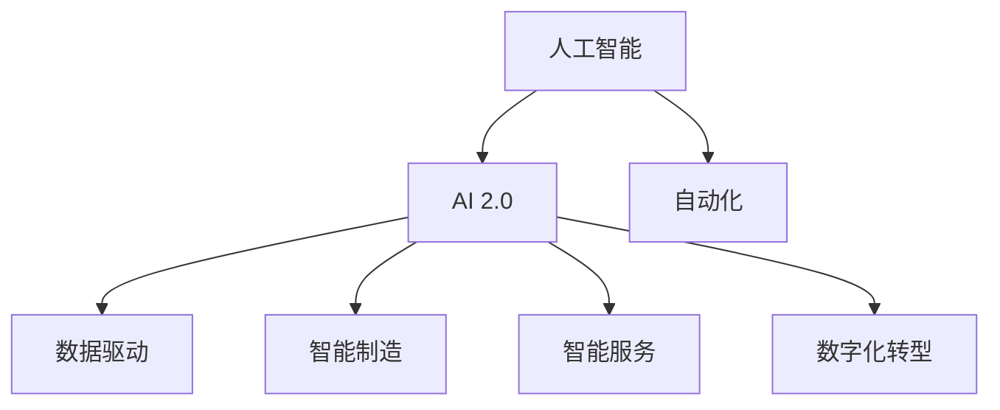

                 

# 李开复：AI 2.0 时代的产业

> 关键词：人工智能,产业升级,自动化,数据驱动,智能制造,数字经济

## 1. 背景介绍

### 1.1 问题由来
随着人工智能(AI)技术的迅猛发展，AI已经成为推动全球产业变革的关键力量。从AI 1.0时代以规则驱动、手工编写的专家系统，到AI 2.0时代的以数据驱动、自学习能力的深度学习系统，AI 技术已经渗透到各行各业，从医疗、教育到制造、金融，无所不在。特别是在AI 2.0时代，AI 技术正在由生产力工具升级为产业发展的新引擎。

### 1.2 问题核心关键点
AI 2.0时代的产业升级，核心在于将AI技术应用于各个产业的各个环节，实现从生产、管理到服务、运营的全流程自动化和智能化。这需要实现以下关键目标：
1. **数据驱动的决策**：利用大数据、机器学习和深度学习技术，从海量数据中提取知识，实现智能决策。
2. **自动化与优化**：通过AI算法优化生产流程、降低成本、提升效率。
3. **人机协同**：实现AI与人力的无缝协作，增强人机交互体验，提升工作效率。
4. **智能制造与智能服务**：推动智能制造和智能服务的普及，实现个性化定制和智能服务。
5. **数字化转型**：通过AI技术实现企业数字化转型，提升竞争力。

### 1.3 问题研究意义
AI 2.0时代的产业升级，对企业和社会的深远影响不言而喻：
1. **提高效率**：AI 技术可以大幅度提高生产效率，降低运营成本，提升企业竞争力。
2. **增强创新能力**：AI 技术为企业的创新提供了新工具和新思路，加速产品迭代和市场响应速度。
3. **改善用户体验**：AI 技术可以提供个性化、智能化的用户体验，提升客户满意度。
4. **优化资源配置**：AI 技术可以帮助企业更有效地配置资源，优化供应链管理，实现可持续发展。
5. **推动社会进步**：AI 技术在医疗、教育、环保等领域的应用，可以解决社会问题，提升生活质量。

## 2. 核心概念与联系

### 2.1 核心概念概述

为更好地理解AI 2.0时代的产业升级，本节将介绍几个密切相关的核心概念：

- **人工智能(AI)**：指使计算机能够模拟人类的智能行为，包括感知、认知、学习、决策等能力。AI 技术可以分为符号AI、专家系统、统计学习、深度学习等不同阶段。

- **AI 2.0**：指新一代人工智能技术，即基于数据驱动、深度学习、自监督学习、强化学习等技术的智能系统。AI 2.0 时代的AI 技术更加强大、灵活，可以应用于更广泛的领域和场景。

- **自动化(Automation)**：指通过AI技术实现生产、管理、服务等环节的自动化操作，减少人为干预，提高效率。

- **数据驱动(Data-Driven)**：指基于大数据和AI技术，通过分析数据、提取知识、优化决策，实现智能化生产和管理。

- **智能制造(Smart Manufacturing)**：指利用AI技术优化生产流程、提高生产效率、实现智能制造和个性化定制。

- **智能服务(Smart Service)**：指通过AI技术提供智能化的客户服务、产品推荐、信息推送等服务，提升用户体验。

- **数字化转型(Digital Transformation)**：指企业利用AI、大数据、云计算等技术，实现业务流程、管理模式、客户体验的数字化升级。

这些核心概念之间的逻辑关系可以通过以下Mermaid流程图来展示：



这个流程图展示了AI技术在各产业领域的应用，以及AI 2.0时代的技术升级对产业的影响。

## 3. 核心算法原理 & 具体操作步骤
### 3.1 算法原理概述

AI 2.0时代的产业升级，核心在于利用AI技术实现各个产业环节的自动化和智能化。其核心思想是：将AI技术嵌入到生产、管理、服务等环节，通过数据分析、算法优化、自动化控制等手段，提升生产效率、降低成本、优化用户体验。

形式化地，假设某产业的生产流程为 $P$，其目标是通过AI技术优化流程，使得最终输出的产品和服务 $Y$ 最大化。优化目标可以表示为：

$$
\mathop{\arg\min}_{P} \mathcal{L}(P,Y)
$$

其中 $\mathcal{L}$ 为评价指标，用于衡量生产流程 $P$ 在产出 $Y$ 上的性能。常见的评价指标包括生产效率、产品质量、成本、客户满意度等。

通过优化算法（如梯度下降、遗传算法等），不断调整生产流程 $P$，最小化损失函数 $\mathcal{L}$，使得生产流程输出尽可能接近理想目标 $Y$。

### 3.2 算法步骤详解

AI 2.0时代的产业升级，一般包括以下几个关键步骤：

**Step 1: 数据收集与预处理**
- 收集各个环节的数据，如生产数据、质量数据、用户反馈数据等，确保数据质量。
- 进行数据清洗、特征提取、归一化等预处理工作，为后续建模提供干净的数据集。

**Step 2: 构建AI模型**
- 根据具体问题选择合适的AI模型，如机器学习、深度学习、强化学习等。
- 设计模型架构，确定模型参数。
- 使用训练集数据训练模型，调整参数，优化模型性能。

**Step 3: 部署与测试**
- 将训练好的模型部署到生产环境中，进行实际运行。
- 使用测试集数据对模型进行评估，检查模型是否符合预期。
- 根据评估结果调整模型参数，优化模型性能。

**Step 4: 持续优化与迭代**
- 收集实时数据，监控模型性能，进行持续优化。
- 定期更新模型，引入新数据和新算法，提高模型性能。
- 建立反馈机制，根据用户反馈不断优化模型。

### 3.3 算法优缺点

AI 2.0时代的产业升级，具有以下优点：
1. **提升效率**：通过自动化和智能化操作，大幅度提高生产效率，降低运营成本。
2. **优化决策**：利用大数据和AI技术，从海量数据中提取知识，实现智能决策。
3. **增强创新能力**：AI技术为企业的创新提供了新工具和新思路，加速产品迭代和市场响应速度。
4. **改善用户体验**：通过智能服务、个性化推荐等手段，提升客户满意度。
5. **优化资源配置**：AI技术可以帮助企业更有效地配置资源，优化供应链管理，实现可持续发展。

同时，该方法也存在一定的局限性：
1. **数据质量要求高**：AI技术依赖高质量的数据，数据噪声和偏差会影响模型性能。
2. **技术门槛高**：AI技术的实施需要专业的知识和技能，对企业提出了较高的技术要求。
3. **成本投入高**：AI技术的部署和维护需要较大的投入，对于中小企业而言，可能难以承受。
4. **安全与隐私问题**：AI技术的应用可能涉及数据隐私和安全问题，需要建立有效的保护机制。
5. **依赖性强**：AI技术的成功应用依赖于数据的获取和处理，对于数据不充分的行业，可能难以实现。

尽管存在这些局限性，但就目前而言，AI 2.0时代的产业升级仍是大势所趋，各个产业都在积极推进AI技术的落地应用。

### 3.4 算法应用领域

AI 2.0时代的产业升级，已经在许多领域取得了显著成效：

- **制造业**：智能制造、自动化生产、质量控制、供应链管理等。通过AI技术实现自动化、智能化生产，提升生产效率和产品质量。
- **医疗健康**：医学影像分析、病患诊断、个性化治疗、健康管理等。利用AI技术提升医疗服务质量和效率，改善患者体验。
- **金融服务**：风险评估、欺诈检测、投资分析、智能投顾等。通过AI技术提高金融服务的安全性和效率，增强客户信任。
- **零售电商**：个性化推荐、库存管理、客户服务、物流优化等。利用AI技术提升零售电商的运营效率和用户体验。
- **能源环保**：智能电网、能源优化、环境保护、资源管理等。通过AI技术实现能源的高效利用和环境保护，推动可持续发展。
- **交通运输**：自动驾驶、交通控制、智能调度、物流优化等。利用AI技术提升交通运输的安全性和效率，改善交通状况。

除了上述这些经典领域外，AI 2.0时代的产业升级还在教育、媒体、旅游等更多场景中得到应用，为各行业带来了新的发展机遇。

## 4. 数学模型和公式 & 详细讲解  
### 4.1 数学模型构建

本节将使用数学语言对AI 2.0时代的产业升级进行更加严格的刻画。

假设某产业的生产流程为 $P$，其目标是通过AI技术优化流程，使得最终输出的产品和服务 $Y$ 最大化。优化目标可以表示为：

$$
\mathop{\arg\min}_{P} \mathcal{L}(P,Y)
$$

其中 $\mathcal{L}$ 为评价指标，用于衡量生产流程 $P$ 在产出 $Y$ 上的性能。常见的评价指标包括生产效率、产品质量、成本、客户满意度等。

以制造业为例，假设生产流程为机器加工，输入为原材料，输出为成品。目标是通过AI技术优化机器加工参数，使得成品质量最大化。则优化目标可以表示为：

$$
\mathop{\arg\min}_{\theta} \mathcal{L}(\theta,X,Y)
$$

其中 $\theta$ 为机器加工参数，$X$ 为原材料数据，$Y$ 为成品质量数据。常用的损失函数包括均方误差损失（MSE）、交叉熵损失（CE）等。例如，均方误差损失可以表示为：

$$
\mathcal{L}(\theta,X,Y) = \frac{1}{N} \sum_{i=1}^N (y_i - f_{\theta}(x_i))^2
$$

其中 $y_i$ 为实际成品质量，$f_{\theta}(x_i)$ 为模型预测的成品质量。

### 4.2 公式推导过程

以下我们以机器加工为例，推导机器学习模型的损失函数及其梯度的计算公式。

假设模型 $f_{\theta}(x)$ 为线性回归模型，其中 $\theta$ 为线性回归参数。则在输入 $x$ 上的预测值为 $f_{\theta}(x) = \theta^T x$，其与真实值 $y$ 的误差为 $e = y - f_{\theta}(x)$。则均方误差损失可以表示为：

$$
\mathcal{L}(\theta) = \frac{1}{N} \sum_{i=1}^N (y_i - \theta^T x_i)^2
$$

根据链式法则，损失函数对参数 $\theta$ 的梯度为：

$$
\frac{\partial \mathcal{L}(\theta)}{\partial \theta} = \frac{2}{N} \sum_{i=1}^N -2y_i x_i
$$

其中 $x_i$ 为输入向量，$y_i$ 为真实标签。

在得到损失函数的梯度后，即可带入参数更新公式，完成模型的迭代优化。重复上述过程直至收敛，最终得到适应生产流程的模型参数 $\theta$。

## 5. 项目实践：代码实例和详细解释说明
### 5.1 开发环境搭建

在进行AI 2.0时代的产业升级实践前，我们需要准备好开发环境。以下是使用Python进行TensorFlow开发的环境配置流程：

1. 安装Anaconda：从官网下载并安装Anaconda，用于创建独立的Python环境。

2. 创建并激活虚拟环境：
```bash
conda create -n ai_env python=3.8 
conda activate ai_env
```

3. 安装TensorFlow：根据CUDA版本，从官网获取对应的安装命令。例如：
```bash
pip install tensorflow
```

4. 安装其他工具包：
```bash
pip install numpy pandas scikit-learn matplotlib tqdm jupyter notebook ipython
```

完成上述步骤后，即可在`ai_env`环境中开始AI 2.0时代的产业升级实践。

### 5.2 源代码详细实现

这里我们以智能制造的预测性维护为例，给出使用TensorFlow进行机器学习模型训练的Python代码实现。

首先，定义机器学习模型的训练函数：

```python
import tensorflow as tf
from tensorflow.keras.models import Sequential
from tensorflow.keras.layers import Dense, Dropout, LSTM

def train_model(model, train_data, train_labels, epochs, batch_size, optimizer):
    model.compile(loss='mse', optimizer=optimizer, metrics=['mse'])
    history = model.fit(train_data, train_labels, epochs=epochs, batch_size=batch_size, validation_split=0.2)
    return history
```

然后，定义数据生成器和模型构建函数：

```python
from tensorflow.keras.utils import to_categorical

def generate_data(n_samples=1000, n_features=4, n_labels=1):
    # 生成随机数据和标签
    X = 2 * np.random.randn(n_samples, n_features) - 1
    y = np.mean(X ** 2, axis=1) + np.random.randn(n_samples) * 0.1
    
    # 将数据转换为训练数据
    X = (X - np.mean(X, axis=0)) / np.std(X, axis=0)
    X = X.reshape(n_samples, n_features, 1)
    
    # 将标签转换为独热编码
    y = to_categorical(y, num_classes=2)
    
    return X, y

def build_model(input_dim, output_dim):
    model = Sequential()
    model.add(LSTM(64, input_shape=(input_dim, 1), return_sequences=True))
    model.add(LSTM(32, return_sequences=True))
    model.add(Dense(output_dim))
    model.compile(loss='mse', optimizer='adam', metrics=['mse'])
    return model
```

接着，定义训练过程：

```python
n_samples = 1000
n_features = 4
n_labels = 1
epochs = 100
batch_size = 32
optimizer = tf.keras.optimizers.Adam(learning_rate=0.001)

# 生成训练数据
X, y = generate_data(n_samples, n_features, n_labels)

# 构建模型
model = build_model(n_features, n_labels)

# 训练模型
history = train_model(model, X, y, epochs, batch_size, optimizer)

# 输出训练结果
print(history.history['loss'])
```

以上就是使用TensorFlow进行预测性维护的机器学习模型训练的完整代码实现。可以看到，利用TensorFlow可以很方便地构建、训练和评估机器学习模型。

### 5.3 代码解读与分析

让我们再详细解读一下关键代码的实现细节：

**train_model函数**：
- 使用TensorFlow的Sequential模型构建序列模型。
- 添加LSTM层、Dense层等，并编译模型。
- 使用fit方法训练模型，返回训练历史（history）。

**generate_data函数**：
- 生成随机数据和标签，并进行归一化和独热编码。
- 将数据转换为LSTM模型的输入格式。

**build_model函数**：
- 定义LSTM模型的架构，使用Sequential模型。
- 添加LSTM层、Dense层等，并编译模型。

**训练过程**：
- 定义模型参数，生成训练数据。
- 构建模型并训练，输出训练历史。

通过以上步骤，实现了基于TensorFlow的预测性维护机器学习模型的训练。

## 6. 实际应用场景
### 6.1 智能制造

智能制造是AI 2.0时代的典型应用场景之一。通过AI技术优化生产流程，可以实现生产自动化、智能化，提升生产效率和产品质量。

具体而言，可以通过AI技术实现以下应用：
- **预测性维护**：利用机器学习模型对机器状态进行预测，及时发现和预防设备故障，降低停机时间和维护成本。
- **质量控制**：通过图像识别、深度学习等技术，实时监控生产过程中的产品质量，及时调整生产参数。
- **生产调度**：利用优化算法优化生产调度，合理分配资源，提高生产效率。
- **库存管理**：利用AI技术优化库存管理，实时监控库存状态，避免库存积压和短缺。

### 6.2 医疗健康

AI 2.0时代在医疗健康领域的应用，可以显著提升医疗服务质量和效率。通过AI技术，可以实现以下应用：
- **医学影像分析**：利用深度学习技术对医学影像进行自动分析和诊断，辅助医生诊断。
- **病患诊断**：通过自然语言处理技术，分析患者的病历记录，提供诊断建议。
- **个性化治疗**：利用机器学习模型，对患者的历史数据进行分析和预测，提供个性化的治疗方案。
- **健康管理**：利用AI技术进行健康数据分析，提供个性化的健康建议。

### 6.3 金融服务

AI 2.0时代在金融服务领域的应用，可以显著提高金融服务的效率和安全性。通过AI技术，可以实现以下应用：
- **风险评估**：利用机器学习模型，对客户的信用、行为进行评估，提供风险预警。
- **欺诈检测**：通过异常检测算法，对交易行为进行实时监控，及时发现和预防欺诈行为。
- **投资分析**：利用自然语言处理技术，分析市场数据，提供投资建议。
- **智能投顾**：利用AI技术，提供智能化的投资顾问服务，提升客户满意度。

### 6.4 未来应用展望

随着AI 2.0技术的不断发展和普及，未来AI 2.0时代的应用场景将更加广泛和深入。

- **智能城市**：通过AI技术实现城市智能管理，优化交通、能源、环保等环节，提升城市运行效率。
- **智慧农业**：利用AI技术优化农业生产，实现精准农业、智慧农场。
- **智能教育**：通过AI技术优化教育资源配置，提供个性化教育服务，提升教育质量。
- **智能安防**：利用AI技术优化安防监控系统，实现智能识别、预警、报警等功能，提升安全保障。
- **智能交互**：通过AI技术提升人机交互体验，实现语音、图像、自然语言等多种方式的智能交互。

## 7. 工具和资源推荐
### 7.1 学习资源推荐

为了帮助开发者系统掌握AI 2.0时代的产业升级的理论基础和实践技巧，这里推荐一些优质的学习资源：

1. 《深度学习》（Ian Goodfellow等著）：深入浅出地介绍了深度学习的基本概念、算法和应用。
2. 《TensorFlow实战》（李沐等著）：介绍了TensorFlow框架的使用方法和实战案例。
3. 《人工智能原理与技术》（周志华著）：系统地介绍了AI技术的原理、算法和应用。
4. Coursera《深度学习专项课程》：斯坦福大学提供的深度学习课程，包括基础和高级课程。
5. Udacity《深度学习纳米学位》：涵盖深度学习的基本概念、算法和应用。

通过对这些资源的学习实践，相信你一定能够快速掌握AI 2.0时代的产业升级的精髓，并用于解决实际的产业问题。
###  7.2 开发工具推荐

高效的开发离不开优秀的工具支持。以下是几款用于AI 2.0时代的产业升级开发的常用工具：

1. TensorFlow：由Google主导开发的开源深度学习框架，生产部署方便，适合大规模工程应用。
2. PyTorch：基于Python的开源深度学习框架，灵活性高，适合快速迭代研究。
3. Keras：基于TensorFlow和Theano的高层API，易于上手，适合快速构建模型。
4. Jupyter Notebook：交互式Python开发环境，方便进行代码调试和数据可视化。
5. Visual Studio Code：跨平台的开发环境，支持多种编程语言和插件。
6. GitHub：代码托管平台，方便版本控制和协作开发。

合理利用这些工具，可以显著提升AI 2.0时代的产业升级任务的开发效率，加快创新迭代的步伐。

### 7.3 相关论文推荐

AI 2.0时代的产业升级得益于学界的持续研究。以下是几篇奠基性的相关论文，推荐阅读：

1. DeepMind的AlphaGo论文：利用深度学习和强化学习技术，实现围棋的智能对弈。
2. Google的BERT论文：提出BERT模型，引入基于掩码的自监督预训练任务，刷新了多项NLP任务SOTA。
3. OpenAI的GPT-3论文：提出GPT-3模型，展示了大规模语言模型的强大zero-shot学习能力。
4. Facebook的XGBoost论文：提出梯度提升树算法，在多个数据集上取得了优异的效果。
5. Microsoft的AdaBoost论文：提出AdaBoost算法，广泛应用于分类和回归任务中。

这些论文代表了大规模AI技术的发展脉络。通过学习这些前沿成果，可以帮助研究者把握学科前进方向，激发更多的创新灵感。

## 8. 总结：未来发展趋势与挑战

### 8.1 研究成果总结

AI 2.0时代的产业升级，已经成为推动全球产业变革的关键力量。从制造业、医疗健康、金融服务到智能城市、智慧农业、智能教育，AI 技术在各个领域的应用取得了显著成效，显著提升了生产效率、服务质量、运营效率等。

### 8.2 未来发展趋势

展望未来，AI 2.0时代的产业升级将呈现以下几个发展趋势：

1. **AI技术的普及**：随着AI技术的不断发展和成熟，AI技术将在更多领域得到广泛应用，推动各行业实现数字化转型。
2. **AI技术的融合**：AI技术与物联网、大数据、区块链等技术的深度融合，将带来更多的创新应用场景。
3. **AI技术的标准化**：AI技术的标准化、规范化将加速其普及应用，提升行业竞争力。
4. **AI技术的智能化**：AI技术将更加智能化、自适应化，实现更加精准、高效的决策和控制。
5. **AI技术的安全性**：随着AI技术在各个领域的广泛应用，如何保障AI技术的安全性和伦理道德，将成为重要课题。

### 8.3 面临的挑战

尽管AI 2.0时代的产业升级前景广阔，但在迈向更加智能化、普适化应用的过程中，仍面临诸多挑战：

1. **数据隐私和安全**：AI技术的应用涉及大量数据，如何保障数据隐私和安全，避免数据泄露和滥用，将成为重要问题。
2. **技术壁垒高**：AI技术的实施需要高水平的技术和专业知识，对企业提出了较高的技术要求。
3. **成本投入高**：AI技术的部署和维护需要较大的投入，对于中小企业而言，可能难以承受。
4. **伦理道德问题**：AI技术的应用可能涉及伦理道德问题，如算法偏见、歧视等，需要建立有效的监管机制。
5. **模型鲁棒性不足**：AI模型在面对未知数据时，可能出现泛化能力不足的问题，需要进一步提高模型的鲁棒性和泛化能力。

### 8.4 研究展望

面对AI 2.0时代的产业升级所面临的挑战，未来的研究需要在以下几个方面寻求新的突破：

1. **数据隐私保护**：研究如何在保障数据隐私和安全的前提下，充分利用数据进行AI技术开发。
2. **模型鲁棒性提升**：研究如何提高AI模型的鲁棒性和泛化能力，增强其在未知数据上的表现。
3. **AI技术的标准化**：研究如何制定AI技术的标准和规范，推动AI技术的普及应用。
4. **AI技术的伦理道德**：研究如何建立AI技术的伦理道德标准，避免算法偏见和歧视。
5. **AI技术的多模态融合**：研究如何实现多模态数据融合，提升AI技术的综合能力。

这些研究方向的探索，必将引领AI 2.0时代的产业升级技术迈向更高的台阶，为各行业带来更加智能化、高效化、安全化的新发展机遇。

## 9. 附录：常见问题与解答

**Q1：AI 2.0时代的产业升级是否适用于所有行业？**

A: AI 2.0时代的产业升级具有广泛适用性，但对于一些特定领域的行业，如医疗、金融、能源等，可能面临较高的技术门槛和数据隐私问题。因此，需要根据具体行业特点进行技术和数据的适配。

**Q2：如何选择合适的AI技术？**

A: 选择合适的AI技术需要考虑多个因素，如行业特点、数据类型、业务需求等。一般来说，可以从以下几个方面入手：
1. 明确业务目标和需求，选择最合适的AI技术。
2. 评估数据类型和质量，选择合适的算法和模型。
3. 考虑技术实现成本和可行性，选择合适的平台和工具。

**Q3：AI 2.0时代的产业升级面临哪些技术挑战？**

A: AI 2.0时代的产业升级面临以下技术挑战：
1. 数据隐私和安全问题。
2. 高技术门槛和成本投入。
3. 模型鲁棒性和泛化能力不足。
4. 伦理道德问题。
5. 多模态数据融合。

这些挑战需要从技术、管理、伦理等多个角度进行综合考虑，寻找最优解决方案。

**Q4：AI 2.0时代的产业升级如何提高效率和质量？**

A: AI 2.0时代的产业升级可以通过以下几个方面提高效率和质量：
1. 利用AI技术优化生产流程，实现自动化和智能化。
2. 利用大数据和AI技术进行智能决策和优化。
3. 利用AI技术进行实时监控和预测，及时发现和预防问题。
4. 利用AI技术进行个性化推荐和定制，提高客户满意度和体验。

**Q5：AI 2.0时代的产业升级如何实现可持续发展？**

A: AI 2.0时代的产业升级可以通过以下几个方面实现可持续发展：
1. 优化资源配置，提高资源利用效率。
2. 利用AI技术进行环境监测和保护，减少环境污染。
3. 实现智能制造和智能服务，提升生产效率和用户体验。
4. 建立智能供应链，优化物流和库存管理。

通过以上措施，可以有效实现产业的可持续发展。

---

作者：禅与计算机程序设计艺术 / Zen and the Art of Computer Programming

