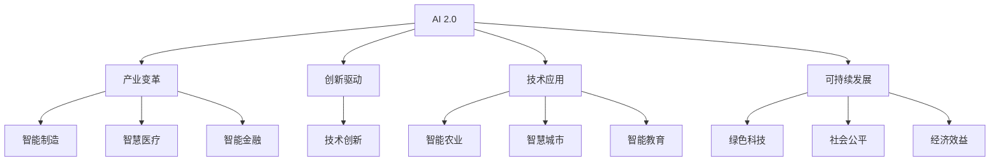

                 

# 李开复：AI 2.0 时代的产业

> 关键词：人工智能(AI), AI 2.0, 产业变革, 创新驱动, 技术应用, 可持续发展

## 1. 背景介绍

### 1.1 问题由来
当前，人工智能(AI)正处于一个快速发展的历史阶段，被称为AI 2.0时代。这一时代的到来，得益于大数据、深度学习、云计算等技术的成熟与普及，使得AI技术的应用场景更加广泛，影响更加深远。AI 2.0时代不仅改变了信息技术产业的格局，还深刻影响了各个传统行业，推动了产业升级和数字化转型。

### 1.2 问题核心关键点
AI 2.0时代的核心在于其强大的计算能力和数据处理能力，以及其在各个领域的应用潜力。AI技术的快速发展，催生了大量新的商业模式和产业生态，同时也带来了新的挑战和机遇。如何充分利用AI技术，推动产业创新和发展，是当前和未来面临的重要问题。

### 1.3 问题研究意义
研究AI 2.0时代的产业变革，对于推动经济结构优化升级、实现产业数字化转型、提升国家竞争力具有重要意义。通过了解AI技术在各行业的具体应用，可以更好地把握AI技术的未来发展方向，指导产业发展实践。

## 2. 核心概念与联系

### 2.1 核心概念概述

为更好地理解AI 2.0时代的技术和产业应用，本节将介绍几个密切相关的核心概念：

- AI 2.0（人工智能2.0）：指在AI 1.0（基于规则和专家系统的第一代AI技术）的基础上，通过大数据、深度学习等技术，实现更为智能、更为自适应的第二代AI技术。
- 产业变革（Industrial Transformation）：指通过引入新技术、新模式、新业态，推动传统产业的转型升级和创新发展。
- 创新驱动（Innovation-Driven）：指以技术创新为核心，驱动经济和社会发展的模式。
- 技术应用（Technology Application）：指将AI技术应用于具体行业和场景，实现智能化升级。
- 可持续发展（Sustainable Development）：指在推动产业变革的同时，注重环境保护、社会公平、经济效益等方面的协调发展。

这些核心概念之间的逻辑关系可以通过以下Mermaid流程图来展示：



这个流程图展示了AI 2.0技术在多个行业的应用及其对产业的影响，以及创新驱动、技术应用、可持续发展之间的相互作用关系。

## 3. 核心算法原理 & 具体操作步骤
### 3.1 算法原理概述

AI 2.0时代的产业应用，往往基于深度学习、强化学习、迁移学习等算法。这些算法通过大量的数据训练，不断优化模型的参数和结构，提升模型的预测和决策能力。

以深度学习为例，其核心思想是通过多层神经网络，对输入数据进行复杂的多层次特征提取和映射，最终输出预测结果。深度学习模型通常由多个隐藏层构成，每一层都能自动学习数据的特征表示，从而实现从原始数据到复杂结构的转换。

在AI 2.0时代，深度学习算法在图像识别、语音识别、自然语言处理等诸多领域取得了显著进展，成为推动产业升级的重要技术手段。

### 3.2 算法步骤详解

以下以自然语言处理(NLP)领域的深度学习应用为例，介绍AI 2.0时代的技术实现步骤：

**Step 1: 数据预处理**
- 收集和清洗NLP任务相关的文本数据。
- 进行文本分词、去除停用词、构建词汇表等预处理步骤。
- 将文本转换为模型可以处理的数值形式，如词嵌入、One-Hot编码等。

**Step 2: 构建模型架构**
- 选择合适的深度学习模型，如LSTM、GRU、Transformer等。
- 设计模型的输入层、隐藏层和输出层，以及各层的激活函数、损失函数等。
- 确定模型的超参数，如学习率、批量大小、训练轮数等。

**Step 3: 模型训练**
- 使用GPU等高性能计算设备，对模型进行批量训练。
- 根据训练数据和验证数据的损失函数值，调整模型参数，最小化预测误差。
- 监控训练过程中的性能指标，如准确率、召回率、F1值等，评估模型效果。

**Step 4: 模型评估与优化**
- 使用测试数据对模型进行评估，计算指标如AUC、ROC曲线等。
- 根据评估结果，调整模型结构、超参数或使用正则化等技术进行优化。
- 重复训练和评估过程，直到达到预期效果。

**Step 5: 模型应用**
- 将训练好的模型部署到实际应用场景中，如聊天机器人、文本分类器、情感分析器等。
- 提供API接口或直接在应用中集成模型，实现AI技术的应用。

### 3.3 算法优缺点

AI 2.0时代的深度学习算法具有以下优点：
1. 强大表现力：深度学习模型可以通过复杂的多层次特征提取，实现从原始数据到复杂结构的转换，解决复杂问题。
2. 可扩展性强：模型可以不断增加隐藏层和神经元数量，提升处理能力。
3. 自适应能力强：深度学习模型能够自动学习数据特征，适应各种数据分布。

同时，这些算法也存在一些缺点：
1. 数据依赖性强：深度学习模型需要大量标注数据进行训练，对数据获取和标注成本较高。
2. 训练复杂度高：深度学习模型训练过程复杂，对计算资源和算法调优要求较高。
3. 可解释性不足：深度学习模型通常被视为"黑盒"系统，难以解释其内部工作机制。
4. 模型过拟合风险：深度学习模型容易在训练数据上过拟合，泛化性能差。

尽管存在这些局限性，但就目前而言，深度学习算法仍然是AI 2.0时代的主要技术手段，广泛应用于NLP、计算机视觉、语音识别等多个领域。

### 3.4 算法应用领域

AI 2.0时代的深度学习算法在各个领域的应用广泛，涵盖以下典型场景：

- 自然语言处理：如文本分类、情感分析、机器翻译、问答系统等。深度学习模型通过训练，能够自动理解语言含义，生成自然流畅的文本。
- 计算机视觉：如图像识别、目标检测、人脸识别、图像生成等。深度学习模型通过卷积神经网络等结构，能够高效地处理图像数据，实现图像识别和生成。
- 语音识别：如自动语音识别、语音合成、语音情感分析等。深度学习模型通过循环神经网络等结构，能够处理语音信号，实现语音识别和生成。
- 智能制造：如质量检测、供应链管理、设备维护等。深度学习模型通过图像和传感器数据，能够实现智能制造中的质量控制和设备维护。
- 智慧医疗：如医学影像分析、疾病预测、健康管理等。深度学习模型通过医学图像和患者数据，能够实现疾病预测和诊断。
- 智能金融：如信用评分、欺诈检测、算法交易等。深度学习模型通过金融数据，能够实现智能金融中的风险评估和决策支持。
- 智慧城市：如交通管理、能源优化、环境监测等。深度学习模型通过城市数据，能够实现智慧城市中的各种智能应用。

## 4. 数学模型和公式 & 详细讲解 & 举例说明

### 4.1 数学模型构建

以NLP领域的文本分类任务为例，介绍AI 2.0时代深度学习模型的构建过程。

假设模型输入为文本 $x$，输出为分类标签 $y$。模型的目标是最小化损失函数 $\mathcal{L}$，以提升模型在分类任务上的表现。

定义模型 $M_{\theta}$，其中 $\theta$ 为模型参数。模型输出为 $\hat{y}=M_{\theta}(x)$。

则分类任务的损失函数定义为交叉熵损失：

$$
\mathcal{L}(\theta) = -\frac{1}{N}\sum_{i=1}^N y_i\log \hat{y}_i + (1-y_i)\log (1-\hat{y}_i)
$$

其中 $N$ 为样本数，$y_i$ 和 $\hat{y}_i$ 分别为样本的真实标签和模型预测概率。

### 4.2 公式推导过程

根据上述定义，我们可以对模型参数 $\theta$ 进行优化。假设优化目标为：

$$
\theta^* = \mathop{\arg\min}_{\theta} \mathcal{L}(\theta)
$$

则梯度下降算法的更新公式为：

$$
\theta \leftarrow \theta - \eta \nabla_{\theta}\mathcal{L}(\theta)
$$

其中 $\eta$ 为学习率，$\nabla_{\theta}\mathcal{L}(\theta)$ 为损失函数对模型参数的梯度。

在实际应用中，我们通常使用反向传播算法计算梯度。假设模型 $M_{\theta}$ 由多层神经网络构成，则梯度可以递归计算：

$$
\nabla_{\theta}\mathcal{L}(\theta) = \nabla_{\theta}L_{last} + \sum_{i=1}^{last-1} \nabla_{\theta}L_i \cdot \prod_{j=i}^{last-1} \frac{\partial L_j}{\partial \theta}
$$

其中 $L_{last}$ 为最后一层的损失函数，$\nabla_{\theta}L_{last}$ 为最后一层的梯度，$\nabla_{\theta}L_i$ 为中间层的梯度，$\prod_{j=i}^{last-1} \frac{\partial L_j}{\partial \theta}$ 为中间层的链式梯度。

### 4.3 案例分析与讲解

以BERT模型为例，分析其在NLP任务中的优化过程。

BERT模型采用Transformer结构，包含多个编码层和注意力机制。模型输入为文本序列 $x$，输出为分类概率 $\hat{y}$。模型通过预训练任务（如掩码语言模型和下一句预测）进行训练，学习到丰富的语言表示。

在微调BERT模型进行文本分类任务时，我们首先使用预训练模型作为初始化权重，然后根据文本分类任务的损失函数 $\mathcal{L}$ 进行优化。模型输出层通常为全连接层，其预测结果经过Softmax函数转换为概率分布：

$$
\hat{y}_i = \text{Softmax}(W^T\cdot H_i + b)
$$

其中 $W$ 为权重矩阵，$H_i$ 为模型第 $i$ 层的隐藏表示，$b$ 为偏置向量。

通过反向传播算法计算梯度，更新模型参数，最小化损失函数。在训练过程中，我们需要设置合适的学习率、批量大小、训练轮数等超参数，以及正则化技术如L2正则、Dropout等，避免过拟合。

## 5. 项目实践：代码实例和详细解释说明

### 5.1 开发环境搭建

在进行AI 2.0时代的技术应用开发前，我们需要准备好开发环境。以下是使用Python进行TensorFlow开发的环境配置流程：

1. 安装Anaconda：从官网下载并安装Anaconda，用于创建独立的Python环境。

2. 创建并激活虚拟环境：
```bash
conda create -n tf-env python=3.8 
conda activate tf-env
```

3. 安装TensorFlow：根据CUDA版本，从官网获取对应的安装命令。例如：
```bash
conda install tensorflow -c conda-forge -c pytorch -c nvidia
```

4. 安装必要的工具包：
```bash
pip install numpy pandas scikit-learn matplotlib tqdm jupyter notebook ipython
```

完成上述步骤后，即可在`tf-env`环境中开始AI 2.0时代的技术应用开发。

### 5.2 源代码详细实现

下面以自然语言处理领域的文本分类任务为例，给出使用TensorFlow进行深度学习模型微调的PyTorch代码实现。

首先，定义模型和损失函数：

```python
import tensorflow as tf
from tensorflow.keras.layers import Input, Dense, Dropout, Embedding
from tensorflow.keras.models import Model
from tensorflow.keras.losses import categorical_crossentropy
from tensorflow.keras.optimizers import Adam

class TextClassifier(tf.keras.Model):
    def __init__(self, input_dim, hidden_dim, output_dim):
        super(TextClassifier, self).__init__()
        self.embedding = Embedding(input_dim, hidden_dim)
        self.lstm = tf.keras.layers.LSTM(hidden_dim, return_sequences=True)
        self.dropout = Dropout(0.5)
        self.dense = Dense(output_dim, activation='softmax')
        
    def call(self, x):
        x = self.embedding(x)
        x = self.lstm(x)
        x = self.dropout(x)
        x = self.dense(x)
        return x

def get_model(input_dim, hidden_dim, output_dim):
    model = TextClassifier(input_dim, hidden_dim, output_dim)
    model.compile(optimizer=Adam(), loss=categorical_crossentropy, metrics=['accuracy'])
    return model
```

然后，定义训练和评估函数：

```python
import numpy as np
from tensorflow.keras.preprocessing.text import Tokenizer
from tensorflow.keras.preprocessing.sequence import pad_sequences

def train_model(model, train_data, train_labels, validation_data, validation_labels, epochs, batch_size):
    model.fit(train_data, train_labels, validation_data=validation_data, validation_labels=validation_labels, epochs=epochs, batch_size=batch_size)

def evaluate_model(model, test_data, test_labels):
    test_loss, test_acc = model.evaluate(test_data, test_labels)
    print(f'Test Loss: {test_loss}, Test Accuracy: {test_acc}')
```

接着，启动训练流程并在测试集上评估：

```python
input_dim = 10000
hidden_dim = 128
output_dim = 10

model = get_model(input_dim, hidden_dim, output_dim)
train_data, train_labels, validation_data, validation_labels, test_data, test_labels = load_data()

train_model(model, train_data, train_labels, validation_data, validation_labels, 10, 64)

evaluate_model(model, test_data, test_labels)
```

以上就是使用TensorFlow进行深度学习模型微调的完整代码实现。可以看到，得益于TensorFlow的强大封装，我们可以用相对简洁的代码完成深度学习模型的构建和微调。

### 5.3 代码解读与分析

让我们再详细解读一下关键代码的实现细节：

**TextClassifier类**：
- `__init__`方法：定义模型结构，包括嵌入层、LSTM层、Dropout层和输出层。
- `call`方法：定义模型的前向传播过程，包括嵌入、LSTM、Dropout和输出层的计算。

**get_model函数**：
- 根据输入维度、隐藏维度和输出维度，实例化并编译模型。

**train_model函数**：
- 定义模型的训练过程，包括训练数据、训练标签、验证数据、验证标签、训练轮数和批量大小。

**evaluate_model函数**：
- 定义模型的评估过程，计算测试损失和测试准确率。

**训练流程**：
- 定义模型的输入维度、隐藏维度和输出维度，加载模型和数据。
- 实例化并编译模型，设置训练参数。
- 启动训练过程，在验证集上监控模型性能。
- 在测试集上评估模型性能。

可以看到，TensorFlow提供了高度抽象和自动化的API，使得深度学习模型的开发和训练变得更加简单和高效。开发者可以将更多精力放在模型设计和参数调优上，而不必过多关注底层细节。

当然，实际应用中还需要考虑更多因素，如模型裁剪、量化加速、服务化封装等，但核心的训练流程与上述代码类似。

## 6. 实际应用场景

### 6.1 智能客服系统

AI 2.0时代的深度学习技术，可以广泛应用于智能客服系统的构建。传统的客服系统往往依赖大量人工，高峰期响应缓慢，且难以标准化。通过深度学习模型，我们可以构建7x24小时不间断的智能客服，自动理解用户意图，提供准确回复。

在技术实现上，可以收集企业内部的历史客服对话记录，将问题和最佳答复构建成监督数据，在此基础上对预训练深度学习模型进行微调。微调后的模型能够自动理解用户意图，匹配最合适的答案模板进行回复。对于客户提出的新问题，还可以接入检索系统实时搜索相关内容，动态组织生成回答。如此构建的智能客服系统，能大幅提升客户咨询体验和问题解决效率。

### 6.2 金融舆情监测

金融机构需要实时监测市场舆论动向，以便及时应对负面信息传播，规避金融风险。传统的舆情监测依赖人工，成本高、效率低。通过深度学习模型，我们可以构建自动化的金融舆情监测系统。

具体而言，可以收集金融领域相关的新闻、报道、评论等文本数据，并对其进行主题标注和情感标注。在此基础上对深度学习模型进行微调，使其能够自动判断文本属于何种主题，情感倾向是正面、中性还是负面。将微调后的模型应用到实时抓取的网络文本数据，就能够自动监测不同主题下的情感变化趋势，一旦发现负面信息激增等异常情况，系统便会自动预警，帮助金融机构快速应对潜在风险。

### 6.3 个性化推荐系统

当前的推荐系统往往只依赖用户的历史行为数据进行物品推荐，无法深入理解用户的真实兴趣偏好。通过深度学习模型，我们可以构建个性化的推荐系统，更好地挖掘用户行为背后的语义信息。

在实践中，可以收集用户浏览、点击、评论、分享等行为数据，提取和用户交互的物品标题、描述、标签等文本内容。将文本内容作为模型输入，用户的后续行为（如是否点击、购买等）作为监督信号，在此基础上微调深度学习模型。微调后的模型能够从文本内容中准确把握用户的兴趣点。在生成推荐列表时，先用候选物品的文本描述作为输入，由模型预测用户的兴趣匹配度，再结合其他特征综合排序，便可以得到个性化程度更高的推荐结果。

### 6.4 未来应用展望

随着深度学习技术的发展，AI 2.0时代的应用场景将不断拓展，为各行各业带来深远影响。

在智慧医疗领域，基于深度学习的医学影像分析、疾病预测、健康管理等应用，将提升医疗服务的智能化水平，辅助医生诊疗，加速新药开发进程。

在智能教育领域，基于深度学习模型的作业批改、学情分析、知识推荐等应用，将因材施教，促进教育公平，提高教学质量。

在智慧城市治理中，基于深度学习模型的城市事件监测、舆情分析、应急指挥等应用，将提高城市管理的自动化和智能化水平，构建更安全、高效的未来城市。

此外，在企业生产、社会治理、文娱传媒等众多领域，基于深度学习的应用也将不断涌现，为经济社会发展注入新的动力。

## 7. 工具和资源推荐
### 7.1 学习资源推荐

为了帮助开发者系统掌握深度学习技术的理论基础和实践技巧，这里推荐一些优质的学习资源：

1. 《深度学习》系列书籍：由Ian Goodfellow等作者撰写，全面介绍了深度学习的原理和应用。
2. CS231n《深度学习与计算机视觉》课程：斯坦福大学开设的计算机视觉领域权威课程，涵盖深度学习、图像识别等多个方向。
3. 《TensorFlow深度学习实战》书籍：TensorFlow官方提供的实战指南，涵盖深度学习模型构建、训练、部署等全流程。
4. Udacity《深度学习纳米学位》课程：Udacity联合TensorFlow推出的深度学习课程，通过项目实践掌握深度学习技术。
5. Coursera《机器学习》课程：由Andrew Ng教授主讲，介绍机器学习和深度学习的基本概念和应用。

通过对这些资源的学习实践，相信你一定能够快速掌握深度学习技术的精髓，并用于解决实际的NLP问题。

### 7.2 开发工具推荐

高效的开发离不开优秀的工具支持。以下是几款用于深度学习开发常用的工具：

1. TensorFlow：由Google主导开发的深度学习框架，生产部署方便，适合大规模工程应用。
2. PyTorch：基于Python的开源深度学习框架，灵活动态的计算图，适合快速迭代研究。
3. Keras：高层次的深度学习API，易于上手，适合快速原型开发。
4. Weights & Biases：模型训练的实验跟踪工具，可以记录和可视化模型训练过程中的各项指标。
5. TensorBoard：TensorFlow配套的可视化工具，可实时监测模型训练状态，并提供丰富的图表呈现方式。

合理利用这些工具，可以显著提升深度学习模型的开发效率，加快创新迭代的步伐。

### 7.3 相关论文推荐

深度学习技术的发展源于学界的持续研究。以下是几篇奠基性的相关论文，推荐阅读：

1. ImageNet Classification with Deep Convolutional Neural Networks：AlexNet的论文，介绍了深度卷积神经网络在图像分类任务中的应用。
2. GoogleNet：Inception网络的论文，提出Inception结构，显著提升模型性能。
3. RNNs for Sequence Modeling：LSTM的论文，提出长短时记忆网络，解决传统RNN的梯度消失问题。
4. Attention is All You Need：Transformer的论文，提出Transformer结构，开启预训练大模型时代。
5. BERT: Pre-training of Deep Bidirectional Transformers for Language Understanding：BERT的论文，提出掩码语言模型和下一句预测预训练任务，刷新了多项NLP任务SOTA。

这些论文代表了大规模深度学习模型的发展脉络。通过学习这些前沿成果，可以帮助研究者把握技术前进方向，激发更多的创新灵感。

## 8. 总结：未来发展趋势与挑战

### 8.1 总结

本文对AI 2.0时代的深度学习技术进行了全面系统的介绍。首先阐述了AI 2.0时代的背景和意义，明确了深度学习技术在产业变革中的重要地位。其次，从原理到实践，详细讲解了深度学习模型的构建和微调过程，给出了深度学习模型微调的完整代码实例。同时，本文还广泛探讨了深度学习模型在各个行业的应用前景，展示了深度学习技术的广阔前景。

通过本文的系统梳理，可以看到，深度学习技术正在成为AI 2.0时代的主要技术手段，极大地拓展了各行业的智能化应用边界，催生了更多的落地场景。受益于深度学习技术的不断进步，相信NLP技术将在更广阔的应用领域大放异彩，深刻影响人类的生产生活方式。

### 8.2 未来发展趋势

展望未来，深度学习技术将在以下几个方向继续发展：

1. 模型规模持续增大。随着算力成本的下降和数据规模的扩张，深度学习模型的参数量还将持续增长。超大规模模型蕴含的丰富知识，将进一步提升各行业应用的表现。

2. 模型自适应能力增强。深度学习模型将通过更多自监督预训练和迁移学习，提升模型的通用性和泛化性能。

3. 模型效率提升。未来将发展更加高效的深度学习算法，如神经网络剪枝、量化加速、模型压缩等，提升模型的计算效率和部署速度。

4. 模型鲁棒性增强。深度学习模型将通过对抗训练、模型蒸馏、多模态学习等技术，提升模型的鲁棒性和抗干扰能力。

5. 模型可解释性增强。深度学习模型将通过可解释性技术，如因果推断、对抗样本生成等，提高模型的可解释性和透明性。

6. 模型与外部知识结合。未来深度学习模型将更多地与专家知识、逻辑规则、符号表示等结合，提升模型的智能水平和知识整合能力。

以上趋势凸显了深度学习技术的广阔前景。这些方向的探索发展，必将进一步提升深度学习模型的性能和应用范围，为经济社会发展注入新的动力。

### 8.3 面临的挑战

尽管深度学习技术在AI 2.0时代取得了显著进展，但在迈向更加智能化、普适化应用的过程中，仍面临诸多挑战：

1. 数据依赖性强。深度学习模型需要大量标注数据进行训练，对数据获取和标注成本较高。如何充分利用未标注数据，提高模型泛化能力，是未来面临的重要问题。

2. 模型过拟合风险。深度学习模型容易在训练数据上过拟合，泛化性能差。如何缓解过拟合风险，提高模型的鲁棒性，是未来需要解决的重要问题。

3. 模型复杂度高。深度学习模型的复杂度高，计算资源和算法调优要求较高。如何在保证性能的同时，降低模型复杂度，提高模型效率，是未来需要关注的问题。

4. 模型可解释性不足。深度学习模型通常被视为"黑盒"系统，难以解释其内部工作机制。如何赋予模型更强的可解释性，提高系统的透明度和可信度，是未来需要解决的问题。

5. 模型偏见风险。深度学习模型容易学习到数据中的偏见和有害信息，如何过滤和防止模型偏见，是未来需要解决的问题。

6. 模型伦理风险。深度学习模型的广泛应用，可能带来隐私泄露、歧视等问题。如何在技术应用中注重伦理和法律约束，保障社会公平和数据安全，是未来需要解决的问题。

正视深度学习技术面临的这些挑战，积极应对并寻求突破，将是大规模深度学习模型迈向成熟的必由之路。相信随着学界和产业界的共同努力，这些挑战终将一一被克服，深度学习技术必将在构建智能系统、推动产业变革中扮演越来越重要的角色。

### 8.4 研究展望

未来，深度学习技术的发展需要在以下几个方面寻求新的突破：

1. 探索无监督和半监督学习。摆脱对大规模标注数据的依赖，利用自监督学习、主动学习等无监督和半监督范式，最大限度利用未标注数据，实现更加灵活高效的模型训练。

2. 研究参数高效和计算高效的模型。开发更加参数高效的模型，在固定大部分预训练参数的同时，只更新极少量的任务相关参数。同时优化模型计算图，减少前向传播和反向传播的资源消耗，实现更加轻量级、实时性的部署。

3. 融合因果推断和对比学习。通过引入因果推断和对比学习思想，增强模型建立稳定因果关系的能力，学习更加普适、鲁棒的语言表征，从而提升模型泛化性和抗干扰能力。

4. 引入更多先验知识。将符号化的先验知识，如知识图谱、逻辑规则等，与神经网络模型进行巧妙融合，引导模型学习更准确、合理的语言模型。同时加强不同模态数据的整合，实现视觉、语音等多模态信息与文本信息的协同建模。

5. 结合因果分析和博弈论工具。将因果分析方法引入深度学习模型，识别出模型决策的关键特征，增强输出解释的因果性和逻辑性。借助博弈论工具刻画人机交互过程，主动探索并规避模型的脆弱点，提高系统稳定性。

6. 纳入伦理道德约束。在模型训练目标中引入伦理导向的评估指标，过滤和惩罚有偏见、有害的输出倾向。同时加强人工干预和审核，建立模型行为的监管机制，确保输出符合人类价值观和伦理道德。

这些研究方向的探索，必将引领深度学习技术迈向更高的台阶，为构建安全、可靠、可解释、可控的智能系统铺平道路。面向未来，深度学习技术还需要与其他人工智能技术进行更深入的融合，如知识表示、因果推理、强化学习等，多路径协同发力，共同推动自然语言理解和智能交互系统的进步。只有勇于创新、敢于突破，才能不断拓展深度学习模型的边界，让智能技术更好地造福人类社会。

## 9. 附录：常见问题与解答

**Q1：AI 2.0时代的技术应用对产业变革的影响有多大？**

A: AI 2.0时代的技术应用正在重塑各个行业的生产方式和商业模式。例如，智能制造、智慧医疗、智能金融等领域，通过引入深度学习、自然语言处理等技术，显著提升了生产效率、服务质量和决策支持能力。未来，随着AI技术的不断进步，AI 2.0时代的应用将更加广泛，对产业变革的影响也将越来越大。

**Q2：深度学习模型如何实现自适应？**

A: 深度学习模型通过自监督预训练和迁移学习，实现对新数据和任务的快速适应。在自监督预训练阶段，模型通过大量的未标注数据进行学习，学习到通用的语言或视觉特征表示。在迁移学习阶段，模型通过少量标注数据进行微调，适应新任务的要求。此外，通过对抗训练、模型蒸馏等技术，模型还能够提升鲁棒性和泛化性能。

**Q3：如何应对深度学习模型的高数据依赖性？**

A: 应对深度学习模型的高数据依赖性，主要可以通过以下几种方法：
1. 数据增强：通过回译、近义替换等方式扩充训练集。
2. 自监督学习：利用未标注数据进行自监督学习，学习通用的语言或视觉特征表示。
3. 半监督学习：利用少量标注数据和大量未标注数据进行半监督学习，提高模型的泛化能力。
4. 少样本学习：通过模型微调，利用少量标注样本进行快速适应新任务。
5. 无监督学习：通过无监督学习，最大化利用未标注数据进行模型训练。

**Q4：深度学习模型如何避免过拟合？**

A: 避免深度学习模型过拟合，主要可以通过以下几种方法：
1. 数据增强：通过回译、近义替换等方式扩充训练集。
2. 正则化：使用L2正则、Dropout等正则化技术，防止模型过度适应训练集。
3. 早停策略：在验证集上监控模型性能，一旦性能不再提升，立即停止训练。
4. 对抗训练：引入对抗样本，提高模型鲁棒性。
5. 模型蒸馏：通过知识蒸馏，将大模型和小模型结合，提升小模型的泛化能力。

**Q5：深度学习模型在实际应用中如何提高可解释性？**

A: 提高深度学习模型的可解释性，主要可以通过以下几种方法：
1. 可视化技术：通过可视化模型内部激活值，理解模型的决策过程。
2. 因果推断：利用因果推断方法，解释模型输出的因果关系。
3. 对抗样本生成：通过生成对抗样本，揭示模型的脆弱点和决策机制。
4. 规则提取：利用规则提取技术，提取模型的显式知识表示。
5. 逻辑推理：通过逻辑推理方法，解释模型的推理过程。

通过这些方法的结合应用，深度学习模型能够更好地解释其决策过程，提高模型的透明度和可信度。

---

作者：禅与计算机程序设计艺术 / Zen and the Art of Computer Programming

