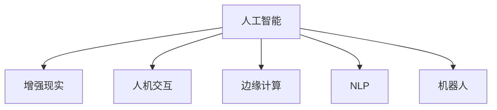

                 

# 李开复：AI 2.0 时代的应用

## 1. 背景介绍

### 1.1 问题由来

随着人工智能（AI）技术的迅猛发展，AI 2.0 时代已经悄然到来。AI 2.0 强调人工智能与人类交互能力的提升，而非仅仅追求算力的突破。这一转变，使得AI 应用更加贴近现实生活，在教育、医疗、金融、制造等多个领域展现出了巨大的潜力。李开复，作为全球知名的 AI 专家，其关于 AI 2.0 时代应用的见解，对于理解 AI 技术如何在现实生活中落地具有重要的参考价值。

### 1.2 问题核心关键点

李开复指出，AI 2.0 时代的应用，主要集中在以下几个方面：

1. **增强人类感知与决策**：利用 AI 提升人类在视觉、听觉、语音等方面的感知能力，以及推理、决策的能力。
2. **优化生产效率**：通过 AI 在制造业、物流、服务行业等场景中的应用，提升生产效率和运营效率。
3. **个性化推荐与服务**：通过 AI 技术实现个性化推荐、智能客服、虚拟助手等应用，提升用户体验。
4. **辅助医疗与健康管理**：利用 AI 在医学影像分析、个性化医疗、健康监测等领域提供支持。
5. **教育与学习**：通过 AI 提供个性化学习路径、智能辅导、自动评分等服务，提升教育效果。

### 1.3 问题研究意义

李开复认为，AI 2.0 时代的应用，不仅是技术进步的体现，更是对人类生活方式、工作方式乃至思维方式的一次深刻变革。通过 AI 技术与各个领域的深度融合，可以大幅提升效率、降低成本，推动社会进步。

## 2. 核心概念与联系

### 2.1 核心概念概述

为了更好地理解 AI 2.0 时代的应用，本节将介绍几个关键概念及其相互联系：

1. **人工智能（AI）**：通过机器学习、深度学习等技术，使计算机系统具备类似于人类的智能处理能力。
2. **增强现实（AR）**：通过计算机视觉、传感器技术等手段，将虚拟信息叠加到现实世界中，增强用户体验。
3. **人机交互（HMI）**：通过语音、手势、视觉等技术，实现人与机器的高效互动。
4. **边缘计算（Edge Computing）**：将数据处理和存储从中心服务器移到网络边缘设备，提升数据处理速度和隐私保护。
5. **自然语言处理（NLP）**：使计算机能够理解、生成和处理人类语言，实现自然语言与计算机的交互。
6. **机器人**：通过机械臂、传感器、摄像头等技术，实现自动化的物理操作。

这些概念之间的逻辑关系可以通过以下 Mermaid 流程图来展示：



这个流程图展示了一些核心概念及其相互关系：

1. 人工智能是其他概念的基础，通过AI技术，可以实现增强现实、人机交互、边缘计算、自然语言处理和机器人等功能。
2. 增强现实通过AI技术实现虚拟信息与现实世界的融合。
3. 人机交互通过AI技术实现人与机器的高效互动。
4. 边缘计算通过AI技术提升数据处理和存储的效率和安全性。
5. 自然语言处理通过AI技术实现计算机对人类语言的理解与处理。
6. 机器人通过AI技术实现自动化的物理操作。

## 3. 核心算法原理 & 具体操作步骤

### 3.1 算法原理概述

AI 2.0 时代的应用，依赖于一系列复杂的算法和计算模型。这些算法和模型通过大量的数据训练，逐渐优化其性能，以适应具体的应用场景。

### 3.2 算法步骤详解

李开复详细介绍了 AI 2.0 时代应用开发的具体步骤：

1. **需求分析**：明确应用目标，分析用户需求和场景。
2. **数据收集与预处理**：收集相关数据，并进行清洗、标注等预处理工作。
3. **模型选择与训练**：选择合适的 AI 模型，利用预处理后的数据进行训练。
4. **模型评估与调优**：通过验证集等手段评估模型性能，根据评估结果进行模型调优。
5. **部署与测试**：将训练好的模型部署到实际应用中，并进行测试和优化。
6. **持续迭代**：根据反馈和数据分析，持续迭代优化模型。

### 3.3 算法优缺点

AI 2.0 时代的算法，具有以下优点：

1. **高效**：通过机器学习和深度学习等技术，可以快速处理大量数据，提升效率。
2. **智能化**：通过优化算法，可以实现更加智能化的决策和推理。
3. **适应性强**：AI 算法可以根据具体应用场景进行调整和优化。

同时，AI 算法也存在以下缺点：

1. **依赖数据**：算法的性能高度依赖于训练数据的数量和质量。
2. **计算资源需求高**：需要大量的计算资源进行模型训练和优化。
3. **解释性不足**：某些算法的决策过程缺乏可解释性，难以理解其内部机制。
4. **安全风险**：AI 算法在处理敏感数据时可能存在隐私泄露和安全风险。

### 3.4 算法应用领域

AI 2.0 时代的算法，在多个领域得到了广泛应用，包括但不限于：

1. **医疗**：利用 AI 算法进行疾病诊断、治疗方案推荐、影像分析等。
2. **金融**：通过 AI 算法进行风险评估、智能投顾、反欺诈等。
3. **制造**：利用 AI 算法进行质量控制、供应链优化、设备维护等。
4. **零售**：通过 AI 算法进行客户行为分析、个性化推荐、库存管理等。
5. **交通**：利用 AI 算法进行智能交通管理、自动驾驶、路况预测等。

## 4. 数学模型和公式 & 详细讲解 & 举例说明

### 4.1 数学模型构建

李开复指出，AI 2.0 时代的算法，主要依赖于以下几个数学模型：

1. **卷积神经网络（CNN）**：用于图像和视频处理，通过卷积操作提取特征。
2. **循环神经网络（RNN）**：用于序列数据处理，通过循环操作保持状态信息。
3. **深度强化学习（DRL）**：用于决策优化，通过奖励机制训练模型。
4. **支持向量机（SVM）**：用于分类和回归任务，通过核函数进行特征映射。

### 4.2 公式推导过程

以卷积神经网络为例，推导其前向传播和反向传播的计算过程：

前向传播：

$$
h(x) = W_1\sigma(W_0x + b_0) + b_1
$$

反向传播：

$$
\frac{\partial L}{\partial W_1} = \frac{\partial L}{\partial h} \frac{\partial h}{\partial W_1}
$$

其中 $L$ 为损失函数，$\sigma$ 为激活函数。

### 4.3 案例分析与讲解

以图像分类任务为例，分析如何通过 CNN 模型实现高准确率：

1. **数据集准备**：收集并标注图像数据集。
2. **模型设计**：设计多层卷积核，提取图像特征。
3. **模型训练**：利用标注数据训练模型，优化权重。
4. **模型评估**：在验证集上评估模型性能，调整模型参数。
5. **模型部署**：将训练好的模型部署到实际应用中，进行实时推理。

## 5. 项目实践：代码实例和详细解释说明

### 5.1 开发环境搭建

李开复建议，在项目开发过程中，应使用如下开发环境：

1. **Python 环境**：选择 Python 3.7 或以上版本，确保兼容性。
2. **深度学习框架**：选择 TensorFlow、PyTorch 或 Keras 等深度学习框架。
3. **硬件设备**：选择 GPU 或 TPU 进行训练和推理。
4. **数据管理**：使用 HDFS 或 S3 等分布式存储系统，管理大规模数据集。

### 5.2 源代码详细实现

以下是一个简单的图像分类项目的代码实现：

```python
import tensorflow as tf
from tensorflow.keras import layers, models

# 构建模型
model = models.Sequential([
    layers.Conv2D(32, (3, 3), activation='relu', input_shape=(28, 28, 1)),
    layers.MaxPooling2D((2, 2)),
    layers.Conv2D(64, (3, 3), activation='relu'),
    layers.MaxPooling2D((2, 2)),
    layers.Conv2D(64, (3, 3), activation='relu'),
    layers.Flatten(),
    layers.Dense(64, activation='relu'),
    layers.Dense(10, activation='softmax')
])

# 编译模型
model.compile(optimizer='adam',
              loss=tf.keras.losses.SparseCategoricalCrossentropy(from_logits=True),
              metrics=['accuracy'])

# 加载数据集
mnist = tf.keras.datasets.mnist
(x_train, y_train), (x_test, y_test) = mnist.load_data()
x_train, x_test = x_train / 255.0, x_test / 255.0

# 训练模型
model.fit(x_train, y_train, epochs=5, validation_data=(x_test, y_test))

# 评估模型
model.evaluate(x_test,  y_test, verbose=2)
```

### 5.3 代码解读与分析

李开复认为，上述代码实现了一个简单的图像分类模型。具体解释如下：

1. **数据预处理**：将图像数据归一化到 [0,1] 范围内。
2. **模型构建**：使用卷积层、池化层、全连接层等构建模型结构。
3. **模型编译**：选择优化器、损失函数、评估指标等，准备模型训练。
4. **数据加载**：加载 MNIST 数据集，并进行数据分割。
5. **模型训练**：在训练集上进行模型训练，验证集上进行评估。
6. **模型评估**：在测试集上评估模型性能。

## 6. 实际应用场景

### 6.1 智能制造

AI 2.0 在智能制造领域的应用，可以显著提升生产效率和产品质量。通过 AI 算法对生产过程中的数据进行实时监控和分析，可以预测设备故障、优化生产流程、自动化质量检测。

### 6.2 智慧城市

智慧城市是 AI 2.0 的重要应用场景之一。通过 AI 技术，可以实现智能交通管理、智能安防、智慧能源等多种功能。AI 算法可以对城市运行数据进行分析和预测，提升城市管理和服务的智能化水平。

### 6.3 个性化推荐

AI 2.0 在个性化推荐领域的应用，可以大幅提升用户体验。通过 AI 算法分析用户行为数据，可以生成个性化的产品推荐、内容推荐等。AI 技术可以实时更新推荐模型，动态调整推荐策略。

### 6.4 未来应用展望

李开复认为，未来 AI 2.0 技术将在以下几个领域得到更广泛的应用：

1. **自主驾驶**：通过 AI 技术实现自动驾驶，提升交通安全和效率。
2. **个性化医疗**：利用 AI 算法进行疾病预测、精准医疗、健康管理等。
3. **智能家居**：通过 AI 技术实现智能家居设备互联，提升生活便利性。
4. **虚拟助手**：通过 AI 技术实现智能客服、虚拟助手等应用，提升人机交互体验。

## 7. 工具和资源推荐

### 7.1 学习资源推荐

李开复推荐了以下几个学习资源：

1. **Coursera**：提供多门 AI 相关课程，涵盖机器学习、深度学习、自然语言处理等。
2. **edX**：提供多所顶尖大学和机构提供的 AI 相关课程，内容全面，适合不同水平的学习者。
3. **DeepLearning.AI**：由李开复创办的深度学习学院，提供全套深度学习课程，包括论文阅读、项目实践等。
4. **arXiv**：开源的论文库，涵盖 AI 领域的最新研究进展，适合科研人员和学生阅读。

### 7.2 开发工具推荐

李开复推荐了以下几个开发工具：

1. **TensorFlow**：Google 开源的深度学习框架，支持分布式训练和推理。
2. **PyTorch**：Facebook 开源的深度学习框架，灵活性强，社区活跃。
3. **MXNet**：Apache 开源的深度学习框架，支持多种语言和设备。
4. **Jupyter Notebook**：交互式编程环境，适合快速原型设计和数据分析。

### 7.3 相关论文推荐

李开复推荐了以下几个相关论文：

1. **深度学习中的梯度消失问题**：提出梯度裁剪、残差连接等方法，解决深度神经网络训练中的梯度消失问题。
2. **大规模无监督特征学习**：提出自编码器、预训练语言模型等技术，通过大规模无监督学习提升模型性能。
3. **自然语言处理中的注意力机制**：介绍注意力机制在机器翻译、图像识别、语音识别等任务中的应用。

## 8. 总结：未来发展趋势与挑战

### 8.1 总结

李开复总结了 AI 2.0 时代应用的发展现状和未来趋势，认为 AI 技术正在逐渐渗透到各个行业，提升效率和用户体验。未来 AI 技术将继续演进，推动智能化社会的构建。

### 8.2 未来发展趋势

1. **AI 技术普及化**：AI 技术将更加普及，成为各行各业的标准工具。
2. **跨领域应用**：AI 技术将在更多领域得到应用，推动行业创新。
3. **人机协作**：AI 将与人类协作，提升生产力和创新能力。
4. **自动化决策**：AI 将承担更多决策任务，提升决策效率和准确性。
5. **伦理与安全**：AI 技术将更加注重伦理和安全问题，保障人类权益。

### 8.3 面临的挑战

1. **数据隐私与安全**：AI 算法在处理敏感数据时，可能面临隐私泄露和安全风险。
2. **算法公平性与透明性**：AI 算法可能存在偏见，需要更多公平透明的设计。
3. **计算资源限制**：AI 算法需要大量计算资源，限制了其应用范围。
4. **伦理与法律问题**：AI 技术可能引发伦理和法律问题，需要制定相关规范。
5. **持续学习与适应性**：AI 算法需要持续学习，适应数据分布变化。

### 8.4 研究展望

李开复认为，未来 AI 研究应关注以下几个方向：

1. **算法透明性**：提升 AI 算法的透明性和可解释性，增强其可信度。
2. **数据隐私保护**：加强数据隐私保护技术，保障数据安全。
3. **跨领域应用**：将 AI 技术与更多领域融合，推动跨领域创新。
4. **伦理与安全**：制定 AI 伦理和安全规范，保障社会公平。
5. **智能化决策**：提升 AI 算法的智能化水平，增强其决策能力。

## 9. 附录：常见问题与解答

**Q1: AI 技术在各个行业的应用前景如何？**

A: AI 技术在各个行业的应用前景广阔。通过 AI 技术，可以提升生产效率、优化用户体验、实现智能决策等。例如，在制造业中，AI 可以用于质量控制、设备维护、供应链优化等；在医疗领域，AI 可以用于疾病诊断、治疗方案推荐、影像分析等；在金融领域，AI 可以用于风险评估、智能投顾、反欺诈等。

**Q2: 如何保证 AI 算法的公平性与透明性？**

A: 保证 AI 算法的公平性与透明性，需要从多个方面入手。例如：

1. **数据采集与处理**：确保数据采集和处理过程公平，避免数据偏见。
2. **算法设计**：设计公平透明、可解释的算法模型，减少算法偏见。
3. **评估与监管**：对 AI 算法进行评估和监管，确保其公平性和透明性。
4. **用户反馈**：收集用户反馈，持续改进 AI 算法。

**Q3: 在开发 AI 项目时，如何处理数据隐私问题？**

A: 处理数据隐私问题，需要从多个方面入手。例如：

1. **数据匿名化**：对数据进行匿名化处理，保护用户隐私。
2. **数据加密**：对数据进行加密处理，防止数据泄露。
3. **访问控制**：设置数据访问权限，限制数据使用范围。
4. **合规性审查**：确保数据处理过程符合相关法律法规。

**Q4: AI 算法在实际应用中，如何解决过拟合问题？**

A: 解决过拟合问题，需要从多个方面入手。例如：

1. **数据增强**：通过对训练数据进行扩充，增加数据多样性，减少过拟合。
2. **正则化**：使用 L2 正则、Dropout 等方法，减少过拟合。
3. **早停策略**：在验证集上设置阈值，当模型性能不再提升时，停止训练，防止过拟合。
4. **模型简化**：简化模型结构，减少模型复杂度，降低过拟合风险。

**Q5: 如何评价 AI 算法的性能？**

A: 评价 AI 算法的性能，需要从多个方面入手。例如：

1. **准确率**：衡量算法在测试集上的分类准确率。
2. **召回率**：衡量算法对正样本的识别率。
3. **F1 分数**：综合考虑准确率和召回率，评估算法性能。
4. **ROC 曲线**：绘制算法在不同阈值下的真阳性率和假阳性率，评估算法性能。
5. **混淆矩阵**：展示算法在分类任务上的性能，包括真阳性、假阳性、真阴性、假阴性等指标。

---

作者：禅与计算机程序设计艺术 / Zen and the Art of Computer Programming

