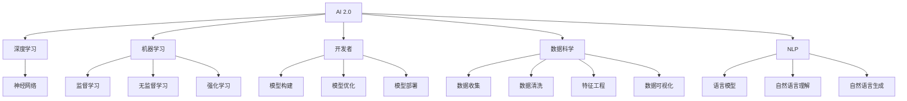

                 

# 李开复：AI 2.0 时代的开发者

> 关键词：AI 2.0, 开发者, 人工智能, 深度学习, 机器学习, 技术前沿, 未来发展

## 1. 背景介绍

### 1.1 问题由来

在过去的几十年里，人工智能（AI）经历了从最初的尝试到如今引领科技前沿的飞速发展。AI 2.0，即第二代人工智能，以深度学习和机器学习为核心，正在逐渐改变我们的生活和工作方式。然而，随着AI技术的进步，对开发者技能的要求也随之提升。本文将探讨AI 2.0时代开发者的挑战与机遇，以及他们如何适应这一快速变化的技术环境。

### 1.2 问题核心关键点

在AI 2.0时代，开发者面临的关键挑战包括但不限于：
- **数据驱动的决策**：开发者需具备数据处理和分析的能力，以优化模型的性能。
- **深度学习模型的复杂性**：理解并应用复杂的深度学习模型是开发者的必备技能。
- **算法和技术的不断演进**：快速学习和掌握新的算法和技术是开发者的必备素质。
- **跨学科知识的整合**：开发者需要整合计算机科学、统计学、心理学等多学科知识，以构建更智能的系统。
- **伦理和可解释性**：开发者需要关注AI系统的道德和可解释性问题，确保系统的安全性、公正性和透明度。

### 1.3 问题研究意义

理解AI 2.0时代开发者的角色和技能，对于推动AI技术的普及和应用具有重要意义：
- **加速技术落地**：熟练掌握AI技术的开发者能够快速将技术转化为实际应用，推动AI技术的产业化。
- **提升用户体验**：开发者通过优化算法和模型，提升AI系统在各个场景中的用户体验。
- **促进社会进步**：开发者在构建AI系统时，需考虑其对社会的影响，推动AI技术向更伦理、公正的方向发展。

## 2. 核心概念与联系

### 2.1 核心概念概述

为更好地理解AI 2.0时代开发者的角色，本文将介绍几个核心概念：

- **AI 2.0**：以深度学习和机器学习为基础的第二代人工智能，相比第一代AI，具有更强的自主学习能力和泛化能力。
- **深度学习**：一种通过多层神经网络模型进行训练的学习方法，能够处理复杂的非线性关系。
- **机器学习**：一种通过数据和算法自动改善模型性能的技术。
- **开发者**：使用AI技术创建和优化应用软件的工程师和科学家。
- **数据科学**：涉及数据收集、处理、分析和可视化的学科。
- **自然语言处理（NLP）**：使计算机能够理解和处理人类语言的技术。

### 2.2 核心概念原理和架构的 Mermaid 流程图



## 3. 核心算法原理 & 具体操作步骤

### 3.1 算法原理概述

AI 2.0时代，开发者面临的核心算法原理主要集中在深度学习和机器学习领域。这些算法通过大量数据训练，能够发现和提取数据中的模式，从而实现自动化的决策和预测。具体而言，深度学习模型通过多层次的神经网络结构，自动学习输入数据的内在特征，并在输出层进行分类或回归等任务。

### 3.2 算法步骤详解

开发者在构建AI 2.0系统时，通常遵循以下步骤：

1. **数据收集与预处理**：收集相关领域的标注数据，并进行清洗、归一化等预处理。
2. **模型选择与构建**：选择合适的深度学习模型，如卷积神经网络（CNN）、循环神经网络（RNN）、Transformer等，并进行模型架构的设计。
3. **模型训练与调参**：使用训练集对模型进行训练，并通过验证集调整超参数，如学习率、批大小、正则化系数等，以获得最佳的模型性能。
4. **模型评估与测试**：在测试集上评估模型性能，并根据性能指标（如准确率、召回率、F1分数等）进行优化。
5. **模型部署与应用**：将训练好的模型部署到实际应用中，并进行性能监控和反馈优化。

### 3.3 算法优缺点

AI 2.0时代算法的主要优点包括：
- **强大的自主学习能力**：深度学习模型能够自动提取数据中的高级特征，具有较高的泛化能力。
- **高效的模型性能**：通过优化算法，可以显著提升模型的准确性和鲁棒性。
- **可扩展性**：深度学习模型可以应用于各种复杂场景，具有较强的可扩展性。

然而，这些算法也存在一些缺点：
- **数据依赖性**：深度学习模型对数据质量要求较高，数据不足或偏差可能导致模型性能不佳。
- **计算资源需求高**：训练和推理深度学习模型需要大量的计算资源，如GPU、TPU等。
- **模型解释性不足**：深度学习模型通常被视为"黑箱"，难以解释其内部决策过程。
- **过拟合风险**：模型在训练集上表现良好，但在测试集上可能出现过拟合现象。

### 3.4 算法应用领域

AI 2.0时代的算法已在多个领域得到广泛应用，包括但不限于：

- **计算机视觉**：如图像识别、目标检测、图像生成等。
- **自然语言处理（NLP）**：如文本分类、情感分析、机器翻译等。
- **语音识别**：如语音合成、语音识别、语音翻译等。
- **推荐系统**：如商品推荐、音乐推荐、新闻推荐等。
- **医疗健康**：如疾病诊断、药物研发、健康监测等。
- **金融科技**：如风险评估、交易分析、智能投顾等。

## 4. 数学模型和公式 & 详细讲解 & 举例说明

### 4.1 数学模型构建

在AI 2.0时代，开发者常用的数学模型包括但不限于神经网络模型和深度学习模型。以下以一个简单的多层感知器（MLP）为例，介绍数学模型的构建过程。

假设输入为 $x=(x_1,x_2,\dots,x_n)$，输出为 $y=(y_1,y_2,\dots,y_m)$，其中 $n$ 和 $m$ 分别表示输入和输出的维度。多层感知器由多个全连接层组成，每个层包含多个神经元。其数学模型可以表示为：

$$
\begin{aligned}
    y &= \sigma(\boldsymbol{W}^{(L)} \boldsymbol{a}^{(L-1)} + b^{(L)}) \\
    \boldsymbol{a}^{(l)} &= \sigma(\boldsymbol{W}^{(l)} \boldsymbol{a}^{(l-1)} + b^{(l)})
\end{aligned}
$$

其中 $\sigma$ 为激活函数，$\boldsymbol{W}^{(l)}$ 和 $b^{(l)}$ 分别为第 $l$ 层的权重和偏置。

### 4.2 公式推导过程

在多层感知器中，每个神经元的输出可以表示为：

$$
a^{(l)}_i = \sigma\left(\sum_{j=1}^n W^{(l)}_{ij}a^{(l-1)}_j + b^{(l)}_i\right)
$$

其中 $a^{(l)}_i$ 为第 $l$ 层第 $i$ 个神经元的输出，$a^{(l-1)}_j$ 为第 $l-1$ 层第 $j$ 个神经元的输出，$W^{(l)}_{ij}$ 为第 $l$ 层第 $i$ 个神经元与第 $l-1$ 层第 $j$ 个神经元之间的连接权重，$b^{(l)}_i$ 为第 $l$ 层第 $i$ 个神经元的偏置。

将上述公式应用到多层感知器中，可以得到：

$$
\begin{aligned}
    a^{(L)}_i &= \sigma\left(\sum_{j=1}^n W^{(L)}_{ij}a^{(L-1)}_j + b^{(L)}_i\right) \\
    a^{(l-1)}_j &= \sigma\left(\sum_{k=1}^n W^{(l-1)}_{kj}a^{(l-2)}_k + b^{(l-1)}_j\right)
\end{aligned}
$$

以此类推，直至第一层。最终的输出可以表示为：

$$
y = \sigma\left(\sum_{j=1}^n W^{(L)}_{ij}a^{(L-1)}_j + b^{(L)}\right)
$$

### 4.3 案例分析与讲解

以下以一个简单的情感分类任务为例，介绍如何使用多层感知器进行模型构建和训练。

假设训练数据集包含两个特征（如评论的词频和情感极性），一个输出（即情感分类）。使用交叉熵损失函数进行训练，优化器为AdamW。具体步骤如下：

1. **数据准备**：收集评论数据集，并进行预处理，包括分词、向量化等。
2. **模型定义**：定义一个包含两个隐藏层的多层感知器模型。
3. **损失函数和优化器**：定义交叉熵损失函数和AdamW优化器。
4. **训练过程**：使用训练集对模型进行前向传播和反向传播，更新模型参数。
5. **评估过程**：在验证集上评估模型性能，调整超参数。
6. **测试过程**：在测试集上评估模型性能，进行预测。

## 5. 项目实践：代码实例和详细解释说明

### 5.1 开发环境搭建

在AI 2.0时代，开发者通常使用Python语言和深度学习框架如PyTorch或TensorFlow进行开发。以下介绍如何搭建Python开发环境。

1. **安装Python**：从官网下载并安装最新版本的Python，安装过程中注意选择合适的位数和环境变量。
2. **安装深度学习框架**：使用pip命令安装PyTorch或TensorFlow。
3. **配置开发环境**：安装必要的依赖库，如numpy、pandas、scikit-learn等。
4. **环境验证**：编写简单代码进行环境验证，确保所有库正确安装。

### 5.2 源代码详细实现

以下是一个使用PyTorch进行情感分类的代码实现：

```python
import torch
import torch.nn as nn
import torch.optim as optim
import torchvision.transforms as transforms
from torch.utils.data import DataLoader, Dataset

class SentimentDataset(Dataset):
    def __init__(self, data, targets):
        self.data = data
        self.targets = targets

    def __len__(self):
        return len(self.data)

    def __getitem__(self, idx):
        return self.data[idx], self.targets[idx]

class SentimentNet(nn.Module):
    def __init__(self, input_size, hidden_size, output_size):
        super(SentimentNet, self).__init__()
        self.fc1 = nn.Linear(input_size, hidden_size)
        self.fc2 = nn.Linear(hidden_size, hidden_size)
        self.fc3 = nn.Linear(hidden_size, output_size)

    def forward(self, x):
        x = torch.relu(self.fc1(x))
        x = torch.relu(self.fc2(x))
        x = torch.sigmoid(self.fc3(x))
        return x

# 数据准备
data = ...
targets = ...

# 模型定义
model = SentimentNet(input_size, hidden_size, output_size)

# 定义损失函数和优化器
criterion = nn.BCELoss()
optimizer = optim.Adam(model.parameters(), lr=0.001)

# 训练过程
for epoch in range(num_epochs):
    for i, (inputs, targets) in enumerate(train_loader):
        optimizer.zero_grad()
        outputs = model(inputs)
        loss = criterion(outputs, targets)
        loss.backward()
        optimizer.step()

    if i % 100 == 0:
        print(f'Epoch {epoch+1}, Loss: {loss:.4f}')

# 评估过程
test_loss = ...
test_acc = ...

# 测试过程
test_dataset = ...
test_loader = ...
```

### 5.3 代码解读与分析

在上述代码中，`SentimentDataset`类用于定义训练数据集，`SentimentNet`类用于定义多层感知器模型。`nn.BCELoss`用于定义二分类交叉熵损失函数，`optim.Adam`用于定义AdamW优化器。训练过程中，使用`model(inputs)`进行前向传播，计算损失函数`criterion(outputs, targets)`，并通过`loss.backward()`和`optimizer.step()`进行反向传播和参数更新。

## 6. 实际应用场景

### 6.1 智能客服系统

智能客服系统是AI 2.0时代的重要应用之一。通过AI技术，智能客服系统能够自动处理大量用户咨询，提高服务效率和客户满意度。开发者需结合自然语言处理（NLP）和机器学习技术，构建智能问答系统，实现自动对话和问题解答。

### 6.2 金融科技

在金融科技领域，开发者可以应用深度学习技术，构建智能投顾、风险评估、交易分析等系统。通过AI技术，智能投顾能够根据用户行为和市场数据，提供个性化的投资建议。风险评估系统能够利用历史数据，预测市场风险，保障金融系统的稳定运行。

### 6.3 医疗健康

在医疗健康领域，AI 2.0技术可以帮助开发者构建智能诊断系统、药物研发平台等。智能诊断系统能够分析患者的症状和历史数据，提供诊断建议和治疗方案。药物研发平台能够利用深度学习技术，加速新药的发现和开发。

### 6.4 未来应用展望

未来，AI 2.0技术将在更多领域得到广泛应用，如智慧城市、教育、交通等。开发者需不断学习和掌握新技术，积极探索AI技术的潜力，推动AI技术在各行各业的落地应用。

## 7. 工具和资源推荐

### 7.1 学习资源推荐

为了帮助开发者系统掌握AI 2.0技术，以下推荐一些优质的学习资源：

1. **Coursera**：提供多门深度学习相关的课程，包括计算机视觉、自然语言处理等。
2. **Udacity**：提供深度学习纳米学位课程，涵盖神经网络、卷积神经网络、循环神经网络等。
3. **Fast.ai**：提供实用深度学习课程，强调实际应用和模型优化。
4. **Kaggle**：提供丰富的数据集和竞赛，帮助开发者提升实战能力。
5. **PyTorch官方文档**：包含深度学习框架的详细介绍和实例代码。

### 7.2 开发工具推荐

AI 2.0开发常用的工具包括：

1. **PyTorch**：深度学习框架，支持动态图和静态图计算，适合快速迭代研究。
2. **TensorFlow**：深度学习框架，支持分布式计算和GPU加速。
3. **Jupyter Notebook**：交互式编程环境，适合开发和调试模型。
4. **Weights & Biases**：实验跟踪工具，帮助开发者记录和分析模型性能。
5. **Google Colab**：在线Jupyter Notebook环境，支持GPU和TPU计算。

### 7.3 相关论文推荐

以下推荐一些重要的AI 2.0相关论文：

1. **ImageNet大规模视觉识别竞赛（ILSVRC）**：通过大规模标注数据集，推动计算机视觉技术的发展。
2. **BERT: Pre-training of Deep Bidirectional Transformers for Language Understanding**：提出BERT模型，广泛应用于自然语言处理任务。
3. **AlphaGo**：利用深度学习和强化学习技术，构建击败人类顶尖选手的AI程序。
4. **Attention is All You Need**：提出Transformer模型，革新自然语言处理领域。
5. **GPT-3**：提出大规模语言模型，展示了AI在自然语言处理中的强大能力。

## 8. 总结：未来发展趋势与挑战

### 8.1 研究成果总结

AI 2.0技术的发展已经取得了显著进展，但仍然面临诸多挑战。开发者需不断学习和探索，以应对这些挑战，推动AI技术的进步。

### 8.2 未来发展趋势

未来AI 2.0技术将呈现以下几个发展趋势：

1. **自动化和可解释性**：AI系统将更加自动化和可解释，开发者需关注算法的透明性和可理解性。
2. **多模态融合**：AI技术将融合视觉、语音、文本等多种模态信息，构建更全面的智能系统。
3. **跨领域应用**：AI技术将在更多领域得到应用，如智能制造、智慧城市等。
4. **伦理和安全**：AI系统需考虑伦理和安全性问题，确保系统的公正性和透明性。
5. **人工智能的普及**：AI技术将逐渐普及到各行各业，提升生产效率和生活质量。

### 8.3 面临的挑战

AI 2.0技术的快速发展也带来了诸多挑战，开发者需积极应对：

1. **数据质量问题**：数据质量的不足可能导致模型性能不佳，需不断优化数据预处理和清洗流程。
2. **计算资源需求**：深度学习模型需要大量的计算资源，需优化模型的训练和推理效率。
3. **模型复杂性**：模型的复杂性增加了开发的难度，需不断学习和掌握新技术。
4. **伦理和安全问题**：AI系统需考虑伦理和安全性问题，确保系统的公正性和透明性。
5. **技术更新速度快**：AI技术更新速度快，开发者需不断学习新的算法和工具。

### 8.4 研究展望

未来，AI 2.0技术的研究需关注以下几个方向：

1. **模型压缩和优化**：开发更加轻量级的深度学习模型，提升计算效率。
2. **跨领域知识整合**：将跨领域知识与AI技术结合，构建更加全面的智能系统。
3. **多模态融合**：融合视觉、语音、文本等多种模态信息，构建更全面的智能系统。
4. **算法透明性和可解释性**：提高算法的透明性和可解释性，增强系统的可信任性。
5. **伦理和安全问题**：研究AI系统的伦理和安全性问题，确保系统的公正性和透明性。

## 9. 附录：常见问题与解答

### 附录

**Q1：AI 2.0技术的核心是什么？**

A: AI 2.0技术的核心是深度学习和机器学习，通过大量数据训练，能够发现和提取数据中的模式，实现自动化的决策和预测。

**Q2：开发者如何学习深度学习技术？**

A: 开发者可以通过参加在线课程、阅读相关书籍、参加竞赛等方式学习深度学习技术。同时，利用开源工具如PyTorch和TensorFlow进行实践，掌握模型构建、训练和优化的方法。

**Q3：AI 2.0技术在未来有哪些发展方向？**

A: AI 2.0技术的发展方向包括自动化和可解释性、多模态融合、跨领域应用、伦理和安全等。开发者需关注这些方向，不断学习新的技术和方法。

**Q4：开发者在构建AI 2.0系统时需要注意哪些问题？**

A: 开发者需注意数据质量、计算资源需求、模型复杂性、伦理和安全问题等。同时，不断学习和掌握新技术，以应对AI技术的快速发展。

**Q5：AI 2.0技术在实际应用中面临哪些挑战？**

A: AI 2.0技术在实际应用中面临数据质量、计算资源需求、模型复杂性、伦理和安全问题等挑战。开发者需积极应对这些问题，提升AI系统的性能和可靠性。

---

作者：禅与计算机程序设计艺术 / Zen and the Art of Computer Programming

