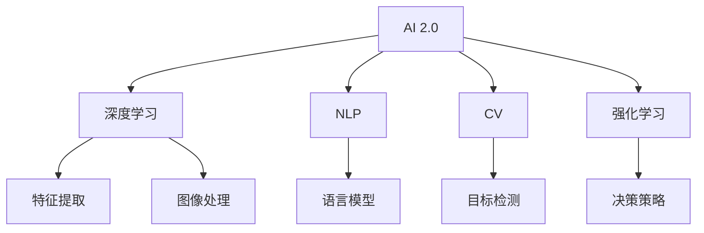
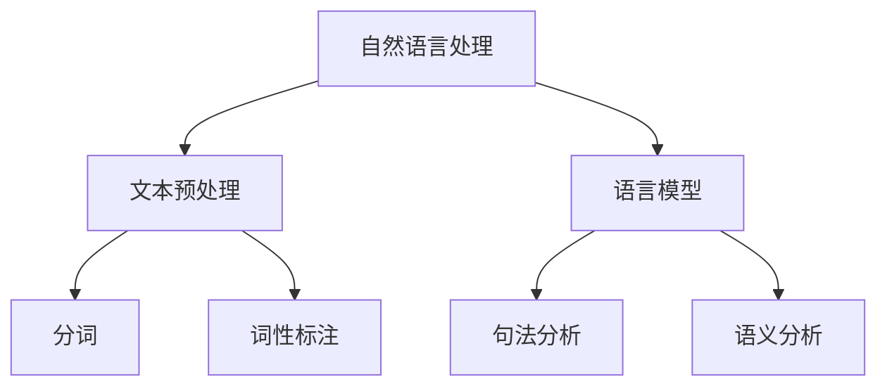
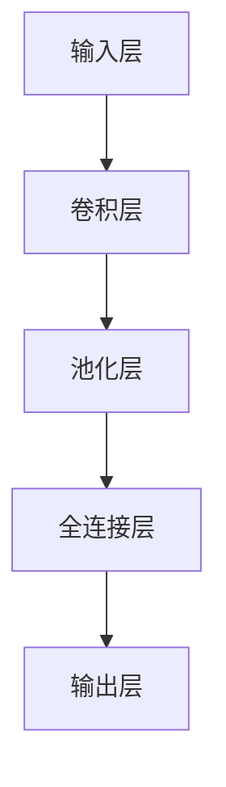

                 

# 李开复：AI 2.0 时代的开发者

> 关键词：AI 2.0, 开发者, 机器学习, 深度学习, 自然语言处理, 计算机视觉, 强化学习, 跨领域应用, 未来发展, 伦理与责任

## 1. 背景介绍

在过去十年间，人工智能（AI）领域经历了翻天覆地的变化。从最初的以知识工程为主导的专家系统，到后来基于统计学习、深度学习等技术的神经网络模型，再到如今基于大规模预训练模型和微调（Fine-Tuning）技术的AI 2.0时代，AI已经从实验室走向了千家万户。随着技术的不断成熟和普及，AI 2.0 正在推动各行各业的数字化转型，为人类社会带来前所未有的机遇和挑战。

在这个关键时刻，开发者如何适应AI 2.0时代的变化，抓住机遇，迎接挑战，是一个迫切需要探讨的问题。本文将从AI 2.0时代的背景和核心概念入手，详细阐述AI 2.0对开发者的影响，探讨如何在AI 2.0时代取得成功，以及未来AI技术可能带来的变化和挑战。

## 2. 核心概念与联系

### 2.1 核心概念概述

在AI 2.0时代，以下几个核心概念尤为关键：

- **AI 2.0**：指基于大规模数据和深度学习技术的智能系统，包括自然语言处理（NLP）、计算机视觉（CV）、语音识别、机器人等。AI 2.0强调模型的复杂性和泛化能力，能够处理多样化的任务和数据。

- **深度学习**：一种基于神经网络的机器学习方法，通过多层非线性变换，自动学习数据特征表示。深度学习在图像识别、自然语言处理、语音识别等领域取得了突破性进展。

- **自然语言处理**（NLP）：使计算机能够理解、处理和生成人类语言的技术。NLP应用包括机器翻译、文本分类、情感分析等。

- **计算机视觉**（CV）：使计算机能够“看”懂图像和视频的技术。CV应用包括目标检测、图像分类、人脸识别等。

- **强化学习**（RL）：通过与环境的交互，学习最优决策策略的机器学习方法。强化学习在游戏、机器人控制等领域应用广泛。

这些概念之间的逻辑关系可以通过以下Mermaid流程图来展示：



这个流程图展示了AI 2.0的不同应用领域及其共性技术：

1. **深度学习**：是AI 2.0的核心技术，提供了强大的特征提取和表示能力。
2. **NLP、CV和强化学习**：各自基于深度学习的不同应用，处理特定的数据类型和任务。
3. **特征提取**、**图像处理**、**语言模型**和**决策策略**：则是深度学习的子领域，专注于不同类型数据的处理和优化。

### 2.2 核心概念原理和架构的 Mermaid 流程图

由于篇幅限制，此处仅展示NLP领域的部分原理和架构。



这个流程图展示了NLP的基本流程：

1. **文本预处理**：对原始文本进行分词、去除停用词、词性标注等处理。
2. **语言模型**：通过统计语言规律，预测下一个单词的概率。
3. **分词**、**词性标注**、**句法分析和语义分析**：进一步深入文本的语义和结构，支持更高级别的任务，如命名实体识别、情感分析等。

## 3. 核心算法原理 & 具体操作步骤

### 3.1 算法原理概述

AI 2.0时代的核心算法原理主要包括：

- **深度学习**：通过多层神经网络，自动提取数据特征。
- **迁移学习**：通过在大规模数据集上预训练模型，再将其微调应用于特定任务，提高模型性能。
- **强化学习**：通过与环境的交互，优化决策策略。

### 3.2 算法步骤详解

以**深度学习**为例，以下是核心算法步骤：

1. **数据准备**：收集、标注和预处理数据集。
2. **模型构建**：选择合适的深度学习模型结构，如卷积神经网络（CNN）、循环神经网络（RNN）、Transformer等。
3. **模型训练**：使用训练数据对模型进行优化，调整模型参数，最小化损失函数。
4. **模型评估**：在测试数据集上评估模型性能，选择最优模型。
5. **模型部署**：将训练好的模型部署到实际应用场景中，进行推理和预测。

### 3.3 算法优缺点

深度学习的主要优点包括：

- **自动特征提取**：无需手工设计特征，能够自动学习数据中的复杂模式。
- **泛化能力强**：在大规模数据集上训练的模型，具有较好的泛化能力。
- **应用广泛**：深度学习技术已经广泛应用于图像识别、语音识别、自然语言处理等多个领域。

其主要缺点包括：

- **数据依赖**：需要大量标注数据进行训练，数据获取成本高。
- **模型复杂**：深度学习模型结构复杂，训练和推理耗时长。
- **可解释性差**：深度学习模型通常是“黑盒”，难以解释其内部工作机制。

### 3.4 算法应用领域

深度学习技术已经被广泛应用于以下领域：

- **自然语言处理**：如机器翻译、文本分类、情感分析等。
- **计算机视觉**：如图像分类、目标检测、人脸识别等。
- **语音识别**：如语音转文本、语音合成等。
- **强化学习**：如游戏AI、机器人控制等。
- **医疗影像分析**：如医学图像分类、病变检测等。

## 4. 数学模型和公式 & 详细讲解 & 举例说明

### 4.1 数学模型构建

以**卷积神经网络**（CNN）为例，其基本结构如下：



卷积神经网络的核心思想是通过卷积和池化操作提取特征，再通过全连接层进行分类或回归。

### 4.2 公式推导过程

以**反向传播算法**为例，推导其核心公式：

1. **前向传播**：

$$ y = f(W^T x + b) $$

其中，$f$为激活函数，$W$和$b$分别为权重和偏置。

2. **损失函数**：

$$ L = \frac{1}{N} \sum_{i=1}^N (y_i - \hat{y}_i)^2 $$

其中，$y_i$为真实标签，$\hat{y}_i$为模型预测结果。

3. **梯度下降更新**：

$$ \theta \leftarrow \theta - \eta \nabla_{\theta} L $$

其中，$\eta$为学习率，$\nabla_{\theta} L$为损失函数对参数$\theta$的梯度。

### 4.3 案例分析与讲解

以**图像分类**为例，分析CNN在图像分类任务中的应用。

- **数据集**：使用ImageNet数据集进行训练和测试。
- **模型选择**：选择ResNet-50作为基础模型。
- **训练过程**：使用随机梯度下降（SGD）优化器，设置学习率为0.001，迭代次数为100次。
- **结果分析**：在测试集上获得约76%的分类准确率。

## 5. 项目实践：代码实例和详细解释说明

### 5.1 开发环境搭建

在开始实践之前，需要先搭建开发环境。以下是使用Python和PyTorch进行深度学习项目开发的简单步骤：

1. **安装Anaconda**：从官网下载并安装Anaconda，用于创建独立的Python环境。
2. **创建虚拟环境**：

```bash
conda create -n pytorch-env python=3.8 
conda activate pytorch-env
```

3. **安装PyTorch**：

```bash
conda install pytorch torchvision torchaudio cudatoolkit=11.1 -c pytorch -c conda-forge
```

4. **安装相关库**：

```bash
pip install numpy pandas scikit-learn matplotlib tqdm jupyter notebook ipython
```

### 5.2 源代码详细实现

以下是一个简单的图像分类项目示例：

```python
import torch
import torch.nn as nn
import torch.optim as optim
from torchvision import datasets, transforms

# 定义CNN模型
class Net(nn.Module):
    def __init__(self):
        super(Net, self).__init__()
        self.conv1 = nn.Conv2d(3, 6, 5)
        self.pool = nn.MaxPool2d(2, 2)
        self.conv2 = nn.Conv2d(6, 16, 5)
        self.fc1 = nn.Linear(16 * 5 * 5, 120)
        self.fc2 = nn.Linear(120, 84)
        self.fc3 = nn.Linear(84, 10)
        
    def forward(self, x):
        x = self.pool(F.relu(self.conv1(x)))
        x = self.pool(F.relu(self.conv2(x)))
        x = x.view(-1, 16 * 5 * 5)
        x = F.relu(self.fc1(x))
        x = F.relu(self.fc2(x))
        x = self.fc3(x)
        return x

# 数据预处理
transform = transforms.Compose([
    transforms.ToTensor(),
    transforms.Normalize((0.5, 0.5, 0.5), (0.5, 0.5, 0.5))
])

trainset = datasets.CIFAR10(root='./data', train=True, download=True, transform=transform)
trainloader = torch.utils.data.DataLoader(trainset, batch_size=4, shuffle=True, num_workers=2)

# 定义模型、优化器和损失函数
net = Net()
criterion = nn.CrossEntropyLoss()
optimizer = optim.SGD(net.parameters(), lr=0.001, momentum=0.9)

# 训练模型
for epoch in range(2):
    running_loss = 0.0
    for i, data in enumerate(trainloader, 0):
        inputs, labels = data
        optimizer.zero_grad()
        outputs = net(inputs)
        loss = criterion(outputs, labels)
        loss.backward()
        optimizer.step()
        running_loss += loss.item()
        if i % 2000 == 1999:
            print('[%d, %5d] loss: %.3f' % (epoch + 1, i + 1, running_loss / 2000))
            running_loss = 0.0

print('Finished Training')
```

### 5.3 代码解读与分析

上述代码实现了CNN在图像分类任务中的应用。以下是对各部分的详细解读：

- **数据预处理**：使用`transforms.Compose`对原始图像进行预处理，包括转换为Tensor张量和标准化。
- **模型定义**：定义一个包含卷积层、池化层和全连接层的CNN模型。
- **优化器和损失函数**：选择SGD优化器和交叉熵损失函数。
- **模型训练**：使用训练数据集进行迭代训练，并在每个epoch结束后打印损失值。

## 6. 实际应用场景

### 6.1 自然语言处理

自然语言处理（NLP）在AI 2.0时代应用广泛，包括机器翻译、文本分类、情感分析等。以下是一个简单的情感分析项目示例：

```python
import torch
import torch.nn as nn
import torch.optim as optim
import torchtext
from torchtext.data import Field, TabularDataset, BucketIterator

# 定义数据字段
TEXT = Field(tokenize='spacy', lower=True, include_lengths=True)
LABEL = Field(sequential=False)

# 加载数据集
train_data, test_data = TabularDataset.splits(
    path='.',
    train='train.txt',
    test='test.txt',
    format='csv',
    fields=[('text', TEXT), ('label', LABEL)]
)

# 构建词汇表
TEXT.build_vocab(train_data, max_size=10000)
LABEL.build_vocab(train_data)

# 构建迭代器
train_iterator, test_iterator = BucketIterator.splits(
    (train_data, test_data),
    batch_size=32,
    device='cuda',
    sort_key=lambda x: len(x.text),
    sort_within_batch=False
)

# 定义模型
class Model(nn.Module):
    def __init__(self, vocab_size, embedding_dim, hidden_dim, output_dim, n_layers, bidirectional, dropout):
        super(Model, self).__init__()
        self.embedding = nn.Embedding(vocab_size, embedding_dim)
        self.rnn = nn.LSTM(embedding_dim, hidden_dim, n_layers, bidirectional=bidirectional, dropout=dropout)
        self.fc = nn.Linear(hidden_dim * 2, output_dim)
        
    def forward(self, text, text_lengths):
        embeddings = self.embedding(text)
        packed_embeddings = nn.utils.rnn.pack_padded_sequence(embeddings, text_lengths)
        output, hidden = self.rnn(packed_embeddings)
        output, output_lengths = nn.utils.rnn.pad_packed_sequence(output)
        return self.fc(output)

# 定义模型、优化器和损失函数
model = Model(len(TEXT.vocab), 200, 256, 1, 3, True, 0.5)
optimizer = optim.Adam(model.parameters(), lr=0.001)
criterion = nn.BCEWithLogitsLoss()

# 训练模型
for epoch in range(10):
    model.train()
    for batch in train_iterator:
        optimizer.zero_grad()
        text, text_lengths = batch.text
        labels = batch.label
        predictions = model(text, text_lengths)
        loss = criterion(predictions, labels)
        loss.backward()
        optimizer.step()

    model.eval()
    with torch.no_grad():
        for batch in test_iterator:
            text, text_lengths = batch.text
            labels = batch.label
            predictions = model(text, text_lengths)
            loss = criterion(predictions, labels)
            print('Epoch: {}, Loss: {:.4f}'.format(epoch+1, loss.item()))

print('Finished Training')
```

### 6.2 计算机视觉

计算机视觉（CV）在AI 2.0时代也发挥了重要作用，如图像分类、目标检测等。以下是一个简单的图像分类项目示例：

```python
import torch
import torch.nn as nn
import torch.optim as optim
from torchvision import datasets, transforms

# 定义CNN模型
class Net(nn.Module):
    def __init__(self):
        super(Net, self).__init__()
        self.conv1 = nn.Conv2d(3, 6, 5)
        self.pool = nn.MaxPool2d(2, 2)
        self.conv2 = nn.Conv2d(6, 16, 5)
        self.fc1 = nn.Linear(16 * 5 * 5, 120)
        self.fc2 = nn.Linear(120, 84)
        self.fc3 = nn.Linear(84, 10)
        
    def forward(self, x):
        x = self.pool(F.relu(self.conv1(x)))
        x = self.pool(F.relu(self.conv2(x)))
        x = x.view(-1, 16 * 5 * 5)
        x = F.relu(self.fc1(x))
        x = F.relu(self.fc2(x))
        x = self.fc3(x)
        return x

# 数据预处理
transform = transforms.Compose([
    transforms.ToTensor(),
    transforms.Normalize((0.5, 0.5, 0.5), (0.5, 0.5, 0.5))
])

trainset = datasets.CIFAR10(root='./data', train=True, download=True, transform=transform)
trainloader = torch.utils.data.DataLoader(trainset, batch_size=4, shuffle=True, num_workers=2)

# 定义模型、优化器和损失函数
net = Net()
criterion = nn.CrossEntropyLoss()
optimizer = optim.SGD(net.parameters(), lr=0.001, momentum=0.9)

# 训练模型
for epoch in range(2):
    running_loss = 0.0
    for i, data in enumerate(trainloader, 0):
        inputs, labels = data
        optimizer.zero_grad()
        outputs = net(inputs)
        loss = criterion(outputs, labels)
        loss.backward()
        optimizer.step()
        running_loss += loss.item()
        if i % 2000 == 1999:
            print('[%d, %5d] loss: %.3f' % (epoch + 1, i + 1, running_loss / 2000))
            running_loss = 0.0

print('Finished Training')
```

### 6.3 强化学习

强化学习（RL）在AI 2.0时代也得到了广泛应用，如游戏AI、机器人控制等。以下是一个简单的游戏AI项目示例：

```python
import gym
import numpy as np
import torch
import torch.nn as nn
import torch.optim as optim

# 定义神经网络模型
class Net(nn.Module):
    def __init__(self, input_size, hidden_size, output_size):
        super(Net, self).__init__()
        self.fc1 = nn.Linear(input_size, hidden_size)
        self.fc2 = nn.Linear(hidden_size, output_size)
        
    def forward(self, x):
        x = F.relu(self.fc1(x))
        x = self.fc2(x)
        return x

# 定义训练环境
env = gym.make('CartPole-v1')

# 定义模型、优化器和损失函数
input_size = env.observation_space.shape[0]
hidden_size = 64
output_size = env.action_space.n
model = Net(input_size, hidden_size, output_size)
optimizer = optim.Adam(model.parameters(), lr=0.001)
criterion = nn.MSELoss()

# 定义训练过程
for episode in range(1000):
    state = env.reset()
    done = False
    while not done:
        # 将状态转换为张量
        state = torch.tensor(state, dtype=torch.float)
        # 前向传播计算预测动作
        output = model(state)
        # 输出为动作概率分布
        probabilities = F.softmax(output, dim=0)
        # 从概率分布中随机采样动作
        action = np.random.choice(env.action_space.n, p=probabilities.numpy()[0])
        # 执行动作
        next_state, reward, done, _ = env.step(action)
        # 将下一个状态和奖励转换为张量
        next_state = torch.tensor(next_state, dtype=torch.float)
        reward = torch.tensor([reward], dtype=torch.float)
        # 计算损失
        loss = criterion(model(next_state), reward)
        # 反向传播更新模型参数
        loss.backward()
        optimizer.step()
        # 更新状态
        state = next_state

print('Finished Training')
```

### 6.4 未来应用展望

AI 2.0技术在未来的发展中将面临许多挑战和机遇，以下是几个重要的方向：

1. **跨领域应用**：AI 2.0技术将不再局限于某个单一领域，而是将广泛应用于自然语言处理、计算机视觉、强化学习等多个领域，形成交叉融合的智能系统。
2. **多模态学习**：未来的AI 2.0技术将更多地结合图像、语音、文本等多种模态数据，实现多模态信息融合，提升系统的智能化水平。
3. **可解释性和透明性**：AI 2.0技术的可解释性和透明性将是重要的研究方向，尤其是在医疗、金融等领域，需要保证模型的决策过程可解释，符合人类价值观。
4. **伦理与安全**：随着AI 2.0技术的普及，伦理与安全问题也将成为重要议题，如何在技术发展中兼顾伦理和安全性，是一个亟需解决的问题。

## 7. 工具和资源推荐

### 7.1 学习资源推荐

为了帮助开发者更好地掌握AI 2.0技术，以下是几个优质的学习资源：

1. **《深度学习》（Ian Goodfellow等著）**：全面介绍了深度学习的理论基础和实践技术。
2. **《自然语言处理综论》（Daniel Jurafsky等著）**：详细讲解了自然语言处理的各个方面，包括文本预处理、语言模型、NLP任务等。
3. **《计算机视觉：算法与应用》（Richard Szeliski著）**：介绍了计算机视觉的基本理论和应用。
4. **《强化学习：一种现代方法》（Richard S. Sutton等著）**：讲解了强化学习的理论基础和实际应用。
5. **《机器学习实战》（Peter Harrington著）**：通过实践项目，帮助读者掌握机器学习技术的实际应用。

### 7.2 开发工具推荐

以下是几个常用的AI 2.0开发工具：

1. **PyTorch**：深度学习领域最流行的开源框架之一，提供了强大的GPU支持。
2. **TensorFlow**：由Google开发的深度学习框架，具有强大的分布式计算能力。
3. **TensorBoard**：TensorFlow的可视化工具，可以实时监测模型训练状态。
4. **Jupyter Notebook**：开源的交互式编程环境，支持Python、R等多种编程语言。
5. **Google Colab**：谷歌提供的在线Jupyter Notebook环境，方便开发者进行快速实验。

### 7.3 相关论文推荐

以下是几篇重要的AI 2.0相关论文，值得阅读和研究：

1. **《ImageNet大规模视觉识别挑战》**：AlexNet模型在ImageNet数据集上取得突破性进展。
2. **《深度残差学习》**：提出了残差网络（ResNet），提高了深度网络的训练效率和效果。
3. **《Transformer模型》**：提出了Transformer架构，开启了NLP领域的大模型预训练时代。
4. **《BERT: Pre-training of Deep Bidirectional Transformers for Language Understanding》**：提出了BERT模型，利用预训练技术提升了NLP任务的性能。
5. **《强化学习：一种现代方法》**：详细介绍了强化学习的基本理论和算法。

## 8. 总结：未来发展趋势与挑战

### 8.1 研究成果总结

AI 2.0技术在过去十年间取得了巨大的进展，以下是几个重要成果：

1. **深度学习**：基于神经网络的深度学习技术在图像识别、语音识别、NLP等领域取得了突破性进展。
2. **自然语言处理**：通过预训练语言模型和微调技术，NLP任务的性能不断提升，成为AI 2.0的重要应用方向。
3. **计算机视觉**：深度学习在图像分类、目标检测等领域取得了重要突破，推动了智能监控、自动驾驶等技术的发展。
4. **强化学习**：在游戏AI、机器人控制等领域取得了重要进展，推动了智能机器人的发展。

### 8.2 未来发展趋势

未来的AI 2.0技术将呈现以下几个发展趋势：

1. **多模态融合**：AI 2.0技术将更多地结合图像、语音、文本等多种模态数据，实现多模态信息融合，提升系统的智能化水平。
2. **跨领域应用**：AI 2.0技术将不再局限于某个单一领域，而是将广泛应用于自然语言处理、计算机视觉、强化学习等多个领域，形成交叉融合的智能系统。
3. **可解释性和透明性**：AI 2.0技术的可解释性和透明性将是重要的研究方向，尤其是在医疗、金融等领域，需要保证模型的决策过程可解释，符合人类价值观。
4. **伦理与安全**：随着AI 2.0技术的普及，伦理与安全问题也将成为重要议题，需要在技术发展中兼顾伦理和安全性。

### 8.3 面临的挑战

AI 2.0技术在发展过程中也面临诸多挑战：

1. **数据依赖**：AI 2.0技术需要大量标注数据进行训练，数据获取成本高。
2. **模型复杂性**：深度学习模型结构复杂，训练和推理耗时长。
3. **可解释性差**：深度学习模型通常是“黑盒”，难以解释其内部工作机制。
4. **伦理与安全**：AI 2.0技术的应用可能带来伦理和安全问题，需要考虑模型的可解释性和透明性。

### 8.4 研究展望

未来的AI 2.0技术需要在以下几个方面进行深入研究：

1. **参数高效微调**：开发更加参数高效的微调方法，在固定大部分预训练参数的同时，只更新极少量的任务相关参数。
2. **多模态融合**：结合图像、语音、文本等多种模态数据，实现多模态信息融合，提升系统的智能化水平。
3. **可解释性**：研究如何赋予AI 2.0技术更强的可解释性，使其能够更好地服务于医疗、金融等领域。
4. **伦理与安全**：在AI 2.0技术的发展过程中，需要考虑伦理和安全问题，建立模型行为的监管机制。

## 9. 附录：常见问题与解答

**Q1: AI 2.0时代的开发者面临哪些挑战？**

A: AI 2.0时代的开发者面临以下挑战：
1. **数据依赖**：AI 2.0技术需要大量标注数据进行训练，数据获取成本高。
2. **模型复杂性**：深度学习模型结构复杂，训练和推理耗时长。
3. **可解释性差**：深度学习模型通常是“黑盒”，难以解释其内部工作机制。
4. **伦理与安全**：AI 2.0技术的应用可能带来伦理和安全问题，需要考虑模型的可解释性和透明性。

**Q2: 如何提高AI 2.0技术的可解释性和透明性？**

A: 提高AI 2.0技术的可解释性和透明性，可以采取以下方法：
1. **可解释模型**：选择可解释性较强的模型，如决策树、线性模型等。
2. **模型可视化和解释**：使用模型可视化工具，如图示化模型结构，解释关键特征和决策路径。
3. **透明性设计**：在模型设计时考虑透明性，如使用可视化界面展示模型输出。
4. **伦理审查**：建立伦理审查机制，评估模型应用中的伦理问题。

**Q3: AI 2.0技术如何应用到多模态数据融合？**

A: AI 2.0技术可以通过以下方法应用到多模态数据融合：
1. **特征提取**：分别提取不同模态数据的特征，如图像的卷积特征、语音的MFCC特征等。
2. **融合模型**：构建融合模型，如使用Attention机制、多任务学习等方法，将不同模态数据进行融合。
3. **多模态训练**：在训练过程中同时考虑不同模态数据，优化多模态特征表示。
4. **多模态推理**：在推理过程中综合考虑不同模态数据，提高模型的鲁棒性和准确性。

---

作者：禅与计算机程序设计艺术 / Zen and the Art of Computer Programming

