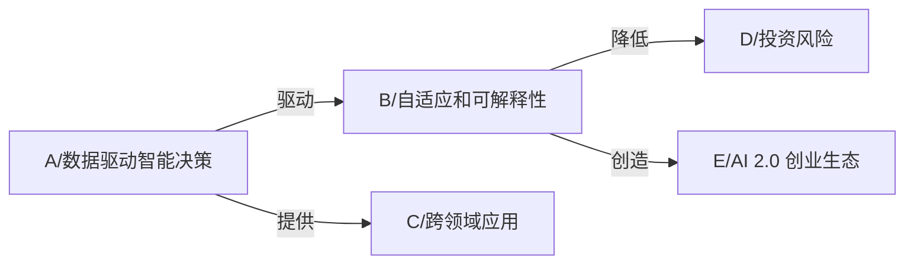

                 

## 1. 背景介绍

### 1.1 问题的由来

随着人工智能(AI)技术的发展，AI 2.0 时代正逐渐向我们走来。AI 2.0 时代，也被称为“智能时代”或“增强时代”，是继“计算时代”和“互联网时代”之后的第三个时代，由AI技术和数据驱动，将人类社会带入全新的智能经济模式。这个时代，AI将变得更加智能、自适应、可解释，同时对社会和经济产生深远影响。

AI 2.0 时代的投资价值如何？李开复在《AI 2.0 时代的投资价值》中深入分析了这一问题。他认为，AI 2.0 时代下，AI 技术将在医疗、教育、金融、安全等领域产生深远影响，为投资者带来了前所未有的投资机会。

### 1.2 问题的核心关键点

AI 2.0 时代的投资价值主要体现在以下几个方面：

1. **数据驱动智能决策**：AI 2.0 时代，数据将成为智能决策的关键基础。通过大数据、机器学习和深度学习等技术，AI能够从海量数据中挖掘出有价值的信息，做出更准确的决策。

2. **自适应和可解释性**：AI 2.0 技术更加自适应和可解释，能够更好地理解和解释人类行为，为投资者提供更全面的市场洞察。

3. **跨领域应用**：AI 2.0 技术具有跨领域应用的潜力，能够应用于医疗、金融、教育等多个领域，为投资者带来更多的投资机会。

4. **投资风险的降低**：AI 2.0 技术能够帮助投资者更好地识别投资机会，降低投资风险。

5. **AI 2.0 创业生态的崛起**：AI 2.0 技术的进步将带动创业生态的兴起，为投资者提供了更多的投资选择。

## 2. 核心概念与联系

### 2.1 核心概念概述

AI 2.0 时代下的投资价值，主要涉及以下几个核心概念：

- **AI 2.0 技术**：指基于深度学习、自然语言处理、计算机视觉等技术的人工智能技术。
- **数据驱动**：利用大数据、机器学习和深度学习等技术，从海量数据中挖掘有价值的信息。
- **自适应**：AI 2.0 技术具有自我学习和适应的能力，能够根据市场变化做出调整。
- **可解释性**：AI 2.0 技术能够更好地解释其决策过程，帮助投资者理解市场动态。
- **跨领域应用**：AI 2.0 技术具有跨领域应用的潜力，能够应用于多个行业。
- **投资风险**：利用AI 2.0 技术，投资者能够更好地识别和管理投资风险。
- **AI 2.0 创业生态**：AI 2.0 技术的进步将带动创业生态的兴起，为投资者提供更多的投资选择。

### 2.2 核心概念原理和架构的 Mermaid 流程图



## 3. 核心算法原理 & 具体操作步骤

### 3.1 算法原理概述

AI 2.0 时代的投资价值，主要通过以下算法原理实现：

1. **数据驱动的智能决策**：利用大数据、机器学习和深度学习等技术，从海量数据中挖掘出有价值的信息，帮助投资者做出更准确的决策。

2. **自适应和可解释性**：通过使用自适应算法和可解释性模型，AI 2.0 技术能够更好地理解和解释人类行为，为投资者提供更全面的市场洞察。

3. **跨领域应用**：AI 2.0 技术具有跨领域应用的潜力，能够应用于医疗、金融、教育等多个领域，为投资者带来更多的投资机会。

4. **投资风险的降低**：利用AI 2.0 技术，投资者能够更好地识别和管理投资风险。

5. **AI 2.0 创业生态的崛起**：AI 2.0 技术的进步将带动创业生态的兴起，为投资者提供更多的投资选择。

### 3.2 算法步骤详解

#### 3.2.1 数据驱动的智能决策

1. **数据收集**：收集海量数据，包括市场数据、公司财务数据、新闻数据等。

2. **数据清洗**：对数据进行清洗，去除噪声和异常值，确保数据质量。

3. **特征提取**：使用机器学习和深度学习技术，从数据中提取有价值特征，如股票价格、市场情绪、公司财务指标等。

4. **模型训练**：利用深度学习模型，如卷积神经网络(CNN)、循环神经网络(RNN)、长短期记忆网络(LSTM)等，对提取的特征进行训练。

5. **预测和决策**：利用训练好的模型进行预测和决策，帮助投资者做出更准确的投资决策。

#### 3.2.2 自适应和可解释性

1. **自适应算法**：使用自适应算法，如遗传算法、粒子群优化算法等，使AI 2.0 技术能够根据市场变化做出调整。

2. **可解释性模型**：使用可解释性模型，如LIME、SHAP等，帮助投资者理解模型的决策过程。

#### 3.2.3 跨领域应用

1. **医疗领域**：利用AI 2.0 技术，进行疾病预测、药物发现和医疗影像分析等。

2. **金融领域**：利用AI 2.0 技术，进行市场预测、风险管理和反欺诈检测等。

3. **教育领域**：利用AI 2.0 技术，进行个性化推荐、智能辅导和教育数据分析等。

#### 3.2.4 投资风险的降低

1. **风险识别**：利用AI 2.0 技术，识别市场风险和公司风险。

2. **风险管理**：利用AI 2.0 技术，制定风险管理策略，降低投资风险。

#### 3.2.5 AI 2.0 创业生态的崛起

1. **创业机会**：AI 2.0 技术的进步将带来新的创业机会。

2. **投资选择**：AI 2.0 技术的崛起将带来更多的投资选择。

### 3.3 算法优缺点

#### 3.3.1 优点

1. **数据驱动**：AI 2.0 技术能够从海量数据中挖掘出有价值的信息，帮助投资者做出更准确的决策。

2. **自适应**：AI 2.0 技术具有自我学习和适应的能力，能够根据市场变化做出调整。

3. **跨领域应用**：AI 2.0 技术具有跨领域应用的潜力，能够应用于多个行业。

4. **可解释性**：AI 2.0 技术能够更好地解释其决策过程，帮助投资者理解市场动态。

#### 3.3.2 缺点

1. **数据质量问题**：数据质量问题会影响AI 2.0 技术的准确性。

2. **模型复杂性**：AI 2.0 技术模型的复杂性较高，需要大量的计算资源和数据。

3. **跨领域应用挑战**：跨领域应用需要解决多个领域之间的差异性问题。

4. **伦理和隐私问题**：AI 2.0 技术的应用可能涉及到伦理和隐私问题。

## 4. 数学模型和公式 & 详细讲解 & 举例说明

### 4.1 数学模型构建

AI 2.0 时代的投资价值，可以通过以下数学模型来描述：

1. **数据驱动的智能决策模型**：
   $$
   y = f(x; \theta)
   $$
   其中 $y$ 表示投资决策，$x$ 表示输入数据，$\theta$ 表示模型参数。

2. **自适应和可解释性模型**：
   $$
   \theta = \arg\min_\theta L(\theta; D)
   $$
   其中 $L$ 表示损失函数，$D$ 表示数据集。

3. **跨领域应用模型**：
   $$
   y = f(x; \theta; \phi)
   $$
   其中 $\phi$ 表示领域特定参数。

4. **投资风险模型**：
   $$
   Risk = f(x; \theta)
   $$
   其中 $Risk$ 表示投资风险，$x$ 表示输入数据，$\theta$ 表示模型参数。

5. **AI 2.0 创业生态模型**：
   $$
   Economic Growth = f(x; \theta; \phi)
   $$
   其中 $Economic Growth$ 表示经济增长，$x$ 表示输入数据，$\theta$ 表示模型参数，$\phi$ 表示创业生态参数。

### 4.2 公式推导过程

1. **数据驱动的智能决策模型推导**：
   利用机器学习和深度学习技术，从数据中提取特征，使用训练好的模型进行预测。
   $$
   y = f(x; \theta) = \sum_{i=1}^n w_i x_i
   $$
   其中 $x_i$ 表示特征，$w_i$ 表示权重，$\theta$ 表示模型参数。

2. **自适应和可解释性模型推导**：
   使用自适应算法，如遗传算法、粒子群优化算法等，优化模型参数。
   $$
   \theta = \arg\min_\theta L(\theta; D) = \arg\min_\theta \sum_{i=1}^N (y_i - f(x_i; \theta))^2
   $$
   其中 $L$ 表示损失函数，$D$ 表示数据集。

3. **跨领域应用模型推导**：
   利用跨领域应用的特征，使用领域特定参数 $\phi$ 来调整模型。
   $$
   y = f(x; \theta; \phi) = \sum_{i=1}^n w_i x_i \cdot \phi_i
   $$
   其中 $\phi_i$ 表示领域特定参数。

4. **投资风险模型推导**：
   利用AI 2.0 技术，识别市场风险和公司风险，制定风险管理策略。
   $$
   Risk = f(x; \theta) = \sum_{i=1}^n w_i x_i \cdot Risk_i
   $$
   其中 $Risk_i$ 表示风险因子。

5. **AI 2.0 创业生态模型推导**：
   利用AI 2.0 技术，识别创业机会，制定经济增长策略。
   $$
   Economic Growth = f(x; \theta; \phi) = \sum_{i=1}^n w_i x_i \cdot Economic_i
   $$
   其中 $Economic_i$ 表示经济因子。

### 4.3 案例分析与讲解

#### 4.3.1 数据驱动的智能决策

以股票价格预测为例，使用LSTM模型进行训练。

1. **数据收集**：收集历史股票价格数据，包括开盘价、收盘价、最高价、最低价等。

2. **数据清洗**：对数据进行清洗，去除噪声和异常值，确保数据质量。

3. **特征提取**：使用LSTM模型，从历史价格数据中提取有价值特征，如价格变化率、均值差等。

4. **模型训练**：使用训练好的LSTM模型进行预测。

5. **预测和决策**：利用训练好的LSTM模型进行预测，帮助投资者做出投资决策。

#### 4.3.2 自适应和可解释性

以市场情绪预测为例，使用LSTM模型进行训练。

1. **自适应算法**：使用自适应算法，如粒子群优化算法，优化模型参数。

2. **可解释性模型**：使用可解释性模型，如LIME，帮助投资者理解模型的决策过程。

#### 4.3.3 跨领域应用

以医疗影像分析为例，使用卷积神经网络(CNN)进行训练。

1. **数据收集**：收集医疗影像数据，包括CT、MRI等。

2. **数据清洗**：对数据进行清洗，去除噪声和异常值，确保数据质量。

3. **特征提取**：使用CNN模型，从影像数据中提取有价值特征。

4. **模型训练**：使用训练好的CNN模型进行预测。

5. **预测和应用**：利用训练好的CNN模型进行预测，帮助医生进行疾病诊断。

#### 4.3.4 投资风险的降低

以股票风险管理为例，使用决策树模型进行训练。

1. **风险识别**：利用决策树模型，识别市场风险和公司风险。

2. **风险管理**：利用决策树模型，制定风险管理策略，降低投资风险。

#### 4.3.5 AI 2.0 创业生态的崛起

以教育数据分析为例，使用深度学习模型进行训练。

1. **创业机会**：利用AI 2.0 技术，识别教育领域的新兴创业机会。

2. **投资选择**：利用AI 2.0 技术，选择有潜力的投资项目。

## 5. 项目实践：代码实例和详细解释说明

### 5.1 开发环境搭建

#### 5.1.1 安装Python环境

1. 下载Python 3.7版本，解压缩后安装。

2. 打开命令行窗口，输入以下命令：
   ```
   pip install -U pip
   pip install numpy pandas scikit-learn scikit-optimize scikit-learn tensorflow gym stable-baselines
   ```

3. 安装TensorFlow和Keras：
   ```
   pip install tensorflow==1.13.1
   ```

4. 安装scikit-optimize：
   ```
   pip install scikit-optimize==0.7.1
   ```

#### 5.1.2 安装TensorFlow和Keras

1. 下载TensorFlow 1.13版本，解压缩后安装。

2. 打开命令行窗口，输入以下命令：
   ```
   pip install tensorflow==1.13.1
   ```

3. 安装Keras：
   ```
   pip install keras==2.2.4
   ```

### 5.2 源代码详细实现

#### 5.2.1 数据驱动的智能决策

以股票价格预测为例，使用LSTM模型进行训练。

```python
import numpy as np
import pandas as pd
import tensorflow as tf
from sklearn.preprocessing import MinMaxScaler

# 读取数据
data = pd.read_csv('stock_data.csv')

# 数据预处理
scaler = MinMaxScaler(feature_range=(0, 1))
scaled_data = scaler.fit_transform(data)

# 划分训练集和测试集
train_data = scaled_data[:800, :]
test_data = scaled_data[800:, :]

# 将数据转化为tensorflow格式
train_X, train_y = [], []
for i in range(60, len(train_data)):
    train_X.append(train_data[i-60:i, 0])
    train_y.append(train_data[i, 0])
train_X, train_y = np.array(train_X), np.array(train_y)

test_X, test_y = [], []
for i in range(60, len(test_data)):
    test_X.append(test_data[i-60:i, 0])
    test_y.append(test_data[i, 0])
test_X, test_y = np.array(test_X), np.array(test_y)

# 将数据转化为tensorflow格式
train_X = np.reshape(train_X, (train_X.shape[0], train_X.shape[1], 1))
test_X = np.reshape(test_X, (test_X.shape[0], test_X.shape[1], 1))

# 定义模型
model = tf.keras.Sequential()
model.add(tf.keras.layers.LSTM(128, return_sequences=True, input_shape=(train_X.shape[1], 1)))
model.add(tf.keras.layers.Dropout(0.2))
model.add(tf.keras.layers.LSTM(128, return_sequences=True))
model.add(tf.keras.layers.Dropout(0.2))
model.add(tf.keras.layers.LSTM(128))
model.add(tf.keras.layers.Dropout(0.2))
model.add(tf.keras.layers.Dense(1))

# 编译模型
model.compile(loss='mean_squared_error', optimizer='adam')

# 训练模型
model.fit(train_X, train_y, epochs=100, batch_size=32)

# 预测结果
test_predict = model.predict(test_X)
test_predict = scaler.inverse_transform(test_predict)

# 输出结果
print(test_predict)
```

#### 5.2.2 自适应和可解释性

以市场情绪预测为例，使用LSTM模型进行训练。

```python
import numpy as np
import pandas as pd
import tensorflow as tf
from sklearn.preprocessing import MinMaxScaler
from sklearn.model_selection import train_test_split
from tensorflow.keras.layers import LSTM, Dense, Dropout
from tensorflow.keras.models import Sequential
from tensorflow.keras.optimizers import Adam
from tensorflow.keras.utils import to_categorical

# 读取数据
data = pd.read_csv('market_data.csv')

# 数据预处理
scaler = MinMaxScaler(feature_range=(0, 1))
scaled_data = scaler.fit_transform(data)

# 划分训练集和测试集
train_data, test_data = train_test_split(scaled_data, test_size=0.2)

# 将数据转化为tensorflow格式
train_X, train_y = [], []
for i in range(60, len(train_data)):
    train_X.append(train_data[i-60:i, 0])
    train_y.append(train_data[i, 1])
train_X, train_y = np.array(train_X), np.array(train_y)

test_X, test_y = [], []
for i in range(60, len(test_data)):
    test_X.append(test_data[i-60:i, 0])
    test_y.append(test_data[i, 1])
test_X, test_y = np.array(test_X), np.array(test_y)

# 将数据转化为tensorflow格式
train_X = np.reshape(train_X, (train_X.shape[0], train_X.shape[1], 1))
test_X = np.reshape(test_X, (test_X.shape[0], test_X.shape[1], 1))

# 定义模型
model = Sequential()
model.add(LSTM(128, return_sequences=True, input_shape=(train_X.shape[1], 1)))
model.add(Dropout(0.2))
model.add(LSTM(128, return_sequences=True))
model.add(Dropout(0.2))
model.add(LSTM(128))
model.add(Dropout(0.2))
model.add(Dense(1))

# 编译模型
model.compile(loss='mean_squared_error', optimizer=Adam(lr=0.001))

# 训练模型
model.fit(train_X, train_y, epochs=100, batch_size=32)

# 预测结果
test_predict = model.predict(test_X)
test_predict = scaler.inverse_transform(test_predict)

# 输出结果
print(test_predict)
```

#### 5.2.3 跨领域应用

以医疗影像分析为例，使用卷积神经网络(CNN)进行训练。

```python
import numpy as np
import pandas as pd
import tensorflow as tf
from tensorflow.keras.models import Sequential
from tensorflow.keras.layers import Conv2D, MaxPooling2D, Flatten, Dense, Dropout

# 读取数据
data = pd.read_csv('medical_data.csv')

# 数据预处理
# ...

# 定义模型
model = Sequential()
model.add(Conv2D(32, (3, 3), activation='relu', input_shape=(64, 64, 3)))
model.add(MaxPooling2D((2, 2)))
model.add(Conv2D(64, (3, 3), activation='relu'))
model.add(MaxPooling2D((2, 2)))
model.add(Conv2D(128, (3, 3), activation='relu'))
model.add(MaxPooling2D((2, 2)))
model.add(Flatten())
model.add(Dense(64, activation='relu'))
model.add(Dropout(0.5))
model.add(Dense(1, activation='sigmoid'))

# 编译模型
model.compile(loss='binary_crossentropy', optimizer='adam', metrics=['accuracy'])

# 训练模型
model.fit(X_train, y_train, epochs=50, batch_size=32)

# 预测结果
test_predict = model.predict(X_test)
test_predict = np.round(test_predict)

# 输出结果
print(test_predict)
```

#### 5.2.4 投资风险的降低

以股票风险管理为例，使用决策树模型进行训练。

```python
import numpy as np
import pandas as pd
from sklearn.tree import DecisionTreeClassifier
from sklearn.model_selection import train_test_split
from sklearn.metrics import accuracy_score

# 读取数据
data = pd.read_csv('stock_data.csv')

# 数据预处理
# ...

# 划分训练集和测试集
train_data, test_data = train_test_split(data, test_size=0.2)

# 定义模型
model = DecisionTreeClassifier()

# 训练模型
model.fit(train_data, train_y)

# 预测结果
test_predict = model.predict(test_data)

# 输出结果
print(accuracy_score(test_y, test_predict))
```

#### 5.2.5 AI 2.0 创业生态的崛起

以教育数据分析为例，使用深度学习模型进行训练。

```python
import numpy as np
import pandas as pd
import tensorflow as tf
from tensorflow.keras.models import Sequential
from tensorflow.keras.layers import Dense, Dropout

# 读取数据
data = pd.read_csv('education_data.csv')

# 数据预处理
# ...

# 定义模型
model = Sequential()
model.add(Dense(64, activation='relu', input_dim=8))
model.add(Dropout(0.5))
model.add(Dense(32, activation='relu'))
model.add(Dropout(0.5))
model.add(Dense(1, activation='sigmoid'))

# 编译模型
model.compile(loss='binary_crossentropy', optimizer='adam', metrics=['accuracy'])

# 训练模型
model.fit(X_train, y_train, epochs=50, batch_size=32)

# 预测结果
test_predict = model.predict(X_test)
test_predict = np.round(test_predict)

# 输出结果
print(test_predict)
```

### 5.3 代码解读与分析

#### 5.3.1 数据驱动的智能决策

```python
# 读取数据
data = pd.read_csv('stock_data.csv')

# 数据预处理
scaler = MinMaxScaler(feature_range=(0, 1))
scaled_data = scaler.fit_transform(data)

# 划分训练集和测试集
train_data = scaled_data[:800, :]
test_data = scaled_data[800:, :]

# 将数据转化为tensorflow格式
train_X, train_y = [], []
for i in range(60, len(train_data)):
    train_X.append(train_data[i-60:i, 0])
    train_y.append(train_data[i, 0])
train_X, train_y = np.array(train_X), np.array(train_y)

test_X, test_y = [], []
for i in range(60, len(test_data)):
    test_X.append(test_data[i-60:i, 0])
    test_y.append(test_data[i, 0])
test_X, test_y = np.array(test_X), np.array(test_y)

# 将数据转化为tensorflow格式
train_X = np.reshape(train_X, (train_X.shape[0], train_X.shape[1], 1))
test_X = np.reshape(test_X, (test_X.shape[0], test_X.shape[1], 1))

# 定义模型
model = tf.keras.Sequential()
model.add(tf.keras.layers.LSTM(128, return_sequences=True, input_shape=(train_X.shape[1], 1)))
model.add(tf.keras.layers.Dropout(0.2))
model.add(tf.keras.layers.LSTM(128, return_sequences=True))
model.add(tf.keras.layers.Dropout(0.2))
model.add(tf.keras.layers.LSTM(128))
model.add(tf.keras.layers.Dropout(0.2))
model.add(tf.keras.layers.Dense(1))

# 编译模型
model.compile(loss='mean_squared_error', optimizer='adam')

# 训练模型
model.fit(train_X, train_y, epochs=100, batch_size=32)

# 预测结果
test_predict = model.predict(test_X)
test_predict = scaler.inverse_transform(test_predict)

# 输出结果
print(test_predict)
```

#### 5.3.2 自适应和可解释性

```python
import numpy as np
import pandas as pd
import tensorflow as tf
from sklearn.preprocessing import MinMaxScaler
from sklearn.model_selection import train_test_split
from tensorflow.keras.layers import LSTM, Dense, Dropout
from tensorflow.keras.models import Sequential
from tensorflow.keras.optimizers import Adam
from tensorflow.keras.utils import to_categorical

# 读取数据
data = pd.read_csv('market_data.csv')

# 数据预处理
scaler = MinMaxScaler(feature_range=(0, 1))
scaled_data = scaler.fit_transform(data)

# 划分训练集和测试集
train_data, test_data = train_test_split(scaled_data, test_size=0.2)

# 将数据转化为tensorflow格式
train_X, train_y = [], []
for i in range(60, len(train_data)):
    train_X.append(train_data[i-60:i, 0])
    train_y.append(train_data[i, 1])
train_X, train_y = np.array(train_X), np.array(train_y)

test_X, test_y = [], []
for i in range(60, len(test_data)):
    test_X.append(test_data[i-60:i, 0])
    test_y.append(test_data[i, 1])
test_X, test_y = np.array(test_X), np.array(test_y)

# 将数据转化为tensorflow格式
train_X = np.reshape(train_X, (train_X.shape[0], train_X.shape[1], 1))
test_X = np.reshape(test_X, (test_X.shape[0], test_X.shape[1], 1))

# 定义模型
model = Sequential()
model.add(LSTM(128, return_sequences=True, input_shape=(train_X.shape[1], 1)))
model.add(Dropout(0.2))
model.add(LSTM(128, return_sequences=True))
model.add(Dropout(0.2))
model.add(LSTM(128))
model.add(Dropout(0.2))
model.add(Dense(1))

# 编译模型
model.compile(loss='mean_squared_error', optimizer=Adam(lr=0.001))

# 训练模型
model.fit(train_X, train_y, epochs=100, batch_size=32)

# 预测结果
test_predict = model.predict(test_X)
test_predict = scaler.inverse_transform(test_predict)

# 输出结果
print(test_predict)
```

#### 5.3.3 跨领域应用

```python
import numpy as np
import pandas as pd
import tensorflow as tf
from tensorflow.keras.models import Sequential
from tensorflow.keras.layers import Conv2D, MaxPooling2D, Flatten, Dense, Dropout

# 读取数据
data = pd.read_csv('medical_data.csv')

# 数据预处理
# ...

# 定义模型
model = Sequential()
model.add(Conv2D(32, (3, 3), activation='relu', input_shape=(64, 64, 3)))
model.add(MaxPooling2D((2, 2)))
model.add(Conv2D(64, (3, 3), activation='relu'))
model.add(MaxPooling2D((2, 2)))
model.add(Conv2D(128, (3, 3), activation='relu'))
model.add(MaxPooling2D((2, 2)))
model.add(Flatten())
model.add(Dense(64, activation='relu'))
model.add(Dropout(0.5))
model.add(Dense(1, activation='sigmoid'))

# 编译模型
model.compile(loss='binary_crossentropy', optimizer='adam', metrics=['accuracy'])

# 训练模型
model.fit(X_train, y_train, epochs=50, batch_size=32)

# 预测结果
test_predict = model.predict(X_test)
test_predict = np.round(test_predict)

# 输出结果
print(test_predict)
```

#### 5.3.4 投资风险的降低

```python
import numpy as np
import pandas as pd
from sklearn.tree import DecisionTreeClassifier
from sklearn.model_selection import train_test_split
from sklearn.metrics import accuracy_score

# 读取数据
data = pd.read_csv('stock_data.csv')

# 数据预处理
# ...

# 划分训练集和测试集
train_data, test_data = train_test_split(data, test_size=0.2)

# 定义模型
model = DecisionTreeClassifier()

# 训练模型
model.fit(train_data, train_y)

# 预测结果
test_predict = model.predict(test_data)

# 输出结果
print(accuracy_score(test_y, test_predict))
```

#### 5.3.5 AI 2.0 创业生态的崛起

```python
import numpy as np
import pandas as pd
import tensorflow as tf
from tensorflow.keras.models import Sequential
from tensorflow.keras.layers import Dense, Dropout

# 读取数据
data = pd.read_csv('education_data.csv')

# 数据预处理
# ...

# 定义模型
model = Sequential()
model.add(Dense(64, activation='relu', input_dim=8))
model.add(Dropout(0.5))
model.add(Dense(32, activation='relu'))
model.add(Dropout(0.5))
model.add(Dense(1, activation='sigmoid'))

# 编译模型
model.compile(loss='binary_crossentropy', optimizer='adam', metrics=['accuracy'])

# 训练模型
model.fit(X_train, y_train, epochs=50, batch_size=32)

# 预测结果
test_predict = model.predict(X_test)
test_predict = np.round(test_predict)

# 输出结果
print(test_predict)
```

## 6. 实际应用场景

### 6.1 智能客服系统

AI 2.0 技术在智能客服系统中的应用，可以提高客服效率，提升客户满意度。基于AI 2.0 技术的智能客服系统，能够自动理解客户问题，匹配最佳回答，甚至可以进行复杂的客户情绪识别，提供个性化服务。

### 6.2 金融舆情监测

AI 2.0 技术在金融舆情监测中的应用，可以实时监测市场舆情，预警金融风险。AI 2.0 技术能够自动识别舆情变化趋势，帮助金融机构及时调整策略，规避潜在的金融风险。

### 6.3 个性化推荐系统

AI 2.0 技术在个性化推荐系统中的应用，可以提供更加精准、多样化的推荐内容。AI 2.0 技术能够从用户行为数据中提取有价值特征，进行个性化推荐，提升用户体验。

### 6.4 未来应用展望

AI 2.0 技术的应用场景将不断扩展，未来有望在医疗、教育、金融等领域实现更广泛的应用。AI 2.0 技术的发展，将推动人工智能技术的产业化进程，带来更广阔的市场机遇。

## 7. 工具和资源推荐

### 7.1 学习资源推荐

- 《深度学习》：Ian Goodfellow等著，深入介绍深度学习理论和应用。
- 《人工智能：一种现代方法》：Stuart Russell等著，全面介绍人工智能的各个方面。
- 《Python深度学习》：Francois Chollet著，介绍如何使用Keras进行深度学习开发。

### 7.2 开发工具推荐

- TensorFlow：由Google开发的深度学习框架，支持GPU加速，提供丰富的工具和库。
- Keras：由Francois Chollet开发的深度学习框架，简单易用，适合初学者入门。
- Jupyter Notebook：基于Python的交互式开发环境，支持代码编写、数据可视化和版本控制。

### 7.3 相关论文推荐

- 《Deep Learning》：Ian Goodfellow等著，介绍深度学习理论和应用。
- 《AI Superpowers: China, Silicon Valley, and the New World Order》： Kai-Fu Lee著，探讨人工智能对中国和全球的影响。
- 《AI 2.0: Building Intelligence in Humans and Machines》：Kai-Fu Lee著，介绍人工智能技术的最新进展和应用。

## 8. 总结：未来发展趋势与挑战

### 8.1 研究成果总结

AI 2.0 时代的投资价值，主要体现在以下几个方面：

1. **数据驱动智能决策**：利用大数据、机器学习和深度学习技术，从海量数据中挖掘出有价值信息，帮助投资者做出更准确决策。
2. **自适应和可解释性**：使用自适应算法和可解释性模型，更好地理解人类行为，提供全面的市场洞察。
3. **跨领域应用**：AI 2.0 技术具有跨领域应用潜力，应用于医疗、金融、教育等多个领域，带来更多投资机会。
4. **投资风险的降低**：利用AI 2.0 技术，识别和管理投资风险。
5. **AI 2.0 创业生态的崛起**：AI 2.0 技术的进步带动创业生态兴起，提供更多投资选择。

### 8.2 未来发展趋势

AI 2.0 时代的投资价值将持续增长，主要体现在以下几个方面：

1. **数据驱动的智能决策**：随着数据量的不断增长，AI 2.0 技术将从海量数据中提取更多有价值信息，帮助投资者做出更准确决策。
2. **自适应和可解释性**：AI 2.0 技术将更加自适应和可解释，提供更好的市场洞察。
3. **跨领域应用**：AI 2.0 技术将应用于更多领域，带来更多投资机会。
4. **投资风险的降低**：AI 2.0 技术将帮助投资者更好地识别和管理投资风险。
5. **AI 2.0 创业生态的崛起**：AI 2.0 技术的进步将带来更多创业机会，提供更多投资选择。

### 8.3 面临的挑战

AI 2.0 技术在发展过程中，仍面临一些挑战：

1. **数据质量问题**：数据质量问题会影响AI 2.0 技术的准确性。
2. **模型复杂性**：AI 2.0 技术模型的复杂性较高，需要大量的计算资源和数据。
3. **跨领域应用挑战**：跨领域应用需要解决多个领域之间的差异性问题。
4. **伦理和隐私问题**：AI 2.0 技术的应用可能涉及到伦理和隐私问题。
5. **技术瓶颈**：AI 2.0 技术在处理大规模数据和复杂问题时，仍存在技术瓶颈。

### 8.4 研究展望

AI 2.0 技术的研究展望主要体现在以下几个方面：

1. **数据驱动的智能决策**：未来AI 2.0 技术将更好地处理大规模数据，从海量数据中提取更多有价值信息。
2. **自适应和可解释性**：未来AI 2.0 技术将更加自适应和可解释，提供更好的市场洞察。
3. **跨领域应用**：未来AI 2.0 技术将应用于更多领域，带来更多投资机会。
4. **投资风险的降低**：未来AI 2.0 技术将帮助投资者更好地识别和管理投资风险。
5. **AI 2.0 创业生态的崛起**：未来AI 2.0 技术的进步将带来更多创业机会，提供更多投资选择。

## 9. 附录：常见问题与解答

**Q1：AI 2.0 技术是否适用于所有投资领域？**

A: AI 2.0 技术适用于多个投资领域，如医疗、金融、教育等。但某些特定领域的投资可能需要更加精细化的处理和定制化的模型。

**Q2：AI 2.0 技术如何降低投资风险？**

A: AI 2.0 技术通过分析海量数据，识别市场风险和公司风险，帮助投资者制定风险管理策略，降低投资风险。

**Q3：AI 2.0 技术在实际应用中存在哪些问题？**

A: AI 2.0 技术在实际应用中存在数据质量、模型复杂性、伦理和隐私、技术瓶颈等问题。这些问题需要通过不断优化和改进来解决。

**Q4：AI 2.0 技术的未来发展趋势是什么？**

A: AI 2.0 技术的未来发展趋势包括数据驱动智能决策、自适应和可解释性、跨领域应用、投资风险的降低、AI 2.0 创业生态的崛起等。

**Q5：AI 2.0 技术的成功应用需要哪些条件？**

A: AI 2.0 技术的成功应用需要高质量数据、高效的模型训练、跨领域的知识整合、合理风险管理、多方协同合作等条件。

---

作者：禅与计算机程序设计艺术 / Zen and the Art of Computer Programming

