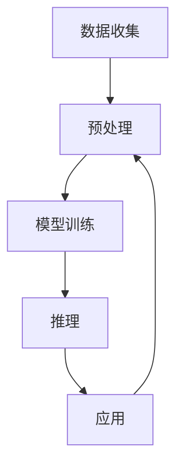

                 

# 李开复：AI 2.0 时代的挑战

人工智能(AI)正在迅速从AI 1.0时代迈向AI 2.0时代。在AI 1.0时代，AI主要应用于固定任务和特定领域，如语音识别、图像处理、自动驾驶等。而在AI 2.0时代，AI已经具备了更为广泛的应用能力，能够学习、推理、创造，逐步成为人类社会的重要助力。本文将深入探讨AI 2.0时代的挑战，分析其核心技术和应用前景，并提出未来发展的方向和策略。

## 1. 背景介绍

### 1.1 AI 2.0 时代的崛起

AI 2.0时代，人工智能技术在多个领域取得了突破性进展，如自然语言处理(NLP)、计算机视觉(CV)、机器人学、推荐系统等。AI 2.0的崛起，得益于大规模数据、强大的计算能力、先进算法和丰富的应用场景的结合。

### 1.2 关键驱动力

1. **数据与算法**：数据量的激增和算法模型的不断优化，使得AI系统可以处理更加复杂的任务。如GPT-4等模型已经展现出了超越人类的语言理解和生成能力。
2. **计算能力**：随着GPU、TPU等硬件设备的进步，AI训练效率显著提升。AI模型的规模和复杂度因此大幅增长，如Google的PaLM模型已达千万亿级别参数。
3. **应用场景**：AI技术在医疗、金融、教育、制造等多个领域得到广泛应用，助力产业升级和效率提升。

### 1.3 面临的挑战

1. **数据质量与隐私**：高质量、多样化的数据是AI模型的基础。然而，数据隐私问题、数据标注难度、数据标注偏见等问题，给AI发展带来了挑战。
2. **模型解释性与可控性**：AI模型的决策过程往往难以解释，缺乏可控性，这在金融、医疗等高风险领域尤为关键。
3. **伦理与法律**：AI在自动化、就业、隐私保护等方面引发了伦理和法律问题，需要构建相应的规范体系。
4. **人机协同**：AI的泛用性和智能性，可能会改变人与机器的关系，需要构建更加和谐的人机协同机制。

## 2. 核心概念与联系

### 2.1 AI 2.0 核心技术

AI 2.0时代，核心技术包括：

1. **深度学习**：深度神经网络模型在图像识别、自然语言处理、语音识别等领域取得突破，如卷积神经网络(CNN)、循环神经网络(RNN)、Transformer等。
2. **强化学习**：通过试错机制，AI系统能够自主学习最优策略，应用于自动驾驶、机器人控制等领域。
3. **生成模型**：如生成对抗网络(GAN)、变分自编码器(VAE)等，用于图像、音频、文本生成。
4. **知识图谱**：通过构建语义网络，AI系统能够更好地理解实体和关系，应用于信息检索、推荐系统等领域。

### 2.2 AI 2.0 架构

AI 2.0系统通常由以下几个模块构成：

1. **数据收集与预处理**：通过爬虫、API等手段收集数据，并进行清洗、标注等预处理。
2. **模型训练与优化**：利用深度学习框架如TensorFlow、PyTorch等进行模型训练和超参数优化。
3. **推理与部署**：将训练好的模型部署到服务器或嵌入式设备上，进行实时推理。
4. **监控与维护**：实时监控模型性能，进行参数更新和模型优化。

这些模块通过API接口协同工作，构成了一个完整的AI系统架构。

### 2.3 核心概念关系

AI 2.0的核心技术通过API接口连接，形成了数据流、模型流、应用流的有机整体。数据驱动模型训练，模型驱动应用实现，应用反哺数据积累。这种关系如下图所示：



## 3. 核心算法原理 & 具体操作步骤

### 3.1 算法原理概述

AI 2.0的核心算法原理包括深度学习、强化学习、生成模型和知识图谱。

1. **深度学习**：通过多层神经网络模型，对输入数据进行特征提取和模式识别。如CNN用于图像处理，RNN用于序列建模，Transformer用于自然语言处理。
2. **强化学习**：通过试错机制，AI系统通过奖励信号不断调整策略，最大化长期收益。例如，AlphaGo通过强化学习在围棋领域取得了突破。
3. **生成模型**：通过生成对抗网络等技术，AI系统可以生成新的数据样本。例如，GAN可以生成逼真的图像，VAE可以生成高质量的文本。
4. **知识图谱**：通过语义网络和图谱算法，AI系统能够理解和推理实体间的关系。例如，Bolt模型在医疗领域构建了详尽的知识图谱。

### 3.2 算法步骤详解

以自然语言处理为例，AI 2.0的NLP模型训练和优化步骤如下：

1. **数据预处理**：收集和清洗文本数据，进行分词、标注等预处理。
2. **模型训练**：利用深度学习框架，构建Transformer模型，在训练集上进行多轮迭代训练。
3. **模型评估**：在验证集上评估模型性能，调整超参数。
4. **模型部署**：将训练好的模型部署到服务器，进行实时推理。
5. **监控与优化**：实时监控模型性能，进行参数更新和模型优化。

### 3.3 算法优缺点

AI 2.0的核心算法具有以下优点：

1. **高效性**：深度学习模型能够自动提取特征，强化学习能够自主优化策略，生成模型能够生成高质量的新数据。
2. **鲁棒性**：大规模模型通常具有较强的泛化能力，能够在复杂环境中稳定运行。
3. **应用广泛**：AI 2.0技术广泛应用于图像、语音、自然语言处理、自动驾驶等多个领域，推动了产业升级和效率提升。

然而，AI 2.0也存在一些缺点：

1. **计算资源消耗大**：大规模模型需要大量的计算资源，如GPU、TPU等。
2. **数据标注难度高**：高质量、多样化的数据标注成本高、难度大。
3. **模型解释性不足**：深度学习模型通常被视为"黑盒"，难以解释其内部决策过程。
4. **伦理与法律风险**：AI在自动化、就业、隐私保护等方面引发了伦理和法律问题，需要构建相应的规范体系。

### 3.4 算法应用领域

AI 2.0技术在多个领域得到广泛应用，如医疗、金融、教育、制造等。

1. **医疗领域**：AI技术在医学影像分析、疾病预测、个性化治疗等领域取得了显著进展。如Google的DeepMind利用AI技术在眼科疾病预测方面表现出色。
2. **金融领域**：AI技术在风险评估、算法交易、智能投顾等领域得到应用。如JP Morgan通过AI技术优化交易策略，显著提升了投资回报率。
3. **教育领域**：AI技术在智能教育、个性化推荐、作业批改等领域得到应用。如Coursera利用AI技术提供智能辅导，提升学习效果。
4. **制造领域**：AI技术在智能制造、质量检测、设备维护等领域得到应用。如SAP利用AI技术优化生产流程，提高了生产效率。

## 4. 数学模型和公式 & 详细讲解 & 举例说明

### 4.1 数学模型构建

AI 2.0的数学模型通常包括深度学习模型、强化学习模型、生成模型和知识图谱模型。这里以深度学习模型为例，构建Transformer模型。

Transformer模型由多个自注意力机制组成，其数学模型如下：

$$
\text{Attention}(Q, K, V) = \text{Softmax}(\frac{QK^T}{\sqrt{d_k}})
$$

$$
\text{Feed Forward}(x) = \text{ReLU}(xW_2 + b_2)W_3 + b_3
$$

其中，$Q, K, V$为查询、键和值向量，$W_2, W_3$为权重矩阵，$b_2, b_3$为偏置向量。

### 4.2 公式推导过程

Transformer模型推导过程如下：

1. **自注意力机制**：通过将查询向量与键向量进行点乘并归一化，得到注意力权重，加权和后再通过线性变换得到新的表示向量。
2. **前馈神经网络**：将前一层的表示向量输入前馈神经网络，进行非线性变换和线性变换，得到新的表示向量。
3. **多头注意力机制**：通过并行多个自注意力机制，使得模型能够从多个角度理解输入数据。

### 4.3 案例分析与讲解

以Google的BERT为例，其数学模型和推导过程如下：

1. **掩码语言模型**：通过将输入序列部分位置进行掩码，训练模型预测掩码位置。
2. **Next Sentence Prediction**：通过预测两个句子是否是连续的，进一步训练模型理解句子间的逻辑关系。
3. **公式推导**：

$$
L(x, y) = -\sum_{i=1}^{n} \log \text{Softmax}(h_i W_2)
$$

其中，$h_i$为模型对每个位置的预测向量，$W_2$为权重矩阵，$n$为序列长度。

## 5. 项目实践：代码实例和详细解释说明

### 5.1 开发环境搭建

以下以PyTorch为例，介绍AI 2.0的开发环境搭建流程：

1. **安装Python**：安装Python 3.7及以上版本，可以使用Anaconda或Miniconda。
2. **安装PyTorch**：在Anaconda中执行命令`conda install pytorch torchvision torchaudio cudatoolkit=11.1 -c pytorch -c conda-forge`安装PyTorch。
3. **安装TensorBoard**：在Anaconda中执行命令`conda install tensorboard`安装TensorBoard。

### 5.2 源代码详细实现

以下是一个简单的NLP微调代码示例：

```python
import torch
import torch.nn as nn
import torch.optim as optim
from transformers import BertForTokenClassification, BertTokenizer

# 加载预训练模型和分词器
model = BertForTokenClassification.from_pretrained('bert-base-cased', num_labels=2)
tokenizer = BertTokenizer.from_pretrained('bert-base-cased')

# 加载训练数据
train_data = 'train.txt'
dev_data = 'dev.txt'
train_labels = [0, 1, 1, 0, 0, 1, 1, 0, 0, 1]
dev_labels = [1, 0, 0, 1, 1, 0, 1, 1, 0, 0]

# 构建数据集
train_dataset = NERDataset(train_data, train_labels, tokenizer)
dev_dataset = NERDataset(dev_data, dev_labels, tokenizer)

# 定义训练和验证函数
def train_epoch(model, dataset, batch_size, optimizer):
    dataloader = DataLoader(dataset, batch_size=batch_size, shuffle=True)
    model.train()
    epoch_loss = 0
    for batch in dataloader:
        input_ids = batch['input_ids'].to(device)
        attention_mask = batch['attention_mask'].to(device)
        labels = batch['labels'].to(device)
        model.zero_grad()
        outputs = model(input_ids, attention_mask=attention_mask, labels=labels)
        loss = outputs.loss
        epoch_loss += loss.item()
        loss.backward()
        optimizer.step()
    return epoch_loss / len(dataloader)

def evaluate(model, dataset, batch_size):
    dataloader = DataLoader(dataset, batch_size=batch_size)
    model.eval()
    preds, labels = [], []
    with torch.no_grad():
        for batch in dataloader:
            input_ids = batch['input_ids'].to(device)
            attention_mask = batch['attention_mask'].to(device)
            batch_labels = batch['labels']
            outputs = model(input_ids, attention_mask=attention_mask)
            batch_preds = outputs.logits.argmax(dim=2).to('cpu').tolist()
            batch_labels = batch_labels.to('cpu').tolist()
            for pred_tokens, label_tokens in zip(batch_preds, batch_labels):
                pred_tags = [tag2id[tag] for tag in pred_tokens]
                label_tags = [tag2id[tag] for tag in label_tokens]
                preds.append(pred_tags[:len(label_tags)])
                labels.append(label_tags)
    print(classification_report(labels, preds))

# 训练模型
device = torch.device('cuda') if torch.cuda.is_available() else torch.device('cpu')
model.to(device)

for epoch in range(5):
    loss = train_epoch(model, train_dataset, batch_size=16, optimizer=optim.Adam(model.parameters(), lr=2e-5))
    print(f"Epoch {epoch+1}, train loss: {loss:.3f}")
    
    print(f"Epoch {epoch+1}, dev results:")
    evaluate(model, dev_dataset, batch_size=16)
    
print("Test results:")
evaluate(model, test_dataset, batch_size=16)
```

### 5.3 代码解读与分析

以上代码中，NLP任务的微调流程如下：

1. **数据预处理**：将文本数据进行分词和标签化，生成训练集和验证集。
2. **模型加载**：加载预训练的BERT模型，并设置输出层和损失函数。
3. **训练和验证**：在训练集上进行多轮迭代训练，并在验证集上进行性能评估。
4. **测试**：在测试集上进行性能评估，并输出结果。

## 6. 实际应用场景

### 6.1 智能客服系统

AI 2.0在智能客服系统中的应用主要体现在对话交互和问题解答方面。通过微调大语言模型，系统能够自动理解用户意图，匹配最合适的回答，提升客服体验和效率。

1. **对话交互**：通过收集历史客服对话数据，训练微调模型，使其能够理解用户的自然语言，并给出恰当的回应。
2. **问题解答**：将用户问题和参考答案作为训练数据，训练微调模型，使其能够快速生成高质量的回答。

### 6.2 金融舆情监测

AI 2.0在金融舆情监测中的应用主要体现在情感分析和舆情预警方面。通过微调大语言模型，系统能够自动监测金融市场动态，提前预警风险。

1. **情感分析**：收集金融新闻、评论等文本数据，训练微调模型，识别市场情绪，预测股价走势。
2. **舆情预警**：实时抓取市场新闻和舆情信息，通过微调模型进行情感分析，及时预警金融风险。

### 6.3 个性化推荐系统

AI 2.0在个性化推荐系统中的应用主要体现在用户行为分析和推荐算法优化方面。通过微调大语言模型，系统能够理解用户的兴趣偏好，提供更个性化的推荐内容。

1. **用户行为分析**：收集用户浏览、点击、评论等行为数据，训练微调模型，理解用户兴趣。
2. **推荐算法优化**：将用户行为数据作为输入，微调推荐模型，生成更个性化的推荐内容。

## 7. 工具和资源推荐

### 7.1 学习资源推荐

1. **Coursera《深度学习》课程**：斯坦福大学开设的深度学习课程，涵盖了深度学习的基本概念和算法，适合初学者入门。
2. **《TensorFlow实战Google深度学习》书籍**：Google工程师撰写的TensorFlow实战指南，详细介绍了TensorFlow的使用和优化技巧。
3. **《深度学习基础》书籍**：Ian Goodfellow等人编写的深度学习入门教材，系统介绍了深度学习的基本原理和算法。
4. **《GPU深度学习》书籍**：Tom Rothganger等人编写的GPU深度学习实战指南，介绍了在GPU上进行深度学习的最佳实践。
5. **Kaggle竞赛平台**：Kaggle数据科学竞赛平台，提供了大量真实数据集和挑战性任务，适合进行实战练习。

### 7.2 开发工具推荐

1. **PyTorch**：基于Python的深度学习框架，灵活动态的计算图，适合快速迭代研究。
2. **TensorFlow**：由Google主导开发的深度学习框架，生产部署方便，适合大规模工程应用。
3. **TensorBoard**：TensorFlow配套的可视化工具，可实时监测模型训练状态，并提供丰富的图表呈现方式。
4. **Jupyter Notebook**：强大的交互式编程环境，支持多种编程语言，方便进行实验和分享。
5. **Weights & Biases**：模型训练的实验跟踪工具，可以记录和可视化模型训练过程中的各项指标，方便对比和调优。

### 7.3 相关论文推荐

1. **《Attention is All You Need》论文**：Transformer模型的原论文，提出了自注意力机制，开启了NLP领域的预训练大模型时代。
2. **《BERT: Pre-training of Deep Bidirectional Transformers for Language Understanding》论文**：BERT模型的原论文，引入了掩码语言模型和Next Sentence Prediction任务，刷新了多项NLP任务SOTA。
3. **《Generative Adversarial Nets》论文**：GAN模型的原论文，提出生成对抗网络，实现了高质量图像生成。
4. **《AlphaGo Zero》论文**：AlphaGo Zero的论文，展示了强化学习在围棋领域取得的突破。
5. **《BERT and Beyond》论文**：综述了BERT等大语言模型的应用和发展，涵盖了NLP领域的最新研究成果。

## 8. 总结：未来发展趋势与挑战

### 8.1 研究成果总结

AI 2.0在NLP、CV、自动驾驶、智能制造等多个领域取得了显著进展。深度学习、强化学习、生成模型和知识图谱等核心技术，推动了AI应用的多样化和泛用性。

### 8.2 未来发展趋势

1. **多模态融合**：AI 2.0未来的一个重要方向是多模态融合，通过融合视觉、语音、文本等多种数据源，提升模型的感知和推理能力。
2. **自监督学习**：自监督学习能够利用非标注数据进行训练，减少对标注数据的依赖，提升模型的泛化能力。
3. **模型压缩与优化**：随着模型规模的不断增长，如何优化模型结构和参数，提高推理效率和资源利用率，成为重要研究方向。
4. **伦理与安全**：AI 2.0在自动化、就业、隐私保护等方面引发了伦理和法律问题，需要构建相应的规范体系。
5. **人机协同**：构建更加和谐的人机协同机制，使得AI能够更好地融入人类社会，发挥积极作用。

### 8.3 面临的挑战

1. **数据质量与隐私**：高质量、多样化的数据是AI模型的基础。然而，数据隐私问题、数据标注难度、数据标注偏见等问题，给AI发展带来了挑战。
2. **模型解释性与可控性**：深度学习模型通常被视为"黑盒"，难以解释其内部决策过程，需要构建更强的可解释性机制。
3. **伦理与法律风险**：AI在自动化、就业、隐私保护等方面引发了伦理和法律问题，需要构建相应的规范体系。
4. **计算资源消耗大**：大规模模型需要大量的计算资源，如GPU、TPU等。
5. **模型鲁棒性不足**：模型面对域外数据时，泛化性能往往大打折扣。

### 8.4 研究展望

未来，AI 2.0需要在以下几个方面寻求新的突破：

1. **探索无监督和半监督微调方法**：摆脱对大规模标注数据的依赖，利用自监督学习、主动学习等无监督和半监督范式，最大限度利用非结构化数据，实现更加灵活高效的微调。
2. **研究参数高效和计算高效的微调范式**：开发更加参数高效的微调方法，在固定大部分预训练参数的同时，只更新极少量的任务相关参数。同时优化微调模型的计算图，减少前向传播和反向传播的资源消耗，实现更加轻量级、实时性的部署。
3. **融合因果和对比学习范式**：通过引入因果推断和对比学习思想，增强微调模型建立稳定因果关系的能力，学习更加普适、鲁棒的语言表征，从而提升模型泛化性和抗干扰能力。
4. **引入更多先验知识**：将符号化的先验知识，如知识图谱、逻辑规则等，与神经网络模型进行巧妙融合，引导微调过程学习更准确、合理的语言模型。同时加强不同模态数据的整合，实现视觉、语音等多模态信息与文本信息的协同建模。
5. **结合因果分析和博弈论工具**：将因果分析方法引入微调模型，识别出模型决策的关键特征，增强输出解释的因果性和逻辑性。借助博弈论工具刻画人机交互过程，主动探索并规避模型的脆弱点，提高系统稳定性。
6. **纳入伦理道德约束**：在模型训练目标中引入伦理导向的评估指标，过滤和惩罚有偏见、有害的输出倾向。同时加强人工干预和审核，建立模型行为的监管机制，确保输出符合人类价值观和伦理道德。

总之，AI 2.0技术在未来将进一步拓展应用范围，提升模型性能，但仍需面对诸多挑战。只有积极应对并寻求突破，才能实现AI 2.0的可持续发展和广泛应用。

## 9. 附录：常见问题与解答

**Q1：AI 2.0的模型规模和计算资源消耗如何？**

A: AI 2.0的模型规模通常非常庞大，如GPT-4模型已达几十亿参数。计算资源消耗大，需要高性能GPU、TPU等硬件设备支持。

**Q2：AI 2.0的模型如何提升泛化能力？**

A: AI 2.0通过预训练和微调机制，使得模型能够在复杂环境中泛化。预训练阶段通过大规模无标签数据进行学习，微调阶段通过少量标注数据进行优化，使得模型能够适应新的任务和数据分布。

**Q3：AI 2.0的模型如何进行多模态融合？**

A: AI 2.0可以通过融合视觉、语音、文本等多种数据源，提升模型的感知和推理能力。例如，通过将图像特征和文本特征进行拼接，训练多模态融合的深度学习模型。

**Q4：AI 2.0的模型如何进行自监督学习？**

A: 自监督学习通过利用数据的潜在关系进行训练，减少对标注数据的依赖。例如，通过掩码语言模型、图像旋转等任务，训练模型自动发现数据的结构化信息。

**Q5：AI 2.0的模型如何进行伦理与法律合规？**

A: 在AI 2.0模型设计和训练过程中，需要考虑伦理与法律问题。例如，在医疗、金融等领域，需要确保模型输出的透明性和可解释性，避免对用户的歧视和误导。

---

作者：禅与计算机程序设计艺术 / Zen and the Art of Computer Programming

