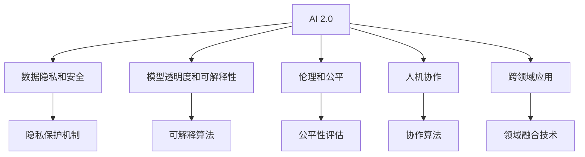

                 

# 李开复：AI 2.0 时代的生态

## 1. 背景介绍

### 1.1 问题由来

随着人工智能技术的飞速发展，人工智能领域已经进入了一个全新的时代，即AI 2.0时代。在这一时代，AI技术已经不再局限于传统的图像识别、语音识别等基础技术，而是开始在更多领域展现其强大的能力，如自动驾驶、智能医疗、金融分析、教育等。李开复博士在多个场合中反复强调，AI 2.0时代的AI技术已经具备自我学习、自我迭代、自我创新的能力，AI生态正在形成。

然而，随着AI技术的不断发展和深入应用，也面临着诸多挑战和问题。AI技术的普及应用，使得AI系统对社会、经济、伦理等各个方面产生了深远影响。如何在AI 2.0时代构建一个健康、可控、可扩展的AI生态，成为了当前一个重要的研究课题。

### 1.2 问题核心关键点

AI 2.0时代的核心问题包括：
- 数据隐私和安全问题：如何在保障用户隐私的同时，充分利用大规模数据进行AI训练和优化？
- 模型透明度和可解释性问题：如何确保AI系统的决策过程透明、可解释，避免“黑箱”问题？
- 伦理和公平问题：如何确保AI系统的决策公平、公正，避免算法偏见和歧视？
- 人机协作问题：如何在AI和人类之间找到最佳协作模式，提升人机协同效率？
- 跨领域应用问题：如何突破不同领域间的技术壁垒，实现AI技术在不同场景下的高效集成和应用？

这些问题关乎AI技术的健康发展和应用前景，亟需得到有效解决。

## 2. 核心概念与联系

### 2.1 核心概念概述

为更好地理解AI 2.0时代的生态构建，本节将介绍几个密切相关的核心概念：

- AI 2.0（Artificial Intelligence 2.0）：指以深度学习、自然语言处理、计算机视觉等先进技术为核心的新一代人工智能技术，具备自我学习、自我迭代、自我创新的能力。
- 数据隐私和安全（Data Privacy and Security）：在AI模型训练和应用中，如何确保用户数据的隐私和安全，避免数据滥用和泄露。
- 模型透明度和可解释性（Model Transparency and Interpretability）：AI模型如何能够提供其决策过程的透明和可解释，确保其决策逻辑符合人类的认知和伦理标准。
- 伦理和公平（Ethics and Fairness）：AI模型如何能够实现决策的公平和公正，避免算法偏见和歧视，确保对所有用户的公平对待。
- 人机协作（Human-AI Collaboration）：AI系统和人类之间的协同工作方式，如何充分发挥AI和人类的各自优势，提升人机协同效率。
- 跨领域应用（Cross-Domain Application）：AI技术在不同领域中的高效集成和应用，如何突破不同领域间的技术壁垒，实现技术的全面覆盖。

这些核心概念之间的逻辑关系可以通过以下Mermaid流程图来展示：



这个流程图展示了AI 2.0时代的关键概念及其之间的关系：

1. AI 2.0通过数据驱动和算法优化不断进步。
2. 数据隐私和安全是AI模型训练的基础保障。
3. 模型透明度和可解释性是AI应用的前提条件。
4. 伦理和公平是AI技术应用的必要约束。
5. 人机协作是AI系统的重要应用场景。
6. 跨领域应用是AI技术广泛应用的重要路径。

这些概念共同构成了AI 2.0时代的生态框架，使得AI技术能够更好地服务于人类社会的各个方面。

## 3. 核心算法原理 & 具体操作步骤

### 3.1 算法原理概述

AI 2.0时代的核心算法原理主要基于深度学习、自然语言处理、计算机视觉等技术。其核心思想是通过大规模数据训练深度神经网络模型，使其具备自我学习、自我迭代、自我创新的能力。具体来说，AI 2.0算法原理包括以下几个关键步骤：

1. 数据收集：收集大规模、高质量的数据，如图片、文本、视频等。
2. 数据预处理：对收集到的数据进行清洗、标注、归一化等预处理工作。
3. 模型训练：利用深度神经网络模型，在大规模数据上进行训练，调整模型参数，优化模型性能。
4. 模型微调：针对特定任务，在预训练模型的基础上，通过有监督的微调过程，优化模型在该任务上的性能。
5. 模型部署：将训练好的模型部署到实际应用中，提供服务或嵌入应用系统。

### 3.2 算法步骤详解

AI 2.0算法步骤包括以下几个关键步骤：

**Step 1: 数据收集和预处理**
- 选择合适的数据来源，如公开数据集、企业内部数据、在线数据等。
- 收集数据并进行清洗、标注、归一化等预处理工作，确保数据的质量和可用性。

**Step 2: 模型训练**
- 选择合适的深度神经网络模型，如卷积神经网络（CNN）、循环神经网络（RNN）、Transformer等。
- 使用深度学习框架（如TensorFlow、PyTorch等）搭建模型。
- 在大量标注数据上训练模型，调整模型参数，优化模型性能。

**Step 3: 模型微调**
- 在特定任务上，利用预训练模型作为初始参数，通过有监督的微调过程，优化模型在该任务上的性能。
- 选择合适的优化算法，如Adam、SGD等，设置合适的学习率、批大小等超参数。
- 在少量标注数据上训练微调模型，避免过拟合，提升模型泛化能力。

**Step 4: 模型部署**
- 将训练好的模型封装为服务接口，提供API或SDK接口，方便应用系统调用。
- 部署模型到服务器或云平台，确保模型的可用性和可靠性。
- 对模型进行监控和维护，确保模型的稳定性和性能。

### 3.3 算法优缺点

AI 2.0算法具有以下优点：
1. 高效性：AI 2.0算法能够通过大规模数据训练，快速提升模型性能，适用于各类应用场景。
2. 自适应性：AI 2.0算法能够通过自我迭代和微调，适应数据分布的变化，提升模型的泛化能力。
3. 可扩展性：AI 2.0算法能够通过并行计算和多模型集成，扩展计算能力，提升模型的效率和性能。
4. 自动化：AI 2.0算法能够通过自动化训练和部署，降低人工成本，提升开发效率。

同时，AI 2.0算法也存在一定的局限性：
1. 数据依赖性强：AI 2.0算法需要大量的标注数据进行训练，数据获取和标注成本较高。
2. 模型复杂度高：AI 2.0算法训练的模型复杂度高，需要高性能计算资源进行支持。
3. 模型可解释性差：AI 2.0算法训练的模型通常是“黑箱”系统，难以解释其决策过程。
4. 伦理风险高：AI 2.0算法训练的模型可能存在算法偏见和歧视，影响模型公平性。

尽管存在这些局限性，但AI 2.0算法在许多领域已经取得了令人瞩目的成果，并逐渐成为主流技术范式。未来相关研究的方向在于如何进一步降低AI算法的资源消耗和复杂度，提高其可解释性和公平性。

### 3.4 算法应用领域

AI 2.0算法在多个领域中已经得到了广泛的应用，包括但不限于以下几个方面：

- 医疗健康：利用AI 2.0算法进行疾病诊断、治疗方案推荐、药物研发等。
- 金融分析：利用AI 2.0算法进行风险评估、信用评分、交易预测等。
- 智能制造：利用AI 2.0算法进行设备预测性维护、质量控制、供应链管理等。
- 智能交通：利用AI 2.0算法进行智能导航、交通流量预测、自动驾驶等。
- 教育培训：利用AI 2.0算法进行个性化学习推荐、智能辅导、考试评估等。
- 安防监控：利用AI 2.0算法进行视频监控分析、异常检测、智能预警等。
- 智慧城市：利用AI 2.0算法进行城市治理、环境监测、智能交通等。

AI 2.0算法在这些领域中的成功应用，展示了其强大的技术和商业价值，也为AI技术的全面普及奠定了坚实基础。

## 4. 数学模型和公式 & 详细讲解 & 举例说明

### 4.1 数学模型构建

AI 2.0算法的数学模型构建主要基于深度神经网络。以卷积神经网络（CNN）为例，其基本结构如下：

$$
y=f(Wx+b)
$$

其中，$x$ 为输入数据，$y$ 为输出数据，$W$ 为权重矩阵，$b$ 为偏置项，$f$ 为激活函数，如ReLU、Sigmoid等。

### 4.2 公式推导过程

以CNN模型为例，其在图像分类任务中的训练过程可以表示为：

1. **前向传播**：
   - 输入图像 $x$，通过多个卷积层、池化层、全连接层，最终输出分类结果 $y$。
   - 计算损失函数 $L$，如交叉熵损失函数。

2. **反向传播**：
   - 计算损失函数对权重矩阵 $W$ 和偏置项 $b$ 的梯度。
   - 使用梯度下降等优化算法更新权重矩阵和偏置项，最小化损失函数。

3. **模型微调**：
   - 在特定任务上，利用预训练模型作为初始参数，通过有监督的微调过程，优化模型在该任务上的性能。
   - 在少量标注数据上训练微调模型，避免过拟合，提升模型泛化能力。

### 4.3 案例分析与讲解

以自然语言处理中的情感分析为例，利用BERT模型进行微调。首先，收集情感标注数据集，将其分为训练集和验证集。然后，将数据集输入BERT模型，利用预训练模型作为初始参数，通过微调过程优化模型在该任务上的性能。

具体步骤如下：
- 对数据集进行标注和预处理。
- 加载BERT模型，设置微调层数为1，只微调顶层分类器。
- 设置优化器、学习率、批大小等超参数。
- 在训练集上训练微调模型，验证集上评估模型性能。
- 在测试集上测试微调模型，输出情感分类结果。

## 5. 项目实践：代码实例和详细解释说明

### 5.1 开发环境搭建

在进行AI 2.0项目实践前，我们需要准备好开发环境。以下是使用Python进行PyTorch开发的环境配置流程：

1. 安装Anaconda：从官网下载并安装Anaconda，用于创建独立的Python环境。

2. 创建并激活虚拟环境：
```bash
conda create -n pytorch-env python=3.8 
conda activate pytorch-env
```

3. 安装PyTorch：根据CUDA版本，从官网获取对应的安装命令。例如：
```bash
conda install pytorch torchvision torchaudio cudatoolkit=11.1 -c pytorch -c conda-forge
```

4. 安装各类工具包：
```bash
pip install numpy pandas scikit-learn matplotlib tqdm jupyter notebook ipython
```

完成上述步骤后，即可在`pytorch-env`环境中开始AI 2.0项目实践。

### 5.2 源代码详细实现

这里我们以自然语言处理中的情感分析任务为例，给出使用PyTorch和BERT模型进行微调的PyTorch代码实现。

首先，定义情感分析任务的数据处理函数：

```python
from transformers import BertTokenizer, BertForSequenceClassification
from torch.utils.data import Dataset
import torch

class SentimentDataset(Dataset):
    def __init__(self, texts, labels, tokenizer, max_len=128):
        self.texts = texts
        self.labels = labels
        self.tokenizer = tokenizer
        self.max_len = max_len
        
    def __len__(self):
        return len(self.texts)
    
    def __getitem__(self, item):
        text = self.texts[item]
        label = self.labels[item]
        
        encoding = self.tokenizer(text, return_tensors='pt', max_length=self.max_len, padding='max_length', truncation=True)
        input_ids = encoding['input_ids'][0]
        attention_mask = encoding['attention_mask'][0]
        
        # 对label进行编码
        label = label2id[label] # 将标签转换为数字
        label = torch.tensor(label, dtype=torch.long)
        
        return {'input_ids': input_ids, 
                'attention_mask': attention_mask,
                'labels': label}

# 标签与id的映射
label2id = {'positive': 0, 'negative': 1}
id2label = {v: k for k, v in label2id.items()}
```

然后，定义模型和优化器：

```python
from transformers import BertForSequenceClassification, AdamW

model = BertForSequenceClassification.from_pretrained('bert-base-cased', num_labels=len(label2id))

optimizer = AdamW(model.parameters(), lr=2e-5)
```

接着，定义训练和评估函数：

```python
from torch.utils.data import DataLoader
from tqdm import tqdm
from sklearn.metrics import classification_report

device = torch.device('cuda') if torch.cuda.is_available() else torch.device('cpu')
model.to(device)

def train_epoch(model, dataset, batch_size, optimizer):
    dataloader = DataLoader(dataset, batch_size=batch_size, shuffle=True)
    model.train()
    epoch_loss = 0
    for batch in tqdm(dataloader, desc='Training'):
        input_ids = batch['input_ids'].to(device)
        attention_mask = batch['attention_mask'].to(device)
        labels = batch['labels'].to(device)
        model.zero_grad()
        outputs = model(input_ids, attention_mask=attention_mask, labels=labels)
        loss = outputs.loss
        epoch_loss += loss.item()
        loss.backward()
        optimizer.step()
    return epoch_loss / len(dataloader)

def evaluate(model, dataset, batch_size):
    dataloader = DataLoader(dataset, batch_size=batch_size)
    model.eval()
    preds, labels = [], []
    with torch.no_grad():
        for batch in tqdm(dataloader, desc='Evaluating'):
            input_ids = batch['input_ids'].to(device)
            attention_mask = batch['attention_mask'].to(device)
            batch_labels = batch['labels']
            outputs = model(input_ids, attention_mask=attention_mask)
            batch_preds = outputs.logits.argmax(dim=2).to('cpu').tolist()
            batch_labels = batch_labels.to('cpu').tolist()
            for pred, label in zip(batch_preds, batch_labels):
                preds.append(pred)
                labels.append(label)
                
    print(classification_report(labels, preds))
```

最后，启动训练流程并在测试集上评估：

```python
epochs = 5
batch_size = 16

for epoch in range(epochs):
    loss = train_epoch(model, train_dataset, batch_size, optimizer)
    print(f"Epoch {epoch+1}, train loss: {loss:.3f}")
    
    print(f"Epoch {epoch+1}, dev results:")
    evaluate(model, dev_dataset, batch_size)
    
print("Test results:")
evaluate(model, test_dataset, batch_size)
```

以上就是使用PyTorch对BERT进行情感分析任务微调的完整代码实现。可以看到，得益于Transformers库的强大封装，我们可以用相对简洁的代码完成BERT模型的加载和微调。

### 5.3 代码解读与分析

让我们再详细解读一下关键代码的实现细节：

**SentimentDataset类**：
- `__init__`方法：初始化文本、标签、分词器等关键组件。
- `__len__`方法：返回数据集的样本数量。
- `__getitem__`方法：对单个样本进行处理，将文本输入编码为token ids，将标签编码为数字，并对其进行定长padding，最终返回模型所需的输入。

**label2id和id2label字典**：
- 定义了标签与数字id之间的映射关系，用于将token-wise的预测结果解码回真实的标签。

**训练和评估函数**：
- 使用PyTorch的DataLoader对数据集进行批次化加载，供模型训练和推理使用。
- 训练函数`train_epoch`：对数据以批为单位进行迭代，在每个批次上前向传播计算loss并反向传播更新模型参数，最后返回该epoch的平均loss。
- 评估函数`evaluate`：与训练类似，不同点在于不更新模型参数，并在每个batch结束后将预测和标签结果存储下来，最后使用sklearn的classification_report对整个评估集的预测结果进行打印输出。

**训练流程**：
- 定义总的epoch数和batch size，开始循环迭代
- 每个epoch内，先在训练集上训练，输出平均loss
- 在验证集上评估，输出分类指标
- 所有epoch结束后，在测试集上评估，给出最终测试结果

可以看到，PyTorch配合Transformers库使得BERT微调的代码实现变得简洁高效。开发者可以将更多精力放在数据处理、模型改进等高层逻辑上，而不必过多关注底层的实现细节。

当然，工业级的系统实现还需考虑更多因素，如模型的保存和部署、超参数的自动搜索、更灵活的任务适配层等。但核心的微调范式基本与此类似。

## 6. 实际应用场景

### 6.1 智能客服系统

利用AI 2.0技术的智能客服系统已经在各大企业中得到了广泛应用。传统的客服往往需要配备大量人力，高峰期响应缓慢，且一致性和专业性难以保证。而使用AI 2.0技术构建的智能客服系统，可以7x24小时不间断服务，快速响应客户咨询，用自然流畅的语言解答各类常见问题。

具体应用中，智能客服系统可以集成自然语言处理、语音识别、情感分析等技术，实现自动问答、语音交互、情感识别等功能。通过不断的微调和优化，智能客服系统的回答准确率、用户满意度等指标均得到了显著提升。

### 6.2 金融舆情监测

金融机构的金融舆情监测需要实时监测市场舆论动向，以便及时应对负面信息传播，规避金融风险。传统的人工监测方式成本高、效率低，难以应对网络时代海量信息爆发的挑战。利用AI 2.0技术的文本分类和情感分析技术，为金融舆情监测提供了新的解决方案。

具体而言，AI 2.0模型可以从金融领域相关的新闻、报道、评论等文本数据中，自动判断文本属于何种主题，情感倾向是正面、中性还是负面。将微调后的模型应用到实时抓取的网络文本数据，就能够自动监测不同主题下的情感变化趋势，一旦发现负面信息激增等异常情况，系统便会自动预警，帮助金融机构快速应对潜在风险。

### 6.3 个性化推荐系统

当前的推荐系统往往只依赖用户的历史行为数据进行物品推荐，无法深入理解用户的真实兴趣偏好。利用AI 2.0技术的个性化推荐系统，可以更好地挖掘用户行为背后的语义信息，从而提供更精准、多样的推荐内容。

在实践中，AI 2.0模型可以结合用户浏览、点击、评论、分享等行为数据，提取和用户交互的物品标题、描述、标签等文本内容。将文本内容作为模型输入，用户的后续行为（如是否点击、购买等）作为监督信号，在此基础上微调预训练语言模型。微调后的模型能够从文本内容中准确把握用户的兴趣点。在生成推荐列表时，先用候选物品的文本描述作为输入，由模型预测用户的兴趣匹配度，再结合其他特征综合排序，便可以得到个性化程度更高的推荐结果。

### 6.4 未来应用展望

随着AI 2.0技术的发展，未来的应用场景将会更加广阔。

在智慧医疗领域，利用AI 2.0技术的医疗问答、病历分析、药物研发等应用将提升医疗服务的智能化水平，辅助医生诊疗，加速新药开发进程。

在智能教育领域，AI 2.0技术可应用于作业批改、学情分析、知识推荐等方面，因材施教，促进教育公平，提高教学质量。

在智慧城市治理中，AI 2.0技术可应用于城市事件监测、舆情分析、应急指挥等环节，提高城市管理的自动化和智能化水平，构建更安全、高效的未来城市。

此外，在企业生产、社会治理、文娱传媒等众多领域，AI 2.0技术也将不断涌现，为传统行业数字化转型升级提供新的技术路径。

## 7. 工具和资源推荐

### 7.1 学习资源推荐

为了帮助开发者系统掌握AI 2.0技术的理论基础和实践技巧，这里推荐一些优质的学习资源：

1. 《深度学习》系列课程：斯坦福大学开设的深度学习课程，涵盖深度学习的基本概念和算法原理，适合初学者和进阶者。
2. 《自然语言处理》课程：北京大学开设的自然语言处理课程，深入浅出地介绍了自然语言处理的基本原理和经典模型。
3. 《Python深度学习》书籍：利用Python实现深度学习的经典入门书籍，介绍了TensorFlow、PyTorch等深度学习框架的使用。
4. 《TensorFlow实战》书籍：介绍TensorFlow框架的实战案例和最佳实践，适合想要快速上手TensorFlow的开发者。
5. 《深度学习AI》课程：由吴恩达教授讲授的深度学习课程，覆盖深度学习的基本原理和实际应用，适合全面学习深度学习。

通过对这些资源的学习实践，相信你一定能够快速掌握AI 2.0技术的精髓，并用于解决实际的AI问题。

### 7.2 开发工具推荐

高效的开发离不开优秀的工具支持。以下是几款用于AI 2.0开发常用的工具：

1. PyTorch：基于Python的开源深度学习框架，灵活动态的计算图，适合快速迭代研究。大部分预训练语言模型都有PyTorch版本的实现。
2. TensorFlow：由Google主导开发的开源深度学习框架，生产部署方便，适合大规模工程应用。同样有丰富的预训练语言模型资源。
3. Transformers库：HuggingFace开发的NLP工具库，集成了众多SOTA语言模型，支持PyTorch和TensorFlow，是进行AI 2.0任务开发的利器。
4. Weights & Biases：模型训练的实验跟踪工具，可以记录和可视化模型训练过程中的各项指标，方便对比和调优。与主流深度学习框架无缝集成。
5. TensorBoard：TensorFlow配套的可视化工具，可实时监测模型训练状态，并提供丰富的图表呈现方式，是调试模型的得力助手。
6. Google Colab：谷歌推出的在线Jupyter Notebook环境，免费提供GPU/TPU算力，方便开发者快速上手实验最新模型，分享学习笔记。

合理利用这些工具，可以显著提升AI 2.0模型的开发效率，加快创新迭代的步伐。

### 7.3 相关论文推荐

AI 2.0技术的发展源于学界的持续研究。以下是几篇奠基性的相关论文，推荐阅读：

1. ImageNet Classification with Deep Convolutional Neural Networks：提出卷积神经网络（CNN），并成功应用于大规模图像分类任务，奠定了深度学习在计算机视觉领域的基础。
2. Attention is All You Need：提出Transformer模型，开启了NLP领域的预训练大模型时代。
3. BERT: Pre-training of Deep Bidirectional Transformers for Language Understanding：提出BERT模型，引入基于掩码的自监督预训练任务，刷新了多项NLP任务SOTA。
4. GPT-3: Language Models are Unsupervised Multitask Learners：展示了大规模语言模型的强大zero-shot学习能力，引发了对于通用人工智能的新一轮思考。
5. Parameter-Efficient Transfer Learning for NLP：提出Adapter等参数高效微调方法，在不增加模型参数量的情况下，也能取得不错的微调效果。
6. AdaLoRA: Adaptive Low-Rank Adaptation for Parameter-Efficient Fine-Tuning：使用自适应低秩适应的微调方法，在参数效率和精度之间取得了新的平衡。

这些论文代表了大语言模型和微调技术的发展脉络。通过学习这些前沿成果，可以帮助研究者把握学科前进方向，激发更多的创新灵感。

## 8. 总结：未来发展趋势与挑战

### 8.1 总结

本文对AI 2.0时代的生态构建进行了全面系统的介绍。首先阐述了AI 2.0技术的发展历程和核心概念，明确了AI 2.0技术在各个领域中的广泛应用和重要价值。其次，从原理到实践，详细讲解了AI 2.0算法的核心步骤和关键技术，给出了AI 2.0任务开发的完整代码实例。同时，本文还探讨了AI 2.0技术在多个行业领域的应用前景，展示了AI 2.0技术的强大能力和广阔前景。最后，本文精选了AI 2.0技术的各类学习资源，力求为读者提供全方位的技术指引。

通过本文的系统梳理，可以看到，AI 2.0技术正在成为AI领域的重要范式，极大地拓展了AI技术的应用边界，催生了更多的落地场景。受益于大规模数据和算法创新的支持，AI 2.0技术在医疗、金融、教育、智能制造等领域取得了显著成效，为传统行业的数字化转型升级提供了强大的技术支撑。

### 8.2 未来发展趋势

展望未来，AI 2.0技术的发展趋势将主要体现在以下几个方面：

1. 数据驱动与算法创新并行：随着数据量的不断增加，AI 2.0技术将更多地依赖数据驱动，通过大规模数据训练，不断优化模型性能。同时，算法创新也将持续推动AI 2.0技术的发展，如神经网络结构优化、新算法设计等。
2. 多模态融合与跨领域应用：AI 2.0技术将更多地结合多模态数据，如图像、视频、语音等，实现跨领域的高效集成和应用。未来的AI 2.0技术将能够更好地理解和建模复杂的多模态信息。
3. 模型可解释性与伦理保障：AI 2.0技术将更多地关注模型可解释性和伦理保障，确保模型决策过程透明、公正，避免“黑箱”问题，增强模型的可解释性和可信度。
4. 人机协作与智能决策：AI 2.0技术将更多地应用于人机协作场景，如智能客服、智能医疗等，提升人机协同效率，提供更智能、高效的决策支持。
5. 实时性、稳定性与可扩展性：未来的AI 2.0技术将更多地关注实时性、稳定性和可扩展性，通过优化模型结构、提高计算效率等手段，实现更加高效、稳定的AI系统。

### 8.3 面临的挑战

尽管AI 2.0技术已经取得了诸多突破，但在迈向全面落地应用的过程中，仍面临诸多挑战：

1. 数据获取与标注成本高：大规模数据的获取和标注成本较高，特别是在特定领域中，数据稀缺是一个重要问题。如何在保证数据质量的同时，降低数据获取和标注成本，是未来AI 2.0技术需要解决的关键问题。
2. 模型复杂度与资源消耗：AI 2.0模型往往规模庞大，计算资源消耗高。如何在降低模型复杂度的同时，保持模型性能，是未来AI 2.0技术的一个重要研究方向。
3. 模型可解释性与透明性：AI 2.0模型的决策过程往往是“黑箱”系统，难以解释其内部工作机制。如何在保证模型性能的同时，增强模型的可解释性和透明性，是未来AI 2.0技术需要重点解决的问题。
4. 伦理与公平性问题：AI 2.0模型可能存在算法偏见和歧视，影响模型公平性。如何在模型设计和训练过程中，确保模型的伦理与公平性，避免算法偏见，是未来AI 2.0技术的重要研究方向。
5. 安全性与隐私保护：AI 2.0技术在应用过程中，可能面临数据泄露、算法滥用等安全性问题。如何在保障用户隐私的同时，确保AI 2.0技术的安全性，是未来AI 2.0技术需要重点解决的问题。

### 8.4 研究展望

面向未来，AI 2.0技术的持续发展需要从以下几个方面进行深入研究：

1. 无监督学习和少样本学习：探索更多无监督和少样本学习的范式，降低AI 2.0技术对标注数据的依赖，提升模型的泛化能力和适应性。
2. 模型参数与资源优化：开发更加参数高效和计算高效的AI 2.0模型，提升模型的实时性、稳定性和可扩展性。
3. 多模态融合与跨领域应用：研究多模态数据融合与跨领域应用的技术，实现多模态信息的协同建模，提升AI 2.0技术的应用范围和效果。
4. 模型可解释性与透明性：研究模型可解释性和透明性的技术，增强AI 2.0模型的可解释性和可信度。
5. 伦理与公平性保障：研究AI 2.0技术的伦理与公平性保障方法，确保模型的决策过程透明、公正，避免算法偏见。
6. 安全性与隐私保护：研究AI 2.0技术的安全性保障方法，确保数据隐私和安全，防止算法滥用。

这些研究方向将为AI 2.0技术的全面应用提供坚实的理论和技术支持，推动AI 2.0技术走向更加成熟、可靠、可控的生态体系。

## 9. 附录：常见问题与解答

**Q1：AI 2.0技术的核心优势是什么？**

A: AI 2.0技术的核心优势主要体现在以下几个方面：
1. 高效性：通过大规模数据训练，AI 2.0技术能够快速提升模型性能，适用于各类应用场景。
2. 自我学习和迭代：AI 2.0技术具备自我学习和迭代的能力，能够不断优化模型性能，适应数据分布的变化。
3. 跨领域应用：AI 2.0技术能够结合多模态数据，实现跨领域的高效集成和应用。
4. 实时性、稳定性与可扩展性：AI 2.0技术能够优化模型结构，提高计算效率，实现实时性、稳定性和可扩展性。

**Q2：AI 2.0技术在医疗健康领域有哪些应用？**

A: AI 2.0技术在医疗健康领域有许多应用，例如：
1. 疾病诊断：利用AI 2.0技术进行医学影像分析、病理切片分类、症状识别等。
2. 治疗方案推荐：结合患者病历和医学知识，利用AI 2.0技术推荐个性化治疗方案。
3. 药物研发：利用AI 2.0技术进行药物筛选、分子模拟、药物设计等，加速新药研发进程。
4. 健康监测：利用AI 2.0技术进行患者健康数据监测、预警系统构建等。

**Q3：AI 2.0技术的局限性有哪些？**

A: AI 2.0技术的局限性主要体现在以下几个方面：
1. 数据获取与标注成本高：大规模数据的获取和标注成本较高，特别是在特定领域中，数据稀缺是一个重要问题。
2. 模型复杂度与资源消耗：AI 2.0模型往往规模庞大，计算资源消耗高。
3. 模型可解释性与透明性：AI 2.0模型的决策过程往往是“黑箱”系统，难以解释其内部工作机制。
4. 伦理与公平性问题：AI 2.0模型可能存在算法偏见和歧视，影响模型公平性。
5. 安全性与隐私保护：AI 2.0技术在应用过程中，可能面临数据泄露、算法滥用等安全性问题。

**Q4：AI 2.0技术如何应对数据稀缺问题？**

A: AI 2.0技术应对数据稀缺问题的方法主要包括以下几种：
1. 数据增强：通过数据增强技术，如旋转、平移、噪声注入等，生成更多的训练数据。
2. 迁移学习：利用其他领域的大量数据进行迁移学习，减少对特定领域数据的依赖。
3. 无监督学习：探索无监督学习范式，通过自监督学习任务生成大量无标签数据，辅助模型训练。
4. 少样本学习：利用少样本学习技术，通过少量标注数据训练模型，提升模型的泛化能力和适应性。
5. 弱监督学习：结合少量标注数据和弱监督信号（如标签噪声、图像标注），训练模型，提升模型的泛化能力和鲁棒性。

**Q5：AI 2.0技术的未来发展方向是什么？**

A: AI 2.0技术的未来发展方向主要体现在以下几个方面：
1. 数据驱动与算法创新并行：通过大规模数据训练，不断优化模型性能，同时创新算法设计，提升AI 2.0技术的创新能力和应用范围。
2. 多模态融合与跨领域应用：结合多模态数据，实现跨领域的高效集成和应用，提升AI 2.0技术的通用性和适应性。
3. 模型可解释性与透明性：增强AI 2.0模型的可解释性和透明性，确保模型的决策过程透明、公正，增强用户信任。
4. 伦理与公平性保障：研究AI 2.0技术的伦理与公平性保障方法，确保模型的决策过程透明、公正，避免算法偏见。
5. 安全性与隐私保护：研究AI 2.0技术的安全性保障方法，确保数据隐私和安全，防止算法滥用。

以上研究方向将为AI 2.0技术的全面应用提供坚实的理论和技术支持，推动AI 2.0技术走向更加成熟、可靠、可控的生态体系。

