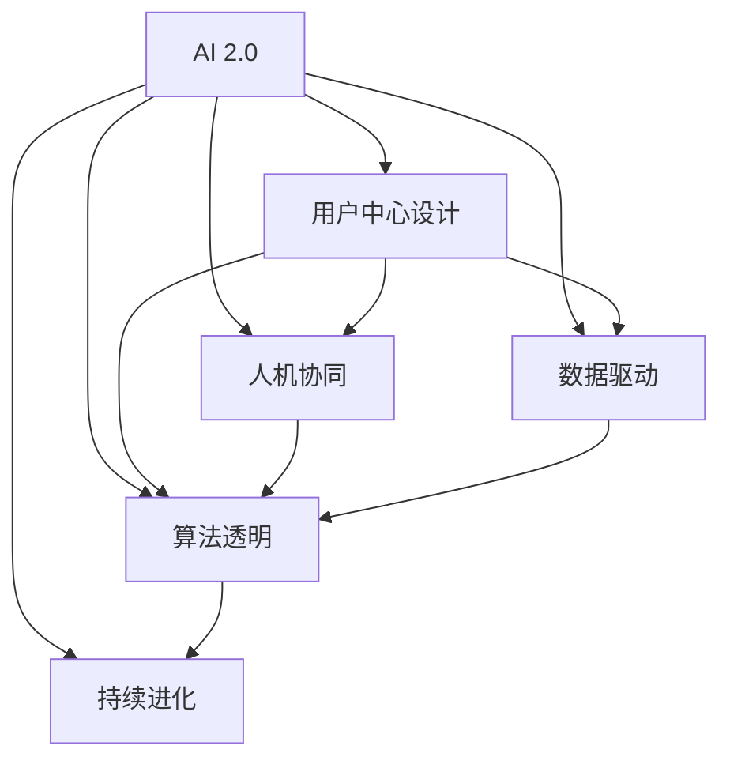

                 

# 李开复：AI 2.0 时代的用户

> 关键词：人工智能, AI 2.0, 用户中心, 人机协同, 数据驱动, 个性化, 算法透明

## 1. 背景介绍

### 1.1 问题由来
随着人工智能技术的快速演进，我们正处于一个全新的AI 2.0时代。AI 2.0不仅仅是技术层面的突破，更是一场深刻的产业革命和社会变革。在这个时代，人工智能技术将深度融合到各行各业，重塑人们的生产生活方式。

在这个过程中，如何构建以人为本的用户体验，让AI技术真正服务于用户，成为关键问题。用户不再是单纯的“数据”，而是AI系统的重要参与者，甚至是设计者和共同创作者。AI 2.0时代的用户，将更加主动、智慧、包容，他们将定义AI的发展方向。

### 1.2 问题核心关键点
AI 2.0时代，用户需求和期望不断变化，如何满足这些需求并超越预期，成为AI发展的核心挑战。本文将探讨以下几个关键点：

1. **用户中心设计**：如何让用户成为AI设计的主体，设计更具人性化的AI系统。
2. **人机协同**：如何构建人与机器之间无缝协同的交互方式。
3. **数据驱动**：如何利用大数据分析用户行为，提供个性化的AI服务。
4. **算法透明**：如何增强AI算法的透明度，让用户理解和信任AI决策。
5. **持续进化**：如何构建自适应、可进化的AI系统，持续提升用户满意度。

## 2. 核心概念与联系

### 2.1 核心概念概述

为更好地理解AI 2.0时代用户需求和AI系统的设计原则，本节将介绍几个关键概念：

- **AI 2.0**：指通过深度学习、自然语言处理、计算机视觉等先进技术，构建智能、自适应、自进化的AI系统。AI 2.0时代的AI技术更加灵活、高效、智能，能够处理复杂、动态、多模态的数据。
- **用户中心设计**：强调以用户需求为中心，设计AI系统，提升用户体验和满意度。用户不仅是被服务的对象，更是AI系统的设计者和参与者。
- **人机协同**：指人与机器之间的互动方式，通过自然语言交互、手势识别、虚拟助手等方式，实现无缝协同。
- **数据驱动**：利用大数据分析用户行为和偏好，为AI系统提供决策依据，实现个性化的AI服务。
- **算法透明**：增强AI算法的可解释性，让用户能够理解AI决策过程，提升信任感。
- **持续进化**：构建自适应、自进化的AI系统，能够根据用户反馈和环境变化，不断优化和升级。

这些概念之间存在密切联系，共同构成了AI 2.0时代的设计原则和技术框架。通过理解这些概念，可以更好地设计和实现AI系统，提升用户满意度。

### 2.2 核心概念原理和架构的 Mermaid 流程图(Mermaid 流程节点中不要有括号、逗号等特殊字符)


## 3. 核心算法原理 & 具体操作步骤

### 3.1 算法原理概述

AI 2.0时代，用户需求复杂多样，AI系统需要具备高度的灵活性和适应性。基于监督学习的微调方法在AI 2.0中仍然具有重要地位，但其局限性也日益显现。因此，本文将重点探讨一种基于参数高效微调和提示学习的AI系统优化方法。

**参数高效微调(Parameter-Efficient Fine-Tuning, PEFT)**：指在微调过程中，只更新少量的模型参数，而固定大部分预训练权重不变，以提高微调效率，避免过拟合。

**提示学习(Prompt Learning)**：通过在输入文本中添加提示模板(Prompt Template)，引导AI系统进行特定任务的推理和生成。可以在不更新模型参数的情况下，实现零样本或少样本学习。

这两种方法结合，可以显著提升AI系统的适应性和性能，同时降低对标注数据的依赖。

### 3.2 算法步骤详解

基于参数高效微调和提示学习的AI系统优化流程如下：

1. **准备数据**：收集目标任务的少量标注数据，并进行预处理和标注。
2. **模型加载**：选择合适的预训练模型，如BERT、GPT等，加载到系统中。
3. **设计提示模板**：根据目标任务设计合理的提示模板，引导AI系统进行推理和生成。
4. **参数冻结**：冻结预训练模型的底层参数，只微调顶层参数。
5. **微调训练**：使用微调数据和提示模板进行训练，优化模型参数。
6. **效果评估**：在验证集上评估模型效果，进行必要的调整。
7. **持续优化**：根据用户反馈和数据变化，不断更新和优化模型。

### 3.3 算法优缺点

**优点**：
- **参数高效**：只更新少量参数，避免过拟合，提高微调效率。
- **适应性强**：通过提示模板，能够快速适应新的任务和数据。
- **数据依赖低**：能够在少量标注数据下进行有效微调。

**缺点**：
- **泛化能力有限**：提示模板设计不当可能导致模型泛化能力不足。
- **解释性不足**：AI系统决策过程较难解释，用户难以理解。

### 3.4 算法应用领域

参数高效微调和提示学习在AI 2.0时代的应用领域非常广泛，以下是几个典型应用：

1. **自然语言处理**：用于文本分类、情感分析、问答系统等任务。通过微调和提示，提升AI系统的理解能力和生成能力。
2. **计算机视觉**：用于图像分类、目标检测、图像生成等任务。通过微调和提示，提升AI系统的视觉理解和生成能力。
3. **推荐系统**：用于个性化推荐、广告投放等任务。通过微调和提示，提升AI系统的推荐精准度和用户满意度。
4. **智能客服**：用于对话系统和智能客服机器人。通过微调和提示，提升AI系统的对话理解和生成能力。
5. **医疗诊断**：用于医学影像分析和疾病诊断等任务。通过微调和提示，提升AI系统的诊断准确性和解释能力。

## 4. 数学模型和公式 & 详细讲解

### 4.1 数学模型构建

AI 2.0时代，用户需求复杂多样，AI系统需要具备高度的灵活性和适应性。基于监督学习的微调方法在AI 2.0中仍然具有重要地位，但其局限性也日益显现。因此，本文将重点探讨一种基于参数高效微调和提示学习的AI系统优化方法。

**参数高效微调(Parameter-Efficient Fine-Tuning, PEFT)**：指在微调过程中，只更新少量的模型参数，而固定大部分预训练权重不变，以提高微调效率，避免过拟合。

**提示学习(Prompt Learning)**：通过在输入文本中添加提示模板(Prompt Template)，引导AI系统进行特定任务的推理和生成。可以在不更新模型参数的情况下，实现零样本或少样本学习。

这两种方法结合，可以显著提升AI系统的适应性和性能，同时降低对标注数据的依赖。

### 4.2 公式推导过程

以自然语言处理任务为例，基于参数高效微调和提示学习的AI系统优化流程如下：

1. **准备数据**：收集目标任务的少量标注数据，并进行预处理和标注。
2. **模型加载**：选择合适的预训练模型，如BERT、GPT等，加载到系统中。
3. **设计提示模板**：根据目标任务设计合理的提示模板，引导AI系统进行推理和生成。
4. **参数冻结**：冻结预训练模型的底层参数，只微调顶层参数。
5. **微调训练**：使用微调数据和提示模板进行训练，优化模型参数。
6. **效果评估**：在验证集上评估模型效果，进行必要的调整。
7. **持续优化**：根据用户反馈和数据变化，不断更新和优化模型。

### 4.3 案例分析与讲解

**案例1：个性化推荐系统**

在个性化推荐系统中，AI系统需要根据用户的历史行为和偏好，推荐合适的商品或内容。通过微调和提示，AI系统能够快速适应新的用户和数据，提升推荐效果。

具体而言，可以收集用户的历史浏览、点击、购买等数据，并对其进行预处理和标注。然后，使用这些数据和提示模板对预训练的推荐模型进行微调，优化模型的参数。最后，根据用户反馈和数据变化，不断更新和优化模型，提升推荐精准度和用户满意度。

**案例2：智能客服系统**

智能客服系统需要能够理解用户的问题，并给出准确的答复。通过微调和提示，AI系统能够快速适应新的问题和数据，提升回答的准确性和流畅度。

具体而言，可以收集企业内部的历史客服对话记录，将问题和最佳答复构建成监督数据，在此基础上对预训练的对话模型进行微调。微调后的对话模型能够自动理解用户意图，匹配最合适的答案模板进行回复。对于客户提出的新问题，还可以接入检索系统实时搜索相关内容，动态组织生成回答。

## 5. 项目实践：代码实例和详细解释说明

### 5.1 开发环境搭建

在进行AI 2.0系统开发前，我们需要准备好开发环境。以下是使用Python进行TensorFlow开发的环境配置流程：

1. 安装Anaconda：从官网下载并安装Anaconda，用于创建独立的Python环境。

2. 创建并激活虚拟环境：
```bash
conda create -n tf-env python=3.8 
conda activate tf-env
```

3. 安装TensorFlow：根据CUDA版本，从官网获取对应的安装命令。例如：
```bash
conda install tensorflow==2.8 tensorflow-gpu
```

4. 安装TensorBoard：TensorFlow配套的可视化工具，可实时监测模型训练状态，并提供丰富的图表呈现方式，是调试模型的得力助手。
```bash
pip install tensorboard
```

5. 安装PyTorch：基于Python的开源深度学习框架，灵活动态的计算图，适合快速迭代研究。大部分预训练语言模型都有PyTorch版本的实现。
```bash
pip install torch torchvision torchaudio
```

完成上述步骤后，即可在`tf-env`环境中开始AI 2.0系统的开发和实验。

### 5.2 源代码详细实现

下面我们以推荐系统为例，给出使用TensorFlow对BERT模型进行个性化推荐系统微调的PyTorch代码实现。

首先，定义推荐系统模型：

```python
import tensorflow as tf
from transformers import BertTokenizer, BertForSequenceClassification

# 定义模型结构
class RecommendationModel(tf.keras.Model):
    def __init__(self, vocab_size, embed_size, num_labels):
        super(RecommendationModel, self).__init__()
        self.tokenizer = BertTokenizer.from_pretrained('bert-base-cased')
        self.bert = BertForSequenceClassification.from_pretrained('bert-base-cased', num_labels=num_labels)
        
    def call(self, input_ids, attention_mask):
        return self.bert(input_ids=input_ids, attention_mask=attention_mask)
```

然后，定义训练函数：

```python
@tf.function
def train_step(inputs, labels):
    with tf.GradientTape() as tape:
        outputs = model(inputs)
        loss = tf.keras.losses.SparseCategoricalCrossentropy(from_logits=True)(labels, outputs)
    gradients = tape.gradient(loss, model.trainable_variables)
    optimizer.apply_gradients(zip(gradients, model.trainable_variables))
```

最后，启动训练流程并在测试集上评估：

```python
# 加载数据
train_data = ...
test_data = ...

# 定义模型
model = RecommendationModel(vocab_size, embed_size, num_labels)

# 定义优化器
optimizer = tf.keras.optimizers.Adam(learning_rate=2e-5)

# 训练模型
for epoch in range(epochs):
    train_loss = 0
    for inputs, labels in train_data:
        train_step(inputs, labels)
        train_loss += loss.numpy()
    print(f"Epoch {epoch+1}, train loss: {train_loss/N}")
    
    # 在测试集上评估
    test_loss = 0
    for inputs, labels in test_data:
        outputs = model(inputs)
        test_loss += tf.keras.losses.SparseCategoricalCrossentropy(from_logits=True)(labels, outputs)
    print(f"Epoch {epoch+1}, test loss: {test_loss/N}")
```

以上就是使用TensorFlow对BERT进行个性化推荐系统微调的完整代码实现。可以看到，TensorFlow提供了强大的计算图和自动微分功能，使得模型训练和优化变得简单高效。

### 5.3 代码解读与分析

让我们再详细解读一下关键代码的实现细节：

**RecommendationModel类**：
- `__init__`方法：初始化模型参数和预训练模型。
- `call`方法：将输入数据传递给预训练模型，输出预测结果。

**train_step函数**：
- 定义了模型的前向传播和反向传播过程。
- 使用Adam优化器计算梯度并更新模型参数。

**训练流程**：
- 定义总的epoch数和迭代轮数，开始循环迭代
- 每个epoch内，在训练集上训练，输出平均loss
- 在测试集上评估，输出损失

可以看到，TensorFlow使得AI 2.0系统的开发和实验变得简单高效。开发者可以将更多精力放在数据处理、模型改进等高层逻辑上，而不必过多关注底层的实现细节。

当然，工业级的系统实现还需考虑更多因素，如模型的保存和部署、超参数的自动搜索、更灵活的任务适配层等。但核心的微调范式基本与此类似。

## 6. 实际应用场景

### 6.1 智能客服系统

基于AI 2.0的智能客服系统可以广泛应用于企业内部和客户服务领域。传统客服往往需要配备大量人力，高峰期响应缓慢，且一致性和专业性难以保证。而使用AI 2.0微调的对话模型，可以7x24小时不间断服务，快速响应客户咨询，用自然流畅的语言解答各类常见问题。

在技术实现上，可以收集企业内部的历史客服对话记录，将问题和最佳答复构建成监督数据，在此基础上对预训练对话模型进行微调。微调后的对话模型能够自动理解用户意图，匹配最合适的答案模板进行回复。对于客户提出的新问题，还可以接入检索系统实时搜索相关内容，动态组织生成回答。如此构建的智能客服系统，能大幅提升客户咨询体验和问题解决效率。

### 6.2 金融舆情监测

金融机构需要实时监测市场舆论动向，以便及时应对负面信息传播，规避金融风险。传统的人工监测方式成本高、效率低，难以应对网络时代海量信息爆发的挑战。基于AI 2.0的文本分类和情感分析技术，为金融舆情监测提供了新的解决方案。

具体而言，可以收集金融领域相关的新闻、报道、评论等文本数据，并对其进行主题标注和情感标注。在此基础上对预训练语言模型进行微调，使其能够自动判断文本属于何种主题，情感倾向是正面、中性还是负面。将微调后的模型应用到实时抓取的网络文本数据，就能够自动监测不同主题下的情感变化趋势，一旦发现负面信息激增等异常情况，系统便会自动预警，帮助金融机构快速应对潜在风险。

### 6.3 个性化推荐系统

当前的推荐系统往往只依赖用户的历史行为数据进行物品推荐，无法深入理解用户的真实兴趣偏好。基于AI 2.0的推荐系统可以更好地挖掘用户行为背后的语义信息，从而提供更精准、多样的推荐内容。

在实践中，可以收集用户浏览、点击、评论、分享等行为数据，提取和用户交互的物品标题、描述、标签等文本内容。将文本内容作为模型输入，用户的后续行为（如是否点击、购买等）作为监督信号，在此基础上微调预训练语言模型。微调后的模型能够从文本内容中准确把握用户的兴趣点。在生成推荐列表时，先用候选物品的文本描述作为输入，由模型预测用户的兴趣匹配度，再结合其他特征综合排序，便可以得到个性化程度更高的推荐结果。

### 6.4 未来应用展望

随着AI 2.0技术的不断发展，基于微调的AI系统将在更多领域得到应用，为传统行业带来变革性影响。

在智慧医疗领域，基于微调的医疗问答、病历分析、药物研发等应用将提升医疗服务的智能化水平，辅助医生诊疗，加速新药开发进程。

在智能教育领域，微调技术可应用于作业批改、学情分析、知识推荐等方面，因材施教，促进教育公平，提高教学质量。

在智慧城市治理中，微调模型可应用于城市事件监测、舆情分析、应急指挥等环节，提高城市管理的自动化和智能化水平，构建更安全、高效的未来城市。

此外，在企业生产、社会治理、文娱传媒等众多领域，基于AI 2.0的微调方法也将不断涌现，为经济社会发展注入新的动力。相信随着预训练语言模型和微调方法的持续演进，未来的AI技术必将在更广阔的应用领域大放异彩。

## 7. 工具和资源推荐

### 7.1 学习资源推荐

为了帮助开发者系统掌握AI 2.0技术基础和微调方法的实践技巧，这里推荐一些优质的学习资源：

1. 《深度学习入门：基于TensorFlow的理论与实现》：由深度学习专家李开复等人编写，全面介绍了深度学习的理论基础和TensorFlow的实现细节。

2. CS229《机器学习》课程：斯坦福大学开设的经典课程，讲解了机器学习的基本概念和算法，适合AI入门者。

3. 《TensorFlow实战》：介绍TensorFlow的核心功能和应用场景，适合TensorFlow的初级和中级开发者。

4. HuggingFace官方文档：提供丰富的预训练语言模型和微调样例，是上手实践的必备资料。

5. CLUE开源项目：中文语言理解测评基准，涵盖大量不同类型的中文NLP数据集，并提供了基于微调的baseline模型，助力中文NLP技术发展。

通过对这些资源的学习实践，相信你一定能够快速掌握AI 2.0技术的精髓，并用于解决实际的NLP问题。

### 7.2 开发工具推荐

高效的开发离不开优秀的工具支持。以下是几款用于AI 2.0系统开发和实验的常用工具：

1. TensorFlow：基于Python的开源深度学习框架，灵活动态的计算图，适合快速迭代研究。

2. PyTorch：基于Python的开源深度学习框架，灵活性高，支持动态图和静态图两种计算图模型。

3. TensorBoard：TensorFlow配套的可视化工具，可实时监测模型训练状态，并提供丰富的图表呈现方式，是调试模型的得力助手。

4. Jupyter Notebook：交互式的数据分析和代码编写工具，方便快速迭代实验和分享学习笔记。

5. Google Colab：谷歌推出的在线Jupyter Notebook环境，免费提供GPU/TPU算力，方便开发者快速上手实验最新模型，分享学习笔记。

合理利用这些工具，可以显著提升AI 2.0系统的开发效率，加快创新迭代的步伐。

### 7.3 相关论文推荐

AI 2.0技术的发展源于学界的持续研究。以下是几篇奠基性的相关论文，推荐阅读：

1. Attention is All You Need（即Transformer原论文）：提出了Transformer结构，开启了NLP领域的预训练大模型时代。

2. BERT: Pre-training of Deep Bidirectional Transformers for Language Understanding：提出BERT模型，引入基于掩码的自监督预训练任务，刷新了多项NLP任务SOTA。

3. Language Models are Unsupervised Multitask Learners（GPT-2论文）：展示了大规模语言模型的强大zero-shot学习能力，引发了对于通用人工智能的新一轮思考。

4. Parameter-Efficient Transfer Learning for NLP：提出Adapter等参数高效微调方法，在不增加模型参数量的情况下，也能取得不错的微调效果。

5. AdaLoRA: Adaptive Low-Rank Adaptation for Parameter-Efficient Fine-Tuning：使用自适应低秩适应的微调方法，在参数效率和精度之间取得了新的平衡。

6. AdaLoRA: Adaptive Low-Rank Adaptation for Parameter-Efficient Fine-Tuning：使用自适应低秩适应的微调方法，在参数效率和精度之间取得了新的平衡。

这些论文代表了大语言模型微调技术的发展脉络。通过学习这些前沿成果，可以帮助研究者把握学科前进方向，激发更多的创新灵感。

## 8. 总结：未来发展趋势与挑战

### 8.1 总结

本文对基于参数高效微调和提示学习的AI 2.0系统进行了全面系统的介绍。首先阐述了AI 2.0时代的用户需求和AI系统的设计原则，明确了AI 2.0在用户中心设计、人机协同、数据驱动等方面的独特价值。其次，从原理到实践，详细讲解了参数高效微调和提示学习的数学原理和关键步骤，给出了AI 2.0系统开发的完整代码实例。同时，本文还广泛探讨了AI 2.0系统在智能客服、金融舆情、个性化推荐等多个行业领域的应用前景，展示了AI 2.0技术的广阔前景。

通过本文的系统梳理，可以看到，基于参数高效微调和提示学习的AI 2.0系统在提供个性化、智能化的服务方面具备显著优势。然而，面对未来AI 2.0技术的进一步发展，仍需应对数据依赖、模型鲁棒性、算法透明性等挑战。相信随着学界和产业界的共同努力，这些挑战终将一一被克服，AI 2.0技术必将在构建安全、可靠、可解释、可控的智能系统方面取得新的突破。

### 8.2 未来发展趋势

展望未来，AI 2.0技术的持续演进将带来更多创新和突破。

1. **多模态融合**：未来的AI系统将具备更加丰富和多样化的输入输出形式，如语音、视觉、文本等多模态数据。多模态融合技术将进一步提升AI系统的感知能力和理解能力。

2. **自适应学习**：未来的AI系统将具备更加灵活和自适应的学习机制，能够根据环境变化和用户反馈，实时调整和优化模型参数。

3. **自监督学习**：未来的AI系统将更多依赖自监督学习，减少对标注数据的依赖，提升模型的泛化能力和鲁棒性。

4. **联邦学习**：未来的AI系统将更多采用联邦学习机制，保护用户隐私和数据安全，同时提升模型的全局性能。

5. **因果推断**：未来的AI系统将更多应用因果推断技术，提升模型的决策解释能力和可信度。

6. **交互式学习**：未来的AI系统将更多采用交互式学习机制，通过人机协同互动，提升模型的学习效果和用户满意度。

这些趋势凸显了AI 2.0技术的广阔前景，为AI系统在各个领域的应用提供了更多可能性和创新空间。

### 8.3 面临的挑战

尽管AI 2.0技术已经取得了瞩目成就，但在迈向更加智能化、普适化应用的过程中，仍面临诸多挑战：

1. **数据依赖瓶颈**：虽然AI 2.0系统在少量标注数据下也能进行有效微调，但对于长尾应用场景，获取充足的高质量标注数据仍是一个挑战。如何进一步降低对标注样本的依赖，将是一大难题。

2. **模型鲁棒性不足**：AI 2.0模型面对域外数据时，泛化性能往往大打折扣。对于测试样本的微小扰动，AI 2.0模型的预测也容易发生波动。如何提高模型的鲁棒性，避免灾难性遗忘，还需要更多理论和实践的积累。

3. **算法透明性不足**：AI 2.0模型的决策过程较难解释，用户难以理解。对于医疗、金融等高风险应用，算法的可解释性和可审计性尤为重要。如何赋予AI 2.0模型更强的可解释性，将是亟待攻克的难题。

4. **安全性有待保障**：AI 2.0模型难免会学习到有偏见、有害的信息，通过微调传递到下游任务，产生误导性、歧视性的输出，给实际应用带来安全隐患。如何从数据和算法层面消除模型偏见，避免恶意用途，确保输出的安全性，也将是重要的研究课题。

5. **计算资源消耗大**：AI 2.0模型参数量庞大，计算资源消耗大，推理速度慢，难以实时处理大规模数据流。如何优化模型结构，提升计算效率，降低计算资源消耗，将是重要的优化方向。

这些挑战是AI 2.0技术向更广阔领域扩展必须面对的问题，需要在理论和实践两方面进行深入探索和突破。

### 8.4 研究展望

面向未来，AI 2.0技术的研究方向将在以下几个方面进行探索和突破：

1. **数据增强**：通过数据增强技术，提升模型在少数样本下的泛化能力，减少对标注数据的依赖。

2. **模型压缩**：通过模型压缩技术，优化模型结构，提升计算效率，降低计算资源消耗。

3. **自监督学习**：通过自监督学习，减少对标注数据的依赖，提升模型的泛化能力和鲁棒性。

4. **因果推断**：通过因果推断技术，提升模型的决策解释能力和可信度。

5. **联邦学习**：通过联邦学习，保护用户隐私和数据安全，同时提升模型的全局性能。

6. **交互式学习**：通过交互式学习，提升模型的学习效果和用户满意度。

通过这些方向的探索发展，AI 2.0技术必将在构建安全、可靠、可解释、可控的智能系统方面取得新的突破，为经济社会发展注入新的动力。

## 9. 附录：常见问题与解答

**Q1：AI 2.0技术是否适用于所有NLP任务？**

A: AI 2.0技术在大多数NLP任务上都能取得不错的效果，特别是对于数据量较小的任务。但对于一些特定领域的任务，如医学、法律等，仅仅依靠通用语料预训练的模型可能难以很好地适应。此时需要在特定领域语料上进一步预训练，再进行微调，才能获得理想效果。此外，对于一些需要时效性、个性化很强的任务，如对话、推荐等，AI 2.0方法也需要针对性的改进优化。

**Q2：AI 2.0系统如何处理多模态数据？**

A: AI 2.0系统可以处理多模态数据，通过融合视觉、语音、文本等不同形式的数据，提升系统的感知能力和理解能力。例如，在智能客服系统中，可以通过语音识别技术将用户语音转换为文本，再结合文本数据进行对话理解；在推荐系统中，可以通过视觉图像识别技术获取用户偏好，结合文本数据进行物品推荐。多模态融合技术是AI 2.0系统的核心竞争力之一。

**Q3：AI 2.0系统如何确保数据隐私和安全？**

A: AI 2.0系统在处理用户数据时，需要严格遵守数据隐私和安全法规，如GDPR、CCPA等。可以通过以下方式确保数据隐私和安全：

1. 数据匿名化：对用户数据进行匿名化处理，确保数据不可逆识别。

2. 联邦学习：采用联邦学习机制，将模型参数在用户端进行训练，不将数据上传至中央服务器，保护用户隐私。

3. 差分隐私：通过差分隐私技术，在数据中加入噪声，确保数据泄露风险最小化。

4. 加密存储：采用加密技术，保护数据在存储和传输过程中的安全。

5. 访问控制：对用户数据进行访问控制，确保只有授权用户才能访问数据。

通过这些措施，AI 2.0系统可以在保护用户隐私和数据安全的同时，提供高效、智能的AI服务。

---

作者：禅与计算机程序设计艺术 / Zen and the Art of Computer Programming

