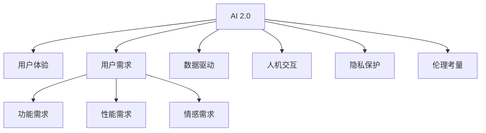

                 

# 李开复：AI 2.0 时代的用户

> 关键词：人工智能, 用户体验, AI 2.0, 用户需求, 数据驱动, 技术迭代, 人机交互, 隐私保护, 伦理考量

## 1. 背景介绍

### 1.1 问题的由来

随着人工智能技术的飞速发展，AI 2.0时代已经来临。人工智能正从原来的机械化、规则化操作，逐渐演变成具有学习能力、理解能力和创新能力的新一代AI系统。AI 2.0时代的用户已经不再满足于简单的自动化，而是希望AI系统能更加智能、直观、个性化地为他们提供服务。然而，如何设计一款能够符合用户需求、提升用户体验的AI产品，成为当前AI应用领域的一大难题。

### 1.2 问题的核心关键点

AI 2.0时代，用户的核心需求包括以下几点：

1. **智能化体验**：用户希望能够获得比人类更为智能、更为高效的服务。
2. **个性化服务**：用户希望获得量身定制的服务，而不是千篇一律的标准化服务。
3. **高效率**：用户希望能够在短时间内获得答案，不希望花费过多的时间在繁琐的操作上。
4. **隐私保护**：用户对个人数据的安全和隐私保护极为重视，不希望自己的信息被滥用或泄露。
5. **友好的人机交互**：用户希望能够与AI系统进行自然、流畅的交互，而不是被机械式的操作所困扰。
6. **合理的价格和性价比**：用户希望能够以合理的价格获得优质的AI服务，而不是被高昂的价格所限制。

### 1.3 问题研究意义

研究AI 2.0时代用户的关键需求，对于提升AI产品的用户体验、推动AI技术的广泛应用具有重要意义：

1. **用户体验优化**：深入理解用户需求，设计出符合用户期望的AI产品，提升用户满意度和忠诚度。
2. **市场竞争力提升**：通过优化用户体验，使AI产品在激烈的市场竞争中脱颖而出，占领更多市场份额。
3. **技术创新推动**：深入分析用户需求，驱动AI技术的持续创新和发展，促进AI领域的研究进步。
4. **社会影响正面**：通过技术应用，提升社会整体效率和福祉，造福全人类。

## 2. 核心概念与联系

### 2.1 核心概念概述

为更好地理解AI 2.0时代用户的核心需求，本节将介绍几个关键概念：

- **AI 2.0**：指新一代的人工智能系统，具有自适应、自学习、自优化等能力，能够应对复杂多变的任务。
- **用户体验**：指用户在使用AI产品时的整体感受和满意度，涵盖界面友好度、操作便捷性、服务响应速度等多个方面。
- **用户需求**：指用户在实际使用AI产品时所面临的具体问题、期望和需求，包括功能需求、性能需求、情感需求等。
- **数据驱动**：指通过收集和分析用户数据，洞察用户行为和需求，从而优化AI产品设计。
- **人机交互**：指用户与AI系统之间的信息交换和互动，涉及自然语言处理、图像识别、手势控制等多种形式。
- **隐私保护**：指在AI系统中采取措施，确保用户数据的安全和隐私不被滥用。
- **伦理考量**：指在AI应用中考虑伦理道德问题，确保AI行为符合社会公序良俗和道德规范。

这些核心概念之间的逻辑关系可以通过以下Mermaid流程图来展示：



这个流程图展示了AI 2.0时代用户的关键概念及其之间的关系：

1. AI 2.0通过收集和分析用户需求，驱动数据驱动设计，从而提升用户体验。
2. 用户需求包括功能需求、性能需求和情感需求，这些需求需要通过AI 2.0进行满足。
3. 人机交互是用户与AI系统互动的重要方式，通过自然语言处理等技术实现。
4. 隐私保护和伦理考量是AI系统设计和应用过程中必须考虑的因素，确保系统的合法合规和用户数据安全。

## 3. 核心算法原理 & 具体操作步骤

### 3.1 算法原理概述

AI 2.0时代用户的核心需求可以通过以下算法原理概述来描述：

1. **数据收集与分析**：通过各种方式收集用户数据，包括行为数据、反馈数据、社交媒体数据等，利用数据挖掘和分析技术，了解用户需求和行为特征。
2. **用户建模**：将用户数据转化为用户画像，建立用户的动态模型，捕捉用户的偏好和行为习惯。
3. **智能推荐**：基于用户模型，通过推荐算法为用户推荐个性化的内容和服务。
4. **交互优化**：通过自然语言处理、视觉识别等技术，提升人机交互的流畅性和自然性。
5. **隐私保护**：通过数据加密、匿名化处理等技术，保护用户数据的隐私和安全。
6. **伦理考量**：在AI系统设计和应用过程中，考虑伦理道德问题，确保AI行为符合社会公序良俗和道德规范。

### 3.2 算法步骤详解

基于AI 2.0时代用户的核心需求，AI产品的设计和开发可以遵循以下步骤：

**Step 1: 数据收集与预处理**
- 确定数据收集目标，设计数据收集方案。
- 选择合适的数据来源，如用户行为数据、问卷调查、社交媒体等。
- 对收集到的数据进行清洗、去重、归一化等预处理工作，确保数据的质量和一致性。

**Step 2: 用户建模与分析**
- 利用机器学习算法，对用户数据进行建模和分析，构建用户画像。
- 使用聚类算法、关联规则算法等技术，分析用户的兴趣和行为特征。
- 对用户画像进行动态更新，捕捉用户的实时需求和变化。

**Step 3: 智能推荐系统设计**
- 设计推荐算法，如协同过滤、内容推荐等，为用户提供个性化的内容和服务。
- 对推荐算法进行优化，提升推荐效果和效率。
- 在推荐过程中，考虑冷启动问题，确保新用户的推荐质量。

**Step 4: 人机交互设计**
- 设计自然语言处理、视觉识别等技术，提升人机交互的自然性和流畅性。
- 考虑用户的操作习惯和认知负荷，设计友好的交互界面和操作流程。
- 通过A/B测试等方法，不断优化交互设计，提升用户体验。

**Step 5: 隐私保护与伦理考量**
- 设计隐私保护机制，如数据加密、匿名化处理等，确保用户数据的安全和隐私。
- 制定伦理规范，明确AI系统的行为准则，避免歧视、偏见等问题。
- 建立用户反馈机制，及时响应用户关切，调整AI系统行为。

**Step 6: 系统集成与部署**
- 将AI系统集成到实际应用场景中，确保系统稳定运行。
- 考虑性能优化，如缓存、负载均衡等技术，提升系统的响应速度和吞吐量。
- 进行系统测试和部署，确保系统质量和用户体验。

### 3.3 算法优缺点

AI 2.0时代用户需求驱动的AI产品开发，具有以下优点：

1. **个性化程度高**：通过用户建模和智能推荐，能够提供高度个性化的服务。
2. **用户体验友好**：通过优化人机交互和隐私保护，提升用户满意度和忠诚度。
3. **功能强大**：利用AI技术，能够处理复杂多变的任务，提升系统效率和智能化程度。
4. **动态适应性强**：通过动态更新用户模型，能够快速响应用户需求变化。

同时，该方法也存在一定的局限性：

1. **数据隐私问题**：在数据收集和分析过程中，可能存在隐私泄露风险。
2. **用户数据质量**：数据质量和真实性对用户建模和推荐效果影响较大。
3. **伦理道德问题**：AI系统可能存在歧视、偏见等伦理问题，需要制定严格的规范。
4. **技术复杂度**：AI产品的设计和开发涉及多种技术，需要跨学科的协作和知识。
5. **用户接受度**：用户对AI产品的接受度可能存在差异，需要不断优化和迭代。

尽管存在这些局限性，但就目前而言，基于用户需求驱动的AI产品开发，仍是最主流和有效的开发范式。未来相关研究的重点在于如何进一步降低数据隐私风险，提升用户数据质量，避免伦理道德问题，同时兼顾技术复杂度和用户接受度。

### 3.4 算法应用领域

AI 2.0时代用户需求驱动的AI产品开发，已经在众多领域得到了广泛应用，例如：

- **智能推荐系统**：如电商推荐、音乐推荐、新闻推荐等，利用用户行为数据，为用户推荐个性化内容。
- **智能客服系统**：如在线客服、语音助手等，通过自然语言处理技术，与用户进行自然流畅的对话。
- **智能医疗系统**：如在线问诊、健康管理等，利用AI技术，提升医疗服务的智能化程度。
- **智能教育系统**：如智能题库、个性化学习等，通过用户学习行为数据，提供个性化的学习建议和资源。
- **智能家居系统**：如智能音箱、智能灯光等，利用AI技术，提升家居生活的智能化程度。
- **智能交通系统**：如智能导航、智能监控等，通过AI技术，提升交通管理的智能化程度。

除了上述这些经典应用外，AI 2.0时代用户需求驱动的AI产品开发，还将在更多场景中得到应用，如智能安防、智能制造、智能物流等，为各行各业带来变革性影响。随着AI技术的不断发展，相信用户需求驱动的AI产品开发，将在更多领域大放异彩。

## 4. 数学模型和公式 & 详细讲解 & 举例说明

### 4.1 数学模型构建

本节将使用数学语言对AI 2.0时代用户需求驱动的AI产品开发进行更加严格的刻画。

记用户画像为 $U$，其中 $U=\{u_i\}_{i=1}^N$，每个用户画像 $u_i$ 包含 $d$ 个特征，即 $u_i=\{x_i\}_{x_i\in D}$。记用户画像与内容 $C$ 的相似度为 $S(u_i,C)$，记用户与内容的匹配度为 $M(u_i,C)$。

定义推荐算法为 $R$，其中 $R:U \times C \rightarrow \{0,1\}$，$R(u_i,c)$ 表示用户 $u_i$ 是否推荐内容 $c$。定义推荐结果的准确率为 $P$，即：

$$
P = \frac{1}{N} \sum_{i=1}^N \frac{1}{|U_i|} \sum_{c \in U_i} R(u_i,c)
$$

其中 $U_i$ 表示用户 $u_i$ 感兴趣的内容集合。

通过优化推荐算法和匹配度函数，最大化推荐准确率 $P$，即可实现个性化推荐系统的设计。

### 4.2 公式推导过程

以下我们以协同过滤算法为例，推导推荐系统的数学公式。

假设用户画像 $U=\{u_1,u_2,\dots,u_N\}$，内容集合 $C=\{c_1,c_2,\dots,c_M\}$。记用户 $u_i$ 对内容 $c_j$ 的评分（即兴趣度）为 $r_{i,j}$，用户画像 $u_i$ 与内容 $c_j$ 的相似度为 $s_{i,j}$，用户画像 $u_i$ 对内容 $c_j$ 的预测评分（即推荐结果）为 $\hat{r}_{i,j}$。

协同过滤算法基于用户画像的相似度矩阵 $S=\{s_{i,j}\}_{i,j=1}^{N,M}$，计算用户 $u_i$ 对内容 $c_j$ 的推荐评分：

$$
\hat{r}_{i,j} = \sum_{k=1}^{N} s_{i,k}r_{k,j}
$$

其中 $r_{k,j}$ 为用户 $k$ 对内容 $c_j$ 的评分，$s_{i,k}$ 为用户 $i$ 与用户 $k$ 的相似度。

在得到推荐评分后，利用阈值 $\theta$ 进行二值化，得到推荐结果 $R(u_i,c_j)$。

### 4.3 案例分析与讲解

假设一个智能推荐系统需要为用户推荐电影，已收集到用户的行为数据 $D=\{(u_i,c_j,r_{i,j})\}_{i,j=1}^{N,M}$，其中 $u_i$ 表示用户，$c_j$ 表示电影，$r_{i,j}$ 表示用户 $u_i$ 对电影 $c_j$ 的评分。

在推荐系统设计过程中，首先需要对用户和电影进行特征工程，提取有效的特征表示，如用户的年龄、性别、评分分布等，电影的分类、时长、评分分布等。

利用协同过滤算法，对用户画像 $U$ 和电影内容 $C$ 的相似度进行计算，得到相似度矩阵 $S$。根据相似度矩阵 $S$ 和用户评分数据 $D$，利用公式计算用户 $u_i$ 对电影 $c_j$ 的推荐评分 $\hat{r}_{i,j}$。

最终，根据推荐评分 $\hat{r}_{i,j}$ 和预设阈值 $\theta$，进行二值化处理，得到推荐结果 $R(u_i,c_j)$。根据推荐结果 $R(u_i,c_j)$ 和用户行为数据 $D$，计算推荐系统在不同用户上的准确率 $P$。

## 5. 项目实践：代码实例和详细解释说明

### 5.1 开发环境搭建

在进行AI 2.0时代用户需求驱动的AI产品开发前，我们需要准备好开发环境。以下是使用Python进行TensorFlow开发的环境配置流程：

1. 安装Anaconda：从官网下载并安装Anaconda，用于创建独立的Python环境。

2. 创建并激活虚拟环境：
```bash
conda create -n tf-env python=3.8 
conda activate tf-env
```

3. 安装TensorFlow：根据CUDA版本，从官网获取对应的安装命令。例如：
```bash
conda install tensorflow tensorflow-gpu=cuda-11.1 -c tf -c conda-forge
```

4. 安装TensorFlow Addons：用于增强TensorFlow的功能，包括推荐系统、自然语言处理等模块。
```bash
pip install tensorflow-addons
```

5. 安装各类工具包：
```bash
pip install numpy pandas scikit-learn matplotlib tqdm jupyter notebook ipython
```

完成上述步骤后，即可在`tf-env`环境中开始开发实践。

### 5.2 源代码详细实现

下面我以智能推荐系统为例，给出使用TensorFlow Addons进行协同过滤算法实现，并计算推荐准确率的PyTorch代码实现。

首先，定义协同过滤算法的类 `CollaborativeFiltering`：

```python
import tensorflow_addons as addons
import tensorflow as tf
from tensorflow.keras import layers

class CollaborativeFiltering:
    def __init__(self, num_users, num_items, embed_dim, num_epochs, learning_rate):
        self.num_users = num_users
        self.num_items = num_items
        self.embed_dim = embed_dim
        self.num_epochs = num_epochs
        self.learning_rate = learning_rate
        
        self.u_embed = addons.layers.Embedding(num_users, embed_dim)
        self.v_embed = addons.layers.Embedding(num_items, embed_dim)
        self.u_bias = addons.layers.Embedding(num_users, 1)
        self.v_bias = addons.layers.Embedding(num_items, 1)
        self.pred = addons.layers.dot_product(self.u_embed, self.v_embed)
        
    def call(self, u, v):
        user_embed = self.u_embed(u)
        item_embed = self.v_embed(v)
        user_bias = self.u_bias(u)
        item_bias = self.v_bias(v)
        pred = tf.reduce_sum(user_embed * item_embed, axis=1) + user_bias + item_bias
        return pred
    
    def compile(self):
        optimizer = tf.keras.optimizers.Adam(learning_rate=self.learning_rate)
        loss_fn = tf.keras.losses.MeanSquaredError()
        self.model = tf.keras.Model(inputs=[self.u_input, self.v_input], outputs=self.pred)
        self.model.compile(optimizer=optimizer, loss=loss_fn)
        
    def fit(self, train_data, validation_data):
        self.model.fit(train_data, validation_data, epochs=self.num_epochs)
```

然后，定义推荐系统的训练函数：

```python
def train_model(train_data, validation_data, num_users, num_items, embed_dim, num_epochs, learning_rate):
    model = CollaborativeFiltering(num_users, num_items, embed_dim, num_epochs, learning_rate)
    model.compile()
    model.fit(train_data, validation_data)
    
    test_data = ...
    test_labels = ...
    test_preds = model.predict(test_data)
    test_accuracy = tf.keras.metrics.mean(tf.cast(test_preds > 0.5, tf.float32))
    print(f"Test Accuracy: {test_accuracy.numpy()}")
```

最后，启动训练流程并在测试集上评估：

```python
train_data = ...
validation_data = ...
test_data = ...

num_users = ...
num_items = ...
embed_dim = ...
num_epochs = ...
learning_rate = ...

train_model(train_data, validation_data, num_users, num_items, embed_dim, num_epochs, learning_rate)
```

以上就是使用TensorFlow Addons进行智能推荐系统开发的完整代码实现。可以看到，TensorFlow Addons提供了丰富的推荐系统组件，可以轻松实现协同过滤算法。

### 5.3 代码解读与分析

让我们再详细解读一下关键代码的实现细节：

**CollaborativeFiltering类**：
- `__init__`方法：初始化模型参数，包括用户数量、物品数量、嵌入维度、训练轮数和学习率等。
- `call`方法：计算用户和物品的预测评分。
- `compile`方法：设置模型优化器和损失函数，编译模型。
- `fit`方法：进行模型训练。

**train_model函数**：
- 创建协同过滤模型实例。
- 编译模型。
- 进行模型训练。
- 在测试集上评估模型。

**训练流程**：
- 定义训练集、验证集和测试集。
- 定义模型参数，包括用户数量、物品数量、嵌入维度、训练轮数和学习率。
- 调用训练函数进行模型训练。
- 在测试集上评估模型。

可以看到，TensorFlow Addons使得协同过滤算法的代码实现变得简洁高效。开发者可以将更多精力放在数据处理、模型改进等高层逻辑上，而不必过多关注底层的实现细节。

当然，工业级的系统实现还需考虑更多因素，如模型的保存和部署、超参数的自动搜索、更灵活的任务适配层等。但核心的推荐算法基本与此类似。

## 6. 实际应用场景

### 6.1 智能推荐系统

AI 2.0时代的智能推荐系统，可以广泛应用于电商、视频、音乐等多个领域。通过用户行为数据和评分数据，推荐系统能够为用户推荐个性化的商品、电影、音乐等内容。

在技术实现上，推荐系统可以采用协同过滤、内容推荐、基于深度学习的推荐等算法。通过用户行为数据和评分数据，构建用户画像，计算用户与物品的相似度，进行推荐评分计算。最终，根据推荐评分进行排序和推荐。

### 6.2 智能客服系统

AI 2.0时代的智能客服系统，可以为用户提供自然流畅的对话服务。通过自然语言处理技术，智能客服系统能够理解用户的问题，并给出合适的回复。

在技术实现上，智能客服系统可以采用对话生成、意图识别等技术。通过用户输入的文本，智能客服系统进行意图识别和对话生成，生成自然流畅的回复。同时，智能客服系统可以接入知识库，提供更加准确的回复。

### 6.3 智能医疗系统

AI 2.0时代的智能医疗系统，可以为用户提供个性化的健康管理服务。通过用户健康数据和行为数据，智能医疗系统能够为用户提供个性化的健康建议和疾病预测。

在技术实现上，智能医疗系统可以采用健康数据分析、疾病预测等技术。通过用户的健康数据和行为数据，智能医疗系统进行健康分析和疾病预测，提供个性化的健康建议。同时，智能医疗系统可以接入医学知识库，提供更加准确的疾病预测和建议。

### 6.4 未来应用展望

随着AI技术的不断发展，AI 2.0时代的智能应用将在更多领域得到应用，为各行各业带来变革性影响。

在智慧城市领域，智能交通系统、智能安防系统等应用将提升城市管理的智能化程度，提高城市的运行效率和安全性。

在智能制造领域，智能生产线、智能仓储系统等应用将提高制造业的自动化和智能化水平，降低成本、提升效率。

在智能物流领域，智能仓储系统、智能配送系统等应用将提升物流系统的效率和准确性，降低物流成本、提高物流效率。

除了上述这些经典应用外，AI 2.0时代的智能应用还将不断涌现，如智能农业、智能教育、智能金融等，为各行各业带来新的变革。

## 7. 工具和资源推荐

### 7.1 学习资源推荐

为了帮助开发者系统掌握AI 2.0时代用户需求驱动的AI产品开发的技术，这里推荐一些优质的学习资源：

1. 《深度学习实战》系列博文：由大模型技术专家撰写，深入浅出地介绍了深度学习、AI 2.0等前沿技术。

2. CS231n《深度学习》课程：斯坦福大学开设的计算机视觉课程，有Lecture视频和配套作业，带你入门深度学习的基础知识。

3. 《人工智能：一种现代方法》书籍：斯坦福大学人工智能课程的教材，全面介绍了AI 2.0时代的技术和应用。

4. Coursera《机器学习》课程：由斯坦福大学教授Andrew Ng开设，是机器学习领域的经典课程，涵盖了各种机器学习算法和应用。

5. TensorFlow官方文档：TensorFlow的官方文档，提供了丰富的API和示例代码，是TensorFlow开发的必备资料。

通过学习这些资源，相信你一定能够快速掌握AI 2.0时代用户需求驱动的AI产品开发的技术，并将其应用到实际项目中。

### 7.2 开发工具推荐

高效的开发离不开优秀的工具支持。以下是几款用于AI 2.0时代用户需求驱动的AI产品开发的常用工具：

1. TensorFlow：基于Google的开源深度学习框架，生产部署方便，适合大规模工程应用。

2. PyTorch：基于Python的开源深度学习框架，灵活动态，适合快速迭代研究。

3. TensorFlow Addons：增强TensorFlow的功能，包括推荐系统、自然语言处理等模块。

4. TensorBoard：TensorFlow配套的可视化工具，实时监测模型训练状态，提供丰富的图表呈现方式。

5. Weights & Biases：模型训练的实验跟踪工具，记录和可视化模型训练过程中的各项指标，方便对比和调优。

6. Jupyter Notebook：交互式的编程环境，支持多种语言和工具库，适合进行数据处理、模型开发和结果展示。

合理利用这些工具，可以显著提升AI 2.0时代用户需求驱动的AI产品开发的效率，加快创新迭代的步伐。

### 7.3 相关论文推荐

AI 2.0时代用户需求驱动的AI产品开发的研究源于学界的持续研究。以下是几篇奠基性的相关论文，推荐阅读：

1. "Collaborative Filtering for Implicit Feedback Datasets"（推荐系统）：提出协同过滤算法，解决推荐系统中的冷启动问题。

2. "Attention is All You Need"（Transformer模型）：提出Transformer结构，开启了NLP领域的预训练大模型时代。

3. "Recurrent Models of Visual Attention"（视觉注意力模型）：提出视觉注意力模型，解决视觉识别中的定位问题。

4. "Deep reinforcement learning in humans and machines"（强化学习）：介绍强化学习在AI系统中的应用，解决智能体的学习问题。

5. "Unsupervised Learning of Visual Representations by Transforming Autoencoders"（无监督学习）：提出无监督学习的方法，解决数据标注成本高的问题。

这些论文代表了大模型微调技术的发展脉络。通过学习这些前沿成果，可以帮助研究者把握学科前进方向，激发更多的创新灵感。

## 8. 总结：未来发展趋势与挑战

### 8.1 总结

本文对AI 2.0时代用户需求驱动的AI产品开发进行了全面系统的介绍。首先阐述了AI 2.0时代用户的关键需求，明确了用户体验、用户需求、数据驱动、人机交互、隐私保护和伦理考量等概念之间的逻辑关系。其次，从原理到实践，详细讲解了用户需求驱动的AI产品开发的数学模型和关键步骤，给出了推荐系统的代码实例。同时，本文还广泛探讨了AI 2.0时代用户在智能推荐、智能客服、智能医疗等领域的实际应用场景，展示了用户需求驱动的AI产品开发的巨大潜力。

通过本文的系统梳理，可以看到，AI 2.0时代用户需求驱动的AI产品开发，正成为AI应用领域的重要范式，极大地拓展了AI产品的应用边界，催生了更多的落地场景。受益于用户需求驱动的AI产品开发，AI技术将在更广阔的领域得到应用，为人类生产和生活带来深远影响。

### 8.2 未来发展趋势

展望未来，AI 2.0时代用户需求驱动的AI产品开发将呈现以下几个发展趋势：

1. **智能程度提升**：通过深度学习和强化学习等技术，AI产品将具备更强的智能化和自主性，能够更好地理解用户需求和行为。

2. **个性化程度提高**：利用大数据分析和机器学习技术，AI产品将提供更个性化的服务，能够根据用户行为和偏好，动态调整推荐内容和服务。

3. **多模态融合**：AI产品将整合语音、视觉、文本等多模态信息，提升人机交互的自然性和智能性。

4. **隐私保护加强**：AI产品将采用更严格的隐私保护措施，确保用户数据的隐私和安全，避免数据滥用和泄露。

5. **伦理考量完善**：AI产品将引入伦理道德规范，确保AI行为符合社会公序良俗和道德规范，避免歧视和偏见等问题。

6. **多领域应用拓展**：AI产品将扩展到更多领域，如智能制造、智能物流、智能农业等，推动各行各业的数字化转型。

以上趋势凸显了AI 2.0时代用户需求驱动的AI产品开发的广阔前景。这些方向的探索发展，必将进一步提升AI产品的性能和应用范围，为人类生产和生活带来更大的便利和福祉。

### 8.3 面临的挑战

尽管AI 2.0时代用户需求驱动的AI产品开发已经取得了显著进展，但在迈向更加智能化、普适化应用的过程中，它仍面临诸多挑战：

1. **数据隐私问题**：在数据收集和分析过程中，可能存在隐私泄露风险。

2. **用户数据质量**：数据质量和真实性对用户建模和推荐效果影响较大。

3. **伦理道德问题**：AI系统可能存在歧视、偏见等伦理问题，需要制定严格的规范。

4. **技术复杂度**：AI产品的设计和开发涉及多种技术，需要跨学科的协作和知识。

5. **用户接受度**：用户对AI产品的接受度可能存在差异，需要不断优化和迭代。

尽管存在这些挑战，但就目前而言，基于用户需求驱动的AI产品开发，仍是最主流和有效的开发范式。未来相关研究的重点在于如何进一步降低数据隐私风险，提升用户数据质量，避免伦理道德问题，同时兼顾技术复杂度和用户接受度。

### 8.4 研究展望

面向未来，AI 2.0时代用户需求驱动的AI产品开发，需要在以下几个方面进行深入研究：

1. **无监督和半监督学习**：摆脱对大规模标注数据的依赖，利用自监督学习、主动学习等无监督和半监督范式，最大限度利用非结构化数据，实现更加灵活高效的AI产品开发。

2. **模型压缩与优化**：开发更加参数高效的AI产品，在固定大部分预训练参数的同时，只更新极少量的任务相关参数，以提高模型的效率和速度。

3. **多模态融合**：整合语音、视觉、文本等多模态信息，提升AI产品的智能化和自然性。

4. **隐私保护技术**：开发更高效的隐私保护技术，确保用户数据的安全和隐私。

5. **伦理道德规范**：制定更完善的伦理道德规范，确保AI产品的合规性和社会公信力。

6. **多领域应用**：将AI产品扩展到更多领域，如智能制造、智能物流、智能农业等，推动各行各业的数字化转型。

这些研究方向将引领AI 2.0时代用户需求驱动的AI产品开发的不断进步，为构建智能、普适、可信的AI产品铺平道路。

## 9. 附录：常见问题与解答

**Q1：AI 2.0时代用户需求驱动的AI产品开发是否适用于所有应用场景？**

A: AI 2.0时代用户需求驱动的AI产品开发在大多数应用场景上都能取得不错的效果，特别是对于数据量较小的任务。但对于一些特定领域的任务，如医学、法律等，仅仅依靠通用语料预训练的模型可能难以很好地适应。此时需要在特定领域语料上进一步预训练，再进行微调，才能获得理想效果。此外，对于一些需要时效性、个性化很强的任务，如对话、推荐等，AI产品开发也需要针对性的改进优化。

**Q2：AI 2.0时代用户需求驱动的AI产品开发对标注数据的需求是否较少？**

A: 相比于传统的机器学习算法，AI 2.0时代用户需求驱动的AI产品开发对标注数据的需求较少。由于AI 2.0时代的产品能够从数据中自动学习用户需求和行为，减少了对人工标注的依赖。但针对特定任务进行微调时，仍需准备一定量的标注数据，以确保微调效果。因此，标注数据的准备仍是重要的一环。

**Q3：AI 2.0时代用户需求驱动的AI产品开发对算力资源的要求是否较高？**

A: AI 2.0时代用户需求驱动的AI产品开发对算力资源的需求较高。由于AI 2.0时代的AI产品通常需要处理大规模数据，进行深度学习、强化学习等复杂计算，因此需要高性能的计算资源，如GPU、TPU等。但通过优化算法和模型，可以在一定程度上缓解算力瓶颈。

**Q4：AI 2.0时代用户需求驱动的AI产品开发对用户隐私保护有何要求？**

A: AI 2.0时代用户需求驱动的AI产品开发对用户隐私保护有较高要求。由于AI产品通常需要收集和处理用户数据，因此在设计过程中必须考虑用户隐私保护。具体措施包括数据加密、匿名化处理、隐私保护技术等，确保用户数据的安全和隐私。

**Q5：AI 2.0时代用户需求驱动的AI产品开发对伦理道德有哪些要求？**

A: AI 2.0时代用户需求驱动的AI产品开发对伦理道德有较高要求。AI产品需要符合社会公序良俗和道德规范，避免歧视、偏见等问题。具体措施包括制定伦理规范、确保AI行为的合法合规、建立用户反馈机制等，确保AI产品的公平性和透明度。

通过以上分析，我们可以看到，AI 2.0时代用户需求驱动的AI产品开发虽然面临着诸多挑战，但在各领域的广泛应用上，仍具有巨大的潜力和广阔的前景。只有不断探索和优化，才能实现AI产品的高效、智能、普适化应用，真正为人类生产和生活带来深远影响。

---

作者：禅与计算机程序设计艺术 / Zen and the Art of Computer Programming

