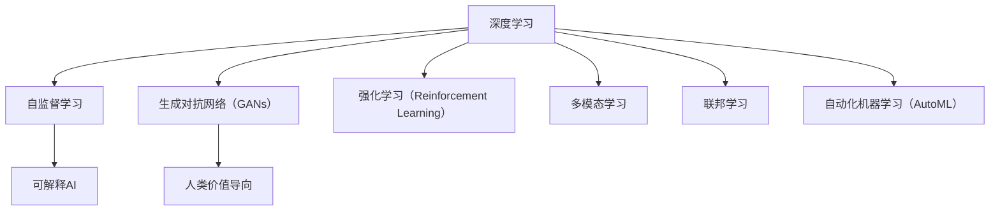

                 

# 李开复：AI 2.0 时代的社会价值

## 1. 背景介绍

### 1.1 问题由来

人工智能（AI）技术自诞生以来，经历了从符号主义、连接主义到深度学习的几次浪潮。而今，我们正站在人工智能的“2.0时代”，即“AI 2.0”，这是一个以深度学习、自监督学习、生成对抗网络（GANs）、强化学习（Reinforcement Learning）等为核心的新时代。AI 2.0 时代的到来，不仅带来了技术上的突破，更深刻地影响了社会、经济和伦理等领域。

AI 2.0 时代的核心特点在于其“通用性”、“可解释性”和“人类价值导向”。通用性使得AI 2.0 能够应用于几乎所有领域，从医疗到教育，从金融到交通，AI 2.0 无处不在。可解释性则强调我们应能理解AI 2.0 的决策过程，这不仅是技术的要求，也是伦理的必要。人类价值导向则是指在AI 2.0 的发展和应用中，应以提升人类福祉为最终目标。

### 1.2 问题核心关键点

AI 2.0 时代的社会价值讨论，需要关注以下核心关键点：
- AI 2.0 技术的突破与现状
- AI 2.0 技术对社会经济的影响
- AI 2.0 的伦理挑战与应对策略
- AI 2.0 在提升人类福祉中的作用

这些关键点构成了AI 2.0时代社会价值研究的框架，帮助我们全面理解AI 2.0如何在各个层面促进社会的进步和发展。

## 2. 核心概念与联系

### 2.1 核心概念概述

AI 2.0 涉及诸多概念，包括但不限于：

- **深度学习**：一种基于神经网络的机器学习技术，具有强大的特征提取和表示学习能力。
- **自监督学习**：在没有标签数据的情况下，通过自我生成的任务学习模型。
- **生成对抗网络（GANs）**：通过两个模型（生成器和判别器）相互竞争的方式学习数据的分布。
- **强化学习（Reinforcement Learning）**：通过智能体（agent）在环境中与环境的交互来学习最优策略。
- **可解释AI**：一种旨在使AI决策过程透明、可理解的技术，以增强公众信任。
- **人类价值导向**：确保AI 2.0 技术的发展和应用符合人类的伦理道德标准。

这些概念相互关联，共同构成了AI 2.0 技术的全貌。

### 2.2 核心概念原理和架构的 Mermaid 流程图



这个流程图展示了AI 2.0技术的核心组成和它们之间的相互联系。深度学习是AI 2.0的基础，自监督学习、GANs和强化学习是其核心技术。可解释AI和人类价值导向是确保AI 2.0技术社会价值的两个重要方面。多模态学习和联邦学习则是AI 2.0技术在应用中不断扩展和进化的体现，自动化机器学习则加速了模型的开发和应用。

## 3. 核心算法原理 & 具体操作步骤

### 3.1 算法原理概述

AI 2.0 的核心算法原理可以归纳为以下几点：

- **深度神经网络**：构建具有多层次的非线性变换，能够捕捉复杂的数据关系。
- **自监督学习**：通过无标签数据训练模型，使其学习到数据的潜在特征。
- **生成对抗网络（GANs）**：通过两个模型相互竞争，生成逼真的数据样本。
- **强化学习（Reinforcement Learning）**：通过智能体与环境的交互，学习最优策略。

这些算法原理构成了AI 2.0技术的基石，使得AI 2.0能够应对各种复杂任务，从图像识别到自然语言处理，从游戏到机器人控制，AI 2.0无所不能。

### 3.2 算法步骤详解

AI 2.0 的具体操作步骤可以分为以下几个阶段：

**Step 1: 数据准备**

- 收集和预处理数据，包括清洗、标注、划分训练集、验证集和测试集。
- 使用自监督学习方法如掩码语言模型（Masked Language Modeling, MLM）进行预训练。

**Step 2: 模型选择和初始化**

- 选择适合的深度学习模型架构，如Transformer。
- 加载预训练模型权重，并进行微调或进一步训练。

**Step 3: 训练和优化**

- 使用AdamW等优化器，根据指定的学习率和批大小进行模型训练。
- 使用L2正则、Dropout等正则化技术，防止过拟合。
- 使用Early Stopping等技术，避免训练过长时间。

**Step 4: 评估和部署**

- 在验证集上评估模型性能，进行必要的参数调整。
- 将模型部署到生产环境，进行实时预测和推理。

**Step 5: 持续学习和优化**

- 收集用户反馈和环境数据，对模型进行持续优化。
- 使用联邦学习等技术，更新模型参数以适应新数据。

### 3.3 算法优缺点

AI 2.0 技术的优点包括：
- 能够处理复杂的多模态数据，包括图像、文本和声音。
- 具有强大的泛化能力，能够应对新数据和新场景。
- 能够自动进行特征提取，减少人工干预。

其缺点包括：
- 需要大量数据进行训练，数据收集和标注成本高。
- 模型复杂，对硬件资源要求高。
- 存在一定的偏见和误差，需要进一步优化。

### 3.4 算法应用领域

AI 2.0 技术广泛应用于多个领域，如医疗、金融、教育、交通等，具体应用场景包括：

- **医疗**：AI 2.0 用于辅助诊断、药物发现、个性化治疗等，极大地提升了医疗服务的效率和准确性。
- **金融**：AI 2.0 用于风险评估、欺诈检测、智能投顾等，提高了金融行业的运营效率和安全性。
- **教育**：AI 2.0 用于智能教育、个性化学习、作业批改等，使得教育资源更加公平和高效。
- **交通**：AI 2.0 用于自动驾驶、智能交通管理、智慧物流等，改善了交通出行体验。

## 4. 数学模型和公式 & 详细讲解 & 举例说明

### 4.1 数学模型构建

AI 2.0 的数学模型通常基于深度神经网络，以自监督学习、生成对抗网络（GANs）和强化学习为核心。以BERT模型为例，其数学模型构建可以表示为：

$$
\begin{aligned}
H &= \text{MLP}(\text{LayerNorm}(xW + b)) \\
S &= \text{Softmax}(H)
\end{aligned}
$$

其中，$x$为输入的词向量，$W$和$b$为模型的权重和偏置，MLP表示多层感知器，LayerNorm为归一化层，Softmax为softmax函数。

### 4.2 公式推导过程

以BERT模型的掩码语言模型（MLM）为例，其训练过程可以推导为：

$$
\begin{aligned}
\hat{p}(x_i) &= \frac{e^{M_{\theta}(x_i)}}{\sum_{j=1}^N e^{M_{\theta}(x_j)}} \\
\mathcal{L}_{MLM} &= -\frac{1}{N}\sum_{i=1}^N \sum_{j=1}^N \log \hat{p}(x_j|x_i) \text{mask}(x_j|x_i)
\end{aligned}
$$

其中，$\hat{p}(x_i)$为模型预测的词语概率，$\mathcal{L}_{MLM}$为掩码语言模型的损失函数，$\text{mask}(x_j|x_i)$为掩码函数，用于处理训练过程中缺失的部分词语。

### 4.3 案例分析与讲解

以Google的BERT模型为例，其自监督预训练过程可以分为以下几个步骤：

1. **数据预处理**：将文本转换为词向量，并进行分词、编码等预处理。
2. **掩码语言模型**：在训练过程中，随机掩盖部分词语，让模型预测被掩盖词语的原始值。
3. **下一句预测**：将文本对$(x_i, x_{i+1})$随机掩盖一个词语，让模型预测下一个词语。
4. **优化目标**：使用交叉熵损失函数，最小化预测错误。

## 5. 项目实践：代码实例和详细解释说明

### 5.1 开发环境搭建

为了进行AI 2.0的实践，我们推荐以下开发环境：

- **Python**：深度学习库如TensorFlow、PyTorch、Keras等都是基于Python开发的，可以方便地进行模型训练和推理。
- **GPU**：深度学习模型通常需要GPU加速，以提高训练和推理速度。
- **深度学习框架**：TensorFlow、PyTorch、Keras等框架提供了强大的深度学习开发能力。

### 5.2 源代码详细实现

以TensorFlow为例，以下是一个简单的AI 2.0模型实现代码：

```python
import tensorflow as tf
from tensorflow.keras import layers

# 定义模型结构
model = tf.keras.Sequential([
    layers.Embedding(input_dim=vocab_size, output_dim=embedding_dim),
    layers.LSTM(128),
    layers.Dense(1, activation='sigmoid')
])

# 编译模型
model.compile(optimizer='adam', loss='binary_crossentropy', metrics=['accuracy'])

# 训练模型
model.fit(x_train, y_train, epochs=10, validation_data=(x_val, y_val))
```

这个代码实现了一个简单的RNN模型，用于二分类任务。首先定义了Embedding层、LSTM层和Dense层，然后编译模型，使用Adam优化器，二元交叉熵损失函数和准确率作为评估指标。最后进行模型训练，使用训练集和验证集进行迭代优化。

### 5.3 代码解读与分析

- **Embedding层**：将输入的文本转换为词向量，为后续层提供特征表示。
- **LSTM层**：通过长短时记忆网络，处理序列数据。
- **Dense层**：输出二元分类结果，使用sigmoid激活函数将输出映射到[0,1]之间。
- **Adam优化器**：一种自适应学习率的优化器，能够快速收敛。
- **二元交叉熵损失函数**：用于衡量模型预测的二元分类结果与实际标签之间的差异。
- **准确率**：衡量模型在验证集上的性能，用于评估模型泛化能力。

## 6. 实际应用场景

### 6.1 智能医疗

AI 2.0在智能医疗领域有着广泛的应用，如影像诊断、药物研发、个性化治疗等。以影像诊断为例，AI 2.0模型可以自动识别和标注医疗影像，辅助医生诊断。

**应用流程**：
- **数据准备**：收集和标注大量医疗影像数据，包括CT、MRI、X光等。
- **模型训练**：使用自监督学习如掩码语言模型（MLM）进行预训练。
- **模型微调**：将预训练模型应用于具体的诊断任务，如肺癌、乳腺癌等。
- **效果评估**：在医生和患者反馈的基础上，不断优化模型性能。

**案例分析**：
- **Google Health Research**：Google与医疗机构合作，使用AI 2.0模型自动分析医疗影像，提升了诊断的准确性和效率。

### 6.2 智能交通

AI 2.0在智能交通领域也有重要应用，如自动驾驶、智能交通管理、智慧物流等。以自动驾驶为例，AI 2.0模型可以实时感知周围环境，做出最优决策。

**应用流程**：
- **数据准备**：收集大量的交通数据，包括传感器数据、地图数据等。
- **模型训练**：使用强化学习（Reinforcement Learning）和生成对抗网络（GANs）进行训练。
- **模型部署**：将训练好的模型部署到自动驾驶汽车中，进行实时感知和决策。
- **效果评估**：在实际交通环境中，评估模型的稳定性和安全性。

**案例分析**：
- **Waymo**：Google旗下的自动驾驶公司，使用AI 2.0模型进行交通感知和决策，提升自动驾驶的安全性和效率。

### 6.3 金融科技

AI 2.0在金融科技领域也有广泛应用，如风险评估、欺诈检测、智能投顾等。以风险评估为例，AI 2.0模型可以分析客户的信用记录、行为数据等，预测其信用风险。

**应用流程**：
- **数据准备**：收集和标注客户信用数据，包括历史贷款记录、消费数据等。
- **模型训练**：使用生成对抗网络（GANs）和强化学习（Reinforcement Learning）进行训练。
- **模型部署**：将训练好的模型部署到信贷系统，进行实时信用评估。
- **效果评估**：在客户反馈和系统监测的基础上，不断优化模型性能。

**案例分析**：
- **Ping An Finance**：平安金融使用AI 2.0模型进行信用评估，提升了贷款审批效率和风险控制能力。

### 6.4 未来应用展望

AI 2.0的未来应用前景广阔，将在各个领域进一步深化和拓展。以下是一些未来应用方向：

- **智慧城市**：AI 2.0将在智慧城市管理、公共安全、城市规划等方面发挥重要作用，提高城市运营效率和居民生活质量。
- **教育科技**：AI 2.0将在个性化教育、智能辅导、作业批改等方面带来变革，推动教育公平和效率提升。
- **农业科技**：AI 2.0将在农业生产、精准农业、智能农机等方面提供支持，提高农业生产效率和可持续性。
- **能源管理**：AI 2.0将在智能电网、能源优化、碳中和等方面发挥作用，推动能源转型和可持续发展。

## 7. 工具和资源推荐

### 7.1 学习资源推荐

为了学习AI 2.0技术，以下是一些推荐的资源：

- **《深度学习》（周志华）**：周志华老师所著的深度学习教材，系统介绍了深度学习的基本原理和应用。
- **CS231n《深度学习与计算机视觉》**：斯坦福大学开设的计算机视觉课程，涵盖了深度学习在图像和视频处理中的应用。
- **Deep Learning Specialization**：由Andrew Ng教授主讲的深度学习系列课程，涵盖深度学习的基本原理和高级技术。
- **Hugging Face官方文档**：提供了丰富的深度学习模型和API，是学习和应用AI 2.0技术的必备资源。

### 7.2 开发工具推荐

以下是一些推荐的AI 2.0开发工具：

- **TensorFlow**：由Google开发的深度学习框架，提供了丰富的模型和工具支持。
- **PyTorch**：由Facebook开发的深度学习框架，具有灵活的动态图和易用性。
- **JAX**：一个基于JIT编译的深度学习框架，支持分布式计算和自动微分。
- **TensorBoard**：TensorFlow配套的可视化工具，实时监测模型训练状态。
- **Weights & Biases**：模型训练的实验跟踪工具，记录和可视化模型训练过程中的各项指标。

### 7.3 相关论文推荐

以下是一些AI 2.0技术的经典论文，推荐阅读：

- **BERT: Pre-training of Deep Bidirectional Transformers for Language Understanding**：提出BERT模型，引入了自监督学习任务，刷新了多项NLP任务SOTA。
- **Attention is All You Need**：提出了Transformer结构，开启了NLP领域的预训练大模型时代。
- **Generative Adversarial Nets**：提出了生成对抗网络（GANs），为生成模型提供了新思路。
- **AlphaGo Zero**：提出了强化学习（Reinforcement Learning）在博弈中的成功应用，推动了AI 2.0技术的发展。

## 8. 总结：未来发展趋势与挑战

### 8.1 研究成果总结

AI 2.0技术在近年来取得了巨大的进展，广泛应用于各个领域，提升了效率和准确性。未来的发展趋势包括：

- **通用性增强**：AI 2.0将具备更强的泛化能力和跨领域适应性。
- **可解释性提高**：通过可解释AI技术，使AI 2.0的决策过程更加透明。
- **伦理道德规范**：确保AI 2.0技术符合人类价值导向，提升社会福祉。
- **数据和计算资源优化**：提高模型训练和推理的效率，降低资源消耗。

### 8.2 未来发展趋势

AI 2.0的未来发展趋势包括：

- **多模态学习**：将文本、图像、声音等多模态数据融合，提升模型的理解能力和应用范围。
- **自动化机器学习（AutoML）**：通过自动化算法选择和模型调参，加速模型开发。
- **联邦学习**：在数据分散的情况下，通过分布式学习提升模型性能。
- **零样本和少样本学习**：通过预训练知识和提示词，使AI 2.0具备更强的泛化能力。

### 8.3 面临的挑战

AI 2.0技术在发展过程中面临诸多挑战：

- **数据隐私和安全**：如何保护用户数据隐私，防止数据泄露和滥用。
- **伦理和道德**：确保AI 2.0技术的决策透明和公正，避免偏见和歧视。
- **计算资源限制**：如何在大规模数据和复杂模型之间找到平衡，提升计算效率。
- **模型鲁棒性**：提高AI 2.0模型的鲁棒性，防止对抗攻击和过拟合。
- **社会接受度**：提高公众对AI 2.0技术的理解和接受度，增强信任和信心。

### 8.4 研究展望

未来的AI 2.0技术研究需要关注以下几个方向：

- **AI伦理和安全**：研究AI 2.0技术的伦理和安全问题，确保其符合人类价值观和社会规范。
- **多模态智能**：研究多模态数据融合技术，提升模型的感知能力和泛化能力。
- **自动化和智能化**：研究自动化机器学习和智能化推理技术，提高模型开发和应用效率。
- **可解释和透明**：研究可解释AI技术，增强模型的透明性和可理解性，提升用户信任。
- **跨领域应用**：研究跨领域应用的AI 2.0技术，提升模型的通用性和适应性。

## 9. 附录：常见问题与解答

**Q1: AI 2.0技术有哪些应用场景？**

A: AI 2.0技术在医疗、金融、交通、教育等领域都有广泛应用。在医疗领域，AI 2.0用于辅助诊断、药物发现、个性化治疗等；在金融领域，AI 2.0用于风险评估、欺诈检测、智能投顾等；在交通领域，AI 2.0用于自动驾驶、智能交通管理、智慧物流等；在教育领域，AI 2.0用于个性化教育、智能辅导、作业批改等。

**Q2: AI 2.0技术的主要优势是什么？**

A: AI 2.0技术的主要优势包括：
- 能够处理复杂的多模态数据，包括图像、文本和声音。
- 具有强大的泛化能力，能够应对新数据和新场景。
- 能够自动进行特征提取，减少人工干预。

**Q3: AI 2.0技术在落地应用中面临哪些挑战？**

A: AI 2.0技术在落地应用中面临以下挑战：
- 数据隐私和安全问题：如何保护用户数据隐私，防止数据泄露和滥用。
- 伦理和道德问题：确保AI 2.0技术的决策透明和公正，避免偏见和歧视。
- 计算资源限制：如何在大规模数据和复杂模型之间找到平衡，提升计算效率。
- 模型鲁棒性问题：提高AI 2.0模型的鲁棒性，防止对抗攻击和过拟合。
- 社会接受度问题：提高公众对AI 2.0技术的理解和接受度，增强信任和信心。

**Q4: AI 2.0技术的未来发展方向是什么？**

A: AI 2.0技术的未来发展方向包括：
- 多模态智能：研究多模态数据融合技术，提升模型的感知能力和泛化能力。
- 自动化和智能化：研究自动化机器学习和智能化推理技术，提高模型开发和应用效率。
- 可解释和透明：研究可解释AI技术，增强模型的透明性和可理解性，提升用户信任。
- 跨领域应用：研究跨领域应用的AI 2.0技术，提升模型的通用性和适应性。

**Q5: AI 2.0技术在落地应用中的具体案例有哪些？**

A: AI 2.0技术在落地应用中的具体案例包括：
- **Google Health Research**：Google与医疗机构合作，使用AI 2.0模型自动分析医疗影像，提升了诊断的准确性和效率。
- **Waymo**：Google旗下的自动驾驶公司，使用AI 2.0模型进行交通感知和决策，提升自动驾驶的安全性和效率。
- **Ping An Finance**：平安金融使用AI 2.0模型进行信用评估，提升了贷款审批效率和风险控制能力。

---

作者：禅与计算机程序设计艺术 / Zen and the Art of Computer Programming

