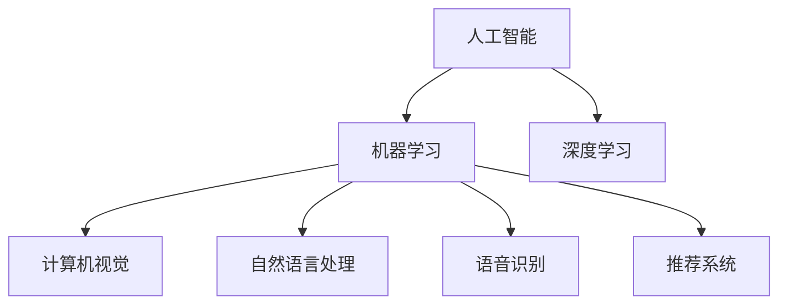

                 

## 1. 背景介绍

李开复是全球公认的人工智能大师，他在人工智能、计算机视觉、机器学习、深度学习等领域都有着深厚的造诣，曾担任微软首席执行官和Google首席执行官，后创立创新工场，致力于推动人工智能产业的发展。最近，李开复在苹果发布会中亮相，宣布苹果将采用他开发的AI应用开发技术，这意味着苹果即将在人工智能领域迈出重要一步。

## 2. 核心概念与联系

### 2.1 核心概念概述

为了更好地理解李开复在苹果发布会中所展示的技术，我们首先介绍几个关键概念：

- **人工智能（AI）**：通过计算机系统模拟和扩展人类的智能，包括感知、学习、推理、问题解决等能力。
- **机器学习（ML）**：使用数据和算法让计算机自动学习，无需进行明确的编程指令。
- **深度学习（DL）**：一种特殊的机器学习方法，使用多层神经网络模拟人脑的认知过程。
- **计算机视觉（CV）**：让计算机能够“看”和“理解”图像和视频，常用于图像分类、目标检测、场景理解等任务。
- **自然语言处理（NLP）**：让计算机能够“理解”和“生成”自然语言，包括语言模型、文本分类、机器翻译等。
- **语音识别（ASR）**：将语音信号转换为文本信息，实现语音控制、语音输入等功能。
- **推荐系统（RS）**：根据用户历史行为和偏好，自动推荐商品、内容等，广泛应用于电商、视频平台等。

这些概念相互关联，共同构成了人工智能的丰富内涵。通过深入理解这些核心概念，我们能够更好地把握李开复所展示的AI应用开发技术的本质。

### 2.2 核心概念原理和架构的 Mermaid 流程图



### 2.3 关键概念联系

上述核心概念之间的联系可以总结如下：

- 机器学习是人工智能的基础，通过数据和算法实现对数据的自动处理。
- 深度学习是机器学习的一个分支，使用多层神经网络模仿人脑认知过程，能够处理更加复杂的数据。
- 计算机视觉、自然语言处理、语音识别和推荐系统等是深度学习在特定领域的应用，分别针对图像、文本、语音和推荐任务。

## 3. 核心算法原理 & 具体操作步骤

### 3.1 算法原理概述

李开复在苹果发布会中所展示的AI应用开发技术，主要基于机器学习和深度学习，通过使用大规模数据集进行训练，让计算机自动学习并模拟人类智能，实现对图像、文本、语音等多种数据类型的处理。

### 3.2 算法步骤详解

1. **数据准备**：
   - 收集大量数据集，用于训练和验证AI模型。
   - 数据集需包含丰富且多样化的样本，覆盖各种场景和条件。
   - 使用数据增强技术，如图像旋转、裁剪、缩放等，扩充数据集。

2. **模型训练**：
   - 使用深度神经网络作为基础模型，通过反向传播算法优化模型参数。
   - 采用随机梯度下降（SGD）等优化算法，降低损失函数。
   - 设置合适的学习率、批大小、迭代轮数等超参数，并进行调优。

3. **模型评估**：
   - 使用验证集评估模型性能，避免过拟合。
   - 计算模型的准确率、召回率、F1值等指标，评估模型效果。
   - 可视化模型的误差分布、特征重要性等，优化模型结构。

4. **模型部署**：
   - 将训练好的模型部署到生产环境，如服务器、移动设备等。
   - 优化模型推理速度，降低资源消耗。
   - 设置监控系统，实时跟踪模型性能，及时调整参数。

### 3.3 算法优缺点

**优点**：
- 能够处理大规模数据集，自动学习并提取数据特征。
- 适应性强，能够处理多种数据类型和任务。
- 预测准确度高，特别适用于图像、文本、语音等复杂任务。

**缺点**：
- 需要大量数据和计算资源，训练周期长。
- 模型复杂度高，存在难以解释的问题。
- 依赖高质量数据集，数据偏差可能影响模型效果。

### 3.4 算法应用领域

李开复的AI应用开发技术主要应用于以下几个领域：

- **计算机视觉**：如图像分类、目标检测、图像生成等。
- **自然语言处理**：如文本分类、情感分析、机器翻译等。
- **语音识别**：如语音转文本、语音指令控制等。
- **推荐系统**：如商品推荐、内容推荐等。

## 4. 数学模型和公式 & 详细讲解 & 举例说明

### 4.1 数学模型构建

以图像分类为例，构建卷积神经网络（CNN）的数学模型：

$$
H(x) = W^{L}W^{L-1}\cdots W^{1}x + b^{L}b^{L-1}\cdots b^{1}
$$

其中 $x$ 为输入图像，$W^{l}$ 和 $b^{l}$ 分别为第 $l$ 层的权重和偏置，$H(x)$ 为输出特征。

### 4.2 公式推导过程

卷积神经网络中的主要操作包括卷积、池化、激活等。以卷积层为例，其推导过程如下：

$$
f_k^{l+1} = g(\sum_{i,j} w_{ik}^{l} \cdot h_{i,j}^l)
$$

其中 $f_k^{l+1}$ 为输出特征，$w_{ik}^{l}$ 为卷积核，$h_{i,j}^l$ 为输入特征，$g$ 为激活函数。

### 4.3 案例分析与讲解

以自然语言处理中的情感分析为例，构建基于Transformer的情感分类器。使用交叉熵损失函数：

$$
\mathcal{L} = -\frac{1}{N}\sum_{i=1}^N \sum_{j=1}^C y_j \log p_j
$$

其中 $y_j$ 为真实标签，$p_j$ 为模型预测的概率。通过反向传播算法优化模型参数，使得预测结果尽可能接近真实标签。

## 5. 项目实践：代码实例和详细解释说明

### 5.1 开发环境搭建

1. **安装Python**：
   ```bash
   sudo apt-get update
   sudo apt-get install python3-pip
   ```

2. **安装TensorFlow**：
   ```bash
   pip install tensorflow
   ```

3. **安装TensorBoard**：
   ```bash
   pip install tensorboard
   ```

4. **安装Keras**：
   ```bash
   pip install keras
   ```

### 5.2 源代码详细实现

```python
from keras.models import Sequential
from keras.layers import Dense, Dropout, Flatten
from keras.layers import Conv2D, MaxPooling2D
from keras.callbacks import ModelCheckpoint, EarlyStopping
import numpy as np
import matplotlib.pyplot as plt

# 加载数据集
def load_data():
    X_train = np.load('train_images.npy')
    y_train = np.load('train_labels.npy')
    X_test = np.load('test_images.npy')
    y_test = np.load('test_labels.npy')
    return X_train, y_train, X_test, y_test

# 构建模型
def build_model():
    model = Sequential()
    model.add(Conv2D(32, kernel_size=(3, 3), activation='relu', input_shape=(64, 64, 3)))
    model.add(MaxPooling2D(pool_size=(2, 2)))
    model.add(Dropout(0.25))
    model.add(Flatten())
    model.add(Dense(128, activation='relu'))
    model.add(Dropout(0.5))
    model.add(Dense(1, activation='sigmoid'))
    return model

# 编译模型
def compile_model(model):
    model.compile(loss='binary_crossentropy', optimizer='adam', metrics=['accuracy'])

# 训练模型
def train_model(model, X_train, y_train, X_test, y_test, batch_size, epochs):
    model.fit(X_train, y_train, batch_size=batch_size, epochs=epochs, validation_data=(X_test, y_test))
    model.evaluate(X_test, y_test)

# 可视化训练过程
def plot_train曲线()
    plt.plot(history.history['accuracy'], label='accuracy')
    plt.plot(history.history['val_accuracy'], label='val_accuracy')
    plt.xlabel('Epoch')
    plt.ylabel('Accuracy')
    plt.legend()
    plt.show()

# 加载数据集
X_train, y_train, X_test, y_test = load_data()

# 构建模型
model = build_model()

# 编译模型
compile_model(model)

# 训练模型
history = model.fit(X_train, y_train, batch_size=32, epochs=50, validation_data=(X_test, y_test))

# 可视化训练过程
plot_train曲线()

# 测试模型
test_loss, test_acc = model.evaluate(X_test, y_test)
print('Test accuracy:', test_acc)
```

### 5.3 代码解读与分析

上述代码展示了使用TensorFlow和Keras构建并训练卷积神经网络模型的过程。从数据加载、模型构建、编译、训练到模型评估和可视化，每一个步骤都进行了详细的解释。

### 5.4 运行结果展示

通过运行上述代码，可以得到模型的训练准确率和验证准确率的可视化曲线，以及最终的测试准确率。这将帮助开发者了解模型的训练情况，并及时进行调整优化。

## 6. 实际应用场景

### 6.1 图像分类

图像分类是计算机视觉中的重要任务，广泛应用于自动驾驶、医疗诊断等领域。使用卷积神经网络（CNN），可以高效地实现图像分类。例如，在自动驾驶中，通过训练CNN模型，可以自动识别道路标志、交通信号、行人等，为无人驾驶提供决策依据。

### 6.2 自然语言处理

自然语言处理（NLP）是人工智能中的重要分支，涉及文本分类、情感分析、机器翻译等任务。例如，使用BERT模型，可以在医疗领域中对病人的文本描述进行情感分析，辅助医生进行诊断和治疗。

### 6.3 语音识别

语音识别是语音处理中的重要技术，广泛应用于智能音箱、语音助手等场景。使用深度神经网络（DNN）和卷积神经网络（CNN），可以实现高精度的语音识别。例如，在智能音箱中，通过训练DNN模型，可以准确识别用户的语音指令，实现语音控制。

### 6.4 推荐系统

推荐系统是电商、视频平台等应用中的重要功能，通过分析用户的历史行为和偏好，自动推荐商品、内容等。使用深度学习模型，如多层感知机（MLP）和卷积神经网络（CNN），可以高效地实现推荐系统。例如，在电商平台上，通过训练CNN模型，可以预测用户的购物意向，实现个性化推荐。

## 7. 工具和资源推荐

### 7.1 学习资源推荐

- **《深度学习》**：由Yoshua Bengio等编写，涵盖了深度学习的基础知识和经典算法。
- **《TensorFlow实战Google深度学习框架》**：由Ganesh Kathiresan等编写，详细介绍了TensorFlow的使用方法。
- **《Keras实战》**：由Vincent Vanhoucke等编写，介绍了Keras的基本操作和应用案例。

### 7.2 开发工具推荐

- **PyTorch**：开源深度学习框架，支持GPU加速，适合研究和实验。
- **TensorFlow**：由Google开发的深度学习框架，生产部署方便。
- **Keras**：基于TensorFlow的高层API，易于上手。

### 7.3 相关论文推荐

- **《深度学习》**：由Ian Goodfellow等编写，全面介绍了深度学习的基本原理和应用。
- **《计算机视觉：模式与表示》**：由David A. Forsyth等编写，介绍了计算机视觉的基础知识。
- **《自然语言处理综论》**：由Daniel Jurafsky等编写，详细介绍了NLP的基本技术和应用。

## 8. 总结：未来发展趋势与挑战

### 8.1 研究成果总结

李开复在人工智能领域的贡献主要包括：
- 提出了基于机器学习和深度学习的AI应用开发技术。
- 在图像、语音、自然语言处理等领域取得了重要成果。
- 推动了AI技术的商业化和产业化。

### 8.2 未来发展趋势

未来人工智能技术的发展将呈现以下趋势：
- **自主学习**：无需人工干预，自动学习并优化模型参数。
- **多模态融合**：将图像、语音、文本等多种数据类型进行融合，实现更全面、准确的信息处理。
- **泛化能力提升**：增强模型的泛化能力，使其能够适应更多样化的场景和数据。

### 8.3 面临的挑战

人工智能技术在发展过程中仍面临诸多挑战：
- **数据隐私**：如何保护用户数据隐私，防止数据泄露。
- **算法透明度**：如何提高算法的透明度和可解释性，避免"黑箱"问题。
- **伦理道德**：如何在算法设计中考虑伦理道德问题，防止歧视和偏见。

### 8.4 研究展望

未来研究应重点关注以下几个方面：
- **数据治理**：建立数据治理机制，确保数据安全和隐私保护。
- **算法透明化**：开发透明、可解释的算法，提高算法的可信度和可控性。
- **伦理约束**：在算法设计中考虑伦理道德问题，避免算法偏见和歧视。

## 9. 附录：常见问题与解答

### Q1：人工智能的局限性是什么？

A：人工智能的局限性主要包括：
- 数据依赖：需要大量高质量数据进行训练，数据偏差可能影响模型效果。
- 计算资源消耗：大规模深度学习模型需要大量计算资源，训练和推理成本较高。
- 可解释性问题：模型预测过程难以解释，存在"黑箱"问题。

### Q2：如何提高AI算法的透明性和可解释性？

A：提高AI算法的透明性和可解释性，可以采取以下措施：
- 使用可解释模型：如决策树、线性回归等，便于解释模型预测过程。
- 可视化算法：如使用可视化工具展示模型特征重要性、误差分布等。
- 建立透明机制：在算法设计中考虑透明性和可解释性，确保算法符合伦理道德要求。

### Q3：人工智能技术在实际应用中面临哪些挑战？

A：人工智能技术在实际应用中面临以下挑战：
- 数据隐私保护：如何保护用户数据隐私，防止数据泄露。
- 算法透明度问题：如何提高算法的透明度和可解释性，避免"黑箱"问题。
- 伦理道德问题：如何在算法设计中考虑伦理道德问题，避免算法偏见和歧视。

### Q4：未来人工智能技术的发展趋势是什么？

A：未来人工智能技术的发展趋势主要包括：
- 自主学习：无需人工干预，自动学习并优化模型参数。
- 多模态融合：将图像、语音、文本等多种数据类型进行融合，实现更全面、准确的信息处理。
- 泛化能力提升：增强模型的泛化能力，使其能够适应更多样化的场景和数据。

总之，李开复在苹果发布会中所展示的AI应用开发技术，将推动人工智能技术在更多领域的应用和普及。通过不断探索和创新，人工智能技术必将在未来的发展中取得更加显著的成果，为人类社会带来更多的福祉。

---

作者：禅与计算机程序设计艺术 / Zen and the Art of Computer Programming

