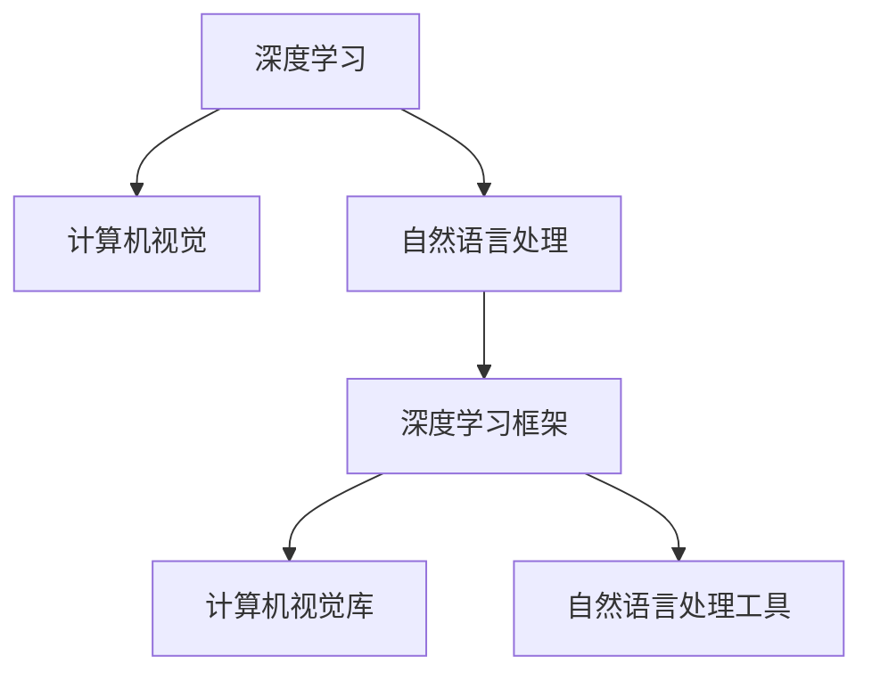

                 

# 李开复：苹果发布AI应用的开发者

> 关键词：人工智能,机器学习,计算机视觉,自然语言处理,深度学习,开发工具,应用场景

## 1. 背景介绍

### 1.1 问题由来

在现代科技飞速发展的今天，人工智能（AI）的应用已经渗透到了我们生活的方方面面。无论是自动驾驶、智能推荐、语音助手，还是医学影像分析、气象预测，人工智能技术正在以惊人的速度改变我们的生活方式和工作方式。苹果公司作为全球科技巨头之一，自然也不会落后于这一潮流。

近年来，苹果公司积极布局人工智能领域，推出了多款基于AI的应用和产品。然而，这些AI应用的开发并非易事。本文将从多个角度探讨苹果公司如何开发AI应用，以及在此过程中所面临的挑战和机遇。

### 1.2 问题核心关键点

苹果公司开发AI应用的核心关键点主要包括以下几点：

1. **技术栈选择**：苹果公司需要选择合适的AI开发技术栈，包括深度学习框架、计算机视觉库、自然语言处理工具等。
2. **数据处理**：苹果公司需要从海量的数据中提取有价值的信息，以便训练出高效、准确的AI模型。
3. **模型优化**：苹果公司需要对训练好的模型进行优化，以提高模型的推理速度和准确性。
4. **应用场景适配**：苹果公司需要根据不同的应用场景，适配不同的AI模型。
5. **用户隐私保护**：苹果公司需要在AI应用开发过程中，严格遵守用户隐私保护的规定。

## 2. 核心概念与联系

### 2.1 核心概念概述

为更好地理解苹果公司开发AI应用的过程，本节将介绍几个密切相关的核心概念：

- **深度学习**：一种基于神经网络的机器学习技术，通过多层非线性变换，能够学习到数据的高级特征表示。
- **计算机视觉**：研究如何让计算机理解、处理、分析、识别和生成图像和视频数据的学科。
- **自然语言处理**：研究如何让计算机理解、处理、分析和生成人类语言文本的学科。
- **深度学习框架**：如TensorFlow、PyTorch等，提供了高效、便捷的深度学习模型构建和训练工具。
- **计算机视觉库**：如OpenCV、Pillow等，提供了丰富的图像处理和分析工具。
- **自然语言处理工具**：如NLTK、SpaCy等，提供了自然语言文本处理和分析功能。

这些核心概念之间的逻辑关系可以通过以下Mermaid流程图来展示：



这个流程图展示了大语言模型的核心概念及其之间的关系：

1. 深度学习是计算机视觉和自然语言处理的基础。
2. 深度学习框架、计算机视觉库和自然语言处理工具为模型开发提供了高效工具。
3. 计算机视觉和自然语言处理在实际应用中，需要深度学习的支持，以实现图像和文本的理解和处理。

这些概念共同构成了苹果公司AI应用开发的技术基础。

## 3. 核心算法原理 & 具体操作步骤

### 3.1 算法原理概述

苹果公司开发AI应用的过程，本质上是通过深度学习框架和工具，构建、训练和优化AI模型，并将其适配到不同的应用场景。其核心算法原理包括以下几点：

1. **模型构建**：选择合适的深度学习模型，如卷积神经网络（CNN）、循环神经网络（RNN）、变压器（Transformer）等，并使用深度学习框架进行构建。
2. **数据预处理**：对输入数据进行清洗、归一化、增强等预处理，以提高模型训练的效率和效果。
3. **模型训练**：使用训练数据集对模型进行训练，优化模型参数，使其能够更好地适配特定任务。
4. **模型优化**：通过剪枝、量化、蒸馏等技术，优化模型结构，提高推理速度和效率。
5. **模型部署**：将训练好的模型部署到实际应用中，并根据应用场景进行调整和优化。

### 3.2 算法步骤详解

苹果公司开发AI应用的步骤大致如下：

1. **需求分析**：明确AI应用的功能和目标，确定所需的数据类型和应用场景。
2. **数据采集**：从多个数据源中采集数据，并进行清洗、标注等预处理。
3. **模型选择**：根据需求和数据类型，选择合适的深度学习模型。
4. **模型训练**：使用训练数据集对模型进行训练，并进行超参数调优。
5. **模型验证**：使用验证数据集评估模型性能，并进行必要的调整。
6. **模型优化**：使用模型优化技术，如剪枝、量化等，提高模型推理速度和效率。
7. **模型部署**：将训练好的模型部署到实际应用中，并根据应用场景进行调整和优化。

### 3.3 算法优缺点

苹果公司开发AI应用的算法有以下优点：

1. **高效性**：深度学习框架和工具提高了模型构建和训练的效率。
2. **适应性强**：深度学习模型具有很强的适应性，能够适配不同的应用场景。
3. **准确性高**：深度学习模型经过大量数据的训练，具有较高的准确性。

同时，这些算法也存在一些缺点：

1. **资源消耗大**：深度学习模型需要大量的计算资源，对硬件要求较高。
2. **训练时间长**：深度学习模型训练时间较长，需要较长的数据准备和模型调优周期。
3. **可解释性差**：深度学习模型通常被视为"黑盒"，缺乏可解释性。

### 3.4 算法应用领域

苹果公司开发的AI应用主要应用于以下几个领域：

1. **计算机视觉**：如人脸识别、图像分类、目标检测等。
2. **自然语言处理**：如语音识别、机器翻译、情感分析等。
3. **智能推荐**：如商品推荐、新闻推荐、视频推荐等。
4. **语音助手**：如Siri等，能够理解并响应用户的语音指令。
5. **医疗影像分析**：如肿瘤检测、病理分析等，提高医疗诊断的准确性。

## 4. 数学模型和公式 & 详细讲解 & 举例说明

### 4.1 数学模型构建

苹果公司开发的AI应用通常基于深度学习模型进行构建。以卷积神经网络（CNN）为例，其数学模型可以表示为：

$$
f(x) = W^1x + b^1
$$

其中，$x$ 表示输入数据，$W^1$ 和 $b^1$ 表示第一层卷积核和偏置项，$f(x)$ 表示输出。

### 4.2 公式推导过程

卷积神经网络的推导过程如下：

1. 输入数据 $x$ 通过卷积层，生成特征图 $h$：

$$
h = W^2 * f(x)
$$

其中，$*$ 表示卷积运算，$W^2$ 表示卷积核。

2. 特征图 $h$ 通过激活函数 $g$，生成下一层输入 $x'$：

$$
x' = g(h)
$$

3. 下一层输入 $x'$ 经过全连接层和softmax函数，生成输出概率 $y$：

$$
y = softmax(W^3x' + b^3)
$$

其中，$W^3$ 和 $b^3$ 表示全连接层中的权重和偏置项，$softmax$ 函数将输出转换为概率分布。

### 4.3 案例分析与讲解

以苹果公司的智能推荐系统为例，其数学模型可以表示为：

1. 输入数据 $x$ 表示用户的兴趣偏好和历史行为数据。
2. 使用卷积神经网络提取特征图 $h$：

$$
h = W^1x + b^1
$$

3. 特征图 $h$ 通过全连接层和softmax函数，生成输出概率 $y$：

$$
y = softmax(W^2h + b^2)
$$

其中，$W^2$ 和 $b^2$ 表示全连接层中的权重和偏置项，$softmax$ 函数将输出转换为推荐商品的概率分布。

## 5. 项目实践：代码实例和详细解释说明

### 5.1 开发环境搭建

苹果公司通常使用Python进行AI应用的开发。以下是Python开发环境搭建的流程：

1. **安装Python**：
   ```bash
   sudo apt-get update
   sudo apt-get install python3
   ```

2. **安装Pip**：
   ```bash
   sudo apt-get install python3-pip
   ```

3. **安装TensorFlow**：
   ```bash
   pip3 install tensorflow
   ```

4. **安装Keras**：
   ```bash
   pip3 install keras
   ```

### 5.2 源代码详细实现

以下是一个简单的Python代码实例，用于训练一个卷积神经网络：

```python
import tensorflow as tf
from tensorflow import keras

# 定义模型
model = keras.Sequential([
    keras.layers.Conv2D(32, (3, 3), activation='relu', input_shape=(28, 28, 1)),
    keras.layers.MaxPooling2D((2, 2)),
    keras.layers.Flatten(),
    keras.layers.Dense(10, activation='softmax')
])

# 编译模型
model.compile(optimizer='adam', loss='sparse_categorical_crossentropy', metrics=['accuracy'])

# 训练模型
model.fit(x_train, y_train, epochs=10, batch_size=64)

# 评估模型
model.evaluate(x_test, y_test)
```

### 5.3 代码解读与分析

以上代码实现了一个简单的卷积神经网络，用于手写数字识别。其中：

- `keras.Sequential` 表示模型序列，包含了多个网络层。
- `keras.layers.Conv2D` 表示卷积层，用于提取特征。
- `keras.layers.MaxPooling2D` 表示池化层，用于降维。
- `keras.layers.Flatten` 表示展平层，将特征图转换为向量。
- `keras.layers.Dense` 表示全连接层，用于分类。
- `model.compile` 表示编译模型，设置优化器和损失函数。
- `model.fit` 表示训练模型，设置训练数据和批大小。
- `model.evaluate` 表示评估模型，设置测试数据。

## 6. 实际应用场景

### 6.1 智能推荐系统

苹果公司的智能推荐系统主要应用于App Store和iTunes等平台，帮助用户发现感兴趣的应用和音乐。通过深度学习模型，智能推荐系统能够根据用户的兴趣偏好和历史行为数据，推荐相应的应用和音乐。

### 6.2 人脸识别

苹果公司的Face ID功能利用计算机视觉技术，通过深度学习模型对人脸进行识别和验证。Face ID不仅提高了用户的安全性，还简化了登录和支付等操作。

### 6.3 医疗影像分析

苹果公司的HealthKit和CareKit应用程序利用深度学习模型，对医疗影像进行分析和诊断。通过图像分割、病理分析等技术，提高了医疗诊断的准确性和效率。

### 6.4 未来应用展望

未来，苹果公司将继续拓展AI应用的领域和深度，以下是可以预见的未来应用：

1. **增强现实（AR）**：利用深度学习技术，开发更加智能、精准的AR应用。
2. **语音助手**：进一步提升Siri的自然语言处理能力和交互体验。
3. **自动驾驶**：利用计算机视觉和深度学习技术，开发自动驾驶系统。
4. **健康监测**：通过深度学习模型，分析用户的生理数据，提供个性化的健康建议。

## 7. 工具和资源推荐

### 7.1 学习资源推荐

苹果公司开发AI应用，需要掌握多项技术，以下是一些推荐的学习资源：

1. **Deep Learning Specialization by Andrew Ng**：Coursera上的一门深度学习课程，由斯坦福大学教授Andrew Ng主讲，涵盖深度学习的基础和进阶知识。
2. **Python Deep Learning by Francois Chollet**：一本深入浅出的深度学习入门书籍，适合初学者。
3. **TensorFlow官方文档**：包含丰富的教程和API文档，帮助开发者快速上手TensorFlow。
4. **Keras官方文档**：包含丰富的教程和API文档，帮助开发者快速上手Keras。

### 7.2 开发工具推荐

苹果公司开发AI应用，通常使用TensorFlow、Keras等深度学习框架。以下是一些推荐的开发工具：

1. **Jupyter Notebook**：一个交互式编程环境，支持Python和深度学习框架。
2. **PyCharm**：一个强大的Python IDE，提供了丰富的开发工具和插件。
3. **Google Colab**：一个免费的在线Jupyter Notebook环境，支持GPU和TPU计算。

### 7.3 相关论文推荐

苹果公司开发AI应用的理论基础，可以参考以下几篇经典论文：

1. **ImageNet Classification with Deep Convolutional Neural Networks**：Alex Krizhevsky等人提出的卷积神经网络模型，开创了深度学习在图像识别领域的先河。
2. **A Neural Probabilistic Language Model**：Geoffrey Hinton等人提出的基于神经网络的自然语言模型，奠定了自然语言处理的基础。
3. **Learning Word Vectors for Sentiment Analysis**：Tomas Mikolov等人提出的Word2Vec模型，利用词向量表示文本数据，提高了自然语言处理的效果。

## 8. 总结：未来发展趋势与挑战

### 8.1 总结

本文对苹果公司开发AI应用的过程进行了全面系统的介绍。首先阐述了苹果公司开发AI应用的背景和意义，明确了AI应用在技术栈选择、数据处理、模型优化等方面的核心关键点。其次，从原理到实践，详细讲解了深度学习模型构建、训练和优化的数学原理和关键步骤，给出了AI应用开发的完整代码实例。同时，本文还广泛探讨了苹果公司AI应用在智能推荐、人脸识别、医疗影像分析等多个行业领域的应用前景，展示了AI应用的巨大潜力。此外，本文精选了AI应用的各类学习资源，力求为开发者提供全方位的技术指引。

通过本文的系统梳理，可以看到，苹果公司开发AI应用的过程，需要选择合适的技术栈和开发工具，处理大量的数据，构建和训练高效的深度学习模型，并将模型适配到不同的应用场景中。只有系统掌握这些核心技术，才能开发出高效、准确、稳定的AI应用。

### 8.2 未来发展趋势

展望未来，苹果公司AI应用的开发将呈现以下几个发展趋势：

1. **技术栈多样化**：苹果公司将引入更多深度学习框架和工具，支持多种技术栈的AI应用开发。
2. **数据处理自动化**：苹果公司将进一步提升数据预处理自动化水平，降低数据处理的复杂度和成本。
3. **模型优化深度化**：苹果公司将不断优化模型结构，提高推理速度和效率。
4. **应用场景多样化**：苹果公司将拓展AI应用场景，涵盖更多行业和领域。
5. **用户隐私保护加强**：苹果公司将更加重视用户隐私保护，制定更严格的数据使用政策。

### 8.3 面临的挑战

尽管苹果公司开发AI应用取得了诸多成果，但在迈向更加智能化、普适化应用的过程中，仍面临诸多挑战：

1. **技术栈选择**：苹果公司需要根据不同的应用场景，选择合适的深度学习框架和工具。
2. **数据处理成本高**：苹果公司需要处理大量的数据，成本较高。
3. **模型复杂度高**：深度学习模型结构复杂，开发和优化难度大。
4. **用户隐私保护**：苹果公司需要在AI应用开发过程中，严格遵守用户隐私保护的规定。

### 8.4 研究展望

面向未来，苹果公司需要在以下方面进行深入研究：

1. **模型可解释性**：开发更加可解释的深度学习模型，提高模型的透明度和可信度。
2. **多模态融合**：研究如何将计算机视觉、自然语言处理等技术进行多模态融合，提升AI应用的性能。
3. **联邦学习**：研究如何在保护用户隐私的前提下，进行分布式深度学习模型训练。
4. **迁移学习**：研究如何在不同应用场景中，迁移已有的深度学习知识，提高AI应用的泛化能力。

这些研究方向的探索，必将引领苹果公司AI应用的开发走向更高的台阶，为构建智能、高效、安全的AI应用系统铺平道路。

## 9. 附录：常见问题与解答

**Q1：苹果公司为何选择深度学习技术开发AI应用？**

A: 深度学习技术具有强大的表达能力和自适应能力，能够从大量数据中学习到高级特征表示，适用于多种复杂的应用场景。苹果公司选择深度学习技术，是因为其能够提供高效、准确、稳定的AI应用解决方案。

**Q2：苹果公司如何处理用户隐私问题？**

A: 苹果公司严格遵守用户隐私保护的规定，通过数据脱敏、访问控制等手段，保护用户的隐私。同时，苹果公司也将用户数据的安全和隐私保护视为AI应用开发的重要目标之一。

**Q3：苹果公司如何优化深度学习模型的推理速度？**

A: 苹果公司使用模型剪枝、量化等技术，优化深度学习模型的结构，提高推理速度和效率。同时，苹果公司也研究了基于GPU和TPU的分布式计算技术，提高模型的并行计算能力。

**Q4：苹果公司如何处理模型过拟合问题？**

A: 苹果公司使用正则化技术、Dropout等手段，防止模型过拟合。同时，苹果公司也研究了基于对抗样本的对抗训练方法，提高模型的鲁棒性和泛化能力。

**Q5：苹果公司如何选择深度学习模型？**

A: 苹果公司根据不同的应用场景，选择合适的深度学习模型。如卷积神经网络（CNN）适用于图像处理，循环神经网络（RNN）适用于序列数据处理，Transformer适用于自然语言处理等。

综上所述，苹果公司通过深度学习技术，开发了多项高效、准确、稳定的AI应用，推动了NLP、计算机视觉等领域的发展。未来，苹果公司将继续拓展AI应用的领域和深度，为全球用户提供更多智能、高效、安全的AI应用解决方案。

