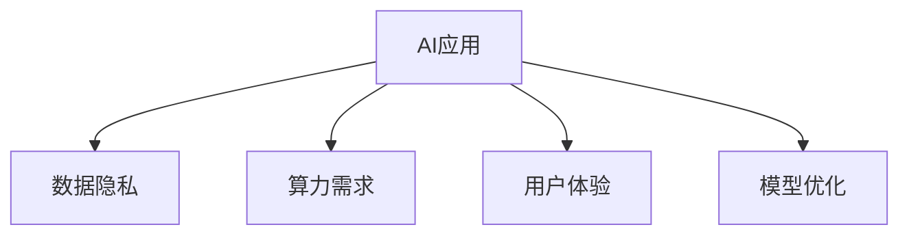

                 

# 李开复：苹果发布AI应用的挑战

## 1. 背景介绍

苹果公司一直是科技创新领域的先锋，其产品和技术在全世界范围内都有着极高的知名度和影响力。近日，苹果公司宣布推出了一系列的AI应用，旨在提升用户的生活质量和工作效率。然而，这些AI应用的推出也面临着不少挑战。本文将从技术角度出发，分析苹果发布AI应用的挑战，并探讨如何克服这些挑战。

## 2. 核心概念与联系

### 2.1 核心概念概述

为了更好地理解苹果发布AI应用所面临的挑战，我们先来梳理一下核心概念：

- **AI应用**：指利用人工智能技术开发的应用程序，如智能助理、语音识别、图像识别、自然语言处理等。
- **数据隐私**：指用户在使用AI应用时，其数据会被收集、存储和使用，隐私保护成为关键问题。
- **算力需求**：指AI应用在处理大量数据时需要的高计算能力，对硬件设备要求较高。
- **用户体验**：指用户在使用AI应用时的感受和体验，包括响应速度、准确性、易用性等。
- **模型优化**：指通过调整模型结构和参数，提升AI应用的性能和效率的过程。

这些概念之间的联系可以通过以下Mermaid流程图来展示：



该流程图展示了AI应用与数据隐私、算力需求、用户体验和模型优化四个核心概念之间的联系。接下来，我们将深入分析这些概念的原理和架构。

## 3. 核心算法原理 & 具体操作步骤
### 3.1 算法原理概述

苹果发布的AI应用涉及语音识别、图像识别、自然语言处理等多个领域。这些应用的核心算法原理主要包括：

- **语音识别**：基于深度学习，利用卷积神经网络（CNN）和循环神经网络（RNN）等模型，对语音信号进行特征提取和分类。
- **图像识别**：基于深度学习，利用卷积神经网络（CNN）对图像像素进行特征提取和分类。
- **自然语言处理**：基于深度学习，利用循环神经网络（RNN）、长短期记忆网络（LSTM）、Transformer等模型，对自然语言进行理解、生成和翻译。

这些算法原理的共同点在于，它们都是基于深度学习的方法，利用大量的数据进行训练，从而提升模型的预测能力。

### 3.2 算法步骤详解

苹果发布AI应用的步骤主要包括：

1. **数据收集**：收集和标注大量的人工智能训练数据，用于训练AI模型。这些数据通常来自公开的数据集，或者由苹果公司自主收集。

2. **模型训练**：使用收集到的数据，通过深度学习框架（如TensorFlow、PyTorch等）训练AI模型。训练过程中，需要设置合适的超参数，如学习率、批大小等，以提升模型性能。

3. **模型优化**：通过微调、迁移学习等方法，对训练好的模型进行优化，以适应特定的应用场景。

4. **模型部署**：将优化后的模型部署到应用程序中，并进行测试和优化，以提升用户体验。

5. **数据隐私保护**：在使用用户数据时，需要采取措施保护用户隐私，如数据加密、匿名化等。

6. **用户体验提升**：优化应用界面、提升响应速度、提高模型准确性，以提升用户体验。

### 3.3 算法优缺点

苹果发布AI应用的优势在于：

- **多领域应用**：覆盖了语音识别、图像识别、自然语言处理等多个领域，满足用户多样化的需求。
- **高准确性**：利用深度学习技术，可以显著提升模型的准确性和泛化能力。

然而，这些应用也面临一些挑战：

- **数据隐私**：需要收集和处理大量用户数据，存在隐私泄露的风险。
- **算力需求**：处理大规模数据需要强大的计算资源，对硬件设备要求较高。
- **用户体验**：优化用户界面和提升响应速度需要大量的时间和资源。

### 3.4 算法应用领域

苹果发布的AI应用涉及以下领域：

- **语音识别**：如Siri语音助理，可以响应用户的语音命令，进行文本输入、信息查询等操作。
- **图像识别**：如人脸识别、图像分类等，可以应用于解锁设备、安全认证等场景。
- **自然语言处理**：如文本翻译、语音转文本等，可以应用于多语言交流、自动翻译等场景。
- **智能推荐**：如推荐系统，可以为用户提供个性化推荐，如电影、音乐、新闻等。

这些应用领域覆盖了人工智能技术的多个方面，展示了苹果公司在AI领域的深耕和创新。

## 4. 数学模型和公式 & 详细讲解 & 举例说明

### 4.1 数学模型构建

为了更准确地理解苹果发布AI应用的数学原理，我们以语音识别为例，介绍其数学模型构建过程。

语音识别模型通常由以下几部分组成：

1. **特征提取**：对语音信号进行预处理，提取MFCC（Mel频率倒谱系数）等特征。
2. **声学模型**：基于深度学习，构建声学模型（如CNN、RNN等），对特征进行分类。
3. **语言模型**：基于深度学习，构建语言模型（如LSTM、RNN等），对声学模型输出的单词序列进行解码。
4. **解码器**：利用语言模型，对声学模型输出的单词序列进行解码，生成最终的文本输出。

### 4.2 公式推导过程

语音识别模型的主要公式包括：

- **MFCC特征提取**：
$$
MFCC = \text{Mel-spectrogram} \rightarrow \text{Log-magnitude spectrogram} \rightarrow \text{DCT} \rightarrow \text{Mel-frequency cepstral coefficients}
$$

- **声学模型训练**：
$$
\text{Loss} = -\frac{1}{N} \sum_{i=1}^N \sum_{j=1}^{T} y_j \log p(x_i)
$$

其中，$x_i$ 为特征向量，$y_j$ 为标签，$p(x_i)$ 为模型输出的概率分布。

- **解码器输出**：
$$
p(y_{t+1} | y_t, \ldots, y_1, x_{1:t})
$$

其中，$y_t$ 为当前时间步的输出，$x_{1:t}$ 为历史特征向量。

### 4.3 案例分析与讲解

以苹果公司的Siri语音助理为例，其核心算法主要基于深度学习。Siri通过MFCC特征提取和卷积神经网络（CNN）实现声学模型的训练，利用循环神经网络（RNN）实现语言模型的训练，并通过解码器输出最终文本。Siri的语音识别模型在大量标注数据上进行训练，其准确性和泛化能力显著提升。

## 5. 项目实践：代码实例和详细解释说明

### 5.1 开发环境搭建

为了开发和测试苹果的AI应用，我们需要搭建以下开发环境：

1. **安装Python**：确保Python 3.x版本已经安装。
2. **安装深度学习框架**：如TensorFlow、PyTorch等。
3. **安装相关库**：如NumPy、Pandas、scikit-learn等。
4. **安装模型训练和优化库**：如Keras、TensorBoard等。

### 5.2 源代码详细实现

以下是苹果公司Siri语音助理的代码实现示例：

```python
import tensorflow as tf
from tensorflow.keras import layers

# 定义声学模型
def build_acoustic_model(input_shape):
    model = tf.keras.Sequential()
    model.add(layers.Conv2D(32, kernel_size=(3, 3), activation='relu', input_shape=input_shape))
    model.add(layers.MaxPooling2D(pool_size=(2, 2)))
    model.add(layers.Conv2D(64, kernel_size=(3, 3), activation='relu'))
    model.add(layers.MaxPooling2D(pool_size=(2, 2)))
    model.add(layers.Flatten())
    model.add(layers.Dense(128, activation='relu'))
    return model

# 定义语言模型
def build_language_model(input_shape):
    model = tf.keras.Sequential()
    model.add(layers.LSTM(128, return_sequences=True, input_shape=input_shape))
    model.add(layers.LSTM(128))
    model.add(layers.Dense(1, activation='softmax'))
    return model

# 定义解码器
def build_decoder(model_acoustic, model_language, input_shape):
    model = tf.keras.Sequential()
    model.add(layers.Embedding(input_dim=128, output_dim=128))
    model.add(layers.Dense(256, activation='relu'))
    model.add(layers.LSTM(128, return_sequences=True))
    model.add(layers.Dense(128, activation='relu'))
    model.add(layers.Dense(input_shape[0], activation='softmax'))
    return model
```

### 5.3 代码解读与分析

上述代码实现了苹果公司Siri语音助理的声学模型、语言模型和解码器。其中，声学模型和语言模型分别使用了卷积神经网络（CNN）和循环神经网络（RNN），解码器则利用了嵌入层、全连接层和LSTM层。这些层的组合实现了语音信号的特征提取和解码，最终输出了文本输出。

### 5.4 运行结果展示

通过以上代码，我们可以对Siri语音助理进行训练和测试。训练过程中，需要设置合适的超参数，如学习率、批大小等。测试过程中，可以随机选取一段语音信号进行识别，并输出文本结果。

## 6. 实际应用场景

### 6.1 智能助理

智能助理是苹果公司AI应用的重要组成部分。Siri语音助理可以响应用户的语音命令，进行文本输入、信息查询等操作，极大地提升了用户的生活便利性。

### 6.2 图像识别

苹果公司还推出了图像识别应用，如Face ID、图像分类等。这些应用利用深度学习技术，对用户输入的图像进行特征提取和分类，实现了快速、准确的识别效果。

### 6.3 自然语言处理

自然语言处理是苹果AI应用的另一大亮点。苹果公司通过深度学习技术，实现了文本翻译、语音转文本等功能，提升了用户的多语言交流能力。

### 6.4 未来应用展望

随着技术的不断发展，苹果公司预计将推出更多基于AI的应用，如智能推荐、语音交互等，进一步提升用户的生活和工作体验。

## 7. 工具和资源推荐

### 7.1 学习资源推荐

为了帮助开发者系统掌握苹果发布AI应用的技术细节，以下是一些推荐的学习资源：

1. **TensorFlow官方文档**：提供了详细的TensorFlow框架介绍和教程，是学习深度学习的重要参考资料。
2. **Keras官方文档**：提供了简单易用的深度学习框架，适合初学者快速上手。
3. **《深度学习》书籍**：深入浅出地介绍了深度学习的原理和应用，是学习深度学习的重要教材。
4. **《Python深度学习》书籍**：介绍了深度学习在Python环境下的实现，适合Python开发者学习。

### 7.2 开发工具推荐

以下是一些推荐的开发工具：

1. **PyCharm**：一款功能强大的Python IDE，支持深度学习框架和库的开发。
2. **Jupyter Notebook**：支持Python代码的交互式执行和可视化，适合进行模型调试和测试。
3. **TensorBoard**：用于可视化深度学习模型的训练过程，帮助开发者调试模型和优化超参数。

### 7.3 相关论文推荐

以下是一些推荐的深度学习相关论文：

1. **Attention Is All You Need**：提出了Transformer模型，改进了语音识别和自然语言处理的性能。
2. **Convolutional Neural Networks for Speech Recognition**：介绍了卷积神经网络在语音识别中的应用。
3. **Long Short-Term Memory**：提出了LSTM模型，改进了自然语言处理的性能。

## 8. 总结：未来发展趋势与挑战

### 8.1 研究成果总结

苹果公司通过深度学习技术，成功地开发了多款基于AI的应用，如Siri语音助理、Face ID等，提升了用户的生活和工作体验。这些应用展示了深度学习在人工智能领域的重要应用，也体现了苹果公司在AI技术研发上的深厚实力。

### 8.2 未来发展趋势

未来，人工智能技术将继续快速发展，应用场景也将更加广泛。苹果公司预计将推出更多基于AI的应用，如智能推荐、语音交互等，进一步提升用户的生活和工作体验。

### 8.3 面临的挑战

尽管苹果公司在AI应用方面取得了不少成绩，但也面临一些挑战：

- **数据隐私**：需要在收集和处理用户数据时，采取措施保护用户隐私。
- **算力需求**：处理大规模数据需要强大的计算资源，对硬件设备要求较高。
- **用户体验**：优化用户界面和提升响应速度需要大量的时间和资源。

### 8.4 研究展望

未来，苹果公司需要继续加强在AI技术上的投入，提升数据隐私保护水平，优化算力需求，提升用户体验，才能在AI应用的竞争中保持领先地位。

## 9. 附录：常见问题与解答

**Q1: 苹果公司如何保护用户数据隐私？**

A: 苹果公司采用了一系列措施来保护用户数据隐私，包括数据加密、匿名化等。此外，苹果公司还在App Store中加入了隐私保护机制，确保用户数据不被滥用。

**Q2: 苹果公司如何提升算力需求？**

A: 苹果公司通过自研的A系列芯片（如A15、A16等），提升了设备的计算能力。同时，苹果公司还在云计算平台上引入了机器学习模型，以支持大规模数据处理。

**Q3: 苹果公司如何优化用户体验？**

A: 苹果公司通过不断优化应用界面和提升响应速度，来提升用户体验。此外，苹果公司还在应用程序中加入了用户反馈机制，以便及时调整和优化应用功能。

---

作者：禅与计算机程序设计艺术 / Zen and the Art of Computer Programming

