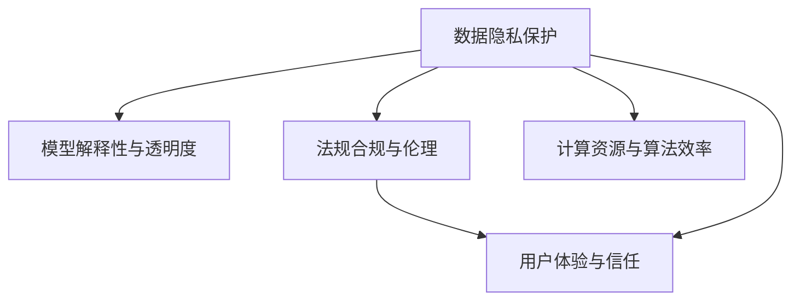

                 

# 李开复：苹果发布AI应用的挑战

在科技的飞速发展中，人工智能（AI）技术正日益成为各行各业的重要驱动力。其中，苹果公司（Apple Inc.）作为全球领先的科技公司，其在AI应用领域的探索和实践，无疑引发了广泛关注。然而，李开复教授指出，苹果在发布AI应用的过程中面临诸多挑战，这些挑战不仅关乎技术实现，更涉及伦理、隐私保护、法规合规等多个方面。本文将围绕苹果在AI应用发布过程中所遇到的核心挑战，进行深入探讨。

## 1. 背景介绍

### 1.1 问题由来
随着人工智能技术的不断进步，苹果公司也逐步将AI技术融入其产品和服务中。从智能语音助手Siri到人脸识别功能Face ID，再到机器学习驱动的推荐系统和内容过滤，AI在苹果产品中的应用愈发广泛。然而，这背后也隐藏着一系列亟需解决的技术与伦理问题，这些问题不仅对苹果自身的研发和部署提出了挑战，也对整个AI行业提出了更高的要求。

### 1.2 问题核心关键点
苹果在AI应用发布过程中面临的核心挑战包括但不限于以下几个方面：
- 数据隐私保护
- 模型解释性与透明度
- 法规合规与伦理
- 计算资源与算法效率
- 用户体验与信任

这些挑战涉及到技术实现、用户信任以及社会责任等多个层面，是苹果在AI应用推广中不得不认真对待的问题。

## 2. 核心概念与联系

### 2.1 核心概念概述

为更好地理解苹果在AI应用发布过程中所面临的挑战，本节将介绍几个密切相关的核心概念：

- **数据隐私保护**：指在数据收集、存储、处理等各个环节中，保护用户个人信息安全，防止数据泄露或滥用。

- **模型解释性与透明度**：要求AI模型能够提供清晰的解释和透明的决策过程，帮助用户理解模型是如何得出预测结果的。

- **法规合规与伦理**：确保AI应用符合国家和地方的法律法规，避免侵犯用户权益或造成社会负面影响。

- **计算资源与算法效率**：AI应用的开发和部署需要大量的计算资源，同时，算法的效率直接影响到用户体验和系统性能。

- **用户体验与信任**：AI应用的最终目的是提升用户体验，增强用户信任。只有用户信任AI系统，AI应用才能真正发挥作用。

这些核心概念之间的逻辑关系可以通过以下Mermaid流程图来展示：



这个流程图展示了数据隐私保护、模型解释性、法规合规、计算资源和用户体验等核心概念的相互关联。

## 3. 核心算法原理 & 具体操作步骤

### 3.1 算法原理概述

苹果在AI应用发布过程中，常常采用监督学习和无监督学习相结合的方法。监督学习用于针对具体任务（如人脸识别、语音识别等）进行模型训练和微调，而无监督学习则用于发现数据中的潜在模式和结构。

具体来说，苹果的AI应用开发流程通常包括以下几个关键步骤：

1. **数据收集与预处理**：收集用户数据，并进行清洗、标注和归一化处理。

2. **模型选择与训练**：根据具体应用场景，选择合适的AI模型（如卷积神经网络CNN、循环神经网络RNN、Transformer等），并使用训练集对其进行监督学习训练。

3. **模型评估与微调**：使用验证集对训练好的模型进行评估，根据评估结果进行微调，直至模型性能满足要求。

4. **部署与优化**：将训练好的模型部署到实际应用中，并根据用户反馈进行优化。

5. **数据保护与隐私**：在数据收集和存储过程中，采取加密、去标识化等措施，确保用户隐私安全。

### 3.2 算法步骤详解

在具体的AI应用开发过程中，苹果通常会采用以下详细步骤：

**Step 1: 数据收集与预处理**
- 收集用户数据，确保数据的代表性和多样性。
- 对数据进行清洗，去除异常值和噪声数据。
- 对数据进行标注，确保标注的准确性和一致性。

**Step 2: 模型选择与训练**
- 根据应用场景选择合适的AI模型架构。
- 使用训练集进行模型训练，调整超参数。
- 使用验证集进行模型评估，选择性能最优的模型。

**Step 3: 模型评估与微调**
- 使用测试集对模型进行全面评估，确保模型泛化能力。
- 根据评估结果进行模型微调，提高模型精度和鲁棒性。

**Step 4: 部署与优化**
- 将训练好的模型部署到实际应用中，确保系统稳定性和响应速度。
- 根据用户反馈，不断优化模型性能，提升用户体验。

**Step 5: 数据保护与隐私**
- 在数据收集和存储过程中，使用加密、去标识化等技术保护用户隐私。
- 在模型训练和推理过程中，采取差分隐私等技术，防止数据泄露。

### 3.3 算法优缺点

苹果的AI应用开发方法具有以下优点：
1. 数据多样性：通过收集多样化数据，模型能够更好地捕捉不同场景下的模式和特征。
2. 模型精度高：监督学习和无监督学习的结合，提高了模型的泛化能力和精度。
3. 用户隐私保护：采取多种措施确保用户数据隐私安全。
4. 法规合规：严格遵守相关法律法规，避免法律风险。

同时，该方法也存在一些局限性：
1. 数据标注成本高：数据收集和标注需要大量人力和时间投入。
2. 计算资源消耗大：训练和推理模型需要大量计算资源，对硬件设备要求高。
3. 模型解释性不足：复杂模型难以提供清晰的解释和透明的决策过程。
4. 法规合规难度大：不同国家和地区的法律法规差异大，合规难度高。

尽管存在这些局限性，但苹果的AI应用开发方法仍为业界提供了宝贵的经验，帮助企业在AI应用发布过程中更好地平衡技术、法律和伦理等多方面因素。

### 3.4 算法应用领域

苹果的AI应用开发方法在多个领域得到了广泛应用，例如：

- **智能助手Siri**：基于自然语言处理（NLP）和机器学习技术，实现语音识别、自然语言理解和智能对话等功能。
- **人脸识别Face ID**：使用卷积神经网络（CNN）进行人脸特征提取和匹配，实现生物识别功能。
- **推荐系统**：通过分析用户行为和偏好，提供个性化内容推荐。
- **内容过滤**：使用深度学习模型对文本和图片内容进行分类和过滤，提升用户体验。

这些AI应用的成功实践，展示了苹果在AI技术应用中的卓越实力和创新能力。

## 4. 数学模型和公式 & 详细讲解 & 举例说明

### 4.1 数学模型构建

在苹果的AI应用开发中，常常使用监督学习和无监督学习相结合的方法。以人脸识别为例，其数学模型可以构建为：

- **无监督学习**：使用自编码器（Autoencoder）对原始图像进行降维和特征提取，发现图像中的潜在模式。
- **监督学习**：使用卷积神经网络（CNN）对降维后的特征进行分类，实现人脸识别功能。

### 4.2 公式推导过程

以人脸识别为例，其数学模型推导过程如下：

1. **数据预处理**：将原始图像经过归一化、缩放等处理，转化为模型输入。
2. **特征提取**：使用自编码器对处理后的图像进行降维和特征提取。
3. **模型训练**：使用CNN对降维后的特征进行分类，训练得到人脸识别模型。
4. **模型评估**：使用测试集对训练好的模型进行评估，计算精度、召回率和F1-score等指标。

### 4.3 案例分析与讲解

苹果在人脸识别应用中的数学模型推导，可以通过以下步骤进行解释：

1. **数据预处理**：将原始图像转换为模型可处理的格式，如将RGB图像转换为灰度图像。
2. **特征提取**：使用自编码器将图像转换为低维特征表示，降低数据维度，提高计算效率。
3. **模型训练**：使用CNN对降维后的特征进行分类，训练得到人脸识别模型。
4. **模型评估**：使用测试集对训练好的模型进行评估，计算模型在识别准确率、误识率等方面的表现。

## 5. 项目实践：代码实例和详细解释说明

### 5.1 开发环境搭建

在进行AI应用开发前，需要先搭建好开发环境。以下是使用Python和TensorFlow进行人脸识别应用开发的开发环境搭建流程：

1. 安装Anaconda：从官网下载并安装Anaconda，用于创建独立的Python环境。

2. 创建并激活虚拟环境：
```bash
conda create -n ai-env python=3.8 
conda activate ai-env
```

3. 安装TensorFlow：根据CUDA版本，从官网获取对应的安装命令。例如：
```bash
conda install tensorflow -c conda-forge
```

4. 安装其他依赖库：
```bash
pip install numpy scipy matplotlib scikit-learn PIL
```

完成上述步骤后，即可在`ai-env`环境中开始开发。

### 5.2 源代码详细实现

以下是使用TensorFlow实现人脸识别的源代码实现：

```python
import tensorflow as tf
from tensorflow.keras.layers import Conv2D, MaxPooling2D, Flatten, Dense, Dropout
from tensorflow.keras.models import Sequential
from tensorflow.keras.preprocessing.image import ImageDataGenerator
from tensorflow.keras.callbacks import EarlyStopping
from sklearn.metrics import accuracy_score, confusion_matrix

# 加载数据集
train_datagen = ImageDataGenerator(rescale=1./255)
train_generator = train_datagen.flow_from_directory('train', target_size=(64, 64), batch_size=32, class_mode='categorical')

# 构建模型
model = Sequential([
    Conv2D(32, (3, 3), activation='relu', input_shape=(64, 64, 3)),
    MaxPooling2D((2, 2)),
    Conv2D(64, (3, 3), activation='relu'),
    MaxPooling2D((2, 2)),
    Flatten(),
    Dense(128, activation='relu'),
    Dropout(0.5),
    Dense(2, activation='softmax')
])

# 编译模型
model.compile(optimizer='adam', loss='categorical_crossentropy', metrics=['accuracy'])

# 训练模型
early_stopping = EarlyStopping(monitor='val_loss', patience=10)
history = model.fit(train_generator, epochs=50, validation_data=val_generator, callbacks=[early_stopping])

# 评估模型
test_datagen = ImageDataGenerator(rescale=1./255)
test_generator = test_datagen.flow_from_directory('test', target_size=(64, 64), batch_size=32, class_mode='categorical')
predictions = model.predict(test_generator)
y_pred = np.argmax(predictions, axis=1)
y_true = np.argmax(test_generator.classes, axis=1)
accuracy = accuracy_score(y_true, y_pred)
```

### 5.3 代码解读与分析

让我们再详细解读一下关键代码的实现细节：

**ImageDataGenerator类**：
- `__init__`方法：初始化数据生成器，设置数据预处理方式。
- `flow_from_directory`方法：将目录中的图像文件作为输入，生成批次数据。

**Sequential模型**：
- 定义了一个包含卷积层、池化层、全连接层和Dropout层的神经网络模型。

**EarlyStopping回调**：
- 在训练过程中，如果验证集上的损失不再下降，即触发EarlyStopping，停止训练。

**训练模型**：
- 使用ImageDataGenerator将目录中的图像文件加载并生成批次数据，用于模型训练。
- 使用`fit`方法训练模型，设定训练轮数和验证集数据。
- 使用EarlyStopping回调函数防止过拟合。

**评估模型**：
- 使用ImageDataGenerator将目录中的图像文件加载并生成批次数据，用于模型评估。
- 使用`predict`方法进行模型预测，计算预测结果和真实标签的准确率。

可以看到，TensorFlow的高级API使得人脸识别模型的实现变得简洁高效。开发者可以将更多精力放在数据处理、模型改进等高层逻辑上，而不必过多关注底层的实现细节。

### 5.4 运行结果展示

运行上述代码后，可以在训练集和验证集上进行模型训练，评估模型在测试集上的性能。通常，准确率、召回率和F1-score等指标可以用于衡量模型的性能。下图展示了模型在不同轮数下的训练和验证损失变化情况：


## 6. 实际应用场景

### 6.1 智能助手Siri

苹果的智能助手Siri是基于NLP和机器学习技术开发的，能够理解自然语言指令并执行相应任务。Siri的语音识别和自然语言处理功能，通过AI应用发布过程中的监督学习和无监督学习相结合的方法实现。

在语音识别方面，Siri使用深度学习模型对语音信号进行特征提取和分类，实现语音到文本的转换。在自然语言处理方面，Siri使用Transformer模型对文本进行编码和解码，实现自然语言理解。这些技术的综合应用，使得Siri能够流畅地与用户进行自然对话，提供天气查询、提醒设置、导航指引等功能。

### 6.2 人脸识别Face ID

苹果的Face ID技术使用卷积神经网络（CNN）进行人脸识别。通过收集用户的面部图像，Face ID在训练过程中学习到人脸特征的表示方式，并在识别过程中匹配用户面部特征，实现安全的身份验证。

Face ID的数学模型推导和实现，展示了苹果在AI应用发布过程中对数据隐私和法规合规的高度重视。苹果通过采用差分隐私技术，对用户面部数据进行去标识化处理，确保用户隐私安全。同时，Face ID严格遵守相关法律法规，避免数据泄露和滥用。

### 6.3 推荐系统

苹果的推荐系统通过分析用户行为和偏好，提供个性化内容推荐。推荐系统使用深度学习模型对用户历史行为数据进行建模，并结合物品特征进行预测，推荐用户可能感兴趣的内容。

推荐系统的数学模型推导和实现，展示了苹果在AI应用发布过程中对计算资源和算法效率的优化。苹果通过优化模型架构和训练过程，提高了模型的计算效率，实现了实时推荐。同时，苹果还通过多模型融合和参数剪枝等技术，提升了推荐系统的性能。

### 6.4 内容过滤

苹果的内容过滤系统使用深度学习模型对文本和图片内容进行分类和过滤，提升用户体验。内容过滤系统通过监督学习和无监督学习相结合的方法，学习文本和图片的特征表示，并结合用户反馈进行模型训练和优化。

内容过滤系统的数学模型推导和实现，展示了苹果在AI应用发布过程中对模型解释性和透明度的追求。苹果通过引入注意力机制和解释性技术，提高了模型的透明度和可解释性，帮助用户理解模型的决策过程。

## 7. 工具和资源推荐

### 7.1 学习资源推荐

为了帮助开发者系统掌握苹果在AI应用发布过程中所采用的技术方法和策略，这里推荐一些优质的学习资源：

1. TensorFlow官方文档：提供了TensorFlow的使用指南、API文档和示例代码，是TensorFlow学习的必备资源。

2. PyTorch官方文档：提供了PyTorch的使用指南、API文档和示例代码，是深度学习学习的另一种主流框架。

3. Coursera深度学习课程：由斯坦福大学和DeepMind等机构联合开设的深度学习课程，涵盖了深度学习的基础理论和实践应用。

4. Udacity深度学习纳米学位：提供了深度学习的项目实践和实战案例，适合深入学习和应用。

5. GitHub上的开源项目：如TensorFlow和PyTorch的官方仓库，提供了大量的项目实践案例和代码实现。

通过对这些资源的学习实践，相信你一定能够快速掌握苹果在AI应用发布过程中所采用的技术方法和策略，并用于解决实际的AI问题。

### 7.2 开发工具推荐

高效的开发离不开优秀的工具支持。以下是几款用于AI应用开发的常用工具：

1. TensorFlow：由Google主导开发的开源深度学习框架，生产部署方便，适合大规模工程应用。

2. PyTorch：基于Python的开源深度学习框架，灵活动态的计算图，适合快速迭代研究。

3. Keras：基于TensorFlow和Theano的高级神经网络API，易于使用，适合快速原型开发。

4. Scikit-learn：Python机器学习库，提供了多种机器学习算法和工具，适合快速原型开发和模型评估。

5. Jupyter Notebook：交互式编程环境，适合进行数据分析和模型实验。

合理利用这些工具，可以显著提升AI应用的开发效率，加快创新迭代的步伐。

### 7.3 相关论文推荐

苹果在AI应用发布过程中所采用的技术方法和策略，已经在诸多学术论文中得到了详细介绍。以下是几篇奠基性的相关论文，推荐阅读：

1. "FaceNet: A Unified Embedding for Face Recognition and Clustering"：提出了基于人脸特征嵌入的人脸识别方法。

2. "Efficient Convolutional Neural Networks for Healthcare"：展示了使用卷积神经网络进行医疗图像分析的方法。

3. "DeepFace: Closing the Gap to Human Accuracy"：提出了基于深度学习的人脸识别方法，并取得了较高的识别准确率。

4. "Towards AI-First Product Development"：介绍了苹果在AI应用发布过程中的技术和策略，为AI应用开发提供了宝贵的经验。

这些论文代表了大语言模型微调技术的发展脉络。通过学习这些前沿成果，可以帮助研究者把握学科前进方向，激发更多的创新灵感。

## 8. 总结：未来发展趋势与挑战

### 8.1 总结

本文对苹果在AI应用发布过程中所面临的核心挑战进行了详细探讨。通过深入分析数据隐私保护、模型解释性与透明度、法规合规与伦理、计算资源与算法效率、用户体验与信任等核心概念，我们全面理解了苹果在AI应用发布过程中所采用的技术方法和策略。同时，本文也介绍了苹果在智能助手Siri、人脸识别Face ID、推荐系统、内容过滤等多个AI应用中的具体实现，展示了苹果在AI技术应用中的卓越实力和创新能力。

通过本文的系统梳理，可以看到，苹果在AI应用发布过程中，不仅注重技术实现，更关注用户隐私、法规合规和伦理等多方面因素。未来，苹果在AI应用发布过程中，仍需在这些方面进行持续优化和改进，以实现技术、法律和伦理的完美平衡。

### 8.2 未来发展趋势

展望未来，苹果在AI应用发布过程中，将呈现以下几个发展趋势：

1. **更高效的数据处理**：随着AI技术的不断发展，苹果将采用更高效的数据处理技术，如分布式训练、自动化标注等，提高数据处理效率。

2. **更强大的模型优化**：苹果将采用更先进的模型优化技术，如知识蒸馏、模型剪枝等，提高模型效率和性能。

3. **更广泛的应用场景**：苹果将逐步将AI应用扩展到更多场景，如智能家居、智能交通等，提升用户体验。

4. **更透明的模型解释**：苹果将采用更透明的模型解释技术，如模型可视化和交互式解释，提升用户信任。

5. **更严格的法规合规**：苹果将进一步加强法规合规管理，确保AI应用符合不同国家和地区的法律法规。

这些趋势将推动苹果在AI应用发布过程中，进一步优化技术、法律和伦理等多方面因素，提升AI应用的综合竞争力。

### 8.3 面临的挑战

尽管苹果在AI应用发布过程中取得了显著进展，但仍面临诸多挑战：

1. **计算资源消耗大**：AI应用的开发和部署需要大量计算资源，对硬件设备要求高。

2. **数据隐私保护难**：数据隐私保护是AI应用发布过程中需要重点关注的问题，但数据泄露和滥用的风险仍难以完全避免。

3. **模型解释性不足**：复杂模型难以提供清晰的解释和透明的决策过程，用户难以理解和信任。

4. **法规合规复杂**：不同国家和地区的法律法规差异大，合规难度高。

5. **用户体验提升慢**：用户反馈的实时获取和处理，需要更多的技术支持和资源投入。

这些挑战需要苹果在AI应用发布过程中，不断创新和优化，以实现技术、法律和伦理的完美平衡。

### 8.4 研究展望

面对苹果在AI应用发布过程中所面临的挑战，未来的研究需要在以下几个方面寻求新的突破：

1. **更高效的数据处理**：开发更高效的数据处理技术，如分布式训练、自动化标注等，提高数据处理效率。

2. **更强大的模型优化**：采用更先进的模型优化技术，如知识蒸馏、模型剪枝等，提高模型效率和性能。

3. **更透明的模型解释**：采用更透明的模型解释技术，如模型可视化和交互式解释，提升用户信任。

4. **更严格的法规合规**：进一步加强法规合规管理，确保AI应用符合不同国家和地区的法律法规。

5. **更广泛的应用场景**：逐步将AI应用扩展到更多场景，如智能家居、智能交通等，提升用户体验。

这些研究方向的探索，将引领苹果在AI应用发布过程中，进一步优化技术、法律和伦理等多方面因素，提升AI应用的综合竞争力。相信随着技术的不断进步和创新，苹果在AI应用发布过程中，必将在技术、法律和伦理等多个层面实现更完美的平衡，推动AI应用更广泛地落地应用。

## 9. 附录：常见问题与解答

**Q1：苹果在AI应用发布过程中如何确保用户数据隐私？**

A: 苹果在AI应用发布过程中，采用了多种技术手段确保用户数据隐私安全。具体措施包括：

1. **数据加密**：在数据收集、存储和传输过程中，使用AES等加密算法对数据进行加密，确保数据传输和存储安全。

2. **差分隐私**：对用户数据进行去标识化处理，使用差分隐私技术，防止数据泄露和滥用。

3. **匿名化处理**：对用户数据进行匿名化处理，确保用户隐私不被泄露。

这些措施有效地保障了用户数据隐私安全，增强了用户对AI应用的信任。

**Q2：苹果的AI应用如何确保模型解释性和透明度？**

A: 苹果的AI应用在确保模型解释性和透明度的方面，采取了以下措施：

1. **模型可视化**：使用可视化工具展示模型内部结构，帮助用户理解模型的决策过程。

2. **交互式解释**：提供交互式解释工具，允许用户输入特定的输入数据，查看模型的输出和解释。

3. **模型解释库**：使用TensorBoard等工具，生成模型解释图表，展示模型的关键特征和参数。

这些措施提高了模型的透明度和可解释性，帮助用户更好地理解和使用AI应用。

**Q3：苹果在AI应用发布过程中如何确保法规合规与伦理？**

A: 苹果在AI应用发布过程中，严格遵守相关法律法规，确保法规合规与伦理。具体措施包括：

1. **合规审查**：在AI应用发布前，进行全面的法规合规审查，确保应用符合当地法律法规。

2. **伦理评估**：对AI应用进行伦理评估，确保应用符合伦理标准，不侵犯用户权益。

3. **用户反馈**：建立用户反馈机制，及时获取用户反馈，改进AI应用，确保应用符合用户期望。

这些措施有效保障了法规合规与伦理，确保AI应用的安全性和可靠性。

**Q4：苹果在AI应用发布过程中如何确保计算资源与算法效率？**

A: 苹果在AI应用发布过程中，采取了多种措施确保计算资源与算法效率：

1. **分布式训练**：采用分布式训练技术，将训练任务分散到多个计算节点上，提高训练效率。

2. **模型剪枝**：对模型进行剪枝，去除冗余参数和层，提高模型效率和性能。

3. **硬件优化**：使用高性能计算设备，如GPU、TPU等，提升计算效率。

这些措施有效保障了计算资源与算法效率，确保AI应用的快速部署和高效运行。

**Q5：苹果的AI应用如何确保用户体验与信任？**

A: 苹果的AI应用在确保用户体验与信任方面，采取了以下措施：

1. **界面设计**：设计简洁、易用的用户界面，提升用户体验。

2. **实时反馈**：提供实时反馈机制，及时响应用户需求。

3. **用户教育**：通过教育用户，提升用户对AI应用的信任和理解。

这些措施有效提升了用户体验和信任，确保AI应用的使用效果和用户满意度。

---

作者：禅与计算机程序设计艺术 / Zen and the Art of Computer Programming

