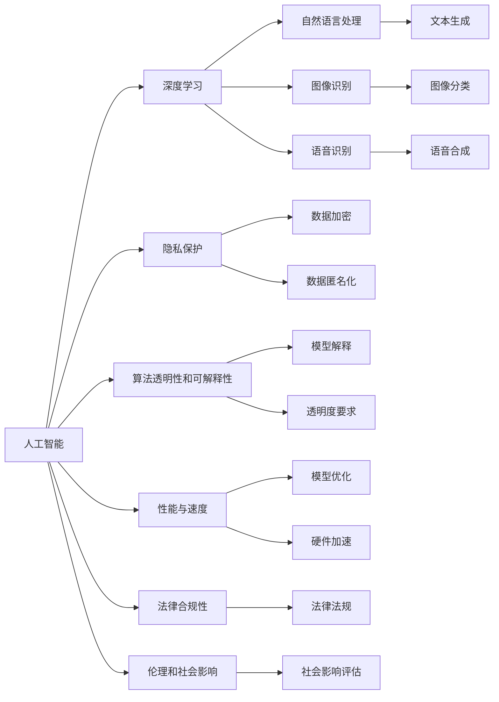

                 

# 李开复：苹果发布AI应用的挑战

## 1. 背景介绍

### 1.1 问题的由来

苹果公司近年来在人工智能（AI）领域动作频频，推出了一系列基于AI技术的应用和服务，如Siri、Face ID、Deep Fusion等。这些应用提升了用户体验和设备的智能化水平，但也带来了不少挑战和争议。

### 1.2 问题核心关键点

苹果在发布AI应用时面临的核心问题包括：
- 数据隐私和安全：如何处理用户数据，确保数据安全和隐私保护？
- 算法透明性和可解释性：AI算法如何实现透明，用户如何理解其决策逻辑？
- 性能与速度：AI应用如何在提升用户体验的同时，保持流畅的响应速度？
- 法律合规性：苹果的AI应用是否符合各地区的法律法规？
- 伦理和社会影响：AI应用如何避免对社会产生负面影响，如偏见、歧视等？

### 1.3 问题研究意义

对苹果发布AI应用过程中面临的挑战进行研究，有助于其他科技公司借鉴成功经验，避免类似的错误。同时，研究这些挑战也能为AI技术的标准化和规范制定提供参考，推动AI技术健康、可持续发展。

## 2. 核心概念与联系

### 2.1 核心概念概述

为了更好地理解苹果在发布AI应用时所面临的挑战，我们需要了解以下几个核心概念：

- 人工智能（AI）：一种使计算机模拟人类智能行为的技术，包括学习、推理、感知、自然语言处理等。
- 深度学习（Deep Learning）：一种基于神经网络的机器学习方法，通过多层次的特征提取和模式识别，实现复杂的任务，如图像识别、语音识别、自然语言处理等。
- 隐私保护（Privacy Protection）：通过技术手段保护用户数据隐私，防止数据泄露和滥用。
- 算法透明性和可解释性（Algorithm Transparency and Interpretability）：要求算法决策过程可被理解、可解释，确保用户信任和法律合规。
- 性能与速度（Performance and Speed）：AI应用需要高效率，以确保流畅的体验和快速的响应。
- 法律合规性（Legal Compliance）：AI应用需要符合各国法律法规，避免违法风险。
- 伦理和社会影响（Ethics and Social Impact）：AI应用需考虑社会伦理，避免偏见、歧视等负面影响。

这些概念之间存在紧密联系，共同构成了苹果发布AI应用时的复杂场景。

### 2.2 核心概念原理和架构的 Mermaid 流程图



这个流程图展示了各个概念之间的联系，有助于理解苹果在发布AI应用时所面临的多方面挑战。

## 3. 核心算法原理 & 具体操作步骤

### 3.1 算法原理概述

苹果在发布AI应用时，主要采用了基于深度学习的算法。这些算法通过多层次的特征提取和模式识别，实现复杂的任务，如图像识别、语音识别、自然语言处理等。以下是苹果AI应用中常用的几种深度学习算法：

- **卷积神经网络（CNN）**：用于图像识别和分类，通过卷积层和池化层提取特征，然后进行分类。
- **循环神经网络（RNN）**：用于自然语言处理，通过时间序列处理，捕捉文本中的上下文信息。
- **Transformer模型**：用于机器翻译和文本生成，通过自注意力机制捕捉输入和输出之间的依赖关系。

### 3.2 算法步骤详解

苹果发布AI应用的主要步骤包括：

1. **数据收集与预处理**：收集用户数据并进行预处理，确保数据质量。
2. **模型训练与优化**：使用大量标注数据训练深度学习模型，并进行超参数调优。
3. **模型部署与优化**：将训练好的模型部署到设备上，并进行性能和速度优化。
4. **隐私保护与合规性**：确保数据处理符合隐私保护要求和法律法规。
5. **透明度与可解释性**：提高算法的透明度和可解释性，使用户信任算法决策。

### 3.3 算法优缺点

苹果AI应用的算法优点包括：

- **高性能**：深度学习算法在图像识别、语音识别、自然语言处理等领域具有较高的精度和速度。
- **广泛应用**：深度学习算法可以应用于多个领域，如智能手机、智能家居、智能医疗等。
- **可扩展性**：深度学习算法可以通过增加数据和计算资源进行模型扩展。

缺点包括：

- **数据依赖**：深度学习算法需要大量标注数据进行训练，获取高质量数据成本较高。
- **计算资源需求高**：深度学习算法需要大量计算资源进行训练和推理，硬件成本较高。
- **模型复杂度**：深度学习模型通常较复杂，难以解释其决策过程。

### 3.4 算法应用领域

苹果的AI应用主要应用于以下几个领域：

- **智能手机**：Siri、Face ID等应用，提升用户交互体验。
- **智能家居**：HomeKit、健康监测等应用，提升家居智能化水平。
- **智能医疗**：健康监测、诊断等应用，提升医疗服务质量。
- **增强现实**：ARKit等应用，提供沉浸式交互体验。

## 4. 数学模型和公式 & 详细讲解 & 举例说明

### 4.1 数学模型构建

苹果AI应用的数学模型通常基于深度神经网络，其基本结构包括输入层、隐藏层和输出层。以下是CNN和RNN的基本结构：

- **卷积神经网络（CNN）**：
  - 输入层：输入图像数据。
  - 卷积层：提取图像特征。
  - 池化层：降维处理，保留重要特征。
  - 全连接层：输出分类结果。
  
  模型结构如下：
  $$
  \text{CNN} = \text{Convolution} + \text{Pooling} + \text{Fully Connected}
  $$

- **循环神经网络（RNN）**：
  - 输入层：输入文本序列。
  - 隐藏层：捕捉文本上下文关系。
  - 输出层：输出预测结果。
  
  模型结构如下：
  $$
  \text{RNN} = \text{LSTM} + \text{Fully Connected}
  $$

### 4.2 公式推导过程

以CNN为例，其前向传播过程如下：

1. **卷积层**：
  $$
  x_i = f_k * w_i
  $$
  其中 $x_i$ 表示卷积输出，$f_k$ 表示滤波器，$w_i$ 表示输入数据。

2. **池化层**：
  $$
  y_i = \max(x_i)
  $$
  其中 $y_i$ 表示池化输出，$x_i$ 表示卷积层输出。

3. **全连接层**：
  $$
  z_i = w^T * y_i + b
  $$
  $$
  a_i = \sigma(z_i)
  $$
  $$
  y = W * a_i + b
  $$
  其中 $z_i$ 表示全连接层输入，$w^T$ 表示权重矩阵，$b$ 表示偏置项，$a_i$ 表示激活函数输出，$y$ 表示最终输出。

### 4.3 案例分析与讲解

以Siri语音识别为例，其模型构建和训练过程如下：

1. **数据收集**：收集大量语音数据，进行标注。
2. **模型构建**：选择CNN模型作为语音识别模型。
3. **模型训练**：使用标注数据训练CNN模型，调整超参数。
4. **模型评估**：在测试集上评估模型性能，调整模型结构。
5. **模型部署**：将训练好的模型部署到设备上，进行性能优化。

## 5. 项目实践：代码实例和详细解释说明

### 5.1 开发环境搭建

苹果的AI应用通常使用Swift语言进行开发，以下是在macOS上搭建开发环境的步骤：

1. **安装Xcode**：从官网下载并安装最新版本的Xcode。
2. **创建项目**：使用Xcode创建新项目，选择AI应用模板。
3. **安装依赖库**：安装需要的依赖库，如Core ML、Core Image等。
4. **运行仿真器**：在Xcode中选择仿真器进行调试。

### 5.2 源代码详细实现

以下是一个简单的基于CNN的图像识别代码实现，用于识别手写数字图片：

```python
import tensorflow as tf
from tensorflow.keras import layers

# 定义模型
model = tf.keras.Sequential([
    layers.Conv2D(32, (3, 3), activation='relu', input_shape=(28, 28, 1)),
    layers.MaxPooling2D((2, 2)),
    layers.Flatten(),
    layers.Dense(10, activation='softmax')
])

# 编译模型
model.compile(optimizer='adam',
              loss='sparse_categorical_crossentropy',
              metrics=['accuracy'])

# 训练模型
model.fit(x_train, y_train, epochs=5)

# 评估模型
model.evaluate(x_test, y_test)
```

### 5.3 代码解读与分析

以上代码实现了一个简单的CNN模型，用于手写数字识别。其中，输入层为28x28的灰度图像，输出层为10个数字类别，使用softmax激活函数进行多分类预测。

**代码解析**：

- `layers.Conv2D`：定义卷积层，提取图像特征。
- `layers.MaxPooling2D`：定义池化层，降维处理。
- `layers.Flatten`：将特征展平，为全连接层做准备。
- `layers.Dense`：定义全连接层，输出分类结果。
- `model.compile`：编译模型，指定优化器和损失函数。
- `model.fit`：训练模型，指定训练数据和迭代次数。
- `model.evaluate`：评估模型，指定测试数据。

## 6. 实际应用场景

### 6.1 智能客服系统

苹果的智能客服系统主要通过自然语言处理技术，实现自动问答和客户引导。其核心在于：

- **数据收集**：收集用户咨询数据，进行标注。
- **模型训练**：使用标注数据训练RNN模型，优化超参数。
- **模型部署**：将训练好的模型部署到服务器上，提供客服服务。
- **用户反馈**：收集用户反馈数据，进行模型优化。

### 6.2 智能家居控制

苹果的智能家居控制主要通过语音识别和图像识别技术，实现设备控制和环境监测。其核心在于：

- **数据收集**：收集用户语音和环境数据，进行标注。
- **模型训练**：使用标注数据训练CNN和RNN模型，优化超参数。
- **模型部署**：将训练好的模型部署到智能家居设备上，进行环境监测和设备控制。
- **用户反馈**：收集用户反馈数据，进行模型优化。

### 6.3 健康监测与诊断

苹果的健康监测和诊断主要通过图像识别和自然语言处理技术，实现健康数据采集和疾病诊断。其核心在于：

- **数据收集**：收集用户健康数据和医疗信息，进行标注。
- **模型训练**：使用标注数据训练CNN和RNN模型，优化超参数。
- **模型部署**：将训练好的模型部署到健康监测设备上，进行健康数据采集和疾病诊断。
- **用户反馈**：收集用户反馈数据，进行模型优化。

## 7. 工具和资源推荐

### 7.1 学习资源推荐

为了帮助开发者系统掌握苹果AI应用的开发，以下是一些推荐的学习资源：

1. **《深度学习》书籍**：详细介绍了深度学习的基本概念和算法原理，适合初学者。
2. **苹果开发者文档**：提供了详细的API文档和示例代码，方便开发者学习和使用。
3. **Udacity深度学习课程**：提供系统化的深度学习课程，涵盖多种深度学习算法。
4. **Coursera机器学习课程**：提供多种机器学习课程，涵盖深度学习、自然语言处理等。
5. **Kaggle竞赛**：提供大量数据集和竞赛任务，适合实践和应用。

### 7.2 开发工具推荐

苹果的AI应用通常使用Swift语言进行开发，以下推荐的开发工具：

1. **Xcode**：苹果官方的开发工具，提供完善的IDE环境。
2. **Core ML**：苹果提供的机器学习框架，支持多种深度学习模型。
3. **Core Image**：苹果提供的图像处理框架，支持多种图像处理算法。
4. **Caffe2**：谷歌开源的深度学习框架，支持多种深度学习模型。
5. **TensorFlow**：谷歌开源的深度学习框架，支持多种深度学习模型。

### 7.3 相关论文推荐

苹果在发布AI应用时，常常借鉴学术界的最新研究成果。以下是一些相关论文的推荐：

1. **《ImageNet Classification with Deep Convolutional Neural Networks》**：AlexNet论文，介绍了深度卷积神经网络的基本结构和训练方法。
2. **《Long Short-Term Memory》**：LSTM论文，介绍了长短期记忆网络的基本结构和训练方法。
3. **《Attention is All You Need》**：Transformer论文，介绍了自注意力机制的基本结构和训练方法。
4. **《Natural Language Processing (almost) from Scratch》**：GPT论文，介绍了自然语言处理的基本方法和技术。
5. **《Ethics and Trustworthy AI》**：关于AI伦理和可解释性的研究，有助于理解苹果AI应用的伦理和社会影响。

## 8. 总结：未来发展趋势与挑战

### 8.1 研究成果总结

苹果在发布AI应用时，取得了诸多成果，包括：

- **提升用户体验**：Siri、Face ID等应用，提升了用户体验和设备的智能化水平。
- **推动产业升级**：智能客服、智能家居、智能医疗等应用，推动了相关产业的升级和发展。
- **推动技术进步**：AI应用的研究，推动了深度学习、自然语言处理等技术的发展。

### 8.2 未来发展趋势

未来，苹果的AI应用将呈现以下几个发展趋势：

1. **技术创新**：不断引入新的深度学习算法和技术，提升AI应用的性能和效率。
2. **跨领域应用**：将AI应用扩展到更多领域，如医疗、金融、教育等，推动产业升级。
3. **数据融合**：将不同模态的数据进行融合，提升AI应用的综合性能。
4. **隐私保护**：加强数据隐私保护，确保用户数据安全。
5. **伦理和社会影响**：关注AI应用的伦理和社会影响，确保应用合规和负责任。

### 8.3 面临的挑战

苹果在发布AI应用时，仍面临以下挑战：

1. **数据隐私和安全**：如何在保护用户隐私的同时，获取高质量的标注数据。
2. **算法透明性和可解释性**：如何提高算法的透明性和可解释性，确保用户信任。
3. **性能与速度**：如何在提升用户体验的同时，保持流畅的响应速度。
4. **法律合规性**：如何确保AI应用符合各地区的法律法规。
5. **伦理和社会影响**：如何避免对社会产生负面影响，如偏见、歧视等。

### 8.4 研究展望

未来，苹果的AI应用研究需要关注以下几个方向：

1. **无监督和半监督学习**：减少对标注数据的依赖，利用无监督和半监督学习，提升AI应用的泛化能力。
2. **多模态融合**：将不同模态的数据进行融合，提升AI应用的综合性能。
3. **隐私保护技术**：开发隐私保护技术，确保用户数据安全。
4. **伦理和社会影响评估**：建立伦理和社会影响评估机制，确保AI应用的负责任。
5. **透明性和可解释性技术**：开发透明性和可解释性技术，确保用户信任。

## 9. 附录：常见问题与解答

### Q1：苹果发布AI应用时，如何确保数据隐私和安全？

**A1**：苹果采用了多种数据隐私和安全措施，包括：

- **数据加密**：在数据传输和存储过程中，使用加密技术保护数据安全。
- **数据匿名化**：对数据进行匿名化处理，确保用户隐私保护。
- **访问控制**：设置严格的访问控制措施，确保数据仅在授权用户和设备之间传输。

### Q2：苹果的AI应用如何确保算法的透明性和可解释性？

**A2**：苹果采用了多种透明性和可解释性措施，包括：

- **模型解释**：提供模型解释工具，帮助用户理解算法的决策过程。
- **透明度要求**：制定透明度要求，确保算法决策透明和可解释。
- **用户反馈**：收集用户反馈，优化算法的透明性和可解释性。

### Q3：苹果的AI应用如何平衡性能和速度？

**A3**：苹果采用了多种性能和速度优化措施，包括：

- **硬件加速**：使用GPU和TPU等硬件加速技术，提升模型性能。
- **模型优化**：优化模型结构，减少计算量和内存占用。
- **软件优化**：优化软件代码，提升算法效率。

### Q4：苹果的AI应用如何确保法律合规性？

**A4**：苹果采用了多种法律合规措施，包括：

- **法律法规遵守**：确保AI应用符合各地区的法律法规。
- **隐私保护**：确保数据隐私保护，避免违法行为。
- **透明和可解释性**：制定透明和可解释性要求，确保算法决策透明和合法。

### Q5：苹果的AI应用如何避免对社会产生负面影响？

**A5**：苹果采用了多种伦理和社会影响措施，包括：

- **伦理导向评估**：在算法设计中引入伦理导向评估指标，避免偏见和歧视。
- **用户反馈**：收集用户反馈，及时发现和解决负面影响。
- **专家咨询**：与专家进行咨询，确保AI应用符合社会伦理。

---

作者：禅与计算机程序设计艺术 / Zen and the Art of Computer Programming

