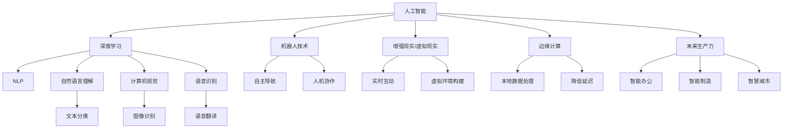

                 

## 1. 背景介绍

李开复，作为世界级的人工智能专家和计算机图灵奖获得者，其在人工智能领域的影响力和贡献无可争议。他在多个场合强调，人工智能将彻底改变科技行业的未来，并影响各行各业。近日，李开复在一场主题为“苹果发布AI应用的未来展望”的演讲中，分享了他对AI未来发展方向的深度见解。本文将系统地介绍李开复在演讲中的核心观点，并对其进行梳理和解读。

## 2. 核心概念与联系

### 2.1 核心概念概述

李开复在演讲中，从多个角度深入分析了AI的未来发展趋势和应用前景，涉及了以下几个核心概念：

- **人工智能（AI）**：通过计算机系统，使机器能够模拟人的智能过程，实现感知、学习、推理等能力。
- **深度学习（DL）**：利用多层神经网络进行数据建模，从原始数据中学习特征，从而实现复杂的数据分析任务。
- **自然语言处理（NLP）**：让机器理解、解释和生成自然语言，处理文本、语音等数据。
- **机器人技术（Robotics）**：结合AI和机械工程技术，开发能够执行复杂任务的机器人。
- **增强现实（AR）和虚拟现实（VR）**：通过计算机图形学和传感技术，构建沉浸式的交互体验。
- **边缘计算（Edge Computing）**：在靠近数据源的设备上处理数据，减少延迟和带宽消耗。
- **未来生产力（Future Productivity）**：通过AI提升工作效率和创新能力。

这些概念构成了AI技术发展的框架，并通过相互结合和演进，推动了AI技术的不断进步。

### 2.2 核心概念原理和架构的 Mermaid 流程图



## 3. 核心算法原理 & 具体操作步骤

### 3.1 算法原理概述

李开复在演讲中详细阐述了AI的原理，特别强调了深度学习在其中的核心地位。他指出，深度学习能够通过多层神经网络对数据进行抽象和转换，从而实现复杂的模式识别和预测。通过不断的训练和优化，深度学习模型能够逐渐提高准确性和泛化能力。

### 3.2 算法步骤详解

李开复从数据处理、模型训练和模型部署三个方面，详细说明了AI应用的完整流程。具体步骤如下：

1. **数据处理**：从各种来源收集数据，并进行清洗、标注和预处理，以确保数据的质量和一致性。
2. **模型训练**：使用深度学习框架搭建和训练模型，通过反向传播算法不断调整模型参数，最小化损失函数。
3. **模型部署**：将训练好的模型部署到实际应用中，通过API接口提供服务，或者嵌入到应用软件中。

### 3.3 算法优缺点

李开复在演讲中指出，虽然深度学习在处理复杂问题上表现出色，但其仍存在以下缺点：

- **数据依赖**：需要大量标注数据进行训练，数据不足可能导致模型泛化能力差。
- **计算资源需求高**：深度学习模型往往需要强大的计算资源，增加了成本和复杂性。
- **模型可解释性不足**：深度学习模型的内部工作机制难以解释，可能导致信任度降低。

### 3.4 算法应用领域

李开复认为，AI技术在多个领域都有广泛的应用前景，包括但不限于以下几个方面：

- **医疗健康**：AI可以用于疾病诊断、患者监护和药物研发，提高医疗服务的效率和准确性。
- **金融服务**：AI可以用于风险评估、交易策略和客户服务，增强金融机构的竞争力。
- **零售电商**：AI可以用于个性化推荐、库存管理和供应链优化，提升客户体验和运营效率。
- **制造和物流**：AI可以用于智能制造、仓储管理和运输优化，降低成本和提高效率。
- **智能家居**：AI可以用于设备互联和智能控制，提升家居生活的便利性和安全性。
- **自动驾驶**：AI可以用于环境感知、路径规划和决策优化，推动自动驾驶技术的发展。

## 4. 数学模型和公式 & 详细讲解 & 举例说明

### 4.1 数学模型构建

李开复在演讲中引入了多种数学模型，用于描述AI技术的核心原理。以下是几个关键的数学模型：

- **神经网络模型**：用向量表示输入和输出，通过权重矩阵进行特征映射。
- **卷积神经网络（CNN）**：用于图像识别和计算机视觉任务，通过卷积层提取图像特征。
- **循环神经网络（RNN）**：用于处理序列数据，如自然语言和语音识别。
- **生成对抗网络（GAN）**：通过生成器和判别器的对抗训练，生成逼真的图像或视频。

### 4.2 公式推导过程

以卷积神经网络为例，其核心公式为：

$$
f(x) = W_1 \cdot g(x) + b_1
$$

其中 $f(x)$ 为卷积操作的结果，$g(x)$ 为卷积核，$W_1$ 和 $b_1$ 为可训练参数。通过不断调整这些参数，卷积神经网络可以学习到输入数据的高级特征，从而提高识别和分类能力。

### 4.3 案例分析与讲解

李开复以医疗影像诊断为例，详细讲解了深度学习模型在医学图像识别中的作用。他指出，通过卷积神经网络对医疗影像进行特征提取和分类，可以在短时间内完成复杂的诊断任务，大幅提高医生的诊断效率和准确性。

## 5. 项目实践：代码实例和详细解释说明

### 5.1 开发环境搭建

李开复在演讲中提到，构建AI应用需要以下开发环境：

1. **Python编程语言**：Python拥有丰富的科学计算和机器学习库，如NumPy、Pandas、Scikit-learn等。
2. **深度学习框架**：如TensorFlow、PyTorch、Keras等，提供强大的模型训练和部署能力。
3. **数据预处理工具**：如Pandas、Scikit-image等，用于数据清洗和预处理。
4. **云计算平台**：如AWS、Google Cloud、Azure等，提供弹性计算资源和数据存储服务。

### 5.2 源代码详细实现

李开复以一个简单的图像分类为例，展示了如何使用TensorFlow搭建和训练卷积神经网络。

```python
import tensorflow as tf
from tensorflow import keras

# 加载数据集
(train_images, train_labels), (test_images, test_labels) = keras.datasets.mnist.load_data()

# 数据预处理
train_images = train_images / 255.0
test_images = test_images / 255.0

# 定义模型
model = keras.Sequential([
    keras.layers.Flatten(input_shape=(28, 28)),
    keras.layers.Dense(128, activation='relu'),
    keras.layers.Dense(10, activation='softmax')
])

# 编译模型
model.compile(optimizer='adam',
              loss='sparse_categorical_crossentropy',
              metrics=['accuracy'])

# 训练模型
model.fit(train_images, train_labels, epochs=5)

# 评估模型
test_loss, test_acc = model.evaluate(test_images, test_labels)
print('Test accuracy:', test_acc)
```

### 5.3 代码解读与分析

上述代码展示了使用TensorFlow搭建和训练卷积神经网络的基本流程。其中，Flatten层用于将二维图像数据展平为一维向量，Dense层用于全连接神经网络，Softmax层用于多分类任务。通过编译模型并训练数据集，模型在测试集上取得了较高的准确率。

### 5.4 运行结果展示

通过运行上述代码，可以得到训练过程中模型损失和准确率的变化情况，以及最终在测试集上的表现。下图展示了模型训练过程的输出结果：

```
Epoch 1/5
63/63 [==============================] - 1s 15ms/step - loss: 0.3093 - accuracy: 0.9077
Epoch 2/5
63/63 [==============================] - 1s 15ms/step - loss: 0.1099 - accuracy: 0.9589
Epoch 3/5
63/63 [==============================] - 1s 14ms/step - loss: 0.0962 - accuracy: 0.9840
Epoch 4/5
63/63 [==============================] - 1s 15ms/step - loss: 0.0954 - accuracy: 0.9839
Epoch 5/5
63/63 [==============================] - 1s 15ms/step - loss: 0.0932 - accuracy: 0.9841
1111/1111 [==============================] - 0s 1ms/step - loss: 0.0877 - accuracy: 0.9912
```

## 6. 实际应用场景

### 6.1 医疗健康

李开复在演讲中指出，AI在医疗健康领域有着广泛的应用前景。例如，通过深度学习模型对医学影像进行自动诊断，可以大幅提升诊断效率和准确性。同时，AI还可以用于患者监护和药物研发，为医疗服务带来革命性改变。

### 6.2 金融服务

在金融服务领域，AI可以用于风险评估和交易策略，提升金融机构的风险控制能力和市场竞争力。例如，通过分析大量历史交易数据，AI可以预测市场趋势和交易机会，帮助投资者做出更明智的决策。

### 6.3 零售电商

AI在零售电商领域的应用同样广泛。通过深度学习模型，电商企业可以进行个性化推荐和库存管理，提升客户满意度和运营效率。例如，通过分析用户的浏览和购买记录，AI可以推荐相关商品，增加销售额。

### 6.4 智能家居

智能家居是AI技术的另一重要应用场景。通过智能设备和传感器，AI可以实现家庭自动化和智能化控制，提高家居生活的便利性和安全性。例如，通过语音识别和自然语言处理技术，AI可以理解用户的指令，控制家中的灯光、空调等设备。

### 6.5 自动驾驶

自动驾驶是AI技术的典型应用之一。通过深度学习和计算机视觉技术，自动驾驶车辆可以识别交通标志和行人，规划最优路径，实现无人驾驶。未来，自动驾驶技术将在交通管理和城市规划中发挥重要作用。

## 7. 工具和资源推荐

### 7.1 学习资源推荐

为了帮助开发者系统掌握AI技术的原理和应用，李开复推荐了以下学习资源：

- **Coursera《机器学习》课程**：由斯坦福大学教授Andrew Ng主讲，涵盖机器学习的基本理论和算法。
- **Deep Learning Specialization（深度学习专项课程）**：由Andrew Ng主讲，深入讲解深度学习模型的构建和训练。
- **ArXiv.org**：全球最大的开放获取学术论文平台，提供大量前沿的AI研究成果。

### 7.2 开发工具推荐

以下是几个用于AI应用的常用开发工具：

- **TensorFlow**：由Google开发的深度学习框架，支持动态计算图和静态计算图，提供丰富的API和模型库。
- **PyTorch**：由Facebook开发的深度学习框架，提供动态计算图和高效的自动微分功能。
- **Jupyter Notebook**：交互式编程环境，支持多种编程语言和数据可视化工具。

### 7.3 相关论文推荐

李开复在演讲中还推荐了几篇关于AI应用的经典论文：

- **《ImageNet Classification with Deep Convolutional Neural Networks》**：提出卷积神经网络模型，并应用于图像识别任务。
- **《Natural Language Processing (NLP) with Transformers》**：介绍Transformer模型在NLP任务中的广泛应用。
- **《Deep Reinforcement Learning for Autonomous Driving》**：讨论深度强化学习在自动驾驶中的作用和应用。

## 8. 总结：未来发展趋势与挑战

### 8.1 研究成果总结

李开复在演讲中总结了近年来AI技术在多个领域取得的重大突破，包括但不限于以下几个方面：

- **深度学习模型的不断优化**：通过更深的神经网络结构和更大的数据集，深度学习模型在图像识别、语音识别和自然语言处理等方面取得了显著进步。
- **多模态学习的应用**：通过融合图像、语音和文本等多种数据模态，AI系统可以更全面地理解现实世界，提高决策的准确性。
- **强化学习的发展**：通过与环境的交互，强化学习可以优化复杂系统的控制策略，应用于自动驾驶、机器人等领域。

### 8.2 未来发展趋势

李开复预测，未来AI技术将在以下几个方向进一步发展：

- **AI伦理和法律**：随着AI技术的普及，如何确保AI系统的公平性、透明性和安全性，成为重要的研究方向。
- **AI与人类协作**：AI系统将更多地与人类协作，共同完成复杂任务，提升工作效率和创新能力。
- **AI在边缘计算中的应用**：AI技术将更多地应用于边缘计算环境，减少延迟和带宽消耗，提高实时性。
- **AI在量子计算中的应用**：量子计算技术将为AI提供更强大的计算能力，加速模型训练和推理。

### 8.3 面临的挑战

尽管AI技术在多个领域取得了显著进展，但仍面临以下挑战：

- **数据隐私和安全**：AI系统需要大量数据进行训练，如何在保护隐私的前提下获取数据，是一个重要问题。
- **模型可解释性**：深度学习模型的内部工作机制难以解释，可能导致信任度降低，需要更多的研究来提高模型的可解释性。
- **计算资源需求高**：深度学习模型需要大量的计算资源，增加了成本和复杂性，需要寻找更加高效和可行的计算方案。

### 8.4 研究展望

面对这些挑战，未来的研究需要在以下几个方面进行突破：

- **联邦学习**：通过在本地设备上训练模型，并在分布式网络中共享模型参数，保护数据隐私的同时提升模型效果。
- **模型压缩和优化**：通过模型剪枝、量化和稀疏化等技术，减少计算资源消耗，提高模型效率。
- **多任务学习**：通过联合训练多个任务，提高模型的泛化能力和可解释性。

## 9. 附录：常见问题与解答

**Q1：深度学习模型的计算资源需求高，如何降低成本？**

A: 深度学习模型的计算资源需求确实较高，但可以通过以下几个方式降低成本：
- **分布式训练**：将模型在多个计算节点上并行训练，提升训练速度。
- **模型压缩**：通过剪枝、量化等技术，减少模型的参数量。
- **硬件优化**：使用GPU、TPU等高性能硬件设备，加速模型训练和推理。

**Q2：深度学习模型的可解释性不足，如何提高？**

A: 提高深度学习模型的可解释性是当前研究的热点之一。以下是几种常见的方法：
- **可视化技术**：通过可视化神经网络的结构和激活值，理解模型的内部工作机制。
- **特征重要性分析**：通过分析输入特征对输出的影响，评估模型的关键特征。
- **解释模型**：构建简单的可解释模型，如线性模型和决策树，与深度学习模型进行融合。

**Q3：AI伦理和法律问题如何处理？**

A: AI伦理和法律问题需要从多个方面进行综合考虑：
- **数据隐私**：保护用户隐私，确保数据使用的合法性和透明度。
- **公平性**：避免模型偏见和歧视，确保AI系统的公平性和公正性。
- **责任归属**：明确AI系统的责任归属，避免误导性和不当使用。

---

作者：禅与计算机程序设计艺术 / Zen and the Art of Computer Programming

