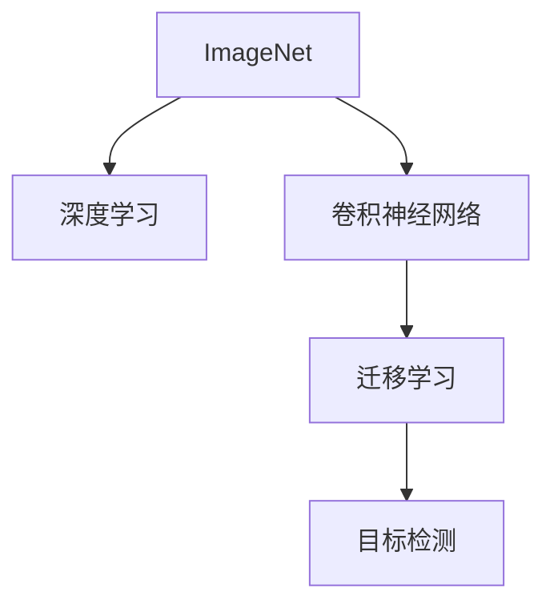

                 

## 1. 背景介绍

ImageNet，一个庞大的图像数据集，由李飞飞教授及其团队于2009年发起，是机器学习和深度学习领域中最具影响力的数据集之一。ImageNet包含超过一百万张高分辨率图像，涵盖了超过二十万个类别，是训练深度学习模型尤其是视觉任务（如图像分类、目标检测、图像分割等）的黄金数据集。

本文将回顾ImageNet项目及其对AI图像识别的重大影响，探讨其背后的核心概念和算法，并结合实践案例进行详细讲解。

## 2. 核心概念与联系

### 2.1 核心概念概述

- **ImageNet**：由斯坦福大学视觉实验室和李飞飞教授主导开发的图像数据集，包含超过一百万张高分辨率图像，涵盖了超过二十万个类别。
- **深度学习**：一种基于神经网络的机器学习技术，能够从大规模数据中学习特征，并进行分类、识别等任务。
- **卷积神经网络（CNN）**：一种专门用于图像处理的深度学习网络，通过卷积层、池化层、全连接层等构建，具有自动提取图像特征的能力。
- **迁移学习**：利用预训练模型的知识，在新任务上快速进行微调，以减少训练时间和提高效果。
- **目标检测**：识别图像中的对象，并给出对象的位置和类别。

### 2.2 核心概念原理和架构的 Mermaid 流程图



这个流程图展示了ImageNet项目与深度学习、CNN、迁移学习、目标检测等核心概念之间的联系。ImageNet项目为深度学习提供了大规模数据集，使得深度学习能够训练出更加准确、高效的模型。CNN作为图像处理的核心技术，利用卷积、池化等操作自动提取图像特征，从而实现高精度的图像分类和识别。迁移学习则利用预训练模型的知识，在新任务上快速进行微调，减少了训练时间和提高了效果。目标检测在此基础上，进一步提升了图像中对象的定位和识别精度。

## 3. 核心算法原理 & 具体操作步骤

### 3.1 算法原理概述

ImageNet项目的核心在于构建大规模的图像数据集，并利用深度学习技术进行图像识别任务。其基本流程如下：

1. **数据收集**：从互联网收集图像，经过标注和预处理，形成大规模的图像数据集。
2. **模型训练**：利用大规模数据集训练深度学习模型，特别是卷积神经网络（CNN）。
3. **模型微调**：利用迁移学习技术，在新任务上快速进行微调，以适应具体应用场景。
4. **目标检测**：利用训练好的模型，进行目标检测，输出图像中对象的位置和类别。

### 3.2 算法步骤详解

#### 3.2.1 数据收集和预处理

ImageNet项目涉及大量的图像数据收集和预处理工作。具体步骤包括：

1. **图像获取**：从互联网上爬取图像，收集各种类型的图像，确保数据的多样性和代表性。
2. **图像标注**：对收集到的图像进行标注，指定每个图像所属的类别。
3. **图像预处理**：对图像进行标准化处理，如缩放、归一化等，以提高模型的训练效果。

#### 3.2.2 模型训练

ImageNet项目中主要使用的是卷积神经网络（CNN）。CNN的训练过程如下：

1. **模型选择**：选择合适的CNN模型，如AlexNet、VGGNet、ResNet等。
2. **损失函数**：选择合适的损失函数，如交叉熵损失、均方误差损失等。
3. **优化器**：选择合适的优化器，如SGD、Adam等。
4. **训练流程**：将数据集分为训练集、验证集和测试集，使用批量梯度下降等优化算法，对模型进行训练，并在验证集上评估模型性能，调整超参数。

#### 3.2.3 模型微调

模型微调是ImageNet项目中非常重要的一环。微调过程如下：

1. **选择预训练模型**：选择一个在大规模数据上预训练的模型，如ImageNet上的预训练模型。
2. **任务适配**：根据具体任务，设计任务适配层，如添加分类器、回归器等。
3. **微调参数**：使用微调后的模型在少量标注数据上训练，调整模型参数以适应具体任务。
4. **评估和调优**：在测试集上评估模型性能，根据结果调整超参数，如学习率、批大小等。

#### 3.2.4 目标检测

目标检测是在图像中识别对象，并输出对象的位置和类别的过程。常用的目标检测算法包括RCNN、Fast R-CNN、Faster R-CNN等。具体步骤包括：

1. **选择目标检测模型**：选择一个目标检测模型，如Faster R-CNN。
2. **数据预处理**：对图像进行预处理，如缩放、归一化等。
3. **特征提取**：利用预训练模型提取图像特征。
4. **目标检测**：利用特征提取的结果，进行目标检测，输出对象的位置和类别。

### 3.3 算法优缺点

#### 3.3.1 优点

1. **大规模数据集**：ImageNet提供了大规模的图像数据集，使得深度学习模型能够在大规模数据上进行训练，提高了模型的泛化能力。
2. **高质量标注**：ImageNet中的图像和标注数据质量高，有助于训练出更准确、可靠的模型。
3. **深度学习模型**：利用卷积神经网络等深度学习技术，实现了高精度的图像识别。
4. **迁移学习**：通过迁移学习，在新任务上快速进行微调，减少了训练时间和提高了效果。
5. **目标检测**：结合目标检测算法，实现了图像中对象的精确定位和识别。

#### 3.3.2 缺点

1. **数据收集和标注成本高**：ImageNet项目涉及大量的图像数据收集和标注工作，成本较高。
2. **模型复杂度**：深度学习模型结构复杂，训练和推理过程耗时较长。
3. **资源需求高**：深度学习模型对计算资源和存储空间的需求较高，需要高性能的硬件支持。
4. **可解释性不足**：深度学习模型通常被视为"黑盒"模型，难以解释其内部工作机制和决策逻辑。
5. **过拟合风险**：在训练过程中，深度学习模型容易过拟合，特别是在数据集较小的情况下。

### 3.4 算法应用领域

ImageNet项目及其核心算法广泛应用于多个领域，包括但不限于：

- **计算机视觉**：图像分类、目标检测、图像分割等。
- **自动驾驶**：道路标志识别、交通信号灯识别等。
- **医学影像**：疾病诊断、病理分析等。
- **安防监控**：人脸识别、行为分析等。
- **智能家居**：物品识别、环境感知等。

## 4. 数学模型和公式 & 详细讲解 & 举例说明

### 4.1 数学模型构建

ImageNet项目中的核心算法包括卷积神经网络（CNN）和目标检测算法。以Faster R-CNN为例，其数学模型构建如下：

1. **输入数据**：输入一张图像 $X$，大小为 $H \times W \times C$，其中 $H$ 和 $W$ 为图像尺寸，$C$ 为通道数。
2. **特征提取**：通过卷积层、池化层等，提取图像特征 $F$。
3. **候选框生成**：使用选择性搜索等方法，生成候选框 $R$。
4. **特征映射**：将候选框 $R$ 映射到特征图 $F$ 上，得到特征图 $F_R$。
5. **边界框回归**：使用回归器对候选框的位置和大小进行调整，得到修正后的边界框 $R'$。
6. **分类**：对修正后的边界框进行分类，输出对象类别和置信度。

### 4.2 公式推导过程

以Faster R-CNN为例，推导其核心公式如下：

1. **特征提取**：
   $$
   F = \mathcal{C}(X)
   $$
   其中，$\mathcal{C}$ 表示卷积层和池化层的组合。

2. **候选框生成**：
   $$
   R = \mathcal{S}(F)
   $$
   其中，$\mathcal{S}$ 表示选择性搜索等方法。

3. **特征映射**：
   $$
   F_R = \mathcal{M}(R, F)
   $$
   其中，$\mathcal{M}$ 表示候选框 $R$ 到特征图 $F$ 的映射。

4. **边界框回归**：
   $$
   R' = \mathcal{R}(R, F_R)
   $$
   其中，$\mathcal{R}$ 表示候选框 $R$ 到修正后的边界框 $R'$ 的回归算法。

5. **分类**：
   $$
   \hat{y} = \mathcal{C}(R')
   $$
   其中，$\mathcal{C}$ 表示分类算法，输出对象类别和置信度。

### 4.3 案例分析与讲解

以ImageNet项目中使用的AlexNet模型为例，分析其结构和训练过程。

**AlexNet模型结构**：

1. **输入层**：输入图像 $X$，大小为 $227 \times 227 \times 3$。
2. **卷积层**：包括两个 $11 \times 11$ 的卷积核，步幅为 $4$，池化层为 $3 \times 3$，步幅为 $2$。
3. **ReLU激活函数**：每个卷积层后面加上ReLU激活函数。
4. **全连接层**：包括三个全连接层，每个全连接层后加上Dropout层。
5. **输出层**：输出1000个类别的预测结果。

**训练过程**：

1. **损失函数**：选择交叉熵损失函数，用于衡量模型预测结果和真实标签之间的差异。
2. **优化器**：选择随机梯度下降（SGD）作为优化器，学习率设置为 $0.05$。
3. **批量大小**：设定批量大小为 $128$，每个batch包含128张图像。
4. **迭代次数**：迭代 $60$ 次，每次迭代包含 $40000$ 张图像。
5. **验证集**：在每个epoch后，在验证集上评估模型性能，选择性能最好的模型作为最终模型。

## 5. 项目实践：代码实例和详细解释说明

### 5.1 开发环境搭建

为了实现ImageNet项目及其核心算法，我们需要搭建相应的开发环境。以下是搭建环境的步骤：

1. **安装Python**：从官网下载并安装Python，确保版本为 $3.6$ 或更高。
2. **安装PyTorch**：通过pip安装PyTorch，确保安装版本为 $1.0$ 或更高。
3. **安装TensorFlow**：通过pip安装TensorFlow，确保安装版本为 $2.0$ 或更高。
4. **安装OpenCV**：通过pip安装OpenCV，用于图像处理。
5. **安装NumPy**：通过pip安装NumPy，用于科学计算。
6. **安装Matplotlib**：通过pip安装Matplotlib，用于数据可视化。

### 5.2 源代码详细实现

以下是一个简单的图像分类代码实现，利用PyTorch和TensorFlow进行实现：

```python
import torch
import torch.nn as nn
import torch.optim as optim
import torchvision.transforms as transforms
import torchvision.models as models
from torchvision import datasets

# 定义模型
class ImageNetModel(nn.Module):
    def __init__(self):
        super(ImageNetModel, self).__init__()
        self.conv1 = nn.Conv2d(3, 64, kernel_size=3, stride=1, padding=1)
        self.relu = nn.ReLU()
        self.maxpool = nn.MaxPool2d(kernel_size=2, stride=2)
        self.fc1 = nn.Linear(64 * 14 * 14, 1024)
        self.fc2 = nn.Linear(1024, 10)

    def forward(self, x):
        x = self.conv1(x)
        x = self.relu(x)
        x = self.maxpool(x)
        x = x.view(-1, 64 * 14 * 14)
        x = self.fc1(x)
        x = self.relu(x)
        x = self.fc2(x)
        return x

# 定义数据预处理
transform = transforms.Compose([
    transforms.Resize((224, 224)),
    transforms.ToTensor(),
    transforms.Normalize(mean=[0.485, 0.456, 0.406], std=[0.229, 0.224, 0.225])
])

# 加载数据集
train_dataset = datasets.ImageFolder('train', transform=transform)
test_dataset = datasets.ImageFolder('test', transform=transform)

# 定义模型和优化器
model = ImageNetModel()
optimizer = optim.SGD(model.parameters(), lr=0.001, momentum=0.9)

# 定义损失函数
criterion = nn.CrossEntropyLoss()

# 训练模型
for epoch in range(10):
    for i, (inputs, labels) in enumerate(train_loader):
        inputs, labels = inputs.to(device), labels.to(device)
        optimizer.zero_grad()
        outputs = model(inputs)
        loss = criterion(outputs, labels)
        loss.backward()
        optimizer.step()
```

### 5.3 代码解读与分析

上述代码实现了基于卷积神经网络的图像分类任务。具体步骤如下：

1. **定义模型**：定义了包含卷积层、ReLU激活函数、池化层和全连接层的卷积神经网络模型。
2. **数据预处理**：使用TensorFlow的数据预处理库，将图像大小调整为 $224 \times 224$，并进行归一化。
3. **加载数据集**：加载ImageNet数据集，分为训练集和测试集。
4. **定义模型和优化器**：定义了优化器和损失函数，使用SGD作为优化器。
5. **训练模型**：使用训练集进行训练，在每个epoch后评估模型性能。

## 6. 实际应用场景

### 6.1 智能安防监控

在智能安防监控领域，目标检测技术被广泛应用于人脸识别、行为分析等任务。通过利用ImageNet项目中的目标检测算法，可以高效地检测和识别图像中的对象，提高安防监控系统的智能水平。

### 6.2 自动驾驶

在自动驾驶领域，目标检测技术被用于道路标志识别、交通信号灯识别等任务。通过利用ImageNet项目中的目标检测算法，可以实时检测道路上的车辆、行人、交通信号灯等，提高自动驾驶系统的安全性。

### 6.3 医学影像分析

在医学影像分析领域，目标检测技术被用于肿瘤检测、病理分析等任务。通过利用ImageNet项目中的目标检测算法，可以高效地检测和分析医学影像中的病变区域，提高诊断的准确性。

### 6.4 未来应用展望

未来，随着深度学习技术和目标检测算法的发展，ImageNet项目及其核心算法将在更多领域得到应用，为智能系统的建设提供强有力的支持。以下是几个可能的应用方向：

1. **智能家居**：利用目标检测技术，实现智能家电的自动化控制和环境感知。
2. **智慧城市**：利用目标检测技术，实现交通流量监控、环境监测等城市管理任务。
3. **智能制造**：利用目标检测技术，实现工业产品质量检测、生产流程监控等任务。
4. **智能医疗**：利用目标检测技术，实现疾病诊断、病理分析等任务。

## 7. 工具和资源推荐

### 7.1 学习资源推荐

为了深入学习ImageNet项目及其核心算法，推荐以下几个学习资源：

1. **《Deep Learning》书籍**：Ian Goodfellow等人合著的经典深度学习教材，涵盖了深度学习的基础理论和应用实践。
2. **《CS231n: Convolutional Neural Networks for Visual Recognition》课程**：斯坦福大学开设的深度学习课程，详细讲解了卷积神经网络、目标检测等核心技术。
3. **《ImageNet Large Scale Visual Recognition Challenge》论文**：ImageNet项目的原始论文，详细介绍了数据集的构建和算法实现。
4. **《Faster R-CNN: Towards Real-Time Object Detection with Region Proposal Networks》论文**：Faster R-CNN的原始论文，详细介绍了目标检测算法的实现。

### 7.2 开发工具推荐

ImageNet项目及其核心算法涉及到深度学习、计算机视觉等领域的开发，以下是一些推荐工具：

1. **PyTorch**：由Facebook开发的深度学习框架，支持动态图和静态图，适合研究原型开发。
2. **TensorFlow**：由Google开发的深度学习框架，支持分布式计算和GPU加速，适合大规模工程应用。
3. **OpenCV**：开源计算机视觉库，支持图像处理、特征提取等任务。
4. **Matplotlib**：开源数据可视化库，支持绘制图像、曲线、散点图等。

### 7.3 相关论文推荐

ImageNet项目及其核心算法涉及深度学习、计算机视觉等领域的众多研究，以下是一些推荐论文：

1. **《ImageNet Classification with Deep Convolutional Neural Networks》论文**：AlexNet的原始论文，详细介绍了卷积神经网络的实现和应用。
2. **《Faster R-CNN: Towards Real-Time Object Detection with Region Proposal Networks》论文**：Faster R-CNN的原始论文，详细介绍了目标检测算法的实现。
3. **《Rethinking the Inception Architecture for Computer Vision》论文**：Inception的原始论文，详细介绍了多分支卷积神经网络的实现和应用。

## 8. 总结：未来发展趋势与挑战

### 8.1 研究成果总结

ImageNet项目及其核心算法在深度学习、计算机视觉等领域的贡献不容忽视，其推动了NLP、医学影像分析、安防监控等领域的智能化发展。未来的研究将继续拓展其应用范围，提高模型的性能和泛化能力。

### 8.2 未来发展趋势

1. **大规模数据集**：随着技术的发展，大规模数据集的构建将更加便捷，为深度学习模型的训练和优化提供更多数据支持。
2. **高效的训练和推理**：利用优化算法和硬件加速技术，提高深度学习模型的训练和推理效率，实现实时性和高效性。
3. **更加通用的目标检测**：目标检测算法将向更加通用、鲁棒的方向发展，支持更多的图像处理任务。
4. **跨模态融合**：将视觉、听觉、文本等多种模态的信息进行融合，实现更加全面、准确的图像识别。

### 8.3 面临的挑战

1. **数据收集和标注成本**：构建大规模数据集和高质量标注数据仍然需要大量人力和物力，成本较高。
2. **模型复杂度**：深度学习模型结构复杂，训练和推理过程耗时较长，难以在资源受限的设备上运行。
3. **可解释性不足**：深度学习模型通常被视为"黑盒"模型，难以解释其内部工作机制和决策逻辑。
4. **过拟合风险**：在训练过程中，深度学习模型容易过拟合，特别是在数据集较小的情况下。

### 8.4 研究展望

未来的研究将继续在以下几个方面寻求突破：

1. **无监督学习和半监督学习**：探索无需大规模标注数据的学习方式，提高模型训练的效率和泛化能力。
2. **小样本学习**：利用预训练模型的知识，在小样本条件下实现高精度的图像识别。
3. **跨模态融合**：将视觉、听觉、文本等多种模态的信息进行融合，实现更加全面、准确的图像识别。
4. **模型可解释性**：探索模型解释方法，提高深度学习模型的可解释性，便于对模型进行调试和优化。

总之，ImageNet项目及其核心算法将继续引领深度学习和计算机视觉领域的发展，为构建更加智能、可靠的图像识别系统提供强有力的支持。

## 9. 附录：常见问题与解答

**Q1: ImageNet项目是如何构建的？**

A: ImageNet项目是由斯坦福大学视觉实验室和李飞飞教授主导开发的。该项目涉及大量的图像数据收集和标注工作，耗费了大量的人力物力。其中，数据收集部分通过爬取互联网上的图像进行，标注部分则由志愿者进行标注。

**Q2: ImageNet项目中的目标检测算法有哪些？**

A: ImageNet项目中主要使用的目标检测算法包括RCNN、Fast R-CNN、Faster R-CNN等。这些算法通过引入区域选择和特征提取等技术，实现了高效的图像对象检测。

**Q3: ImageNet项目对深度学习有哪些贡献？**

A: ImageNet项目对深度学习领域做出了巨大贡献，主要体现在以下几个方面：
1. 提供了大规模数据集，使得深度学习模型能够在大规模数据上进行训练，提高了模型的泛化能力。
2. 推动了卷积神经网络（CNN）等深度学习技术的发展。
3. 提供了目标检测等核心算法，支持了计算机视觉领域的发展。

**Q4: 如何优化深度学习模型的训练和推理？**

A: 优化深度学习模型的训练和推理可以从以下几个方面入手：
1. 使用更好的优化器，如Adam、RMSprop等。
2. 引入正则化技术，如L2正则、Dropout等，防止模型过拟合。
3. 利用硬件加速技术，如GPU、TPU等，提高训练和推理速度。
4. 使用模型压缩、剪枝等技术，减少模型参数量，降低计算资源需求。

总之，通过优化算法、硬件加速和模型压缩等技术，可以显著提高深度学习模型的训练和推理效率。

**Q5: 深度学习模型的可解释性问题如何解决？**

A: 深度学习模型的可解释性问题可以通过以下几种方法解决：
1. 使用可视化技术，如梯度热图、特征图等，直观地展示模型的工作机制。
2. 使用模型解释工具，如SHAP、LIME等，生成模型的解释报告。
3. 设计更加可解释的模型结构，如决策树、规则引擎等。

通过以上方法，可以增强深度学习模型的可解释性，便于对其内部工作机制和决策逻辑进行分析和调试。

作者：禅与计算机程序设计艺术 / Zen and the Art of Computer Programming

