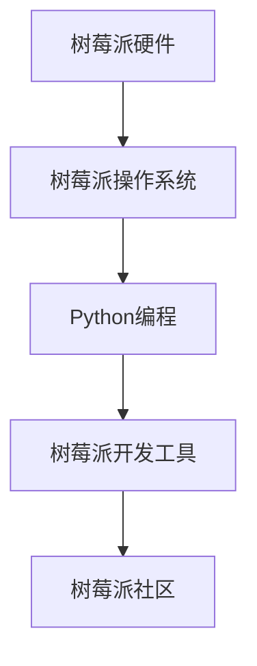

                 

# 树莓派开发：从入门到精通

## 1. 背景介绍

### 1.1 问题由来

在当前科技迅猛发展的时代，树莓派（Raspberry Pi）因其低成本、高性能的特性，逐渐成为各类嵌入式开发、教育、科学实验的强大平台。树莓派作为一款基于ARM架构的微控制器，提供了完整的硬件和软件环境，包括Linux操作系统、Python编程语言、丰富的开发工具和社区资源，使得开发者可以轻松地进行硬件控制、网络编程、系统开发等各类应用。树莓派的应用范围遍及物联网（IoT）设备、视频监控系统、教育机器人、智能家居等领域，其灵活性和低成本使得它成为各类开发者的首选平台。

### 1.2 问题核心关键点

树莓派开发的核心关键点在于理解其硬件架构、操作系统、编程语言和开发工具，并能够高效地利用其资源进行各类应用开发。树莓派开发需要掌握树莓派硬件的接口使用、Linux系统的配置、Python编程语言的基本和进阶应用、硬件驱动的开发、网络编程以及设备之间的通信协议等技能。此外，了解树莓派的生态系统和社区资源，也是开发过程中不可或缺的一部分。

## 2. 核心概念与联系

### 2.1 核心概念概述

为更好地理解树莓派开发的全过程，本节将介绍几个关键概念：

- 树莓派（Raspberry Pi）：基于ARM架构的微控制器，包含CPU、内存、存储、输入输出接口等功能。
- 树莓派操作系统（Raspberry Pi OS）：运行在树莓派上的Linux发行版，提供了Python、Git、LibreOffice、Firefox等常用软件。
- 树莓派编程语言（Python）：广泛应用于树莓派开发的高级编程语言，以其简洁、易学、灵活的特性受到开发者欢迎。
- 树莓派开发工具（Python库、GPIO库、pyserial、Raspi-HTTP-Server等）：用于实现树莓派硬件控制的Python库和工具。
- 树莓派社区（Raspberry Pi Foundation、GitHub等）：提供丰富的资源、交流平台、教程等，帮助开发者解决各类问题。

这些核心概念之间存在紧密联系，通过了解和掌握它们，可以更好地进行树莓派开发。

### 2.2 核心概念原理和架构的 Mermaid 流程图



这个流程图展示了树莓派开发的基本流程：硬件-操作系统-编程语言-开发工具-社区资源，强调了树莓派硬件和操作系统的基础地位，以及编程语言、开发工具和社区资源的重要性。

## 3. 核心算法原理 & 具体操作步骤

### 3.1 算法原理概述

树莓派开发主要涉及硬件编程、软件编程和系统配置三大方面。硬件编程需要掌握树莓派的GPIO接口、I2C、SPI等总线协议，以便控制外部设备。软件编程则涉及Python编程语言，需要理解其基本语法和高级特性，如面向对象编程、网络编程、多线程编程等。系统配置包括安装操作系统、设置用户权限、配置网络等操作，需要熟悉Linux系统的操作。

### 3.2 算法步骤详解

#### 3.2.1 硬件编程

树莓派提供了多种硬件接口，如GPIO、I2C、SPI、USB等，用于连接和控制外部设备。下面以GPIO接口为例，展示硬件编程的基本步骤：

1. 连接硬件：将树莓派的GPIO引脚与外部设备连接。
2. 初始化GPIO：在Python代码中使用`Raspberry Pi GPIO`库初始化GPIO接口，设置引脚模式和输入输出电平。
3. 读取和写入：通过读取或写入GPIO引脚的电平状态，实现对外部设备的控制。

```python
import RPi.GPIO as GPIO

GPIO.setmode(GPIO.BCM)
GPIO.setup(18, GPIO.OUT)

GPIO.output(18, GPIO.LOW)  # 输出低电平
time.sleep(1)
GPIO.output(18, GPIO.HIGH)  # 输出高电平
```

#### 3.2.2 软件编程

树莓派的Python编程语言是树莓派开发的重要工具。Python的简洁性、易学性和丰富的库支持，使得开发者能够快速进行各类应用开发。下面以网络编程为例，展示软件编程的基本步骤：

1. 导入库：使用Python的`socket`库进行网络编程。
2. 创建套接字：使用`socket.socket()`函数创建套接字。
3. 绑定地址：使用`socket.bind()`函数将套接字绑定到指定地址。
4. 监听连接：使用`socket.listen()`函数监听网络连接。
5. 接受连接：使用`socket.accept()`函数接受客户端连接。
6. 发送和接收数据：通过`socket.send()`和`socket.recv()`函数进行数据发送和接收。

```python
import socket

server_socket = socket.socket(socket.AF_INET, socket.SOCK_STREAM)
server_socket.bind(('0.0.0.0', 8080))
server_socket.listen(5)

while True:
    client_socket, client_address = server_socket.accept()
    print(f'New connection from {client_address[0]}:{client_address[1]}')
    data = client_socket.recv(1024)
    print(f'Received data: {data.decode()}')
    client_socket.send('Hello, client!'.encode())
    client_socket.close()
```

#### 3.2.3 系统配置

树莓派的操作系统是Raspberry Pi OS，基于Debian Linux，提供了丰富的软件和工具。系统配置包括安装操作系统、设置用户权限、配置网络等操作。下面以安装Python库为例，展示系统配置的基本步骤：

1. 安装操作系统：使用树莓派的SD卡烧录器将操作系统镜像写入SD卡。
2. 设置SSH登录：配置SSH服务，使开发者可以通过SSH远程登录树莓派。
3. 安装软件：使用`apt-get`命令或`pip`命令安装所需的软件和库。
4. 配置网络：使用`ifconfig`命令配置网络接口。

```bash
sudo apt-get update
sudo apt-get install python3-pip
sudo pip3 install requests
```

### 3.3 算法优缺点

树莓派开发的优势在于其低成本、高性能、易学易用。硬件和软件资源的丰富性使得开发者能够快速进行各类应用开发。Python语言的简洁性和易学性使得开发者能够快速上手编程。此外，树莓派的社区资源丰富，开发过程中遇到问题可以随时寻求帮助。

然而，树莓派开发也存在一些缺点。首先，硬件资源相对有限，对于一些高计算需求的应用，可能需要额外扩展硬件资源。其次，操作系统和编程语言的资源相对较少，对于一些特定的应用，可能需要自定义开发或引入第三方库。最后，树莓派开发需要一定的硬件和软件基础知识，对于初学者来说有一定的门槛。

### 3.4 算法应用领域

树莓派开发的应用领域非常广泛，包括但不限于以下几个方面：

- 物联网（IoT）设备：如智能家居、智能门锁、传感器监测系统等。
- 视频监控系统：如家庭监控、企业监控、公共安全监控等。
- 教育机器人：如机器人编程、机器人导航、机器人控制等。
- 科学实验：如电子工程实验、物理实验、化学实验等。
- 嵌入式开发：如数据采集、信号处理、图像处理等。

## 4. 数学模型和公式 & 详细讲解 & 举例说明

### 4.1 数学模型构建

树莓派开发主要涉及硬件控制、网络编程和系统配置三大方面，不涉及复杂的数学模型和公式。然而，树莓派的系统配置需要一定的计算机网络知识，可以简单地从数学角度进行讲解。

树莓派的网络配置涉及IP地址、子网掩码、网关等网络参数的设置。IP地址用于标识树莓派在网络中的位置，子网掩码用于确定IP地址的网络部分，网关用于连接外部网络。这些参数的设置需要满足以下规则：

- IP地址格式为`X.X.X.X`，其中`X`的范围为`0`到`255`。
- 子网掩码格式为`X.X.X.X`，其中`X`的范围为`0`到`255`。
- 网关地址格式为`X.X.X.X`，其中`X`的范围为`0`到`255`。

### 4.2 公式推导过程

树莓派的网络配置涉及的数学公式主要包括IP地址的计算和子网掩码的计算。

假设树莓派的IP地址为`192.168.1.10`，子网掩码为`255.255.255.0`，计算出该IP地址的网络部分和广播地址。

1. 将IP地址和子网掩码分别转换为二进制形式：
   - IP地址：`11000000 10101000 00000001 00001010`
   - 子网掩码：`11111111 11111111 11111111 00000000`

2. 计算IP地址的网络部分：
   - IP地址的网络部分为：`11000000 10101000 00000001 00000000`
   - 对应的十进制IP地址为：`192.168.1.0`

3. 计算广播地址：
   - 将子网掩码的二进制形式取反，得到：`00000000 00000000 00000000 11111111`
   - 与IP地址的二进制形式进行或运算，得到广播地址的二进制形式：`11000000 10101000 00000001 11111111`
   - 对应的十进制广播地址为：`192.168.1.255`

### 4.3 案例分析与讲解

假设树莓派要连接到一个企业内网中，其内网地址为`192.168.1.0/24`，子网掩码为`255.255.255.0`，网关地址为`192.168.1.254`。

1. 设置树莓派的IP地址：
   - 在`/etc/dhcpcd.conf`文件中添加`start_ip=192.168.1.x`，`stop_ip=192.168.1.254`。

2. 配置树莓派的网络参数：
   - 使用`ifconfig`命令设置IP地址、子网掩码和网关：
     ```bash
     ifconfig eth0 192.168.1.10 netmask 255.255.255.0 gateway 192.168.1.254
     ```

3. 测试树莓派的连接：
   - 使用`ping`命令测试与网关是否能正常通信：
     ```bash
     ping 192.168.1.254
     ```

## 5. 项目实践：代码实例和详细解释说明

### 5.1 开发环境搭建

在进行树莓派开发前，需要搭建好开发环境。以下是使用Raspberry Pi作为开发平台的环境配置流程：

1. 获取开发板：购买或制作一块树莓派开发板，确保其具有所需的硬件接口和性能。
2. 连接开发板与计算机：将树莓派开发板通过USB接口连接至计算机，用于下载操作系统和开发工具。
3. 准备SD卡：将Raspberry Pi OS镜像写入SD卡，并插入树莓派开发板的SD卡槽。
4. 连接网络：将树莓派开发板通过网线或Wi-Fi连接到网络。
5. 安装开发工具：在树莓派操作系统上安装Python、Raspberry Pi GPIO、pyserial、Raspi-HTTP-Server等开发工具。

### 5.2 源代码详细实现

下面以树莓派的GPIO编程为例，展示源代码的详细实现：

```python
import RPi.GPIO as GPIO
import time

# 设置GPIO引脚
GPIO.setmode(GPIO.BCM)
GPIO.setup(18, GPIO.OUT)

# 输出高电平
GPIO.output(18, GPIO.HIGH)

# 延时1秒
time.sleep(1)

# 输出低电平
GPIO.output(18, GPIO.LOW)
```

### 5.3 代码解读与分析

上述代码展示了树莓派的GPIO编程的基本步骤：

1. 导入库：使用`RPi.GPIO`库进行硬件控制。
2. 设置引脚：使用`GPIO.setmode(GPIO.BCM)`函数设置引脚模式，使用`GPIO.setup(18, GPIO.OUT)`函数设置引脚为输出模式。
3. 输出高电平：使用`GPIO.output(18, GPIO.HIGH)`函数输出高电平。
4. 延时：使用`time.sleep(1)`函数延时1秒。
5. 输出低电平：使用`GPIO.output(18, GPIO.LOW)`函数输出低电平。

## 6. 实际应用场景

### 6.1 智能家居系统

树莓派可以用于构建智能家居系统，通过传感器和执行器实现家居设备的自动化控制。例如，可以使用树莓派连接温度传感器、湿度传感器、灯光控制模块等，实现自动调节室内温度、湿度和照明系统。树莓派还可以与智能手机、平板电脑等设备通过Wi-Fi或蓝牙连接，实现远程控制和监控。

### 6.2 视频监控系统

树莓派可以用于构建视频监控系统，通过摄像头和视频编码器实现视频采集和存储。例如，可以使用树莓派连接摄像头、视频编码器、硬盘存储设备等，实现全天候的视频监控和存储。树莓派还可以与智能手机、平板电脑等设备通过Wi-Fi或蓝牙连接，实现实时监控和报警。

### 6.3 教育机器人

树莓派可以用于构建教育机器人，通过编程接口和传感器实现机器人的自主学习和控制。例如，可以使用树莓派连接各种传感器、执行器和程序控制器，实现机器人的自主导航、物体识别和避障等功能。树莓派还可以与智能手机、平板电脑等设备通过Wi-Fi或蓝牙连接，实现远程编程和监控。

### 6.4 科学实验

树莓派可以用于科学实验，通过数据采集和处理实现各类实验数据的记录和分析。例如，可以使用树莓派连接传感器、数据采集卡、计算机等设备，实现各类科学实验的数据采集和处理。树莓派还可以与智能手机、平板电脑等设备通过Wi-Fi或蓝牙连接，实现实验数据的远程传输和分析。

## 7. 工具和资源推荐

### 7.1 学习资源推荐

为帮助开发者系统掌握树莓派开发的知识，推荐以下学习资源：

1. 《树莓派编程指南》书籍：详细介绍树莓派硬件、操作系统、Python编程语言和树莓派开发工具的使用。
2. Raspberry Pi Foundation官网：提供树莓派硬件、操作系统、编程语言和社区资源的全面介绍。
3. GitHub树莓派项目：提供丰富的开源项目和代码示例，供开发者学习和参考。
4. Python官方文档：提供Python编程语言的详细文档和教程，帮助开发者深入理解Python的语法和特性。
5. Linux基础教程：提供Linux操作系统的基础知识和命令使用，帮助开发者熟悉Linux系统的操作。

### 7.2 开发工具推荐

树莓派开发需要使用多种工具，以下是推荐的一些开发工具：

1. PyCharm：一款功能强大的Python集成开发环境，支持Python代码的调试、测试、部署等。
2. Visual Studio Code：一款轻量级、功能强大的代码编辑器，支持Python和树莓派开发所需的插件和扩展。
3. Anaconda：一款Python环境管理工具，支持Python环境的快速搭建和管理。
4. Arduino IDE：一款用于开发树莓派和其他嵌入式设备的应用程序，支持树莓派和外部设备的硬件控制。
5. Wireshark：一款网络协议分析工具，用于调试树莓派的网络通信和协议分析。

### 7.3 相关论文推荐

树莓派开发涉及硬件控制、软件编程和系统配置等多个方面，以下是一些相关的学术论文，推荐阅读：

1. "The Raspberry Pi User's Manual"（树莓派用户手册）：介绍树莓派硬件、操作系统、Python编程语言和树莓派开发工具的使用。
2. "Raspberry Pi Computing: Education and the Internet of Things"（树莓派计算：教育和物联网）：探讨树莓派在教育、物联网等领域的应用。
3. "A Comparative Study of Raspberry Pi for Internet of Things Applications"（树莓派在物联网应用中的比较研究）：对比树莓派与其他物联网开发平台的性能和特点。
4. "Programming the Raspberry Pi: A Hands-on Guide"（树莓派编程：动手指南）：详细介绍树莓派硬件、操作系统、Python编程语言和树莓派开发工具的使用。
5. "Raspberry Pi in Education: Opportunities and Challenges"（树莓派在教育中的应用：机遇与挑战）：探讨树莓派在教育中的应用和面临的挑战。

## 8. 总结：未来发展趋势与挑战

### 8.1 研究成果总结

树莓派开发自问世以来，在硬件控制、软件编程和系统配置等方面取得了显著进展。硬件资源的不断丰富和完善使得树莓派的应用范围不断扩展，软件资源的不断积累和更新使得树莓派开发的环境不断优化。开发者可以通过树莓派进行各类应用开发，实现各类创新应用。

### 8.2 未来发展趋势

树莓派开发的未来发展趋势如下：

1. 硬件资源升级：树莓派硬件资源的不断升级，如CPU性能的提升、存储容量的增加、扩展接口的丰富等，将进一步提升树莓派的性能和应用能力。
2. 操作系统优化：树莓派操作系统的不断优化，如系统安全性、网络性能、资源管理等，将进一步提升树莓派的稳定性和可靠性。
3. 编程语言扩展：树莓派编程语言的不断扩展，如Python语言的不断升级、其他编程语言的引入等，将进一步提升树莓派开发的灵活性和多样性。
4. 应用场景拓展：树莓派开发的应用场景不断拓展，如智能家居、视频监控、教育机器人、科学实验等，将进一步提升树莓派的实用性和创新性。
5. 社区生态壮大：树莓派社区的不断壮大，如开发者社区、开源项目、技术交流等，将进一步提升树莓派开发的活力和动力。

### 8.3 面临的挑战

树莓派开发也面临一些挑战：

1. 硬件资源限制：树莓派的硬件资源相对有限，对于一些高计算需求的应用，可能需要额外扩展硬件资源。
2. 操作系统稳定性：树莓派操作系统的稳定性和可靠性需要进一步提升，避免出现系统崩溃或数据丢失等问题。
3. 编程语言限制：树莓派编程语言相对较少，对于一些特定的应用，可能需要自定义开发或引入第三方库。
4. 开发者门槛：树莓派开发需要一定的硬件和软件基础知识，对于初学者来说有一定的门槛。

### 8.4 研究展望

面对树莓派开发所面临的挑战，未来的研究需要在以下几个方面寻求新的突破：

1. 优化硬件资源：通过硬件资源升级和扩展，提升树莓派的性能和应用能力。
2. 提升操作系统稳定性：通过系统优化和安全加固，提升树莓派操作系统的稳定性和可靠性。
3. 丰富编程语言：通过引入更多编程语言和开发工具，提升树莓派开发的灵活性和多样性。
4. 拓展应用场景：通过应用场景的不断拓展和创新，提升树莓派开发的实用性和创新性。
5. 降低开发者门槛：通过提供更多的学习资源和开发工具，降低树莓派开发的门槛，吸引更多的开发者加入树莓派开发社区。

总之，树莓派开发在硬件控制、软件编程和系统配置等方面取得了显著进展，但仍面临一些挑战。通过持续的技术创新和优化，树莓派将进一步拓展其应用范围和创新能力，成为各类开发者的首选平台。

