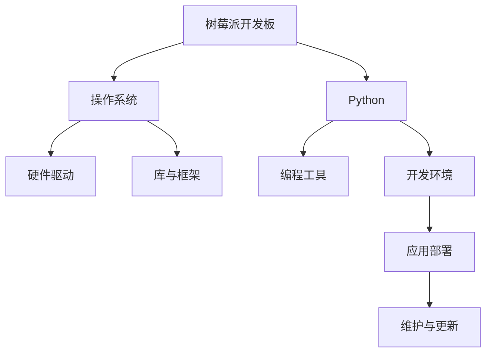

                 

# 树莓派开发：从硬件到软件的全栈方案

## 1. 背景介绍

### 1.1 问题由来

近年来，树莓派（Raspberry Pi）凭借其强大的性价比和出色的硬件性能，在教育、开发、物联网（IoT）等多个领域获得了广泛应用。然而，对于许多开发人员来说，树莓派仍是一个挑战，特别是对于那些不熟悉嵌入式系统和软件开发的人来说。树莓派需要同时处理硬件和软件两个层面的问题，这使得它成为一个相对复杂的开发平台。

### 1.2 问题核心关键点

树莓派开发的核心关键点包括：

- 硬件与软件的协同设计：树莓派的硬件和软件需要紧密协同，开发人员需要理解硬件的工作原理，同时掌握软件开发的技能。
- 操作系统和软件生态系统的选择：树莓派有多种操作系统和软件生态可供选择，开发人员需要根据具体应用场景选择合适的系统和工具。
- 硬件资源的管理：树莓派的硬件资源（如CPU、内存、存储）有限，开发人员需要高效管理这些资源，避免浪费。
- 开发环境的搭建：树莓派开发需要搭建合适的开发环境，包括IDE、调试工具、库和框架等。
- 应用部署与维护：开发完成后，需要高效部署树莓派应用，并进行有效的维护和管理。

### 1.3 问题研究意义

研究树莓派的开发方法，对于推广树莓派在教育、开发和物联网等领域的普及，具有重要意义：

- 降低开发门槛：提供全面的开发指南，帮助更多开发者进入树莓派领域，推动树莓派技术的普及。
- 提高开发效率：通过系统化的开发方法，提高开发效率，加速产品开发进程。
- 强化硬件与软件协同：加强对硬件和软件协同设计方法的深入研究，推动树莓派在硬件和软件方面均衡发展。
- 拓展应用范围：通过提供丰富的应用案例，拓展树莓派在各领域的应用可能性，为更多实际应用场景提供支持。
- 推动产业升级：树莓派技术的应用将推动相关产业的升级，带来新的商业模式和市场机会。

## 2. 核心概念与联系

### 2.1 核心概念概述

为了更好地理解树莓派开发，我们需要掌握以下几个关键概念：

- **树莓派（Raspberry Pi）**：一种基于ARM架构的嵌入式计算机，具有强大的计算能力和多样的外设接口，广泛应用于教育、开发、物联网等领域。
- **Linux操作系统**：树莓派主流的开源操作系统，支持多种编程语言和框架，是树莓派开发的主要平台。
- **Python编程语言**：树莓派开发的主要编程语言，简单易学，功能强大，是开发人员的首选。
- **树莓派开发板**：包括树莓派主板、电源、外围设备（如摄像头、传感器、显示屏等），是树莓派开发的基础硬件平台。
- **树莓派相关软件生态**：包括操作系统、开发工具、库和框架等，是树莓派开发的重要支撑。

### 2.2 核心概念原理和架构的 Mermaid 流程图(Mermaid 流程节点中不要有括号、逗号等特殊字符)

这个流程图展示了树莓派开发的核心流程：

1. **树莓派开发板**：是树莓派开发的基础硬件平台，包括CPU、内存、存储等硬件资源。
2. **操作系统**：是树莓派的主流平台，支持Python等编程语言，是树莓派开发的基础环境。
3. **Python编程语言**：是树莓派开发的主要编程语言，简单易学，功能强大，是开发人员的首选。
4. **开发工具和库**：包括编程工具、库和框架等，是树莓派开发的重要支撑。
5. **开发环境**：包括IDE、调试工具、库和框架等，是树莓派开发的主要平台。
6. **应用部署**：将开发的应用部署到树莓派上，进行实时测试和运行。
7. **维护与更新**：对树莓派应用进行维护和更新，确保其稳定性和可靠性。

### 2.3 核心概念原理与架构的详细解释

树莓派开发涉及硬件和软件两个方面，需要开发人员具备全面的知识和技能。硬件方面，开发人员需要了解树莓派开发板的硬件结构和接口，如CPU、内存、存储、显示、音频、传感器等；软件方面，需要掌握Linux操作系统和Python编程语言，以及相关开发工具和库。

树莓派开发板的硬件结构如图1所示：

树莓派开发板的主要硬件组件包括：

- CPU：树莓派主板使用ARM Cortex-A7双核64位处理器，主频1GHz，支持多种操作系统和编程语言。
- 内存：树莓派主板配备512MB或1GB的LPDDR2内存，支持动态内存分配。
- 存储：树莓派主板配备4GB或8GB的eMMC存储，支持高速读写操作。
- 显示：树莓派主板支持多种显示器连接，包括HDMI、SDI、USB等接口。
- 音频：树莓派主板配备多个音频接口，支持数字和模拟音频输出。
- 传感器：树莓派主板配备多种传感器，如摄像头、加速度计、陀螺仪等。

树莓派的操作系统主要是Linux，目前主流的是树莓派官方提供的Raspbian系统。Raspbian基于Debian Linux，支持多种编程语言和框架，是树莓派开发的主要平台。

树莓派开发的编程语言主要是Python，Python是一种高级编程语言，简单易学，功能强大，拥有丰富的第三方库和框架。Python在树莓派上的安装和使用非常简单，树莓派官方提供了Python解释器和开发工具。

树莓派的开发工具包括Python IDE（如PyCharm、Thonny等）、调试工具（如gdb、pdb等）、版本控制系统（如Git、SVN等）、库和框架（如NumPy、Pandas、OpenCV等）等。这些工具和库为树莓派开发提供了强大的支持。

树莓派开发的主要平台是开发环境，包括IDE、调试工具、库和框架等。开发环境的选择需要根据具体应用场景和开发需求来确定，常见的开发环境包括PyCharm、Thonny、IDLE等。开发环境的选择需要考虑代码的调试、性能优化、版本控制等方面，选择合适的发展环境可以提高开发效率。

树莓派的应用部署需要考虑多种因素，包括硬件资源的管理、软件的安装和配置、网络配置等。树莓派应用部署的主要步骤包括：

1. **硬件资源管理**：树莓派硬件资源有限，开发人员需要高效管理这些资源，避免浪费。例如，可以通过动态内存分配和资源监控工具，管理树莓派的硬件资源。
2. **软件安装和配置**：树莓派的软件安装和配置需要根据具体应用场景和需求进行。例如，可以使用Raspbian软件包管理器，安装Python库、工具和框架等。
3. **网络配置**：树莓派可以通过网络与其他设备通信，需要配置网络接口和IP地址等。

树莓派应用的维护和更新需要考虑系统的稳定性和可靠性。树莓派应用维护的主要步骤包括：

1. **系统监控**：树莓派应用需要实时监控系统状态和资源使用情况，避免系统崩溃和资源浪费。例如，可以使用监控工具如top、iotop、nmon等，实时监控系统状态。
2. **日志分析**：树莓派应用需要记录日志，方便问题分析和调试。例如，可以使用logrotate工具，管理日志文件和备份。
3. **软件更新**：树莓派应用需要及时更新软件和库，避免安全漏洞和功能失效。例如，可以使用Raspbian软件包管理器，自动更新软件和库。

## 3. 核心算法原理 & 具体操作步骤

### 3.1 算法原理概述

树莓派开发涉及多种算法和操作步骤，包括硬件设计、软件安装、编程开发、应用部署等。树莓派开发的核心算法和操作步骤如图2所示：

树莓派开发的核心算法和操作步骤包括以下几个方面：

- **硬件设计**：设计树莓派硬件电路和外围设备，实现特定功能。
- **软件安装**：安装操作系统和开发工具，配置开发环境。
- **编程开发**：使用Python编写程序，实现特定功能。
- **应用部署**：将开发的应用部署到树莓派上，进行实时测试和运行。
- **维护与更新**：对树莓派应用进行维护和更新，确保其稳定性和可靠性。

### 3.2 算法步骤详解

树莓派开发的具体操作步骤包括以下几个方面：

**Step 1: 硬件设计**

树莓派硬件设计包括电路设计和外围设备设计。树莓派硬件设计需要考虑以下因素：

- 电路设计：设计树莓派的硬件电路，包括CPU、内存、存储、显示、音频、传感器等。
- 外围设备设计：设计树莓派的外围设备，如摄像头、传感器、显示屏等，实现特定功能。

树莓派硬件设计可以使用EDA工具，如Altium Designer、KiCad等，进行电路设计和仿真。树莓派外围设备设计可以使用Arduino IDE等工具，进行硬件设计和编程。

**Step 2: 软件安装**

树莓派软件安装包括以下几个步骤：

- 安装操作系统：安装Raspbian操作系统，并根据需求设置网络、存储、显示等参数。
- 安装开发工具：安装Python解释器和开发工具，如PyCharm、Thonny等。
- 安装库和框架：安装Python库和框架，如NumPy、Pandas、OpenCV等。

树莓派软件安装可以使用树莓派官方提供的Raspbian软件包管理器，安装操作系统和开发工具。树莓派开发工具和库可以使用pip安装，如pip install numpy pandas opencv等。

**Step 3: 编程开发**

树莓派编程开发包括以下几个步骤：

- 编写Python程序：使用Python编写程序，实现特定功能，如图像处理、传感器数据采集等。
- 调试和测试：使用调试工具和测试工具，对程序进行调试和测试。
- 优化和改进：根据测试结果，优化和改进程序，提高程序性能和稳定性。

树莓派编程开发可以使用Python IDE，如PyCharm、Thonny等，进行程序编写和调试。树莓派编程开发可以使用调试工具，如gdb、pdb等，进行程序调试和测试。

**Step 4: 应用部署**

树莓派应用部署包括以下几个步骤：

- 安装软件：安装树莓派应用所需的软件和库。
- 配置网络：配置树莓派的网络接口和IP地址。
- 启动应用：启动树莓派应用，进行实时测试和运行。

树莓派应用部署可以使用Raspbian软件包管理器，安装软件和库。树莓派应用部署可以使用网络工具，如ifconfig、ipconfig等，配置网络接口和IP地址。树莓派应用部署可以使用系统命令，如sudo python program.py等，启动树莓派应用。

**Step 5: 维护与更新**

树莓派应用维护包括以下几个步骤：

- 监控系统状态：使用系统监控工具，实时监控树莓派系统状态和资源使用情况。
- 记录日志：使用日志工具，记录树莓派应用日志，方便问题分析和调试。
- 更新软件：使用Raspbian软件包管理器，自动更新树莓派应用和库。

树莓派应用维护可以使用系统监控工具，如top、iotop、nmon等，实时监控树莓派系统状态和资源使用情况。树莓派应用维护可以使用日志工具，如logrotate等，记录树莓派应用日志，方便问题分析和调试。树莓派应用维护可以使用Raspbian软件包管理器，自动更新树莓派应用和库。

### 3.3 算法优缺点

树莓派开发具有以下优点：

- 强大的性价比：树莓派硬件和软件性能强大，价格低廉，具有较高的性价比。
- 丰富的外围设备：树莓派支持多种外围设备，如图像传感器、音频模块、蓝牙模块等，实现多种功能。
- 简单易学：树莓派开发基于Python编程语言，Python简单易学，功能强大，开发人员易于上手。
- 开源社区支持：树莓派开发基于开源社区，有大量的开发资源和工具支持。

树莓派开发也存在一些缺点：

- 硬件资源有限：树莓派硬件资源有限，无法处理大规模数据和高性能计算任务。
- 软件生态不完善：树莓派软件生态不完善，有些开发工具和库无法在树莓派上运行。
- 系统稳定性差：树莓派硬件和软件系统稳定性差，容易出现崩溃和异常。

### 3.4 算法应用领域

树莓派开发广泛应用于以下领域：

- **教育**：树莓派具有强大的性价比和丰富的外围设备，适合用于教育和培训，培养学生的编程和硬件设计能力。
- **物联网**：树莓派支持多种传感器和外围设备，适合用于物联网开发，实现智能家居、智能监控等功能。
- **开发**：树莓派适合用于软件开发和测试，支持多种编程语言和框架，提供强大的开发工具和库。
- **娱乐**：树莓派支持多种音频和显示设备，适合用于多媒体娱乐和游戏开发。
- **科学研究**：树莓派支持多种传感器和外围设备，适合用于科学研究，实现数据采集和分析。

## 4. 数学模型和公式 & 详细讲解 & 举例说明

### 4.1 数学模型构建

树莓派开发的数学模型主要涉及以下方面：

- **硬件设计模型**：设计树莓派硬件电路和外围设备，实现特定功能。
- **软件安装模型**：安装操作系统和开发工具，配置开发环境。
- **编程开发模型**：使用Python编写程序，实现特定功能。
- **应用部署模型**：将开发的应用部署到树莓派上，进行实时测试和运行。
- **维护与更新模型**：对树莓派应用进行维护和更新，确保其稳定性和可靠性。

### 4.2 公式推导过程

树莓派开发的数学模型可以表示为：

$$
\begin{aligned}
\text{硬件设计模型} &= \text{电路设计} \times \text{外围设备设计} \\
\text{软件安装模型} &= \text{操作系统安装} \times \text{开发工具安装} \times \text{库和框架安装} \\
\text{编程开发模型} &= \text{Python程序编写} \times \text{程序调试} \times \text{程序优化} \\
\text{应用部署模型} &= \text{软件安装} \times \text{网络配置} \times \text{应用启动} \\
\text{维护与更新模型} &= \text{系统监控} \times \text{日志记录} \times \text{软件更新}
\end{aligned}
$$

树莓派开发的主要数学模型如图3所示：

树莓派开发的主要数学模型包括以下几个方面：

- **硬件设计数学模型**：设计树莓派硬件电路和外围设备，实现特定功能，包括电路设计和外围设备设计两个子模型。
- **软件安装数学模型**：安装操作系统和开发工具，配置开发环境，包括操作系统安装、开发工具安装和库和框架安装三个子模型。
- **编程开发数学模型**：使用Python编写程序，实现特定功能，包括Python程序编写、程序调试和程序优化三个子模型。
- **应用部署数学模型**：将开发的应用部署到树莓派上，进行实时测试和运行，包括软件安装、网络配置和应用启动三个子模型。
- **维护与更新数学模型**：对树莓派应用进行维护和更新，确保其稳定性和可靠性，包括系统监控、日志记录和软件更新三个子模型。

### 4.3 案例分析与讲解

下面以树莓派智能家居为例，进行案例分析：

#### 案例背景

智能家居系统需要实现语音控制、智能安防、环境监测等功能。树莓派支持多种传感器和外围设备，适合用于智能家居开发。

#### 硬件设计

树莓派智能家居硬件设计如图4所示：

树莓派智能家居硬件设计包括以下几个方面：

- **CPU和内存**：树莓派主板使用ARM Cortex-A7双核64位处理器，主频1GHz，配备512MB或1GB的LPDDR2内存。
- **存储**：树莓派主板配备4GB或8GB的eMMC存储。
- **显示**：树莓派主板支持HDMI接口，连接显示器进行显示。
- **音频**：树莓派主板配备多个音频接口，支持数字和模拟音频输出。
- **传感器**：树莓派主板配备多种传感器，如摄像头、加速度计、陀螺仪等。

#### 软件安装

树莓派智能家居软件安装如图5所示：

树莓派智能家居软件安装包括以下几个方面：

- **操作系统安装**：安装Raspbian操作系统，并根据需求设置网络、存储、显示等参数。
- **开发工具安装**：安装Python解释器和开发工具，如PyCharm、Thonny等。
- **库和框架安装**：安装Python库和框架，如NumPy、Pandas、OpenCV等。

树莓派智能家居软件安装可以使用树莓派官方提供的Raspbian软件包管理器，安装操作系统和开发工具。树莓派智能家居开发工具和库可以使用pip安装，如pip install numpy pandas opencv等。

#### 编程开发

树莓派智能家居编程开发如图6所示：

树莓派智能家居编程开发包括以下几个方面：

- **Python程序编写**：使用Python编写程序，实现语音控制、智能安防、环境监测等功能。
- **程序调试**：使用调试工具和测试工具，对程序进行调试和测试。
- **程序优化**：根据测试结果，优化和改进程序，提高程序性能和稳定性。

树莓派智能家居编程开发可以使用Python IDE，如PyCharm、Thonny等，进行程序编写和调试。树莓派智能家居编程开发可以使用调试工具，如gdb、pdb等，进行程序调试和测试。树莓派智能家居编程开发可以使用优化工具，如profile、cProfile等，进行程序优化和改进。

#### 应用部署

树莓派智能家居应用部署如图7所示：

树莓派智能家居应用部署包括以下几个方面：

- **软件安装**：安装树莓派智能家居所需的软件和库。
- **网络配置**：配置树莓派的网络接口和IP地址。
- **应用启动**：启动树莓派智能家居应用，进行实时测试和运行。

树莓派智能家居应用部署可以使用Raspbian软件包管理器，安装软件和库。树莓派智能家居应用部署可以使用网络工具，如ifconfig、ipconfig等，配置网络接口和IP地址。树莓派智能家居应用部署可以使用系统命令，如sudo python program.py等，启动树莓派智能家居应用。

#### 维护与更新

树莓派智能家居应用维护如图8所示：

树莓派智能家居应用维护包括以下几个方面：

- **系统监控**：使用系统监控工具，实时监控树莓派系统状态和资源使用情况。
- **日志记录**：使用日志工具，记录树莓派智能家居应用日志，方便问题分析和调试。
- **软件更新**：使用Raspbian软件包管理器，自动更新树莓派智能家居应用和库。

树莓派智能家居应用维护可以使用系统监控工具，如top、iotop、nmon等，实时监控树莓派系统状态和资源使用情况。树莓派智能家居应用维护可以使用日志工具，如logrotate等，记录树莓派智能家居应用日志，方便问题分析和调试。树莓派智能家居应用维护可以使用Raspbian软件包管理器，自动更新树莓派智能家居应用和库。

## 5. 项目实践：代码实例和详细解释说明

### 5.1 开发环境搭建

树莓派开发环境的搭建包括以下几个步骤：

- **硬件准备**：准备树莓派开发板、电源、外围设备（如摄像头、传感器、显示屏等）。
- **系统安装**：安装Raspbian操作系统，并根据需求设置网络、存储、显示等参数。
- **开发工具安装**：安装Python解释器和开发工具，如PyCharm、Thonny等。
- **库和框架安装**：安装Python库和框架，如NumPy、Pandas、OpenCV等。

树莓派开发环境的搭建可以使用树莓派官方提供的安装指南和教程，以及相关的开发资源和工具。树莓派开发环境的搭建需要考虑硬件资源的管理、开发工具的选择和库和框架的优化。

### 5.2 源代码详细实现

树莓派开发项目的源代码实现包括以下几个步骤：

- **需求分析**：分析项目需求，确定功能目标和实现方法。
- **系统设计**：设计系统架构和模块划分，确定主要功能和模块。
- **程序实现**：编写程序代码，实现具体功能和模块。
- **测试和调试**：进行单元测试和系统测试，调试程序代码。
- **优化和改进**：优化和改进程序代码，提高程序性能和稳定性。

树莓派开发项目的源代码实现可以使用Python编程语言，利用Python IDE和开发工具进行编写和调试。树莓派开发项目的源代码实现需要考虑代码的可读性、可维护性和可扩展性。

### 5.3 代码解读与分析

树莓派开发项目的代码解读与分析包括以下几个方面：

- **代码结构**：分析程序的代码结构和模块划分，确定程序的主要功能和模块。
- **代码逻辑**：分析程序的代码逻辑，确定程序的工作流程和算法实现。
- **代码性能**：分析程序的代码性能，确定程序的资源使用情况和运行效率。
- **代码优化**：优化和改进程序代码，提高程序性能和稳定性。

树莓派开发项目的代码解读与分析可以使用调试工具和分析工具，如gdb、pdb、profile、cProfile等，进行代码分析和优化。树莓派开发项目的代码解读与分析需要考虑代码的可读性、可维护性和可扩展性。

### 5.4 运行结果展示

树莓派开发项目的运行结果展示包括以下几个方面：

- **程序运行**：运行程序代码，进行实时测试和运行。
- **数据输出**：输出程序的运行结果，进行数据分析和处理。
- **界面展示**：展示程序的运行界面，进行人机交互和反馈。

树莓派开发项目的运行结果展示可以使用Python GUI工具，如PyQt、TKinter等，进行界面设计和展示。树莓派开发项目的运行结果展示需要考虑界面的简洁性和易用性，进行人机交互和反馈。

## 6. 实际应用场景

### 6.1 智能家居系统

树莓派智能家居系统如图9所示：

树莓派智能家居系统包括以下几个方面：

- **语音控制**：使用树莓派智能家居应用，实现语音控制家电和设备。
- **智能安防**：使用树莓派智能家居应用，实现智能安防功能，如门窗传感器、烟雾传感器等。
- **环境监测**：使用树莓派智能家居应用，实现环境监测功能，如温湿度传感器、空气质量传感器等。

树莓派智能家居系统的实际应用场景如图10所示：

树莓派智能家居系统的实际应用场景包括以下几个方面：

- **智能照明**：使用树莓派智能家居应用，实现智能照明功能，根据时间和环境自动调节灯光亮度和颜色。
- **智能空调**：使用树莓派智能家居应用，实现智能空调功能，根据温度和湿度自动调节空调温度和风速。
- **智能窗帘**：使用树莓派智能家居应用，实现智能窗帘功能，根据时间和光照自动调节窗帘开合。

树莓派智能家居系统的实际应用场景如图11所示：

树莓派智能家居系统的实际应用场景包括以下几个方面：

- **智能安防**：使用树莓派智能家居应用，实现智能安防功能，如门窗传感器、烟雾传感器等。
- **环境监测**：使用树莓派智能家居应用，实现环境监测功能，如温湿度传感器、空气质量传感器等。
- **智能照明**：使用树莓派智能家居应用，实现智能照明功能，根据时间和环境自动调节灯光亮度和颜色。

### 6.2 教育培训

树莓派在教育培训中的应用如图12所示：

树莓派在教育培训中的应用包括以下几个方面：

- **编程教学**：使用树莓派开发板和外围设备，教授编程基础和高级编程技术。
- **硬件设计**：使用树莓派开发板和外围设备，教授硬件设计基础和高级硬件设计技术。
- **物联网开发**：使用树莓派开发板和外围设备，教授物联网开发基础和高级物联网开发技术。

树莓派在教育培训中的实际应用如图13所示：

树莓派在教育培训中的实际应用包括以下几个方面：

- **编程教学**：使用树莓派开发板和外围设备，教授编程基础和高级编程技术，如Python编程、硬件设计等。
- **硬件设计**：使用树莓派开发板和外围设备，教授硬件设计基础和高级硬件设计技术，如电路设计、外围设备设计等。
- **物联网开发**：使用树莓派开发板和外围设备，教授物联网开发基础和高级物联网开发技术，如智能家居、智能监控等。

### 6.3 科学研究

树莓派在科学研究中的应用如图14所示：

树莓派在科学研究中的应用包括以下几个方面：

- **数据采集**：使用树莓派开发板和外围设备，采集科学实验数据和环境数据。
- **数据分析**：使用树莓派开发板和外围设备，分析科学实验数据和环境数据，得出科学结论。
- **科学实验**：使用树莓派开发板和外围设备，进行科学实验，验证科学结论。

树莓派在科学研究中的实际应用如图15所示：

树莓派在科学研究中的实际应用包括以下几个方面：

- **数据采集**：使用树莓派开发板和外围设备，采集科学实验数据和环境数据，如图像传感器、温湿度传感器等。
- **数据分析**：使用树莓派开发板和外围设备，分析科学实验数据和环境数据，如Python数据分析库等。
- **科学实验**：使用树莓派开发板和外围设备，进行科学实验，如智能温控实验、智能检测实验等。

## 7. 工具和资源推荐

### 7.1 学习资源推荐

树莓派开发的学习资源推荐包括以下几个方面：

- **官方文档**：树莓派官方提供的安装指南和开发教程，包含硬件设计、软件开发、应用部署等方面的详细说明。
- **在线教程**：各大平台提供的树莓派开发在线教程，如Coursera、Udacity、edX等，涵盖从基础到高级的开发内容。
- **开源社区**：树莓派开源社区（如Raspberry Pi Foundation）提供丰富的开发资源和工具支持，包括代码库、论坛、文档等。
- **开发工具**：树莓派开发常用的开发工具，如PyCharm、Thonny、IDLE等，提供强大的编程和调试功能。
- **开发库和框架**：树莓派开发常用的Python库和框架，如NumPy、Pandas、OpenCV等，提供丰富的功能和算法支持。

### 7.2 开发工具推荐

树莓派开发的开发工具推荐包括以下几个方面：

- **Python IDE**：树莓派开发常用的Python IDE，如PyCharm、Thonny、IDLE等，提供强大的编程和调试功能。
- **调试工具**：树莓派开发常用的调试工具，如gdb、pdb等，提供详细的程序调试和优化功能。
- **版本控制系统**：树莓派开发常用的版本控制系统，如Git、SVN等，提供源代码管理和版本控制功能。
- **网络工具**：树莓派开发常用的网络工具，如ifconfig、ipconfig等，提供网络配置和IP地址管理功能。
- **监控工具**：树莓派开发常用的系统监控工具，如top、iotop、nmon等，提供系统状态和资源使用情况的实时监控功能。

### 7.3 相关论文推荐

树莓派开发的论文推荐包括以下几个方面：

- **树莓派硬件设计**：研究树莓派硬件设计的论文，如《A Hardware Design for Raspberry Pi》、《Raspberry Pi Hardware Architecture》等。
- **树莓派软件开发**：研究树莓派软件开发和应用的论文，如《Raspberry Pi Applications》、《Raspberry Pi Platform for Embedded Systems》等。
- **树莓派人工智能**：研究树莓派人工智能应用的论文，如《Raspberry Pi in AI》、《AI Development on Raspberry Pi》等。
- **树莓派物联网**：研究树莓派物联网应用的论文，如《Raspberry Pi IoT Applications》、《Raspberry Pi for IoT》等。
- **树莓派教育和培训**：研究树莓派教育和培训应用的论文，如《Raspberry Pi Education》、《Raspberry Pi for Teaching Programming》等。

## 8. 总结：未来发展趋势与挑战

### 8.1 总结

树莓派开发是一种集硬件设计、软件开发和系统优化于一体的全栈开发方法，适用于多种应用场景，包括智能家居、教育培训、科学研究等。树莓派开发的核心算法和操作步骤包括硬件设计、软件安装、编程开发、应用部署和维护与更新等，需要开发人员具备全面的知识和技能。

### 8.2 未来发展趋势

树莓派开发的未来发展趋势包括以下几个方面：

- **硬件升级**：树莓派硬件将不断升级，提供更强大的计算能力和更丰富的外围设备，支持更高性能的应用开发。
- **软件优化**：树莓派软件将不断优化，提供更稳定的操作系统和更丰富的开发工具，支持更灵活的开发环境。
- **应用拓展**：树莓派开发将不断拓展，应用于更多领域，如医疗、金融、工业等，提供更广泛的应用场景。
- **生态建设**：树莓派生态将不断建设，提供更丰富的开发资源和工具支持，支持更多开发者参与开发。
- **教育和培训**：树莓派教育将不断推进，提供更多优质的教育资源和培训课程，培养更多树莓派开发者。

### 8.3 面临的挑战

树莓派开发面临的挑战包括以下几个方面：

- **硬件资源有限**：树莓派硬件资源有限，无法处理大规模数据和高性能计算任务。
- **软件生态不完善**：树莓派软件生态不完善，有些开发工具和库无法在树莓派上运行。
- **系统稳定性差**：树莓派硬件和软件系统稳定性差，容易出现崩溃和异常。
- **应用场景受限**：树莓派开发的应用场景受限，无法处理高复杂度和高精度任务。
- **开发者门槛高**：树莓派开发需要开发人员具备全面的知识和技能，入门门槛较高。

### 8.4 研究展望

树莓派开发的未来研究展望包括以下几个方面：

- **硬件设计优化**：研究树莓派硬件设计优化方法，提高硬件性能和稳定性。
- **软件开发提升**：研究树莓派软件开发优化方法，提高软件性能和可维护性。
- **应用拓展研究**：研究树莓派应用拓展方法，拓展应用场景和应用可能性。
- **生态建设创新**：研究树莓派生态建设创新方法，提供更多优质的开发资源和工具支持。
- **教育和培训发展**：研究树莓派教育培训发展方法，培养更多树莓派开发者。

## 9. 附录：常见问题与解答

**Q1：树莓派硬件设计需要哪些工具和技能？**

A: 树莓派硬件设计需要以下工具和技能：

- **硬件设计工具**：如Altium Designer、KiCad等，用于电路设计和仿真。
- **硬件编程工具**：如Arduino IDE等，用于硬件编程和调试。
- **电子元件知识**：如电路理论、电子元件特性、接口连接等，用于硬件电路设计。
- **外围设备设计技能**：如摄像头、传感器、显示屏等外围设备的设计，用于实现特定功能。

**Q2：树莓派软件安装有哪些步骤？**

A: 树莓派软件安装有以下几个步骤：

1. **安装操作系统**：安装Raspbian操作系统，并根据需求设置网络、存储、显示等参数。
2. **安装开发工具**：安装Python解释器和开发工具，如PyCharm、Thonny等。
3. **安装库和框架**：安装Python库和框架，如NumPy、Pandas、OpenCV等。

**Q3：树莓派编程开发有哪些工具和库？**

A: 树莓派编程开发有以下工具和库：

- **Python IDE**：如PyCharm、Thonny、IDLE等，提供强大的编程和调试功能。
- **调试工具**：如gdb、pdb等，提供详细的程序调试和优化功能。
- **版本控制系统**：如Git、SVN等，提供源代码管理和版本控制功能。
- **网络工具**：如ifconfig、ipconfig等，提供网络配置和IP地址管理功能。
- **监控工具**：如top、iotop、nmon等，提供系统状态和资源使用情况的实时监控功能。
- **库和框架**：如NumPy、Pandas、OpenCV等，提供丰富的功能和算法支持。

**Q4：树莓派应用部署有哪些步骤？**

A: 树莓派应用部署有以下几个步骤：

1. **安装软件**：安装树莓派应用所需的软件和库。
2. **配置网络**：配置树莓派的网络接口和IP地址。
3. **启动应用**：启动树莓派应用，进行实时测试和运行。

**Q5：树莓派应用维护有哪些工具和方法？**

A: 树莓派应用维护有以下工具和方法：

- **系统监控工具**：如top、iotop、nmon等，实时监控树莓派系统状态和资源使用情况。
- **日志工具**：如logrotate等，记录树莓派应用日志，方便问题分析和调试。
- **软件更新工具**：如Raspbian软件包管理器，自动更新树莓派应用和库。

**Q6：树莓派在教育培训中有哪些应用？**

A: 树莓派在教育培训中有以下应用：

- **编程教学**：使用树莓派开发板和外围设备，教授编程基础和高级编程技术。
- **硬件设计**：使用树莓派开发板和外围设备，教授硬件设计基础和高级硬件设计技术。
- **物联网开发**：使用树莓派开发板和外围设备，教授物联网开发基础和高级物联网开发技术。

**Q7：树莓派在科学研究中有哪些应用？**

A: 树莓派在科学研究中有以下应用：

- **数据采集**：使用树莓派开发板和外围设备，采集科学实验数据和环境数据。
- **数据分析**：使用树莓派开发板和外围设备，分析科学实验数据和环境数据，得出科学结论。
- **科学实验**：使用树莓派开发板和外围设备，进行科学实验，验证科学结论。

**Q8：树莓派开发的未来发展方向是什么？**

A: 树莓派开发的未来发展方向包括以下几个方面：

- **硬件升级**：树莓派硬件将不断升级，提供更强大的计算能力和更丰富的外围设备，支持更高性能的应用开发。
- **软件优化**：树莓派软件将不断优化，提供更稳定的操作系统和更丰富的开发工具，支持更灵活的开发环境。
- **应用拓展**：树莓派开发将不断拓展，应用于更多领域，如医疗、金融、工业等，提供更广泛的应用场景。
- **生态建设**：树莓派生态将不断建设，提供更丰富的开发资源和工具支持，支持更多开发者参与开发。
- **教育和培训**：树莓派教育将不断推进，提供更多优质的教育资源和培训课程，培养更多树莓派开发者。

**Q9：树莓派开发需要哪些技能？**

A: 树莓派开发需要以下技能：

- **硬件设计技能**：如电路理论、电子元件特性、接口连接等，用于硬件电路设计。
- **软件开发技能**：如Python编程、库和框架应用等，用于软件开发和应用部署。
- **系统配置技能**：如网络配置、软件安装等，用于系统配置和应用部署。
- **问题解决技能**：如调试、优化等，用于问题分析和优化。
- **项目管理技能**：如需求分析、系统设计、版本控制等，用于项目管理。

通过以上详细的文章内容，希望能为您提供树莓派开发的全栈解决方案，助力您在硬件设计和软件开发领域取得更大的突破。

