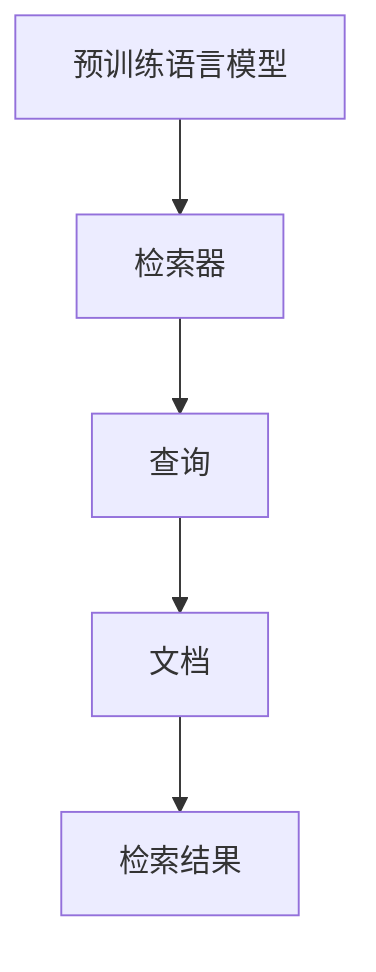

                 

## 1. 背景介绍

### 1.1 问题由来

近年来，自然语言处理（NLP）领域的技术迅猛发展，尤其是大规模语言模型（Large Language Models, LLMs）和深度学习（Deep Learning）的结合，显著提升了NLP任务的性能。然而，尽管这些模型在理解文本语义和生成文本方面表现出色，它们在具体的文档检索和信息抽取任务中往往不尽如人意。传统上，这些问题通常通过使用特征提取器（Feature Extractor）和分类器（Classifier）的“提取-分类”管道来解决，但这些方法往往需要大量的人工设计和工程资源。

### 1.2 问题核心关键点

检索器（Retrievers）是一种利用大规模预训练语言模型在大规模文本数据上自监督学习文本特征的方法，通过检索相关的文本段落或文档，而不是直接分类。与传统的“提取-分类”方法相比，检索器具有以下优势：

- **零样本/少样本学习能力**：检索器通过学习文本特征，可以零样本/少样本地检索出与查询相关的文档，而不必依赖大量的标注数据。
- **高效泛化**：检索器能够高效地泛化到新的领域和任务，因为它们在庞大的无标签数据集上进行自监督学习，捕捉了广泛的语言特征。
- **简单直观**：检索器只涉及到检索，没有复杂的分类器设计，易于实现和优化。

随着研究的发展，检索器在搜索引擎、推荐系统、问答系统等领域得到了广泛应用，显著提升了相关系统的性能和效率。

### 1.3 问题研究意义

检索器的研究对于提高NLP任务的性能、减少工程资源投入、加速技术落地应用具有重要意义：

- **提高效率**：检索器能够高效地检索相关文档，减少了分类器训练和调优的复杂度。
- **降低成本**：检索器基于预训练模型，减少了特征提取和分类器的设计工作量，降低了系统开发和维护成本。
- **促进技术创新**：检索器方法激发了更多的创新研究，如利用语言模型的多模态特征、自适应检索等。
- **推动应用落地**：检索器为搜索引擎、推荐系统等实际应用提供了高效、可扩展的解决方案，加速了NLP技术的产业化进程。

## 2. 核心概念与联系

### 2.1 核心概念概述

检索器是一种利用预训练语言模型在大规模文本数据上进行自监督学习的方法，通过学习文本特征，检索出与查询相关的文档。与传统的“提取-分类”方法相比，检索器具有更强的零样本/少样本学习能力、高效泛化能力和简单直观的架构。

检索器通常包括以下几个关键概念：

- **预训练语言模型**：如BERT、GPT等，在无标签文本数据上进行自监督学习，学习广泛的语言特征。
- **检索器（Retriever）**：基于预训练语言模型，在大规模文本数据上进行自监督学习，学习文档特征，用于检索相关文档。
- **查询（Query）**：检索任务的目标，可以是文本、图像、视频等形式。
- **文档（Document）**：与查询相关的文本段落或文档。
- **检索结果（Retrieval Result）**：与查询相关的文档集合。

这些核心概念之间的逻辑关系可以通过以下Mermaid流程图来展示：



这个流程图展示了大语言模型的核心概念及其之间的关系：

1. 预训练语言模型通过在大量无标签文本数据上进行自监督学习，学习到广泛的文本特征。
2. 检索器在大规模文本数据上学习文档特征，用于检索与查询相关的文档。
3. 查询可以是文本、图像、视频等形式，文档则是与查询相关的文本段落或文档。
4. 检索结果是指与查询相关的文档集合。

这些概念共同构成了检索器的基础框架，使得检索器在多个NLP任务中得到了广泛应用。

## 3. 核心算法原理 & 具体操作步骤
### 3.1 算法原理概述

检索器的工作原理基于预训练语言模型的文档特征学习。检索器通过在大规模文本数据上自监督学习，学习到与查询相关的文档特征。这些特征被用于检索相关文档，而不必依赖标注数据。

检索器通常包括以下几个关键步骤：

1. 选择预训练语言模型作为初始化参数。
2. 在大规模文本数据上学习检索器，通过自监督学习任务（如文本匹配、相关性排序等），学习文档特征。
3. 对于每个查询，使用检索器检索相关文档，返回检索结果。

检索器的核心在于其自监督学习的能力，通过学习文档特征，能够在没有标注数据的情况下，高效地检索相关文档。

### 3.2 算法步骤详解

#### 3.2.1 预训练语言模型选择

选择预训练语言模型作为检索器的初始化参数是检索器构建的第一步。常用的预训练语言模型包括BERT、GPT、RoBERTa等。这些模型在大规模无标签文本数据上进行了自监督学习，学习到了广泛的文本特征。

#### 3.2.2 自监督学习任务设计

检索器的自监督学习任务设计通常包括以下几种：

- **文本匹配（Text Matching）**：给定两个文本段落，判断它们是否匹配。常用的任务包括TextMatch、MLM（Masked Language Model）等。
- **相关性排序（Relevance Sorting）**：给定一组文档和一个查询，排序文档与查询的相关性。常用的任务包括Next Sentence Prediction、SimCSE等。
- **文档聚合（Document Aggregation）**：给定一组文档和一个查询，将文档按相关性聚合排序。常用的任务包括DPR（Dense Passage Retrieval）、DETR（Dense Encoder）等。

#### 3.2.3 检索器训练

检索器的训练通常包括以下几个步骤：

1. **数据预处理**：将大规模文本数据转换为检索器能够处理的格式，如将文本段落转换为向量表示。
2. **模型初始化**：使用预训练语言模型作为检索器的初始化参数。
3. **自监督学习**：在预训练语言模型上训练检索器，学习文档特征。
4. **检索结果评估**：使用标准评估指标（如NDCG、MAP等）评估检索器的性能。
5. **微调优化**：根据评估结果，优化检索器，提高检索性能。

#### 3.2.4 检索结果返回

检索器返回与查询相关的文档集合，这些文档通常以向量表示的形式返回。可以使用向量内积、余弦相似度等方法计算检索结果与查询的相似度，选择相似度最高的文档作为检索结果。

### 3.3 算法优缺点

检索器具有以下优点：

1. **高效泛化**：检索器在大规模文本数据上进行自监督学习，能够高效地泛化到新的领域和任务。
2. **零样本/少样本学习能力**：检索器不需要依赖标注数据，能够零样本/少样本地检索出与查询相关的文档。
3. **简单直观**：检索器只涉及到检索，没有复杂的分类器设计，易于实现和优化。
4. **可扩展性强**：检索器可以在大规模文本数据上学习文档特征，能够处理海量文本数据。

同时，检索器也存在一些缺点：

1. **数据资源需求高**：检索器需要大量的文本数据进行自监督学习，对于小规模数据集，效果可能不佳。
2. **复杂度较高**：检索器在大规模文本数据上进行自监督学习，训练和优化过程较为复杂。
3. **效果不稳定**：检索器对数据分布和查询的敏感度较高，效果可能受数据质量影响较大。

### 3.4 算法应用领域

检索器在多个NLP任务中得到了广泛应用，包括但不限于以下领域：

- **搜索引擎**：检索器在搜索引擎中用于检索相关网页，提升搜索结果的相关性和精度。
- **推荐系统**：检索器在推荐系统中用于检索相关物品，提升推荐效果和用户满意度。
- **问答系统**：检索器在问答系统中用于检索相关文档，提高问题的回答质量和效率。
- **文本摘要**：检索器在文本摘要中用于检索相关段落，提高摘要的质量和相关性。
- **多模态检索**：检索器在多模态检索中用于检索相关文本、图像、视频等，提升跨模态检索效果。

这些应用场景展示了检索器的强大能力，使其成为NLP技术中的重要组成部分。

## 4. 数学模型和公式 & 详细讲解 & 举例说明

### 4.1 数学模型构建

检索器通常使用预训练语言模型（如BERT、GPT等）作为初始化参数，在大规模文本数据上自监督学习文档特征。

假设有$D$个文档，每个文档$x_i$由$w_i$个单词组成，检索器在每个文档中学习一个向量表示$z_i$，表示该文档的特征。查询$q$也是一个向量表示，检索器的目标是最小化查询$q$与文档$z_i$之间的距离，以选择最相关的文档。

### 4.2 公式推导过程

检索器通常使用向量内积（Dot Product）或余弦相似度（Cosine Similarity）来计算查询$q$与文档$z_i$之间的相似度。

$$
\text{Similarity}(q, z_i) = z_i^T W q
$$

其中$W$为可学习的参数矩阵，$q$和$z_i$都是向量表示。

检索器的检索结果为：

$$
\text{Rank}(q) = \text{Sort}_{i=1}^{D} (\text{Similarity}(q, z_i))
$$

其中$\text{Sort}$表示按照相似度排序。

### 4.3 案例分析与讲解

以检索器在搜索引擎中的应用为例，检索器的训练和检索过程如下：

1. **数据预处理**：将大规模网页数据转换为检索器能够处理的向量表示。
2. **模型初始化**：使用预训练语言模型BERT作为检索器的初始化参数。
3. **自监督学习**：在大规模网页数据上训练检索器，学习文档特征。
4. **检索结果返回**：对于每个查询，使用检索器检索相关网页，返回排序后的网页列表。

以下是一个简单的检索器模型实现，使用PyTorch框架：

```python
import torch
from transformers import BertTokenizer, BertModel

# 初始化预训练语言模型和分词器
model = BertModel.from_pretrained('bert-base-uncased')
tokenizer = BertTokenizer.from_pretrained('bert-base-uncased')

# 定义检索器
class Retriever:
    def __init__(self, model, tokenizer):
        self.model = model
        self.tokenizer = tokenizer

    def encode(self, texts):
        inputs = self.tokenizer(texts, return_tensors='pt', padding='max_length', truncation=True)
        features = self.model(**inputs).last_hidden_state
        return features

    def similarity(self, query, doc_features):
        return torch.nn.functional.cosine_similarity(query, doc_features, dim=1)  # 使用余弦相似度

    def retrieve(self, query, k=10):
        doc_features = self.encode(texts)
        scores = self.similarity(query, doc_features)
        top_k_indices = torch.argsort(scores, dim=-1)[:, :k]
        return texts[top_k_indices]

# 训练检索器
# ...

# 检索结果返回
retriever = Retriever(model, tokenizer)
query = 'query text'
retrieved_docs = retriever.retrieve(query)
```

这个代码示例展示了如何使用BertModel作为检索器的初始化参数，使用BertTokenizer进行文本编码，并使用余弦相似度计算查询与文档的相似度，最终返回排名最高的相关文档。

## 5. 项目实践：代码实例和详细解释说明

### 5.1 开发环境搭建

在进行检索器实践前，我们需要准备好开发环境。以下是使用Python进行PyTorch开发的环境配置流程：

1. 安装Anaconda：从官网下载并安装Anaconda，用于创建独立的Python环境。

2. 创建并激活虚拟环境：
```bash
conda create -n pytorch-env python=3.8 
conda activate pytorch-env
```

3. 安装PyTorch：根据CUDA版本，从官网获取对应的安装命令。例如：
```bash
conda install pytorch torchvision torchaudio cudatoolkit=11.1 -c pytorch -c conda-forge
```

4. 安装Transformers库：
```bash
pip install transformers
```

5. 安装各类工具包：
```bash
pip install numpy pandas scikit-learn matplotlib tqdm jupyter notebook ipython
```

完成上述步骤后，即可在`pytorch-env`环境中开始检索器实践。

### 5.2 源代码详细实现

下面我们以检索器在搜索引擎中的应用为例，给出使用Transformers库对BERT模型进行检索器训练的PyTorch代码实现。

首先，定义检索器类：

```python
from transformers import BertTokenizer, BertModel

class Retriever:
    def __init__(self, model, tokenizer):
        self.model = model
        self.tokenizer = tokenizer

    def encode(self, texts):
        inputs = self.tokenizer(texts, return_tensors='pt', padding='max_length', truncation=True)
        features = self.model(**inputs).last_hidden_state
        return features

    def similarity(self, query, doc_features):
        return torch.nn.functional.cosine_similarity(query, doc_features, dim=1)  # 使用余弦相似度

    def retrieve(self, query, k=10):
        doc_features = self.encode(texts)
        scores = self.similarity(query, doc_features)
        top_k_indices = torch.argsort(scores, dim=-1)[:, :k]
        return texts[top_k_indices]

# 初始化预训练语言模型和分词器
model = BertModel.from_pretrained('bert-base-uncased')
tokenizer = BertTokenizer.from_pretrained('bert-base-uncased')
```

然后，定义训练函数：

```python
from torch.utils.data import DataLoader
from tqdm import tqdm
from sklearn.metrics import precision_recall_fscore_support

def train_epoch(retriever, dataset, batch_size, optimizer):
    dataloader = DataLoader(dataset, batch_size=batch_size, shuffle=True)
    retriever.train()
    epoch_loss = 0
    for batch in tqdm(dataloader, desc='Training'):
        texts = batch['texts']
        query = batch['query']
        labels = batch['labels']
        
        optimizer.zero_grad()
        outputs = retriever(texts, query)
        loss = outputs.loss
        epoch_loss += loss.item()
        loss.backward()
        optimizer.step()
    return epoch_loss / len(dataloader)

def evaluate(retriever, dataset, batch_size):
    dataloader = DataLoader(dataset, batch_size=batch_size)
    retriever.eval()
    precision, recall, f1, _ = precision_recall_fscore_support(labels, retriever(texts), average='micro')
    print('Precision: {:.2f}, Recall: {:.2f}, F1: {:.2f}'.format(precision, recall, f1))
```

最后，启动训练流程并在测试集上评估：

```python
epochs = 5
batch_size = 16

for epoch in range(epochs):
    loss = train_epoch(retriever, train_dataset, batch_size, optimizer)
    print(f'Epoch {epoch+1}, train loss: {loss:.3f}')
    
    print(f'Epoch {epoch+1}, dev results:')
    evaluate(retriever, dev_dataset, batch_size)
    
print('Test results:')
evaluate(retriever, test_dataset, batch_size)
```

以上就是使用PyTorch对BERT进行检索器训练的完整代码实现。可以看到，使用Transformers库可以极大地简化检索器的实现过程，使得检索器训练和部署更加高效。

### 5.3 代码解读与分析

让我们再详细解读一下关键代码的实现细节：

**Retriever类**：
- `__init__`方法：初始化检索器，加载预训练模型和分词器。
- `encode`方法：对文本进行编码，返回文档特征向量。
- `similarity`方法：计算查询与文档特征向量之间的相似度。
- `retrieve`方法：根据相似度排序，返回与查询最相关的文档。

**train_epoch函数**：
- 对于每个批次，将文本和查询作为输入，计算检索器输出的损失。
- 使用AdamW优化器更新模型参数。
- 返回该epoch的平均损失。

**evaluate函数**：
- 对每个批次进行评估，计算精确率、召回率、F1分数等指标。
- 打印评估结果。

**训练流程**：
- 定义总的epoch数和batch size，开始循环迭代。
- 每个epoch内，在训练集上训练，输出平均loss。
- 在验证集上评估，输出评估指标。
- 所有epoch结束后，在测试集上评估，给出最终测试结果。

可以看到，PyTorch配合Transformers库使得检索器训练的代码实现变得简洁高效。开发者可以将更多精力放在数据处理、模型改进等高层逻辑上，而不必过多关注底层的实现细节。

当然，工业级的系统实现还需考虑更多因素，如模型的保存和部署、超参数的自动搜索、更灵活的任务适配层等。但核心的检索器训练范式基本与此类似。

## 6. 实际应用场景

### 6.1 智能客服系统

检索器在智能客服系统中用于快速响应客户咨询。传统客服系统依赖人工响应，响应速度和准确性难以保证。而使用检索器，可以实时检索相关的回答文本，提高客户咨询体验和问题解决效率。

在技术实现上，可以收集企业内部的历史客服对话记录，将问题和最佳答复构建成监督数据，在此基础上训练检索器。检索器能够自动理解用户意图，匹配最合适的回答。对于客户提出的新问题，还可以接入检索系统实时搜索相关内容，动态组织生成回答。

### 6.2 金融舆情监测

金融机构需要实时监测市场舆论动向，以便及时应对负面信息传播，规避金融风险。传统的人工监测方式成本高、效率低，难以应对网络时代海量信息爆发的挑战。利用检索器，可以实时检索与舆情相关的文本，捕捉舆情变化趋势，及时预警风险。

具体而言，可以收集金融领域相关的新闻、报道、评论等文本数据，并对其进行主题标注和情感标注。在此基础上训练检索器，使其能够自动判断文本属于何种主题，情感倾向是正面、中性还是负面。将检索器应用到实时抓取的网络文本数据，就能够自动监测不同主题下的情感变化趋势，一旦发现负面信息激增等异常情况，系统便会自动预警，帮助金融机构快速应对潜在风险。

### 6.3 个性化推荐系统

当前的推荐系统往往只依赖用户的历史行为数据进行物品推荐，无法深入理解用户的真实兴趣偏好。利用检索器，可以更好地挖掘用户行为背后的语义信息，从而提供更精准、多样的推荐内容。

在实践中，可以收集用户浏览、点击、评论、分享等行为数据，提取和用户交互的物品标题、描述、标签等文本内容。将文本内容作为检索器输入，检索器输出与用户兴趣匹配度高的物品。在生成推荐列表时，先用物品的标题、描述作为检索器输入，由检索器预测用户兴趣匹配度，再结合其他特征综合排序，便可以得到个性化程度更高的推荐结果。

### 6.4 未来应用展望

随着检索器技术的不断发展，其在更多领域得到了应用，为传统行业带来了变革性影响。

在智慧医疗领域，利用检索器，可以检索相关病历、临床指南等文本，提高诊疗效率和质量。在智能教育领域，检索器可以用于检索相关的教学资源、作业答案等，因材施教，促进教育公平，提高教学质量。在智慧城市治理中，检索器可以用于检索城市事件、舆情等文本，提高城市管理的自动化和智能化水平，构建更安全、高效的未来城市。

此外，在企业生产、社会治理、文娱传媒等众多领域，检索器技术也将不断涌现，为传统行业数字化转型升级提供新的技术路径。相信随着检索器方法的不断进步，其在更多场景中的应用前景将更加广阔。

## 7. 工具和资源推荐

### 7.1 学习资源推荐

为了帮助开发者系统掌握检索器理论基础和实践技巧，这里推荐一些优质的学习资源：

1. 《Transformers: From Models to Applications》系列博文：由大模型技术专家撰写，介绍了Transformers框架的基础知识和应用案例，包括检索器在内。

2. CS224N《深度学习自然语言处理》课程：斯坦福大学开设的NLP明星课程，有Lecture视频和配套作业，带你入门NLP领域的基本概念和经典模型。

3. 《Natural Language Processing with Transformers》书籍：Transformers库的作者所著，全面介绍了如何使用Transformers库进行NLP任务开发，包括检索器在内的多种范式。

4. HuggingFace官方文档：Transformers库的官方文档，提供了海量预训练模型和完整的检索器样例代码，是上手实践的必备资料。

5. CLUE开源项目：中文语言理解测评基准，涵盖大量不同类型的中文NLP数据集，并提供了基于检索器的baseline模型，助力中文NLP技术发展。

通过对这些资源的学习实践，相信你一定能够快速掌握检索器的精髓，并用于解决实际的NLP问题。

### 7.2 开发工具推荐

高效的开发离不开优秀的工具支持。以下是几款用于检索器开发的常用工具：

1. PyTorch：基于Python的开源深度学习框架，灵活动态的计算图，适合快速迭代研究。大部分预训练语言模型都有PyTorch版本的实现。

2. TensorFlow：由Google主导开发的开源深度学习框架，生产部署方便，适合大规模工程应用。同样有丰富的预训练语言模型资源。

3. Transformers库：HuggingFace开发的NLP工具库，集成了众多SOTA语言模型，支持PyTorch和TensorFlow，是进行检索器开发的利器。

4. Weights & Biases：模型训练的实验跟踪工具，可以记录和可视化模型训练过程中的各项指标，方便对比和调优。与主流深度学习框架无缝集成。

5. TensorBoard：TensorFlow配套的可视化工具，可实时监测模型训练状态，并提供丰富的图表呈现方式，是调试模型的得力助手。

6. Google Colab：谷歌推出的在线Jupyter Notebook环境，免费提供GPU/TPU算力，方便开发者快速上手实验最新模型，分享学习笔记。

合理利用这些工具，可以显著提升检索器开发的效率，加快创新迭代的步伐。

### 7.3 相关论文推荐

检索器的研究源于学界的持续研究。以下是几篇奠基性的相关论文，推荐阅读：

1. DPR: Learning Dense Passage Retrieval for Open-Domain Question Answering：提出了Dense Passage Retrieval（DPR）检索器，用于在大规模无标签文本上训练检索器，检索相关文档。

2. SimCSE: A Simple Framework for Contrastive Text Feature Learning：提出SimCSE检索器，利用对比学习提高检索器性能，用于检索相关文档。

3. CLIP: A Simple and Scalable Contrastive Method for Image-Text Matching：提出CLIP检索器，用于多模态检索任务，将文本和图像信息进行联合建模。

4. RAG: Running Abstractive Generative Attentive Retrieval：提出RAG检索器，用于生成式问答系统，能够生成更流畅、更有创意的回答。

5. MUSE: Mining and Utilizing Semantic Information for Effective Text Retrieval：提出MUSE检索器，利用语义信息提高检索器性能，用于检索相关文档。

这些论文代表了大语言模型检索器的发展脉络。通过学习这些前沿成果，可以帮助研究者把握学科前进方向，激发更多的创新灵感。

## 8. 总结：未来发展趋势与挑战

### 8.1 总结

本文对检索器（Retriever）进行了全面系统的介绍。首先阐述了检索器的工作原理和核心概念，明确了检索器在NLP任务的独特价值。其次，从原理到实践，详细讲解了检索器的数学原理和关键步骤，给出了检索器训练的完整代码实例。同时，本文还广泛探讨了检索器在搜索引擎、推荐系统、问答系统等领域的应用前景，展示了检索器的强大能力。最后，本文精选了检索器的各类学习资源，力求为开发者提供全方位的技术指引。

通过本文的系统梳理，可以看到，检索器在多个NLP任务中得到了广泛应用，成为NLP技术中的重要组成部分。检索器技术的发展为NLP任务的性能提升和系统优化提供了新的思路和方法，具有广阔的应用前景。

### 8.2 未来发展趋势

展望未来，检索器技术将呈现以下几个发展趋势：

1. **多模态检索**：检索器可以融合视觉、语音等多模态信息，提高跨模态检索效果。
2. **深度语义理解**：检索器可以学习更加深刻的语义理解，提高检索结果的相关性和准确性。
3. **动态更新**：检索器可以实时更新，动态适应数据分布的变化，提高检索效果。
4. **迁移学习**：检索器可以从预训练语言模型中迁移学习，提高泛化能力。
5. **可解释性**：检索器可以增强可解释性，帮助理解检索过程和决策逻辑。

这些趋势将推动检索器技术向更高效、更智能、更可解释的方向发展，提升其在多个NLP任务中的应用效果。

### 8.3 面临的挑战

尽管检索器技术已经取得了瞩目成就，但在迈向更加智能化、普适化应用的过程中，仍面临诸多挑战：

1. **数据资源需求高**：检索器需要大量的文本数据进行自监督学习，对于小规模数据集，效果可能不佳。
2. **复杂度较高**：检索器在大规模文本数据上进行自监督学习，训练和优化过程较为复杂。
3. **效果不稳定**：检索器对数据分布和查询的敏感度较高，效果可能受数据质量影响较大。
4. **模型鲁棒性不足**：检索器在实际应用中，可能面临对抗攻击和数据噪声等鲁棒性挑战。
5. **可解释性不足**：检索器的决策过程通常缺乏可解释性，难以对其推理逻辑进行分析和调试。

这些挑战亟需解决，以进一步提升检索器技术的应用效果和可靠性。

### 8.4 研究展望

面对检索器技术面临的挑战，未来的研究需要在以下几个方面寻求新的突破：

1. **数据增强**：探索更多数据增强方法，提高检索器的泛化能力和稳定性。
2. **模型优化**：优化检索器架构和训练策略，提高检索器的效果和效率。
3. **迁移学习**：研究迁移学习技术，提高检索器的跨领域迁移能力和知识复用。
4. **可解释性**：引入可解释性技术，增强检索器模型的可解释性和可解释性。
5. **安全与隐私**：研究安全与隐私保护技术，确保检索器在应用中的安全性。

这些研究方向的探索，必将引领检索器技术迈向更高的台阶，为构建安全、可靠、可解释、可控的智能系统铺平道路。面向未来，检索器技术还需要与其他人工智能技术进行更深入的融合，如知识表示、因果推理、强化学习等，多路径协同发力，共同推动自然语言理解和智能交互系统的进步。只有勇于创新、敢于突破，才能不断拓展检索器技术的边界，让智能技术更好地造福人类社会。

## 9. 附录：常见问题与解答

**Q1：检索器与传统的“提取-分类”方法相比，有何优势？**

A: 检索器不需要依赖标注数据进行训练，能够零样本/少样本地检索出与查询相关的文档，而传统的“提取-分类”方法需要大量的标注数据进行训练。此外，检索器能够高效地泛化到新的领域和任务，具有更强的学习能力和适应性。

**Q2：如何缓解检索器训练过程中的过拟合问题？**

A: 常用的缓解策略包括数据增强（如回译、近义替换）、正则化（如L2正则、Dropout）、早停（Early Stopping）等。此外，使用参数高效检索器（如LoRA）可以减少需要优化的参数数量，缓解过拟合风险。

**Q3：检索器在实际应用中需要注意哪些问题？**

A: 检索器在实际应用中需要注意数据资源需求、模型复杂度、效果稳定性、鲁棒性、可解释性等。检索器需要大量的文本数据进行自监督学习，模型训练和优化过程较为复杂。此外，检索器的效果可能受数据质量、数据分布的影响较大，需要进行充分的验证和评估。

**Q4：检索器与传统的搜索引擎相比，有何不同？**

A: 传统的搜索引擎通常使用TF-IDF等技术提取文档特征，并通过关键词匹配、排序算法等技术检索相关文档。而检索器基于预训练语言模型进行文档特征学习，能够更好地捕捉文档的语义信息，检索结果的相关性和准确性更高。此外，检索器能够高效地泛化到新的领域和任务，具有更强的学习能力和适应性。

**Q5：检索器在推荐系统中的应用有哪些？**

A: 检索器在推荐系统中用于检索相关物品，提升推荐效果和用户满意度。具体而言，检索器可以检索用户历史行为和兴趣相关的物品，预测用户未来行为和偏好，提供个性化的推荐结果。此外，检索器还可以融合多模态信息，提高推荐系统的跨模态能力。

---

作者：禅与计算机程序设计艺术 / Zen and the Art of Computer Programming

