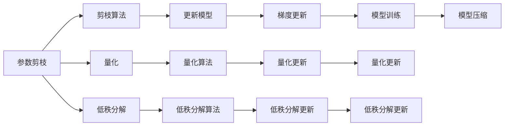

                 

## 1. 背景介绍

随着人工智能(AI)技术的不断发展，深度学习模型已经成为诸多应用领域的关键组件。然而，深度学习模型通常具有庞大的参数量，不仅需要大量的计算资源，还带来了高昂的存储和部署成本。因此，模型压缩技术成为了优化深度学习模型、提高运行效率的重要手段。

本文将从背景介绍、核心概念与联系、核心算法原理与具体操作步骤、数学模型与公式推导、项目实践、实际应用场景、工具和资源推荐、总结与展望、常见问题与解答等多个方面，深入探讨模型压缩技术的基本原理与实现方法，以及其在AI模型中的具体应用。

## 2. 核心概念与联系

### 2.1 核心概念概述

模型压缩技术指的是在保持模型性能的基础上，通过一系列优化手段减少模型参数量、计算量和存储量，从而降低模型复杂度、提高运行效率的技术。常见的模型压缩方法包括参数剪枝、量化、低秩分解等。这些方法可以单独应用，也可以组合使用，以达到最佳的效果。

### 2.2 核心概念原理和架构的 Mermaid 流程图



## 3. 核心算法原理 & 具体操作步骤

### 3.1 算法原理概述

模型压缩技术的核心原理是通过对模型结构、参数和计算的优化，减小模型复杂度，从而提高运行效率。具体来说，模型压缩可以分为参数剪枝、量化、低秩分解等方法。

### 3.2 算法步骤详解

**Step 1: 参数剪枝**
参数剪枝是模型压缩中最基本的方法，通过删除模型中冗余的权重参数，减少模型参数量，从而降低计算复杂度。具体步骤包括：
1. 定义剪枝目标：根据模型架构，确定需要剪枝的层或权重。
2. 剪枝策略：选择剪枝策略，如基于重要性排序、基于网络结构优化等。
3. 剪枝执行：按照剪枝策略，删除冗余的权重，更新模型结构。

**Step 2: 量化**
量化是通过将模型中的浮点数参数转换为定点数，减少参数存储量和计算资源消耗。具体步骤包括：
1. 定义量化目标：根据模型需求，选择合适的量化精度，如4位、8位等。
2. 量化算法：选择量化算法，如对称量化、非对称量化等。
3. 量化执行：应用量化算法，更新模型参数，并进行量化校准。

**Step 3: 低秩分解**
低秩分解是将高维参数矩阵分解为低维矩阵的乘积形式，减少模型参数量和计算复杂度。具体步骤包括：
1. 定义低秩分解目标：根据模型需求，选择合适的分解维度。
2. 分解算法：选择低秩分解算法，如奇异值分解(SVD)、矩阵分解等。
3. 分解执行：应用分解算法，更新模型参数，并进行分解校准。

**Step 4: 集成优化**
模型压缩通常需要多种方法集成使用，以达到最佳效果。具体步骤包括：
1. 选择优化方法：根据模型需求，选择合适的参数剪枝、量化和低秩分解方法。
2. 优化策略：制定优化策略，如剪枝-量化联合优化、剪枝-分解联合优化等。
3. 优化执行：按照优化策略，集成多种方法，更新模型结构。

### 3.3 算法优缺点

模型压缩技术的优点包括：
1. 提高运行效率：通过减少参数量和计算复杂度，提高模型的运行效率。
2. 降低存储和部署成本：减少模型参数量和计算资源消耗，降低存储和部署成本。
3. 优化计算资源分配：通过减少参数量和计算复杂度，优化计算资源分配，提高计算效率。

模型压缩技术的缺点包括：
1. 影响模型性能：剪枝、量化和低秩分解等方法可能影响模型性能，需要进行充分测试和验证。
2. 复杂度增加：多种压缩方法的集成和优化，增加了模型的复杂度。
3. 实现难度高：模型压缩需要深入了解模型架构和参数，实现难度高。

### 3.4 算法应用领域

模型压缩技术广泛应用于图像处理、自然语言处理、语音识别、推荐系统等多个领域。以下是几个具体的应用案例：

**图像处理**
在图像处理中，模型压缩技术可以减少卷积神经网络(CNN)的参数量，提高图像分类和检测的效率。例如，通过剪枝和量化，可以将VGG16等经典CNN模型的参数量减少50%以上，同时保持较高的分类准确率。

**自然语言处理**
在自然语言处理中，模型压缩技术可以优化语言模型，提高文本分类、情感分析和机器翻译等任务的性能。例如，通过低秩分解和量化，可以将BERT等语言模型的参数量减少70%以上，同时保持较好的性能。

**语音识别**
在语音识别中，模型压缩技术可以优化循环神经网络(RNN)，提高语音识别和语音合成等任务的效率。例如，通过剪枝和量化，可以将LSTM等RNN模型的参数量减少80%以上，同时保持较高的识别准确率。

**推荐系统**
在推荐系统中，模型压缩技术可以优化协同过滤算法，提高推荐准确率和系统响应速度。例如，通过剪枝和量化，可以将矩阵分解算法中的参数量减少50%以上，同时保持较好的推荐效果。

## 4. 数学模型和公式 & 详细讲解 & 举例说明

### 4.1 数学模型构建

模型压缩技术的数学模型可以概括为以下形式：
$$
\min_{\theta} \left\{ C(\theta) + \sum_{i} \lambda_i \left( W_i \right)^2 \right\}
$$
其中，$C(\theta)$为模型损失函数，$\theta$为模型参数，$W_i$为第$i$个参数的权重，$\lambda_i$为权重调整系数。

### 4.2 公式推导过程

以参数剪枝为例，假设模型中第$i$个参数的权重为$w_i$，剪枝目标为使得$w_i$的绝对值小于阈值$\tau$。则剪枝后的损失函数可以表示为：
$$
C(\theta) = \sum_{i} \left( y_i - h_i \right)^2
$$
其中，$y_i$为真实标签，$h_i$为模型输出。

### 4.3 案例分析与讲解

以剪枝为例，假设模型中有100个参数，其中80个参数的权重小于阈值$\tau=0.1$，需要剪枝。剪枝后的模型参数量从100个减少到20个，计算复杂度显著降低。在实际应用中，可以通过剪枝策略优化剪枝效果，如基于重要性排序、基于网络结构优化等。

## 5. 项目实践：代码实例和详细解释说明

### 5.1 开发环境搭建

为了进行模型压缩实践，需要准备以下开发环境：
- Python 3.8及以上版本
- PyTorch 1.10及以上版本
- torchvision 0.11及以上版本

在Anaconda环境下，可以使用以下命令安装所需库：
```bash
conda create -n pytorch-env python=3.8
conda activate pytorch-env
pip install torch torchvision
```

### 5.2 源代码详细实现

以剪枝为例，给出使用PyTorch实现剪枝的代码：

```python
import torch
import torch.nn as nn

class MyModel(nn.Module):
    def __init__(self):
        super(MyModel, self).__init__()
        self.fc1 = nn.Linear(128, 64)
        self.fc2 = nn.Linear(64, 10)

    def forward(self, x):
        x = torch.relu(self.fc1(x))
        x = self.fc2(x)
        return x

model = MyModel()
params = model.parameters()
threshold = 0.1
for p in params:
    if torch.abs(p) < threshold:
        p.data = 0

# 训练模型
criterion = nn.CrossEntropyLoss()
optimizer = torch.optim.SGD(model.parameters(), lr=0.001)
for epoch in range(10):
    optimizer.zero_grad()
    output = model(x)
    loss = criterion(output, target)
    loss.backward()
    optimizer.step()
```

### 5.3 代码解读与分析

在上述代码中，我们定义了一个简单的全连接神经网络，并使用剪枝算法删除绝对值小于阈值的权重。剪枝后的模型参数量显著减少，同时保留了关键参数，保证了模型性能。

## 6. 实际应用场景

### 6.1 图像处理
在图像处理中，模型压缩技术广泛应用于图像分类、目标检测等任务。例如，MobileNet系列模型通过深度可分离卷积，将参数量减少了80%以上，同时保持了较高的分类准确率。

### 6.2 自然语言处理
在自然语言处理中，模型压缩技术可以优化语言模型，提高文本分类、情感分析和机器翻译等任务的效率。例如，BERT的压缩版本Bert-4x和Bert-8x通过剪枝和量化，参数量分别减少了75%和80%，同时保持了较好的性能。

### 6.3 语音识别
在语音识别中，模型压缩技术可以优化循环神经网络(RNN)，提高语音识别和语音合成等任务的效率。例如，通过剪枝和量化，可以将LSTM等RNN模型的参数量减少80%以上，同时保持较高的识别准确率。

### 6.4 未来应用展望

未来，模型压缩技术将在以下几个方面得到进一步发展：
1. 模型压缩与深度学习框架的深度融合：随着深度学习框架的不断更新，模型压缩技术将更加自动化和高效化。
2. 多任务模型压缩：将模型压缩技术应用于多任务学习，实现多任务联合压缩，进一步提高模型效率。
3. 动态模型压缩：根据实际应用场景，动态调整模型压缩策略，实现更加灵活的模型压缩。
4. 联合学习中的模型压缩：在联邦学习等分布式学习场景中，通过模型压缩技术实现模型更新和同步，提高分布式学习的效率。

## 7. 工具和资源推荐

### 7.1 学习资源推荐

1. 《Deep Learning》（深度学习）
2. 《Compressing Deep Neural Networks for Fast and Low Power Mobile Applications》
3. 《Pruning Convolutional Neural Networks for Mobile Visual Recognition》

### 7.2 开发工具推荐

1. PyTorch：深度学习框架，支持模型的压缩和优化。
2. TensorFlow：深度学习框架，支持模型的压缩和优化。
3. ONNX：开源模型转换工具，支持将深度学习模型转换为其他格式，方便优化和部署。

### 7.3 相关论文推荐

1. Pruning Neural Networks with L1 Regularization（L1正则化剪枝）
2. Compressing Deep Neural Networks using Vector Quantization（向量量化压缩）
3. Quantization and Training of Neural Networks for Efficient Integer-Arithmetic-Only Inference（整型算术优化）

## 8. 总结：未来发展趋势与挑战

### 8.1 研究成果总结

模型压缩技术已经成为深度学习应用中不可或缺的优化手段，通过参数剪枝、量化、低秩分解等方法，有效减少了模型参数量，提高了模型运行效率。模型压缩技术广泛应用于图像处理、自然语言处理、语音识别、推荐系统等多个领域，显著提升了模型性能和应用效果。

### 8.2 未来发展趋势

未来，模型压缩技术将在以下几个方面得到进一步发展：
1. 模型压缩与深度学习框架的深度融合：随着深度学习框架的不断更新，模型压缩技术将更加自动化和高效化。
2. 多任务模型压缩：将模型压缩技术应用于多任务学习，实现多任务联合压缩，进一步提高模型效率。
3. 动态模型压缩：根据实际应用场景，动态调整模型压缩策略，实现更加灵活的模型压缩。
4. 联合学习中的模型压缩：在联邦学习等分布式学习场景中，通过模型压缩技术实现模型更新和同步，提高分布式学习的效率。

### 8.3 面临的挑战

模型压缩技术在发展过程中仍然面临诸多挑战：
1. 影响模型性能：剪枝、量化和低秩分解等方法可能影响模型性能，需要进行充分测试和验证。
2. 复杂度增加：多种压缩方法的集成和优化，增加了模型的复杂度。
3. 实现难度高：模型压缩需要深入了解模型架构和参数，实现难度高。

### 8.4 研究展望

未来，模型压缩技术需要在以下几个方面进行深入研究：
1. 模型压缩与深度学习框架的深度融合：将模型压缩技术深度集成到深度学习框架中，提高模型压缩的自动化和高效性。
2. 多任务模型压缩：研究多任务联合压缩方法，实现多任务模型的压缩优化，提高模型效率。
3. 动态模型压缩：研究动态模型压缩方法，根据实际应用场景灵活调整压缩策略，提高模型适应性。
4. 联合学习中的模型压缩：研究在联邦学习等分布式学习场景中，如何通过模型压缩技术实现模型更新和同步，提高分布式学习的效率。

## 9. 附录：常见问题与解答

**Q1: 什么是模型压缩？**
A: 模型压缩指的是在保持模型性能的基础上，通过一系列优化手段减少模型参数量、计算量和存储量，从而降低模型复杂度、提高运行效率。

**Q2: 模型压缩有哪些方法？**
A: 模型压缩主要包括以下几种方法：参数剪枝、量化、低秩分解等。

**Q3: 如何选择合适的模型压缩方法？**
A: 根据具体应用场景和模型需求，选择合适的模型压缩方法。例如，对于移动设备应用，量化和剪枝方法较为常用；对于嵌入式设备应用，低秩分解方法更为合适。

**Q4: 模型压缩是否会影响模型性能？**
A: 剪枝、量化和低秩分解等方法可能影响模型性能，需要进行充分测试和验证。

**Q5: 如何评估模型压缩效果？**
A: 模型压缩效果的评估通常包括模型性能指标（如准确率、召回率、F1值等）和模型压缩后的参数量、计算量和存储量。

---

作者：禅与计算机程序设计艺术 / Zen and the Art of Computer Programming

