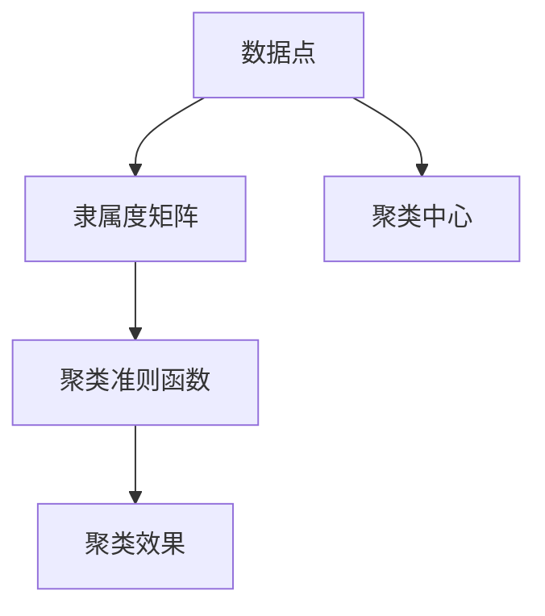

                 

# 模糊聚类算法的研究与实现

## 1. 背景介绍

### 1.1 问题由来

模糊聚类算法（Fuzzy Clustering Algorithm）是一种用于数据分析和模式识别的重要算法，它在许多领域都有广泛的应用，如市场细分、图像识别、生物信息学、信号处理等。相比于传统的硬聚类算法，模糊聚类能够处理数据的不确定性和模糊性，从而提供更精确的聚类结果。随着数据规模的不断扩大和复杂性的增加，模糊聚类算法的研究和实现变得越来越重要。

### 1.2 问题核心关键点

模糊聚类算法的核心在于通过模糊数学中的隶属度函数，使聚类结果具有一定的模糊性，从而更好地适应数据的多样性和不确定性。其核心概念包括：

- **隶属度函数（Membership Function）**：表示每个数据点属于每个簇的程度。
- **中心点（Centroid）**：代表每个簇的中心位置。
- **聚类准则（Clustering Criterion）**：用于衡量聚类效果的好坏，如均方误差、对数似然等。
- **模糊系数（Fuzziness Coefficient）**：控制聚类的模糊程度，值越大表示聚类结果越模糊。

### 1.3 问题研究意义

模糊聚类算法的研究具有重要意义，体现在以下几个方面：

- **提高聚类效果**：模糊聚类能够处理数据的不确定性，提供更准确和细致的聚类结果。
- **适应复杂数据**：模糊聚类能够适应复杂多变的数据分布，提高算法的鲁棒性和泛化能力。
- **优化决策支持**：模糊聚类能够为决策支持系统提供更全面、更可靠的数据分析结果。

本文旨在深入探讨模糊聚类算法的原理与实现，帮助读者更好地理解和应用这一重要的数据分析技术。

## 2. 核心概念与联系

### 2.1 核心概念概述

模糊聚类算法是建立在模糊数学基础之上的聚类方法，其核心思想是将每个数据点模糊地分配到不同的聚类中，而不是硬性地划分。以下是几个核心概念的概述：

- **数据点（Data Point）**：聚类算法处理的基本单元，通常表示为向量或矩阵形式。
- **聚类中心（Cluster Center）**：表示每个簇的中心点，可以是数据点的平均值或其他统计量。
- **隶属度矩阵（Membership Matrix）**：表示每个数据点属于每个聚类的隶属度，矩阵中的每个元素取值范围在0到1之间。
- **聚类准则函数（Clustering Criterion Function）**：用于衡量聚类效果好坏的标准函数。

### 2.2 核心概念原理和架构的 Mermaid 流程图



### 2.3 核心概念联系

模糊聚类算法通过定义隶属度函数，将每个数据点模糊地分配到不同的聚类中，从而更好地适应数据的不确定性和复杂性。其核心联系在于：

- **隶属度函数**：是模糊聚类算法的核心，定义了数据点属于每个簇的程度。
- **聚类中心**：用于表示每个簇的中心位置，是模糊聚类的主要输出之一。
- **聚类准则函数**：用于衡量聚类效果的好坏，是模糊聚类的重要指导指标。

## 3. 核心算法原理 & 具体操作步骤

### 3.1 算法原理概述

模糊聚类算法通常采用基于迭代优化的方式，通过多次迭代更新聚类中心和隶属度矩阵，最终得到一个稳定的聚类结果。其核心步骤如下：

1. **初始化聚类中心**：随机选择若干个数据点作为初始的聚类中心。
2. **计算隶属度矩阵**：根据隶属度函数计算每个数据点属于每个聚类的隶属度。
3. **更新聚类中心**：根据隶属度矩阵和聚类准则函数，更新每个聚类的中心点。
4. **迭代优化**：重复上述步骤，直到聚类中心和隶属度矩阵收敛或达到预设的迭代次数。

### 3.2 算法步骤详解

#### 3.2.1 初始化聚类中心

随机选择若干个数据点作为初始的聚类中心，表示为 $\mu_k$，其中 $k$ 表示聚类编号。

#### 3.2.2 计算隶属度矩阵

根据隶属度函数，计算每个数据点 $x_i$ 属于每个聚类 $C_j$ 的隶属度 $\mu_{ij}$，其中 $i$ 表示数据点编号，$j$ 表示聚类编号。

#### 3.2.3 更新聚类中心

根据隶属度矩阵 $\mu$ 和聚类准则函数 $J$，更新每个聚类的中心点 $\mu_k$。

#### 3.2.4 迭代优化

重复上述步骤，直到聚类中心和隶属度矩阵收敛或达到预设的迭代次数。

### 3.3 算法优缺点

模糊聚类算法具有以下优点：

- **处理数据不确定性**：能够处理数据的不确定性，提供更准确的聚类结果。
- **适应复杂数据**：能够适应复杂多变的数据分布，提高算法的鲁棒性和泛化能力。
- **优化决策支持**：为决策支持系统提供更全面、更可靠的数据分析结果。

同时，模糊聚类算法也存在以下缺点：

- **计算复杂度高**：由于需要多次迭代更新聚类中心和隶属度矩阵，计算复杂度较高。
- **参数选择复杂**：隶属度函数和聚类准则函数的选择较为复杂，需要根据具体问题进行优化。
- **难以处理高维数据**：在高维空间中，数据的稀疏性可能导致聚类效果不佳。

### 3.4 算法应用领域

模糊聚类算法广泛应用于许多领域，包括但不限于：

- **数据挖掘**：用于市场细分、客户分析等，发现数据中的潜在模式和结构。
- **模式识别**：用于图像处理、生物信息学等，识别和分类数据中的模式和特征。
- **信号处理**：用于信号分析、音频处理等，提取和处理信号中的有用信息。
- **机器学习**：用于模型训练、特征提取等，提高机器学习模型的性能和泛化能力。

## 4. 数学模型和公式 & 详细讲解 & 举例说明

### 4.1 数学模型构建

模糊聚类算法的数学模型主要包括以下几个部分：

1. **数据集**：表示为 $X=\{x_i\}_{i=1}^n$，其中 $x_i$ 表示第 $i$ 个数据点。
2. **聚类中心**：表示为 $\mu_k=\{\mu_{ki}\}_{i=1}^n$，其中 $\mu_{ki}$ 表示第 $k$ 个聚类中心的第 $i$ 个元素。
3. **隶属度矩阵**：表示为 $\mu=\{\mu_{ij}\}_{i=1}^n \times \{1,2,\ldots,m\}$，其中 $\mu_{ij}$ 表示第 $i$ 个数据点属于第 $j$ 个聚类的隶属度。

### 4.2 公式推导过程

模糊聚类算法的核心公式包括：

1. **隶属度函数**：
   $$
   \mu_{ij} = \frac{1}{1 + \sum_{k\neq j}\omega_{kj}d(x_i,\mu_k)}
   $$
   其中 $\omega_{kj}$ 表示聚类 $k$ 和聚类 $j$ 之间的权重系数，$d(\cdot,\cdot)$ 表示欧式距离或余弦距离等距离度量。

2. **聚类准则函数**：
   $$
   J(\mu,\mu_k) = \frac{1}{n} \sum_{i=1}^n \sum_{j=1}^m \mu_{ij}^2
   $$
   其中 $J(\cdot,\cdot)$ 表示聚类准则函数，通常使用对数似然函数、均方误差等。

3. **更新聚类中心**：
   $$
   \mu_k = \frac{1}{\sum_{i=1}^n \mu_{ki}} \sum_{i=1}^n \mu_{ki} x_i
   $$

### 4.3 案例分析与讲解

以一个简单的二维数据集为例，假设数据集 $X=\{(1,1),(1,2),(2,1),(2,2)\}$，初始化聚类中心 $\mu_k=(1,1)$ 和 $\mu_k=(2,2)$，采用模糊聚类算法，逐步迭代更新聚类中心和隶属度矩阵，最终得到聚类结果。

## 5. 项目实践：代码实例和详细解释说明

### 5.1 开发环境搭建

为了进行模糊聚类算法的实践，需要安装 Python、NumPy、SciPy 等科学计算库。以下是安装示例：

```bash
pip install numpy scipy matplotlib
```

### 5.2 源代码详细实现

```python
import numpy as np
import matplotlib.pyplot as plt

def fuzzy_clustering(data, k, max_iter=100, tol=1e-6):
    n, m = data.shape
    mu = np.random.rand(k, m)
    prev_mu = np.zeros((k, m))
    iter_count = 0
    
    while np.linalg.norm(mu - prev_mu) > tol and iter_count < max_iter:
        prev_mu = mu.copy()
        for i in range(n):
            dist = np.linalg.norm(data[i,:] - mu, axis=1)
            u = 1 / (1 + dist)
            u /= u.sum()
            mu = np.outer(u, data[i,:])
        iter_count += 1
    
    return mu, u

# 示例数据
data = np.array([[1,1],[1,2],[2,1],[2,2]])

# 聚类个数
k = 2

# 运行算法
mu, u = fuzzy_clustering(data, k)

# 输出聚类中心和隶属度矩阵
print("聚类中心：")
print(mu)
print("隶属度矩阵：")
print(u)

# 可视化聚类结果
plt.scatter(data[:,0], data[:,1], c=u.ravel(), cmap='viridis')
plt.scatter(mu[:,0], mu[:,1], marker='x', s=100, c='red')
plt.show()
```

### 5.3 代码解读与分析

该代码实现了一个简单的模糊聚类算法，用于对二维数据集进行聚类。主要步骤如下：

1. **初始化聚类中心**：随机选择两个聚类中心。
2. **计算隶属度矩阵**：根据欧式距离计算每个数据点属于每个聚类的隶属度。
3. **更新聚类中心**：根据隶属度矩阵计算新的聚类中心。
4. **迭代优化**：重复上述步骤，直到聚类中心收敛或达到预设的迭代次数。

## 6. 实际应用场景

### 6.1 数据挖掘

在数据挖掘领域，模糊聚类算法可以用于市场细分、客户分析等，发现数据中的潜在模式和结构。例如，通过分析客户的消费记录，可以将其分为不同的消费群体，从而提供更有针对性的营销策略。

### 6.2 模式识别

在模式识别领域，模糊聚类算法可以用于图像处理、生物信息学等，识别和分类数据中的模式和特征。例如，在图像处理中，通过模糊聚类算法可以将像素点分为不同的区域，从而提取图像中的重要特征。

### 6.3 信号处理

在信号处理领域，模糊聚类算法可以用于信号分析、音频处理等，提取和处理信号中的有用信息。例如，在音频处理中，通过模糊聚类算法可以识别不同的音调和节拍，从而进行音乐分析。

### 6.4 未来应用展望

随着大数据和人工智能技术的不断发展，模糊聚类算法将在更多领域得到应用，为数据分析和模式识别提供更强大的工具。未来的发展方向包括：

1. **处理高维数据**：随着数据维度的增加，模糊聚类算法需要对高维数据进行处理，以提高聚类效果。
2. **结合深度学习**：将模糊聚类算法与深度学习技术结合，提高算法的自动化和智能性。
3. **优化并行计算**：采用并行计算技术，提高聚类算法的计算效率和可扩展性。
4. **引入先验知识**：结合领域专家的先验知识，优化聚类算法的参数和决策过程。

## 7. 工具和资源推荐

### 7.1 学习资源推荐

为了深入学习模糊聚类算法，推荐以下学习资源：

1. **《机器学习》课程**：斯坦福大学开设的机器学习课程，系统介绍了模糊聚类算法的基本概念和应用。
2. **《数据挖掘》教材**：经典教材《数据挖掘：概念与技术》，详细讲解了模糊聚类算法在数据挖掘中的应用。
3. **在线课程**：Coursera、Udacity 等在线平台提供的机器学习和数据挖掘课程，涵盖模糊聚类算法等多个主题。

### 7.2 开发工具推荐

模糊聚类算法的开发通常使用 Python、R 等编程语言，推荐以下工具：

1. **NumPy**：用于数值计算和数组操作。
2. **SciPy**：用于科学计算和数据分析。
3. **Matplotlib**：用于绘制数据可视化图表。
4. **Scikit-learn**：提供了多种聚类算法，包括模糊聚类算法。

### 7.3 相关论文推荐

以下是几篇经典的模糊聚类算法论文，推荐阅读：

1. **Fuzzy Clustering with Applications to Pattern Recognition**：介绍模糊聚类算法的基本概念和应用。
2. **Fuzzy Clustering and Data Transformations**：探讨不同模糊聚类算法在数据变换中的应用。
3. **Fuzzy C-Means Clustering Algorithm**：详细介绍 Fuzzy C-Means 算法及其优化方法。

## 8. 总结：未来发展趋势与挑战

### 8.1 研究成果总结

模糊聚类算法在数据挖掘、模式识别、信号处理等多个领域得到了广泛应用，提供了更准确、更细致的聚类结果。其主要研究成果包括：

1. **Fuzzy C-Means 算法**：经典的模糊聚类算法，能够处理数据的不确定性，提供更准确的聚类结果。
2. **K-Means 算法的改进**：通过引入模糊数学，提高 K-Means 算法的聚类效果。
3. **层次聚类算法**：将模糊聚类算法与层次聚类算法结合，提供更灵活的聚类方案。

### 8.2 未来发展趋势

未来的模糊聚类算法将朝着以下几个方向发展：

1. **处理高维数据**：随着数据维度的增加，模糊聚类算法需要对高维数据进行处理，以提高聚类效果。
2. **结合深度学习**：将模糊聚类算法与深度学习技术结合，提高算法的自动化和智能性。
3. **优化并行计算**：采用并行计算技术，提高聚类算法的计算效率和可扩展性。
4. **引入先验知识**：结合领域专家的先验知识，优化聚类算法的参数和决策过程。

### 8.3 面临的挑战

模糊聚类算法在应用过程中也面临着一些挑战：

1. **计算复杂度高**：由于需要多次迭代更新聚类中心和隶属度矩阵，计算复杂度较高。
2. **参数选择复杂**：隶属度函数和聚类准则函数的选择较为复杂，需要根据具体问题进行优化。
3. **难以处理高维数据**：在高维空间中，数据的稀疏性可能导致聚类效果不佳。

### 8.4 研究展望

未来的模糊聚类算法研究将着重于以下几个方面：

1. **优化算法效率**：提高算法的计算效率和可扩展性，支持大规模数据处理。
2. **引入先验知识**：结合领域专家的先验知识，优化聚类算法的参数和决策过程。
3. **结合深度学习**：将模糊聚类算法与深度学习技术结合，提高算法的自动化和智能性。
4. **处理高维数据**：探索有效的处理高维数据的模糊聚类算法，提高算法的鲁棒性和泛化能力。

## 9. 附录：常见问题与解答

### Q1：模糊聚类算法是否适用于所有数据集？

A: 模糊聚类算法适用于大部分数据集，特别是数据存在不确定性和模糊性的情况。但对于高维数据或数据分布较为复杂的情况，可能存在聚类效果不佳的问题。

### Q2：模糊聚类算法在处理高维数据时需要注意什么？

A: 高维数据中的稀疏性可能导致聚类效果不佳，因此在处理高维数据时需要注意以下几个方面：

1. **数据降维**：通过主成分分析（PCA）等方法对数据进行降维，提高聚类效果。
2. **采用合适的距离度量**：选择合适的距离度量，如欧氏距离、余弦距离等，提高聚类效果。
3. **参数调整**：根据数据特点调整聚类参数，如隶属度函数、聚类准则函数等。

### Q3：模糊聚类算法在实际应用中需要注意什么？

A: 在实际应用中，需要注意以下几个方面：

1. **参数选择**：选择合适的隶属度函数、聚类准则函数等参数，以提高聚类效果。
2. **数据预处理**：对数据进行预处理，如归一化、标准化等，提高聚类效果。
3. **算法优化**：优化算法实现，提高计算效率和可扩展性。

### Q4：模糊聚类算法在处理复杂数据分布时需要注意什么？

A: 在处理复杂数据分布时，需要注意以下几个方面：

1. **数据采样**：通过合理的数据采样，提高聚类效果。
2. **模型选择**：选择适合的模糊聚类模型，如 Fuzzy C-Means、K-Means 等，提高聚类效果。
3. **参数调整**：根据数据特点调整聚类参数，如模糊系数等。

### Q5：模糊聚类算法在实际应用中如何评估聚类效果？

A: 模糊聚类算法的聚类效果可以通过以下指标进行评估：

1. **轮廓系数（Silhouette Coefficient）**：衡量数据点与其所属簇的紧密度，值越大表示聚类效果越好。
2. **对数似然函数（Log-Likelihood）**：衡量聚类模型的对数似然，值越大表示聚类效果越好。
3. **F-测量指标（F-Measure）**：衡量聚类结果的精确度和召回率，值越大表示聚类效果越好。

---

作者：禅与计算机程序设计艺术 / Zen and the Art of Computer Programming

