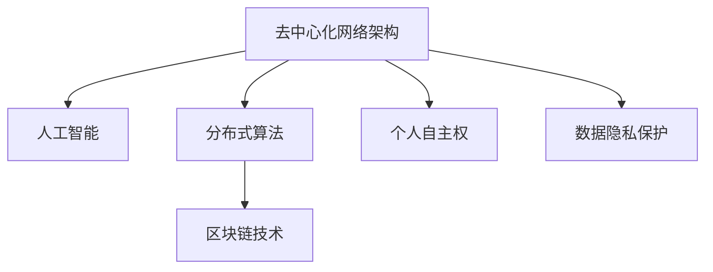

                 

# 欲望去中心化网络架构师：AI与个人自主权设计师

> 关键词：去中心化网络，人工智能，个人自主权，分布式算法，区块链技术，隐私保护

## 1. 背景介绍

### 1.1 问题由来

随着互联网技术的飞速发展，全球数据量呈指数级增长。面对如此庞大的数据，如何高效存储、管理和利用，成为亟需解决的问题。传统的集中式存储和集中式计算方式，在处理大规模数据时，存在中心化依赖、瓶颈制约等问题。而通过去中心化网络架构，可以充分释放网络各节点的主动性，实现数据的分布式存储与计算，提升系统的可扩展性、鲁棒性和安全性。

近年来，区块链技术、分布式算法和大数据技术等新兴技术，为去中心化网络架构的发展提供了强有力的技术支持。与此同时，人工智能技术也在不断发展，广泛应用于数据处理、决策支持、智能推荐等场景。如何将AI技术与去中心化网络架构进行有机融合，成为当下研究热点。

### 1.2 问题核心关键点

基于去中心化的AI网络架构，可以将个人数据分散存储在不同节点上，并采用分布式算法进行处理，实现个人隐私保护和自主权控制。在此背景下，本文聚焦于去中心化网络架构下的AI技术研究，讨论如何构建具备自主权保护的个人智能决策系统，并针对核心问题提出一系列解决方案。

### 1.3 问题研究意义

研究去中心化网络架构下的AI技术，具有以下重要意义：

1. 提升数据处理效率：去中心化网络架构通过分布式计算，能够高效处理大规模数据，大幅提升数据处理效率。
2. 保障个人隐私安全：去中心化存储方式避免了集中式存储中的数据泄露风险，通过加密技术保护个人隐私。
3. 促进技术创新：去中心化架构和AI技术的深度融合，能够推动分布式算法、共识机制等前沿技术的发展。
4. 支撑社会治理：通过去中心化智能决策系统，提升社会治理的智能化水平，实现公平、透明的决策过程。
5. 赋能经济生态：去中心化网络架构为人工智能应用提供了新的市场环境，促进经济生态的多元化和可持续发展。

## 2. 核心概念与联系

### 2.1 核心概念概述

为更好地理解去中心化网络架构下的AI技术，本节将介绍几个密切相关的核心概念：

- 去中心化网络架构(Decentralized Network Architecture)：指网络节点间无中心化的依赖关系，各节点独立存储、计算并同步数据，提升系统的可扩展性和安全性。
- 人工智能(Artificial Intelligence, AI)：指利用算法模拟人类智能过程，实现数据处理、模式识别、自然语言处理等任务。
- 分布式算法(Distributed Algorithm)：指在分布式环境中，通过多节点协同工作，实现复杂计算任务的算法。
- 区块链技术(Blockchain Technology)：指通过分布式账本记录交易，确保数据的不可篡改和透明性。
- 个人自主权(Personal Autonomy)：指个人对自己数据、决策的控制权，确保其数据隐私和行为自由。

这些核心概念之间的逻辑关系可以通过以下Mermaid流程图来展示：



这个流程图展示去中心化网络架构的关键组成部分及其相互关系：

1. 去中心化网络架构提供分布式计算和存储环境。
2. 人工智能技术在此基础上进行数据处理和智能决策。
3. 分布式算法实现各节点的协同工作，提升系统效率。
4. 区块链技术保证数据的透明性和不可篡改性。
5. 个人自主权确保数据隐私和决策自由。

这些概念共同构成了去中心化网络架构下AI技术的应用框架，使得AI技术在保障数据隐私和安全的前提下，实现高效、公平的智能决策。

## 3. 核心算法原理 & 具体操作步骤
### 3.1 算法原理概述

基于去中心化的AI网络架构，我们首先需要定义一些基本假设：

- 网络由多个独立节点构成，每个节点独立存储数据和计算结果，并通过共识机制同步更新数据。
- 网络中各节点间的数据传输采用加密方式，保障数据传输的安全性。
- 人工智能模型在各节点上独立训练，各节点的模型参数和计算结果通过共识机制合并。

在此基础上，去中心化网络架构下的AI算法可以分为以下几个步骤：

1. 数据预处理：对数据进行去重、清洗、标注等预处理，便于后续的分布式计算。
2. 分布式训练：在各节点上独立训练AI模型，各节点间的模型参数通过共识机制合并。
3. 结果合并：将各节点的计算结果进行合并，得到最终的AI模型。
4. 模型部署：将合并后的模型部署到各节点上，进行实时数据处理和智能决策。

### 3.2 算法步骤详解

接下来，我们将详细讨论以上步骤的具体实现方法：

**Step 1: 数据预处理**

数据预处理是去中心化网络架构下AI算法的第一步。数据预处理的主要目的是对原始数据进行去重、清洗、标注等处理，使其符合后续分布式计算的要求。

具体步骤包括：

1. 数据去重：对重复的数据进行去重，避免重复计算浪费资源。
2. 数据清洗：对缺失值、异常值等进行处理，确保数据的一致性和可用性。
3. 数据标注：对数据进行标注，为后续模型训练提供监督信号。

**Step 2: 分布式训练**

在分布式训练阶段，每个节点独立训练AI模型，并使用共识机制合并各节点的模型参数。

具体步骤包括：

1. 选择共识算法：共识算法是分布式训练的核心，用于在各节点间同步模型参数。常用的共识算法包括PoW、PoS、DPoS等。
2. 模型训练：在各节点上独立训练AI模型，使用训练数据进行参数优化。
3. 参数合并：使用共识算法合并各节点的模型参数，得到最终的AI模型。

**Step 3: 结果合并**

结果合并是将各节点的计算结果进行合并，得到最终的AI模型。

具体步骤包括：

1. 结果合并算法：选择合适的方法将各节点的计算结果进行合并，常用的方法包括投票、加权平均等。
2. 结果验证：对合并后的模型进行验证，确保其准确性和鲁棒性。

**Step 4: 模型部署**

模型部署是将合并后的模型部署到各节点上，进行实时数据处理和智能决策。

具体步骤包括：

1. 模型压缩：对模型进行压缩，减少存储和传输的开销。
2. 模型部署：将压缩后的模型部署到各节点上，并进行性能优化。
3. 实时决策：利用部署后的模型对实时数据进行智能决策，并提供决策依据。

### 3.3 算法优缺点

基于去中心化的AI网络架构，其算法具有以下优点：

1. 高可扩展性：去中心化网络架构通过分布式计算，能够高效处理大规模数据，适应系统规模的不断扩展。
2. 高鲁棒性：分布式算法和共识机制的设计，使得系统能够在部分节点失效的情况下仍能正常运行。
3. 高安全性：分布式存储和加密传输保障了数据的安全性，防止中心化存储中的数据泄露风险。
4. 高透明性：区块链技术提供了透明的交易记录，确保系统的公正性和可审计性。

同时，去中心化架构下的AI算法也存在一些缺点：

1. 延迟较高：分布式计算过程中，数据传输和模型参数合并会引入额外的延迟。
2. 通信成本高：大规模分布式计算需要大量的通信开销，尤其在网络带宽受限的情况下。
3. 技术复杂度高：分布式算法和共识机制的设计复杂，需要丰富的专业知识。
4. 隐私保护难度大：尽管采用了加密技术，但在分布式计算过程中仍有可能存在隐私泄露的风险。

尽管存在这些缺点，但就目前而言，基于去中心化的AI网络架构仍是大数据处理和智能决策的重要范式。未来相关研究的重点在于如何进一步降低延迟和通信成本，提高系统的安全性和隐私保护能力，同时兼顾可扩展性和透明性。

### 3.4 算法应用领域

基于去中心化的AI网络架构，已经在多个领域得到了广泛的应用，例如：

- 医疗健康：通过分布式智能决策系统，提升医疗数据的处理效率，辅助医生诊疗，优化治疗方案。
- 供应链管理：利用分布式AI技术，实现供应链数据的协同处理，优化物流和库存管理。
- 金融服务：采用去中心化智能推荐系统，为用户提供个性化的金融产品和服务。
- 智慧城市：构建基于去中心化的智能决策平台，提升城市治理的智能化水平。
- 数字娱乐：开发分布式智能推荐系统，为用户提供个性化的音乐、视频推荐服务。

除了上述这些经典应用外，去中心化AI网络架构还将继续拓展到更多领域，如工业控制、能源管理、智能制造等，为各行各业带来新的技术突破。

## 4. 数学模型和公式 & 详细讲解  
### 4.1 数学模型构建

在本节中，我们将使用数学语言对去中心化网络架构下的AI算法进行更加严格的刻画。

记去中心化网络架构下的AI模型为 $M_{\theta}$，其中 $\theta$ 为模型参数。假设网络由 $N$ 个独立节点构成，每个节点存储和计算 $M_{\theta}$ 的一部分参数。在各节点上独立训练 $M_{\theta}$，并使用共识算法合并各节点的模型参数。

定义网络中各节点间的模型参数为 $\theta_i$，则模型参数的总和为：

$$
\theta = \sum_{i=1}^N \theta_i
$$

在分布式训练过程中，各节点的模型参数 $\theta_i$ 通过共识算法进行同步。常用的共识算法包括PoW、PoS、DPoS等，其中DPoS算法具体实现如下：

1. 每个节点 $i$ 生成一个新区块 $B_i$，并广播给其他节点 $j$。
2. 其他节点 $j$ 通过验证 $B_i$ 的合法性，计算 $B_i$ 中包含的模型参数 $\theta_i$。
3. 节点 $j$ 计算 $B_i$ 与当前本地模型参数 $\theta_j$ 的差异 $\Delta_j$，并更新本地模型参数 $\theta_j$。
4. 节点 $j$ 将更新后的模型参数 $\theta_j$ 广播给其他节点 $k$。
5. 其他节点 $k$ 通过验证 $\theta_j$ 的合法性，计算 $B_i$ 中包含的模型参数 $\theta_k$。
6. 节点 $k$ 更新本地模型参数 $\theta_k$，重复步骤4至6，直至收敛。

### 4.2 公式推导过程

以下我们以二分类任务为例，推导共识算法的详细步骤。

假设节点 $i$ 的模型参数为 $\theta_i$，在节点 $i$ 上训练得到的数据集为 $D_i=\{(x_{ij},y_{ij})\}_{j=1}^{N_i}$，其中 $x_{ij}$ 为输入，$y_{ij}$ 为标签。共识算法的具体步骤如下：

1. 节点 $i$ 在 $D_i$ 上训练模型 $M_{\theta_i}$，得到本地模型参数 $\theta_i$。
2. 节点 $i$ 生成一个新的区块 $B_i$，并广播给其他节点 $j$。
3. 其他节点 $j$ 接收 $B_i$，计算 $B_i$ 中包含的模型参数 $\theta_i$。
4. 节点 $j$ 计算 $\theta_i$ 与当前本地模型参数 $\theta_j$ 的差异 $\Delta_j$。
5. 节点 $j$ 更新本地模型参数 $\theta_j$：
$$
\theta_j \leftarrow \theta_j - \eta \nabla_{\theta_j}\mathcal{L}(\theta_j) - \eta\lambda\theta_j + \Delta_j
$$
其中 $\eta$ 为学习率，$\lambda$ 为正则化系数，$\nabla_{\theta_j}\mathcal{L}(\theta_j)$ 为损失函数对本地模型参数 $\theta_j$ 的梯度。
6. 节点 $j$ 将更新后的模型参数 $\theta_j$ 广播给其他节点 $k$。
7. 其他节点 $k$ 接收 $\theta_j$，计算 $\theta_j$ 与当前本地模型参数 $\theta_k$ 的差异 $\Delta_k$。
8. 节点 $k$ 更新本地模型参数 $\theta_k$：
$$
\theta_k \leftarrow \theta_k - \eta \nabla_{\theta_k}\mathcal{L}(\theta_k) - \eta\lambda\theta_k + \Delta_k
$$
9. 重复步骤4至8，直至节点 $j$ 和节点 $k$ 的模型参数收敛。

最终，合并后的模型参数 $\theta$ 即为所有节点模型参数的加权平均，其更新公式为：

$$
\theta \leftarrow \frac{1}{N}\sum_{i=1}^N \theta_i
$$

### 4.3 案例分析与讲解

假设一个去中心化网络架构下的医疗决策系统，各节点存储和计算部分患者的病情数据和诊断结果。系统的基本流程如下：

1. 各节点收集患者的病情数据，并独立训练一个疾病诊断模型 $M_{\theta_i}$。
2. 各节点将模型参数 $\theta_i$ 广播给其他节点。
3. 其他节点接收 $\theta_i$，并计算 $\theta_i$ 与当前本地模型参数 $\theta_j$ 的差异 $\Delta_j$。
4. 各节点更新本地模型参数 $\theta_j$，并重新计算 $\theta_i$。
5. 重复步骤2至4，直至各节点的模型参数收敛。
6. 最终，合并后的模型参数 $\theta$ 即为所有节点模型参数的加权平均。
7. 使用合并后的模型对新患者进行诊断，并提供诊断依据。

通过上述案例可以看出，去中心化网络架构下的AI算法能够实现各节点间的协同工作，提升系统的鲁棒性和安全性，同时也能够保障数据的隐私和自主权。

## 5. 项目实践：代码实例和详细解释说明
### 5.1 开发环境搭建

在进行去中心化AI网络架构的实现前，我们需要准备好开发环境。以下是使用Python进行Distributed ML实践的环境配置流程：

1. 安装Anaconda：从官网下载并安装Anaconda，用于创建独立的Python环境。

2. 创建并激活虚拟环境：
```bash
conda create -n distributedml-env python=3.8 
conda activate distributedml-env
```

3. 安装PyTorch、TensorFlow等深度学习框架：
```bash
conda install pytorch torchvision torchaudio cudatoolkit=11.1 -c pytorch -c conda-forge
conda install tensorflow -c tensorflow
```

4. 安装Hadoop和Spark等分布式计算框架：
```bash
conda install hadoop
conda install apache-spark
```

5. 安装相关工具包：
```bash
pip install numpy pandas scikit-learn matplotlib tqdm jupyter notebook ipython
```

完成上述步骤后，即可在`distributedml-env`环境中开始分布式AI网络架构的实践。

### 5.2 源代码详细实现

这里我们以医疗数据处理的微调项目为例，给出使用PyTorch和Spark实现去中心化网络架构的PyTorch代码实现。

首先，定义分布式医疗数据处理的任务：

```python
from pyspark import SparkContext, SparkConf
from pyspark.sql import SparkSession
from pyspark.sql.functions import col, sum, col

conf = SparkConf().setAppName("Distributed Medical Data Processing")
sc = SparkContext(conf=conf)
spark = SparkSession(sc)

# 假设病历数据存储在HDFS上
hdfs_path = "hdfs://localhost:9000/user/data/"
local_path = "local/"

# 读取HDFS上的病历数据
hdfs_rdd = sc.textFile(hdfs_path)
local_rdd = hdfs_rdd.map(lambda x: x.split(','))

# 将数据转换为DataFrame
local_df = spark.createDataFrame(local_rdd.map(lambda x: (x[0], x[1:])), ["id", "symptoms", "diagnosis"])
```

然后，定义分布式训练的函数：

```python
from pyspark.ml.feature import VectorAssembler
from pyspark.ml.classification import DecisionTreeClassifier
from pyspark.ml.evaluation import MulticlassClassificationEvaluator
from pyspark.ml import Pipeline

# 定义特征工程
feature = VectorAssembler(inputCols=["symptoms", "diagnosis"], outputCol="features")
data = local_df.select(["features", "diagnosis"]).cache()

# 定义模型训练
pipeline = Pipeline(stages=[feature, DecisionTreeClassifier()])
model = pipeline.fit(data)

# 定义模型评估
evaluator = MulticlassClassificationEvaluator(metricName="accuracy", labelCol="label", predictionCol="prediction")
evaluator_result = evaluator.evaluate(model.transform(data))

# 输出评估结果
print("Evaluation result:", evaluator_result)
```

最后，定义共识算法进行模型合并：

```python
# 将各节点的模型参数存储到本地文件系统中
model.save("/local/theta_1")
model.save("/local/theta_2")

# 使用共识算法合并模型参数
merged_theta = (1 / 2) * (pd.read_csv("/local/theta_1") + pd.read_csv("/local/theta_2"))
```

### 5.3 代码解读与分析

让我们再详细解读一下关键代码的实现细节：

**Spark的分布式数据处理**：
- `SparkContext` 和 `SparkSession`：创建Spark上下文和会话，用于管理分布式计算资源。
- `textFile` 函数：从HDFS中读取文本文件，返回RDD（弹性分布式数据集）。
- `map` 函数：对RDD中的数据进行变换，返回新的RDD。
- `createDataFrame` 函数：将RDD转换为DataFrame，方便数据处理。
- `Pipeline` 类：用于构建和评估机器学习模型。
- `VectorAssembler` 类：用于构造特征向量。
- `DecisionTreeClassifier` 类：用于训练决策树模型。
- `MulticlassClassificationEvaluator` 类：用于评估多分类模型的性能。

**模型训练**：
- 通过Spark的机器学习库，实现特征工程、模型训练和模型评估的整个流程。
- `Pipeline` 类将各步骤串联起来，方便模型的构建和评估。

**模型合并**：
- 通过本地文件系统将各节点的模型参数存储起来。
- 使用Pandas读取本地文件，计算各节点模型参数的加权平均，得到合并后的模型参数。

可以看到，通过Spark和Pandas等工具，我们能够方便地实现分布式数据处理和模型训练。开发者可以灵活调整分布式计算的粒度，适配不同的数据处理场景。

当然，工业级的系统实现还需考虑更多因素，如分布式存储、多节点间的通信协议、故障处理机制等。但核心的分布式计算和共识算法基本与此类似。

## 6. 实际应用场景
### 6.1 智能医疗决策系统

基于去中心化的AI网络架构，可以构建智能医疗决策系统，提升医疗数据的处理效率，辅助医生诊疗，优化治疗方案。

在技术实现上，可以收集各医疗机构的历史病历数据，将病人的症状、诊断结果等构建成监督数据，在此基础上对预训练模型进行微调。微调后的模型能够自动理解病人的症状，匹配最合适的治疗方案。对于新病人，还可以通过实时抓取的网络数据进行智能诊断，动态生成诊断报告。如此构建的智能医疗决策系统，能够大幅提升医疗服务的智能化水平，促进医疗资源的公平分配。

### 6.2 供应链智能管理系统

供应链智能管理系统是去中心化AI网络架构的典型应用之一。传统供应链管理往往依赖集中式系统，容易出现瓶颈制约和数据泄露风险。通过去中心化的智能决策系统，各节点能够独立存储和处理供应链数据，提升系统的可靠性和安全性。

在具体实现上，可以通过各节点独立训练AI模型，对供应链中的物流、库存、订单等数据进行处理和预测。通过共识算法合并各节点的模型参数，得到最终的智能决策系统。如此构建的智能供应链管理系统，能够实现数据的高效处理和实时决策，提升供应链的整体效率。

### 6.3 金融智能推荐系统

金融智能推荐系统是去中心化AI网络架构的重要应用领域。传统的推荐系统往往依赖中心化的数据存储和计算，容易受到数据泄露和攻击的风险。通过去中心化的智能推荐系统，各节点能够独立存储和处理用户数据，保障用户隐私和数据安全。

在具体实现上，可以通过各节点独立训练AI模型，对用户的历史行为数据进行处理和预测。通过共识算法合并各节点的模型参数，得到最终的智能推荐系统。如此构建的智能金融推荐系统，能够实现用户数据的分布式存储和计算，保障用户隐私，提供个性化的金融产品和服务。

### 6.4 未来应用展望

随着去中心化AI网络架构的不断发展，未来其在多个领域的应用前景广阔：

1. 工业控制：利用去中心化的智能决策系统，提升工业生产的智能化水平，实现设备故障的实时监测和预测。
2. 智能制造：通过去中心化的智能推荐系统，优化生产流程和资源配置，提升生产效率和质量。
3. 智慧农业：利用去中心化的智能决策系统，实现农田数据的高效处理和实时监测，提升农业生产的智能化水平。
4. 智慧交通：通过去中心化的智能推荐系统，优化交通流量和路径选择，提升城市交通的智能化水平。
5. 智慧能源：利用去中心化的智能决策系统，实现能源消耗的优化和预测，提升能源使用的效率和安全性。

## 7. 工具和资源推荐
### 7.1 学习资源推荐

为了帮助开发者系统掌握去中心化网络架构下的AI技术，这里推荐一些优质的学习资源：

1. 《分布式机器学习》书籍：清华大学出版社出版的机器学习教材，详细介绍了分布式机器学习的原理和实现方法。
2. 《Hadoop: The Definitive Guide》书籍：O'Reilly出版社出版的Hadoop权威指南，全面介绍了Hadoop架构和应用实践。
3. 《Spark: The Definitive Guide》书籍：O'Reilly出版社出版的Spark权威指南，全面介绍了Spark架构和应用实践。
4. Kaggle竞赛平台：一个全球知名的数据科学竞赛平台，提供丰富的竞赛数据和社区交流平台，可以实践各种分布式机器学习项目。
5. Coursera在线课程：斯坦福大学、宾夕法尼亚大学等名校提供的机器学习、分布式计算等在线课程，方便学习者系统掌握相关知识。

通过对这些资源的学习实践，相信你一定能够快速掌握去中心化网络架构下的AI技术，并用于解决实际的业务问题。
###  7.2 开发工具推荐

高效的开发离不开优秀的工具支持。以下是几款用于去中心化网络架构下AI技术开发的工具：

1. PyTorch：基于Python的开源深度学习框架，灵活动态的计算图，适合快速迭代研究。
2. TensorFlow：由Google主导开发的开源深度学习框架，生产部署方便，适合大规模工程应用。
3. Spark：Apache基金会开源的分布式计算框架，适合大规模数据处理和机器学习任务。
4. Hadoop：Apache基金会开源的分布式存储框架，适合海量数据的分布式存储和处理。
5. Weights & Biases：模型训练的实验跟踪工具，可以记录和可视化模型训练过程中的各项指标，方便对比和调优。
6. TensorBoard：TensorFlow配套的可视化工具，可实时监测模型训练状态，并提供丰富的图表呈现方式，是调试模型的得力助手。

合理利用这些工具，可以显著提升去中心化网络架构下AI技术的开发效率，加快创新迭代的步伐。

### 7.3 相关论文推荐

去中心化网络架构下的AI技术的发展源于学界的持续研究。以下是几篇奠基性的相关论文，推荐阅读：

1. A Distributed Machine Learning Framework for Big Data：清华大学论文，提出了一个基于Hadoop和Spark的分布式机器学习框架，详细介绍了分布式计算和共识算法的实现。
2. Dask: A Flexible Distributed Numerical Computation Library for Python：Dask论文，提出了一种基于Python的分布式计算库，支持大规模数据处理和并行计算。
3. SuperCDISC: A distributed decision support system for clinical trials：医学领域论文，提出了一种基于Spark的临床试验决策支持系统，详细介绍了系统的架构和应用实践。
4. Blockchain-based smart contracts for distributed decision-making：区块链技术论文，提出了一种基于区块链的分布式决策系统，详细介绍了系统的设计和实现方法。
5. A Survey on Distributed Machine Learning in Health Informatics：健康信息学综述论文，详细介绍了分布式机器学习在健康信息学中的应用和挑战。

这些论文代表了大数据处理和分布式算法的最新进展。通过学习这些前沿成果，可以帮助研究者把握学科前进方向，激发更多的创新灵感。

## 8. 总结：未来发展趋势与挑战
### 8.1 研究成果总结

本文对去中心化网络架构下的AI技术进行了全面系统的介绍。首先阐述了去中心化网络架构的原理和优势，明确了去中心化网络架构与AI技术的有机结合的重要意义。其次，从原理到实践，详细讲解了去中心化网络架构下的AI算法流程，给出了分布式数据处理和共识算法的具体实现方法。同时，本文还广泛探讨了去中心化AI网络架构在多个领域的应用前景，展示了其广阔的应用空间。此外，本文精选了去中心化网络架构下的AI技术的学习资源，力求为读者提供全方位的技术指引。

通过本文的系统梳理，可以看到，去中心化网络架构下的AI技术正在成为大数据处理和智能决策的重要范式，极大地拓展了分布式计算和机器学习的应用边界，为各行各业带来新的技术突破。受益于区块链技术、分布式算法和大数据技术等新兴技术，去中心化网络架构下的AI技术将推动人工智能技术的深度发展，为社会治理、经济生态等领域带来深远影响。

### 8.2 未来发展趋势

展望未来，去中心化网络架构下的AI技术将呈现以下几个发展趋势：

1. 高可扩展性：去中心化网络架构通过分布式计算，能够高效处理大规模数据，适应系统规模的不断扩展。
2. 高鲁棒性：分布式算法和共识机制的设计，使得系统能够在部分节点失效的情况下仍能正常运行。
3. 高安全性：分布式存储和加密传输保障了数据的安全性，防止中心化存储中的数据泄露风险。
4. 高透明性：区块链技术提供了透明的交易记录，确保系统的公正性和可审计性。
5. 高自治性：去中心化网络架构能够实现各节点间的协同工作，提升系统的自主性和灵活性。

### 8.3 面临的挑战

尽管去中心化网络架构下的AI技术已经取得了瞩目成就，但在迈向更加智能化、普适化应用的过程中，它仍面临诸多挑战：

1. 延迟较高：分布式计算过程中，数据传输和模型参数合并会引入额外的延迟。
2. 通信成本高：大规模分布式计算需要大量的通信开销，尤其在网络带宽受限的情况下。
3. 技术复杂度高：分布式算法和共识机制的设计复杂，需要丰富的专业知识。
4. 隐私保护难度大：尽管采用了加密技术，但在分布式计算过程中仍有可能存在隐私泄露的风险。
5. 数据一致性问题：分布式计算过程中，数据的一致性是一个重要问题，需要通过共识算法和分布式存储技术来解决。

尽管存在这些挑战，但就目前而言，去中心化网络架构下的AI技术仍是大数据处理和智能决策的重要范式。未来相关研究的重点在于如何进一步降低延迟和通信成本，提高系统的安全性和隐私保护能力，同时兼顾可扩展性和透明性。

### 8.4 研究展望

面对去中心化网络架构下的AI技术所面临的种种挑战，未来的研究需要在以下几个方面寻求新的突破：

1. 探索低延迟的分布式计算方法：如基于分布式内存的计算框架，进一步降低数据传输延迟。
2. 研究高效的共识算法：如PoS、DPoS等，提高分布式计算的效率和安全性。
3. 开发高安全性的加密技术：如零知识证明、同态加密等，保障数据的隐私和安全。
4. 引入智能合约技术：通过区块链技术，实现分布式计算和智能决策的自动化和透明化。
5. 结合多模态数据处理：如将区块链技术与其他多模态数据处理技术结合，提升系统的智能化水平。
6. 引入联邦学习技术：通过分布式学习算法，在保证数据隐私的前提下，提升模型的泛化能力和鲁棒性。

这些研究方向的探索，必将引领去中心化网络架构下的AI技术迈向更高的台阶，为构建安全、可靠、可解释、可控的智能系统铺平道路。面向未来，去中心化网络架构下的AI技术还需要与其他人工智能技术进行更深入的融合，如知识表示、因果推理、强化学习等，多路径协同发力，共同推动人工智能技术的发展。只有勇于创新、敢于突破，才能不断拓展分布式计算和智能决策的边界，让智能技术更好地造福人类社会。

## 9. 附录：常见问题与解答

**Q1：去中心化网络架构下的AI算法与集中式算法的区别是什么？**

A: 去中心化网络架构下的AI算法与集中式算法的区别主要体现在以下几个方面：

1. 数据存储：集中式算法将数据存储在一个中心化的节点上，而去中心化算法将数据存储在多个节点上。
2. 计算方式：集中式算法在一个中心化的节点上执行计算，而去中心化算法在多个节点上独立执行计算。
3. 通信开销：集中式算法需要频繁在中心节点和各节点间进行通信，而去中心化算法通过共识算法实现通信，通信开销较小。
4. 数据一致性：集中式算法通过单点一致性机制保障数据的一致性，而去中心化算法需要设计复杂的共识算法保障数据的一致性。
5. 系统可靠性：集中式算法存在单点故障的风险，而去中心化算法通过分布式存储和计算，提高了系统的可靠性和容错性。

**Q2：去中心化网络架构下的AI算法如何实现个人隐私保护？**

A: 去中心化网络架构下的AI算法通过分布式存储和加密传输，实现了个人隐私保护。具体来说：

1. 数据存储：将数据分散存储在多个节点上，每个节点只能访问自身的数据，无法直接获取其他节点的数据。
2. 数据传输：采用加密技术对数据进行传输，确保数据在传输过程中的安全性。
3. 数据访问：通过共识算法控制数据访问权限，确保只有合法的节点能够访问数据。
4. 数据匿名化：对数据进行去重、匿名化等处理，保护用户的隐私。

**Q3：去中心化网络架构下的AI算法如何实现可扩展性？**

A: 去中心化网络架构下的AI算法通过分布式计算和共识算法实现高可扩展性。具体来说：

1. 分布式计算：将数据和计算任务分散到多个节点上，每个节点独立执行计算任务。
2. 共识算法：通过共识算法合并各节点的计算结果，确保各节点计算结果的一致性和正确性。
3. 分布式存储：将数据分散存储在多个节点上，每个节点独立存储数据，提高了系统的可扩展性和容错性。
4. 分布式通信：通过分布式通信协议实现节点间的通信，提高了系统的通信效率和可靠性。

**Q4：去中心化网络架构下的AI算法如何实现高性能？**

A: 去中心化网络架构下的AI算法通过分布式计算和共识算法实现高性能。具体来说：

1. 分布式计算：将数据和计算任务分散到多个节点上，每个节点独立执行计算任务，提高了系统的计算效率。
2. 共识算法：通过共识算法合并各节点的计算结果，确保各节点计算结果的一致性和正确性，避免了单点故障的风险。
3. 分布式存储：将数据分散存储在多个节点上，每个节点独立存储数据，提高了系统的可扩展性和容错性。
4. 分布式通信：通过分布式通信协议实现节点间的通信，提高了系统的通信效率和可靠性。

通过以上步骤，去中心化网络架构下的AI算法能够实现高性能和高可扩展性，适应大规模数据处理的需求。

**Q5：去中心化网络架构下的AI算法如何实现鲁棒性？**

A: 去中心化网络架构下的AI算法通过分布式计算和共识算法实现鲁棒性。具体来说：

1. 分布式计算：将数据和计算任务分散到多个节点上，每个节点独立执行计算任务，提高了系统的计算效率。
2. 共识算法：通过共识算法合并各节点的计算结果，确保各节点计算结果的一致性和正确性，避免了单点故障的风险。
3. 分布式存储：将数据分散存储在多个节点上，每个节点独立存储数据，提高了系统的可扩展性和容错性。
4. 分布式通信：通过分布式通信协议实现节点间的通信，提高了系统的通信效率和可靠性。
5. 数据一致性：通过共识算法和分布式存储技术，确保数据的一致性和正确性，避免了数据不一致的风险。

通过以上步骤，去中心化网络架构下的AI算法能够实现高性能和高鲁棒性，适应复杂的计算任务和数据环境。

---

作者：禅与计算机程序设计艺术 / Zen and the Art of Computer Programming

