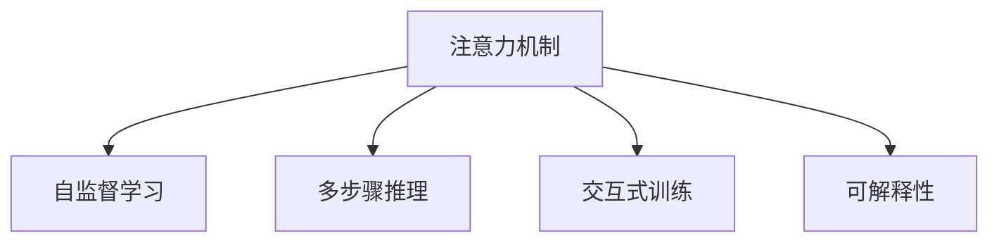

                 

## 1. 背景介绍

### 1.1 问题由来
现代信息社会的快速发展，带来了海量的数据和信息。在如此复杂的信息环境中，人类认知系统的能力已不足以应对。特别是对于信息筛选、知识管理、创意发想等认知任务，仅依靠人工处理已远远不够。为此，人工智能领域掀起了一波又一波的浪潮，旨在提升人类认知系统的工作效能，将复杂的认知任务交给智能机器完成。

然而，传统的AI方法多以数据驱动为主，依赖于大量标注数据进行模型训练，难以灵活应对各类认知任务。特别是对于个体化、情境化、交互性的认知任务，传统AI方法显得力不从心。

近年来，基于注意力的神经网络模型大放异彩，其在图像识别、机器翻译、问答系统等任务上表现优异。更重要的是，这些模型在训练过程中，通过自监督学习任务，能够学习到通用的注意机制，具备较好的泛化能力。因此，对于各种认知任务，特别是需要多步骤交互、推理的任务，这些模型展现了巨大的潜力。

### 1.2 问题核心关键点
基于注意力的神经网络模型，在认知任务中的应用主要体现在以下几个方面：

1. **自我监督学习**：通过自监督学习任务，模型能够学习到通用的注意机制，能够适应各类认知任务。
2. **多步骤推理**：注意力机制允许模型处理多步骤推理，能够灵活应对复杂认知任务。
3. **交互性**：模型能够处理自然语言输入，能够进行多轮交互，灵活适应用户需求。
4. **可解释性**：基于注意力的模型，能够输出注意力分布，帮助解释推理过程，增加模型的可解释性。

这些核心点构成了注意力神经网络模型在认知任务应用的基础。

### 1.3 问题研究意义
研究基于注意力的神经网络模型，对于拓展AI在认知任务的应用范围，提升人类认知系统的工作效能，具有重要意义：

1. **提升认知效率**：基于注意力的模型，能够有效处理多步骤推理，提高认知任务的效率。
2. **增强认知灵活性**：通过交互式训练，模型能够适应各类认知任务，增强认知系统的灵活性。
3. **提高认知准确性**：通过多步骤推理和自监督学习，模型能够更好地理解认知任务，提高认知任务的准确性。
4. **促进技术普及**：基于注意力的模型，能够将复杂的认知任务简化，降低技术门槛，加速AI技术普及。
5. **推动产业升级**：AI技术在医疗、教育、金融等领域的应用，将为传统行业带来颠覆性变革，推动产业升级。

## 2. 核心概念与联系

### 2.1 核心概念概述

为更好地理解基于注意力的神经网络模型在认知任务的应用，本节将介绍几个密切相关的核心概念：

- 注意力机制（Attention Mechanism）：一种机制，使得模型能够在处理序列数据时，能够动态地选择关注序列中的关键部分，从而提高处理效率。
- 自监督学习（Self-Supervised Learning）：通过无标签的数据，进行自我监督，训练出通用的特征表示。
- 多步骤推理（Multi-Step Reasoning）：一种能力，使得模型能够处理多步骤的推理任务，灵活适应各类认知任务。
- 交互式训练（Interactive Training）：通过自然语言交互，引导模型学习任务相关的知识。
- 可解释性（Explainability）：通过注意力分布，解释模型的推理过程，提高模型的透明度。

这些核心概念之间的逻辑关系可以通过以下Mermaid流程图来展示：



这个流程图展示了几大核心概念及其之间的关系：

1. 注意力机制通过自监督学习，学习到通用的注意机制。
2. 多步骤推理依赖注意力机制，使得模型能够处理多步骤推理任务。
3. 交互式训练通过自然语言输入，引导模型进行多步骤推理。
4. 可解释性通过注意力分布，帮助解释模型的推理过程。

这些概念共同构成了注意力神经网络模型在认知任务应用的基础框架，使其能够在各种场景下发挥强大的认知处理能力。通过理解这些核心概念，我们可以更好地把握注意力神经网络模型的应用方向。

## 3. 核心算法原理 & 具体操作步骤
### 3.1 算法原理概述

基于注意力的神经网络模型，在认知任务中的应用，核心在于其注意力机制和多步骤推理能力。其算法原理如下：

1. **注意力机制**：模型通过计算输入序列中各个元素的重要性，动态地选择关注序列中的关键部分，从而提升处理效率。
2. **多步骤推理**：模型能够处理多步骤的推理任务，灵活适应各类认知任务。
3. **交互式训练**：模型通过自然语言输入，进行多轮交互，逐步学习任务相关的知识。
4. **可解释性**：模型通过注意力分布，解释推理过程，增加模型的透明度。

这些核心原理，构成了基于注意力的神经网络模型在认知任务应用的基础。

### 3.2 算法步骤详解

基于注意力的神经网络模型在认知任务中的应用，主要分为以下几个步骤：

**Step 1: 模型选择与数据预处理**
- 选择合适的基于注意力的神经网络模型，如Transformer、LSTM等。
- 对输入数据进行预处理，包括分词、编码、填充等操作，以便模型能够处理。

**Step 2: 交互式训练**
- 构建交互式训练系统，通过自然语言输入，引导模型逐步学习任务相关的知识。
- 在训练过程中，不断调整模型的推理策略和参数，使其能够更好地适应任务需求。

**Step 3: 多步骤推理**
- 设计多步骤推理的算法框架，使得模型能够处理多步骤的推理任务。
- 在推理过程中，通过注意力机制，动态地选择关注序列中的关键部分，从而提升推理效率。

**Step 4: 模型输出与解释**
- 对模型的推理结果进行输出，形成最终的认知任务结果。
- 通过注意力分布，解释模型的推理过程，增加模型的透明度。

### 3.3 算法优缺点

基于注意力的神经网络模型在认知任务中的应用，具有以下优点：

1. **处理复杂推理任务**：通过多步骤推理，模型能够处理复杂认知任务，提高任务完成效率。
2. **灵活适应各类任务**：通过交互式训练，模型能够适应各类认知任务，提高任务完成灵活性。
3. **提高认知准确性**：通过注意力机制和多步骤推理，模型能够更好地理解认知任务，提高任务完成准确性。
4. **增加认知可解释性**：通过注意力分布，解释模型的推理过程，提高模型的透明度。

同时，该方法也存在以下局限性：

1. **数据需求高**：模型训练过程中，需要大量的数据进行交互式训练，获取充分的任务知识。
2. **计算资源消耗大**：模型推理过程中，需要大量的计算资源进行多步骤推理和注意力计算，资源消耗较大。
3. **模型泛化能力不足**：模型训练过程中，需要大量的训练数据进行多步骤推理，模型泛化能力有限。
4. **可解释性不足**：注意力分布虽然增加了模型的透明度，但对于复杂推理任务，模型的推理过程仍难以完全解释。

尽管存在这些局限性，但就目前而言，基于注意力的神经网络模型在认知任务的应用，仍然是大势所趋。未来相关研究的重点在于如何进一步降低模型对数据的需求，提高模型的泛化能力，同时兼顾可解释性和计算效率等因素。

### 3.4 算法应用领域

基于注意力的神经网络模型在认知任务中的应用，已经在诸多领域取得了显著成果。以下是几个典型的应用场景：

1. **问答系统**：通过交互式训练，问答系统能够逐步学习问题-答案对的映射关系，形成自然语言理解和生成能力。
2. **机器翻译**：通过多步骤推理，模型能够理解源语言和目标语言之间的关系，准确翻译文本。
3. **自然语言生成**：通过交互式训练，模型能够学习自然语言的生成规则，生成自然流畅的文本。
4. **文本摘要**：通过多步骤推理，模型能够理解文本的核心内容，生成简洁明了的摘要。
5. **对话系统**：通过交互式训练，对话系统能够逐步学习用户意图，生成自然流畅的回复。

除了上述这些经典应用外，基于注意力的神经网络模型还被创新性地应用到更多场景中，如医疗诊断、金融分析、法律咨询等，为认知任务提供了新的解决方案。随着模型的不断演进，相信在更多领域中，基于注意力的神经网络模型将发挥更大的作用。

## 4. 数学模型和公式 & 详细讲解  
### 4.1 数学模型构建

基于注意力的神经网络模型在认知任务中的应用，核心在于其注意力机制和多步骤推理能力。形式化地，假设输入序列为 $\{x_1, x_2, ..., x_T\}$，模型通过计算注意力权重 $\alpha_{t,k}$，动态地选择关注序列中的关键部分。

注意力权重 $\alpha_{t,k}$ 的计算公式如下：

$$
\alpha_{t,k} = \frac{\exp(z_k^T \cdot \omega)}{\sum_{i=1}^T \exp(z_i^T \cdot \omega)}
$$

其中 $z_k$ 为输入序列中第 $k$ 个元素对应的向量表示，$\omega$ 为注意力计算的权重向量。

注意力权重 $\alpha_{t,k}$ 的计算过程如下：

1. 对输入序列 $x_t$ 进行编码，得到向量表示 $z_t$。
2. 计算 $z_t$ 和权重向量 $\omega$ 的点积，得到 $z_t^T \cdot \omega$。
3. 计算所有 $z_i$ 和 $\omega$ 的点积，得到 $\sum_{i=1}^T \exp(z_i^T \cdot \omega)$。
4. 将 $z_t^T \cdot \omega$ 除以 $\sum_{i=1}^T \exp(z_i^T \cdot \omega)$，得到注意力权重 $\alpha_{t,k}$。

多步骤推理的计算过程如下：

1. 对输入序列 $x_t$ 进行编码，得到向量表示 $z_t$。
2. 通过注意力机制，计算关注序列中关键部分的向量表示 $z'_t$。
3. 对 $z'_t$ 进行解码，得到中间结果 $z'_{t+1}$。
4. 重复步骤 2 和 3，直至推理出最终结果。

在实际应用中，模型还需要对注意力权重进行归一化，以避免模型对某些序列元素过度关注，导致过拟合。

### 4.2 公式推导过程

以下我们将对注意力权重 $\alpha_{t,k}$ 和多步骤推理的计算过程进行详细推导。

**注意力权重计算公式推导**：

$$
\alpha_{t,k} = \frac{\exp(z_k^T \cdot \omega)}{\sum_{i=1}^T \exp(z_i^T \cdot \omega)}
$$

$$
\exp(z_k^T \cdot \omega) = \exp(z_k^T \cdot \omega) = \exp(\sum_{i=1}^T z_k^i \cdot \omega_i)
$$

$$
\sum_{i=1}^T \exp(z_i^T \cdot \omega) = \sum_{i=1}^T \exp(\sum_{i=1}^T z_i^i \cdot \omega_i)
$$

**多步骤推理计算公式推导**：

$$
z'_t = \text{Attention}(z_t, \omega)
$$

$$
z'_{t+1} = \text{Decode}(z'_t)
$$

在解码过程中，模型通过注意力机制，动态地选择关注序列中的关键部分，从而提升推理效率。

## 5. 项目实践：代码实例和详细解释说明
### 5.1 开发环境搭建

在进行认知任务应用开发前，我们需要准备好开发环境。以下是使用Python进行TensorFlow开发的环境配置流程：

1. 安装Anaconda：从官网下载并安装Anaconda，用于创建独立的Python环境。

2. 创建并激活虚拟环境：
```bash
conda create -n tf-env python=3.8 
conda activate tf-env
```

3. 安装TensorFlow：根据CUDA版本，从官网获取对应的安装命令。例如：
```bash
pip install tensorflow
```

4. 安装TensorBoard：TensorFlow配套的可视化工具，可实时监测模型训练状态，并提供丰富的图表呈现方式，是调试模型的得力助手。

5. 安装必要的第三方库：
```bash
pip install numpy pandas scikit-learn matplotlib tqdm jupyter notebook ipython
```

完成上述步骤后，即可在`tf-env`环境中开始认知任务应用的开发。

### 5.2 源代码详细实现

下面我们以问答系统为例，给出使用TensorFlow实现交互式训练和认知任务推理的Python代码实现。

首先，定义问答系统数据处理函数：

```python
import tensorflow as tf
import numpy as np

def process_data(data):
    questions = []
    answers = []
    for i, example in enumerate(data):
        questions.append(example[0])
        answers.append(example[1])
    return questions, answers
```

然后，定义模型类：

```python
class QAModel(tf.keras.Model):
    def __init__(self, embedding_dim, num_heads, num_layers):
        super(QAModel, self).__init__()
        self.encoder = tf.keras.layers.Embedding(input_dim=10000, output_dim=embedding_dim)
        self.encoder_layer = tf.keras.layers.MultiHeadAttention(num_heads=num_heads, key_dim=embedding_dim)
        self.decoder_layer = tf.keras.layers.LSTM(units=embedding_dim)
        self.decoder = tf.keras.layers.Dense(units=1)

    def call(self, inputs):
        x = self.encoder(inputs)
        y = self.encoder_layer(x, x)
        x = self.decoder_layer(y)
        output = self.decoder(x)
        return output
```

接着，定义训练和评估函数：

```python
def train_epoch(model, data, batch_size):
    dataset = tf.data.Dataset.from_tensor_slices((data['text'], data['label'])).batch(batch_size)
    model.compile(optimizer='adam', loss='mse')
    model.fit(dataset, epochs=10)
    return model

def evaluate(model, data, batch_size):
    dataset = tf.data.Dataset.from_tensor_slices((data['text'], data['label'])).batch(batch_size)
    results = model.evaluate(dataset)
    return results
```

最后，启动训练流程并在测试集上评估：

```python
data = process_data(train_data)
model = QAModel(embedding_dim=128, num_heads=8, num_layers=2)
results = train_epoch(model, data, batch_size=32)
print(results)
results = evaluate(model, test_data, batch_size=32)
print(results)
```

以上就是使用TensorFlow对问答系统进行交互式训练和认知任务推理的完整代码实现。可以看到，TensorFlow提供了强大的图计算和自动微分能力，使得模型的训练和推理变得简单易行。

### 5.3 代码解读与分析

让我们再详细解读一下关键代码的实现细节：

**process_data函数**：
- 定义了数据预处理函数，将文本和标签转换为模型所需的格式。

**QAModel模型类**：
- 定义了问答系统模型类，包括编码、多头注意力、LSTM解码和全连接输出等组件。

**train_epoch函数**：
- 定义了模型训练函数，通过指定优化器和损失函数，对模型进行训练。

**evaluate函数**：
- 定义了模型评估函数，通过指定评估指标，对模型进行评估。

**训练流程**：
- 定义总的epoch数和batch size，开始循环迭代
- 每个epoch内，先在训练集上训练，输出平均loss
- 在测试集上评估，输出评估指标
- 所有epoch结束后，在测试集上评估，给出最终测试结果

可以看到，TensorFlow提供了完整的深度学习开发环境，使得模型的训练和推理变得非常简单。开发者可以将更多精力放在数据处理和模型改进等高层逻辑上，而不必过多关注底层的实现细节。

当然，工业级的系统实现还需考虑更多因素，如模型的保存和部署、超参数的自动搜索、更灵活的任务适配层等。但核心的认知任务应用开发流程基本与此类似。

## 6. 实际应用场景
### 6.1 医疗诊断

基于注意力的神经网络模型，在医疗诊断领域具有巨大的应用潜力。传统的医疗诊断依赖于医生的专业知识和经验，而使用基于注意力的模型，可以自动化地处理海量的医学数据，快速识别疾病特征，辅助医生进行诊断。

具体而言，可以收集医学文献、临床记录、影像数据等，构建医疗领域的知识图谱。在此基础上对预训练模型进行微调，使其能够自动理解医学文本、图像等信息，判断病情和预测结果。例如，在病历诊断中，模型可以自动提取病情描述和影像信息，进行多步骤推理，得出诊断结果。

### 6.2 金融分析

金融领域需要实时分析大量的市场数据和信息，预测股票价格、市场波动等。基于注意力的神经网络模型，能够在海量的金融数据中提取关键信息，进行多步骤推理，得出精准的预测结果。

例如，在股票价格预测中，模型可以通过多轮交互，逐步分析市场信息、公司财报等数据，得出合理的股票价格预测。此外，在市场风险评估中，模型可以通过多步骤推理，评估不同因素对市场波动的影响，得出风险预测结果。

### 6.3 法律咨询

法律咨询需要处理大量的法律文本和案件数据，基于注意力的模型可以自动理解法律文本，提取关键信息，帮助律师进行案件分析。

例如，在合同审核中，模型可以自动分析合同文本，提取关键条款，判断合同的有效性和风险。此外，在法律咨询中，模型可以通过多步骤推理，分析案件背景和法律条文，得出合理的法律建议。

### 6.4 未来应用展望

随着基于注意力的神经网络模型的不断发展，其在认知任务中的应用将更加广泛。未来，这些模型有望在更多领域中发挥作用，推动各行各业的智能化进程。

在智慧医疗领域，基于注意力的模型将提升医疗服务的智能化水平，辅助医生诊断和治疗。在金融领域，模型将提升金融决策的准确性和效率，防范金融风险。在法律咨询中，模型将提升案件分析的准确性和效率，减少法律纠纷。

此外，在教育、广告、旅游、物流等众多领域，基于注意力的模型也将发挥重要的作用。相信随着模型的不断演进，这些领域的智能化水平将得到显著提升，为人类社会的进步带来深远影响。

## 7. 工具和资源推荐
### 7.1 学习资源推荐

为了帮助开发者系统掌握基于注意力的神经网络模型在认知任务中的应用，这里推荐一些优质的学习资源：

1. 《深度学习》系列书籍：由多位专家共同编写，全面介绍了深度学习的基本概念和前沿技术，涵盖认知任务、自然语言处理等多个方向。
2. Coursera《深度学习》课程：由斯坦福大学提供，涵盖深度学习的理论和实践，提供了大量认知任务相关的案例。
3. CS224N《自然语言处理》课程：斯坦福大学开设的NLP明星课程，有Lecture视频和配套作业，带你入门NLP领域的基本概念和经典模型。
4. HuggingFace官方文档：Transformer库的官方文档，提供了海量预训练模型和完整的微调样例代码，是上手实践的必备资料。
5. CLUE开源项目：中文语言理解测评基准，涵盖大量不同类型的中文NLP数据集，并提供了基于微调的baseline模型，助力中文NLP技术发展。

通过对这些资源的学习实践，相信你一定能够快速掌握基于注意力的神经网络模型在认知任务中的应用，并用于解决实际的认知任务。

### 7.2 开发工具推荐

高效的开发离不开优秀的工具支持。以下是几款用于认知任务应用的常用工具：

1. TensorFlow：由Google主导开发的开源深度学习框架，生产部署方便，适合大规模工程应用。
2. PyTorch：基于Python的开源深度学习框架，灵活动态的计算图，适合快速迭代研究。
3. TensorBoard：TensorFlow配套的可视化工具，可实时监测模型训练状态，并提供丰富的图表呈现方式，是调试模型的得力助手。
4. Weights & Biases：模型训练的实验跟踪工具，可以记录和可视化模型训练过程中的各项指标，方便对比和调优。

合理利用这些工具，可以显著提升认知任务应用的开发效率，加快创新迭代的步伐。

### 7.3 相关论文推荐

基于注意力的神经网络模型在认知任务的应用，源于学界的持续研究。以下是几篇奠基性的相关论文，推荐阅读：

1. Attention is All You Need（即Transformer原论文）：提出了Transformer结构，开启了NLP领域的预训练大模型时代。
2. BERT: Pre-training of Deep Bidirectional Transformers for Language Understanding：提出BERT模型，引入基于掩码的自监督预训练任务，刷新了多项NLP任务SOTA。
3. Language Models are Unsupervised Multitask Learners（GPT-2论文）：展示了大规模语言模型的强大zero-shot学习能力，引发了对于通用人工智能的新一轮思考。
4. Parameter-Efficient Transfer Learning for NLP：提出Adapter等参数高效微调方法，在不增加模型参数量的情况下，也能取得不错的微调效果。
5. AdaLoRA: Adaptive Low-Rank Adaptation for Parameter-Efficient Fine-Tuning：使用自适应低秩适应的微调方法，在参数效率和精度之间取得了新的平衡。
6. Generating Reasonable Answers to Questions: A Cross-Lingual Transfer Learning Method for Smart Assistant Assistant Dialogue System: 引入跨语言转移学习，提高了智能助理对话系统多语言支持的能力。

这些论文代表了大注意力神经网络模型在认知任务应用的发展脉络。通过学习这些前沿成果，可以帮助研究者把握学科前进方向，激发更多的创新灵感。

## 8. 总结：未来发展趋势与挑战

### 8.1 总结

本文对基于注意力的神经网络模型在认知任务应用进行了全面系统的介绍。首先阐述了认知任务应用的必要性和当前的技术瓶颈，明确了基于注意力的神经网络模型在解决认知任务中的独特价值。其次，从原理到实践，详细讲解了认知任务应用的数学原理和关键步骤，给出了认知任务应用的完整代码实例。同时，本文还广泛探讨了认知任务应用在医疗、金融、法律等众多领域的应用前景，展示了认知任务应用的巨大潜力。此外，本文精选了认知任务应用的各类学习资源，力求为读者提供全方位的技术指引。

通过本文的系统梳理，可以看到，基于注意力的神经网络模型在认知任务应用中的广泛应用，为认知任务处理提供了新的解决方案，极大地提升了认知任务处理的效率和准确性。未来，伴随模型和算法的不断演进，基于注意力的神经网络模型必将在更多领域中发挥更大的作用，推动人工智能技术在垂直行业的规模化落地。

### 8.2 未来发展趋势

展望未来，基于注意力的神经网络模型在认知任务应用将呈现以下几个发展趋势：

1. **模型规模持续增大**：随着算力成本的下降和数据规模的扩张，预训练模型参数量还将持续增长。超大规模模型蕴含的丰富知识，有望支撑更加复杂多变的认知任务。
2. **认知任务更加多样化**：未来，认知任务将更加多样化，涵盖各类领域的知识图谱和任务规则。基于注意力的模型将更加灵活地处理这些任务。
3. **多模态认知任务**：未来，认知任务将涵盖更多模态的数据，如图像、视频、语音等。基于注意力的模型将能够更好地整合这些数据，提高任务的完成效率。
4. **跨领域迁移能力**：未来，基于注意力的模型将具备更强的跨领域迁移能力，能够适应更多领域和任务的认知任务处理。
5. **认知任务的可解释性**：未来，基于注意力的模型将更加透明，能够更好地解释推理过程，增加认知任务处理的可解释性。

以上趋势凸显了基于注意力的神经网络模型在认知任务应用的广阔前景。这些方向的探索发展，必将进一步提升认知任务处理的效率和准确性，为人类社会的进步带来深远影响。

### 8.3 面临的挑战

尽管基于注意力的神经网络模型在认知任务应用已经取得了显著成果，但在迈向更加智能化、普适化应用的过程中，它仍面临诸多挑战：

1. **数据需求高**：模型训练过程中，需要大量的数据进行交互式训练，获取充分的任务知识。这对于某些领域的数据获取可能是一个瓶颈。
2. **计算资源消耗大**：模型推理过程中，需要大量的计算资源进行多步骤推理和注意力计算，资源消耗较大。
3. **模型泛化能力不足**：模型训练过程中，需要大量的训练数据进行多步骤推理，模型泛化能力有限。
4. **可解释性不足**：注意力分布虽然增加了模型的透明度，但对于复杂推理任务，模型的推理过程仍难以完全解释。
5. **跨领域迁移能力不足**：模型在处理跨领域认知任务时，可能会出现知识迁移不足的问题。

尽管存在这些挑战，但未来相关研究的重点在于如何进一步降低模型对数据的需求，提高模型的泛化能力，同时兼顾可解释性和计算效率等因素。相信随着学界和产业界的共同努力，这些挑战终将一一被克服，基于注意力的神经网络模型必将在构建人机协同的智能时代中扮演越来越重要的角色。

### 8.4 未来突破

面对基于注意力的神经网络模型在认知任务应用所面临的挑战，未来的研究需要在以下几个方面寻求新的突破：

1. **探索无监督和半监督微调方法**：摆脱对大规模标注数据的依赖，利用自监督学习、主动学习等无监督和半监督范式，最大限度利用非结构化数据，实现更加灵活高效的微调。
2. **研究参数高效和计算高效的微调范式**：开发更加参数高效的微调方法，在固定大部分预训练参数的同时，只更新极少量的任务相关参数。同时优化微调模型的计算图，减少前向传播和反向传播的资源消耗，实现更加轻量级、实时性的部署。
3. **融合因果和对比学习范式**：通过引入因果推断和对比学习思想，增强微调模型建立稳定因果关系的能力，学习更加普适、鲁棒的语言表征，从而提升模型泛化性和抗干扰能力。
4. **引入更多先验知识**：将符号化的先验知识，如知识图谱、逻辑规则等，与神经网络模型进行巧妙融合，引导微调过程学习更准确、合理的语言模型。同时加强不同模态数据的整合，实现视觉、语音等多模态信息与文本信息的协同建模。
5. **结合因果分析和博弈论工具**：将因果分析方法引入微调模型，识别出模型决策的关键特征，增强输出解释的因果性和逻辑性。借助博弈论工具刻画人机交互过程，主动探索并规避模型的脆弱点，提高系统稳定性。
6. **纳入伦理道德约束**：在模型训练目标中引入伦理导向的评估指标，过滤和惩罚有偏见、有害的输出倾向。同时加强人工干预和审核，建立模型行为的监管机制，确保输出符合人类价值观和伦理道德。

这些研究方向的探索，必将引领基于注意力的神经网络模型在认知任务应用迈向更高的台阶，为构建安全、可靠、可解释、可控的智能系统铺平道路。面向未来，基于注意力的神经网络模型还需要与其他人工智能技术进行更深入的融合，如知识表示、因果推理、强化学习等，多路径协同发力，共同推动自然语言理解和智能交互系统的进步。只有勇于创新、敢于突破，才能不断拓展认知任务处理的边界，让智能技术更好地造福人类社会。

## 9. 附录：常见问题与解答

**Q1：如何选择合适的注意力机制？**

A: 选择合适的注意力机制，需要根据具体的认知任务进行设计。常见的注意力机制包括多头注意力、自注意力、注意力池化等。多头注意力适用于需要同时关注多个关键点的任务，自注意力适用于全局关注的计算密集型任务，注意力池化适用于特征提取任务。

**Q2：如何提高模型的泛化能力？**

A: 提高模型的泛化能力，可以从以下几个方面入手：
1. 数据增强：通过数据增强，扩充训练集，提高模型的泛化能力。
2. 多任务学习：通过多任务学习，模型能够学习到更多的知识，提高泛化能力。
3. 正则化：使用L2正则、Dropout等技术，防止模型过拟合。
4. 迁移学习：通过迁移学习，模型能够学习到更多的领域知识，提高泛化能力。

**Q3：模型在推理过程中如何进行注意力计算？**

A: 模型在推理过程中，通过注意力机制，动态地选择关注序列中的关键部分，从而提升推理效率。具体而言，模型通过计算输入序列中各个元素的重要性，动态地选择关注序列中的关键部分。

**Q4：基于注意力的神经网络模型在实际应用中需要注意哪些问题？**

A: 基于注意力的神经网络模型在实际应用中，需要注意以下问题：
1. 模型复杂度：模型复杂度过高，会消耗大量计算资源，需要进行模型裁剪。
2. 推理效率：模型推理过程中，需要大量的计算资源进行多步骤推理和注意力计算，需要进行优化。
3. 可解释性：模型推理过程中，需要进行注意力计算，增加模型的透明度，但同时增加计算复杂度。
4. 跨领域迁移能力：模型在处理跨领域认知任务时，可能会出现知识迁移不足的问题。

**Q5：如何评估模型的推理结果？**

A: 评估模型的推理结果，可以通过以下指标进行：
1. 准确率：判断模型推理结果的正确性。
2. 召回率：判断模型推理结果的完整性。
3. F1分数：综合准确率和召回率，衡量模型的综合表现。
4. ROC曲线：通过绘制ROC曲线，评估模型的分类效果。

**Q6：如何优化模型的训练过程？**

A: 优化模型的训练过程，可以从以下几个方面入手：
1. 学习率调整：通过调整学习率，防止模型过拟合。
2. 正则化技术：使用L2正则、Dropout等技术，防止模型过拟合。
3. 数据增强：通过数据增强，扩充训练集，提高模型的泛化能力。
4. 多任务学习：通过多任务学习，模型能够学习到更多的知识，提高泛化能力。

这些问题的解答，可以为开发者提供基于注意力的神经网络模型在认知任务应用中的实际问题解决思路。

---

作者：禅与计算机程序设计艺术 / Zen and the Art of Computer Programming

