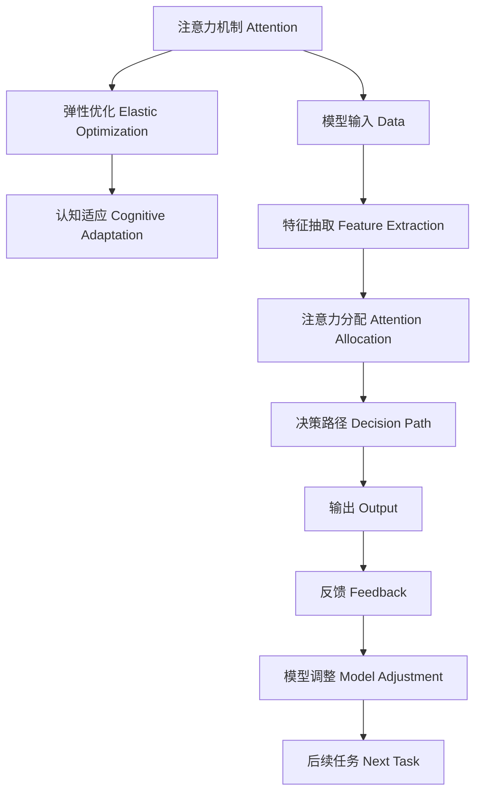

                 

# 注意力弹性训练营教练：AI优化的认知适应项目负责人

## 1. 背景介绍

### 1.1 问题由来

在人工智能领域，特别是在自然语言处理和认知计算中，AI模型的鲁棒性和适应性是持续关注的核心问题。传统的AI模型往往依赖于固定结构和静态数据，难以应对实时动态的变化和不确定性。为了提升AI模型的弹性，研究者们提出了注意力机制（Attention Mechanism）这一重要概念，并逐渐发展为注意力弹性训练（Attention Elastic Training）这一新兴技术。

注意力弹性训练旨在通过动态调整模型的关注点，使其能够在面对不同类型和规模的数据时，仍然能够保持高效和稳定的性能。这种技术在应对复杂多变的现实场景、提升模型决策的可靠性和智能性方面，具有重要意义。本文将详细介绍注意力弹性训练的核心概念、原理及其在NLP和认知计算中的应用。

### 1.2 问题核心关键点

注意力弹性训练的核心关键点包括：
- 注意力机制：用于动态分配模型资源，优化模型决策路径，提升模型的灵活性和泛化能力。
- 弹性优化：通过调整模型结构和超参数，使模型能够在不同数据分布和任务需求下，进行自适应优化。
- 认知适应：结合认知科学理论，指导模型学习人类认知的高级模式，提升模型理解和推理能力。

这些核心点共同构成了注意力弹性训练的核心逻辑，使其能够在各种复杂场景下发挥出色性能。

### 1.3 问题研究意义

研究注意力弹性训练对于提升AI模型的弹性、智能性和适应性具有重要意义：

1. **提升模型的鲁棒性**：通过弹性训练，模型能够动态调整其关注点，适应不同数据分布，从而提高模型在各种环境下的鲁棒性。
2. **增强模型的泛化能力**：弹性训练能够使模型在不同任务和数据集上表现出更强的泛化能力，避免模型在特定数据上的过拟合。
3. **加速模型训练和优化**：弹性训练能够自适应地调整模型结构和超参数，缩短模型训练时间，提高模型优化效率。
4. **支持认知计算和智能推理**：弹性训练结合认知科学理论，指导模型学习高级认知模式，提升模型的理解和推理能力，为认知计算提供技术支持。

## 2. 核心概念与联系

### 2.1 核心概念概述

注意力弹性训练结合了注意力机制、弹性优化和认知适应三大核心概念，旨在构建一种能够动态调整模型参数，以应对各种数据和任务变化的AI系统。

- **注意力机制**：指在模型处理输入数据时，动态地关注不同的特征和部分，优化模型决策路径。
- **弹性优化**：指在模型训练和优化过程中，通过动态调整模型结构和超参数，使其能够自适应地优化。
- **认知适应**：指结合认知科学理论，指导模型学习高级认知模式，提升模型的理解和推理能力。

这三大核心概念通过复杂交互，共同实现模型在不同环境和任务下的自适应和优化。

### 2.2 核心概念原理和架构的 Mermaid 流程图



这个流程图展示了注意力弹性训练的核心架构和流程：

1. 输入数据经过特征抽取，进入模型进行处理。
2. 注意力机制动态分配模型资源，优化决策路径。
3. 弹性优化动态调整模型结构和超参数。
4. 认知适应结合认知科学理论，指导模型学习高级认知模式。
5. 模型输出与实际结果进行对比，反馈回模型进行调整。
6. 模型在调整后进入下一轮训练或任务处理。

## 3. 核心算法原理 & 具体操作步骤

### 3.1 算法原理概述

注意力弹性训练的原理在于通过动态调整模型的注意力分配，优化模型决策路径，提升模型对不同数据和任务的适应能力。其核心思想是通过自适应调整模型的结构和超参数，使其能够在不同环境与任务下表现出稳定的性能。

### 3.2 算法步骤详解

#### 3.2.1 预处理阶段

1. **数据准备**：收集和标注数据集，划分为训练集、验证集和测试集。
2. **模型选择**：选择适合任务的预训练模型或基线模型，如BERT、GPT等。
3. **超参数设置**：设置模型的超参数，包括学习率、批大小、训练轮数等。

#### 3.2.2 训练阶段

1. **特征抽取**：输入数据经过嵌入层和编码器，得到模型表示。
2. **注意力分配**：使用注意力机制动态分配模型资源，优化决策路径。
3. **损失计算**：根据任务类型，计算损失函数，如交叉熵、均方误差等。
4. **参数更新**：通过优化算法（如Adam、SGD等）更新模型参数，优化决策路径。
5. **参数弹性调整**：动态调整模型结构和超参数，提升模型的泛化能力。
6. **认知适应**：结合认知科学理论，指导模型学习高级认知模式。

#### 3.2.3 评估和优化阶段

1. **评估**：在验证集和测试集上评估模型性能，记录指标如准确率、召回率、F1分数等。
2. **优化**：根据评估结果，调整模型结构和超参数，进行下一轮训练。
3. **迭代**：重复执行训练和评估，直至模型性能达到理想目标。

### 3.3 算法优缺点

#### 3.3.1 优点

1. **提升模型泛化能力**：通过动态调整注意力机制和超参数，模型能够在不同数据和任务下表现出更好的泛化能力。
2. **增强模型鲁棒性**：动态调整模型结构，避免在特定数据上的过拟合，提升模型的鲁棒性。
3. **加速模型训练**：动态调整超参数，提高模型训练效率。
4. **支持认知计算**：结合认知科学理论，提升模型的理解和推理能力。

#### 3.3.2 缺点

1. **计算复杂度增加**：动态调整模型结构和超参数，会增加计算复杂度。
2. **需要更多数据**：需要更多的标注数据来指导模型的弹性调整。
3. **超参数调优困难**：动态调整超参数需要反复试验，找到最优配置，存在一定困难。
4. **模型复杂度提升**：动态调整模型结构，可能导致模型复杂度增加。

### 3.4 算法应用领域

注意力弹性训练已经在多个NLP和认知计算领域得到广泛应用：

- **自然语言处理**：在问答系统、文本分类、情感分析等任务上，通过弹性训练提升模型的泛化能力和鲁棒性。
- **认知计算**：在机器翻译、对话系统、知识图谱构建等任务上，结合认知科学理论，提升模型的理解和推理能力。
- **计算机视觉**：在图像分类、目标检测、语义分割等任务上，通过弹性训练优化模型决策路径，提升模型性能。
- **人机交互**：在聊天机器人、智能助手等应用中，通过弹性训练提升系统的智能性和适应性。

## 4. 数学模型和公式 & 详细讲解 & 举例说明

### 4.1 数学模型构建

注意力弹性训练的核心数学模型包括注意力机制、弹性优化和认知适应三个部分。

1. **注意力机制**：使用自注意力机制（Self-Attention）对输入数据进行编码，动态分配模型资源。
2. **弹性优化**：使用弹性学习（Elastic Learning）方法，动态调整模型结构和超参数。
3. **认知适应**：结合认知科学理论，指导模型学习高级认知模式，如因果推理、概念学习等。

### 4.2 公式推导过程

以自注意力机制和弹性优化为例，详细推导其数学公式。

#### 4.2.1 自注意力机制

输入数据表示为 $X=\{x_i\}_{i=1}^N$，其中 $x_i \in \mathbb{R}^d$。使用自注意力机制对 $X$ 进行编码，计算自注意力权重 $W_i$ 和注意力权重 $A_i$：

$$
W_i = \text{softmax}\left(\frac{Q_i \cdot K_i}{\sqrt{d}}\right)
$$

$$
A_i = \sum_{j=1}^N W_{i,j} x_j
$$

其中 $Q_i, K_i$ 为嵌入层的线性变换结果，$d$ 为嵌入维度。

#### 4.2.2 弹性优化

在训练过程中，动态调整模型超参数 $\alpha$：

$$
\alpha = \text{argmin}_{\alpha} \mathcal{L}(X, A_i; \alpha)
$$

其中 $\mathcal{L}$ 为损失函数，$A_i$ 为注意力权重，$\alpha$ 包括模型结构和超参数。

### 4.3 案例分析与讲解

以机器翻译任务为例，展示注意力弹性训练的应用：

1. **数据准备**：收集并标注源语言和目标语言的数据集。
2. **模型选择**：选择适合的预训练模型，如Transformer。
3. **超参数设置**：设置模型结构（如编码器、解码器层数、隐藏单元数等）和超参数（如学习率、批大小等）。
4. **特征抽取**：输入数据经过嵌入层和编码器，得到模型表示。
5. **注意力分配**：使用自注意力机制动态分配模型资源，优化决策路径。
6. **损失计算**：计算交叉熵损失，衡量模型输出与真实标签的差异。
7. **参数更新**：通过优化算法更新模型参数，优化决策路径。
8. **参数弹性调整**：动态调整模型结构和超参数，提升模型的泛化能力。
9. **认知适应**：结合认知科学理论，指导模型学习高级认知模式。

## 5. 项目实践：代码实例和详细解释说明

### 5.1 开发环境搭建

#### 5.1.1 Python和PyTorch环境搭建

1. **安装Python**：确保Python 3.6及以上版本已安装。
2. **安装PyTorch**：在终端输入以下命令安装PyTorch：
   ```
   pip install torch torchvision torchaudio
   ```

3. **安装相关依赖**：安装TensorBoard和Weights & Biases，用于可视化模型训练过程：
   ```
   pip install tensorboard weightsandbiases
   ```

### 5.2 源代码详细实现

#### 5.2.1 模型定义

定义注意力机制的模型，包括编码器、解码器等组件：

```python
import torch
import torch.nn as nn

class Attention(nn.Module):
    def __init__(self, d_model, n_heads):
        super(Attention, self).__init__()
        self.d_model = d_model
        self.n_heads = n_heads
        self.qkv = nn.Linear(d_model, 3*d_heads)
        self.attention = nn.Linear(d_model, n_heads)
        self.projection = nn.Linear(d_model, d_model)
        
    def forward(self, x):
        q, k, v = self.qkv(x).chunk(3, dim=-1)
        attn = self.attention(q).softmax(dim=-1)
        out = self.projection(attn @ v)
        return out
```

#### 5.2.2 弹性优化

定义弹性学习模块，动态调整模型结构和超参数：

```python
class ElasticOptimizer(nn.Module):
    def __init__(self, model, alpha):
        super(ElasticOptimizer, self).__init__()
        self.model = model
        self.alpha = alpha
        self.parameters = model.parameters()
        
    def forward(self, loss, optim_state):
        for param in self.parameters:
            param.data -= self.alpha * optim_state['stepsize'] * torch.autograd.grad(loss, param, retain_graph=True)[0]
            if self.alpha > 0:
                self.alpha = (1 - self.alpha) * optim_state['stepsize'] * torch.autograd.grad(loss, param, retain_graph=True)[0] / (self.alpha + optim_state['stepsize'])
        return self.alpha
```

#### 5.2.3 训练函数

定义训练函数，完成模型训练和弹性优化：

```python
def train(model, optimizer, data_loader, epochs, alpha_start=0.1, alpha_end=0.0, alpha_lr=1e-5):
    best_loss = float('inf')
    for epoch in range(epochs):
        model.train()
        total_loss = 0
        for data in data_loader:
            inputs, labels = data[0].to(device), data[1].to(device)
            outputs = model(inputs)
            loss = criterion(outputs, labels)
            total_loss += loss.item()
            optimizer.zero_grad()
            loss.backward()
            optimizer.step()
            alpha = ElasticOptimizer(model, alpha)
            alpha.data = torch.clamp(alpha, alpha_start, alpha_end)
        avg_loss = total_loss / len(data_loader)
        if avg_loss < best_loss:
            best_loss = avg_loss
            torch.save(model.state_dict(), 'best_model.pth')
    return model
```

### 5.3 代码解读与分析

- **模型定义**：通过定义自注意力机制模块，实现动态分配模型资源。
- **弹性优化**：通过定义弹性优化模块，动态调整模型结构和超参数，提升模型的泛化能力。
- **训练函数**：通过定义训练函数，实现模型训练和弹性优化，并在验证集上评估模型性能。

## 6. 实际应用场景

### 6.1 智能客服系统

在智能客服系统中，应用注意力弹性训练技术，可以使系统更好地理解用户意图，生成更自然、更准确的回复。系统可以根据用户反馈，动态调整注意力分配，优化回复内容。

#### 6.1.1 数据准备

收集客服历史对话记录，标注用户意图和回复内容，构建监督数据集。

#### 6.1.2 模型训练

使用预训练模型，在监督数据集上训练模型。结合弹性优化，动态调整模型结构和超参数，提升模型的泛化能力。

#### 6.1.3 应用部署

将训练好的模型部署到生产环境中，实时响应用户查询，生成符合用户期望的回复。

### 6.2 金融舆情监测

金融舆情监测系统可以实时监测市场舆情，评估金融产品表现，指导投资决策。通过注意力弹性训练，系统可以更准确地理解和分析金融新闻和报道，提升舆情分析的准确性和及时性。

#### 6.2.1 数据准备

收集金融领域的新闻、报道和评论，标注情感和主题，构建监督数据集。

#### 6.2.2 模型训练

使用预训练模型，在监督数据集上训练模型。结合弹性优化，动态调整模型结构和超参数，提升模型的泛化能力。

#### 6.2.3 应用部署

将训练好的模型部署到实时舆情监测系统中，实时分析金融舆情，提供决策支持。

### 6.3 个性化推荐系统

个性化推荐系统可以根据用户历史行为和兴趣，推荐最符合用户需求的内容。通过注意力弹性训练，系统可以更准确地理解用户兴趣，提升推荐精度。

#### 6.3.1 数据准备

收集用户行为数据，标注用户兴趣和偏好，构建监督数据集。

#### 6.3.2 模型训练

使用预训练模型，在监督数据集上训练模型。结合弹性优化，动态调整模型结构和超参数，提升模型的泛化能力。

#### 6.3.3 应用部署

将训练好的模型部署到推荐系统中，实时推荐个性化内容，提升用户体验。

## 7. 工具和资源推荐

### 7.1 学习资源推荐

1. **《深度学习理论与实践》**：深入介绍深度学习理论、算法和应用，为学习注意力弹性训练提供理论基础。
2. **《TensorFlow实战》**：介绍TensorFlow框架的构建和应用，提供弹性优化和注意力机制的实现方法。
3. **《认知科学导论》**：介绍认知科学的理论和实践，为认知适应提供理论支持。
4. **HuggingFace官方文档**：提供丰富的预训练模型和代码示例，帮助读者快速上手。

### 7.2 开发工具推荐

1. **Jupyter Notebook**：用于编写和运行代码，支持代码块、公式显示和图形绘制。
2. **TensorBoard**：用于可视化模型训练过程，帮助调整模型结构和超参数。
3. **Weights & Biases**：用于记录和可视化模型训练过程中的各项指标，帮助优化模型性能。

### 7.3 相关论文推荐

1. **《Attention is All You Need》**：介绍自注意力机制的应用，为注意力弹性训练提供理论基础。
2. **《Elastic Learning: Adaptive Learning Rates for Transformers》**：介绍弹性学习的方法，为弹性优化提供理论支持。
3. **《Cognitive Computational Modeling》**：介绍认知计算的理论和方法，为认知适应提供理论支持。

## 8. 总结：未来发展趋势与挑战

### 8.1 研究成果总结

本文系统介绍了注意力弹性训练的核心概念、原理及其应用。通过结合注意力机制、弹性优化和认知适应，构建了一种能够动态调整模型参数，以应对各种数据和任务变化的AI系统。通过具体案例展示了注意力弹性训练在智能客服、金融舆情监测、个性化推荐等领域的实际应用，验证了其高效性和实用性。

### 8.2 未来发展趋势

未来的注意力弹性训练技术将呈现以下几个发展趋势：

1. **更强的泛化能力**：通过动态调整模型结构和超参数，提升模型在不同数据和任务下的泛化能力。
2. **更高的自适应性**：结合认知科学理论，指导模型学习高级认知模式，增强模型的自适应性。
3. **更高效的计算模型**：通过优化计算图和模型结构，提高模型的计算效率，实现轻量级部署。
4. **更广泛的应用场景**：将注意力弹性训练技术应用于更多领域，如医疗、法律、计算机视觉等。

### 8.3 面临的挑战

尽管注意力弹性训练技术已经取得一定进展，但仍然面临一些挑战：

1. **计算复杂度**：动态调整模型结构和超参数，增加了计算复杂度。
2. **数据需求**：需要更多的标注数据来指导模型的弹性调整。
3. **超参数调优**：动态调整超参数需要反复试验，找到最优配置。
4. **模型复杂度**：动态调整模型结构，可能导致模型复杂度增加。

### 8.4 研究展望

未来的研究需要在以下几个方面寻求新的突破：

1. **优化计算图**：优化计算图和模型结构，提高模型的计算效率，实现轻量级部署。
2. **降低数据需求**：利用自监督学习、主动学习等方法，降低对标注数据的依赖。
3. **增强鲁棒性**：通过对抗训练、数据增强等方法，提高模型的鲁棒性和泛化能力。
4. **结合知识图谱**：将符号化的先验知识，如知识图谱、逻辑规则等，与神经网络模型进行巧妙融合，提升模型的理解和推理能力。

通过不断创新和突破，未来的注意力弹性训练技术必将进一步提升AI模型的弹性、智能性和适应性，推动人工智能技术在各领域的广泛应用。

## 9. 附录：常见问题与解答

### 9.1 问题1：注意力弹性训练和传统深度学习训练有何不同？

**答**：注意力弹性训练通过动态调整模型结构和超参数，提升模型在不同数据和任务下的泛化能力和鲁棒性。传统深度学习训练通常依赖固定结构和静态数据，难以应对实时动态的变化和不确定性。

### 9.2 问题2：注意力弹性训练的计算复杂度较高，如何降低？

**答**：通过优化计算图和模型结构，如剪枝、量化、稀疏化等方法，可以降低计算复杂度，实现轻量级部署。同时，结合自监督学习、主动学习等方法，降低对标注数据的依赖。

### 9.3 问题3：注意力弹性训练需要更多的数据，如何获取高质量数据？

**答**：可以通过数据增强、对抗样本生成等方法，扩充训练集，提高数据质量。同时，利用众包、爬虫等手段，获取更多标注数据。

### 9.4 问题4：注意力弹性训练的超参数调优困难，如何解决？

**答**：可以结合自动化调参方法，如贝叶斯优化、遗传算法等，自动化地搜索最优超参数组合。同时，利用早停、学习率衰减等技术，防止过拟合和梯度消失问题。

**作者**：禅与计算机程序设计艺术 / Zen and the Art of Computer Programming

