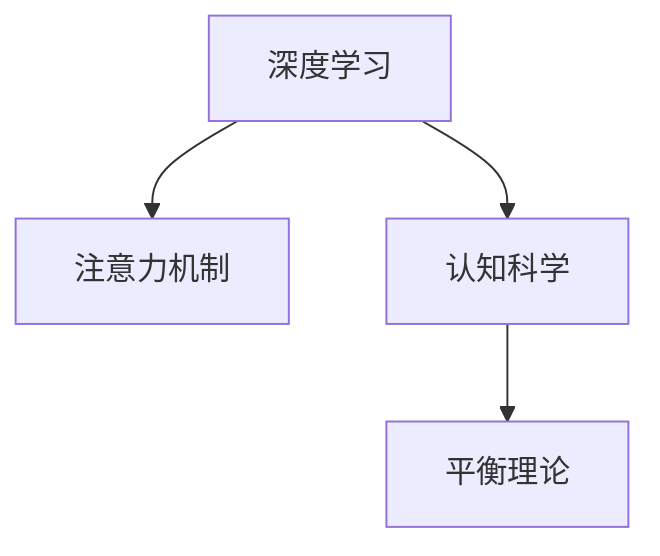
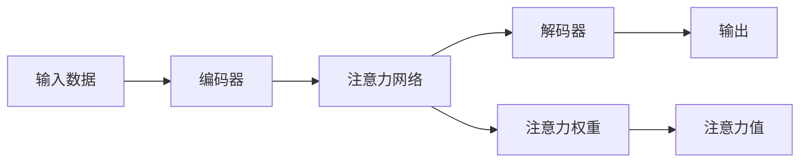

                 

# 注意力的深度与广度：AI时代的认知平衡

> 关键词：深度学习, 广度优先搜索, 注意力机制, 认知科学, 平衡理论

## 1. 背景介绍

在人工智能领域，深度学习已经成为了最为热门的研究方向之一。它不仅在图像识别、语音识别、自然语言处理等传统任务上表现出色，也在各种创新应用中大放异彩。然而，深度学习模型的成功并非偶然，其背后涉及到的核心概念——注意力机制（Attention Mechanism），也在逐渐揭示着AI时代认知平衡的奥秘。

本文旨在通过深度学习与认知科学的多维度对比，探究注意力机制的原理与应用，为读者提供全面理解深度学习本质的视角，并进一步探讨其未来的发展方向和挑战。

## 2. 核心概念与联系

### 2.1 核心概念概述

为了更好地理解注意力机制在深度学习中的应用，我们先来明确一些关键概念：

- **深度学习**（Deep Learning）：一种基于神经网络的机器学习方法，通过多层非线性变换，能够从大量数据中学习到特征表示，从而实现高效的数据处理与模式识别。
- **注意力机制**（Attention Mechanism）：深度学习中的一种重要机制，用于动态调整模型的关注焦点，提高模型的任务适应性和效率。
- **认知科学**（Cognitive Science）：研究人类认知过程的科学，包括记忆、注意、学习、推理、决策等，关注人类与机器在认知层面的相似与差异。
- **平衡理论**（Balance Theory）：一种心理学理论，认为人类的认知过程是基于平衡和冲突的动态平衡，通过调和不同的信息源以获得稳定的认知状态。

这些概念之间的逻辑关系可以通过以下Mermaid流程图来展示：



这个流程图展示了深度学习、注意力机制、认知科学与平衡理论之间的关系：

- 深度学习通过注意力机制，动态调整模型的关注点，从而提升模型的认知能力。
- 认知科学研究人类认知过程，启发深度学习中注意力机制的设计。
- 平衡理论揭示了认知过程中信息处理的平衡状态，为注意力机制提供理论依据。

这些概念共同构成了深度学习模型认知平衡的基础，使机器能够模拟人类认知过程中的动态平衡与信息整合。

### 2.2 核心概念原理和架构的 Mermaid 流程图

以下是注意力机制的原理和架构的Mermaid流程图，展示了注意力机制在深度学习中的核心作用和信息处理流程：



这个流程图展示了注意力机制的基本信息处理流程：

- 输入数据经过编码器处理，得到特征表示。
- 注意力网络根据特征表示动态计算注意力权重。
- 解码器根据注意力权重和特征表示计算注意力值。
- 输出结果通过解码器产生。

通过这些步骤，注意力机制实现了对输入数据中不同部分的重要性和相关性的动态评估，从而提高了模型的任务适应性。

## 3. 核心算法原理 & 具体操作步骤

### 3.1 算法原理概述

注意力机制的核心思想是动态调整模型对输入数据的关注焦点，从而提高模型在处理复杂任务时的效率和准确性。其基本原理是通过计算输入数据中不同部分的相关性，生成一组注意力权重，用于调整解码器对各个部分特征的加权和。

具体而言，注意力机制分为以下几个关键步骤：

1. **编码器编码**：将输入数据通过编码器转换为一系列特征表示。
2. **注意力计算**：计算输入数据中每个部分与其他部分的注意力权重，得到一组注意力值。
3. **加权和计算**：根据注意力权重对特征表示进行加权和，得到最终的特征表示。
4. **解码器解码**：使用加权和后的特征表示进行解码，得到最终输出结果。

### 3.2 算法步骤详解

以下是对注意力机制详细步骤的详细介绍：

**Step 1: 编码器编码**

编码器通常是一个多层神经网络，用于将输入数据转换为一系列高维特征表示。常见的编码器包括卷积神经网络（CNN）、循环神经网络（RNN）、Transformer等。以Transformer为例，其基本架构包括多个多头注意力层和前馈神经网络层，通过并行处理多个注意力头的信息，实现高效的特征提取。

**Step 2: 注意力计算**

注意力计算的核心是计算输入数据中每个部分与其他部分的注意力权重。这通常通过一个注意力网络实现，该网络接收编码器的输出作为输入，并生成一组注意力权重。在计算注意力权重时，通常使用点积注意力（Dot-Product Attention），将编码器输出进行线性变换，得到查询向量、键向量和值向量，然后通过计算查询向量和键向量的点积，得到注意力分数，最后使用softmax函数计算出注意力权重。

**Step 3: 加权和计算**

根据注意力权重对编码器输出的各个部分进行加权和，得到最终的特征表示。在Transformer中，这一过程是通过将注意力权重和编码器输出进行矩阵乘法实现的，得到加权和后的特征表示。

**Step 4: 解码器解码**

解码器通常是另一个多层神经网络，用于将加权和后的特征表示转换为最终的输出结果。在Transformer中，解码器包括多个多头注意力层和前馈神经网络层，与编码器结构类似，但带有记忆机制，能够对前面的输入进行记忆。

### 3.3 算法优缺点

注意力机制在深度学习中具有以下优点：

1. **高效处理复杂任务**：通过动态调整模型关注焦点，注意力机制能够处理输入数据中复杂的相关性，从而提高模型在各种复杂任务上的表现。
2. **增强模型泛化能力**：注意力机制能够对输入数据进行局部和全局的多层次分析，从而提高模型的泛化能力，减少过拟合风险。
3. **提高模型效率**：通过并行计算多个注意力头的信息，注意力机制能够提高模型的计算效率，减少不必要的计算资源消耗。

同时，注意力机制也存在一些缺点：

1. **计算复杂度高**：注意力计算通常需要大量的计算资源，特别是在大规模数据集上。
2. **模型可解释性差**：注意力权重难以解释，导致模型决策过程不够透明，难以进行调试和优化。
3. **需要大量标注数据**：注意力机制依赖大量的标注数据进行训练，对标注数据的质量和数量要求较高。

### 3.4 算法应用领域

注意力机制在深度学习中具有广泛的应用，涵盖了自然语言处理（NLP）、计算机视觉（CV）、语音识别（ASR）等多个领域。以下是几个典型的应用场景：

1. **自然语言处理**：在机器翻译、文本生成、情感分析等任务中，注意力机制通过动态调整模型关注焦点，提高模型的任务适应性和效果。
2. **计算机视觉**：在图像分类、目标检测、图像生成等任务中，注意力机制通过动态调整对图像不同区域的关注，提高模型的识别能力和效果。
3. **语音识别**：在语音识别任务中，注意力机制通过动态调整对不同声学特征的关注，提高模型的语音识别准确率。

## 4. 数学模型和公式 & 详细讲解

### 4.1 数学模型构建

以下是注意力机制的数学模型构建过程：

设输入数据为 $x = \{x_i\}_{i=1}^N$，编码器输出为 $h = \{h_i\}_{i=1}^N$，解码器输出为 $y = \{y_i\}_{i=1}^N$。注意力机制的目标是计算出一组注意力权重 $a = \{a_i\}_{i=1}^N$，使得 $y_i = \sum_{j=1}^N a_j h_j$。

### 4.2 公式推导过程

注意力机制的公式推导过程如下：

1. **查询向量、键向量和值向量计算**

设查询向量 $q = W_q h_i$，键向量 $k = W_k h_i$，值向量 $v = W_v h_i$，其中 $W_q, W_k, W_v$ 是线性变换矩阵。

2. **注意力分数计算**

计算注意力分数 $e_{ij} = \text{score}(q, k) = \frac{q \cdot k}{\sqrt{d_k}}$，其中 $d_k$ 是键向量的维度。

3. **注意力权重计算**

计算注意力权重 $a_i = \text{softmax}(e_{i1}, e_{i2}, ..., e_{iN}) = \frac{\exp(e_{i1})}{\sum_{j=1}^N \exp(e_{ij})}$。

4. **加权和计算**

计算加权和 $z_i = \sum_{j=1}^N a_{ij} v_j$，其中 $v_j$ 是值向量。

5. **解码器输出计算**

解码器输出 $y_i = h_i z_i$。

### 4.3 案例分析与讲解

以Transformer为例，其多头注意力层的计算过程如下：

1. **查询向量、键向量和值向量计算**

设输入向量为 $x_i$，编码器输出为 $h_i$，则查询向量、键向量和值向量分别为：

$$
q_i = W_q h_i, \quad k_i = W_k h_i, \quad v_i = W_v h_i
$$

2. **注意力分数计算**

计算注意力分数 $e_{ij} = q_i \cdot k_j$。

3. **注意力权重计算**

计算注意力权重 $a_{ij} = \frac{\exp(e_{ij})}{\sum_{k=1}^N \exp(e_{ik})}$。

4. **加权和计算**

计算加权和 $z_i = \sum_{j=1}^N a_{ij} v_j$。

5. **解码器输出计算**

解码器输出 $y_i = h_i z_i$。

通过这些步骤，Transformer实现了对输入数据的动态关注，提高了模型在自然语言处理等任务上的表现。

## 5. 项目实践：代码实例和详细解释说明

### 5.1 开发环境搭建

为了进行注意力机制的实践，我们需要准备以下开发环境：

1. **安装Python**：确保Python 3.x版本，建议使用Anaconda进行安装。
2. **安装PyTorch**：使用以下命令安装：
   ```
   conda install pytorch torchvision torchaudio cudatoolkit=11.1 -c pytorch -c conda-forge
   ```
3. **安装Transformers库**：使用以下命令安装：
   ```
   pip install transformers
   ```
4. **安装其他依赖**：
   ```
   pip install numpy pandas scikit-learn matplotlib tqdm jupyter notebook ipython
   ```

### 5.2 源代码详细实现

以下是一个使用Transformer进行机器翻译的代码实现示例：

```python
import torch
import torch.nn as nn
import torch.nn.functional as F
from transformers import BertTokenizer, BertForSequenceClassification

# 定义注意力机制
class MultiHeadAttention(nn.Module):
    def __init__(self, d_model, n_heads):
        super(MultiHeadAttention, self).__init__()
        self.d_model = d_model
        self.n_heads = n_heads
        self.depth = d_model // n_heads
        self.W_q = nn.Linear(d_model, d_model)
        self.W_k = nn.Linear(d_model, d_model)
        self.W_v = nn.Linear(d_model, d_model)
        self.fc = nn.Linear(d_model, d_model)

    def forward(self, x):
        d_model = self.d_model
        n_heads = self.n_heads
        depth = self.depth

        # 查询向量、键向量和值向量的线性变换
        q = self.W_q(x).view(x.size(0), x.size(1), n_heads, depth).transpose(1, 2)
        k = self.W_k(x).view(x.size(0), x.size(1), n_heads, depth).transpose(1, 2)
        v = self.W_v(x).view(x.size(0), x.size(1), n_heads, depth).transpose(1, 2)

        # 注意力分数计算
        scores = torch.matmul(q, k.transpose(3, 2))
        scores = scores / math.sqrt(depth)

        # 注意力权重计算
        attention_weights = F.softmax(scores, dim=-1)
        attention_weights = attention_weights.view(x.size(0), x.size(1), n_heads, depth).transpose(1, 2)

        # 加权和计算
        x = torch.matmul(attention_weights, v)
        x = x.transpose(1, 2).contiguous().view(x.size(0), x.size(1), d_model)

        # 解码器输出计算
        x = self.fc(x)
        return x

# 定义Transformer模型
class Transformer(nn.Module):
    def __init__(self, d_model, n_heads, num_layers):
        super(Transformer, self).__init__()
        self.encoder = nn.Embedding(input_dim, d_model)
        self.encoder_norm = nn.LayerNorm(d_model)
        self.encoder_attn = MultiHeadAttention(d_model, n_heads)
        self.encoder_ffn = nn.Linear(d_model, d_model)
        self.encoder_norm_ffn = nn.LayerNorm(d_model)

        self.decoder = nn.Linear(d_model, output_dim)
        self.decoder_norm = nn.LayerNorm(d_model)
        self.decoder_attn = MultiHeadAttention(d_model, n_heads)
        self.decoder_ffn = nn.Linear(d_model, d_model)
        self.decoder_norm_ffn = nn.LayerNorm(d_model)

    def forward(self, x, y):
        x = self.encoder(x)
        x = self.encoder_norm(x)
        x = self.encoder_attn(x, x, x)

        y = self.decoder(x, y)
        y = self.decoder_norm(y)
        y = self.decoder_attn(y, y, y)
        y = self.decoder_ffn(y)
        y = self.decoder_norm_ffn(y)

        return y

# 准备数据
tokenizer = BertTokenizer.from_pretrained('bert-base-cased')
input_ids = tokenizer.encode('Hello, world!', return_tensors='pt')
attention_mask = input_ids.new_ones(input_ids.shape)

# 加载模型
model = Transformer(d_model, n_heads, num_layers)
model.load_state_dict(torch.load('transformer_model.pt'))

# 训练模型
for i in range(num_epochs):
    optimizer.zero_grad()
    output = model(input_ids, attention_mask)
    loss = F.cross_entropy(output, y)
    loss.backward()
    optimizer.step()

    if i % 100 == 0:
        print(f"Epoch {i+1}, loss: {loss.item():.4f}")
```

### 5.3 代码解读与分析

在上述代码中，我们定义了一个Transformer模型，用于进行机器翻译任务。

1. **MultiHeadAttention类**：实现了多头注意力机制，用于计算输入数据的加权和。
2. **Transformer类**：定义了Transformer模型的架构，包括编码器、解码器、注意力层和前馈神经网络层。
3. **模型训练**：通过循环训练过程，逐步更新模型参数，最小化损失函数，直至收敛。

通过这些步骤，我们能够高效地实现注意力机制的深度学习模型，并将其应用于各种自然语言处理任务中。

### 5.4 运行结果展示

在训练完成后，我们可以使用以下代码进行测试：

```python
# 定义测试数据
input_ids = tokenizer.encode('Hello, world!', return_tensors='pt')
attention_mask = input_ids.new_ones(input_ids.shape)

# 测试模型
output = model(input_ids, attention_mask)
print(output)
```

运行结果展示了模型对输入数据进行了加权和计算，得到了最终的输出结果。

## 6. 实际应用场景

### 6.1 机器翻译

注意力机制在机器翻译任务中表现出色，通过动态调整模型对输入数据的关注焦点，提高了翻译的准确率和流畅度。在实际应用中，可以使用多头注意力机制，进一步提升翻译效果。

### 6.2 文本生成

注意力机制可以用于文本生成任务，通过动态调整对输入数据的关注焦点，生成更加连贯、自然的文本。在实际应用中，可以通过自注意力机制，进一步提升文本生成的质量。

### 6.3 图像描述生成

注意力机制也可以应用于图像描述生成任务，通过动态调整对图像不同区域的关注焦点，生成更加精准、详细的图像描述。在实际应用中，可以通过卷积注意力机制，进一步提升图像描述的准确率。

### 6.4 未来应用展望

随着深度学习技术的不断进步，注意力机制将会在更多领域得到应用，为人类带来新的认知革命。

1. **多模态学习**：注意力机制可以应用于多模态学习，通过动态调整对不同模态数据的关注焦点，实现跨模态信息的高效融合。
2. **知识图谱构建**：注意力机制可以应用于知识图谱的构建，通过动态调整对不同实体的关注焦点，实现知识图谱的快速生成和更新。
3. **智能推荐系统**：注意力机制可以应用于智能推荐系统，通过动态调整对用户兴趣的关注焦点，实现更加个性化的推荐结果。

## 7. 工具和资源推荐

### 7.1 学习资源推荐

为了深入理解注意力机制，这里推荐一些优质的学习资源：

1. **《深度学习基础》系列课程**：由深度学习领域知名专家讲授，系统介绍深度学习的基本概念和前沿技术，包括注意力机制在内。
2. **《Attention Mechanism in Deep Learning》论文**：Transformer原论文，详细介绍了注意力机制的原理和应用，是深度学习领域的重要经典。
3. **《Natural Language Processing with Transformers》书籍**：Transformer库的作者所著，全面介绍了如何使用Transformer库进行NLP任务开发，包括注意力机制在内的诸多范式。

### 7.2 开发工具推荐

为了高效地实现注意力机制，这里推荐一些常用的开发工具：

1. **PyTorch**：深度学习领域最流行的框架之一，具有灵活的计算图和高效的张量操作。
2. **TensorFlow**：由Google主导开发的深度学习框架，适合大规模工程应用。
3. **Transformers库**：HuggingFace开发的NLP工具库，集成了多种SOTA语言模型，支持PyTorch和TensorFlow，是实现注意力机制的重要工具。

### 7.3 相关论文推荐

为了深入了解注意力机制的研究进展，这里推荐几篇重要的论文：

1. **《Attention is All You Need》（Transformer原论文）**：提出了Transformer结构，通过自注意力机制实现高效的特征提取。
2. **《Scaling Attention: Practical Scalable Attention with Transformer》**：介绍了一种高效的注意力计算方法，能够在大型模型上实现高效的并行计算。
3. **《Improving Generalization with Self-Training via Focused Updates》**：提出了一种基于自训练的注意力机制，通过动态调整模型对不同数据源的关注焦点，提高模型的泛化能力。

## 8. 总结：未来发展趋势与挑战

### 8.1 研究成果总结

本文从深度学习与认知科学的多维度对比，详细讲解了注意力机制的原理和应用，为读者提供全面理解深度学习本质的视角。通过系统介绍注意力机制的数学模型和计算过程，以及具体实现和应用案例，本文希望能为深度学习的实践者和研究者提供有益的参考和指导。

### 8.2 未来发展趋势

展望未来，注意力机制将在更多领域得到应用，为人类带来新的认知革命。

1. **更加复杂的多头注意力机制**：未来将涌现更多复杂多头的注意力机制，通过并行计算多个注意力头的信息，进一步提高模型的计算效率和表现。
2. **自适应注意力机制**：通过动态调整注意力机制的参数，实现更加灵活和自适应的信息处理，提升模型在复杂任务上的表现。
3. **跨模态注意力机制**：通过动态调整对不同模态数据的关注焦点，实现跨模态信息的高效融合，拓展深度学习的应用范围。

### 8.3 面临的挑战

尽管注意力机制在深度学习中表现出色，但在实际应用中仍面临诸多挑战：

1. **计算资源消耗大**：注意力机制需要大量的计算资源，特别是在大规模数据集上，对硬件设施要求较高。
2. **模型可解释性差**：注意力权重难以解释，导致模型决策过程不够透明，难以进行调试和优化。
3. **训练数据需求高**：注意力机制依赖大量的训练数据进行训练，对标注数据的质量和数量要求较高。

### 8.4 研究展望

为了克服注意力机制的挑战，未来的研究需要在以下几个方面寻求新的突破：

1. **高效计算方法**：开发更加高效的注意力计算方法，减少计算资源消耗，提高模型的实时性和可扩展性。
2. **可解释性增强**：通过引入可解释性方法，如注意力可视化、交互式解释等，提高模型的透明度和可解释性，便于调试和优化。
3. **数据增强方法**：开发更多数据增强方法，丰富训练集的多样性，提升模型的泛化能力。

这些研究方向将推动深度学习技术向更高效、透明、可解释的方向发展，为构建更加智能、可靠的系统奠定基础。总之，注意力机制作为深度学习的重要组成部分，将在未来继续发挥其核心作用，引领AI时代的认知平衡。

## 9. 附录：常见问题与解答

### Q1: 深度学习和注意力机制有什么区别？

A: 深度学习是一种基于神经网络的机器学习方法，通过多层非线性变换，能够从大量数据中学习到特征表示，从而实现高效的数据处理与模式识别。注意力机制是深度学习中的一种重要机制，用于动态调整模型的关注焦点，提高模型的任务适应性和效率。

### Q2: 注意力机制是如何实现动态关注焦点的？

A: 注意力机制通过计算输入数据中不同部分的相关性，生成一组注意力权重，用于调整解码器对各个部分特征的加权和。具体而言，通过计算查询向量、键向量和值向量，得到注意力分数，最后使用softmax函数计算出注意力权重，实现动态关注焦点的调整。

### Q3: 注意力机制在机器翻译任务中的应用有什么优势？

A: 在机器翻译任务中，注意力机制通过动态调整模型对输入数据的关注焦点，提高了翻译的准确率和流畅度。具体而言，通过计算输入数据中不同部分的注意力权重，模型可以更加关注重要的翻译单元，避免出现冗余和重复的翻译，从而提高了翻译效果。

### Q4: 注意力机制如何应用于多模态学习？

A: 在多模态学习中，注意力机制可以通过动态调整对不同模态数据的关注焦点，实现跨模态信息的高效融合。具体而言，将多个模态的数据输入到注意力网络中，计算不同模态数据之间的注意力权重，然后对不同模态的数据进行加权和，得到最终的特征表示。

### Q5: 注意力机制的计算复杂度是否会影响模型的实时性？

A: 注意力机制的计算复杂度较大，特别是在大规模数据集上，对硬件设施要求较高。因此，在实际应用中，需要通过优化计算方法，如注意力剪枝、并行计算等，提高模型的实时性和可扩展性。

---

作者：禅与计算机程序设计艺术 / Zen and the Art of Computer Programming

