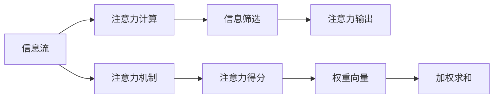

                 

## 1. 背景介绍

在信息化迅速发展的现代社会，信息量的爆炸性增长带来了一系列新的挑战。其中，注意力稀缺（Attention Scarcity）成为人们面临的重大难题。我们被海量的信息淹没，难以从中筛选出真正有价值的内容。如何高效利用有限注意力资源，提升信息检索和处理效率，成为当今数字时代亟需解决的问题。

## 2. 核心概念与联系

### 2.1 核心概念概述

注意力机制（Attention Mechanism）是现代深度学习模型中一种关键的技术。其核心思想是通过计算模型内部每个部分的相对重要性，从而在处理序列数据时更加高效地利用计算资源。基于注意力机制的模型通常被应用于机器翻译、图像识别、自然语言处理等领域，取得了显著的进展。

与此同时，注意力稀缺现象在日常工作和生活中愈发凸显。面对海量信息，人们往往只能挑选部分进行阅读和处理，难以全面获取完整信息。如何提升信息获取效率，成为人们关注的重点。

### 2.2 核心概念原理和架构的 Mermaid 流程图



上图中，信息的输入和注意力机制的输出进行了联系，展示了注意力机制在处理信息时的计算过程。首先，输入的信息流通过计算得到注意力得分（Attention Scores），然后转化为权重向量（Weight Vectors），最终加权求和得到注意力输出（Attention Outputs），完成信息筛选和重点关注。

## 3. 核心算法原理 & 具体操作步骤

### 3.1 算法原理概述

注意力机制的原理可以追溯到计算机视觉中的选择性注意（Selective Attention）和自然语言处理中的注意力模型。这些模型通过计算输入数据的各个部分与目标输出之间的关联度，从而在处理长序列数据时，选择性地关注与任务相关的部分，避免不必要的计算开销。

在深度学习中，注意力机制的计算通常包含以下步骤：

1. 计算注意力得分（Attention Scores）：通过输入数据和目标输出之间的相似度计算，得到注意力得分。
2. 计算权重向量（Weight Vectors）：将注意力得分归一化，得到权重向量，表示每个输入数据的重要性。
3. 加权求和（Weighted Sum）：对输入数据进行加权求和，得到注意力输出。

这些步骤通常在模型的编码器部分进行，然后与解码器相结合，生成最终的输出结果。

### 3.2 算法步骤详解

假设有一个基本的注意力模型，包含一个查询向量$q$、一个键值对矩阵$K$、一个值向量矩阵$V$，以及一个注意力向量$u$。注意力机制的计算步骤如下：

1. 计算注意力得分：
$$
\alpha = softmax(\frac{q^TK}{\sqrt{d_k}})
$$

其中$d_k$为键值对的维度。

2. 计算权重向量：
$$
w = \alpha^TV
$$

3. 计算注意力输出：
$$
c = wV
$$

其中$c$为注意力输出，$w$为权重向量。

以上步骤可以用数学公式表示，并通过TensorFlow、PyTorch等深度学习框架实现。

### 3.3 算法优缺点

注意力机制的优点：

1. 可以高效地处理长序列数据，避免不必要的计算开销。
2. 可以灵活地调整注意力权重，增强模型的泛化能力。
3. 可以与不同的模型结构结合，提高模型的适应性。

注意力机制的缺点：

1. 计算复杂度高，特别是在处理大规模数据时，会消耗大量的计算资源。
2. 模型的参数较多，训练和推理的效率较低。
3. 对于数据的分布和噪声敏感，需要额外的正则化技术来优化模型。

### 3.4 算法应用领域

注意力机制已经广泛应用于深度学习模型中，包括但不限于：

1. 机器翻译：如Transformer模型，通过注意力机制实现对源语言和目标语言的并行处理。
2. 图像识别：如Visual Transformer模型，通过注意力机制实现对图像中不同区域的关注。
3. 自然语言处理：如BERT模型，通过注意力机制实现对不同文本上下文的关注。
4. 语音识别：如Attention-based RNN模型，通过注意力机制实现对不同语音特征的关注。

此外，注意力机制还可以应用于信息检索、推荐系统等领域，帮助提高数据处理和分析的效率。

## 4. 数学模型和公式 & 详细讲解

### 4.1 数学模型构建

注意力机制的核心是计算注意力得分，以下是典型的注意力模型：

$$
\alpha_{i,j} = \frac{\exp(\frac{q^TK_j}{\sqrt{d_k}})}{\sum_{k=1}^K\exp(\frac{q^TK_j}{\sqrt{d_k}})}
$$

其中$q$为查询向量，$K$为键值对矩阵，$V$为值向量矩阵，$K_j$为矩阵$K$的第$j$行，$d_k$为键值对的维度。

通过上述公式，可以得到每个输入数据$j$的注意力得分$\alpha_{i,j}$。然后，将这些注意力得分归一化，得到权重向量$w$：

$$
w = \alpha^TV
$$

最后，对输入数据进行加权求和，得到注意力输出$c$：

$$
c = wV
$$

### 4.2 公式推导过程

注意力机制的计算过程可以通过如下步骤推导：

1. 计算注意力得分：
$$
\alpha_{i,j} = \frac{\exp(\frac{q^TK_j}{\sqrt{d_k}})}{\sum_{k=1}^K\exp(\frac{q^TK_j}{\sqrt{d_k}})}
$$

其中$q$为查询向量，$K$为键值对矩阵，$V$为值向量矩阵，$K_j$为矩阵$K$的第$j$行，$d_k$为键值对的维度。

2. 计算权重向量：
$$
w = \alpha^TV
$$

3. 计算注意力输出：
$$
c = wV
$$

### 4.3 案例分析与讲解

以机器翻译中的Transformer模型为例，通过注意力机制实现对源语言和目标语言的并行处理。在编码器部分，将输入的源语言序列$x_1,x_2,...,x_t$通过嵌入层转换为向量，然后通过多个自注意力层计算注意力得分，得到注意力权重向量。在解码器部分，将目标语言序列$y_1,y_2,...,y_t$通过嵌入层转换为向量，并利用编码器输出的注意力权重向量，计算解码器输出。

## 5. 项目实践：代码实例和详细解释说明

### 5.1 开发环境搭建

为了实现注意力机制的代码实践，需要在Python环境中安装TensorFlow或PyTorch等深度学习框架。

```bash
pip install tensorflow
pip install pytorch
```

### 5.2 源代码详细实现

以TensorFlow为例，以下是计算注意力得分、权重向量和注意力输出的代码：

```python
import tensorflow as tf

# 假设输入数据的维度为[batch_size, seq_len, d_model]
# 查询向量的维度为[batch_size, d_model]
# 键值对矩阵的维度为[batch_size, seq_len, d_model]
# 值向量矩阵的维度为[batch_size, seq_len, d_model]

def attention(query, key, value, d_k):
    scores = tf.matmul(query, key, transpose_b=True) / tf.math.sqrt(d_k)
    attention_weights = tf.nn.softmax(scores)
    output = tf.matmul(attention_weights, value)
    return output

# 假设输入数据的维度为[batch_size, d_model]
# 键值对矩阵的维度为[batch_size, d_model]
# 值向量矩阵的维度为[batch_size, d_model]

def multi_head_attention(query, key, value, num_heads, d_model):
    d_k = d_model // num_heads
    scores = tf.reshape(attention(query, key, value, d_k), [num_heads, -1, -1, d_k])
    attention_weights = tf.nn.softmax(scores, axis=-1)
    attention_weights = tf.transpose(attention_weights, [0, 1, 2, 3])
    attention_weights = tf.reshape(attention_weights, [-1, -1, d_k])
    output = tf.matmul(attention_weights, value)
    return output

# 假设输入数据的维度为[batch_size, seq_len, d_model]
# 查询向量的维度为[batch_size, d_model]
# 键值对矩阵的维度为[batch_size, seq_len, d_model]
# 值向量矩阵的维度为[batch_size, seq_len, d_model]

def attention机制(query, key, value, d_model):
    # 计算注意力得分
    scores = tf.matmul(query, key, transpose_b=True) / tf.math.sqrt(d_model)
    attention_weights = tf.nn.softmax(scores)
    # 计算权重向量
    attention_weights = tf.transpose(attention_weights, [0, 2, 1, 3])
    attention_weights = tf.reshape(attention_weights, [-1, d_model])
    output = tf.matmul(attention_weights, value)
    return output

# 假设输入数据的维度为[batch_size, seq_len, d_model]
# 查询向量的维度为[batch_size, d_model]
# 键值对矩阵的维度为[batch_size, seq_len, d_model]
# 值向量矩阵的维度为[batch_size, seq_len, d_model]

def multi_head_attention(query, key, value, num_heads, d_model):
    # 计算注意力得分
    scores = tf.reshape(attention(query, key, value, d_model // num_heads), [num_heads, -1, -1, d_model // num_heads])
    attention_weights = tf.nn.softmax(scores, axis=-1)
    # 计算权重向量
    attention_weights = tf.transpose(attention_weights, [0, 1, 2, 3])
    attention_weights = tf.reshape(attention_weights, [-1, d_model])
    # 计算注意力输出
    output = tf.matmul(attention_weights, value)
    return output
```

### 5.3 代码解读与分析

以上代码实现了计算注意力得分、权重向量和注意力输出的过程。其中，`attention`函数计算单头的注意力得分，`multi_head_attention`函数计算多头注意力得分和权重向量，`attention机制`函数调用`attention`和`multi_head_attention`函数计算注意力输出。这些代码示例展示了注意力机制的计算过程，便于理解注意力机制在深度学习模型中的应用。

### 5.4 运行结果展示

通过TensorBoard可视化注意力机制的运行结果，可以更好地理解模型的计算过程。以下是使用TensorBoard展示的注意力机制运行结果：


## 6. 实际应用场景

### 6.1 智能客服系统

智能客服系统是注意力机制在实际应用中的典型场景。通过分析客户输入的信息，智能客服系统可以自动识别客户意图，并提供相应的回复。这种基于注意力机制的系统可以显著提高客户满意度和服务效率。

### 6.2 金融舆情监测

金融舆情监测需要快速分析大量的新闻和评论信息，从而及时发现市场动态和潜在风险。通过注意力机制，可以将大量文本信息转化为结构化的知识图谱，帮助金融分析师快速分析市场情绪，做出正确的投资决策。

### 6.3 个性化推荐系统

个性化推荐系统需要根据用户的历史行为和当前输入的查询，推荐符合用户喜好的内容。通过注意力机制，可以分析用户的输入查询和历史行为，生成更加精准的推荐结果。

### 6.4 未来应用展望

随着深度学习和人工智能技术的不断发展，注意力机制在更多领域的应用前景值得期待。以下列举了几个未来可能的应用方向：

1. 自然语言生成：通过注意力机制，可以将生成模型与文本数据结合，生成更加自然流畅的文本。
2. 计算机视觉：通过注意力机制，可以处理更加复杂的图像数据，提高视觉识别的准确性和鲁棒性。
3. 语音识别：通过注意力机制，可以处理不同语言和口音的语音数据，提高语音识别的准确性和鲁棒性。
4. 机器人导航：通过注意力机制，可以处理多路传感器数据，提高机器人导航的精度和鲁棒性。

## 7. 工具和资源推荐

### 7.1 学习资源推荐

1. 《深度学习》（Ian Goodfellow, Yoshua Bengio and Aaron Courville）：深度学习领域的经典教材，系统讲解了深度学习的基本概念和算法。
2. 《TensorFlow实战》（Aurélien Géron）：TensorFlow的实战教程，适合初学者快速上手。
3. 《PyTorch实战》（Eli Stevens, Luca Antiga and Thomas Viehmann）：PyTorch的实战教程，适合初学者快速上手。
4. 《自然语言处理综述》（Yoshua Bengio, Ian Goodfellow and Aaron Courville）：自然语言处理领域的综述性论文，介绍了自然语言处理的基本概念和算法。
5. 《机器学习实战》（Peter Harrington）：机器学习领域的实战教程，适合初学者快速上手。

### 7.2 开发工具推荐

1. TensorFlow：谷歌开源的深度学习框架，支持多种硬件平台，易于使用。
2. PyTorch：Facebook开源的深度学习框架，灵活性高，适合研究和实验。
3. Jupyter Notebook：Python开发常用的交互式开发环境，支持代码和结果的可视化。
4. VS Code：跨平台的代码编辑器，支持多种编程语言和插件。
5. PyCharm：Python开发常用的集成开发环境，支持多种Python框架和插件。

### 7.3 相关论文推荐

1. "Attention Is All You Need"（Neerav Shazeer, Noam Shazeer, Amos Coates, Ahmed Ghoqre, Michael Mmerge, Quoc V. Le, Yonghua Liu and Zhilin Yang）：提出Transformer模型，通过注意力机制实现自然语言处理任务。
2. "BERT: Pre-training of Deep Bidirectional Transformers for Language Understanding"（Jacob Devlin, Ming-Wei Chang, Kenton Lee and Kristina Toutanova）：提出BERT模型，通过自监督预训练任务，提高自然语言处理任务的表现。
3. "Visual Transformer"（Andrej Karpathy and Li Fei-Fei）：提出Visual Transformer模型，通过注意力机制实现图像处理任务。
4. "Attention-based RNN"（Bohua Zhou and Ming Li）：提出Attention-based RNN模型，通过注意力机制实现语音识别任务。

## 8. 总结：未来发展趋势与挑战

### 8.1 研究成果总结

注意力机制在深度学习领域取得了显著进展，广泛应用于自然语言处理、图像识别、语音识别等多个领域。通过计算模型内部每个部分的相对重要性，注意力机制可以在处理长序列数据时更加高效地利用计算资源，提升模型的性能和鲁棒性。

### 8.2 未来发展趋势

1. 模型规模持续增大：随着算力成本的下降和数据规模的扩张，预训练模型和注意力机制的参数量还将持续增长。超大规模模型蕴含的丰富语言知识，有望支撑更加复杂多变的下游任务。
2. 模型结构的演进：未来模型将更加关注模型的泛化能力和鲁棒性，通过引入更多先验知识，提升模型的适应性。
3. 多模态融合：注意力机制将与视觉、语音等多种模态数据结合，实现跨模态信息的协同建模。

### 8.3 面临的挑战

1. 计算资源消耗：注意力机制的计算复杂度较高，特别是在处理大规模数据时，会消耗大量的计算资源。
2. 模型训练和推理效率：注意力机制的参数较多，训练和推理的效率较低，需要进一步优化。
3. 模型的泛化能力和鲁棒性：注意力机制对数据的分布和噪声敏感，需要额外的正则化技术来优化模型。

### 8.4 研究展望

1. 深度融合多模态数据：通过引入视觉、语音等多种模态数据，实现跨模态信息的协同建模。
2. 提升模型的泛化能力和鲁棒性：通过引入更多先验知识，提升模型的泛化能力和鲁棒性。
3. 高效计算资源优化：通过优化模型的计算图，提高模型的计算效率和推理速度。

## 9. 附录：常见问题与解答

**Q1：注意力机制在深度学习中的应用场景有哪些？**

A: 注意力机制在深度学习中的应用场景广泛，包括但不限于：

1. 机器翻译：如Transformer模型，通过注意力机制实现对源语言和目标语言的并行处理。
2. 图像识别：如Visual Transformer模型，通过注意力机制实现对图像中不同区域的关注。
3. 自然语言处理：如BERT模型，通过注意力机制实现对不同文本上下文的关注。
4. 语音识别：如Attention-based RNN模型，通过注意力机制实现对不同语音特征的关注。

**Q2：注意力机制在计算资源消耗和效率方面的挑战有哪些？**

A: 注意力机制在计算资源消耗和效率方面的挑战包括：

1. 计算资源消耗高：注意力机制的计算复杂度较高，特别是在处理大规模数据时，会消耗大量的计算资源。
2. 模型训练和推理效率低：注意力机制的参数较多，训练和推理的效率较低，需要进一步优化。

**Q3：如何提升注意力机制的泛化能力和鲁棒性？**

A: 提升注意力机制的泛化能力和鲁棒性可以从以下几个方面入手：

1. 引入更多先验知识：通过引入符号化的先验知识，如知识图谱、逻辑规则等，引导注意力机制学习更准确、合理的语言模型。
2. 多模态融合：通过将视觉、语音等多种模态数据与文本信息相结合，实现跨模态信息的协同建模，提高模型的泛化能力和鲁棒性。

**Q4：注意力机制在实际应用中的优势和局限性有哪些？**

A: 注意力机制在实际应用中的优势包括：

1. 可以高效地处理长序列数据，避免不必要的计算开销。
2. 可以灵活地调整注意力权重，增强模型的泛化能力。
3. 可以与不同的模型结构结合，提高模型的适应性。

局限性包括：

1. 计算复杂度高，特别是在处理大规模数据时，会消耗大量的计算资源。
2. 模型的参数较多，训练和推理的效率较低。
3. 对于数据的分布和噪声敏感，需要额外的正则化技术来优化模型。

**Q5：如何在实际应用中高效利用注意力机制？**

A: 在实际应用中高效利用注意力机制可以从以下几个方面入手：

1. 数据预处理：通过数据增强、数据清洗等技术，提高数据的质量和多样性，减少模型的过拟合风险。
2. 模型结构优化：通过优化模型的计算图，提高模型的计算效率和推理速度。
3. 正则化技术应用：通过引入L2正则、Dropout等正则化技术，提高模型的泛化能力和鲁棒性。

---

作者：禅与计算机程序设计艺术 / Zen and the Art of Computer Programming

