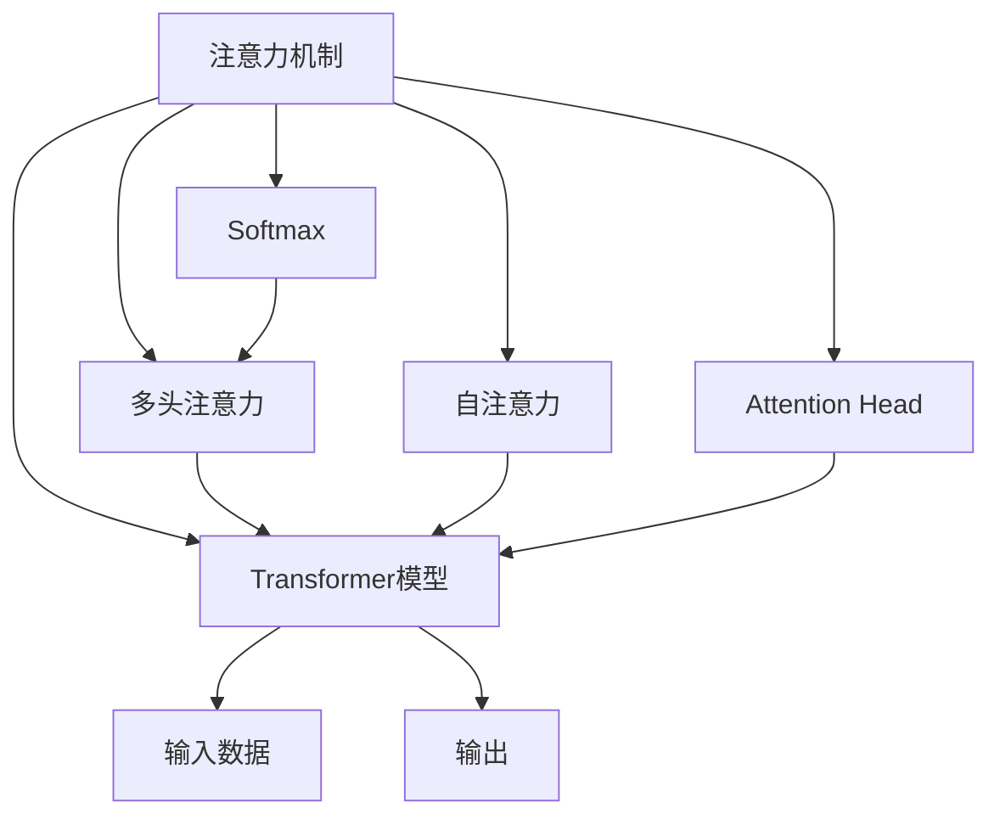

                 

## 1. 背景介绍

注意力（Attention）是现代深度学习中最为重要的概念之一，尤其是对于自然语言处理（NLP）和计算机视觉等领域，注意力机制使得模型能够更好地处理序列或空间结构数据，极大提升了模型在复杂任务中的表现。同时，在创造力（Creativity）的培养和激发中，注意力管理也起着至关重要的作用。本文旨在从技术和心理学两个维度探讨注意力管理与创造力提升，帮助开发者在高效工作的同时，激发创造力，实现技术突破。

## 2. 核心概念与联系

### 2.1 核心概念概述

**注意力（Attention）**：
注意力机制是一种能够让模型在处理复杂输入时，能够动态地分配计算资源，重点关注输入中最重要或最相关的部分。对于NLP中的自回归模型（如Transformer），注意力机制使得模型能够根据输入序列中的前文信息，动态计算对后续文本的关注权重，实现序列信息的传递和整合。

**创造力（Creativity）**：
创造力是指个体能产生新的、独特的、有价值的想法和解决方案的能力。在人工智能领域，创造力也被称为生成性（Generative），指的是模型能够从已有数据生成新的、未见过的数据。创造力在机器学习中通过生成对抗网络（GAN）、变分自编码器（VAE）、语言模型等生成模型得以体现。

**注意力与创造力的联系**：
注意力机制和创造力在本质上都关注信息的集中处理和信息的高效利用，能够帮助模型更好地捕捉输入数据的关键特征，形成更全面、深入的理解。通过有效的注意力管理，可以使模型在复杂输入条件下，能够提取出关键信息，生成高质量的输出。同时，注意力的动态分配机制也增强了模型对新输入的适应性和生成能力，在一定程度上激发了创造力。

### 2.2 核心概念原理和架构的 Mermaid 流程图



这个流程图展示了注意力机制在Transformer模型中的实现方式：输入数据通过多头注意力机制和自注意力机制进行信息整合，最终通过注意力头的计算生成输出。

## 3. 核心算法原理 & 具体操作步骤

### 3.1 算法原理概述

注意力机制基于自监督学习（Self-Supervised Learning），通过最大化预测目标和实际目标之间的互信息，自动学习输入中重要部分和相关性。在自然语言处理中，注意力机制通过动态计算输入序列中不同位置之间的关联权重，使得模型能够关注序列中重要的词汇和短语，提升模型对长距离依赖的建模能力。

### 3.2 算法步骤详解

注意力机制的计算主要分为以下几步：

1. **Query Key 矩阵计算**：将输入序列中的每个位置向量表示为查询向量 $Q_i$ 和键向量 $K_i$，通过矩阵乘法计算查询向量与所有键向量的相似度 $QK_i$。
2. **Softmax 归一化**：对 $QK_i$ 进行softmax归一化，得到每个位置向量的注意力权重 $\alpha_i$。
3. **加权求和**：将注意力权重 $\alpha_i$ 与对应的值向量 $V_i$ 相乘，加权求和得到最终注意力输出 $C_i$。
4. **多头注意力**：在Transformer模型中，多头注意力机制将上述步骤重复若干次，并行计算多个头部的注意力输出，通过拼接得到最终的多头注意力输出。

### 3.3 算法优缺点

**优点**：
- 能够动态捕捉输入序列中重要部分，提升模型对长距离依赖的建模能力。
- 多个头部的并行计算能够捕捉输入中的不同层次信息，增强模型表示的丰富度。
- 适用于多种NLP任务，如机器翻译、文本分类、问答系统等。

**缺点**：
- 计算复杂度高，特别是在多头注意力机制中，需要大量的矩阵运算。
- 对于输入序列过长的任务，容易产生注意力偏差，导致模型难以捕捉长距离依赖。
- 需要较多的训练数据，才能自动学习出有效的注意力权重。

### 3.4 算法应用领域

注意力机制广泛应用于NLP和计算机视觉领域：

- 在NLP中，注意力机制是Transformer模型的核心，显著提升了模型的理解和生成能力。
- 在计算机视觉中，注意力机制被应用于物体检测、图像生成等任务，帮助模型更关注图像的关键区域。
- 在强化学习中，注意力机制被用于环境感知和决策制定，增强模型的动态规划能力。

## 4. 数学模型和公式 & 详细讲解 & 举例说明

### 4.1 数学模型构建

注意力机制的核心是计算查询向量 $Q_i$ 和键向量 $K_i$ 之间的相似度，并据此计算注意力权重 $\alpha_i$。假设输入序列中的第 $i$ 个位置向量为 $V_i$，其长度为 $d$，注意力输出长度为 $n$，注意力机制的数学模型可以表示为：

$$
\alpha_i = \frac{e^{Q_i K_i / \sqrt{d}}}{\sum_{j=1}^n e^{Q_j K_j / \sqrt{d}}}, \quad i=1,\dots,n
$$

其中，$Q_i K_i$ 为矩阵乘积，$\sqrt{d}$ 为缩放因子，用于避免数值溢出。

### 4.2 公式推导过程

在推导注意力权重 $\alpha_i$ 时，我们使用了softmax函数。softmax函数的数学公式为：

$$
\sigma(z_i) = \frac{e^{z_i}}{\sum_{j=1}^n e^{z_j}}, \quad i=1,\dots,n
$$

其中 $z_i = Q_i K_i / \sqrt{d}$，将原始的注意力权重 $\alpha_i$ 进行了归一化，使得所有权重之和为1。

### 4.3 案例分析与讲解

**例子1: Transformer注意力机制**

在Transformer模型中，注意力机制被应用于多头注意力头 $H$ 的计算。设 $H$ 由多个注意力头组成，每个头的查询向量 $Q_i$ 和键向量 $K_i$ 计算如下：

$$
Q_i = W_Q V_i, \quad K_i = W_K V_i
$$

其中 $W_Q$ 和 $W_K$ 为线性投影矩阵，$V_i$ 为输入序列中的位置向量。通过计算 $Q_i K_i$，得到注意力权重 $\alpha_i$，并进行多头注意力计算：

$$
C_i = \sum_{j=1}^n \alpha_{ij} V_j
$$

其中 $\alpha_{ij} = e^{Q_i K_j / \sqrt{d}} / \sum_{k=1}^n e^{Q_i K_k / \sqrt{d}}$。

**例子2: 图像注意力机制**

在计算机视觉中，注意力机制也被应用于物体检测和图像生成任务。设输入图像大小为 $n \times n$，每个位置向量 $V_i$ 对应一个像素。通过计算 $Q_i K_i$，得到注意力权重 $\alpha_i$，并将其用于选择重要区域：

$$
C_i = \sum_{j=1}^n \alpha_{ij} V_j
$$

其中 $\alpha_{ij} = e^{Q_i K_j / \sqrt{d}} / \sum_{k=1}^n e^{Q_i K_k / \sqrt{d}}$。

## 5. 项目实践：代码实例和详细解释说明

### 5.1 开发环境搭建

为了实践注意力机制，我们需要搭建一个深度学习开发环境。以下是Python+PyTorch环境的搭建步骤：

1. 安装Python：从官网下载安装Python 3.8以上版本，并设置环境变量。
2. 安装PyTorch：使用pip安装PyTorch，并指定 CUDA 版本和CUDA库路径。
3. 安装Tensorboard：使用pip安装Tensorboard，方便可视化训练过程。

```bash
pip install torch torchvision torchaudio tensorboard
```

### 5.2 源代码详细实现

下面是一个使用Transformer模型的代码实例，展示了多头注意力机制的实现：

```python
import torch
import torch.nn as nn
import torch.nn.functional as F

class MultiHeadAttention(nn.Module):
    def __init__(self, in_dim, num_heads, dropout=0.1):
        super().__init__()
        self.in_dim = in_dim
        self.num_heads = num_heads
        self.dropout = dropout
        
        self.WQ = nn.Linear(in_dim, in_dim)
        self.WK = nn.Linear(in_dim, in_dim)
        self.WV = nn.Linear(in_dim, in_dim)
        self.fc = nn.Linear(in_dim, in_dim)
        self.dense = nn.Linear(in_dim, in_dim)
        
    def forward(self, x):
        batch_size = x.size(0)
        q, k, v = self.WQ(x), self.WK(x), self.WV(x)
        q = q.view(batch_size, -1, self.num_heads, self.in_dim // self.num_heads).transpose(1, 2)
        k = k.view(batch_size, -1, self.num_heads, self.in_dim // self.num_heads).transpose(1, 2)
        v = v.view(batch_size, -1, self.num_heads, self.in_dim // self.num_heads).transpose(1, 2)
        
        attn = torch.matmul(q, k.transpose(3, 2)) / torch.sqrt(torch.tensor(self.in_dim // self.num_heads))
        attn = F.softmax(attn, dim=-1)
        attn = torch.dropout(attn, p=self.dropout, training=self.training)
        x = torch.matmul(attn, v)
        x = x.transpose(1, 2).contiguous().view(batch_size, -1, self.in_dim)
        x = self.dense(x)
        return x
```

### 5.3 代码解读与分析

**代码结构分析**：
- 定义了一个`MultiHeadAttention`类，继承自`nn.Module`，用于实现多头注意力机制。
- 在初始化方法中，设置了输入维度`in_dim`、头数`num_heads`和dropout概率`dropout`。
- 在forward方法中，首先将输入`x`经过线性投影得到查询向量$q$、键向量$k$和值向量$v$，然后进行多头注意力计算。
- 通过计算$qk$，得到注意力权重$\alpha$，并进行softmax归一化。
- 通过计算$\alpha v$，得到多头注意力输出$x$，并经过线性投影和全连接层，得到最终输出。

**代码实现细节**：
- 使用了线性投影和全连接层进行查询向量$q$、键向量$k$和值向量$v$的计算。
- 通过计算$qk$，得到注意力权重$\alpha$，并进行softmax归一化。
- 通过计算$\alpha v$，得到多头注意力输出$x$，并经过线性投影和全连接层，得到最终输出。

**代码调试和优化**：
- 在实现过程中，需要注意矩阵维度匹配、dropout处理等细节，避免出现维度错误或数值溢出问题。
- 可以通过Tensorboard对训练过程进行可视化，调试模型训练中的问题。

### 5.4 运行结果展示

通过上述代码，可以得到多头注意力机制的输出结果。以下是一个简单的示例，展示了注意力机制在NLP中的应用：

```python
import torch
import torch.nn as nn

class Transformer(nn.Module):
    def __init__(self, in_dim, num_heads, dropout=0.1):
        super().__init__()
        self.in_dim = in_dim
        self.num_heads = num_heads
        self.dropout = dropout
        
        self.emb = nn.Embedding(in_dim, in_dim)
        self.mha = MultiHeadAttention(in_dim, num_heads, dropout)
        self.fc = nn.Linear(in_dim, in_dim)
        self.dense = nn.Linear(in_dim, in_dim)
        
    def forward(self, x):
        x = self.emb(x)
        x = self.mha(x)
        x = self.fc(x)
        x = self.dense(x)
        return x
```

## 6. 实际应用场景

### 6.1 自然语言处理

在自然语言处理中，注意力机制被广泛应用于机器翻译、文本分类、问答系统等任务。通过注意力机制，模型能够更好地理解输入序列的结构和含义，提升模型对长距离依赖的建模能力。

### 6.2 计算机视觉

在计算机视觉中，注意力机制被应用于物体检测、图像生成等任务，帮助模型更好地选择和关注关键区域。通过注意力机制，模型能够更加高效地处理复杂输入，提高模型的准确性和鲁棒性。

### 6.3 强化学习

在强化学习中，注意力机制被用于环境感知和决策制定，增强模型的动态规划能力。通过注意力机制，模型能够更好地捕捉环境中的重要信息，做出更加合理的决策。

### 6.4 未来应用展望

未来，注意力机制将进一步应用于更多领域：

- 在语音识别中，注意力机制被用于语音特征提取和序列建模，提升识别准确率。
- 在推荐系统中，注意力机制被用于用户行为建模和推荐结果排序，提高推荐精度。
- 在社交网络中，注意力机制被用于用户关系建模和信息传播预测，增强社交网络分析能力。

## 7. 工具和资源推荐

### 7.1 学习资源推荐

为了更好地掌握注意力机制，推荐以下学习资源：

1. 《Attention is All You Need》论文：Transformer的原始论文，介绍了注意力机制的基本原理和实现方法。
2. 《Deep Learning》课程：斯坦福大学开设的深度学习课程，详细讲解了各种深度学习模型和算法。
3. 《Neural Network and Deep Learning》书籍：深度学习领域经典书籍，涵盖深度学习模型的原理和应用。
4. HuggingFace官方文档：Transformer库的官方文档，提供了大量的预训练模型和微调样例。
5. Kaggle竞赛：通过参与Kaggle竞赛，实践注意力机制在实际问题中的应用。

### 7.2 开发工具推荐

为了提高开发效率，推荐以下开发工具：

1. PyTorch：Python深度学习框架，提供高效的计算图和丰富的优化器。
2. TensorFlow：Google开发的深度学习框架，提供高效的分布式训练和模型部署能力。
3. Tensorboard：TensorFlow配套的可视化工具，方便调试和可视化模型训练过程。
4. Weights & Biases：模型训练的实验跟踪工具，记录和可视化训练过程。

### 7.3 相关论文推荐

为了深入理解注意力机制，推荐以下相关论文：

1. Transformer论文：介绍Transformer模型的基本原理和实现方法。
2. Self-Attention论文：介绍注意力机制的基本原理和优化方法。
3. Attention-based CNN论文：介绍在计算机视觉中应用注意力机制的方法。
4. Multi-Head Attention论文：介绍多头注意力机制的实现方法。

## 8. 总结：未来发展趋势与挑战

### 8.1 研究成果总结

本文从注意力机制和创造力提升两个维度，系统介绍了注意力机制的基本原理和实现方法，并详细探讨了其与创造力提升的关系。通过实例和案例分析，展示了注意力机制在NLP和计算机视觉中的应用，帮助开发者更好地掌握注意力机制的实现方法。

### 8.2 未来发展趋势

未来，注意力机制将进一步发展，呈现出以下几个趋势：

1. 多模态注意力：将注意力机制应用于多模态数据处理，如文本和图像结合的注意力机制。
2. 记忆化注意力：将注意力机制与长短期记忆（LSTM）等记忆化结构结合，增强模型的记忆能力。
3. 动态注意力：基于动态时间规整（DTW）等技术，实现动态调整注意力权重，适应不同输入规模。
4. 自适应注意力：通过自适应调整注意力权重，增强模型的泛化能力，适应不同任务和数据分布。

### 8.3 面临的挑战

尽管注意力机制在深度学习中取得了广泛应用，但在实际应用中也面临一些挑战：

1. 计算复杂度高：在多头注意力机制中，需要大量的矩阵运算，计算复杂度较高。
2. 对输入序列长度敏感：对于过长的输入序列，注意力机制容易产生偏差，影响模型性能。
3. 训练数据需求大：注意力机制需要大量的训练数据，才能学习到有效的注意力权重。

### 8.4 研究展望

未来，研究人员需要在以下几个方面进行探索：

1. 探索多模态注意力机制：将注意力机制应用于多模态数据处理，提升模型的表示能力和泛化能力。
2. 研究记忆化注意力机制：将注意力机制与记忆化结构结合，增强模型的记忆能力，适应更复杂的任务。
3. 开发动态注意力机制：通过动态调整注意力权重，增强模型的适应性，应对不同输入规模的任务。
4. 探索自适应注意力机制：基于自适应调整注意力权重，提升模型的泛化能力，适应不同任务和数据分布。

## 9. 附录：常见问题与解答

**Q1: 注意力机制与卷积神经网络（CNN）的区别是什么？**

A: 注意力机制和CNN的主要区别在于信息处理方式。CNN通过卷积操作提取输入序列的空间特征，而注意力机制通过动态计算权重，选择输入序列中重要部分进行处理。注意力机制能够更好地捕捉输入序列中的长距离依赖，适用于复杂序列建模任务。

**Q2: 如何提高注意力机制的计算效率？**

A: 提高计算效率的主要方法包括：
1. 使用GPU加速：使用GPU计算矩阵乘积和softmax函数，提高计算速度。
2. 优化计算图：通过优化计算图结构，减少矩阵运算的计算量。
3. 使用分布式训练：通过分布式训练，并行计算注意力权重，提高训练速度。

**Q3: 注意力机制在实际应用中需要注意哪些问题？**

A: 在实际应用中，需要注意以下问题：
1. 输入序列长度限制：对于过长的输入序列，需要进行截断或编码处理，避免注意力机制的计算偏差。
2. 注意力权重分布：需要保证注意力权重分布合理，避免过拟合或欠拟合。
3. 计算资源消耗：需要注意计算资源消耗，避免过度计算导致性能下降。

**Q4: 如何评估注意力机制的性能？**

A: 评估注意力机制的性能主要通过以下几个指标：
1. 精度和召回率：在分类任务中，计算模型的精度和召回率，评估模型的性能。
2. F1 Score：计算模型的F1 Score，综合考虑精度和召回率。
3. 模型复杂度：评估模型的计算复杂度和参数数量，选择合适的模型结构。

**Q5: 注意力机制与其他注意力技术（如Softmax）的区别是什么？**

A: 注意力机制与其他注意力技术的主要区别在于信息聚合方式。Softmax是一种基本的注意力机制，通过计算输入向量之间的相似度，选择重要部分进行处理。而注意力机制通过动态计算权重，选择输入序列中重要部分进行处理，适用于复杂序列建模任务。

---

作者：禅与计算机程序设计艺术 / Zen and the Art of Computer Programming

