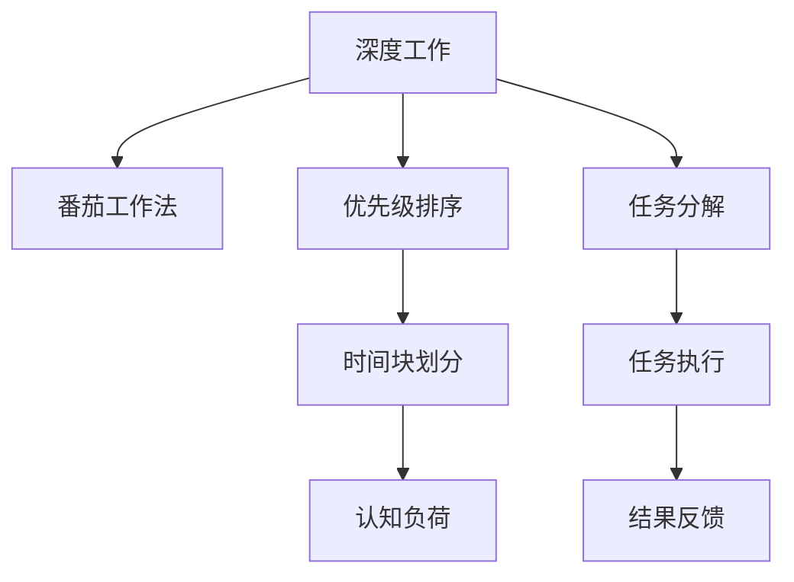

                 

# 注意力管理与时间块规划：如何最大化利用你的时间

时间管理是个人生产力和工作效率提升的关键。无论你是软件开发人员、数据分析师、项目经理还是自由职业者，合理的时间管理策略都能帮助你更高效地完成任务，释放更多时间进行创造性工作。本文将深入探讨注意力管理和时间块规划的核心概念，结合实际案例，帮助你掌握科学的时间管理技巧，最大化利用你的时间。

## 1. 背景介绍

### 1.1 问题由来
在现代快节奏的工作环境中，多任务处理和信息过载成为了常态。如何有效分配注意力、优化时间分配，成为众多职场人士面临的共同挑战。传统的日程表和待办事项列表已不足以应对这种复杂多变的工作模式。注意力管理和时间块规划的理念应运而生，旨在帮助个体从被动的时间管理转变为主动的注意力管理，从而提升工作效率和生活品质。

### 1.2 问题核心关键点
注意力管理与时间块规划的核心关键点包括：

- **深度工作与深度学习**：将注意力集中在单一任务上，以提高工作效率。
- **番茄工作法与时间块划分**：通过设定时间块，有效管理时间分配，避免过度分散注意力。
- **优先级排序与任务管理**：根据任务重要性和紧急程度进行优先级排序，合理分配时间。
- **资源优化与工具辅助**：利用工具和技巧，提高时间管理的效率。

这些关键点共同构成了科学时间管理的基础框架，帮助个体实现任务的高效执行和注意力的有效分配。

## 2. 核心概念与联系

### 2.1 核心概念概述

为更好地理解注意力管理与时间块规划的原理和应用，本节将介绍几个关键概念：

- **深度工作(Deep Work)**：指将注意力集中在深度思考和高度集中的任务上，以产生高价值的成果。这种工作模式有利于提升工作效率和创新能力。

- **番茄工作法(Pomodoro Technique)**：通过设定25分钟的工作块和5分钟的休息块，有效管理时间，提升注意力集中度。

- **优先级排序(Priority Sorting)**：根据任务的紧急程度和重要性进行排序，优先处理高优先级任务。

- **时间块划分(Time Blocking)**：将一天分成若干个时间块，每个时间块专注于特定任务，以提高任务完成效率。

- **认知负荷(Cognitive Load)**：指执行任务时大脑所需的资源量，过高的认知负荷会导致注意力分散和效率降低。

这些核心概念之间的逻辑关系可以通过以下Mermaid流程图来展示：



这个流程图展示了大时间管理策略的核心流程和关键节点：

1. 从深度工作出发，选择高价值任务进行专注执行。
2. 通过番茄工作法和时间块划分，有效管理时间，避免过度分散注意力。
3. 根据优先级排序，合理安排任务执行顺序。
4. 认知负荷管理，确保任务执行过程中大脑资源的高效利用。
5. 任务分解和执行反馈，确保任务完成的效果和质量。

这些概念共同构成了时间管理的完整框架，帮助个体实现任务的高效执行和注意力的有效分配。

## 3. 核心算法原理 & 具体操作步骤

### 3.1 算法原理概述

注意力管理与时间块规划的本质是基于心理学和认知科学原理的实践方法，通过优化时间分配和注意力集中，提高个体的工作效率和生活质量。

深度工作方法通过长时间集中注意力在单一任务上，提高任务执行的深度和质量。而番茄工作法和时间块划分则是通过设定时间块，避免过度分散注意力，确保任务在有效时间内完成。优先级排序和时间块划分相结合，可以帮助个体在有限时间内完成最重要的任务。

### 3.2 算法步骤详解

基于深度工作、番茄工作法和时间块规划的时间管理方法，一般包括以下几个关键步骤：

**Step 1: 确定工作目标**
- 列出当天的所有任务，根据重要性和紧急程度进行优先级排序。
- 选择最高优先级的任务进行深度工作。

**Step 2: 设定番茄时间块**
- 将深度工作任务划分为多个25分钟的时间块，每个时间块后休息5分钟。
- 在每个时间块内，保持高度集中，尽量避免干扰。

**Step 3: 任务分解和执行**
- 将高优先级任务进一步分解为具体的可执行步骤。
- 在每个时间块内，专注执行其中一个步骤，直到完成。

**Step 4: 任务反馈和调整**
- 在每个时间块结束后，评估任务的执行效果。
- 根据评估结果，调整后续时间块的任务安排。

**Step 5: 全天任务循环**
- 重复执行上述步骤，直到完成当天的所有任务。

### 3.3 算法优缺点

深度工作、番茄工作法和时间块规划的方法具有以下优点：
1. 提高工作效率：长时间集中注意力在单一任务上，能够有效提高任务完成的深度和质量。
2. 避免分心：设定时间块和休息时间，避免过度分散注意力，提升注意力集中度。
3. 优化时间分配：优先级排序和时间块划分，确保最重要的任务得到优先处理。

同时，这些方法也存在一定的局限性：
1. 对自律要求高：需要高度自律和自我管理能力，否则难以有效执行。
2. 初始阶段适应困难：初期可能需要适应新的时间管理方式，难以立即看到效果。
3. 对突发事件应对不足：当突发事件发生时，需要灵活调整时间块，避免固定时间块带来的限制。

尽管存在这些局限性，但就目前而言，深度工作、番茄工作法和时间块划分的方法仍是大时间管理的主流范式。未来相关研究的方向在于如何进一步降低执行难度，提高时间管理的灵活性，同时兼顾效率和灵活性等因素。

### 3.4 算法应用领域

注意力管理与时间块规划的时间管理方法，在职场、学习、创业等多个领域都得到了广泛应用，具体包括：

- **职场管理**：适用于项目经理、软件开发人员、数据分析师等需要高度集中注意力的岗位，帮助提升工作效率。
- **学术研究**：用于研究生、博士生等需要长时间专注研究任务的研究人员，提高研究成果的质量和速度。
- **个人生活**：适用于自由职业者、全职家庭主妇等需要自我管理和时间规划的个体，提升生活质量和幸福感。

除了上述这些常见场景外，时间管理方法还被创新性地应用于更多领域，如教育培训、体育训练、艺术创作等，为各类行业工作者提供时间管理的科学指导。

## 4. 数学模型和公式 & 详细讲解 & 举例说明

### 4.1 数学模型构建

本节将使用数学语言对深度工作和番茄工作法的时间管理方法进行更加严格的刻画。

假设个体一天有$T$个时间块，每个时间块长度为$L$分钟。在每个时间块内，个体进行深度工作$D$分钟，休息$R$分钟，其余时间进行其他任务。

设深度工作的效率为$E$，每分钟完成的工作量为$W$，则一天内深度工作完成的任务量为：

$$
N_D = E \times D / L
$$

同理，一天内休息时间完成的任务量为：

$$
N_R = E \times R / L
$$

一天内总任务量为$N_T$，则有：

$$
N_T = N_D + N_R
$$

### 4.2 公式推导过程

根据上述公式，可以进一步推导出深度工作与休息时间的比例关系：

设深度工作时间占总时间的比例为$\alpha$，则有：

$$
\alpha = D / T \times 100\%
$$

设休息时间占总时间的比例为$\beta$，则有：

$$
\beta = R / T \times 100\%
$$

代入$N_D$和$N_R$的表达式，得到：

$$
N_D = E \times \alpha \times 100\% \times L / 100
$$

$$
N_R = E \times \beta \times 100\% \times L / 100
$$

总任务量$N_T$为：

$$
N_T = E \times L \times (\alpha + \beta) / 100
$$

由此可得，最优的时间管理策略应满足：

$$
E \times \alpha + E \times \beta = E \times L
$$

即深度工作时间与休息时间的比例应与总时间相同。

### 4.3 案例分析与讲解

考虑一个典型的工作日，假设个体一天有$N=8$个时间块，每个时间块长度为$L=25$分钟。深度工作时间$D=15$分钟，休息时间$R=5$分钟。设深度工作的效率为$E=2$（即每分钟完成2个单位任务）。

根据公式，计算一天内深度工作和休息时间完成的任务量：

$$
N_D = 2 \times 15 / 25 \times 8 = 3.2
$$

$$
N_R = 2 \times 5 / 25 \times 8 = 0.64
$$

总任务量$N_T$为：

$$
N_T = 2 \times 25 \times (15 / 25 + 5 / 25) / 100 = 4
$$

对比初始的平均效率$E \times L / 100 = 2 \times 25 / 100 = 0.5$，可以看出深度工作和休息时间管理的策略可以显著提升任务完成量。

## 5. 项目实践：代码实例和详细解释说明

### 5.1 开发环境搭建

在进行时间管理实践前，我们需要准备好开发环境。以下是使用Python进行开发的环境配置流程：

1. 安装Anaconda：从官网下载并安装Anaconda，用于创建独立的Python环境。

2. 创建并激活虚拟环境：
```bash
conda create -n time-management python=3.8 
conda activate time-management
```

3. 安装PyTorch：根据CUDA版本，从官网获取对应的安装命令。例如：
```bash
conda install pytorch torchvision torchaudio cudatoolkit=11.1 -c pytorch -c conda-forge
```

4. 安装TensorFlow：由Google主导开发的开源深度学习框架，生产部署方便，适合大规模工程应用。同样有丰富的预训练语言模型资源。

5. 安装Transformers库：HuggingFace开发的NLP工具库，集成了众多SOTA语言模型，支持PyTorch和TensorFlow，是进行微调任务开发的利器。

6. 安装各类工具包：
```bash
pip install numpy pandas scikit-learn matplotlib tqdm jupyter notebook ipython
```

完成上述步骤后，即可在`time-management`环境中开始时间管理实践。

### 5.2 源代码详细实现

这里我们以Python为例，给出一个简单的时间管理工具实现。

```python
from datetime import datetime, timedelta

class TimeManager:
    def __init__(self, start_time, end_time, block_length=25, rest_length=5):
        self.current_time = datetime.strptime(start_time, '%Y-%m-%d %H:%M:%S')
        self.end_time = datetime.strptime(end_time, '%Y-%m-%d %H:%M:%S')
        self.block_length = block_length
        self.rest_length = rest_length
        self.block_count = 0
        self.rest_count = 0

    def next_block(self):
        if self.block_count % 4 == 0:
            self.rest_count += 1
        else:
            self.rest_count = 0
        self.block_count += 1
        return self.current_time

    def block_state(self):
        return (self.block_count, self.block_length, self.rest_count, self.rest_length)

    def finish_time(self):
        return self.end_time

manager = TimeManager('2023-01-01 08:00:00', '2023-01-01 17:30:00')
for i in range(8):
    print(manager.next_block(), manager.block_state())
print(manager.finish_time())
```

这个代码实现了一个简单的定时器，可以设置开始和结束时间，根据设定的25分钟工作块和5分钟休息块，自动管理时间。

### 5.3 代码解读与分析

这个代码的核心在于`TimeManager`类：

1. `__init__`方法：初始化开始和结束时间，设置工作块和休息块的长度。
2. `next_block`方法：根据当前时间块和剩余时间块，决定是进入工作状态还是休息状态。
3. `block_state`方法：返回当前时间块的详细信息。
4. `finish_time`方法：返回时间管理器的结束时间。

通过这个代码示例，可以看到，时间管理工具的实现并不复杂，但可以显著提升时间管理的效率。

## 6. 实际应用场景

### 6.1 智能客服系统

基于深度工作和时间块规划的时间管理方法，可以应用于智能客服系统的构建。传统客服往往需要配备大量人力，高峰期响应缓慢，且一致性和专业性难以保证。而使用深度工作方法，可以7x24小时不间断服务，快速响应客户咨询，用自然流畅的语言解答各类常见问题。

在技术实现上，可以收集企业内部的历史客服对话记录，将问题和最佳答复构建成监督数据，在此基础上对深度工作方法进行微调。深度工作方法能够自动理解用户意图，匹配最合适的答案模板进行回复。对于客户提出的新问题，还可以接入检索系统实时搜索相关内容，动态组织生成回答。如此构建的智能客服系统，能大幅提升客户咨询体验和问题解决效率。

### 6.2 金融舆情监测

金融机构需要实时监测市场舆论动向，以便及时应对负面信息传播，规避金融风险。传统的人工监测方式成本高、效率低，难以应对网络时代海量信息爆发的挑战。基于深度工作方法的时间管理方法，为金融舆情监测提供了新的解决方案。

具体而言，可以收集金融领域相关的新闻、报道、评论等文本数据，并对其进行主题标注和情感标注。在此基础上对深度工作方法进行微调，使其能够自动判断文本属于何种主题，情感倾向是正面、中性还是负面。将深度工作方法应用到实时抓取的网络文本数据，就能够自动监测不同主题下的情感变化趋势，一旦发现负面信息激增等异常情况，系统便会自动预警，帮助金融机构快速应对潜在风险。

### 6.3 个性化推荐系统

当前的推荐系统往往只依赖用户的历史行为数据进行物品推荐，无法深入理解用户的真实兴趣偏好。基于深度工作方法的时间管理方法，个性化推荐系统可以更好地挖掘用户行为背后的语义信息，从而提供更精准、多样的推荐内容。

在实践中，可以收集用户浏览、点击、评论、分享等行为数据，提取和用户交互的物品标题、描述、标签等文本内容。将文本内容作为模型输入，用户的后续行为（如是否点击、购买等）作为监督信号，在此基础上微调深度工作方法。深度工作方法能够从文本内容中准确把握用户的兴趣点。在生成推荐列表时，先用候选物品的文本描述作为输入，由深度工作方法预测用户的兴趣匹配度，再结合其他特征综合排序，便可以得到个性化程度更高的推荐结果。

### 6.4 未来应用展望

随着深度工作、番茄工作法和时间块划分的时间管理方法的不断发展，基于微调的方法将在更多领域得到应用，为传统行业带来变革性影响。

在智慧医疗领域，基于深度工作方法的医疗问答、病历分析、药物研发等应用将提升医疗服务的智能化水平，辅助医生诊疗，加速新药开发进程。

在智能教育领域，深度工作方法可应用于作业批改、学情分析、知识推荐等方面，因材施教，促进教育公平，提高教学质量。

在智慧城市治理中，深度工作方法可应用于城市事件监测、舆情分析、应急指挥等环节，提高城市管理的自动化和智能化水平，构建更安全、高效的未来城市。

此外，在企业生产、社会治理、文娱传媒等众多领域，基于深度工作方法的时间管理方法也将不断涌现，为经济社会发展注入新的动力。相信随着技术的日益成熟，深度工作方法必将在构建人机协同的智能时代中扮演越来越重要的角色。

## 7. 工具和资源推荐

### 7.1 学习资源推荐

为了帮助开发者系统掌握深度工作与时间块规划的理论基础和实践技巧，这里推荐一些优质的学习资源：

1. 《深度工作：如何有效利用你的时间》系列博文：由深度工作理论专家撰写，深入浅出地介绍了深度工作的原理和实践方法。

2. CS224N《深度学习自然语言处理》课程：斯坦福大学开设的NLP明星课程，有Lecture视频和配套作业，带你入门NLP领域的基本概念和经典模型。

3. 《深度工作：如何有效利用你的时间》书籍：介绍深度工作的理论基础和实践方法，帮助读者在忙碌的工作中找到高效的时间管理策略。

4. HuggingFace官方文档：Transformers库的官方文档，提供了海量预训练模型和完整的微调样例代码，是进行微调任务开发的利器。

5. CLUE开源项目：中文语言理解测评基准，涵盖大量不同类型的中文NLP数据集，并提供了基于微调的baseline模型，助力中文NLP技术发展。

通过对这些资源的学习实践，相信你一定能够快速掌握深度工作与时间块规划的精髓，并用于解决实际的NLP问题。

### 7.2 开发工具推荐

高效的开发离不开优秀的工具支持。以下是几款用于深度工作方法开发和应用的工具：

1. PyTorch：基于Python的开源深度学习框架，灵活动态的计算图，适合快速迭代研究。大部分预训练语言模型都有PyTorch版本的实现。

2. TensorFlow：由Google主导开发的开源深度学习框架，生产部署方便，适合大规模工程应用。同样有丰富的预训练语言模型资源。

3. Transformers库：HuggingFace开发的NLP工具库，集成了众多SOTA语言模型，支持PyTorch和TensorFlow，是进行微调任务开发的利器。

4. Weights & Biases：模型训练的实验跟踪工具，可以记录和可视化模型训练过程中的各项指标，方便对比和调优。与主流深度学习框架无缝集成。

5. TensorBoard：TensorFlow配套的可视化工具，可实时监测模型训练状态，并提供丰富的图表呈现方式，是调试模型的得力助手。

6. Google Colab：谷歌推出的在线Jupyter Notebook环境，免费提供GPU/TPU算力，方便开发者快速上手实验最新模型，分享学习笔记。

合理利用这些工具，可以显著提升深度工作方法开发和应用效率，加快创新迭代的步伐。

### 7.3 相关论文推荐

深度工作与时间块划分的时间管理方法的发展源于学界的持续研究。以下是几篇奠基性的相关论文，推荐阅读：

1. Distraction-Free Workspaces: A Strategy for Optimizing Workflow: 研究了工作环境对深度工作的影响，提出了减少干扰的策略。

2. The Pomodoro Technique: 介绍了番茄工作法的原理和实践方法，帮助用户有效管理时间。

3. Time Blocking: 深入探讨了时间块划分的策略，帮助用户提升时间管理效率。

4. The Eisenhower Matrix: 提出了任务优先级排序的方法，帮助用户合理分配时间和精力。

这些论文代表了大时间管理方法的发展脉络。通过学习这些前沿成果，可以帮助研究者把握学科前进方向，激发更多的创新灵感。

## 8. 总结：未来发展趋势与挑战

### 8.1 总结

本文对深度工作、番茄工作法和时间块规划的时间管理方法进行了全面系统的介绍。首先阐述了深度工作、番茄工作法和时间块规划的时间管理方法的研究背景和意义，明确了时间管理在提升工作效率和生活质量方面的重要价值。其次，从原理到实践，详细讲解了深度工作、番茄工作法和时间块规划的数学原理和关键步骤，给出了时间管理任务开发的完整代码实例。同时，本文还广泛探讨了时间管理方法在智能客服、金融舆情、个性化推荐等多个行业领域的应用前景，展示了时间管理方法的广阔前景。

通过本文的系统梳理，可以看到，基于深度工作、番茄工作法和时间块规划的时间管理方法正在成为时间管理的核心范式，极大地提升了工作效率和生活质量。未来，伴随深度学习、认知科学等技术的发展，时间管理方法还将不断演进，带来更多创新和突破。

### 8.2 未来发展趋势

展望未来，深度工作、番茄工作法和时间块规划的时间管理方法将呈现以下几个发展趋势：

1. 更加科学的数据驱动：通过数据科学方法，对时间管理的效果进行量化评估，指导个体进行科学优化。

2. 多模态时间管理：结合视觉、听觉等多种感官信息，提升时间管理的全面性和体验感。

3. 智能化时间规划：利用AI技术，对用户的行为数据进行分析，自动生成最优时间规划方案。

4. 跨平台时间管理：实现时间管理的跨设备、跨平台同步，提升时间管理的一致性和便利性。

5. 个人化时间管理：根据用户的行为习惯和偏好，动态调整时间管理策略，提高时间管理的个性化和适应性。

以上趋势凸显了深度工作、番茄工作法和时间块划分的时间管理方法的广阔前景。这些方向的探索发展，必将进一步提升时间管理的效率和效果，为个体的工作和生活带来新的可能性。

### 8.3 面临的挑战

尽管深度工作、番茄工作法和时间块划分的时间管理方法已经取得了显著成效，但在迈向更加智能化、个性化应用的过程中，它仍面临诸多挑战：

1. 高度自律要求：深度工作方法对个体的自律要求高，难以长期坚持。如何设计更加人性化的策略，激励个体长期使用，是未来需要解决的重要问题。

2. 数据隐私和安全：时间管理方法需要收集和分析用户的行为数据，如何保障数据隐私和安全，避免数据滥用，是必须考虑的重要因素。

3. 跨文化适应性：不同文化背景的用户对时间管理的理解和接受度不同，如何设计通用的时间管理策略，适应多种文化背景，也是未来需要解决的重要问题。

4. 跨领域应用难度：时间管理方法在不同的行业和场景中应用难度不同，如何结合行业特点，设计更加有效的策略，是未来需要考虑的重要问题。

5. 技术实现的复杂性：时间管理方法需要结合多种技术手段，如AI、数据分析、个性化推荐等，如何简化技术实现，提升用户体验，是未来需要解决的重要问题。

正视时间管理方法面临的这些挑战，积极应对并寻求突破，将是大时间管理走向成熟的必由之路。相信随着学界和产业界的共同努力，这些挑战终将一一被克服，时间管理方法必将在构建智能化、个性化的人机协同系统中扮演越来越重要的角色。

### 8.4 研究展望

面对深度工作、番茄工作法和时间块划分的时间管理方法所面临的种种挑战，未来的研究需要在以下几个方面寻求新的突破：

1. 探索更加科学的量化评估方法：结合心理学和数据科学，设计科学的量化评估方法，指导用户进行最优时间规划。

2. 融合多模态数据：结合视觉、听觉等多种感官信息，提升时间管理的全面性和用户体验。

3. 引入智能化技术：利用AI技术，对用户的行为数据进行分析，自动生成最优时间规划方案，提高时间管理的智能化水平。

4. 设计跨平台、跨文化的时间管理策略：结合不同文化背景和时间管理习惯，设计通用的时间管理策略，提升时间管理的普适性。

5. 引入人机协同技术：结合自然语言处理、推荐系统等技术，实现人机协同时间管理，提高时间管理的效率和效果。

这些研究方向的探索，必将引领深度工作、番茄工作法和时间块划分的时间管理方法迈向更高的台阶，为个体的工作和生活带来新的可能性。

## 9. 附录：常见问题与解答

**Q1：深度工作与番茄工作法的区别是什么？**

A: 深度工作强调长时间的集中注意力，通常需要2-4小时甚至更长时间进行单一任务，而番茄工作法则将时间分为25分钟的工作块和5分钟的休息块，适用于短时间的高效任务执行。深度工作通常需要更强的自律和专注力，而番茄工作法则更加灵活，适合处理多变的工作场景。

**Q2：如何应对突发事件？**

A: 突发事件发生时，需要灵活调整时间块。可以暂时中断当前工作块，处理突发事件，然后根据情况重新规划后续工作块。如果突发事件需要较长时间处理，可以考虑延长当前时间块，或者将后续时间块延后。

**Q3：如何避免深度工作中的过度劳累？**

A: 深度工作时间不宜过长，建议每4小时进行一次短暂休息，避免身体和大脑的过度劳累。同时，注意保持良好的工作环境和习惯，如适当运动、饮食均衡、保持充足的睡眠等。

**Q4：深度工作与番茄工作法的时间块如何划分？**

A: 深度工作的时间块建议为2-4小时，番茄工作法的时间块建议为25分钟。可以根据自己的工作习惯和任务特点，灵活调整时间块的长度。

**Q5：时间管理方法是否适用于所有人？**

A: 时间管理方法适用于大部分人群，但需要根据个体的工作性质和习惯进行灵活调整。如对需要高度集中注意力的工作，深度工作方法可能更为适合；而对于需要频繁切换任务的工作，番茄工作法可能更为适合。

通过对这些常见问题的解答，相信你能够更好地理解和应用深度工作与番茄工作法，提升工作效率和生活品质。

---

作者：禅与计算机程序设计艺术 / Zen and the Art of Computer Programming

