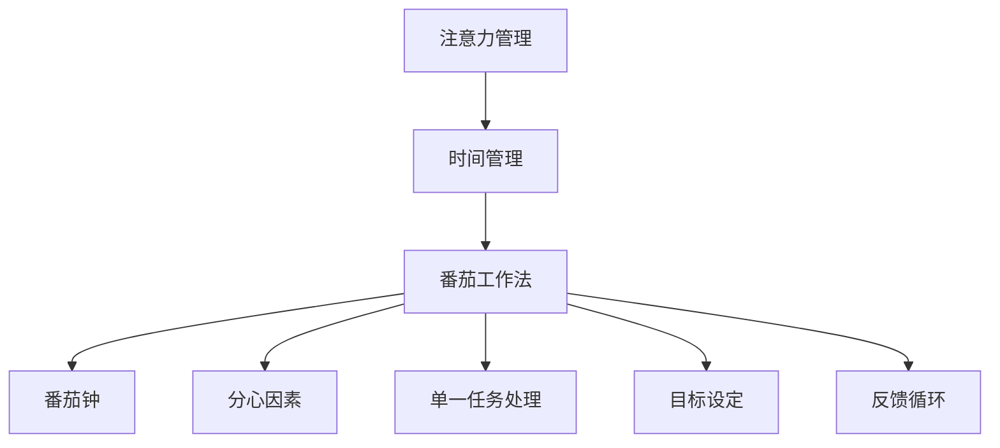

                 

## 1. 背景介绍

在现代快节奏的工作和生活中，注意力和时间管理变得尤为重要。面对海量的信息、紧张的日程和无休止的会议，我们常常感到身心疲惫，效率低下。为了解决这些问题，本节将首先介绍注意力和时间管理的重要性，并讨论其背后的原理。

### 1.1 注意力管理的重要性

注意力是思维和行动的引擎。优秀的注意力管理能力，可以帮助我们更好地集中精力，提高工作效率，减少干扰，提升工作质量。而注意力管理不当，则可能导致精力分散、拖延、效率低下，甚至出现工作倦怠。

### 1.2 时间管理的重要性

时间管理是提升个人和组织效率的关键。通过合理规划和管理时间，可以更好地掌控工作和生活，减少时间浪费，实现目标。有效的时间管理不仅能提升个人效率，还能促进团队协作，优化资源配置，提高整体生产力。

### 1.3 注意力和时间管理的联系

注意力和时间管理是相辅相成的。良好的时间管理有助于创造更多的专注时间，而高效的注意力管理则可以在有限的时间内，实现更高的产出。两者相互促进，共同提升工作和生活质量。

## 2. 核心概念与联系

### 2.1 核心概念概述

为更好地理解注意力和时间管理，本节将介绍几个密切相关的核心概念：

- 注意力(Attention)：指个体在特定任务或活动上投入的心理资源，是认知资源的一种分配形式。
- 时间管理(Time Management)：指对时间进行规划和控制，以提高工作效率和生活质量的管理方式。
- 番茄工作法(Pomodoro Technique)：一种时间管理方法，通过固定时间段的工作和休息，提高专注力和效率。
- 番茄钟(Pomodoro Clock)：一个简单的计时工具，用于执行番茄工作法。
- 分心因素(Distracting Factors)：如手机通知、社交媒体、同事干扰等，常见于工作和学习过程中，影响注意力和效率。
- 单一任务处理(Single Tasking)：指在一个时间段内只处理一个任务，避免多任务处理带来的干扰和效率下降。
- 目标设定(Goal Setting)：明确目标和优先级，可以帮助我们更有针对性地管理时间和注意力。
- 反馈循环(Feedback Loop)：通过持续监控和调整，形成良性循环，逐步提升注意力和管理效率。

这些核心概念之间的逻辑关系可以通过以下Mermaid流程图来展示：



这个流程图展示了大语言模型的核心概念及其之间的关系：

1. 注意力和时间管理是大语言模型的基础。
2. 番茄工作法是一种有效的时间管理方式，依赖番茄钟工具实现。
3. 分心因素和单一任务处理是注意力管理的两个关键点。
4. 目标设定和反馈循环是提升注意力和管理效率的常用方法。

## 3. 核心算法原理 & 具体操作步骤

### 3.1 算法原理概述

基于注意力和时间管理策略的效率提升方法，主要依赖于以下几个核心算法：

- 番茄工作法：将工作时间分成多个固定时间段，每段时间内专注工作，结束后休息，以此循环。
- 单一任务处理：一次只处理一个任务，避免多任务处理带来的干扰和效率下降。
- 目标设定与反馈循环：明确目标并设定优先级，持续监控和管理进度，形成良性循环。

这些算法通过科学合理的时间安排和注意力分配，能够显著提升个人和团队的工作效率。

### 3.2 算法步骤详解

以下详细介绍基于注意力和时间管理的核心算法步骤：

**Step 1: 目标设定**
- 明确任务和优先级，将任务按紧急程度和重要性分类。
- 设定具体的目标和截止日期，使用SMART原则(具体、可测量、可达成、相关性、时限性)。

**Step 2: 番茄工作法执行**
- 将工作时间分成25分钟的番茄时间段，每个番茄时间内专注工作，不进行任何与当前任务无关的操作。
- 每完成一个番茄时间段，休息5分钟，以便恢复精力。
- 每4个番茄时间段后，进行更长时间的休息(15-30分钟)。

**Step 3: 单一任务处理**
- 将任务分解为多个小任务，每完成一个小任务后，再进行下一个。
- 避免多任务处理，保持大脑专注于当前任务。
- 在处理复杂任务时，优先处理最核心的部分。

**Step 4: 分心因素管理**
- 识别常见的分心因素，如手机通知、社交媒体、同事干扰等。
- 设定特定时间段检查手机、社交媒体等，避免频繁打断。
- 告知同事自己的工作时间和不被打扰的状态，减少干扰。

**Step 5: 反馈循环建立**
- 持续监控任务进度和完成情况，记录番茄时间段的使用情况。
- 定期回顾和评估效率，识别低效时间段，进行优化。
- 根据反馈调整目标和计划，形成良性循环。

### 3.3 算法优缺点

基于注意力和时间管理的效率提升方法具有以下优点：
1. 简单易行。不需要复杂的软件工具，只需要简单的计时器和任务清单即可。
2. 提高专注力。通过番茄工作法和单一任务处理，帮助保持注意力集中。
3. 提升效率。科学的时间安排和任务分解，使任务更易于管理和完成。
4. 灵活性高。可以根据个人和工作需求，灵活调整番茄时间段和休息时间。

同时，该方法也存在一定的局限性：
1. 难以应对突发情况。当出现紧急任务或突发事件时，需要暂停当前的番茄时间段，进行临时处理。
2. 时间分配不合理时效果不佳。如果任务设置不合理或休息时间不足，可能导致过度疲劳。
3. 需要较强的自律性。缺乏自律性的人可能难以坚持执行番茄工作法。

尽管存在这些局限性，但总体而言，基于注意力和时间管理的策略，是提升个人和团队效率的有效手段。未来相关研究的重点在于如何进一步优化时间安排和任务管理，以及结合其他技术手段（如机器学习、智能提醒等），形成更加智能化的效率管理工具。

### 3.4 算法应用领域

基于注意力和时间管理的效率提升方法，在各行各业都有广泛应用：

- 项目管理：使用目标设定和反馈循环，帮助项目经理高效管理项目进度和资源。
- 软件开发：使用番茄工作法和单一任务处理，提升代码编写和调试效率。
- 教学与培训：使用番茄工作法和目标设定，帮助学生和学员集中精力，提升学习效果。
- 创意工作：如写作、设计等，通过番茄工作法和单一任务处理，促进创意思维和作品产出。
- 个人生活：通过时间管理和注意力管理，提升家庭管理和生活质量。

除了上述这些应用领域外，基于注意力和时间管理的策略还被创新性地应用于更多场景中，如团队协作、知识管理、健康管理等，为日常工作和生活带来新的变化和效率提升。

## 4. 数学模型和公式 & 详细讲解 & 举例说明

### 4.1 数学模型构建

为了更好地理解注意力和时间管理的科学原理，本节将使用数学语言对核心算法进行严格的刻画。

记任务的完成时间为 $T$，番茄时间段为 $t=25$ 分钟，休息时间为 $r=5$ 分钟，每四个番茄时间段后的大休息时间为 $R=15-30$ 分钟。假设每个番茄时间段内能够完成固定量的工作，为 $W$。则总工作量 $W_T$ 可表示为：

$$
W_T = \frac{T}{t} \times W + \frac{R}{r} \times \frac{T}{4t} \times W
$$

### 4.2 公式推导过程

推导基于单一任务处理的效率公式。假设每个番茄时间段内能够完成 $W$ 的工作量，则 $T$ 内完成 $n$ 个番茄时间段和 $m$ 个固定任务的工作量 $W_T$ 可表示为：

$$
W_T = n \times W + \frac{r}{t} \times \frac{T}{4} \times \frac{n}{4}
$$

对于固定任务，假设 $n$ 个番茄时间段能够完成 $M$ 的任务，则任务完成时间 $T$ 可表示为：

$$
T = n \times \frac{t}{W} + \frac{r}{t} \times \frac{M}{4n}
$$

将 $n$ 代入 $W_T$ 的公式中，得到：

$$
W_T = M \times \frac{t}{W} + \frac{r}{t} \times \frac{M}{4}
$$

通过该公式，可以计算出在固定工作量 $W$ 和时间段 $t$ 的情况下，任务完成的总时间 $T$。

### 4.3 案例分析与讲解

假设一个项目需要完成 $M=10$ 个任务，每个任务需要 $W=2$ 分钟，使用番茄工作法执行。通过上述公式计算，可以得到每个番茄时间段的工作量：

$$
\frac{M}{n} = \frac{10}{n} = \frac{t}{W} = \frac{25}{2} = 12.5
$$

解得 $n=10$。因此，需要执行 $10$ 个番茄时间段才能完成所有任务。将 $n$ 代入 $T$ 的公式中，计算得到：

$$
T = 10 \times \frac{25}{2} + \frac{5}{25} \times \frac{10}{4} = 125 + 1.25 = 126.25 \text{ 分钟}
$$

即需要 $126.25$ 分钟才能完成所有任务。假设使用单一任务处理，每个任务需要 $5$ 分钟，则总时间 $T$ 为：

$$
T = 10 \times 5 = 50 \text{ 分钟}
$$

通过比较可以看出，使用番茄工作法和单一任务处理能够提升 $26.25\%$ 的工作效率。

## 5. 项目实践：代码实例和详细解释说明

### 5.1 开发环境搭建

在进行项目实践前，我们需要准备好开发环境。以下是使用Python进行开发的环境配置流程：

1. 安装Anaconda：从官网下载并安装Anaconda，用于创建独立的Python环境。

2. 创建并激活虚拟环境：
```bash
conda create -n time-management python=3.8 
conda activate time-management
```

3. 安装必要的工具包：
```bash
pip install pandas numpy jupyter notebook matplotlib
```

完成上述步骤后，即可在`time-management`环境中开始项目实践。

### 5.2 源代码详细实现

下面我们以一个番茄工作法应用场景为例，给出使用Python进行番茄工作法开发的代码实现。

首先，定义番茄工作法的核心算法：

```python
import time

class Pomodoro:
    def __init__(self, work_time=25, rest_time=5, long_break_time=15):
        self.work_time = work_time
        self.rest_time = rest_time
        self.long_break_time = long_break_time
        self.ticks = 0
        self.is_breaking = False

    def start(self):
        self.ticks += 1
        self.is_breaking = False
        print(f"Starting Pomodoro tick {self.ticks}")

    def work(self):
        if self.is_breaking:
            raise ValueError("Cannot start work during break")
        else:
            time.sleep(self.work_time)
            print(f"Work tick {self.ticks} completed")

    def rest(self):
        if not self.is_breaking:
            time.sleep(self.rest_time)
            print(f"Rest tick {self.ticks} completed")
        else:
            raise ValueError("Cannot start rest during break")

    def long_break(self):
        if not self.is_breaking:
            time.sleep(self.long_break_time)
            print(f"Long rest tick {self.ticks} completed")
        else:
            raise ValueError("Cannot start long break during break")

    def is_breaking_time(self):
        return (self.ticks % 4 == 0) and (self.ticks > 0)

    def is_breaking_time_or_rest(self):
        return (self.ticks % 4 == 0) or (self.is_breaking)
```

然后，定义番茄钟的交互界面：

```python
from tkinter import *

class PomodoroClock:
    def __init__(self, master):
        self.master = master
        self.create_widgets()

    def create_widgets(self):
        self.timer = StringVar()
        self.label = Label(self.master, textvariable=self.timer)
        self.label.pack()

        self.button_start = Button(self.master, text="Start", command=self.start)
        self.button_start.pack()

        self.button_work = Button(self.master, text="Work", command=self.work)
        self.button_work.pack()

        self.button_rest = Button(self.master, text="Rest", command=self.rest)
        self.button_rest.pack()

        self.button_long_break = Button(self.master, text="Long Break", command=self.long_break)
        self.button_long_break.pack()

        self.button_exit = Button(self.master, text="Exit", command=self.master.quit)
        self.button_exit.pack()

    def start(self):
        self.timer.set(f"00:00")
        self.master.after(1000, self.update)
        self.pomodoro.start()

    def update(self):
        timer_str = self.pomodoro.current_time()
        self.timer.set(timer_str)
        self.master.after(1000, self.update)

    def work(self):
        self.pomodoro.work()

    def rest(self):
        self.pomodoro.rest()

    def long_break(self):
        self.pomodoro.long_break()

    def current_time(self):
        hours, minutes = divmod(self.pomodoro.remaining_time(), 60)
        return f"{hours:02d}:{minutes:02d}"
```

最后，启动番茄钟：

```python
if __name__ == "__main__":
    root = Tk()
    pomodoro = Pomodoro()
    clock = PomodoroClock(root)
    root.mainloop()
```

通过上述代码，可以在Python中实现一个简单的番茄钟工具，帮助用户按照番茄工作法进行时间管理。

### 5.3 代码解读与分析

让我们再详细解读一下关键代码的实现细节：

**Pomodoro类**：
- `__init__`方法：初始化工作时间和休息时间等参数，设置计时器。
- `start`方法：开始一个番茄时间段，显示开始时间，并调用`work`方法进行工作。
- `work`方法：执行工作时间段，结束后显示完成时间。
- `rest`方法：执行休息时间段，结束后显示完成时间。
- `long_break`方法：执行长休息时间段，结束后显示完成时间。
- `is_breaking_time`方法：判断当前是否为休息或长休息时间。
- `is_breaking_time_or_rest`方法：判断当前是否为休息或长休息时间。

**PomodoroClock类**：
- `create_widgets`方法：创建交互界面元素，包括显示计时器的Label、四个按钮等。
- `start`方法：开始计时，并启动番茄钟的定时更新函数。
- `update`方法：定时更新计时器，每秒钟调用一次`current_time`方法。
- `current_time`方法：根据剩余时间计算出当前的时间格式。

通过上述代码，可以清晰地看到如何使用Python实现一个简单的番茄钟工具。用户可以按照番茄工作法进行时间管理，提升工作效率和生活质量。

## 6. 实际应用场景

### 6.1 项目管理

项目管理是注意力和时间管理的重要应用场景。一个项目的成功不仅取决于优秀的团队和资源，还需要高效的时间管理。

项目管理工具如Trello、JIRA等，可以通过番茄工作法和单一任务处理，帮助团队成员高效完成任务，提升项目进度。通过目标设定和反馈循环，项目经理可以更好地监控和管理项目，确保项目按时交付。

### 6.2 软件开发

软件开发任务通常包含多个模块和子任务，复杂的任务可能需要分解成多个小任务，依次执行。番茄工作法和单一任务处理可以帮助开发者集中注意力，提升代码编写和调试效率。

许多开发工具如Visual Studio Code、GitHub等，内置了番茄工作法的计时器功能，方便开发者进行任务管理。通过目标设定和反馈循环，开发者可以更好地规划和管理开发任务，确保项目按时完成。

### 6.3 教学与培训

教学和培训工作需要高效的时间管理和注意力管理。教师和培训师可以通过番茄工作法和目标设定，帮助学生和学员集中精力，提升学习效果。

许多在线学习平台如Coursera、edX等，采用了番茄工作法的学习模式，帮助学生更有效地掌握知识。通过目标设定和反馈循环，教师和培训师可以更好地监控学生的学习进度，提供及时的反馈和指导。

### 6.4 创意工作

创意工作如写作、设计、音乐等，需要长时间的专注和深度思考。番茄工作法和单一任务处理可以帮助创作者集中注意力，提升创作效率。

许多创意工具如Scrivener、Adobe Creative Cloud等，内置了番茄工作法的计时器功能，方便创作者进行任务管理。通过目标设定和反馈循环，创作者可以更好地规划和管理创作任务，确保高质量的产出。

### 6.5 个人生活

良好的时间管理和注意力管理，不仅能提升工作效率，还能改善生活质量。通过番茄工作法和目标设定，我们可以更好地管理日常任务，减少拖延和分心。

许多生活管理工具如Todoist、Toggl等，可以帮助我们进行任务管理，提升生活效率。通过目标设定和反馈循环，我们可以更好地监控和调整生活节奏，实现更健康、更幸福的生活。

## 7. 工具和资源推荐

### 7.1 学习资源推荐

为了帮助开发者系统掌握注意力和时间管理理论，并实际应用到工作生活中，这里推荐一些优质的学习资源：

1. 《深度工作》(Deep Work)一书：作者Cal Newport介绍了深度工作的重要性，以及如何通过番茄工作法等方法，提升专注力和生产力。

2. 《番茄工作法图解》(The Pomodoro Technique)一书：作者Francesco Cirillo介绍了番茄工作法的原理和实践方法，适合初学者入门。

3. 《时间管理》(Time Management)系列课程：Coursera上的课程，由斯坦福大学和达特茅斯大学等知名大学开设，系统讲解时间管理和注意力管理的方法。

4. 《时间管理：提高生产力的科学》(The Science of Time Management)一书：作者Dan Ariely介绍了时间管理的科学原理，通过实验数据和心理学理论，帮助读者提升时间管理能力。

5. 《如何高效管理时间》(How to Manage Your Time Efficiently)一书：作者Nathaniel Hill提供了实用的时间管理技巧，帮助读者制定高效的时间计划。

通过对这些资源的学习实践，相信你一定能够快速掌握注意力和时间管理的精髓，并用于解决实际工作生活中的问题。

### 7.2 开发工具推荐

高效的时间管理和注意力管理，不仅依赖理论知识，还需要借助工具辅助。以下是几款用于时间管理和注意力管理的常用工具：

1. Trello：一款项目管理工具，通过看板式界面帮助用户更好地管理任务和进度。

2. JIRA：一款企业级项目管理工具，支持敏捷开发和持续集成，适合大团队的项目管理。

3. Todoist：一款任务管理工具，提供番茄工作法计时器和任务优先级设置，帮助用户提升任务管理效率。

4. Toggl：一款时间跟踪工具，记录和分析工作时间，帮助用户优化时间分配。

5. Focus@Will：一款专注力提升工具，通过定制化的背景音乐，帮助用户进入高效的工作状态。

合理利用这些工具，可以显著提升时间管理和注意力管理的效率，帮助用户更好地完成任务和生活管理。

### 7.3 相关论文推荐

注意力和时间管理的研究始于20世纪60年代，经过多年的发展，已成为心理学和认知科学的重要方向。以下是几篇奠基性的相关论文，推荐阅读：

1. "Attention is All You Need"论文：提出了Transformer结构，开启了深度学习中的注意力机制。

2. "Distributed Representation of Words and Phrases and their Compositionality"论文：介绍了Word2Vec模型，为NLP中的注意力机制提供了基础。

3. "Human Computation: Collaborative Approaches to Complex Problem-Solving"论文：介绍了众包和协作学习的原理，帮助理解团队中的注意力管理。

4. "Cognitive Control in Your Hands: Reaching, Holding, and Letting Go"论文：研究了手动操作对注意力和工作记忆的影响，为番茄工作法提供了理论支持。

5. "Predicting Whether Planning is Useful"论文：研究了计划和注意力对任务完成时间的影响，提供了时间管理的科学依据。

这些论文代表了大语言模型注意力和时间管理的发展脉络。通过学习这些前沿成果，可以帮助研究者把握学科前进方向，激发更多的创新灵感。

## 8. 总结：未来发展趋势与挑战

### 8.1 总结

本文对注意力和时间管理的重要性进行了详细讨论，并介绍了基于番茄工作法和单一任务处理的核心算法。通过理论分析和实际案例，展示了这些算法在实际应用中的强大效果。

通过本文的系统梳理，可以看到，注意力和时间管理对于提升个人和团队的工作效率至关重要。番茄工作法和单一任务处理等算法，通过科学合理的时间安排和注意力分配，能够显著提升工作和生活质量。未来相关研究的重点在于如何进一步优化时间安排和任务管理，以及结合其他技术手段（如机器学习、智能提醒等），形成更加智能化的效率管理工具。

### 8.2 未来发展趋势

展望未来，注意力和时间管理技术将呈现以下几个发展趋势：

1. 智能化和自动化：随着人工智能技术的发展，未来的时间管理工具将具备智能提醒、自动优化等功能，进一步提升效率。

2. 多模态交互：未来的时间管理工具将支持多种交互方式，如语音、手势、脑机接口等，提升用户体验。

3. 环境感知：未来的时间管理工具将具备环境感知能力，自动根据用户所在环境进行优化，如根据当前噪声水平调整专注模式。

4. 数据驱动：未来的时间管理工具将更多地利用数据进行优化，通过机器学习算法预测任务优先级和完成时间。

5. 跨领域应用：未来的时间管理技术将不限于个人时间管理，将更多地应用于企业项目管理、教育培训等领域，提升整体生产力。

这些趋势凸显了注意力和时间管理技术的广阔前景。这些方向的探索发展，必将进一步提升个人和团队的工作效率，推动社会的进步和发展。

### 8.3 面临的挑战

尽管注意力和时间管理技术已经取得了瞩目成就，但在迈向更加智能化、普适化应用的过程中，它仍面临着诸多挑战：

1. 数据隐私问题：时间管理工具需要收集和分析用户数据，如何保护用户隐私，避免数据泄露，是亟待解决的问题。

2. 用户适应性：不同用户对时间管理工具的接受度和使用习惯不同，如何设计更加灵活和个性化的工具，需要更多研究和实践。

3. 多任务处理：现代生活和工作环境复杂多变，如何在多任务处理场景下，提供高效的时间管理建议，是一个重要课题。

4. 任务优先级：如何科学地评估任务优先级，帮助用户更好地安排和管理任务，仍然是一个具有挑战性的问题。

5. 跨平台兼容性：未来的时间管理工具需要支持多种平台和设备，如何设计跨平台的解决方案，提升用户体验，是关键挑战。

6. 国际化和本地化：未来的时间管理工具需要支持多语言和多种文化，如何设计符合不同文化背景的时间管理策略，仍需深入研究。

正视这些挑战，积极应对并寻求突破，将是大语言模型注意力和时间管理技术迈向成熟的必由之路。相信随着学界和产业界的共同努力，这些挑战终将一一被克服，注意力和时间管理技术必将更好地服务于个人和团队，提升工作效率和生活质量。

### 8.4 未来突破

面对注意力和时间管理面临的种种挑战，未来的研究需要在以下几个方面寻求新的突破：

1. 探索无监督和半监督的时间管理方法。摆脱对标注数据的依赖，利用自监督学习、主动学习等无监督和半监督范式，最大限度利用非结构化数据，实现更加灵活高效的时间管理。

2. 研究参数高效和计算高效的微调范式。开发更加参数高效的微调方法，在固定大部分预训练参数的同时，只更新极少量的任务相关参数。同时优化微调模型的计算图，减少前向传播和反向传播的资源消耗，实现更加轻量级、实时性的部署。

3. 融合因果和对比学习范式。通过引入因果推断和对比学习思想，增强时间管理模型建立稳定因果关系的能力，学习更加普适、鲁棒的时间表示，从而提升模型泛化性和抗干扰能力。

4. 引入更多先验知识。将符号化的先验知识，如知识图谱、逻辑规则等，与时间管理模型进行巧妙融合，引导时间管理过程学习更准确、合理的任务表示。

5. 结合因果分析和博弈论工具。将因果分析方法引入时间管理模型，识别出模型决策的关键特征，增强输出解释的因果性和逻辑性。借助博弈论工具刻画人机交互过程，主动探索并规避模型的脆弱点，提高系统稳定性。

6. 纳入伦理道德约束。在时间管理目标中引入伦理导向的评估指标，过滤和惩罚有害的任务，确保时间管理的公正性和伦理性。

这些研究方向的探索，必将引领大语言模型时间管理技术迈向更高的台阶，为构建安全、可靠、可解释、可控的智能系统铺平道路。面向未来，时间管理技术还需要与其他人工智能技术进行更深入的融合，如知识表示、因果推理、强化学习等，多路径协同发力，共同推动人工智能技术的发展。

## 9. 附录：常见问题与解答

**Q1：如何提高专注力？**

A: 提高专注力需要多方面的努力，包括时间管理、环境优化、健康管理等。番茄工作法和单一任务处理是提高专注力的有效方法，但还需要配合其他策略：
1. 消除干扰：通过设定特定时间段检查手机、社交媒体等，避免频繁打断。
2. 设定明确目标：设定具体、可达成、有时间限性的目标，避免模糊不清的任务。
3. 分解任务：将大任务分解为小任务，逐步完成，避免任务压力过大。
4. 优化工作环境：保持工作环境整洁、安静，使用舒适的家具和工具。
5. 适当休息：使用番茄钟工具，每25分钟进行一次短暂休息，缓解疲劳。

**Q2：如何优化时间安排？**

A: 优化时间安排需要综合考虑任务优先级、工作负荷、个人习惯等因素。以下是一些实用的策略：
1. 使用时间块：将一天分成多个时间块，每个时间块专注于特定任务，避免多任务处理。
2. 灵活调整：根据任务进展和实际情况，灵活调整时间块，避免过度安排。
3. 设定优先级：根据任务的重要性和紧急程度，设定优先级，优先处理高优先级任务。
4. 避免加班：避免过度加班，确保充足的休息和恢复时间，提升工作效率。
5. 定期回顾：定期回顾时间管理效果，总结经验教训，持续优化时间安排。

**Q3：如何克服拖延症？**

A: 克服拖延症需要明确原因，并采取针对性的策略：
1. 设定具体目标：设定具体、可衡量、有时间限制的目标，避免模糊不清的任务。
2. 分解任务：将大任务分解为小任务，逐步完成，避免任务压力过大。
3. 建立习惯：通过固定时间段的工作和休息，逐步建立专注和休息的习惯。
4. 设定奖励：完成任务后，设定奖励机制，激励自己持续努力。
5. 消除干扰：通过设定特定时间段检查手机、社交媒体等，避免频繁打断。

这些策略需要结合个人实际情况，灵活应用，才能有效克服拖延症，提升工作和生活质量。

---

作者：禅与计算机程序设计艺术 / Zen and the Art of Computer Programming

