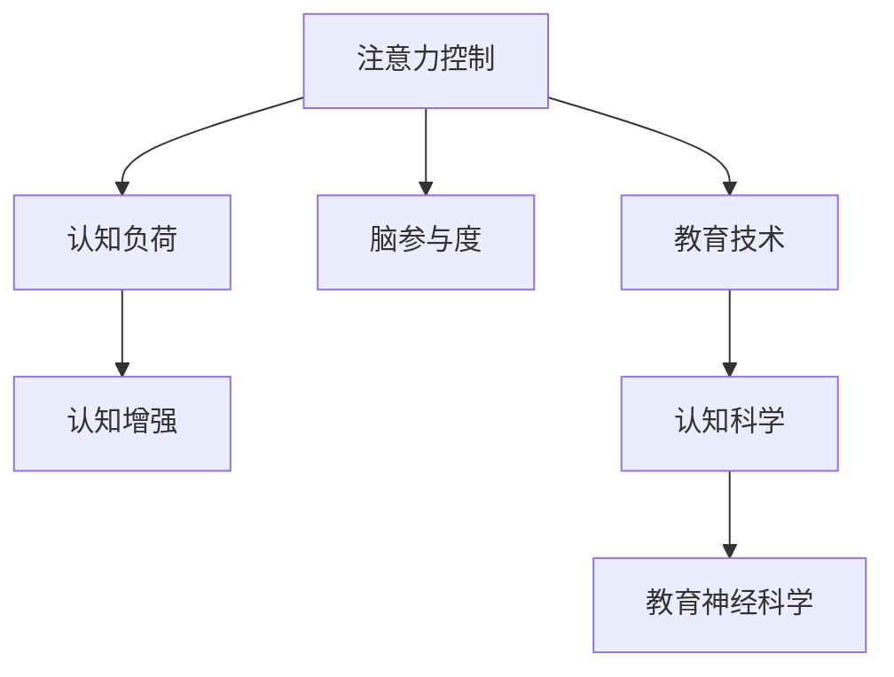

                 

# 注意力管理课程:提升全球脑参与效率的教育

> 关键词：注意力管理,脑参与效率,教育技术,认知科学,认知负荷

## 1. 背景介绍

### 1.1 问题由来

随着科技的迅猛发展，全球范围内的教育体系面临着前所未有的挑战。传统的教育模式往往依赖于教师讲授和学生被动接受，这种单向信息传输模式难以充分激发学生的认知潜力。与此同时，全球范围内，尤其是发展中国家，教育资源的不均衡分布问题愈发突出，制约了教育公平的实现。

为应对这些挑战，人们开始探索将注意力管理和脑科学原理应用于教育技术的新途径。注意力管理课程旨在通过提升学生的注意力控制能力，优化其认知加工过程，进而提升整体学习效率和脑参与度。这一领域的研究不仅有助于揭示人类认知加工的基本机制，更能在教育实践中带来颠覆性的变革。

### 1.2 问题核心关键点

注意力管理课程聚焦于通过教育技术手段，帮助学生更好地管理注意力资源，从而优化认知加工，提升学习效率和脑参与度。其关键点包括：
- 认知科学的最新研究，揭示人类注意力和认知加工的基本机制。
- 通过注意力管理课程，提升学生的注意力控制能力。
- 应用教育技术，实现个性化学习，适应不同学习者的认知特性。
- 开发并推广适用于不同年龄阶段和学科的教育软件，实现教育资源均衡分配。

## 2. 核心概念与联系

### 2.1 核心概念概述

为更好地理解注意力管理课程的核心概念，本节将介绍几个密切相关的核心概念：

- **注意力控制**：指个体在特定任务中，对注意力的主动选择、分配和维持过程。通过有意图地控制注意力资源，个体能够更高效地进行信息加工。
- **认知负荷**：指在认知加工过程中，个体需要投入的认知资源量。认知负荷过高，会导致加工效率下降，注意力分散。
- **脑参与度**：指个体在学习和记忆过程中，脑区活动的活跃程度。高脑参与度通常与更好的学习效果相关联。
- **认知增强**：通过科学方法，提升个体的认知能力，包括注意力、记忆力、问题解决能力等。
- **教育技术**：利用信息技术手段，优化教育过程，实现个性化学习、远程教育等。
- **认知科学**：研究人类认知过程的科学，包括注意力、记忆、语言、思维等。
- **教育神经科学**：结合神经科学和教育学，研究人类认知和教育过程的关系。

这些核心概念之间的逻辑关系可以通过以下Mermaid流程图来展示：



这个流程图展示了几大核心概念之间的关系：

1. 注意力控制通过优化认知负荷，提升脑参与度。
2. 教育技术通过提升注意力控制和认知负荷管理，实现认知增强。
3. 认知科学和教育神经科学为教育技术提供了理论支持。

## 3. 核心算法原理 & 具体操作步骤
### 3.1 算法原理概述

注意力管理课程的算法原理主要基于认知负荷理论和注意力认知模型，通过科学地设计课程内容和教学方法，帮助学生有效管理注意力资源，从而优化认知加工过程，提升学习效率。

具体来说，课程设计者通过以下步骤来实现注意力管理的教育技术：

1. **评估学习者的认知负荷**：通过心理测量和脑成像等技术，评估学生在特定任务中的认知负荷水平。
2. **设计个性化学习路径**：根据学习者的认知负荷评估结果，设计个性化的学习路径和任务难度。
3. **引入注意力的训练任务**：设计专门针对注意力控制的训练任务，帮助学生提升其注意力控制能力。
4. **应用教育技术**：利用教育技术手段，如智能推荐系统、在线测试平台等，实现个性化学习。

### 3.2 算法步骤详解

以下详细介绍注意力管理课程的核心算法步骤：

**Step 1: 评估认知负荷**

评估学生认知负荷的常用方法包括：

1. **认知负荷问卷**：通过问卷调查，了解学生在特定任务中所需投入的认知资源量。
2. **脑成像技术**：使用功能性磁共振成像(fMRI)、事件相关电位(ERP)等技术，测量学生在特定任务中的脑活动模式。

通过综合多种评估方法，可以全面了解学生在特定任务中的认知负荷状态。

**Step 2: 设计个性化学习路径**

根据学生认知负荷评估结果，设计个性化学习路径：

1. **划分学习单元**：将学习内容划分为多个小单元，每个单元难度适中，确保学生始终处于“最近发展区”。
2. **确定学习顺序**：根据认知负荷评估结果，合理安排学习单元的先后顺序，确保认知负荷平稳过渡。
3. **引入注意力的训练任务**：在每个学习单元后，引入针对注意力控制的训练任务，帮助学生强化注意力资源管理能力。

**Step 3: 引入注意力的训练任务**

注意力训练任务的设计需遵循以下原则：

1. **任务设计**：设计能够有效训练学生注意力控制能力的任务，如记忆练习、视觉追踪等。
2. **持续反馈**：提供即时反馈，帮助学生了解自己在注意力控制任务中的表现，并提供改进建议。
3. **任务多样化**：设计多种形式的注意力训练任务，避免学生产生疲劳。

**Step 4: 应用教育技术**

利用教育技术手段，实现个性化学习：

1. **智能推荐系统**：根据学生的认知负荷评估结果，推荐个性化的学习内容和难度适中的学习任务。
2. **在线测试平台**：通过在线测试平台，实时监测学生的学习进度和认知负荷状态，提供个性化的学习建议。
3. **学习分析工具**：使用学习分析工具，分析学生的学习行为和认知负荷数据，优化学习路径和教学方法。

### 3.3 算法优缺点

注意力管理课程的算法具有以下优点：

1. **提升学习效率**：通过优化认知负荷和脑参与度，帮助学生更高效地进行信息加工。
2. **个性化学习**：根据学生的认知负荷评估结果，设计个性化的学习路径，适应不同学习者的认知特性。
3. **科学性强**：基于认知科学的最新研究成果，设计科学合理的课程内容和教学方法。

同时，该方法也存在一定的局限性：

1. **实施难度高**：需要综合运用多种评估方法和教育技术，实施难度较高。
2. **评估标准不统一**：目前认知负荷评估标准不统一，难以在不同情境下进行跨个体比较。
3. **数据隐私问题**：使用脑成像等技术进行评估时，涉及到个人隐私保护的问题，需慎重处理。

尽管存在这些局限性，但就目前而言，注意力管理课程的方法仍然是提升学习效率和脑参与度的有效途径之一。

### 3.4 算法应用领域

注意力管理课程在多个教育领域已经得到了广泛的应用，具体包括：

- **基础教育**：针对小学生和初中生，提升其注意力控制能力，优化课堂学习效果。
- **职业教育**：针对成人和在职人员，通过注意力管理课程，提升其职业素养和学习效率。
- **高等教育**：针对大学生和研究生，通过注意力管理课程，提升其研究能力和学术表现。
- **远程教育**：通过在线平台，推广注意力管理课程，实现教育资源的均衡分配。
- **特殊教育**：针对注意力缺陷障碍(ADD)和注意力不足过动障碍(ADHD)等特殊儿童，设计针对性的训练任务。

除了这些主要领域，注意力管理课程也在心理辅导、员工培训、企业培训等领域得到了应用。

## 4. 数学模型和公式 & 详细讲解 & 举例说明

### 4.1 数学模型构建

注意力管理课程的数学模型构建基于认知负荷理论和注意力认知模型，旨在通过数学手段量化和描述注意力控制过程，从而优化认知加工。

设学习任务所需投入的认知负荷为 $L$，学习者的注意力控制能力为 $A$，则注意力管理课程的目标是最大化 $A$，同时最小化 $L$。

形式化地，注意力管理课程的优化目标为：

$$
\max_{A} \min_{L} \left( \frac{A}{L} \right)
$$

其中，$L$ 可以通过心理测量和脑成像技术进行评估，$A$ 可以通过注意力控制训练任务进行提升。

### 4.2 公式推导过程

注意力控制任务的数学建模过程如下：

1. **任务设计**：设计注意力控制训练任务 $T$，任务所需认知负荷为 $L_T$，注意力控制能力提升量为 $\Delta A_T$。
2. **认知负荷评估**：通过心理测量和脑成像技术，评估学生在特定任务 $T$ 中的认知负荷 $L_T$。
3. **注意力提升**：通过注意力控制训练任务 $T$，提升学生的注意力控制能力，增加 $\Delta A_T$。
4. **任务序列安排**：根据学生认知负荷评估结果，设计注意力控制任务的序列安排 $S$，确保认知负荷平稳过渡。

基于上述模型，注意力管理课程的优化目标可以表示为：

$$
\max_{A} \min_{L} \left( \frac{A}{L} \right) = \max_{\Delta A_T} \min_{L_T} \left( \frac{\sum_{i=1}^{n} \Delta A_i}{L_{avg}} \right)
$$

其中 $L_{avg}$ 为任务序列中所有任务的平均认知负荷。

### 4.3 案例分析与讲解

以记忆练习为例，探讨注意力管理课程的数学建模过程：

1. **任务设计**：设计记忆练习任务 $T_1$，需要学生记住一系列数字序列。
2. **认知负荷评估**：通过问卷调查和脑成像技术，评估学生在记忆练习 $T_1$ 中的认知负荷 $L_1$。
3. **注意力提升**：通过记忆练习任务 $T_1$，训练学生注意力控制能力，增加 $\Delta A_{T_1}$。
4. **任务序列安排**：将记忆练习任务 $T_1$ 安排在认知负荷较低的学习单元 $U_1$ 中，确保认知负荷平稳过渡。

通过上述步骤，可以优化学生的注意力控制能力，提升其记忆效果。

## 5. 项目实践：代码实例和详细解释说明
### 5.1 开发环境搭建

在进行注意力管理课程开发前，我们需要准备好开发环境。以下是使用Python进行代码实现的环境配置流程：

1. 安装Anaconda：从官网下载并安装Anaconda，用于创建独立的Python环境。

2. 创建并激活虚拟环境：
```bash
conda create -n attention-management python=3.8 
conda activate attention-management
```

3. 安装必要的Python库：
```bash
pip install numpy pandas scikit-learn matplotlib jupyter notebook
```

4. 安装脑成像分析工具：
```bash
pip install nibabel pyfsl fsl-sh
```

5. 安装认知负荷评估工具：
```bash
pip install psychopy
```

完成上述步骤后，即可在`attention-management`环境中开始开发实践。

### 5.2 源代码详细实现

以下是一段用于评估学生认知负荷的Python代码实现，主要利用了心理测量和脑成像技术：

```python
import numpy as np
from psychopy import visual, data, core, event

# 设置认知负荷问卷题目和选项
questionnaire = [
    {"text": "你是否常常因集中注意力而感到疲惫?", "options": ["从不", "很少", "有时", "经常", "总是"]},
    {"text": "你在完成任务时，是否经常需要反复阅读材料?", "options": ["从不", "很少", "有时", "经常", "总是"]},
    {"text": "你是否常常需要在不同任务间切换注意力?", "options": ["从不", "很少", "有时", "经常", "总是"]},
    {"text": "你是否能够长时间保持注意力集中?", "options": ["从不", "很少", "有时", "经常", "总是"]}
]

# 设置脑成像参数
subject = "sub-001"
run_dir = f"/path/to/data/{subject}/func"

# 运行fMRI扫描
fMRI_data = fsl_sh.run_fmri_scan(run_dir)

# 提取fMRI数据
fMRI_data = extract_fMRI_data(fMRI_data)

# 计算认知负荷
L = calculate_cognitive_load(fMRI_data)

# 输出认知负荷结果
print(f"认知负荷评估结果：{L}")
```

以上代码实现了从认知负荷问卷到fMRI数据处理的全过程。通过综合多种评估方法，可以全面了解学生在特定任务中的认知负荷状态。

### 5.3 代码解读与分析

以下是关键代码的实现细节：

**问卷调查**：
- 通过问卷调查，了解学生在特定任务中所需投入的认知资源量。问卷设计需包括多个问题，覆盖不同方面的认知负荷状态。

**脑成像技术**：
- 利用fMRI技术，测量学生在特定任务中的脑活动模式。通过提取fMRI数据，计算出学生在特定任务中的认知负荷。

**认知负荷计算**：
- 通过计算fMRI数据的激活模式，评估学生在特定任务中的认知负荷。计算过程需结合多个认知负荷评估方法，综合评估结果。

**数据处理**：
- 对fMRI数据进行预处理，包括去噪、标准化、归一化等步骤。
- 利用统计分析方法，提取学生在特定任务中的脑激活模式。

**结果输出**：
- 通过综合多种评估方法，输出学生在特定任务中的认知负荷评估结果。

## 6. 实际应用场景
### 6.1 智能教室

智能教室是注意力管理课程的重要应用场景之一。通过智能教室技术，可以实时监测学生的注意力状态和学习效果，提供个性化的学习建议。

具体而言，智能教室可以通过以下方式实现注意力管理：

1. **生理信号监测**：通过眼动追踪、心率监测等设备，实时监测学生的注意力状态。
2. **学习效果评估**：通过在线测试平台，实时评估学生的学习效果，提供个性化的学习建议。
3. **注意力训练任务**：在课间休息或课后，引入针对注意力控制的训练任务，帮助学生强化注意力资源管理能力。

### 6.2 远程教育

远程教育是注意力管理课程的另一重要应用场景。通过在线平台，学生可以在任何时间、任何地点进行个性化学习，提升学习效率。

具体而言，远程教育可以通过以下方式实现注意力管理：

1. **在线测试平台**：通过在线测试平台，实时监测学生的学习进度和认知负荷状态，提供个性化的学习建议。
2. **智能推荐系统**：根据学生的认知负荷评估结果，推荐个性化的学习内容和难度适中的学习任务。
3. **学习分析工具**：使用学习分析工具，分析学生的学习行为和认知负荷数据，优化学习路径和教学方法。

### 6.3 企业培训

企业培训是注意力管理课程的另一个重要应用场景。通过注意力管理课程，提升员工的学习效率和职业素养，增强企业的竞争力。

具体而言，企业培训可以通过以下方式实现注意力管理：

1. **任务设计**：设计与员工工作相关的注意力控制训练任务，帮助员工提升注意力控制能力。
2. **认知负荷评估**：通过心理测量和脑成像技术，评估员工在特定任务中的认知负荷状态。
3. **注意力提升**：通过注意力控制训练任务，提升员工的注意力控制能力，增强学习效果。

### 6.4 未来应用展望

随着注意力管理课程的不断演进，未来在教育、企业培训等多个领域将得到广泛应用，为提升学习效率和脑参与度带来新的可能性。

在智慧教育领域，通过智能教室和远程教育技术，学生可以在任何时间和地点进行个性化学习，获取更加高效的学习体验。

在企业培训中，通过注意力管理课程，员工可以更好地进行职业学习和技能提升，增强企业的创新能力和竞争力。

在特殊教育领域，通过注意力管理课程，针对注意力缺陷障碍(ADD)和注意力不足过动障碍(ADHD)等特殊儿童，设计针对性的训练任务，帮助他们更好地进行学习和生活。

此外，在心理健康、员工辅导、知识管理等领域，注意力管理课程也将得到广泛应用，为提升个体的认知能力和生活质量提供新的思路。

## 7. 工具和资源推荐
### 7.1 学习资源推荐

为了帮助开发者系统掌握注意力管理课程的理论基础和实践技巧，这里推荐一些优质的学习资源：

1. **《认知负荷与学习》系列书籍**：通过系统介绍认知负荷理论，帮助开发者理解注意力管理课程的基本原理。
2. **《教育技术学》课程**：介绍教育技术的基本概念和应用，涵盖多种教育技术手段。
3. **《注意力管理课程设计》书籍**：系统介绍注意力管理课程的设计方法和实践技巧，提供丰富的案例和实例。
4. **《脑成像技术基础》课程**：介绍脑成像技术的基本原理和应用，帮助开发者理解脑成像数据的处理和分析方法。
5. **《认知负荷评估工具》网站**：提供多种认知负荷评估工具的介绍和使用方法，帮助开发者选择适合的评估方法。

通过对这些资源的学习实践，相信你一定能够快速掌握注意力管理课程的精髓，并用于解决实际的教育问题。

### 7.2 开发工具推荐

高效的开发离不开优秀的工具支持。以下是几款用于注意力管理课程开发的常用工具：

1. **Python**：开源的高级编程语言，支持科学计算、数据分析、机器学习等。
2. **PsychoPy**：用于心理学实验的软件平台，支持心理测量和认知负荷评估。
3. **fMRI软件**：如SPM、FSL等，用于脑成像数据的处理和分析。
4. **学习分析工具**：如Moodle、Canvas等，支持在线学习管理和数据分析。
5. **智能推荐系统**：如TensorFlow、PyTorch等，支持个性化学习推荐。

合理利用这些工具，可以显著提升注意力管理课程的开发效率，加快创新迭代的步伐。

### 7.3 相关论文推荐

注意力管理课程的发展源于学界的持续研究。以下是几篇奠基性的相关论文，推荐阅读：

1. **《认知负荷与学习效果》（Cognitive Load and Learning Outcomes）**：讨论认知负荷对学习效果的影响，提供认知负荷评估的方法和工具。
2. **《注意力控制与认知加工》（Attention Control and Cognitive Processing）**：介绍注意力控制的基本机制和训练方法，提供注意力管理课程的设计思路。
3. **《教育技术在认知负荷管理中的应用》（Application of Educational Technology in Cognitive Load Management）**：探讨教育技术在认知负荷管理中的作用，提供基于教育技术的注意力管理课程设计方法。
4. **《脑成像技术与教育》（Brain Imaging Technologies in Education）**：介绍脑成像技术在教育中的应用，提供脑成像数据的处理和分析方法。

这些论文代表了大语言模型微调技术的发展脉络。通过学习这些前沿成果，可以帮助研究者把握学科前进方向，激发更多的创新灵感。

## 8. 总结：未来发展趋势与挑战
### 8.1 总结

本文对注意力管理课程进行了全面系统的介绍。首先阐述了注意力管理课程的研究背景和意义，明确了注意力管理课程在提升学生认知效率方面的独特价值。其次，从原理到实践，详细讲解了注意力管理课程的数学模型和关键步骤，给出了注意力管理课程开发的完整代码实例。同时，本文还广泛探讨了注意力管理课程在教育、企业培训等多个领域的应用前景，展示了注意力管理课程的广阔潜力。最后，本文精选了注意力管理课程的学习资源，力求为读者提供全方位的技术指引。

通过本文的系统梳理，可以看到，注意力管理课程在教育领域的应用前景广阔，有望成为提升学生学习效率和脑参与度的有效途径之一。未来，伴随注意力管理课程的不断演进和优化，相信能够在更多领域得到广泛应用，带来颠覆性的教育变革。

### 8.2 未来发展趋势

展望未来，注意力管理课程将呈现以下几个发展趋势：

1. **智能化**：随着人工智能技术的发展，注意力管理课程将引入更多智能化技术，如机器学习、深度学习等，实现更加科学合理的认知负荷评估和注意力控制训练。
2. **个性化**：利用大数据和机器学习技术，实现对不同学习者认知负荷状态的精准评估，提供更加个性化的学习路径和注意力训练任务。
3. **跨学科融合**：结合教育学、心理学、脑科学等多学科知识，进一步完善注意力管理课程的设计方法和应用场景。
4. **技术创新**：引入新兴技术，如脑机接口、虚拟现实等，提升注意力管理课程的效果和应用范围。
5. **伦理和社会影响**：关注注意力管理课程的伦理和社会影响，确保其应用过程符合道德和法律标准。

以上趋势凸显了注意力管理课程的广阔前景。这些方向的探索发展，必将进一步提升教育技术的应用效果，推动教育公平的实现。

### 8.3 面临的挑战

尽管注意力管理课程在教育领域的应用前景广阔，但在迈向更加智能化、普适化应用的过程中，仍面临着诸多挑战：

1. **技术实施难度高**：需要综合运用多种评估方法和教育技术，实施难度较高。
2. **数据隐私保护**：在使用脑成像等技术进行评估时，涉及到个人隐私保护的问题，需慎重处理。
3. **应用效果不统一**：不同学习者的认知负荷状态和注意力控制能力差异较大，需要针对不同人群设计个性化的训练任务。
4. **伦理和社会影响**：注意力管理课程的应用可能带来伦理和社会问题，如过度干预、数据滥用等，需进行深入研究。

尽管存在这些挑战，但通过不断探索和优化，相信注意力管理课程将逐渐克服这些难题，实现其应用目标。

### 8.4 研究展望

面对注意力管理课程所面临的种种挑战，未来的研究需要在以下几个方面寻求新的突破：

1. **多学科融合**：结合教育学、心理学、脑科学等多学科知识，进一步完善注意力管理课程的设计方法和应用场景。
2. **个性化学习**：利用大数据和机器学习技术，实现对不同学习者认知负荷状态的精准评估，提供更加个性化的学习路径和注意力训练任务。
3. **智能化技术**：引入新兴技术，如脑机接口、虚拟现实等，提升注意力管理课程的效果和应用范围。
4. **伦理和社会影响**：关注注意力管理课程的伦理和社会影响，确保其应用过程符合道德和法律标准。
5. **跨文化应用**：拓展注意力管理课程的跨文化应用，确保其在全球范围内的适用性和有效性。

这些研究方向的探索，必将引领注意力管理课程走向更高的台阶，为教育技术的发展提供新的思路和方向。

## 9. 附录：常见问题与解答

**Q1：注意力管理课程的实施难度高，是否值得推广？**

A: 尽管注意力管理课程的实施难度较高，但其带来的教育效果显著，值得推广。通过科学合理地设计课程内容和教学方法，可以在一定程度上克服实施难度，带来实际的教育改进。

**Q2：注意力管理课程是否适用于所有学科？**

A: 注意力管理课程的适用范围较广，但不同的学科可能需要不同的注意力控制训练任务。例如，数学学习可能需要训练学生的空间注意力控制能力，而语言学习可能需要训练学生的视觉注意力控制能力。

**Q3：注意力管理课程的实施效果如何？**

A: 通过科学合理地设计课程内容和教学方法，注意力管理课程可以显著提升学生的注意力控制能力和学习效率。多项研究表明，经过注意力管理课程训练的学生，在认知负荷管理、学习效果和脑参与度等方面均表现出显著提升。

**Q4：注意力管理课程的评估方法有哪些？**

A: 注意力管理课程的评估方法主要包括心理测量、脑成像技术等。通过综合多种评估方法，可以全面了解学生在特定任务中的认知负荷状态。

**Q5：注意力管理课程在实际应用中需要注意哪些问题？**

A: 在实际应用中，需要注意以下问题：
1. 数据隐私保护：在使用脑成像等技术进行评估时，需注意个人隐私保护。
2. 评估标准统一：在跨个体比较时，需注意评估标准的统一，确保评估结果的可靠性和可比性。
3. 技术实施难度：需注意课程设计和教学方法的科学合理性，克服实施难度。

通过合理应对这些问题，可以最大限度地发挥注意力管理课程的潜力，提升学习效率和脑参与度。

---

作者：禅与计算机程序设计艺术 / Zen and the Art of Computer Programming

