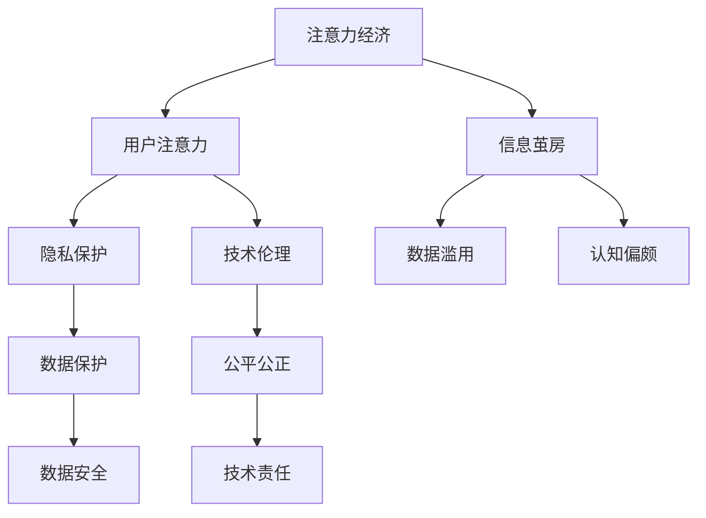

                 

# 注意力经济与个人时间主权的博弈

## 1. 背景介绍

### 1.1 问题由来

随着互联网和移动互联网的快速发展，信息的爆炸式增长已成为当今社会的常态。面对海量的信息流，人类的注意力成为一种稀缺资源。如何高效利用和管理注意力，成为互联网时代的核心议题。在此背景下，注意力经济（Attention Economy）应运而生，成为推动互联网商业模式和社交互动的重要力量。

### 1.2 问题核心关键点

注意力经济的核心在于如何通过技术手段引导和聚合用户的注意力，从而创造出经济价值。在大数据和算法的驱动下，企业通过分析用户行为，精准投放广告，优化内容推荐，实现了对用户注意力的深度操控。而这种操控并非无本万利，它同时也引发了诸多社会问题，如隐私泄露、信息茧房、成瘾性增强等。

在此背景下，个人时间主权的博弈问题凸显。随着各类数字平台对注意力的争夺愈发激烈，如何维护个人对时间的掌控权，避免被过度操控，成为新的技术和社会议题。本文将从注意力经济与个人时间主权的角度出发，探索其在技术、经济和社会层面的内在关联，并提供一些应对策略。

## 2. 核心概念与联系

### 2.1 核心概念概述

为更好地理解注意力经济与个人时间主权的博弈，本节将介绍几个关键概念：

- **注意力经济 (Attention Economy)**：以吸引和利用用户注意力为核心的新型经济形态。通过提供个性化的内容、精准的广告投放等方式，吸引用户关注，从而实现商业变现。

- **用户注意力 (User Attention)**：用户对信息内容的专注和关注度。注意力经济的核心在于如何最大化地吸引和利用这种专注度，实现商业价值。

- **信息茧房 (Information Echo Chamber)**：指用户只接收到自己偏好的信息，忽视了其他信息源，导致信息视野狭窄化。长期沉浸在这种环境中，用户的认知能力、判断力和价值观可能会受到影响。

- **隐私保护 (Privacy Protection)**：用户信息的安全性和隐私权保护。在注意力经济中，数据收集和分析成为重要手段，如何保护用户隐私，防止数据滥用，是亟待解决的问题。

- **技术伦理 (Technical Ethics)**：在技术开发和应用过程中，遵循伦理准则，平衡技术利与弊，确保技术发展符合人类价值观和社会规范。

这些概念之间存在着复杂的相互关系，通过以下Mermaid流程图来展示：



## 3. 核心算法原理 & 具体操作步骤

### 3.1 算法原理概述

注意力经济的实现离不开数据驱动的个性化推荐和广告投放系统。这些系统的核心算法原理基于机器学习和深度学习技术，通过分析用户行为数据，建立模型预测用户偏好和注意力分布。

在个性化推荐中，常用的算法包括协同过滤、内容推荐、矩阵分解等，通过分析用户历史行为数据和物品属性，预测用户对特定物品的兴趣程度。

在广告投放中，常用的算法包括强化学习、点击率预估、交叉验证等，通过构建奖励机制和反馈系统，优化广告投放策略，最大化用户点击率和经济收益。

### 3.2 算法步骤详解

以协同过滤为例，其算法步骤包括：

1. **用户行为数据收集**：收集用户在平台上的浏览、点击、购买等行为数据。
2. **构建用户-物品评分矩阵**：将用户行为转化为用户对物品的评分。
3. **矩阵分解**：将用户-物品评分矩阵分解为用户特征矩阵和物品特征矩阵，以发现用户的潜在兴趣。
4. **预测用户兴趣**：使用分解后的特征矩阵，预测用户对新物品的评分，进而推荐相关物品。

广告投放算法步骤包括：

1. **广告素材准备**：准备各类广告素材，包括图片、视频、文字等。
2. **用户行为分析**：分析用户的浏览历史、点击行为等，构建用户画像。
3. **投放策略优化**：通过A/B测试等手段，优化广告投放策略，提高点击率和经济效益。
4. **效果评估**：评估广告投放效果，优化投放策略，持续提升广告转化率。

### 3.3 算法优缺点

注意力经济的算法具有以下优点：

- **个性化推荐**：通过精准分析和预测，提供高度个性化的内容推荐，满足用户需求。
- **广告效果提升**：通过优化投放策略，提升广告点击率和转化率，提高广告主的ROI。
- **数据驱动决策**：依赖大量数据支持决策，实现高效、精准的业务优化。

但同时也存在一些缺点：

- **数据隐私问题**：大规模数据收集和使用，容易导致用户隐私泄露。
- **信息茧房问题**：长期沉浸在个性化推荐的环境中，容易导致用户视野狭窄化。
- **算法偏见问题**：算法模型可能存在偏见，导致推荐内容或广告内容不公正、不客观。
- **用户成瘾问题**：个性化推荐和广告投放可能加剧用户对平台的依赖，引发成瘾问题。

### 3.4 算法应用领域

注意力经济的应用领域非常广泛，涵盖以下几个方面：

- **电商领域**：通过个性化推荐和精准广告投放，提升用户购物体验和转化率。
- **新闻媒体**：通过推荐算法，优化新闻内容展示，提升用户粘性和阅读体验。
- **社交网络**：通过智能推荐和广告投放，优化社交互动，提升用户活跃度和平台收益。
- **教育培训**：通过个性化学习推荐，优化学习路径，提高学习效果。
- **娱乐内容**：通过推荐算法，优化视频、音乐、游戏等内容推荐，提升用户满意度和平台收益。

## 4. 数学模型和公式 & 详细讲解 & 举例说明

### 4.1 数学模型构建

在个性化推荐中，常用的数学模型包括协同过滤模型和基于内容的推荐模型。以下以协同过滤模型为例，介绍其数学模型构建过程。

设用户集合为 $U=\{u_1,u_2,\dots,u_m\}$，物品集合为 $I=\{i_1,i_2,\dots,i_n\}$。用户对物品的评分矩阵为 $R\in\mathbb{R}^{m\times n}$，其中 $R_{ui}$ 表示用户 $u_i$ 对物品 $i_j$ 的评分。设用户特征矩阵为 $P\in\mathbb{R}^{m\times d}$，物品特征矩阵为 $Q\in\mathbb{R}^{n\times d}$，其中 $P$ 和 $Q$ 通过矩阵分解得到，$d$ 为特征维度。

协同过滤模型的目标是最小化用户评分预测误差，即：

$$
\min_{P,Q} \sum_{u=1}^m \sum_{i=1}^n (R_{ui} - P^T_u Q_i)^2
$$

### 4.2 公式推导过程

协同过滤模型的推导过程主要包括矩阵分解和最小二乘求解。

1. **矩阵分解**：将用户评分矩阵 $R$ 分解为用户特征矩阵 $P$ 和物品特征矩阵 $Q$，即：

$$
R \approx P \times Q^T
$$

2. **最小二乘求解**：通过最小二乘法求解最优的 $P$ 和 $Q$，使得预测值 $P^T_u Q_i$ 尽可能接近真实评分 $R_{ui}$。具体求解过程如下：

$$
\min_{P,Q} \frac{1}{2} \sum_{u=1}^m \sum_{i=1}^n (R_{ui} - P^T_u Q_i)^2
$$

对 $P$ 和 $Q$ 求偏导数，得到：

$$
\frac{\partial \mathcal{L}}{\partial P} = -2\sum_{i=1}^n (Q_i^T(R - PQ^T)P_u) = 0
$$

$$
\frac{\partial \mathcal{L}}{\partial Q} = -2\sum_{u=1}^m (P_u^T(R - PQ^T)Q_i) = 0
$$

解得：

$$
P = U\Phi, \quad Q = \Phi V
$$

其中 $U$ 和 $V$ 为正交矩阵，$\Phi$ 为分解后的矩阵，满足 $\Phi^T\Phi = \mathbb{I}$。

### 4.3 案例分析与讲解

以YouTube平台为例，介绍基于协同过滤的个性化推荐算法如何工作。

YouTube通过用户观看行为数据，构建用户-视频评分矩阵。设用户集合为 $U$，视频集合为 $V$，用户对视频的评分矩阵为 $R\in\mathbb{R}^{m\times n}$，其中 $m$ 为用户的数量，$n$ 为视频的数量。

YouTube使用矩阵分解的方法，将用户评分矩阵 $R$ 分解为用户特征矩阵 $P\in\mathbb{R}^{m\times d}$ 和视频特征矩阵 $Q\in\mathbb{R}^{n\times d}$，其中 $d$ 为特征维度。通过训练最优的 $P$ 和 $Q$，构建推荐模型。

在推荐新视频时，YouTube首先计算用户对新视频的评分预测值 $P^T_u Q_i$，然后根据预测值排序，推荐评分最高的视频。通过这种方式，YouTube能够实现高度个性化的内容推荐，提高用户粘性和平台收益。

## 5. 项目实践：代码实例和详细解释说明

### 5.1 开发环境搭建

在开始项目实践前，需要准备开发环境。以下是使用Python进行PyTorch开发的环境配置流程：

1. 安装Anaconda：从官网下载并安装Anaconda，用于创建独立的Python环境。

2. 创建并激活虚拟环境：
```bash
conda create -n attention-env python=3.8 
conda activate attention-env
```

3. 安装PyTorch：根据CUDA版本，从官网获取对应的安装命令。例如：
```bash
conda install pytorch torchvision torchaudio cudatoolkit=11.1 -c pytorch -c conda-forge
```

4. 安装TensorFlow：如果需要使用TensorFlow进行开发，可以通过以下命令安装：
```bash
conda install tensorflow -c conda-forge
```

5. 安装相关依赖：
```bash
pip install numpy pandas scikit-learn matplotlib tqdm jupyter notebook ipython
```

完成上述步骤后，即可在`attention-env`环境中开始项目开发。

### 5.2 源代码详细实现

接下来，我们以协同过滤算法为例，给出使用PyTorch实现个性化推荐系统的代码实现。

首先，定义协同过滤模型：

```python
import torch
import torch.nn as nn
import torch.nn.functional as F

class CollaborativeFiltering(nn.Module):
    def __init__(self, m, n, d):
        super(CollaborativeFiltering, self).__init__()
        self.user_feature = nn.Embedding(m, d)
        self.item_feature = nn.Embedding(n, d)
        self.sig = nn.Sigmoid()
        
    def forward(self, user_ids, item_ids):
        user_features = self.user_feature(user_ids)
        item_features = self.item_feature(item_ids)
        prediction = torch.matmul(user_features, item_features.t())
        prediction = self.sig(prediction)
        return prediction
```

然后，定义数据集和加载函数：

```python
from torch.utils.data import Dataset
import pandas as pd

class MovieLensDataset(Dataset):
    def __init__(self, df):
        self.df = df
        self.num_users = len(self.df['userId'].unique())
        self.num_movies = len(self.df['movieId'].unique())
        
    def __len__(self):
        return len(self.df)
    
    def __getitem__(self, idx):
        user_id = self.df.iloc[idx]['userId']
        item_id = self.df.iloc[idx]['movieId']
        rating = self.df.iloc[idx]['rating']
        return user_id, item_id, rating

movie_lens_data = pd.read_csv('ratings.csv')
train_dataset = MovieLensDataset(movie_lens_data[movie_lens_data['timestamp'] < 1333329200])
test_dataset = MovieLensDataset(movie_lens_data[movie_lens_data['timestamp'] >= 1333329200])
```

接着，定义模型训练和评估函数：

```python
def train(model, optimizer, train_dataset, test_dataset, device, n_epochs, batch_size):
    model.to(device)
    train_loader = torch.utils.data.DataLoader(train_dataset, batch_size=batch_size, shuffle=True)
    test_loader = torch.utils.data.DataLoader(test_dataset, batch_size=batch_size, shuffle=False)
    loss_fn = nn.MSELoss()
    
    for epoch in range(n_epochs):
        model.train()
        train_loss = 0
        for user_ids, item_ids, ratings in train_loader:
            user_ids = user_ids.to(device)
            item_ids = item_ids.to(device)
            ratings = ratings.to(device)
            optimizer.zero_grad()
            pred = model(user_ids, item_ids)
            loss = loss_fn(pred, ratings)
            loss.backward()
            optimizer.step()
            train_loss += loss.item()
        train_loss /= len(train_loader)
        
        model.eval()
        test_loss = 0
        for user_ids, item_ids, ratings in test_loader:
            user_ids = user_ids.to(device)
            item_ids = item_ids.to(device)
            ratings = ratings.to(device)
            pred = model(user_ids, item_ids)
            loss = loss_fn(pred, ratings)
            test_loss += loss.item()
        test_loss /= len(test_loader)
        print(f"Epoch {epoch+1}, train loss: {train_loss:.4f}, test loss: {test_loss:.4f}")
        
    return model
```

最后，启动模型训练并评估：

```python
m, n, d = 943, 1682, 10
model = CollaborativeFiltering(m, n, d)
optimizer = torch.optim.Adam(model.parameters(), lr=0.01)
device = torch.device('cuda' if torch.cuda.is_available() else 'cpu')
n_epochs = 50
batch_size = 256

trained_model = train(model, optimizer, train_dataset, test_dataset, device, n_epochs, batch_size)
```

以上就是使用PyTorch实现协同过滤个性化推荐系统的完整代码实现。可以看到，通过简单的模型设计和训练流程，即可实现对用户行为数据的深度分析，提供个性化推荐。

### 5.3 代码解读与分析

让我们再详细解读一下关键代码的实现细节：

**CollaborativeFiltering类**：
- `__init__`方法：初始化用户特征嵌入层、物品特征嵌入层和Sigmoid激活函数。
- `forward`方法：前向传播计算预测值，并使用Sigmoid函数激活输出。

**MovieLensDataset类**：
- `__init__`方法：初始化训练和测试数据集，并统计用户和物品的数量。
- `__len__`方法：返回数据集的样本数量。
- `__getitem__`方法：对单个样本进行处理，提取用户ID、物品ID和评分。

**train函数**：
- 定义训练数据加载器、测试数据加载器和损失函数。
- 在每个epoch内，对数据进行前向传播和反向传播，更新模型参数。
- 在每个epoch结束时，计算训练集和测试集的损失，并在控制台输出结果。

可以看到，通过PyTorch的强大封装，协同过滤模型的实现非常简洁高效。开发者可以将更多精力放在数据处理、模型改进等高层逻辑上，而不必过多关注底层的实现细节。

当然，工业级的系统实现还需考虑更多因素，如模型的保存和部署、超参数的自动搜索、更灵活的任务适配层等。但核心的微调范式基本与此类似。

## 6. 实际应用场景

### 6.1 智能推荐系统

智能推荐系统是注意力经济的重要应用场景之一。通过个性化推荐，电商平台能够提升用户购物体验，增加用户粘性和购买转化率。社交媒体平台通过个性化推荐，能够提高用户活跃度和内容消费。

在技术实现上，推荐系统通常采用协同过滤、内容推荐、矩阵分解等技术，通过分析用户历史行为数据和物品属性，预测用户对特定物品的兴趣程度。此外，推荐系统还可以引入深度学习、强化学习等高级算法，进一步提升推荐效果。

### 6.2 广告投放系统

广告投放系统是注意力经济的另一重要应用场景。通过精准投放广告，最大化点击率和转化率，广告主能够获得更高的ROI。

在广告投放中，常用的算法包括点击率预估、交叉验证等。通过分析用户行为数据和广告属性，构建模型预测广告点击率，优化广告投放策略。广告系统还可以引入实时竞价、上下文广告等高级算法，进一步提升广告效果。

### 6.3 内容推荐系统

内容推荐系统通过个性化推荐，提升用户对内容消费的满意度，增加平台的用户粘性和活跃度。内容推荐系统通常采用协同过滤、内容推荐等技术，通过分析用户历史行为数据和内容属性，预测用户对特定内容的兴趣程度。

### 6.4 未来应用展望

随着注意力经济的发展，其应用场景将不断拓展，带来更多商业机会和社会价值。

在智慧城市治理中，通过智能推荐和广告投放，能够提升城市管理的自动化和智能化水平，构建更安全、高效的未来城市。

在金融科技领域，通过个性化推荐和精准广告投放，能够提升用户对金融产品的认知和购买意愿，促进金融产品的创新和普及。

在医疗健康领域，通过个性化推荐和精准广告投放，能够提升用户对健康产品的认知和购买意愿，促进健康产品的创新和普及。

总之，注意力经济在各行业领域的应用前景广阔，将深刻影响人类的生产生活方式。

## 7. 工具和资源推荐

### 7.1 学习资源推荐

为了帮助开发者系统掌握注意力经济与个人时间主权的博弈理论基础和实践技巧，这里推荐一些优质的学习资源：

1. 《推荐系统实战》：该书详细介绍了推荐系统的基础理论和常用算法，适合深入学习和实践。
2. 《广告经济学》：该书系统讲解了广告投放和点击率预估等技术，适合了解广告系统的工作原理。
3. 《数据挖掘与统计学习》：该书介绍了数据挖掘和统计学习的基本方法，适合了解数据驱动的推荐和广告系统。
4. Coursera《推荐系统》课程：由斯坦福大学开设的推荐系统课程，涵盖推荐系统的基础理论、常用算法和实际应用。
5. Udacity《广告技术》课程：由Google和Facebook等公司联合开设的广告技术课程，适合了解广告系统和广告投放策略。

通过对这些资源的学习实践，相信你一定能够快速掌握注意力经济与个人时间主权的博弈的理论基础和实践技巧，并用于解决实际的推荐和广告问题。

### 7.2 开发工具推荐

高效的开发离不开优秀的工具支持。以下是几款用于注意力经济与个人时间主权的博弈开发的常用工具：

1. PyTorch：基于Python的开源深度学习框架，灵活动态的计算图，适合快速迭代研究。大部分推荐系统都有PyTorch版本的实现。
2. TensorFlow：由Google主导开发的开源深度学习框架，生产部署方便，适合大规模工程应用。同样有丰富的推荐系统资源。
3. Scikit-learn：Python机器学习库，提供了各类经典机器学习算法，适合进行数据预处理和特征工程。
4. Jupyter Notebook：基于IPython的Python交互式编程环境，适合数据探索和模型实验。
5. Weights & Biases：模型训练的实验跟踪工具，可以记录和可视化模型训练过程中的各项指标，方便对比和调优。与主流深度学习框架无缝集成。

合理利用这些工具，可以显著提升注意力经济与个人时间主权的博弈的开发效率，加快创新迭代的步伐。

### 7.3 相关论文推荐

注意力经济与个人时间主权的博弈的研究源于学界的持续研究。以下是几篇奠基性的相关论文，推荐阅读：

1. Parallel Matrix Factorization for Recommender Systems：提出并行矩阵分解方法，提高推荐系统的计算效率和精度。
2. Contextual Bandits in Online Recommendation Systems：引入上下文广告技术，提升推荐系统的广告效果。
3. Attention is All You Need：提出Transformer结构，开启了NLP领域的预训练大模型时代，为推荐系统的改进提供了新的思路。
4. A Survey on Privacy-Preserving Collaborative Filtering：系统总结了隐私保护在协同过滤推荐系统中的应用，提出了多种隐私保护方法。
5. Towards Explainable Recommendation Systems：探讨推荐系统的可解释性问题，提出了多种可解释性模型和方法。

这些论文代表了大语言模型微调技术的发展脉络。通过学习这些前沿成果，可以帮助研究者把握学科前进方向，激发更多的创新灵感。

## 8. 总结：未来发展趋势与挑战

### 8.1 研究成果总结

本文对注意力经济与个人时间主权的博弈进行了全面系统的介绍。首先阐述了注意力经济的概念、核心算法和应用场景，明确了其对互联网商业模式和社交互动的重要影响。其次，从技术、经济和社会层面，详细讲解了注意力经济与个人时间主权之间的内在联系，提供了多维度的理论基础和实践技巧。最后，通过代码实例和案例分析，进一步验证了注意力经济与个人时间主权的博弈的实现过程和技术细节。

通过本文的系统梳理，可以看到，注意力经济与个人时间主权的博弈在理论和技术上均具有较高的复杂性，其应用前景广阔，但同时也面临诸多挑战。

### 8.2 未来发展趋势

展望未来，注意力经济与个人时间主权的博弈技术将呈现以下几个发展趋势：

1. 数据驱动决策将更加深入：随着数据收集和处理技术的不断进步，数据分析和模型训练将更加深入，推荐和广告系统将具备更高的智能和自动化水平。

2. 跨模态推荐技术将广泛应用：未来的推荐系统将更多地融合图像、视频、语音等多模态信息，提升对用户行为的全面理解，提供更加个性化的推荐内容。

3. 深度学习和强化学习将更加普及：深度学习和强化学习等高级算法将广泛应用于推荐系统和广告系统，提升推荐和广告效果。

4. 隐私保护技术将更加成熟：随着隐私保护技术的不断进步，推荐和广告系统将具备更高的数据安全和用户隐私保护能力。

5. 公平性和可解释性将更加重视：未来的推荐和广告系统将更加注重公平性和可解释性，避免算法偏见和歧视性，提高系统透明度和可信度。

6. 跨行业应用将更加广泛：注意力经济与个人时间主权的博弈技术将广泛应用于各行业领域，提升行业的自动化和智能化水平，创造更多的经济价值。

### 8.3 面临的挑战

尽管注意力经济与个人时间主权的博弈技术已经取得了瞩目成就，但在迈向更加智能化、普适化应用的过程中，它仍面临着诸多挑战：

1. 数据隐私问题：大规模数据收集和使用，容易导致用户隐私泄露。如何保护用户隐私，防止数据滥用，是亟待解决的问题。
2. 信息茧房问题：长期沉浸在个性化推荐的环境中，容易导致用户视野狭窄化。如何避免信息茧房，提升用户的认知能力和决策质量，是重要的研究方向。
3. 算法偏见问题：算法模型可能存在偏见，导致推荐内容或广告内容不公正、不客观。如何消除算法偏见，确保推荐系统的公平性和公正性，是重要的研究方向。
4. 用户成瘾问题：个性化推荐和广告投放可能加剧用户对平台的依赖，引发成瘾问题。如何防止用户成瘾，确保用户的身心健康，是重要的研究方向。
5. 系统稳定性问题：推荐和广告系统在面对大规模用户请求时，可能会出现稳定性问题。如何优化系统架构，提高系统的稳定性和可扩展性，是重要的研究方向。

### 8.4 研究展望

面对注意力经济与个人时间主权的博弈所面临的种种挑战，未来的研究需要在以下几个方面寻求新的突破：

1. 探索隐私保护技术：研究更加安全和高效的隐私保护方法，确保用户数据的安全和隐私。

2. 引入公平性约束：在推荐和广告系统的设计中引入公平性约束，消除算法偏见，确保推荐系统的公正性。

3. 提升推荐系统可解释性：研究推荐系统的可解释性问题，确保用户理解和信任推荐结果。

4. 融合多模态信息：将图像、视频、语音等多模态信息与文本信息进行协同建模，提升推荐系统的综合理解能力。

5. 构建跨行业推荐系统：研究跨行业的推荐系统设计，实现多平台、多场景的协同推荐，提升推荐系统的泛化能力。

6. 优化推荐系统架构：研究推荐系统的架构优化问题，提高系统的可扩展性和稳定性。

这些研究方向的探索，必将引领注意力经济与个人时间主权的博弈技术迈向更高的台阶，为构建智能、公平、透明的推荐和广告系统提供技术支持。面向未来，我们需要更多跨学科、跨领域的合作，共同推动技术的发展和应用，确保技术进步带来的社会价值最大化。

## 9. 附录：常见问题与解答

**Q1：个性化推荐系统如何避免信息茧房问题？**

A: 个性化推荐系统通常采用协同过滤、内容推荐等技术，通过分析用户历史行为数据和物品属性，预测用户对特定物品的兴趣程度。但长期沉浸在个性化推荐的环境中，容易导致用户视野狭窄化，形成信息茧房。为了避免信息茧房问题，推荐系统可以引入多样性约束，限制推荐内容的多样性，或者引入多样性奖励机制，鼓励用户接触不同类型的内容。

**Q2：推荐系统如何保护用户隐私？**

A: 推荐系统在数据收集和处理过程中，通常需要收集用户的个人信息和行为数据。为保护用户隐私，推荐系统可以采用差分隐私、联邦学习等技术，减少数据泄露的风险。此外，推荐系统还可以通过数据匿名化、加密存储等手段，确保用户数据的安全和隐私。

**Q3：推荐系统如何消除算法偏见？**

A: 推荐系统中的算法偏见问题通常源于数据偏见和模型设计。为消除算法偏见，推荐系统可以采用公平性约束，如公平性约束优化、多样性约束等，确保推荐内容的公正性。此外，推荐系统还可以引入对抗训练等技术，优化模型设计，消除算法偏见。

**Q4：推荐系统如何防止用户成瘾？**

A: 推荐系统中的用户成瘾问题通常源于推荐内容的吸引力过大，导致用户长时间沉浸在系统中。为防止用户成瘾，推荐系统可以引入时间限制、内容筛选等手段，限制用户使用时间，确保用户身心健康。此外，推荐系统还可以引入健康提示、智能提醒等技术，帮助用户合理使用推荐系统。

**Q5：推荐系统如何优化系统架构？**

A: 推荐系统的架构优化通常需要考虑系统的可扩展性、稳定性和可靠性。为优化推荐系统架构，推荐系统可以采用分布式计算、水平扩展等技术，提高系统的可扩展性和稳定性。此外，推荐系统还可以引入缓存、负载均衡等手段，提升系统的性能和可靠性。

通过以上问题与解答，可以看出，尽管注意力经济与个人时间主权的博弈技术在应用中面临诸多挑战，但通过不断优化和改进，推荐和广告系统将具备更高的智能和自动化水平，为社会带来更多经济价值。面对未来的发展，我们需要更多创新和探索，共同推动技术进步，确保技术进步带来的社会价值最大化。

---

作者：禅与计算机程序设计艺术 / Zen and the Art of Computer Programming

