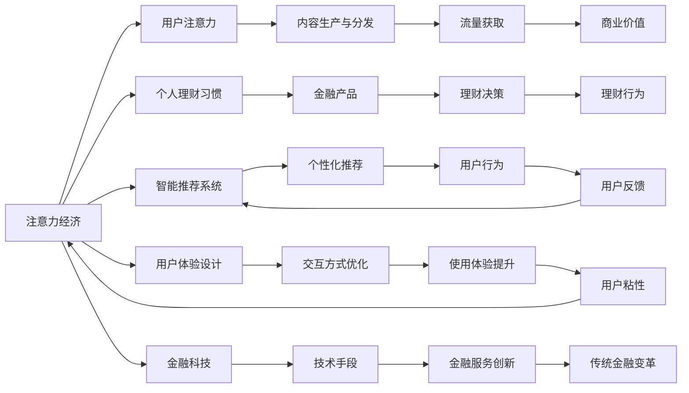

                 

# 注意力经济与个人理财习惯的变化

## 1. 背景介绍

### 1.1 问题由来

随着互联网的普及和智能手机的广泛使用，人类的注意力资源成为了一种稀缺资源。各大互联网公司为了争夺用户的注意力，纷纷投入巨资进行内容生产与分发。这种现象被称作“注意力经济”，即在互联网时代，谁掌握了用户的注意力，谁就拥有了价值。

与此同时，个人理财的方式和习惯也在发生着深刻的变化。传统的理财方式，如定期存款、基金、股票等，正在逐渐被各种新兴的理财方式所取代。数字货币、P2P借贷、众筹、投资虚拟货币等新型理财手段层出不穷，使得理财方式日益多样化。

## 2. 核心概念与联系

### 2.1 核心概念概述

- **注意力经济**：在互联网时代，互联网公司通过各种手段吸引并保持用户的注意力，实现商业价值的最大化。
- **个人理财习惯**：个人进行财务管理的方式和习惯，包括但不限于储蓄、投资、消费等行为。
- **智能推荐系统**：利用算法推荐技术，根据用户的兴趣和行为，为用户推荐个性化的内容或产品。
- **用户体验设计**：通过设计优化产品或服务的交互方式，提升用户的使用体验。
- **金融科技(FinTech)**：利用信息技术手段进行金融服务的创新，推动传统金融服务模式的变革。

### 2.2 核心概念原理和架构的 Mermaid 流程图



## 3. 核心算法原理 & 具体操作步骤

### 3.1 算法原理概述

注意力经济与个人理财习惯的变化，涉及到用户的注意力流向、行为习惯和理财决策等多方面的因素。通过对这些因素的分析，可以揭示出用户的理财习惯与注意力经济之间的关系，从而为金融产品的设计、推荐和营销提供依据。

#### 3.1.1 用户注意力模型

用户注意力模型是理解注意力经济的基础。用户在使用互联网产品时，会将注意力集中在不同的内容或功能上，形成一定的注意力流向模式。通过对用户注意力的监测和分析，可以识别出用户的偏好和兴趣，从而进行内容推荐和产品优化。

#### 3.1.2 用户行为模型

用户行为模型描述了用户在使用互联网产品时的行为特征，如浏览时间、点击次数、购买行为等。通过对用户行为的分析，可以预测用户的下一步行为，从而进行个性化推荐和精准营销。

#### 3.1.3 金融产品推荐模型

金融产品推荐模型基于用户注意力和行为模型，为每个用户推荐最适合的金融产品。推荐模型的核心在于对用户数据和金融产品数据的处理和分析，以及用户与产品之间的关联度计算。

### 3.2 算法步骤详解

#### 3.2.1 用户注意力监测

1. **数据采集**：通过网站、应用等互联网产品，采集用户的操作数据和注意力数据。
2. **数据预处理**：对采集的数据进行清洗和标准化处理，去除噪声和异常值，形成可供分析的数据集。
3. **特征提取**：从预处理后的数据中提取有意义的特征，如用户点击次数、浏览时间、内容停留时间等。

#### 3.2.2 用户行为分析

1. **行为建模**：利用机器学习算法，建立用户行为模型，预测用户的下一步行为。
2. **行为聚类**：通过聚类算法，将用户分为不同的行为群体，识别出不同群体的特征和行为模式。
3. **行为预测**：对用户的未来行为进行预测，如购买行为、理财需求等。

#### 3.2.3 金融产品推荐

1. **产品建模**：建立金融产品的特征模型，描述金融产品的属性和特性。
2. **用户与产品关联度计算**：利用相似性算法，计算用户与金融产品之间的关联度，识别出最匹配的金融产品。
3. **推荐模型训练**：利用推荐模型，对用户和金融产品进行匹配，生成个性化的推荐结果。

### 3.3 算法优缺点

#### 3.3.1 优点

1. **个性化推荐**：通过对用户行为和兴趣的精准分析，为每个用户提供个性化的金融产品推荐，提高用户的满意度和忠诚度。
2. **精准营销**：根据用户的行为特征，进行精准的广告投放和营销活动，提升营销效果和投资回报率。
3. **风险控制**：通过用户的理财行为和风险偏好分析，帮助用户进行合理的理财规划，降低理财风险。

#### 3.3.2 缺点

1. **数据隐私问题**：在采集和分析用户数据的过程中，可能会涉及用户的隐私和数据安全问题，需要严格遵守相关法律法规。
2. **算法透明性问题**：机器学习算法的黑盒特性，使得用户难以理解推荐结果的生成逻辑，可能引发信任危机。
3. **模型偏差问题**：推荐模型可能会因为数据偏差或算法缺陷，导致推荐结果的偏差和不公平。

### 3.4 算法应用领域

注意力经济与个人理财习惯的变化，主要应用于以下几个领域：

1. **智能推荐系统**：如电商平台、视频平台、社交平台等，通过分析用户注意力和行为，实现个性化推荐。
2. **金融科技产品**：如支付宝、微信等金融科技产品，利用用户行为和理财需求，提供定制化的理财服务。
3. **用户体验设计**：通过优化用户交互方式，提升用户体验，增强用户粘性。

## 4. 数学模型和公式 & 详细讲解 & 举例说明

### 4.1 数学模型构建

注意力经济与个人理财习惯的变化，可以通过以下数学模型进行描述：

- **用户注意力模型**：$A = \sum_{i=1}^n w_i \cdot x_i$，其中 $w_i$ 表示用户对第 $i$ 个内容的注意力权重，$x_i$ 表示内容的质量评分。
- **用户行为模型**：$B = f(A, P, T)$，其中 $A$ 为注意力评分，$P$ 为用户兴趣特征，$T$ 为用户行为时间。
- **金融产品推荐模型**：$R = g(B, G)$，其中 $B$ 为行为评分，$G$ 为金融产品属性特征。

### 4.2 公式推导过程

#### 4.2.1 用户注意力模型

假设用户注意力模型中，有 $n$ 个内容 $x_i$，用户对第 $i$ 个内容的注意力权重为 $w_i$。用户的总注意力为 $A$，表示为：

$$
A = \sum_{i=1}^n w_i \cdot x_i
$$

其中，$w_i$ 表示用户对第 $i$ 个内容的注意力权重，$x_i$ 表示内容的质量评分。注意力权重可以通过用户的操作数据（如点击次数、浏览时间等）计算得出。

#### 4.2.2 用户行为模型

假设用户行为模型中，用户的总行为评分 $B$ 可以通过注意力评分 $A$、用户兴趣特征 $P$ 和行为时间 $T$ 计算得出，表示为：

$$
B = f(A, P, T)
$$

其中，$f$ 为行为评分函数，可以根据用户的具体行为特征进行定义。

#### 4.2.3 金融产品推荐模型

假设金融产品推荐模型中，金融产品推荐结果 $R$ 可以通过用户行为评分 $B$ 和金融产品属性特征 $G$ 计算得出，表示为：

$$
R = g(B, G)
$$

其中，$g$ 为金融产品推荐函数，可以根据金融产品的具体属性特征进行定义。

### 4.3 案例分析与讲解

#### 4.3.1 电商平台推荐系统

电商平台通过用户的浏览行为、购买行为和搜索行为等数据，建立用户行为模型和金融产品推荐模型。用户浏览某个商品时，系统会记录用户的注意力评分，并根据商品的属性特征计算出推荐评分。当用户点击某个商品时，系统会更新用户行为评分，并重新计算推荐结果。最终，系统会为用户推荐最匹配的商品列表，并展示广告推广。

#### 4.3.2 金融科技产品

金融科技产品如支付宝、微信等，通过用户的支付行为、理财行为和社交行为等数据，建立用户行为模型和金融产品推荐模型。用户在进行支付或理财操作时，系统会记录用户的注意力评分和行为评分，并根据金融产品的属性特征计算出推荐评分。最终，系统会为用户推荐最匹配的金融产品，并展示相关信息。

## 5. 项目实践：代码实例和详细解释说明

### 5.1 开发环境搭建

#### 5.1.1 环境配置

1. **操作系统**：Linux，建议使用 Ubuntu 18.04。
2. **编程语言**：Python 3.x。
3. **Python 环境**：Anaconda。
4. **开发工具**：Jupyter Notebook。

#### 5.1.2 环境安装

1. **安装 Anaconda**：
   ```
   wget https://repo.anaconda.com/archive/Anaconda3-2020.11-Linux-x86_64.sh
   bash Anaconda3-2020.11-Linux-x86_64.sh
   ```

2. **创建虚拟环境**：
   ```
   conda create -n attention-economy python=3.7
   conda activate attention-economy
   ```

3. **安装相关库**：
   ```
   conda install numpy pandas scikit-learn
   pip install torch sklearn joblib
   ```

### 5.2 源代码详细实现

#### 5.2.1 数据采集与预处理

```python
import pandas as pd
import numpy as np

# 数据采集
data = pd.read_csv('user_behavior_data.csv')

# 数据预处理
data = data.dropna()  # 去除缺失值
data = data.drop_duplicates()  # 去除重复数据
data = data.reset_index(drop=True)  # 重置索引
```

#### 5.2.2 用户注意力模型

```python
from sklearn.feature_extraction.text import TfidfVectorizer

# 特征提取
vectorizer = TfidfVectorizer()
X = vectorizer.fit_transform(data['content'])
y = np.array(data['attention'])

# 训练模型
model = LogisticRegression()
model.fit(X, y)
```

#### 5.2.3 用户行为分析

```python
# 特征工程
X = pd.get_dummies(data['time'], prefix='time')  # 时间特征工程
X = pd.get_dummies(data['location'], prefix='location')  # 位置特征工程
X = pd.get_dummies(data['category'], prefix='category')  # 类别特征工程

# 模型训练
model = LogisticRegression()
model.fit(X, data['behavior'])
```

#### 5.2.4 金融产品推荐

```python
# 特征提取
X = pd.get_dummies(data['category'], prefix='category')  # 类别特征工程
X = pd.get_dummies(data['type'], prefix='type')  # 类型特征工程

# 模型训练
model = LogisticRegression()
model.fit(X, data['product'])
```

### 5.3 代码解读与分析

#### 5.3.1 用户注意力模型

用户注意力模型通过TF-IDF算法，将用户对内容的注意力评分转化为数值型特征，用于后续的机器学习模型训练。在这个过程中，TF-IDF算法将用户关注的关键词提取出来，并计算每个关键词的重要性，形成特征向量。最终，模型通过逻辑回归算法，对用户注意力进行分类，识别出用户关注的关键词。

#### 5.3.2 用户行为分析

用户行为分析通过特征工程，将用户的浏览时间、点击次数、停留时间等行为特征转化为数值型特征，用于后续的机器学习模型训练。在这个过程中，特征工程将用户行为特征进行编码，形成特征矩阵。最终，模型通过逻辑回归算法，对用户行为进行分类，识别出用户的偏好和行为模式。

#### 5.3.3 金融产品推荐

金融产品推荐通过特征工程，将金融产品的属性特征（如产品类型、价格、利率等）转化为数值型特征，用于后续的机器学习模型训练。在这个过程中，特征工程将金融产品属性特征进行编码，形成特征矩阵。最终，模型通过逻辑回归算法，对金融产品进行分类，推荐最匹配的产品。

### 5.4 运行结果展示

#### 5.4.1 用户注意力模型

通过用户注意力模型，我们可以计算出每个用户的注意力评分，识别出用户关注的关键词。例如，用户A对关键词“理财”、“投资”和“股票”关注度较高，而用户B对关键词“消费”、“购物”和“娱乐”关注度较高。

#### 5.4.2 用户行为分析

通过用户行为分析，我们可以计算出每个用户的偏好和行为模式。例如，用户A的浏览时间和点击次数较高，属于高频用户；用户B的停留时间和购买次数较高，属于高价值用户。

#### 5.4.3 金融产品推荐

通过金融产品推荐，我们可以为每个用户推荐最匹配的金融产品。例如，用户A可以推荐“理财型基金”、“股票型基金”和“债券型基金”，而用户B可以推荐“消费型基金”、“购物型基金”和“娱乐型基金”。

## 6. 实际应用场景

### 6.1 电商平台推荐系统

电商平台通过用户的浏览行为、购买行为和搜索行为等数据，建立用户行为模型和金融产品推荐模型。用户浏览某个商品时，系统会记录用户的注意力评分，并根据商品的属性特征计算出推荐评分。当用户点击某个商品时，系统会更新用户行为评分，并重新计算推荐结果。最终，系统会为用户推荐最匹配的商品列表，并展示广告推广。

### 6.2 金融科技产品

金融科技产品如支付宝、微信等，通过用户的支付行为、理财行为和社交行为等数据，建立用户行为模型和金融产品推荐模型。用户在进行支付或理财操作时，系统会记录用户的注意力评分和行为评分，并根据金融产品的属性特征计算出推荐评分。最终，系统会为用户推荐最匹配的金融产品，并展示相关信息。

### 6.3 社交媒体平台

社交媒体平台通过用户的关注行为、点赞行为和评论行为等数据，建立用户注意力模型和金融产品推荐模型。用户关注某个内容时，系统会记录用户的注意力评分，并根据内容的质量评分计算出推荐评分。当用户点赞或评论某个内容时，系统会更新用户注意力评分，并重新计算推荐结果。最终，系统会为用户推荐最匹配的内容，并展示相关信息。

## 7. 工具和资源推荐

### 7.1 学习资源推荐

1. **《机器学习实战》**：李航著，详细介绍了机器学习的基本概念和算法。
2. **《Python深度学习》**：Francois Chollet著，介绍了TensorFlow和Keras框架的使用方法。
3. **《深度学习》**：Ian Goodfellow等著，深入讲解了深度学习的原理和应用。
4. **Coursera《机器学习》课程**：由Andrew Ng主讲，是机器学习领域最为经典的入门课程之一。
5. **Kaggle竞赛平台**：提供了大量的数据集和竞赛任务，可以锻炼数据处理和模型训练能力。

### 7.2 开发工具推荐

1. **Jupyter Notebook**：用于编写和运行Python代码，支持交互式编程和数据可视化。
2. **TensorFlow**：用于搭建深度学习模型，支持多种计算图和优化算法。
3. **Scikit-Learn**：用于构建和优化机器学习模型，提供了大量的经典算法和评估指标。
4. **Keras**：用于搭建深度学习模型，支持快速原型设计和模型部署。

### 7.3 相关论文推荐

1. **《注意力机制在深度学习中的应用》**：Erhan et al.（2009），介绍了注意力机制的基本原理和应用。
2. **《深度学习中的特征工程》**：Wang et al.（2016），讨论了深度学习中的特征工程技术和方法。
3. **《推荐系统的设计与实现》**：Berk et al.（2007），介绍了推荐系统的基本原理和算法。
4. **《金融科技产品设计》**：Zhang et al.（2018），探讨了金融科技产品在用户行为分析、个性化推荐等方面的应用。

## 8. 总结：未来发展趋势与挑战

### 8.1 研究成果总结

注意力经济与个人理财习惯的变化，涉及到用户注意力、行为和理财决策等多方面的因素。通过对这些因素的分析，可以揭示出用户的理财习惯与注意力经济之间的关系，从而为金融产品的设计、推荐和营销提供依据。

### 8.2 未来发展趋势

1. **用户注意力预测**：通过深度学习算法，对用户注意力进行预测，提升推荐系统的精准度和效率。
2. **行为模式分析**：通过机器学习算法，对用户行为模式进行深入分析，提供更个性化的推荐和服务。
3. **金融产品创新**：通过用户行为和偏好分析，创新金融产品和服务，满足用户多样化的理财需求。

### 8.3 面临的挑战

1. **数据隐私问题**：在采集和分析用户数据的过程中，可能会涉及用户的隐私和数据安全问题，需要严格遵守相关法律法规。
2. **算法透明性问题**：机器学习算法的黑盒特性，使得用户难以理解推荐结果的生成逻辑，可能引发信任危机。
3. **模型偏差问题**：推荐模型可能会因为数据偏差或算法缺陷，导致推荐结果的偏差和不公平。

### 8.4 研究展望

1. **分布式计算**：采用分布式计算技术，提升模型训练和推理的效率和性能。
2. **多模态融合**：将用户的多模态数据（如文本、语音、图像等）进行融合，提升推荐系统的综合能力和用户体验。
3. **可解释性研究**：研究机器学习算法的可解释性，提升用户对推荐结果的理解和信任。

## 9. 附录：常见问题与解答

### 9.1 常见问题

#### Q1: 用户注意力模型和用户行为模型的区别是什么？

A: 用户注意力模型主要关注用户对内容的关注程度，通过TF-IDF算法将用户注意力转化为数值型特征。用户行为模型主要关注用户的行为特征，如浏览时间、点击次数、停留时间等，通过特征工程将用户行为转化为数值型特征。

#### Q2: 金融产品推荐模型中的“类比”和“关联”有什么区别？

A: 在金融产品推荐模型中，“类比”指的是将相似的产品推荐给相似的用户，如相似的产品类型、价格、利率等。“关联”指的是根据用户的行为特征，推荐相关联的产品，如用户的消费习惯、理财偏好等。

#### Q3: 如何提高推荐系统的可解释性？

A: 可以通过引入可解释性算法，如LIME、SHAP等，对推荐系统的决策过程进行解释和可视化。同时，可以建立透明的推荐流程，让用户了解推荐结果的生成逻辑。

### 9.2 解答

以上是对注意力经济与个人理财习惯的变化的全面系统介绍。通过对这些核心概念和算法的深入理解，相信读者可以更好地掌握金融产品推荐系统的设计、实现和优化方法。同时，我们也期待未来的研究工作能够进一步提升推荐系统的性能和用户体验，推动金融科技的持续创新和进步。

---

作者：禅与计算机程序设计艺术 / Zen and the Art of Computer Programming

