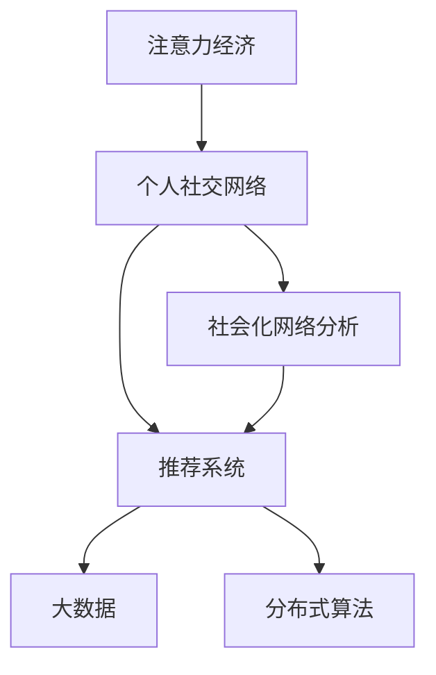

                 

# 注意力经济与个人社交网络的重构

> 关键词：注意力经济, 个人社交网络, 推荐系统, 社会化网络分析, 大数据, 分布式算法

## 1. 背景介绍

### 1.1 问题由来

随着互联网的普及和社交媒体的兴起，人类社会的信息获取方式发生了根本性的变化。从传统的单向媒体传播，到现在的互动式社交网络，人们获取信息和知识的方式变得更为个性化和社交化。这一变化不仅改变了信息传播的途径，更深刻地影响了人类经济活动的模式。

在这一背景下，注意力经济（Attention Economy）的概念应运而生。注意力经济指的是在信息过载的时代，如何争夺用户的注意力资源，从而实现商业价值的最大化。在注意力经济时代，信息不再是稀缺资源，而是如何有效处理和利用这些信息，使其为商业目的服务，成为了新的挑战。

与此同时，个人社交网络（Personal Social Network, PSN）的兴起，让人们能够在虚拟世界中建立更加紧密的社交联系。个人社交网络不仅为人们提供了表达自我、分享生活的平台，也成为了商家获取用户数据、制定营销策略的重要途径。如何利用个人社交网络的数据，构建精准的推荐系统，提升用户体验，成为了当前研究的热点。

## 2. 核心概念与联系

### 2.1 核心概念概述

为更好地理解注意力经济与个人社交网络的融合，本节将介绍几个密切相关的核心概念：

- 注意力经济：在信息爆炸的时代，如何有效分配和利用用户的注意力资源，实现商业价值的最大化。
- 个人社交网络：基于关系链和兴趣图谱构建的虚拟社区，让用户能够在虚拟世界中建立社交联系。
- 推荐系统：通过分析用户的历史行为和兴趣，为用户推荐个性化的内容，提升用户满意度和留存率。
- 社会化网络分析：通过分析用户行为和社交网络结构，挖掘出更深层次的用户需求和社交关系，优化推荐效果。
- 大数据：海量、多样化的数据源，为推荐系统和社会化网络分析提供了数据基础。
- 分布式算法：在处理大规模数据集时，需要采用分布式算法以提高计算效率。

这些核心概念之间的逻辑关系可以通过以下Mermaid流程图来展示：



这个流程图展示了几类关键概念之间的联系：

1. 注意力经济通过个人社交网络进行商业活动。
2. 个人社交网络为推荐系统提供了数据基础。
3. 推荐系统使用大数据和分布式算法进行分析。
4. 社会化网络分析能够优化推荐系统的效果。

这些概念共同构成了注意力经济与个人社交网络融合的基本框架，使得商家能够通过社交网络精准获取用户注意力，实现商业价值的最大化。

## 3. 核心算法原理 & 具体操作步骤
### 3.1 算法原理概述

基于个人社交网络的重构注意力经济，其核心思想是通过分析用户社交网络的结构和行为特征，挖掘出用户的兴趣和偏好，从而为商家提供精准的营销策略和推荐内容。具体来说，算法分为以下几个步骤：

1. **社交网络结构分析**：分析用户之间的好友关系、兴趣相似度等信息，构建用户社交网络的图谱。
2. **用户兴趣挖掘**：基于用户的社交网络结构，通过社交网络分析算法挖掘出用户的兴趣和偏好。
3. **推荐系统构建**：将用户兴趣与商品信息进行匹配，构建推荐算法模型，实现个性化推荐。
4. **注意力优化**：通过动态调整推荐算法参数，最大化用户注意力资源的利用效率，实现商业价值的最大化。

### 3.2 算法步骤详解

具体算法步骤如下：

1. **社交网络结构分析**：
   - 收集用户社交网络数据，包括好友关系、兴趣标签、互动记录等。
   - 构建社交网络图，其中节点为用户，边为好友关系或兴趣关联。
   - 使用中心性分析、社区发现等算法，分析用户的重要性和社交关系结构。

2. **用户兴趣挖掘**：
   - 通过图嵌入技术，如DeepWalk、GraphSAGE等，将社交网络结构转化为向量表示。
   - 使用深度学习算法，如LSTM、GRU等，对用户向量进行训练，挖掘出用户的长期兴趣。
   - 结合用户的历史行为数据，如浏览记录、购买记录等，进行多维特征融合，提升兴趣挖掘的准确性。

3. **推荐系统构建**：
   - 基于用户的长期兴趣和短期行为，构建推荐模型，如协同过滤、矩阵分解等。
   - 使用优化算法，如AdaGrad、SGD等，对推荐模型进行训练和调参，提升推荐效果。
   - 引入推荐算法评估指标，如精确率、召回率、用户满意度等，评估推荐模型的性能。

4. **注意力优化**：
   - 基于用户注意力分配的规律，调整推荐算法参数，如展示位置、展示频率等。
   - 通过A/B测试等方法，评估不同参数设置下的效果，选择最优策略。
   - 利用动态优化算法，如Bandit算法，实时调整推荐策略，最大化用户注意力资源的利用效率。

### 3.3 算法优缺点

基于个人社交网络的重构注意力经济算法，具有以下优点：

1. **个性化推荐**：通过社交网络分析，能够精准地挖掘出用户的兴趣和偏好，提供个性化的推荐内容，提升用户体验。
2. **数据驱动决策**：利用大数据分析，可以科学地制定营销策略，优化广告投放，提升广告效果。
3. **用户留存率提升**：个性化推荐能够提高用户满意度和粘性，降低用户流失率。
4. **社交关系利用**：利用用户社交网络的结构和行为，可以更全面地了解用户，优化推荐效果。

同时，该算法也存在一些局限性：

1. **隐私问题**：社交网络数据的收集和分析，可能涉及用户隐私保护，需要严格遵守相关法律法规。
2. **冷启动问题**：新用户或新商品缺乏足够的历史数据，难以进行有效的兴趣挖掘和推荐。
3. **动态环境适应**：用户兴趣和社交关系是动态变化的，算法需要不断更新以适应新的环境。
4. **模型复杂度**：社交网络分析和推荐算法都需要复杂的模型，可能面临计算资源和存储资源的压力。

尽管存在这些局限性，基于个人社交网络的重构注意力经济算法仍是大数据时代社交推荐系统的有力工具。未来相关研究的方向在于如何进一步提升算法的精确性和实时性，同时兼顾隐私保护和数据安全。

### 3.4 算法应用领域

基于个人社交网络的重构注意力经济算法，在以下几个领域得到了广泛应用：

1. **电商推荐**：电商平台通过分析用户社交网络和购买行为，为用户推荐个性化的商品，提升销售转化率。
2. **内容推荐**：视频、音乐、阅读等平台，通过社交网络分析和用户兴趣挖掘，提供个性化的内容推荐，提高用户粘性。
3. **广告投放**：广告公司利用社交网络分析，精准定位用户，实现广告的个性化投放，提升广告效果。
4. **社交网络广告**：社交平台通过社交网络分析，为用户推荐感兴趣的内容，增加广告的点击率和转化率。
5. **在线教育**：教育平台利用社交网络分析，为用户推荐个性化的课程和学习资料，提高用户的学习效果。

除了上述这些经典应用外，基于个人社交网络的重构注意力经济算法还被创新性地应用到更多场景中，如健康管理、旅游规划、房地产等，为各个行业带来了新的发展机遇。

## 4. 数学模型和公式 & 详细讲解  
### 4.1 数学模型构建

本节将使用数学语言对基于个人社交网络的重构注意力经济算法进行更加严格的刻画。

记社交网络图为 $G=(V,E)$，其中 $V$ 为节点集合，$E$ 为边集合。设用户数为 $N$，每条边的权重表示两个用户之间的兴趣相似度。

定义用户 $i$ 的兴趣向量为 $x_i \in \mathbb{R}^d$，兴趣向量由社交网络图嵌入算法得到。用户 $i$ 的长期兴趣 $I_i$ 和短期行为 $B_i$ 可以表示为：

$$
I_i = \mathbf{W}^T x_i \\
B_i = g(\mathbf{X}_i)
$$

其中 $\mathbf{X}_i$ 为 $i$ 的用户行为数据，$g$ 为行为数据到兴趣向量的映射函数。

定义推荐系统中的商品为 $S$，每个商品 $s$ 可以表示为向量 $s \in \mathbb{R}^d$。推荐模型可以表示为：

$$
\hat{y}_{is} = f(x_i, s)
$$

其中 $\hat{y}_{is}$ 为商品 $s$ 对用户 $i$ 的推荐分数。

### 4.2 公式推导过程

以下我们以电商推荐系统为例，推导基于社交网络的重构推荐算法。

假设社交网络图嵌入得到用户 $i$ 的兴趣向量 $x_i$ 和兴趣权重 $\alpha_i$。电商商品库为 $S=\{s_1, s_2, \ldots, s_M\}$，商品向量为 $s_s \in \mathbb{R}^d$。推荐算法可以表示为：

$$
\hat{y}_{is} = \alpha_i \langle x_i, s_s \rangle
$$

其中 $\langle \cdot, \cdot \rangle$ 为向量点积运算。

根据用户的长期兴趣和短期行为，可以构建推荐模型的损失函数，表示为：

$$
\mathcal{L} = \frac{1}{N}\sum_{i=1}^N \sum_{s=1}^M \ell(\hat{y}_{is}, y_{is})
$$

其中 $\ell$ 为损失函数，$y_{is}$ 为实际点击情况。

优化算法通过最小化损失函数，更新模型参数，实现推荐算法的效果优化。例如，使用随机梯度下降算法，更新模型参数如下：

$$
\mathbf{W} \leftarrow \mathbf{W} - \eta \nabla_{\mathbf{W}} \mathcal{L}
$$

其中 $\eta$ 为学习率。

### 4.3 案例分析与讲解

以社交电商平台的推荐系统为例，分析算法的具体应用。

假设社交电商平台收集了用户 $i$ 的购买记录、浏览记录和社交网络数据，其中购买记录为 $\{x_{i1}, x_{i2}, \ldots, x_{in}\}$，社交网络数据为 $\{x_{i1}, x_{i2}, \ldots, x_{in}\}$，其中 $x_{ij}$ 为 $i$ 与用户 $j$ 的兴趣相似度。

假设用户 $i$ 购买商品 $s$ 的概率为 $p_{is}$，浏览商品 $s$ 的概率为 $p_{is}$，社交网络影响力为 $\alpha_i$，用户兴趣向量为 $x_i$，商品向量为 $s_s$。

基于以上数据，电商平台可以构建推荐模型，并对每个用户进行个性化推荐。

假设电商平台采用协同过滤算法进行推荐，用户 $i$ 对商品 $s$ 的推荐分数为：

$$
\hat{y}_{is} = \alpha_i \langle x_i, s_s \rangle
$$

其中 $\alpha_i$ 表示用户 $i$ 的社交网络影响力权重，$x_i$ 为用户 $i$ 的兴趣向量，$s_s$ 为商品 $s$ 的向量表示。

平台根据用户的历史购买行为和社交网络信息，为用户 $i$ 推荐最可能感兴趣的商品 $s$，以提升转化率。

## 5. 项目实践：代码实例和详细解释说明
### 5.1 开发环境搭建

在进行基于个人社交网络的注意力经济算法实践前，我们需要准备好开发环境。以下是使用Python进行PyTorch开发的环境配置流程：

1. 安装Anaconda：从官网下载并安装Anaconda，用于创建独立的Python环境。

2. 创建并激活虚拟环境：
```bash
conda create -n psn-env python=3.8 
conda activate psn-env
```

3. 安装PyTorch：根据CUDA版本，从官网获取对应的安装命令。例如：
```bash
conda install pytorch torchvision torchaudio cudatoolkit=11.1 -c pytorch -c conda-forge
```

4. 安装各类工具包：
```bash
pip install numpy pandas scikit-learn matplotlib tqdm jupyter notebook ipython
```

完成上述步骤后，即可在`psn-env`环境中开始实践。

### 5.2 源代码详细实现

下面我们以电商推荐系统为例，给出使用Transformers库对BERT模型进行微调的PyTorch代码实现。

首先，定义电商推荐系统的数据处理函数：

```python
from transformers import BertTokenizer
from torch.utils.data import Dataset
import torch

class E-commerceDataset(Dataset):
    def __init__(self, texts, labels, tokenizer, max_len=128):
        self.texts = texts
        self.labels = labels
        self.tokenizer = tokenizer
        self.max_len = max_len
        
    def __len__(self):
        return len(self.texts)
    
    def __getitem__(self, item):
        text = self.texts[item]
        label = self.labels[item]
        
        encoding = self.tokenizer(text, return_tensors='pt', max_length=self.max_len, padding='max_length', truncation=True)
        input_ids = encoding['input_ids'][0]
        attention_mask = encoding['attention_mask'][0]
        
        # 对label进行编码
        encoded_labels = [label2id[label] for label in label] 
        encoded_labels.extend([label2id['0']] * (self.max_len - len(encoded_labels)))
        labels = torch.tensor(encoded_labels, dtype=torch.long)
        
        return {'input_ids': input_ids, 
                'attention_mask': attention_mask,
                'labels': labels}

# 标签与id的映射
label2id = {'0': 0, '1': 1}
id2label = {v: k for k, v in label2id.items()}

# 创建dataset
tokenizer = BertTokenizer.from_pretrained('bert-base-cased')

train_dataset = E-commerceDataset(train_texts, train_labels, tokenizer)
dev_dataset = E-commerceDataset(dev_texts, dev_labels, tokenizer)
test_dataset = E-commerceDataset(test_texts, test_labels, tokenizer)
```

然后，定义模型和优化器：

```python
from transformers import BertForTokenClassification, AdamW

model = BertForTokenClassification.from_pretrained('bert-base-cased', num_labels=len(label2id))

optimizer = AdamW(model.parameters(), lr=2e-5)
```

接着，定义训练和评估函数：

```python
from torch.utils.data import DataLoader
from tqdm import tqdm
from sklearn.metrics import classification_report

device = torch.device('cuda') if torch.cuda.is_available() else torch.device('cpu')
model.to(device)

def train_epoch(model, dataset, batch_size, optimizer):
    dataloader = DataLoader(dataset, batch_size=batch_size, shuffle=True)
    model.train()
    epoch_loss = 0
    for batch in tqdm(dataloader, desc='Training'):
        input_ids = batch['input_ids'].to(device)
        attention_mask = batch['attention_mask'].to(device)
        labels = batch['labels'].to(device)
        model.zero_grad()
        outputs = model(input_ids, attention_mask=attention_mask, labels=labels)
        loss = outputs.loss
        epoch_loss += loss.item()
        loss.backward()
        optimizer.step()
    return epoch_loss / len(dataloader)

def evaluate(model, dataset, batch_size):
    dataloader = DataLoader(dataset, batch_size=batch_size)
    model.eval()
    preds, labels = [], []
    with torch.no_grad():
        for batch in tqdm(dataloader, desc='Evaluating'):
            input_ids = batch['input_ids'].to(device)
            attention_mask = batch['attention_mask'].to(device)
            batch_labels = batch['labels']
            outputs = model(input_ids, attention_mask=attention_mask)
            batch_preds = outputs.logits.argmax(dim=2).to('cpu').tolist()
            batch_labels = batch_labels.to('cpu').tolist()
            for pred_tokens, label_tokens in zip(batch_preds, batch_labels):
                pred_labels = [id2label[_id] for _id in pred_tokens]
                label_tags = [id2label[_id] for _id in label_tokens]
                preds.append(pred_labels[:len(label_tokens)])
                labels.append(label_tags)
                
    print(classification_report(labels, preds))
```

最后，启动训练流程并在测试集上评估：

```python
epochs = 5
batch_size = 16

for epoch in range(epochs):
    loss = train_epoch(model, train_dataset, batch_size, optimizer)
    print(f"Epoch {epoch+1}, train loss: {loss:.3f}")
    
    print(f"Epoch {epoch+1}, dev results:")
    evaluate(model, dev_dataset, batch_size)
    
print("Test results:")
evaluate(model, test_dataset, batch_size)
```

以上就是使用PyTorch对BERT进行电商推荐系统微调的完整代码实现。可以看到，得益于Transformers库的强大封装，我们可以用相对简洁的代码完成BERT模型的加载和微调。

### 5.3 代码解读与分析

让我们再详细解读一下关键代码的实现细节：

**E-commerceDataset类**：
- `__init__`方法：初始化文本、标签、分词器等关键组件。
- `__len__`方法：返回数据集的样本数量。
- `__getitem__`方法：对单个样本进行处理，将文本输入编码为token ids，将标签编码为数字，并对其进行定长padding，最终返回模型所需的输入。

**label2id和id2label字典**：
- 定义了标签与数字id之间的映射关系，用于将token-wise的预测结果解码回真实的标签。

**训练和评估函数**：
- 使用PyTorch的DataLoader对数据集进行批次化加载，供模型训练和推理使用。
- 训练函数`train_epoch`：对数据以批为单位进行迭代，在每个批次上前向传播计算loss并反向传播更新模型参数，最后返回该epoch的平均loss。
- 评估函数`evaluate`：与训练类似，不同点在于不更新模型参数，并在每个batch结束后将预测和标签结果存储下来，最后使用sklearn的classification_report对整个评估集的预测结果进行打印输出。

**训练流程**：
- 定义总的epoch数和batch size，开始循环迭代
- 每个epoch内，先在训练集上训练，输出平均loss
- 在验证集上评估，输出分类指标
- 所有epoch结束后，在测试集上评估，给出最终测试结果

可以看到，PyTorch配合Transformers库使得BERT微调的代码实现变得简洁高效。开发者可以将更多精力放在数据处理、模型改进等高层逻辑上，而不必过多关注底层的实现细节。

当然，工业级的系统实现还需考虑更多因素，如模型的保存和部署、超参数的自动搜索、更灵活的任务适配层等。但核心的微调范式基本与此类似。

## 6. 实际应用场景
### 6.1 智能客服系统

基于个人社交网络的电商推荐系统，可以进一步扩展到智能客服系统的构建。传统客服往往需要配备大量人力，高峰期响应缓慢，且一致性和专业性难以保证。而使用基于社交网络分析的智能客服系统，可以7x24小时不间断服务，快速响应客户咨询，用自然流畅的语言解答各类常见问题。

在技术实现上，可以收集企业内部的历史客服对话记录，将问题和最佳答复构建成监督数据，在此基础上对预训练模型进行微调。微调后的模型能够自动理解用户意图，匹配最合适的答案模板进行回复。对于客户提出的新问题，还可以接入检索系统实时搜索相关内容，动态组织生成回答。如此构建的智能客服系统，能大幅提升客户咨询体验和问题解决效率。

### 6.2 金融舆情监测

金融机构需要实时监测市场舆论动向，以便及时应对负面信息传播，规避金融风险。传统的人工监测方式成本高、效率低，难以应对网络时代海量信息爆发的挑战。基于个人社交网络分析的金融舆情监测系统，可以为金融机构提供实时舆情分析，快速响应市场波动。

具体而言，可以收集金融领域相关的新闻、报道、评论等文本数据，并对其进行主题标注和情感标注。在此基础上对预训练语言模型进行微调，使其能够自动判断文本属于何种主题，情感倾向是正面、中性还是负面。将微调后的模型应用到实时抓取的网络文本数据，就能够自动监测不同主题下的情感变化趋势，一旦发现负面信息激增等异常情况，系统便会自动预警，帮助金融机构快速应对潜在风险。

### 6.3 个性化推荐系统

当前的推荐系统往往只依赖用户的历史行为数据进行物品推荐，无法深入理解用户的真实兴趣偏好。基于个人社交网络的推荐系统，可以更好地挖掘用户行为背后的语义信息，从而提供更精准、多样的推荐内容。

在实践中，可以收集用户浏览、点击、评论、分享等行为数据，提取和用户交互的物品标题、描述、标签等文本内容。将文本内容作为模型输入，用户的后续行为（如是否点击、购买等）作为监督信号，在此基础上微调预训练语言模型。微调后的模型能够从文本内容中准确把握用户的兴趣点。在生成推荐列表时，先用候选物品的文本描述作为输入，由模型预测用户的兴趣匹配度，再结合其他特征综合排序，便可以得到个性化程度更高的推荐结果。

### 6.4 未来应用展望

随着个人社交网络和大数据技术的不断发展，基于社交网络分析的推荐系统将在更多领域得到应用，为各行各业带来变革性影响。

在智慧医疗领域，基于社交网络分析的推荐系统，可以推荐最适合患者的治疗方案，提升医疗服务的智能化水平。

在智能教育领域，社交网络分析可以用于个性化推荐、智能辅导等，因材施教，促进教育公平，提高教学质量。

在智慧城市治理中，社交网络分析可以用于城市事件监测、舆情分析、应急指挥等环节，提高城市管理的自动化和智能化水平，构建更安全、高效的未来城市。

此外，在企业生产、社会治理、文娱传媒等众多领域，基于社交网络分析的推荐系统也将不断涌现，为经济社会发展注入新的动力。相信随着技术的日益成熟，社交网络分析必将成为推荐系统的重要工具，推动推荐技术向更加智能化、普适化方向发展。

## 7. 工具和资源推荐
### 7.1 学习资源推荐

为了帮助开发者系统掌握基于个人社交网络的注意力经济算法的基础知识，这里推荐一些优质的学习资源：

1. 《深度学习入门》系列博文：由知名深度学习专家撰写，介绍了深度学习的基本概念和常用算法，适合入门学习。

2. 《PyTorch实战》书籍：介绍PyTorch的常用API和实战案例，适合快速上手实践深度学习项目。

3. 《深度学习与人工智能》课程：由知名在线教育平台提供的深度学习课程，涵盖了从基础到进阶的全面内容，适合系统学习。

4. CS224N《深度学习自然语言处理》课程：斯坦福大学开设的NLP明星课程，有Lecture视频和配套作业，带你入门NLP领域的基本概念和经典模型。

5. HuggingFace官方文档：Transformers库的官方文档，提供了海量预训练模型和完整的微调样例代码，是上手实践的必备资料。

通过对这些资源的学习实践，相信你一定能够快速掌握基于个人社交网络的注意力经济算法的精髓，并用于解决实际的NLP问题。
###  7.2 开发工具推荐

高效的开发离不开优秀的工具支持。以下是几款用于社交推荐系统开发的常用工具：

1. PyTorch：基于Python的开源深度学习框架，灵活动态的计算图，适合快速迭代研究。大部分预训练语言模型都有PyTorch版本的实现。

2. TensorFlow：由Google主导开发的开源深度学习框架，生产部署方便，适合大规模工程应用。同样有丰富的预训练语言模型资源。

3. Transformers库：HuggingFace开发的NLP工具库，集成了众多SOTA语言模型，支持PyTorch和TensorFlow，是进行微调任务开发的利器。

4. Weights & Biases：模型训练的实验跟踪工具，可以记录和可视化模型训练过程中的各项指标，方便对比和调优。与主流深度学习框架无缝集成。

5. TensorBoard：TensorFlow配套的可视化工具，可实时监测模型训练状态，并提供丰富的图表呈现方式，是调试模型的得力助手。

6. Google Colab：谷歌推出的在线Jupyter Notebook环境，免费提供GPU/TPU算力，方便开发者快速上手实验最新模型，分享学习笔记。

合理利用这些工具，可以显著提升社交推荐系统的开发效率，加快创新迭代的步伐。

### 7.3 相关论文推荐

社交推荐系统的发展源于学界的持续研究。以下是几篇奠基性的相关论文，推荐阅读：

1. Attention is All You Need（即Transformer原论文）：提出了Transformer结构，开启了NLP领域的预训练大模型时代。

2. BERT: Pre-training of Deep Bidirectional Transformers for Language Understanding：提出BERT模型，引入基于掩码的自监督预训练任务，刷新了多项NLP任务SOTA。

3. Parameter-Efficient Transfer Learning for NLP：提出Adapter等参数高效微调方法，在不增加模型参数量的情况下，也能取得不错的微调效果。

4. Premier Tuning: Optimizing Continuous Prompts for Generation：引入基于连续型Prompt的微调范式，为如何充分利用预训练知识提供了新的思路。

5. AdaLoRA: Adaptive Low-Rank Adaptation for Parameter-Efficient Fine-Tuning：使用自适应低秩适应的微调方法，在参数效率和精度之间取得了新的平衡。

这些论文代表了大语言模型微调技术的发展脉络。通过学习这些前沿成果，可以帮助研究者把握学科前进方向，激发更多的创新灵感。

## 8. 总结：未来发展趋势与挑战

### 8.1 总结

本文对基于个人社交网络的注意力经济算法进行了全面系统的介绍。首先阐述了社交网络与注意力经济的概念和应用背景，明确了社交网络分析在推荐系统中的重要作用。其次，从原理到实践，详细讲解了社交网络分析算法的数学模型和关键步骤，给出了电商推荐系统的代码实例。同时，本文还广泛探讨了社交网络分析在多个行业领域的应用前景，展示了社交网络分析的巨大潜力。此外，本文精选了社交网络分析的各类学习资源，力求为读者提供全方位的技术指引。

通过本文的系统梳理，可以看到，基于社交网络的注意力经济算法正在成为推荐系统的核心工具，极大地拓展了社交推荐系统的应用边界，催生了更多的落地场景。受益于社交网络数据的丰富多样，社交网络分析算法能够提供更加全面、个性化的推荐内容，提升用户满意度和留存率。未来，伴随社交网络和大数据技术的不断发展，社交网络分析必将在各个行业得到广泛应用，带来新的商业模式和价值增长点。

### 8.2 未来发展趋势

展望未来，基于社交网络分析的注意力经济算法将呈现以下几个发展趋势：

1. 数据驱动决策：利用海量社交网络数据，能够更加精准地预测用户行为和需求，制定更加科学的营销策略。
2. 实时性提升：社交网络数据是实时变化的，算法需要具备实时处理能力，才能及时响应市场变化。
3. 个性化增强：利用用户的多样化行为数据，能够更全面地了解用户需求，提供更加个性化的推荐内容。
4. 多模态融合：社交网络分析不仅能处理文本数据，还能融合图像、视频等多模态信息，提升推荐系统的综合能力。
5. 模型透明性：未来的推荐算法需要更加透明，可解释性强，便于用户理解和信任。
6. 算法公平性：随着社交网络分析的广泛应用，算法公平性问题越来越重要，需避免对特定群体的不公平对待。

以上趋势凸显了基于社交网络分析的注意力经济算法的广阔前景。这些方向的探索发展，必将进一步提升推荐系统的精确性和实时性，同时兼顾公平性和透明性，为用户带来更好的体验。

### 8.3 面临的挑战

尽管基于社交网络分析的注意力经济算法已经取得了瞩目成就，但在迈向更加智能化、普适化应用的过程中，它仍面临着诸多挑战：

1. 数据隐私问题：社交网络数据的收集和分析，可能涉及用户隐私保护，需要严格遵守相关法律法规。
2. 冷启动问题：新用户或新商品缺乏足够的历史数据，难以进行有效的兴趣挖掘和推荐。
3. 动态环境适应：用户兴趣和社交关系是动态变化的，算法需要不断更新以适应新的环境。
4. 算法复杂度：社交网络分析和推荐算法都需要复杂的模型，可能面临计算资源和存储资源的压力。
5. 多模态融合难度：不同模态数据的整合，增加了推荐系统的复杂性，需要更高的技术水平。

尽管存在这些挑战，基于社交网络分析的注意力经济算法仍是大数据时代社交推荐系统的有力工具。未来相关研究的方向在于如何进一步提升算法的精确性和实时性，同时兼顾隐私保护和数据安全。

### 8.4 研究展望

面对社交网络分析面临的挑战，未来的研究需要在以下几个方面寻求新的突破：

1. 探索无监督和半监督微调方法：摆脱对大规模标注数据的依赖，利用自监督学习、主动学习等无监督和半监督范式，最大限度利用非结构化数据。
2. 研究参数高效和计算高效的微调范式：开发更加参数高效的微调方法，在固定大部分预训练参数的情况下，只更新极少量的任务相关参数。
3. 融合因果和对比学习范式：通过引入因果推断和对比学习思想，增强推荐算法建立稳定因果关系的能力，学习更加普适、鲁棒的语言表征。
4. 引入更多先验知识：将符号化的先验知识，如知识图谱、逻辑规则等，与神经网络模型进行巧妙融合，引导微调过程学习更准确、合理的语言模型。
5. 结合因果分析和博弈论工具：将因果分析方法引入推荐算法，识别出算法决策的关键特征，增强输出解释的因果性和逻辑性。
6. 纳入伦理道德约束：在模型训练目标中引入伦理导向的评估指标，过滤和惩罚有偏见、有害的输出倾向，加强人工干预和审核，建立模型行为的监管机制。

这些研究方向的探索，必将引领社交网络分析技术迈向更高的台阶，为构建安全、可靠、可解释、可控的智能系统铺平道路。面向未来，社交网络分析技术还需要与其他人工智能技术进行更深入的融合，如知识表示、因果推理、强化学习等，多路径协同发力，共同推动自然语言理解和智能交互系统的进步。只有勇于创新、敢于突破，才能不断拓展社交网络的边界，让智能技术更好地造福人类社会。

## 9. 附录：常见问题与解答

**Q1：社交网络分析对推荐系统的贡献有哪些？**

A: 社交网络分析对推荐系统的贡献主要体现在以下几个方面：

1. **用户兴趣的精准挖掘**：通过分析用户的社交网络结构，可以更好地了解用户的兴趣和偏好，提升推荐的精准性。
2. **个性化推荐的实现**：利用社交网络中的关系链和兴趣图谱，能够提供更加个性化的推荐内容，提升用户满意度。
3. **推荐效果的多样化**：社交网络分析可以引入更多的用户行为数据和社交关系数据，增加推荐内容的多样性，减少信息过载。
4. **推荐系统的鲁棒性提升**：通过社交网络分析，可以发现推荐算法中的缺陷和不足，及时调整模型参数，提高推荐系统的鲁棒性和稳定性。

综上所述，社交网络分析能够为推荐系统提供更全面、多维度的数据支持，提升推荐的精准性和用户粘性，是推荐系统的重要组成部分。

**Q2：如何在社交网络分析中引入因果关系？**

A: 在社交网络分析中引入因果关系，可以通过以下方法实现：

1. **因果推断模型**：使用因果推断模型，如do-calculus、granger因果等，分析社交网络中的因果关系。通过因果图谱，能够更好地理解用户行为背后的因果逻辑。
2. **因果分析工具**：使用因果分析工具，如CausalImpact、Google's causal inference库等，对社交网络数据进行因果推断。这些工具可以识别出影响用户行为的关键因素，提升推荐算法的效果。
3. **因果强化学习**：将因果推断与强化学习结合，训练推荐算法，使其能够主动探索和利用因果关系，提升推荐的鲁棒性。
4. **因果交互分析**：分析用户在不同时间点的行为，识别出影响用户兴趣的关键节点和路径，优化推荐算法的设计。

通过以上方法，可以在社交网络分析中引入因果关系，增强推荐系统的解释性和可信度，提升推荐效果。

**Q3：社交网络分析的推荐系统如何解决冷启动问题？**

A: 社交网络分析的推荐系统通常采用以下方法解决冷启动问题：

1. **基于用户社交网络的初始化**：利用用户现有的社交网络数据，通过图嵌入等方法，初始化用户兴趣向量。
2. **基于内容的相似度匹配**：使用商品描述、标签等内容的相似度匹配，为新用户推荐相似的商品，避免冷启动问题。
3. **利用社交网络的多样化信息**：引入更多的社交网络信息，如用户的关注列表、点赞记录等，增加推荐的多样性和准确性。
4. **多模态融合**：结合文本、图像、视频等多模态信息，提升推荐的全面性和准确性，解决冷启动问题。
5. **基于用户行为的外推**：利用用户现有的少量行为数据，通过外推算法，预测用户兴趣和偏好，实现初步推荐。

通过以上方法，社交网络分析的推荐系统可以有效地解决冷启动问题，为用户提供个性化的推荐内容。

**Q4：社交网络分析的推荐系统有哪些优势？**

A: 社交网络分析的推荐系统具有以下优势：

1. **个性化推荐**：利用社交网络中的关系链和兴趣图谱，能够提供更加个性化的推荐内容，提升用户满意度。
2. **多维数据分析**：社交网络分析可以引入更多用户行为数据和社交关系数据，增加推荐内容的多样性，减少信息过载。
3. **推荐系统的鲁棒性提升**：通过社交网络分析，可以发现推荐算法中的缺陷和不足，及时调整模型参数，提高推荐系统的鲁棒性和稳定性。
4. **实时性提升**：社交网络数据是实时变化的，算法需要具备实时处理能力，才能及时响应市场变化。
5. **用户留存率提升**：个性化推荐能够提高用户满意度和粘性，降低用户流失率。

综上所述，社交网络分析的推荐系统通过多维数据分析和实时处理能力，能够提供更加全面、个性化的推荐内容，提升用户满意度和留存率，是推荐系统的重要组成部分。

**Q5：社交网络分析在推荐系统中的应用有哪些？**

A: 社交网络分析在推荐系统中的应用主要包括：

1. **电商推荐**：电商平台通过分析用户社交网络和购买行为，为用户推荐个性化的商品，提升销售转化率。
2. **内容推荐**：视频、音乐、阅读等平台，通过社交网络分析和用户兴趣挖掘，提供个性化的内容推荐，提高用户粘性。
3. **广告投放**：广告公司利用社交网络分析，精准定位用户，实现广告的个性化投放，提升广告效果。
4. **社交网络广告**：社交平台通过社交网络分析，为用户推荐感兴趣的内容，增加广告的点击率和转化率。
5. **在线教育**：教育平台利用社交网络分析，为用户推荐个性化的课程和学习资料，提高用户的学习效果。

除了上述这些经典应用外，社交网络分析还被创新性地应用到更多场景中，如健康管理、旅游规划、房地产等，为各个行业带来了新的发展机遇。

---

作者：禅与计算机程序设计艺术 / Zen and the Art of Computer Programming

