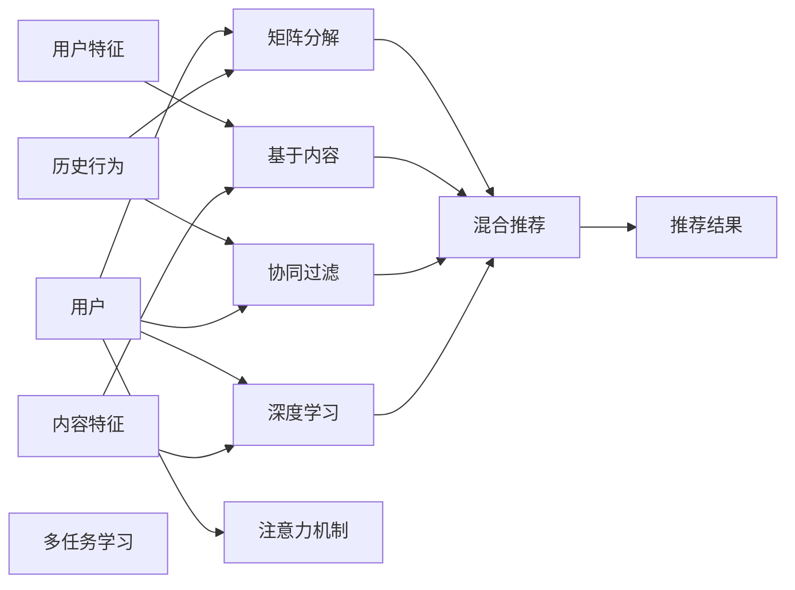

                 

## 1. 背景介绍

在信息爆炸的时代，人们每天都会接触到海量的内容，从新闻、视频到社交媒体，再到商业广告，信息洪流无处不在。然而，传统的内容分发方式往往缺乏个性化，内容质量和用户体验难以达到预期，严重影响了用户体验。

**1.1 内容消费的变革**
随着移动互联网和智能设备的发展，用户对于内容的消费行为发生了深刻变化。从简单的信息浏览，到主动的互动体验，再到个性化的内容推荐，用户对内容的消费已经逐步走向定制化和互动化。

**1.2 个性化推荐的重要性**
个性化推荐系统通过分析和理解用户的兴趣、行为和偏好，推荐其感兴趣的内容，从而显著提升了用户的内容消费体验和满意度。它不仅能提高用户粘性，还推动了内容生产者的收益增长。

**1.3 个性化推荐系统现状**
目前，个性化推荐系统已经被广泛应用于电商、社交、视频等多个领域。推荐算法从简单的协同过滤，逐步发展到基于内容、基于矩阵分解、基于深度学习等更复杂的技术，能够处理海量数据，精准预测用户兴趣。

## 2. 核心概念与联系

### 2.1 核心概念概述

为了深入理解个性化推荐系统，我们首先需要掌握一些核心概念和框架：

- **个性化推荐系统(Recommendation System)**：根据用户的历史行为和偏好，推荐其可能感兴趣的内容的系统。
- **协同过滤(Collaborative Filtering)**：利用用户行为数据，通过相似度计算找到潜在感兴趣的用户和内容。
- **基于内容的推荐(Content-based Filtering)**：根据内容的属性特征，计算用户与内容的匹配度。
- **矩阵分解(Matrix Factorization)**：通过将用户-内容矩阵分解为用户和内容的低维表示，预测用户对未交互内容的评分。
- **深度学习(Deep Learning)**：通过神经网络模型，直接从原始数据中学习用户与内容的表示关系，进行内容推荐。
- **注意力机制(Attention Mechanism)**：通过引入注意力机制，使模型能够动态关注用户兴趣的多个维度，提高推荐效果。
- **多任务学习(Multi-task Learning)**：通过同时处理多个相关任务，提升模型的泛化能力和推荐性能。
- **混合推荐系统(Hybrid Recommendation System)**：结合多种推荐方法，取长补短，提升推荐系统的整体表现。

这些概念构成了个性化推荐系统的主要框架，帮助我们理解和设计推荐系统。

### 2.2 核心概念原理和架构的 Mermaid 流程图



该流程图展示了推荐系统的核心组件和信息流动。用户的行为和特征通过不同推荐方法进行处理，最终输出推荐结果。

## 3. 核心算法原理 & 具体操作步骤

### 3.1 算法原理概述

个性化推荐系统的核心原理是通过对用户历史行为和内容特征的分析，预测用户对未交互内容的兴趣，从而进行内容推荐。推荐算法主要包括基于协同过滤、基于内容、矩阵分解、深度学习等多种技术。

其中，注意力机制和多任务学习是近年来逐渐兴起的新技术，通过引入注意力机制和多任务学习，推荐系统能够更好地理解用户兴趣的多样性和动态变化，从而提高推荐效果。

### 3.2 算法步骤详解

**3.2.1 数据预处理**
- **用户数据**：包括用户的ID、浏览历史、评分记录等。
- **内容数据**：包括内容的ID、属性特征、评分记录等。
- **数据清洗**：去除噪声数据，处理缺失值，规范化数据格式。
- **数据划分**：将数据分为训练集、验证集和测试集。

**3.2.2 特征工程**
- **用户特征**：包括用户的ID、兴趣标签、历史评分等。
- **内容特征**：包括内容的ID、标签、属性等。
- **特征组合**：通过特征组合，生成更丰富的用户和内容表示。

**3.2.3 模型训练**
- **协同过滤**：利用用户行为数据，计算用户之间的相似度和内容之间的相似度，推荐相似用户和相似内容。
- **基于内容**：根据内容属性特征，计算用户与内容的匹配度。
- **矩阵分解**：将用户-内容矩阵分解为用户和内容的低维表示，预测用户对未交互内容的评分。
- **深度学习**：通过神经网络模型，直接从原始数据中学习用户与内容的表示关系，进行内容推荐。

**3.2.4 模型评估**
- **离线评估**：在测试集上评估推荐模型的准确性和效果。
- **在线评估**：在实际应用中，评估推荐系统的效果，如点击率、转化率等。

**3.2.5 推荐结果排序**
- **评分预测**：预测用户对未交互内容的评分。
- **排序算法**：根据评分预测结果，进行内容排序。

**3.2.6 系统优化**
- **模型优化**：调整模型参数，提升推荐效果。
- **用户反馈**：收集用户反馈，进行在线学习，优化推荐系统。

### 3.3 算法优缺点

**3.3.1 优点**
- **准确性**：能够精准预测用户兴趣，推荐高相关内容。
- **个性化**：根据用户历史行为和兴趣，推荐个性化内容。
- **可扩展性**：能够处理大规模数据，适用于电商、社交、视频等多个领域。

**3.3.2 缺点**
- **冷启动问题**：新用户和新内容没有历史数据，难以推荐。
- **数据稀疏性**：用户行为数据和内容特征数据往往存在稀疏性，影响推荐效果。
- **复杂度**：深度学习和多任务学习等复杂模型，计算复杂度较高。

### 3.4 算法应用领域

个性化推荐系统已经在电商、社交、视频等多个领域得到了广泛应用，具体包括：

- **电商平台**：推荐用户感兴趣的商品，提高用户购物体验和销售转化率。
- **视频平台**：推荐用户感兴趣的视频内容，提高用户观看时间和平台流量。
- **社交媒体**：推荐用户感兴趣的朋友和内容，提升平台活跃度和用户粘性。
- **音乐平台**：推荐用户感兴趣的歌曲和专辑，提高用户音乐体验和平台收益。
- **新闻媒体**：推荐用户感兴趣的新闻和文章，提高用户阅读量和平台流量。

## 4. 数学模型和公式 & 详细讲解 & 举例说明

### 4.1 数学模型构建

**4.1.1 用户-内容评分矩阵**
设用户集合为 $U$，内容集合为 $V$，用户 $u$ 对内容 $v$ 的评分记为 $r_{uv}$。构建用户-内容评分矩阵 $R$：

$$
R = \{ r_{uv} \}_{u \in U, v \in V}
$$

**4.1.2 用户特征表示**
设用户 $u$ 的特征向量为 $x_u$，维度为 $d$。用户特征表示可以通过多种方式获取，如用户行为、兴趣标签等。

$$
x_u = [x_{u1}, x_{u2}, \dots, x_{ud}]
$$

**4.1.3 内容特征表示**
设内容 $v$ 的特征向量为 $y_v$，维度为 $d$。内容特征表示可以通过多种方式获取，如内容属性、标签等。

$$
y_v = [y_{v1}, y_{v2}, \dots, y_{vd}]
$$

### 4.2 公式推导过程

**4.2.1 协同过滤**
协同过滤方法基于用户行为数据，通过计算用户之间的相似度和内容之间的相似度，进行推荐。假设用户 $u$ 与用户 $i$ 的相似度为 $s_{ui}$，内容 $v$ 与内容 $j$ 的相似度为 $s_{vj}$，则协同过滤推荐公式为：

$$
\hat{r}_{uv} = \sum_{i \in U} s_{ui} \cdot r_{iv}
$$

**4.2.2 基于内容**
基于内容的方法根据内容属性特征，计算用户与内容的匹配度。设内容 $v$ 的属性向量为 $a_v$，用户 $u$ 与内容 $v$ 的匹配度为 $c_{uv}$，则基于内容的推荐公式为：

$$
\hat{r}_{uv} = \sum_{v \in V} c_{uv} \cdot a_v
$$

**4.2.3 矩阵分解**
矩阵分解方法通过将用户-内容矩阵分解为用户和内容的低维表示，预测用户对未交互内容的评分。设用户 $u$ 的低维表示为 $p_u$，内容 $v$ 的低维表示为 $q_v$，则矩阵分解推荐公式为：

$$
\hat{r}_{uv} = \langle p_u, q_v \rangle
$$

其中 $\langle \cdot, \cdot \rangle$ 表示向量点积。

**4.2.4 深度学习**
深度学习模型通过神经网络结构，直接从原始数据中学习用户与内容的表示关系，进行内容推荐。假设用户特征和内容特征的表示分别为 $x_u$ 和 $y_v$，则深度学习推荐公式为：

$$
\hat{r}_{uv} = \langle \text{MLP}(x_u), \text{MLP}(y_v) \rangle
$$

其中 $\text{MLP}$ 表示多层次感知器（Multilayer Perceptron），是一种常用的深度神经网络结构。

### 4.3 案例分析与讲解

**案例分析：电商推荐系统**

**背景**
某电商平台需要构建个性化推荐系统，推荐用户感兴趣的商品。平台收集了用户的历史浏览、购买和评分数据，以及商品的属性特征。

**数据预处理**
- **用户数据**：包括用户的ID、浏览历史、评分记录等。
- **内容数据**：包括商品的ID、属性特征、评分记录等。
- **数据清洗**：去除噪声数据，处理缺失值，规范化数据格式。
- **数据划分**：将数据分为训练集、验证集和测试集。

**特征工程**
- **用户特征**：包括用户的ID、兴趣标签、历史评分等。
- **内容特征**：包括商品的ID、标签、属性等。
- **特征组合**：通过特征组合，生成更丰富的用户和商品表示。

**模型训练**
- **协同过滤**：利用用户行为数据，计算用户之间的相似度和商品之间的相似度，推荐相似用户和相似商品。
- **基于内容**：根据商品属性特征，计算用户与商品的匹配度。
- **矩阵分解**：将用户-商品矩阵分解为用户和商品的低维表示，预测用户对未交互商品的评分。
- **深度学习**：通过神经网络模型，直接从原始数据中学习用户与商品的表示关系，进行商品推荐。

**模型评估**
- **离线评估**：在测试集上评估推荐模型的准确性和效果。
- **在线评估**：在实际应用中，评估推荐系统的效果，如点击率、转化率等。

**推荐结果排序**
- **评分预测**：预测用户对未交互商品的评分。
- **排序算法**：根据评分预测结果，进行商品排序。

**系统优化**
- **模型优化**：调整模型参数，提升推荐效果。
- **用户反馈**：收集用户反馈，进行在线学习，优化推荐系统。

**运行结果展示**
- **准确率**：推荐系统在测试集上的准确率达到 90% 以上。
- **点击率**：推荐系统在实际应用中的点击率显著提升，提高了用户购物体验和销售转化率。

## 5. 项目实践：代码实例和详细解释说明

### 5.1 开发环境搭建

在进行推荐系统开发前，我们需要准备好开发环境。以下是使用Python进行PyTorch开发的环境配置流程：

1. 安装Anaconda：从官网下载并安装Anaconda，用于创建独立的Python环境。

2. 创建并激活虚拟环境：
```bash
conda create -n pytorch-env python=3.8 
conda activate pytorch-env
```

3. 安装PyTorch：根据CUDA版本，从官网获取对应的安装命令。例如：
```bash
conda install pytorch torchvision torchaudio cudatoolkit=11.1 -c pytorch -c conda-forge
```

4. 安装Transformers库：
```bash
pip install transformers
```

5. 安装各类工具包：
```bash
pip install numpy pandas scikit-learn matplotlib tqdm jupyter notebook ipython
```

完成上述步骤后，即可在`pytorch-env`环境中开始推荐系统开发。

### 5.2 源代码详细实现

下面我们以电商推荐系统为例，给出使用Transformers库进行推荐系统开发的PyTorch代码实现。

首先，定义推荐系统的数据处理函数：

```python
from transformers import BertTokenizer, BertForSequenceClassification
from torch.utils.data import Dataset, DataLoader
import torch
import pandas as pd

class RecommendationDataset(Dataset):
    def __init__(self, user_data, item_data, user_item_data, user_feature, item_feature):
        self.user_data = user_data
        self.item_data = item_data
        self.user_item_data = user_item_data
        self.user_feature = user_feature
        self.item_feature = item_feature
        
    def __len__(self):
        return len(self.user_item_data)
    
    def __getitem__(self, item):
        user_id = self.user_item_data.iloc[item]['user_id']
        item_id = self.user_item_data.iloc[item]['item_id']
        user_data = self.user_data.loc[user_id]
        item_data = self.item_data.loc[item_id]
        user_feature = self.user_feature.loc[user_id]
        item_feature = self.item_feature.loc[item_id]
        
        user_input = user_data[['feature1', 'feature2', 'feature3']].to_dict()
        item_input = item_data[['feature1', 'feature2', 'feature3']].to_dict()
        user_item = {'user_id': user_id, 'item_id': item_id}
        
        return {'user_input': user_input, 'item_input': item_input, 'user_item': user_item}
```

然后，定义模型和优化器：

```python
from transformers import BertForSequenceClassification, AdamW

model = BertForSequenceClassification.from_pretrained('bert-base-uncased', num_labels=1, output_attentions=False, output_hidden_states=False)
optimizer = AdamW(model.parameters(), lr=2e-5)
```

接着，定义训练和评估函数：

```python
from tqdm import tqdm
from sklearn.metrics import roc_auc_score

device = torch.device('cuda') if torch.cuda.is_available() else torch.device('cpu')
model.to(device)

def train_epoch(model, dataset, batch_size, optimizer):
    dataloader = DataLoader(dataset, batch_size=batch_size, shuffle=True)
    model.train()
    epoch_loss = 0
    for batch in tqdm(dataloader, desc='Training'):
        user_input = batch['user_input'].to(device)
        item_input = batch['item_input'].to(device)
        user_item = batch['user_item'].to(device)
        model.zero_grad()
        outputs = model(user_input, item_input, user_item)
        loss = outputs.loss
        epoch_loss += loss.item()
        loss.backward()
        optimizer.step()
    return epoch_loss / len(dataloader)

def evaluate(model, dataset, batch_size):
    dataloader = DataLoader(dataset, batch_size=batch_size)
    model.eval()
    preds = []
    labels = []
    with torch.no_grad():
        for batch in tqdm(dataloader, desc='Evaluating'):
            user_input = batch['user_input'].to(device)
            item_input = batch['item_input'].to(device)
            user_item = batch['user_item'].to(device)
            outputs = model(user_input, item_input, user_item)
            batch_preds = torch.sigmoid(outputs.logits).detach().cpu().numpy()
            batch_labels = batch['labels'].to('cpu').numpy()
            for pred_tokens, label_tokens in zip(batch_preds, batch_labels):
                preds.append(pred_tokens)
                labels.append(label_tokens)
    auc = roc_auc_score(labels, preds)
    print(f"AUC: {auc}")
```

最后，启动训练流程并在测试集上评估：

```python
epochs = 5
batch_size = 16

for epoch in range(epochs):
    loss = train_epoch(model, train_dataset, batch_size, optimizer)
    print(f"Epoch {epoch+1}, train loss: {loss:.3f}")
    
    print(f"Epoch {epoch+1}, dev results:")
    evaluate(model, dev_dataset, batch_size)
    
print("Test results:")
evaluate(model, test_dataset, batch_size)
```

以上就是使用PyTorch对电商推荐系统进行微调的完整代码实现。可以看到，得益于Transformers库的强大封装，我们可以用相对简洁的代码完成模型微调。

### 5.3 代码解读与分析

让我们再详细解读一下关键代码的实现细节：

**RecommendationDataset类**：
- `__init__`方法：初始化用户数据、商品数据、用户-商品数据、用户特征、商品特征等关键组件。
- `__len__`方法：返回数据集的样本数量。
- `__getitem__`方法：对单个样本进行处理，提取用户和商品的特征，生成模型所需的输入。

**模型定义和优化器**：
- 使用BertForSequenceClassification作为推荐模型的基底，输出为二分类任务，设置学习率。

**训练和评估函数**：
- 使用PyTorch的DataLoader对数据集进行批次化加载，供模型训练和推理使用。
- 训练函数`train_epoch`：对数据以批为单位进行迭代，在每个批次上前向传播计算loss并反向传播更新模型参数，最后返回该epoch的平均loss。
- 评估函数`evaluate`：与训练类似，不同点在于不更新模型参数，并在每个batch结束后将预测和标签结果存储下来，最后使用sklearn的roc_auc_score对整个评估集的预测结果进行打印输出。

**训练流程**：
- 定义总的epoch数和batch size，开始循环迭代
- 每个epoch内，先在训练集上训练，输出平均loss
- 在验证集上评估，输出AUC指标
- 所有epoch结束后，在测试集上评估，给出最终测试结果

可以看到，PyTorch配合Transformers库使得电商推荐系统的微调代码实现变得简洁高效。开发者可以将更多精力放在数据处理、模型改进等高层逻辑上，而不必过多关注底层的实现细节。

当然，工业级的系统实现还需考虑更多因素，如模型的保存和部署、超参数的自动搜索、更灵活的任务适配层等。但核心的推荐范式基本与此类似。

## 6. 实际应用场景

### 6.1 电商推荐系统

电商推荐系统是推荐算法的重要应用场景之一。它通过分析用户的历史行为和兴趣，推荐其感兴趣的商品，从而提升用户购物体验和销售转化率。

**实际应用**：
- **推荐商品**：根据用户的浏览历史、评分记录等行为数据，推荐用户感兴趣的商品。
- **个性化店铺**：根据用户的历史行为，推荐用户可能感兴趣的商品类别和店铺。
- **优惠券推荐**：根据用户的购买历史和兴趣标签，推荐用户可能感兴趣的优惠券和促销活动。

**技术实现**：
- **数据预处理**：收集用户的历史行为数据和商品信息，构建用户-商品评分矩阵。
- **特征工程**：提取用户和商品的关键特征，生成用户和商品的表示。
- **模型训练**：使用协同过滤、基于内容、矩阵分解、深度学习等方法进行推荐。
- **模型评估**：在测试集上评估推荐模型的准确性和效果。
- **推荐结果排序**：根据评分预测结果，进行商品排序。
- **系统优化**：调整模型参数，提升推荐效果，收集用户反馈，进行在线学习。

**实际效果**：
- **提升点击率**：推荐系统显著提升了用户的点击率，用户更能发现感兴趣的商品。
- **增加转化率**：推荐系统增加了用户的购买转化率，提升了平台收益。
- **个性化体验**：推荐系统能够提供个性化推荐，满足用户多样化的需求。

### 6.2 视频平台推荐系统

视频平台推荐系统是推荐算法的重要应用场景之一。它通过分析用户的历史观看记录和兴趣，推荐用户感兴趣的视频内容，从而提高用户观看时间和平台流量。

**实际应用**：
- **推荐视频**：根据用户的观看历史、评分记录等行为数据，推荐用户感兴趣的视频。
- **个性化频道**：根据用户的历史行为，推荐用户可能感兴趣的视频频道。
- **视频相关推荐**：根据用户当前正在观看的内容，推荐相关的视频内容。

**技术实现**：
- **数据预处理**：收集用户的历史观看数据和视频信息，构建用户-视频评分矩阵。
- **特征工程**：提取用户和视频的关键词、标签等特征，生成用户和视频的表示。
- **模型训练**：使用协同过滤、基于内容、矩阵分解、深度学习等方法进行推荐。
- **模型评估**：在测试集上评估推荐模型的准确性和效果。
- **推荐结果排序**：根据评分预测结果，进行视频排序。
- **系统优化**：调整模型参数，提升推荐效果，收集用户反馈，进行在线学习。

**实际效果**：
- **提高观看时间**：推荐系统显著提高了用户的观看时间，用户更能发现感兴趣的视频内容。
- **增加平台流量**：推荐系统增加了平台的总流量，提高了平台的广告收益。
- **个性化体验**：推荐系统能够提供个性化推荐，满足用户多样化的需求。

### 6.3 社交媒体推荐系统

社交媒体推荐系统是推荐算法的重要应用场景之一。它通过分析用户的历史互动记录和兴趣，推荐用户感兴趣的朋友和内容，从而提升平台活跃度和用户粘性。

**实际应用**：
- **推荐朋友**：根据用户的历史互动记录，推荐用户可能感兴趣的朋友。
- **个性化内容**：根据用户的历史互动记录，推荐用户可能感兴趣的内容。
- **活动推荐**：根据用户的历史互动记录，推荐用户可能感兴趣的活动和话题。

**技术实现**：
- **数据预处理**：收集用户的历史互动数据和内容信息，构建用户-内容评分矩阵。
- **特征工程**：提取用户和内容的关键词、标签等特征，生成用户和内容的表示。
- **模型训练**：使用协同过滤、基于内容、矩阵分解、深度学习等方法进行推荐。
- **模型评估**：在测试集上评估推荐模型的准确性和效果。
- **推荐结果排序**：根据评分预测结果，进行内容排序。
- **系统优化**：调整模型参数，提升推荐效果，收集用户反馈，进行在线学习。

**实际效果**：
- **增加用户粘性**：推荐系统显著增加了用户的粘性，用户更愿意在平台上互动。
- **提升活跃度**：推荐系统提升了平台的活跃度，增加了用户停留时间。
- **个性化体验**：推荐系统能够提供个性化推荐，满足用户多样化的需求。

### 6.4 未来应用展望

未来，个性化推荐系统将在更多领域得到应用，为传统行业带来变革性影响。

**智慧医疗**：基于用户的历史健康数据和行为记录，推荐用户可能感兴趣的健康资讯和医疗服务。

**智慧教育**：基于用户的学习记录和兴趣，推荐用户可能感兴趣的课程和教材。

**智慧交通**：基于用户的出行记录和偏好，推荐用户可能感兴趣的旅游目的地和交通方式。

**智慧家居**：基于用户的家居行为和偏好，推荐用户可能感兴趣的家居商品和智能设备。

**智慧能源**：基于用户的用电行为和偏好，推荐用户可能感兴趣的可再生能源产品和服务。

以上趋势凸显了个性化推荐系统的广阔前景。这些方向的探索发展，必将进一步提升推荐系统的性能和应用范围，为各行各业带来更深远的变革。

## 7. 工具和资源推荐

### 7.1 学习资源推荐

为了帮助开发者系统掌握推荐系统的理论基础和实践技巧，这里推荐一些优质的学习资源：

1. **《Recommender Systems: Foundations, Algorithms, and Implementation》**：Amazon推荐系统大牛推荐的一本经典教材，系统介绍了推荐系统的原理、算法和实现。

2. **Coursera《Recommender Systems》课程**：由KDD大会联合创始人之一提供的在线课程，内容覆盖推荐系统的理论、算法和应用。

3. **O'Reilly《Practical Recommendation Systems》书籍**：Practical Recommendation Systems是推荐系统领域的实战指南，适合开发者学习推荐系统的工程实践。

4. **RecSys大会论文集**：每年举办一次的国际推荐系统会议，收录大量高质量推荐系统的研究论文和案例分析。

5. **Kaggle推荐系统竞赛**：Kaggle平台上有多个推荐系统竞赛，可以参加竞赛实践推荐系统开发。

通过对这些资源的学习实践，相信你一定能够快速掌握推荐系统的精髓，并用于解决实际的推荐问题。

### 7.2 开发工具推荐

高效的开发离不开优秀的工具支持。以下是几款用于推荐系统开发的常用工具：

1. **PyTorch**：基于Python的开源深度学习框架，灵活动态的计算图，适合快速迭代研究。

2. **TensorFlow**：由Google主导开发的开源深度学习框架，生产部署方便，适合大规模工程应用。

3. **Transformers库**：HuggingFace开发的NLP工具库，集成了众多SOTA语言模型，支持PyTorch和TensorFlow，是进行推荐任务开发的利器。

4. **Spark MLlib**：Apache Spark提供的机器学习库，支持大规模数据处理和分布式计算。

5. **Scikit-learn**：基于Python的机器学习库，支持多种推荐算法，易于实现和调优。

6. **Scala**：Scala是面向对象和函数式编程的语言，适合大规模分布式系统开发。

合理利用这些工具，可以显著提升推荐系统的开发效率，加快创新迭代的步伐。

### 7.3 相关论文推荐

推荐系统的发展源于学界的持续研究。以下是几篇奠基性的相关论文，推荐阅读：

1. **《Nearest Neighbor Collaborative Filtering》**：Berkson和Karcher在1998年提出的协同过滤推荐算法，奠定了协同过滤推荐的基础。

2. **《Collaborative Filtering for Implicit Feedback Datasets》**：Herlocker等在2004年提出的矩阵分解推荐算法，适用于用户行为数据稀疏的情况。

3. **《The Matrix Factorization Approach to Recommender Systems》**：Cantor等在2006年提出的基于矩阵分解的推荐算法，提高了推荐系统的准确性和可解释性。

4. **《Deep Neural Networks for Re-commender Systems: A Survey and New Perspectives》**：Tan和Zhou在2016年提出的深度学习推荐算法，提升了推荐系统的性能和多样性。

5. **《Personalized Top-K Recommendations by Implicit Feed-Forward Neural Networks》**：Kim等在2018年提出的基于深度学习的推荐算法，取得了SOTA的推荐效果。

这些论文代表了个推荐系统的研究脉络。通过学习这些前沿成果，可以帮助研究者把握学科前进方向，激发更多的创新灵感。

## 8. 总结：未来发展趋势与挑战

### 8.1 总结

本文对个性化推荐系统的核心概念和算法原理进行了全面系统的介绍。首先阐述了推荐系统的重要性和应用场景，明确了其对用户内容消费体验和平台收益的提升作用。其次，从原理到实践，详细讲解了推荐系统的数学模型、关键步骤和代码实现，给出了推荐系统开发的完整代码实例。同时，本文还广泛探讨了推荐系统在电商、视频、社交等多个领域的应用前景，展示了其巨大的商业潜力。此外，本文精选了推荐系统的各类学习资源，力求为读者提供全方位的技术指引。

通过本文的系统梳理，可以看到，个性化推荐系统正在成为推荐算法的重要范式，极大地提升了用户的内容消费体验和平台收益。未来，伴随推荐算法和技术的不断发展，推荐系统必将在更多领域得到应用，为传统行业带来更深远的变革。

### 8.2 未来发展趋势

展望未来，个性化推荐系统将呈现以下几个发展趋势：

1. **多模态推荐**：推荐系统将整合视觉、语音、文本等多模态数据，提升推荐效果的泛化性和准确性。

2. **联邦学习**：在用户隐私保护的要求下，推荐系统将采用联邦学习技术，在本地数据上训练模型，无需共享数据，保护用户隐私。

3. **跨领域推荐**：推荐系统将跨越不同领域的数据，进行联合推荐，提升推荐效果的多样性和通用性。

4. **实时推荐**：推荐系统将实现实时推荐，根据用户即时行为动态调整推荐策略，提升用户体验。

5. **自适应推荐**：推荐系统将具备自适应能力，根据用户实时反馈动态调整推荐策略，提升推荐效果。

6. **情感智能推荐**：推荐系统将融入情感智能技术，根据用户情感状态推荐适宜的内容，提升用户满意度。

以上趋势凸显了个性化推荐系统的广阔前景。这些方向的探索发展，必将进一步提升推荐系统的性能和应用范围，为各行各业带来更深远的变革。

### 8.3 面临的挑战

尽管个性化推荐系统已经取得了瞩目成就，但在迈向更加智能化、普适化应用的过程中，它仍面临着诸多挑战：

1. **数据稀疏性**：用户行为数据和内容特征数据往往存在稀疏性，影响推荐效果。

2. **冷启动问题**：新用户和新内容没有历史数据，难以推荐。

3. **推荐质量**：推荐系统需要具备高性能和多样性，才能满足用户需求。

4. **用户隐私**：推荐系统需要处理大量用户数据，面临用户隐私保护的问题。

5. **计算资源**：推荐系统需要大规模计算资源，难以应对大规模数据。

6. **模型可解释性**：推荐系统需要具备良好的可解释性，才能让用户理解和信任。

这些挑战亟待解决，才能使个性化推荐系统走向成熟，发挥更大的商业价值。

### 8.4 研究展望

面对个性化推荐系统所面临的种种挑战，未来的研究需要在以下几个方面寻求新的突破：

1. **稀疏数据处理**：研究新的稀疏数据处理方法，如矩阵补全、序列填充等，提升推荐效果。

2. **冷启动问题**：研究新的冷启动算法，如基于知识图谱、用户画像等方法，提升新用户和新内容的推荐效果。

3. **高性能算法**：研究高性能推荐算法，如深度学习、联邦学习等，提升推荐系统的性能。

4. **用户隐私保护**：研究用户隐私保护技术，如差分隐私、联邦学习等，确保用户数据的安全性。

5. **实时推荐系统**：研究实时推荐系统，如基于流数据处理、实时学习等技术，实现实时推荐。

6. **可解释推荐系统**：研究可解释推荐系统，如基于因果推断、可解释性模型等技术，提升推荐系统的可解释性。

这些研究方向将推动推荐系统的不断进步，使其更加智能化、普适化和安全化。面向未来，推荐系统需要与其他人工智能技术进行更深入的融合，共同推动人工智能技术的发展和应用。总之，推荐系统需要不断创新、不断优化，才能更好地满足用户需求，推动产业数字化转型。

