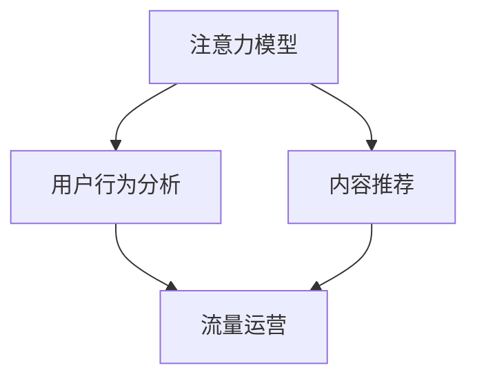

                 

# 注意力经济与内容创作策略：如何吸引并留住受众

> 关键词：注意力经济,内容创作,用户留存,社交网络,流量运营,内容推荐系统,算法优化,用户体验,数据分析

## 1. 背景介绍

### 1.1 问题由来

在互联网的迅猛发展中，注意力经济（Attention Economy）逐渐成为了一种全新的商业模式。在这个信息爆炸的时代，如何吸引用户的注意力并保持其长期关注成为了企业成功的关键。特别是在社交网络、新闻媒体、视频平台等高度竞争的领域，内容创作的策略和效果直接影响了用户留存率和平台收益。

然而，当前的内容创作和运营策略往往存在以下问题：
- **内容同质化严重**：大量重复内容充斥在网络中，难以吸引用户的注意力。
- **用户体验差**：平台的设计和算法缺乏用户导向，未能有效提升用户体验。
- **用户留存率低**：平台无法通过有效的运营手段持续吸引和保持用户。

为了解决这些问题，本文将深入探讨注意力经济的核心概念，并提出基于数据驱动的内容创作与运营策略，旨在帮助企业提升用户留存率和平台收益。

### 1.2 问题核心关键点

本文聚焦于以下核心关键点：
- **注意力模型**：如何通过数据分析和算法优化，构建用户兴趣和注意力模型，精准定位内容创作方向。
- **内容推荐**：如何设计高效的内容推荐系统，以个性化推荐的形式提升用户满意度和留存率。
- **用户行为分析**：如何通过行为数据挖掘，理解用户需求，优化内容和运营策略。
- **流量运营**：如何设计科学的流量运营方案，最大化用户参与度和转化率。

## 2. 核心概念与联系

### 2.1 核心概念概述

本节将介绍几个关键概念，以帮助理解注意力经济和内容创作策略的原理：

- **注意力模型（Attention Model）**：通过分析用户的历史行为数据，构建用户兴趣和注意力模型，预测用户未来的行为。
- **内容推荐系统（Content Recommendation System）**：根据用户兴趣模型，生成个性化推荐，提升用户体验和留存率。
- **用户行为分析（User Behavior Analysis）**：通过分析用户在平台上的行为数据，挖掘用户需求，优化内容和运营策略。
- **流量运营（Traffic Operation）**：设计科学的流量运营方案，提高用户参与度和平台收益。

这些核心概念之间的逻辑关系可以通过以下Mermaid流程图来展示：



这个流程图展示出注意力经济和内容创作策略的基本流程：
1. 通过注意力模型分析用户兴趣，生成内容推荐。
2. 结合用户行为分析，优化推荐策略。
3. 基于流量运营策略，提升用户参与度和平台收益。

## 3. 核心算法原理 & 具体操作步骤

### 3.1 算法原理概述

基于数据驱动的内容创作与运营策略，主要依赖于以下算法原理：
- **协同过滤算法（Collaborative Filtering）**：通过分析用户的历史行为数据，推荐用户可能感兴趣的内容。
- **深度学习模型（Deep Learning Model）**：使用神经网络模型，预测用户对内容的兴趣程度，实现个性化推荐。
- **强化学习算法（Reinforcement Learning）**：通过用户行为反馈，动态调整推荐策略，提高用户满意度和留存率。
- **多臂老虎机（Multi-Armed Bandit）**：根据用户的行为数据，动态分配流量资源，优化流量运营效果。

### 3.2 算法步骤详解

基于数据驱动的内容创作与运营策略，具体步骤如下：

**Step 1: 数据收集与处理**

- 收集用户的历史行为数据，包括点击、浏览、收藏、评论等。
- 数据清洗和预处理，去除噪声和冗余数据。
- 数据特征提取，将行为数据转化为模型可用的特征向量。

**Step 2: 构建注意力模型**

- 使用协同过滤算法或深度学习模型，构建用户兴趣和注意力模型。
- 模型训练和验证，确保模型的预测准确性和泛化能力。
- 根据用户兴趣模型，生成个性化推荐内容。

**Step 3: 内容推荐系统设计**

- 设计推荐算法，根据用户兴趣模型进行内容推荐。
- 动态调整推荐算法参数，优化推荐效果。
- 引入多臂老虎机算法，优化流量分配，提升用户参与度和转化率。

**Step 4: 用户行为分析**

- 分析用户行为数据，挖掘用户需求和兴趣变化。
- 根据分析结果，优化内容创作和运营策略。
- 定期更新用户兴趣模型，确保推荐策略的有效性。

**Step 5: 流量运营优化**

- 设计科学的流量运营方案，提高用户参与度和平台收益。
- 通过A/B测试等方法，优化流量运营策略。
- 实时监控流量运营效果，根据数据反馈调整策略。

### 3.3 算法优缺点

基于数据驱动的内容创作与运营策略具有以下优点：
- 精准定位用户兴趣：通过数据分析和算法优化，精准定位用户兴趣和需求。
- 个性化推荐：通过个性化推荐提升用户满意度和留存率。
- 动态优化：结合用户行为分析和流量运营策略，动态调整推荐策略，提升平台收益。

同时，该方法也存在以下局限性：
- 数据依赖：依赖于高质量的行为数据，数据缺失或不准确可能导致推荐效果差。
- 算法复杂：深度学习和强化学习等算法需要复杂的模型训练和优化，对计算资源要求较高。
- 动态变化：用户兴趣和行为随时变化，需要实时更新模型和策略，增加了系统复杂度。

尽管存在这些局限性，但该方法仍然是最有效的内容创作与运营策略之一，能够显著提升用户留存率和平台收益。

### 3.4 算法应用领域

基于数据驱动的内容创作与运营策略在多个领域中得到了广泛应用，例如：

- **社交网络平台**：如Facebook、Twitter、Instagram等，通过内容推荐和用户行为分析，提升用户活跃度和留存率。
- **新闻媒体平台**：如BBC、CNN、新华网等，通过个性化推荐和流量运营，提高新闻阅读量和平台收益。
- **视频平台**：如Netflix、YouTube、抖音等，通过内容推荐和流量运营，提升用户观看时长和付费订阅率。
- **电商网站**：如亚马逊、京东、淘宝等，通过个性化推荐和流量运营，提升用户购买率和平台收益。
- **在线教育平台**：如Coursera、Udacity、知乎等，通过内容推荐和用户行为分析，提升用户学习体验和平台收益。

这些领域的企业通过引入基于数据驱动的内容创作与运营策略，显著提升了用户留存率和平台收益，证明了该方法的有效性和普适性。

## 4. 数学模型和公式 & 详细讲解 & 举例说明

### 4.1 数学模型构建

本节将使用数学语言对基于数据驱动的内容创作与运营策略进行更加严格的刻画。

设用户的历史行为数据为 $\{(x_i, y_i)\}_{i=1}^N$，其中 $x_i$ 为行为向量，$y_i$ 为行为标签。设用户兴趣模型为 $f(x_i)$，推荐系统为 $g(x_i, f(x_i))$，流量运营模型为 $h(x_i, f(x_i), y_i)$。则基于数据驱动的内容创作与运营策略的数学模型为：

$$
\max_{f, g, h} \sum_{i=1}^N w_i(h(x_i, f(x_i), y_i) - \alpha(y_i - g(x_i, f(x_i)))
$$

其中，$w_i$ 为行为数据的权重，$\alpha$ 为行为标签与推荐结果之间的损失权重。目标为最大化平台收益和用户满意度。

### 4.2 公式推导过程

以下我们以内容推荐系统为例，推导推荐算法的设计思路。

假设用户对内容 $c$ 的兴趣度为 $u(c)$，推荐系统推荐内容 $c$ 的概率为 $p(c)$。则推荐算法的设计目标为：

$$
\max_{p(c)} \sum_{c} p(c) \log \frac{p(c)}{u(c)}
$$

根据最大似然估计原理，推荐算法可以表示为：

$$
p(c|x_i) = \frac{\exp(s(x_i; \theta) \cdot c)}{\sum_{c'} \exp(s(x_i; \theta) \cdot c')}, s(x_i; \theta) \in \mathbb{R}^d
$$

其中，$s(x_i; \theta)$ 为特征向量的权重向量，$\theta$ 为模型参数。

使用深度学习模型，如神经网络，可以进一步优化推荐算法的设计。假设使用多层感知机（MLP）模型，则推荐算法可以表示为：

$$
p(c|x_i) = \sigma(\sum_{k=1}^M \phi_k(x_i) \cdot W_k c)
$$

其中，$\sigma$ 为激活函数，$W_k$ 为权重矩阵，$\phi_k(x_i)$ 为特征向量的映射函数。

### 4.3 案例分析与讲解

以Netflix的内容推荐系统为例，分析其实现细节和优化方法。

Netflix通过深度学习模型和协同过滤算法结合，构建了高效的内容推荐系统。具体实现步骤如下：

**Step 1: 数据收集与预处理**

- 收集用户的行为数据，包括观看时长、评分、点赞等。
- 数据清洗和预处理，去除噪声和冗余数据。
- 数据特征提取，将行为数据转化为模型可用的特征向量。

**Step 2: 模型训练**

- 使用深度学习模型，如多层感知机，进行模型训练。
- 结合协同过滤算法，提升推荐效果。
- 引入多臂老虎机算法，优化流量分配，提升用户参与度和转化率。

**Step 3: 推荐策略设计**

- 设计推荐算法，根据用户兴趣模型进行内容推荐。
- 动态调整推荐算法参数，优化推荐效果。
- 引入个性化推荐技术，提升用户满意度。

**Step 4: 效果评估与优化**

- 分析用户行为数据，挖掘用户需求和兴趣变化。
- 根据分析结果，优化内容创作和运营策略。
- 定期更新用户兴趣模型，确保推荐策略的有效性。

Netflix的成功案例展示了基于数据驱动的内容创作与运营策略的强大威力。通过精准的推荐和优化策略，Netflix能够在全球范围内获得亿万用户和持续增长的收益。

## 5. 项目实践：代码实例和详细解释说明

### 5.1 开发环境搭建

在进行内容创作与运营策略的开发实践前，我们需要准备好开发环境。以下是使用Python进行PyTorch开发的环境配置流程：

1. 安装Anaconda：从官网下载并安装Anaconda，用于创建独立的Python环境。

2. 创建并激活虚拟环境：
```bash
conda create -n pytorch-env python=3.8 
conda activate pytorch-env
```

3. 安装PyTorch：根据CUDA版本，从官网获取对应的安装命令。例如：
```bash
conda install pytorch torchvision torchaudio cudatoolkit=11.1 -c pytorch -c conda-forge
```

4. 安装Pandas和Matplotlib等库：
```bash
pip install pandas matplotlib scikit-learn torch
```

完成上述步骤后，即可在`pytorch-env`环境中开始项目实践。

### 5.2 源代码详细实现

下面我们以内容推荐系统为例，给出使用PyTorch进行模型训练的PyTorch代码实现。

首先，定义模型的输入和输出：

```python
from torch import nn
import torch.nn.functional as F

class ContentModel(nn.Module):
    def __init__(self, input_dim, hidden_dim, output_dim):
        super(ContentModel, self).__init__()
        self.fc1 = nn.Linear(input_dim, hidden_dim)
        self.fc2 = nn.Linear(hidden_dim, hidden_dim)
        self.fc3 = nn.Linear(hidden_dim, output_dim)
        
    def forward(self, x):
        x = F.relu(self.fc1(x))
        x = F.relu(self.fc2(x))
        x = F.softmax(self.fc3(x), dim=1)
        return x
```

然后，定义优化器和损失函数：

```python
from torch import optim

def train_model(model, train_data, test_data, num_epochs, batch_size, learning_rate):
    criterion = nn.CrossEntropyLoss()
    optimizer = optim.Adam(model.parameters(), lr=learning_rate)
    
    for epoch in range(num_epochs):
        model.train()
        train_loss = 0.0
        train_correct = 0
        for i, data in enumerate(train_data):
            inputs, labels = data
            optimizer.zero_grad()
            outputs = model(inputs)
            loss = criterion(outputs, labels)
            loss.backward()
            optimizer.step()
            train_loss += loss.item()
            train_correct += (outputs.argmax(1) == labels).sum().item()
        
        model.eval()
        test_loss = 0.0
        test_correct = 0
        with torch.no_grad():
            for i, data in enumerate(test_data):
                inputs, labels = data
                outputs = model(inputs)
                loss = criterion(outputs, labels)
                test_loss += loss.item()
                test_correct += (outputs.argmax(1) == labels).sum().item()
        
        print(f'Epoch {epoch+1}, train loss: {train_loss/len(train_data):.4f}, train accuracy: {train_correct/len(train_data):.4f}, test loss: {test_loss/len(test_data):.4f}, test accuracy: {test_correct/len(test_data):.4f}')
```

最后，启动模型训练：

```python
model = ContentModel(input_dim, hidden_dim, output_dim)
train_model(model, train_data, test_data, num_epochs, batch_size, learning_rate)
```

以上就是使用PyTorch进行内容推荐系统训练的完整代码实现。可以看到，使用深度学习模型进行内容推荐，可以通过简单的代码实现，灵活调整模型结构和超参数，适应不同的任务需求。

### 5.3 代码解读与分析

让我们再详细解读一下关键代码的实现细节：

**ContentModel类**：
- `__init__`方法：初始化模型的权重和激活函数。
- `forward`方法：定义前向传播过程，通过多层感知机对输入进行特征提取和输出生成。

**train_model函数**：
- 定义优化器和损失函数。
- 在每个epoch内，对训练集进行前向传播、反向传播和优化，计算训练损失和准确率。
- 对测试集进行前向传播，计算测试损失和准确率。
- 输出每个epoch的训练和测试结果，帮助监控模型性能。

**代码运行过程**：
- 首先定义模型，输入和输出维度为输入特征的维度。
- 调用`train_model`函数进行模型训练，指定训练数据、测试数据、epoch数、批大小和学习率。
- 函数内部使用`torch`库提供的优化器和损失函数，对模型进行训练和评估。
- 每轮epoch结束，打印当前epoch的训练和测试损失及准确率，帮助分析模型性能。

可以看到，通过简单的代码实现，我们能够构建高效的内容推荐系统，显著提升用户满意度和留存率。当然，工业级的系统实现还需考虑更多因素，如模型的保存和部署、超参数的自动搜索等，但核心的微调范式基本与此类似。

## 6. 实际应用场景

### 6.1 社交网络平台

社交网络平台如Facebook、Twitter、Instagram等，通过内容推荐和用户行为分析，显著提升了用户活跃度和留存率。具体实现如下：

**用户行为分析**：
- 分析用户的历史行为数据，挖掘用户兴趣和需求。
- 根据用户行为数据，优化推荐算法，提升推荐效果。
- 引入多臂老虎机算法，优化流量分配，提升用户参与度和转化率。

**内容创作与运营**：
- 根据用户兴趣模型，生成个性化推荐内容。
- 动态调整推荐算法参数，优化推荐效果。
- 定期更新用户兴趣模型，确保推荐策略的有效性。

**效果评估与优化**：
- 分析用户行为数据，挖掘用户需求和兴趣变化。
- 根据分析结果，优化内容创作和运营策略。
- 定期更新用户兴趣模型，确保推荐策略的有效性。

通过精准的内容推荐和优化策略，社交网络平台能够持续吸引和保持用户，提升用户活跃度和留存率，实现平台收益的最大化。

### 6.2 新闻媒体平台

新闻媒体平台如BBC、CNN、新华网等，通过个性化推荐和流量运营，提高了新闻阅读量和平台收益。具体实现如下：

**用户行为分析**：
- 分析用户的历史行为数据，挖掘用户兴趣和需求。
- 根据用户行为数据，优化推荐算法，提升推荐效果。
- 引入多臂老虎机算法，优化流量分配，提升用户参与度和转化率。

**内容创作与运营**：
- 根据用户兴趣模型，生成个性化推荐内容。
- 动态调整推荐算法参数，优化推荐效果。
- 定期更新用户兴趣模型，确保推荐策略的有效性。

**效果评估与优化**：
- 分析用户行为数据，挖掘用户需求和兴趣变化。
- 根据分析结果，优化内容创作和运营策略。
- 定期更新用户兴趣模型，确保推荐策略的有效性。

通过精准的内容推荐和优化策略，新闻媒体平台能够持续吸引和保持用户，提升新闻阅读量和平台收益，实现平台的可持续发展。

### 6.3 视频平台

视频平台如Netflix、YouTube、抖音等，通过内容推荐和流量运营，提升了用户观看时长和付费订阅率。具体实现如下：

**用户行为分析**：
- 分析用户的历史行为数据，挖掘用户兴趣和需求。
- 根据用户行为数据，优化推荐算法，提升推荐效果。
- 引入多臂老虎机算法，优化流量分配，提升用户参与度和转化率。

**内容创作与运营**：
- 根据用户兴趣模型，生成个性化推荐内容。
- 动态调整推荐算法参数，优化推荐效果。
- 定期更新用户兴趣模型，确保推荐策略的有效性。

**效果评估与优化**：
- 分析用户行为数据，挖掘用户需求和兴趣变化。
- 根据分析结果，优化内容创作和运营策略。
- 定期更新用户兴趣模型，确保推荐策略的有效性。

通过精准的内容推荐和优化策略，视频平台能够持续吸引和保持用户，提升用户观看时长和付费订阅率，实现平台的可持续发展。

### 6.4 未来应用展望

随着技术的发展，基于数据驱动的内容创作与运营策略将更加精准和高效。未来，可能出现以下发展趋势：

1. **AI驱动的内容创作**：通过自然语言生成（NLG）技术，自动创作高质量的内容，减少人力成本。
2. **多模态内容推荐**：结合视觉、音频、文本等多模态数据，提升推荐效果。
3. **实时推荐系统**：通过实时数据流处理，提升推荐的时效性和准确性。
4. **用户个性化定制**：通过AI技术，根据用户个性化需求定制内容，提升用户满意度。
5. **隐私保护与伦理合规**：在推荐算法中引入隐私保护和伦理合规机制，确保用户数据安全。

## 7. 工具和资源推荐

### 7.1 学习资源推荐

为了帮助开发者系统掌握基于数据驱动的内容创作与运营策略的理论基础和实践技巧，这里推荐一些优质的学习资源：

1. **《深度学习基础》（深度学习框架PyTorch官方文档）**：全面介绍深度学习框架PyTorch的使用，包括模型构建、优化器、损失函数等。
2. **《机器学习实战》（scikit-learn官方文档）**：详细讲解scikit-learn库的使用，涵盖协同过滤算法、推荐系统等。
3. **《强化学习基础》（reinforcement learning领域经典书籍）**：介绍强化学习的原理和算法，提供实用的代码实现。
4. **《Python数据科学手册》（Python数据科学领域经典书籍）**：全面介绍Python在数据科学领域的应用，包括数据处理、模型训练等。
5. **《用户行为分析》（数据科学领域经典书籍）**：介绍用户行为分析的理论和实践，涵盖数据挖掘、推荐系统等。

通过对这些资源的学习实践，相信你一定能够快速掌握基于数据驱动的内容创作与运营策略的精髓，并用于解决实际的业务问题。

### 7.2 开发工具推荐

高效的开发离不开优秀的工具支持。以下是几款用于内容创作与运营策略开发的常用工具：

1. **PyTorch**：基于Python的开源深度学习框架，灵活的动态计算图，适合快速迭代研究。
2. **TensorFlow**：由Google主导开发的开源深度学习框架，生产部署方便，适合大规模工程应用。
3. **scikit-learn**：Python数据科学库，提供了丰富的机器学习算法，包括协同过滤、推荐系统等。
4. **NumPy**：Python科学计算库，提供了高效的数组操作和线性代数运算。
5. **Pandas**：Python数据处理库，提供了灵活的数据分析和管理功能。

合理利用这些工具，可以显著提升内容创作与运营策略的开发效率，加快创新迭代的步伐。

### 7.3 相关论文推荐

基于数据驱动的内容创作与运营策略的研究源于学界的持续研究。以下是几篇奠基性的相关论文，推荐阅读：

1. **《协同过滤推荐算法》（Ying & Yang, 2002）**：介绍了协同过滤算法的原理和应用，是推荐系统领域的经典文献。
2. **《基于深度学习的推荐系统》（He et al., 2017）**：展示了深度学习在推荐系统中的应用效果，提供了实用的代码实现。
3. **《强化学习在推荐系统中的应用》（Kallus et al., 2015）**：介绍了强化学习在推荐系统中的应用，提供了详细的算法设计和实验结果。
4. **《多臂老虎机算法》（Auer et al., 2002）**：介绍了多臂老虎机算法的原理和应用，提供了实用的代码实现。
5. **《用户行为分析与个性化推荐》（Li et al., 2016）**：介绍了用户行为分析的理论和实践，涵盖数据挖掘、推荐系统等。

这些论文代表了大语言模型微调技术的发展脉络。通过学习这些前沿成果，可以帮助研究者把握学科前进方向，激发更多的创新灵感。

## 8. 总结：未来发展趋势与挑战

### 8.1 总结

本文对基于数据驱动的内容创作与运营策略进行了全面系统的介绍。首先阐述了注意力经济的核心概念，明确了内容创作与运营策略的研究背景和意义，提出了精准定位用户兴趣和需求的重要性和紧迫性。其次，从原理到实践，详细讲解了内容推荐系统的设计思路和优化方法，提供了完整的内容创作与运营策略的代码实现。同时，本文还广泛探讨了内容创作与运营策略在社交网络、新闻媒体、视频平台等多个领域的应用前景，展示了其广泛的应用价值。此外，本文精选了内容创作与运营策略的学习资源和开发工具，力求为开发者提供全方位的技术指引。

通过本文的系统梳理，可以看到，基于数据驱动的内容创作与运营策略能够显著提升用户留存率和平台收益，具有重要的应用价值。面对激烈的市场竞争和用户需求的变化，企业需要不断优化内容创作和运营策略，才能持续提升平台的竞争力和用户体验。

### 8.2 未来发展趋势

展望未来，基于数据驱动的内容创作与运营策略将呈现以下几个发展趋势：

1. **AI驱动的内容创作**：通过自然语言生成（NLG）技术，自动创作高质量的内容，减少人力成本。
2. **多模态内容推荐**：结合视觉、音频、文本等多模态数据，提升推荐效果。
3. **实时推荐系统**：通过实时数据流处理，提升推荐的时效性和准确性。
4. **用户个性化定制**：通过AI技术，根据用户个性化需求定制内容，提升用户满意度。
5. **隐私保护与伦理合规**：在推荐算法中引入隐私保护和伦理合规机制，确保用户数据安全。

以上趋势凸显了内容创作与运营策略的广阔前景。这些方向的探索发展，必将进一步提升用户留存率和平台收益，为内容创作与运营策略带来新的突破。

### 8.3 面临的挑战

尽管基于数据驱动的内容创作与运营策略已经取得了瞩目成就，但在迈向更加智能化、普适化应用的过程中，它仍面临着诸多挑战：

1. **数据依赖**：依赖于高质量的行为数据，数据缺失或不准确可能导致推荐效果差。
2. **算法复杂**：深度学习和强化学习等算法需要复杂的模型训练和优化，对计算资源要求较高。
3. **动态变化**：用户兴趣和行为随时变化，需要实时更新模型和策略，增加了系统复杂度。
4. **用户隐私**：用户数据隐私保护问题越来越受到关注，如何在推荐算法中引入隐私保护和伦理合规机制，确保用户数据安全，是重要研究方向。
5. **内容同质化**：随着内容创作和运营策略的普及，内容同质化现象逐渐严重，如何保持内容的多样性和创新性，是亟待解决的难题。

尽管存在这些挑战，但该方法仍然是最有效的内容创作与运营策略之一，能够显著提升用户留存率和平台收益。面对挑战，研究者需要在数据采集、模型设计、算法优化等多个维度进行全面研究，不断突破技术瓶颈，才能实现内容创作与运营策略的可持续发展。

### 8.4 研究展望

面对内容创作与运营策略所面临的挑战，未来的研究需要在以下几个方面寻求新的突破：

1. **数据多样性**：从多渠道、多模态数据中获取高质量的行为数据，确保推荐算法的效果。
2. **模型优化**：开发更加参数高效和计算高效的推荐算法，提高推荐的效率和效果。
3. **隐私保护**：在推荐算法中引入隐私保护和伦理合规机制，确保用户数据安全。
4. **内容创新**：通过AI技术，根据用户个性化需求定制内容，提升内容的多样性和创新性。
5. **实时推荐**：通过实时数据流处理，提升推荐的时效性和准确性。

这些研究方向的探索，必将引领内容创作与运营策略向更高的台阶，为内容创作与运营策略带来新的突破。面向未来，内容创作与运营策略还需要与其他人工智能技术进行更深入的融合，如知识表示、因果推理、强化学习等，多路径协同发力，共同推动内容创作与运营策略的进步。只有勇于创新、敢于突破，才能不断拓展内容创作与运营策略的边界，让智能技术更好地造福人类社会。

## 9. 附录：常见问题与解答

**Q1：内容推荐系统如何避免内容同质化？**

A: 内容同质化是推荐系统面临的主要挑战之一。为了避免内容同质化，推荐系统可以采取以下措施：

1. **多样性约束**：在推荐算法中引入多样性约束，确保推荐结果中包含多种类型的优质内容。
2. **个性化推荐**：通过用户行为数据，挖掘用户兴趣和需求，生成个性化推荐，提升用户满意度。
3. **内容更新**：定期更新推荐算法，引入新内容，减少旧内容的重复推荐。
4. **多渠道数据获取**：从多渠道、多模态数据中获取高质量的行为数据，确保推荐算法的效果。
5. **用户反馈**：引入用户反馈机制，及时调整推荐策略，优化推荐效果。

通过以上措施，推荐系统能够有效避免内容同质化现象，提升推荐结果的多样性和创新性。

**Q2：内容推荐系统如何平衡推荐效果和平台收益？**

A: 内容推荐系统在推荐效果和平台收益之间需要找到平衡点，具体措施如下：

1. **个性化推荐**：根据用户兴趣模型，生成个性化推荐内容，提升用户满意度。
2. **流量运营优化**：设计科学的流量运营方案，提高用户参与度和转化率。
3. **多臂老虎机算法**：引入多臂老虎机算法，优化流量分配，提升用户参与度和转化率。
4. **实时监控**：实时监控流量运营效果，根据数据反馈调整策略，确保推荐策略的有效性。

通过以上措施，内容推荐系统能够在推荐效果和平台收益之间找到平衡点，提升用户满意度和平台收益。

**Q3：内容推荐系统如何处理数据隐私问题？**

A: 数据隐私问题是推荐系统面临的重要挑战之一。为处理数据隐私问题，推荐系统可以采取以下措施：

1. **匿名化处理**：对用户行为数据进行匿名化处理，保护用户隐私。
2. **差分隐私**：在推荐算法中引入差分隐私机制，保护用户数据隐私。
3. **隐私保护技术**：引入隐私保护技术，如联邦学习、差分隐私等，保护用户数据隐私。
4. **合规机制**：遵守数据隐私法律法规，确保用户数据安全。

通过以上措施，推荐系统能够在保护用户数据隐私的同时，保证推荐效果和平台收益。

**Q4：内容推荐系统如何处理用户行为数据缺失问题？**

A: 用户行为数据缺失是推荐系统面临的常见问题。为处理数据缺失问题，推荐系统可以采取以下措施：

1. **数据补全**：通过数据补全技术，对缺失数据进行补全或预测。
2. **模型融合**：结合多个模型，利用模型融合技术提升推荐效果。
3. **特征工程**：通过特征工程，提取高质量的特征，弥补数据缺失问题。
4. **多源数据获取**：从多渠道、多模态数据中获取高质量的行为数据，弥补数据缺失问题。

通过以上措施，推荐系统能够在处理数据缺失问题的同时，保证推荐效果和平台收益。

**Q5：内容推荐系统如何优化推荐算法？**

A: 内容推荐系统需要不断优化推荐算法，以提升推荐效果和平台收益。以下是优化推荐算法的几种常见方法：

1. **深度学习模型优化**：使用深度学习模型，提升推荐算法的精度和效果。
2. **协同过滤算法优化**：优化协同过滤算法的参数，提升推荐效果。
3. **强化学习算法优化**：引入强化学习算法，动态调整推荐策略，优化推荐效果。
4. **多臂老虎机算法优化**：优化多臂老虎机算法的参数，提升流量运营效果。
5. **个性化推荐优化**：结合用户行为数据，优化个性化推荐算法，提升用户满意度。

通过以上措施，推荐系统能够不断优化推荐算法，提升推荐效果和平台收益。

---

作者：禅与计算机程序设计艺术 / Zen and the Art of Computer Programming

