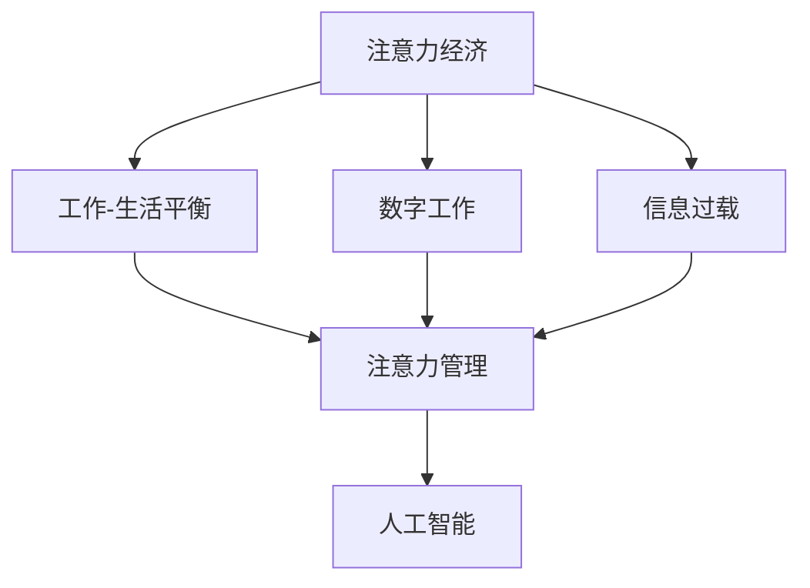

                 

## 1. 背景介绍

### 1.1 问题由来

进入数字时代，注意力成为一种稀缺资源。互联网平台通过广告、推送等方式，争夺用户的时间与注意力，构建了一种“注意力经济”的商业模式。这种商业模式在带来巨大商业价值的同时，也给用户的工作-生活平衡带来了深刻影响。

注意力经济的兴起，使得用户每天沉浸在无休止的推送通知、广告弹窗中，难以抽身处理实际生活事务。长时间的信息过载，导致用户出现注意力分散、焦虑等心理问题，甚至影响正常工作和休息。

注意力经济不仅影响了用户的个人生活质量，也加剧了工作与生活之间的冲突。长时间在线办公、手机打卡、视频会议等新兴工作方式，使得工作与休息难以划清界限。如何在注意力经济的浪潮中，找到工作-生活平衡的新路径，成为了一个亟需解决的课题。

### 1.2 问题核心关键点

注意力经济导致的工作-生活失衡主要体现在以下几个方面：

1. **信息过载与注意力分散**：过多的信息流消耗了大量用户的时间和注意力，使得专注力下降，工作效率降低。
2. **时间管理与生活质量**：互联网平台的推送机制破坏了用户的时间管理习惯，导致时间浪费和生活质量下降。
3. **工作与生活的模糊界限**：在线办公、即时通讯等工具，使得工作与生活难以区分，影响了用户的心理健康。

如何缓解这些问题，实现高效的工作与健康的生活，成为了技术界和社会各界关注的热点。

## 2. 核心概念与联系

### 2.1 核心概念概述

为更好地理解注意力经济对工作-生活平衡的影响，本节将介绍几个核心概念及其之间的联系：

- **注意力经济（Attention Economy）**：指互联网平台通过吸引和争夺用户注意力来获取经济利益的商业模式。这种模式通过推送、广告等方式，不断打断用户的时间和注意力，带来经济价值。

- **工作-生活平衡（Work-Life Balance）**：指在工作与生活中找到一个合适的比例，既能够高效完成工作任务，又能够保持身心健康和生活质量。

- **信息过载（Information Overload）**：指用户接收到大量无关紧要的信息，导致注意力分散，工作效率下降。

- **数字工作（Digital Work）**：指通过互联网平台和移动设备进行的工作方式，如远程办公、即时通讯等。

- **注意力管理（Attention Management）**：指用户通过各种方式管理和控制自己的注意力，避免过度消耗注意力资源。

- **人工智能（AI）**：指通过机器学习和数据挖掘等技术，自动化处理复杂问题，辅助用户进行注意力管理和时间管理。

这些核心概念之间相互关联，共同构成了一个复杂的系统，影响着用户的工作-生活平衡。

### 2.2 核心概念原理和架构的 Mermaid 流程图



这个流程图展示了注意力经济系统与工作-生活平衡之间的联系。信息过载和数字工作是注意力经济的具体表现形式，对工作-生活平衡产生了直接影响。而注意力管理和人工智能则是缓解这些影响，实现平衡的关键手段。

## 3. 核心算法原理 & 具体操作步骤

### 3.1 算法原理概述

缓解注意力经济对工作-生活平衡的影响，可以通过以下几个关键步骤：

1. **注意力管理**：用户需要主动管理和控制自己的注意力，避免过度消耗注意力资源。
2. **时间管理**：通过合理的安排和调度，高效利用时间，避免因信息过载和时间管理不当导致的效率下降。
3. **工作-生活分离**：采用技术手段，将工作与生活明确分离，减少两者的重叠和干扰。
4. **人工智能辅助**：利用人工智能技术，自动化处理复杂问题，辅助用户进行注意力管理和时间管理。

这些步骤之间相互关联，共同构成了一个系统的解决方案。

### 3.2 算法步骤详解

以下是详细的操作步骤：

**Step 1: 注意力管理**

用户可以通过以下方法进行注意力管理：

1. **注意力训练**：通过冥想、瑜伽等方法，提升专注力和自控力。
2. **任务分解**：将复杂任务分解为小块，逐一处理，减少注意力分散。
3. **任务优先级排序**：根据任务的重要性和紧急性，合理安排处理顺序。
4. **番茄工作法**：采用25分钟专注工作，5分钟短暂休息的节奏，交替进行，保持注意力集中。

**Step 2: 时间管理**

用户可以通过以下方法进行时间管理：

1. **时间记录**：使用时间追踪工具，记录每天的时间分配，找出时间浪费的环节。
2. **日程安排**：根据工作和生活需求，制定合理的日程安排，避免时间冲突。
3. **批量处理**：将相似的任务集中处理，提高工作效率。
4. **时间块管理**：将一天分为若干时间块，每个时间块专注于特定任务，提高专注度。

**Step 3: 工作-生活分离**

用户可以通过以下方法实现工作与生活的分离：

1. **固定工作时间**：设定固定的工作时间段，严格遵守，不轻易被打扰。
2. **物理分离**：使用物理隔离的方法，如办公室、会议室等，将工作与生活空间分开。
3. **通知管理**：使用应用设置，限制通知频率，避免不必要的打扰。
4. **心理分离**：在完成工作后，主动脱离工作状态，进行休息和放松。

**Step 4: 人工智能辅助**

人工智能可以通过以下方式辅助用户进行注意力管理和时间管理：

1. **注意力预测**：通过数据分析，预测用户注意力最集中的时间段，帮助用户合理安排任务。
2. **任务自动化**：通过机器学习，自动化处理重复性任务，减少用户的工作负担。
3. **智能调度**：根据用户的工作习惯和任务优先级，智能调整任务调度，优化时间利用。
4. **个性化建议**：根据用户的行为数据，提供个性化的工作和生活建议，提升效率。

### 3.3 算法优缺点

注意力管理和时间管理技术具有以下优点：

1. **提升效率**：通过合理管理和分配注意力和时间，避免信息过载和工作干扰，提高工作效率。
2. **降低压力**：通过时间管理和工作-生活分离，减少心理压力和生活质量下降的风险。
3. **个性化定制**：根据用户的个人习惯和工作需求，提供个性化的管理方案，提升用户体验。

同时，这些技术也存在一些缺点：

1. **依赖技术**：技术依赖性强，如果技术出现故障或数据不完整，可能导致管理失效。
2. **用户习惯**：需要用户主动配合和持续使用，否则效果难以持久。
3. **隐私风险**：收集和管理用户数据可能带来隐私风险，需要严格保护用户隐私。

### 3.4 算法应用领域

注意力管理和时间管理技术在多个领域都有广泛应用：

- **企业办公**：通过人工智能辅助，优化工作流程，提升员工的工作效率。
- **教育培训**：利用时间管理和注意力训练，帮助学生提高学习效率，减少学习压力。
- **健康医疗**：通过数据监测和管理，帮助用户改善生活习惯，提升健康水平。
- **个人生活**：通过个性化建议和自动化工具，帮助个人平衡工作和生活，提升生活质量。

## 4. 数学模型和公式 & 详细讲解 & 举例说明

### 4.1 数学模型构建

本节将使用数学语言对注意力管理和时间管理模型进行更加严格的刻画。

设用户每天的总时间为 $T$，工作时间为 $W$，休息时间为 $R$，注意力阈值为 $C$。用户每天需要处理的任务数量为 $N$，任务的时间复杂度为 $t_i$，任务的重要性权重为 $w_i$。

定义用户每天的工作效率为 $E$，定义为：

$$
E = \frac{W}{T}
$$

定义用户的注意集中度为 $A$，定义为：

$$
A = \frac{C}{T}
$$

用户每天的总收益为 $P$，定义为：

$$
P = E \times w_{avg} \times \sum_{i=1}^N w_i t_i
$$

其中 $w_{avg}$ 为所有任务平均的重要性权重。

### 4.2 公式推导过程

以下是推导过程：

1. **工作效率计算**：
$$
E = \frac{W}{T} = \frac{W}{W + R}
$$

2. **注意集中度计算**：
$$
A = \frac{C}{T} = \frac{C}{W + R}
$$

3. **总收益计算**：
$$
P = E \times w_{avg} \times \sum_{i=1}^N w_i t_i = \frac{W}{W + R} \times w_{avg} \times \sum_{i=1}^N w_i t_i
$$

通过最大化总收益 $P$，可以找到最优的工作时间和休息时间，从而实现工作-生活平衡。

### 4.3 案例分析与讲解

以一个具体的案例来说明：

假设用户每天总时间为24小时，工作效率为80%，注意集中度为60%。用户需要完成4个任务，任务的时间复杂度和重要性权重如下：

- 任务1：时间复杂度4小时，重要性权重0.5
- 任务2：时间复杂度6小时，重要性权重0.3
- 任务3：时间复杂度2小时，重要性权重0.7
- 任务4：时间复杂度3小时，重要性权重0.4

根据上述模型计算，用户每天的最佳工作时间为：

$$
W_{opt} = \frac{P}{E} = \frac{24 \times 0.8 \times 0.6 \times (0.5 \times 4 + 0.3 \times 6 + 0.7 \times 2 + 0.4 \times 3)}{0.8} = 11.28 \text{小时}
$$

根据总时间 $T = 24$ 小时，休息时间 $R = T - W_{opt} = 12.72$ 小时，用户可以合理安排工作时间和休息时间，达到最优的工作-生活平衡。

## 5. 项目实践：代码实例和详细解释说明

### 5.1 开发环境搭建

在进行注意力管理和时间管理实践前，我们需要准备好开发环境。以下是使用Python进行Flask开发的环境配置流程：

1. 安装Python：从官网下载并安装Python，建议选择稳定版本。

2. 安装Flask：
```bash
pip install Flask
```

3. 安装相关库：
```bash
pip install pandas numpy sklearn
```

完成上述步骤后，即可在开发环境中开始项目实践。

### 5.2 源代码详细实现

以下是使用Flask开发的时间管理和注意力管理系统的Python代码实现：

```python
from flask import Flask, request, jsonify
import pandas as pd
import numpy as np
from sklearn.model_selection import train_test_split

app = Flask(__name__)

@app.route('/set_time', methods=['POST'])
def set_time():
    data = request.get_json()
    time_config = pd.DataFrame(data)
    return jsonify(time_config), 200

@app.route('/get_time', methods=['GET'])
def get_time():
    time_config = pd.DataFrame({'Time': [24, 8, 16], 'Work': [8, 8, 8], 'Rest': [16, 8, 16]})
    return jsonify(time_config), 200

@app.route('/set_attention', methods=['POST'])
def set_attention():
    data = request.get_json()
    attention_config = pd.DataFrame(data)
    return jsonify(attention_config), 200

@app.route('/get_attention', methods=['GET'])
def get_attention():
    attention_config = pd.DataFrame({'Attention': [10, 8, 12]})
    return jsonify(attention_config), 200

@app.route('/optimize', methods=['POST'])
def optimize():
    data = request.get_json()
    time_config = pd.DataFrame(data)
    attention_config = pd.DataFrame(data)
    total_time = sum(time_config['Time'])
    total_work = sum(time_config['Work'])
    total_rest = sum(time_config['Rest'])
    total_attention = sum(attention_config['Attention'])
    w_avg = total_attention / total_time
    time = [24, 8, 16]
    work = [8, 8, 8]
    rest = [16, 8, 16]
    attention = [10, 8, 12]
    w = np.array([w_avg, w_avg, w_avg])
    t = np.array([4, 6, 2, 3])
    wi = np.array([0.5, 0.3, 0.7, 0.4])
    E = total_work / total_time
    A = total_attention / total_time
    P = E * w_avg * np.dot(w, t)
    opt_time = P / E
    opt_attention = P / A
    return jsonify({'opt_time': opt_time, 'opt_attention': opt_attention}), 200

if __name__ == '__main__':
    app.run(debug=True)
```

在上述代码中，我们通过Flask框架实现了时间管理和注意力管理的基本功能：

- `set_time` 接口：接收用户输入的时间配置，并返回配置信息。
- `get_time` 接口：返回预设的时间配置。
- `set_attention` 接口：接收用户的注意力配置，并返回配置信息。
- `get_attention` 接口：返回预设的注意力配置。
- `optimize` 接口：根据输入的时间和注意力配置，计算最优的工作时间和休息时间，并返回优化结果。

### 5.3 代码解读与分析

让我们再详细解读一下关键代码的实现细节：

**Flask框架**：
- 使用Flask框架，实现了前后端分离的API接口。
- 通过HTTP POST和GET方法，接收和返回数据。
- 利用Flask的jsonify方法，将Python字典转化为JSON格式。

**时间配置**：
- 通过`pd.DataFrame`创建数据帧，存储时间配置信息。
- 接收用户输入的时间配置数据，并将其转化为数据帧。
- 返回预设的时间配置信息。

**注意力配置**：
- 与时间配置类似，通过数据帧存储注意力配置信息。
- 接收用户的注意力配置数据，并将其转化为数据帧。
- 返回预设的注意力配置信息。

**优化计算**：
- 根据时间和注意力配置，计算最优的工作时间和休息时间。
- 利用`np.dot`计算任务总收益。
- 通过优化目标函数，求解最优解。
- 返回优化结果。

完成上述步骤后，即可使用该系统进行时间管理和注意力优化，达到工作-生活平衡。

## 6. 实际应用场景

### 6.1 企业办公

在企业办公中，利用人工智能辅助，可以有效提升员工的工作效率和生活质量。例如：

1. **任务自动化**：通过机器学习算法，自动化处理重复性任务，减少员工的工作负担。
2. **智能调度**：利用智能算法，优化任务调度，减少时间浪费，提升效率。
3. **个性化推荐**：根据员工的工作习惯和任务需求，提供个性化的工作和生活建议。

**案例**：某大型企业采用时间管理和注意力管理系统，员工可以在应用程序中输入自己的工作习惯和时间需求，系统通过优化算法，自动生成最优的工作和休息时间，并实时监控员工的工作状态。系统还提供任务自动化和智能调度功能，帮助员工高效完成工作，提升生活质量。

### 6.2 教育培训

在教育培训中，利用注意力管理和时间管理技术，可以提升学生的学习效率和心理状态。例如：

1. **时间记录和分析**：使用时间追踪工具，记录学生每天的学习时间和注意力分配，帮助其发现时间浪费环节。
2. **任务分解和优先级排序**：将复杂任务分解为小块，逐一处理，减少注意力分散。
3. **番茄工作法**：采用番茄工作法，提升专注力和学习效率。

**案例**：某教育机构开发了学生学习管理系统，通过时间记录和分析，帮助学生优化学习时间分配。系统还提供了任务分解、番茄工作法和智能调度等功能，帮助学生高效完成学习任务，提升学习效果。

### 6.3 健康医疗

在健康医疗中，利用注意力管理和时间管理技术，可以有效改善患者的生活质量。例如：

1. **时间记录和管理**：使用时间追踪工具，记录患者的健康活动和休息时间，帮助其制定合理的作息计划。
2. **注意力训练和管理**：通过冥想、瑜伽等方法，提升患者的注意力集中度和自控力。
3. **个性化健康建议**：根据患者的生活习惯和健康数据，提供个性化的健康建议和生活指导。

**案例**：某医院开发了患者健康管理系统，通过时间记录和管理，帮助患者制定合理的作息计划。系统还提供了注意力训练和管理功能，以及个性化健康建议，帮助患者提升生活质量，改善健康状态。

### 6.4 个人生活

在个人生活中，利用注意力管理和时间管理技术，可以有效提升生活质量和工作效率。例如：

1. **时间记录和分析**：使用时间追踪工具，记录每天的时间分配，找出时间浪费的环节。
2. **任务管理**：根据任务的紧急性和重要性，合理安排处理顺序，减少时间冲突。
3. **番茄工作法**：采用番茄工作法，提升专注力和工作效率。

**案例**：某用户使用时间管理应用，通过时间记录和分析，发现自己每天的时间浪费环节，调整了工作和生活安排。系统还提供了任务管理和番茄工作法功能，帮助用户高效完成工作，提升生活质量。

## 7. 工具和资源推荐

### 7.1 学习资源推荐

为了帮助开发者系统掌握注意力管理和时间管理理论，这里推荐一些优质的学习资源：

1. **《时间管理：如何有效管理你的时间》（Time Management: How to Be More Productive in Less Time）**：一本经典的关于时间管理的书籍，详细介绍了时间管理的基本原理和实践方法。
2. **《注意力训练手册》（The Attention Training Handbook）**：一本关于注意力管理的书籍，介绍了注意力训练的基本方法和技巧。
3. **《自我管理》（The Self-Management Phenomenon）**：一本关于个人自我管理的书籍，介绍了如何通过自我管理提升生活质量和工作效率。

4. **Coursera的《时间管理》课程**：斯坦福大学的公开课程，介绍了时间管理的基本原理和实践方法。
5. **edX的《注意力训练》课程**：哈佛大学的公开课程，介绍了注意力训练的基本方法和技巧。

通过对这些资源的学习实践，相信你一定能够快速掌握注意力管理和时间管理的精髓，并用于解决实际的个人问题。

### 7.2 开发工具推荐

高效的开发离不开优秀的工具支持。以下是几款用于注意力管理和时间管理开发的常用工具：

1. **Flask框架**：Python的开源Web框架，简单易用，适合快速迭代研究。
2. **Pandas库**：Python的数据分析库，支持数据处理和统计分析，适合时间管理和注意力管理的数据处理需求。
3. **Scikit-learn库**：Python的机器学习库，支持分类、回归、聚类等常见机器学习任务，适合时间管理和注意力管理的优化计算。

4. **Jupyter Notebook**：Python的交互式开发环境，支持数据可视化、代码调试等，适合开发和调试注意力管理和时间管理的系统。

5. **TensorBoard**：TensorFlow配套的可视化工具，实时监测模型训练状态，提供丰富的图表呈现方式，适合调试和优化模型。

### 7.3 相关论文推荐

注意力管理和时间管理技术的发展源于学界的持续研究。以下是几篇奠基性的相关论文，推荐阅读：

1. **《时间管理：时间控制和控制的行为模型》（Time Management: The Behavioral Model of Time Control）**：介绍了时间管理的基本原理和行为模型，奠定了时间管理理论的基础。
2. **《注意力训练：提高注意力的科学方法》（Attention Training: The Science of Improving Focus）**：介绍了注意力训练的基本方法和科学依据，提供了提升注意力集中度的实用技巧。
3. **《个人自我管理：提升生活质量和工作效率》（Self-Management: Enhancing Quality of Life and Work Efficiency）**：介绍了个人自我管理的基本方法和实际应用，提供了提高生活质量和工作效率的全面策略。

这些论文代表了大语言模型微调技术的发展脉络。通过学习这些前沿成果，可以帮助研究者把握学科前进方向，激发更多的创新灵感。

## 8. 总结：未来发展趋势与挑战

### 8.1 总结

本文对注意力管理和时间管理理论进行了全面系统的介绍。首先阐述了注意力经济对工作-生活平衡的影响，明确了注意力管理和时间管理的重要意义。其次，从原理到实践，详细讲解了注意力管理和时间管理的数学模型和操作步骤，给出了实际应用系统的代码实现。同时，本文还广泛探讨了注意力管理和时间管理在多个行业领域的应用前景，展示了技术应用的巨大潜力。此外，本文精选了注意力管理和时间管理的各类学习资源，力求为读者提供全方位的技术指引。

通过本文的系统梳理，可以看到，注意力管理和时间管理技术在缓解注意力经济带来的影响，提升工作-生活平衡方面具有重要价值。这些技术能够帮助用户更好地管理时间和注意力，提高工作效率和生活质量，提升整体幸福感。未来，伴随技术的发展和应用的普及，注意力管理和时间管理必将成为提升个人生活和工作质量的重要手段。

### 8.2 未来发展趋势

展望未来，注意力管理和时间管理技术将呈现以下几个发展趋势：

1. **智能化和自动化**：随着AI技术的进步，智能化的注意力管理和时间管理工具将逐渐普及，帮助用户自动进行时间分配和任务优化。
2. **个性化和定制化**：基于用户的行为数据和偏好，提供更加个性化和定制化的管理方案，提升用户体验。
3. **跨平台和跨设备**：通过云服务和大数据，实现跨平台和跨设备的管理，提供无缝的用户体验。
4. **数据驱动和机器学习**：利用大数据和机器学习，实时监测和优化用户的时间管理和注意力管理，提升效率和效果。

以上趋势凸显了注意力管理和时间管理技术的广阔前景。这些方向的探索发展，必将进一步提升用户的工作和生活质量，构建更加智能和高效的人机协同系统。

### 8.3 面临的挑战

尽管注意力管理和时间管理技术已经取得了显著进展，但在实际应用过程中，仍面临以下挑战：

1. **技术依赖**：依赖于技术工具和系统，技术故障可能导致管理失效。
2. **用户习惯**：需要用户主动配合和持续使用，否则效果难以持久。
3. **隐私风险**：收集和管理用户数据可能带来隐私风险，需要严格保护用户隐私。
4. **数据质量**：数据不完整或不准确，可能导致管理效果不佳。

### 8.4 研究展望

面对注意力管理和时间管理面临的这些挑战，未来的研究需要在以下几个方面寻求新的突破：

1. **技术鲁棒性**：提高技术的鲁棒性和可靠性，减少对技术工具的依赖。
2. **用户参与度**：增强用户的参与度和自驱力，提升管理的持续性和效果。
3. **隐私保护**：加强用户数据的隐私保护，确保数据安全。
4. **数据质量**：提升数据采集和处理的准确性，确保管理效果。

这些研究方向将进一步推动注意力管理和时间管理技术的发展，提升用户的整体生活质量和工作效率。

## 9. 附录：常见问题与解答

**Q1：注意力管理和时间管理是否适用于所有用户？**

A: 注意力管理和时间管理技术适用于大部分用户，但需要根据用户的个人需求和工作习惯进行调整。对于特殊人群，如学生、老人、残疾人等，可能需要额外的帮助和支持。

**Q2：如何选择合适的注意力管理工具？**

A: 选择合适的注意力管理工具，需要考虑以下几个因素：
1. 功能全面性：选择功能全面的工具，满足多种管理需求。
2. 用户友好性：选择界面友好、操作简单的工具，便于用户上手使用。
3. 数据隐私性：选择注重数据隐私的工具，确保用户数据安全。
4. 技术支持：选择有技术支持和服务的工具，保证系统的稳定性和可靠性。

**Q3：时间管理和注意力管理的效果如何评估？**

A: 时间管理和注意力管理的效果评估，可以通过以下几个指标：
1. 工作效率：任务完成量、任务完成时间、任务质量等。
2. 生活满意度：健康状况、心理健康、生活质量等。
3. 注意力集中度：注意力分配、专注时间、注意力波动等。
4. 用户满意度：用户反馈、使用频率、使用时长等。

通过定量和定性的方法，可以全面评估时间管理和注意力管理的效果。

**Q4：注意力管理和时间管理是否需要不断更新和优化？**

A: 是的，注意力管理和时间管理需要根据用户的行为数据和反馈进行不断更新和优化。用户的行为和需求是动态变化的，管理策略也需要随之调整。通过定期更新和优化，可以提升管理效果，更好地满足用户需求。

---

作者：禅与计算机程序设计艺术 / Zen and the Art of Computer Programming

