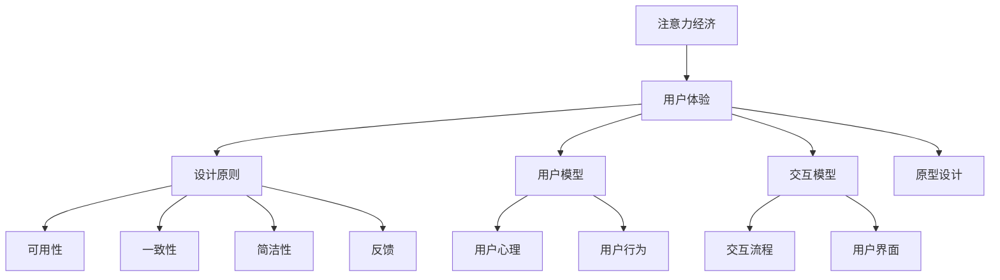

                 

# 注意力经济与用户体验设计原则：创建引人入胜的产品和服务

> 关键词：注意力经济,用户体验,设计原则,注意力模型,用户体验设计,用户体验研究

## 1. 背景介绍

### 1.1 问题由来
随着互联网的普及和智能设备的广泛应用，我们进入了所谓的“注意力经济”时代。注意力，作为信息时代最为稀缺的资源，成为了市场竞争的关键点。如何在茫茫信息海洋中吸引用户眼球，从而实现商业价值最大化，成为了众多企业关注的焦点。用户体验（User Experience, UX）作为影响用户注意力的重要因素，成为决定产品成败的关键。

### 1.2 问题核心关键点
随着用户对产品需求的日益提升，如何构建高性价比、高满意度的用户体验，成为一个复杂的系统工程。传统的设计方法往往注重功能性和可用性，而忽视了用户深层次的心理和情感需求。现代用户体验设计则需要从心理学、社会学等多个角度出发，综合运用各种设计原则，构建更加科学、合理的用户体验体系。

## 2. 核心概念与联系

### 2.1 核心概念概述

为更好地理解注意力经济和用户体验设计的相关概念，本节将介绍几个密切相关的核心概念：

- 注意力经济（Attention Economy）：指在信息爆炸时代，注意力成为稀缺资源，企业需要通过吸引用户注意力，获取商业利益的经济模式。
- 用户体验（User Experience, UX）：指用户在使用产品或服务过程中，所感受到的主观体验，包括功能、性能、美观、情感等多方面因素。
- 设计原则（Design Principles）：在用户体验设计中，指导设计决策的理论和方法，如可用性、一致性、简洁性、反馈等。
- 用户模型（User Model）：基于用户行为和心理的模型，指导设计者针对不同用户群体进行差异化设计。
- 交互模型（Interaction Model）：描述用户与产品交互方式的模型，指导设计者实现流畅、自然、高效的用户操作流程。
- 原型设计（Prototype Design）：通过制作产品的高保真原型，模拟真实使用场景，评估和优化用户体验。

这些核心概念之间的逻辑关系可以通过以下Mermaid流程图来展示：



这个流程图展示了大语言模型的核心概念及其之间的关系：

1. 注意力经济是通过吸引用户注意力，获取商业利益的经济模式。
2. 用户体验是用户在使用产品或服务过程中，所感受到的主观体验。
3. 设计原则是指导用户体验设计决策的理论和方法。
4. 用户模型描述了用户行为和心理特征。
5. 交互模型定义了用户与产品的交互方式。
6. 原型设计通过高保真原型评估和优化用户体验。

这些概念共同构成了注意力经济和用户体验设计的框架，指导设计者构建更科学、合理的用户体验体系。

## 3. 核心算法原理 & 具体操作步骤
### 3.1 算法原理概述

注意力经济与用户体验设计，本质上是通过设计科学的交互模型和用户模型，引导用户进行有效的操作，从而提高用户满意度和转化率，实现商业价值的最大化。

形式化地，设用户关注的产品特性集合为 $U=\{u_1, u_2, ..., u_n\}$，用户对特性的关注程度为 $A=\{a_1, a_2, ..., a_n\}$，产品价值为 $V$。则关注度-价值曲线（Attention-Value Curve）定义为：

$$
V = \sum_{i=1}^{n} a_i \cdot V_i
$$

其中 $V_i$ 为特性 $u_i$ 对用户价值的影响，$a_i$ 为特性 $u_i$ 的关注度。

用户体验设计的目标，即在有限的注意力资源下，通过调整特性关注度和产品价值，最大化用户满意度 $U_{sat}$ 和转化率 $U_{conv}$。

### 3.2 算法步骤详解

注意力经济与用户体验设计的具体步骤包括：

**Step 1: 用户调研与用户建模**
- 收集目标用户的行为数据和心理问卷，构建用户模型。
- 使用K-means等聚类算法，将用户分为不同的群体，针对不同群体进行个性化设计。

**Step 2: 特性分析与特征提取**
- 对产品的各个特性进行分析，提取关键特性。
- 使用A/B测试等方法评估各个特性的用户价值。

**Step 3: 设计交互模型**
- 定义特性之间的交互方式，如层级关系、并列关系等。
- 设计用户界面(UI)和交互方式，确保用户操作流畅、自然。

**Step 4: 原型制作与用户体验评估**
- 使用Sketch、Figma等工具制作高保真原型。
- 在用户中测试原型，通过问卷、访谈等方式收集用户反馈，评估用户体验。
- 根据用户反馈，反复迭代改进，直至满足设计目标。

**Step 5: 上线与迭代优化**
- 将优化后的产品上线，实时监控用户反馈。
- 根据用户行为数据，持续优化产品特性和交互方式，实现自适应迭代优化。

### 3.3 算法优缺点

注意力经济与用户体验设计具有以下优点：
1. 全面考虑用户需求，通过个性化设计提高用户满意度。
2. 科学评估用户价值，通过数据驱动优化产品特性。
3. 流程化设计方法，通过迭代优化实现产品改进。
4. 优化用户操作流程，提高产品易用性。

同时，该方法也存在一定的局限性：
1. 需要大量数据支持，用户调研和数据收集成本较高。
2. 需要持续的迭代优化，时间和人力投入较大。
3. 用户行为复杂，难以准确预测和建模。
4. 过度依赖数据，可能导致产品创新不足。

尽管存在这些局限性，但就目前而言，通过设计科学的交互模型和用户模型，引导用户进行有效操作，仍是最主流的用户体验设计范式。未来相关研究的重点在于如何进一步优化设计流程，降低设计成本，提高设计效率，同时兼顾用户体验和商业价值。

### 3.4 算法应用领域

注意力经济与用户体验设计方法，已经广泛应用于互联网产品设计、移动应用开发、智能家居设备等多个领域。以下是几个典型的应用场景：

- 电子商务网站：通过分析用户行为数据，优化产品推荐算法，提高用户购买转化率。
- 社交媒体平台：通过设计用户界面和交互方式，提高用户使用频率和粘性。
- 在线教育平台：通过设计科学的用户模型，提供个性化学习路径，提高学习效果。
- 智能家居设备：通过设计友好的用户界面，简化操作流程，提高用户使用体验。

除了上述这些经典应用外，随着技术的不断演进，注意力经济和用户体验设计方法还将不断拓展到更多领域，为人们的生活带来更多的便利和乐趣。

## 4. 数学模型和公式 & 详细讲解 & 举例说明
### 4.1 数学模型构建

本节将使用数学语言对注意力经济和用户体验设计的相关模型进行更加严格的刻画。

设用户关注的产品特性集合为 $U=\{u_1, u_2, ..., u_n\}$，用户对特性的关注程度为 $A=\{a_1, a_2, ..., a_n\}$，产品价值为 $V$。设用户满意度为 $U_{sat}$，转化率为 $U_{conv}$，关注度-价值曲线（Attention-Value Curve）为 $f(A, V)$。

用户体验设计的目标，即在有限的注意力资源下，通过调整特性关注度和产品价值，最大化用户满意度 $U_{sat}$ 和转化率 $U_{conv}$。

优化目标为：

$$
\max_{A, V} U_{sat} + U_{conv}
$$

约束条件为：

$$
\sum_{i=1}^{n} a_i = 1
$$

### 4.2 公式推导过程

以下我们以电子商务网站的个性化推荐系统为例，推导优化目标的数学模型。

假设电子商务网站的推荐系统由用户 $U$ 和商品 $I$ 构成。用户对商品的关注程度为 $A$，商品对用户的价值为 $V$。设推荐系统的用户满意度为 $U_{sat}$，转化率为 $U_{conv}$，优化目标为最大化用户满意度与转化率之和。

根据用户关注度-价值曲线 $f(A, V)$，推荐系统的目标函数为：

$$
U_{sat} + U_{conv} = \sum_{i=1}^{n} a_i f(V_i) + \sum_{i=1}^{m} b_i f(V_i)
$$

其中 $a_i$ 为商品 $i$ 的关注度，$b_i$ 为用户对商品 $i$ 的购买行为，$V_i$ 为商品 $i$ 对用户的价值。

约束条件为：

$$
\sum_{i=1}^{n} a_i = 1
$$

### 4.3 案例分析与讲解

以下通过一个简单的案例，演示如何使用注意力经济与用户体验设计方法构建电商网站的个性化推荐系统。

假设某电商网站的目标是对用户 $U=\{1, 2, 3\}$ 进行个性化推荐，推荐商品 $I=\{a, b, c, d\}$。用户对商品的关注程度为 $A=\{0.4, 0.3, 0.2, 0.1\}$，商品对用户的价值为 $V=\{100, 50, 200, 75\}$。

1. **用户调研与用户建模**
   - 通过问卷调查和用户行为数据，了解用户关注哪些商品特性，如价格、品牌、销量等。
   - 使用K-means聚类算法，将用户分为不同的群体，如高价值用户、低价值用户等。

2. **特性分析与特征提取**
   - 对商品的各个特性进行分析，提取关键特性，如价格、品牌、销量等。
   - 使用A/B测试等方法评估各个特性的用户价值，得到商品对用户的价值向量 $V=\{100, 50, 200, 75\}$。

3. **设计交互模型**
   - 定义商品之间的交互方式，如层级关系、并列关系等。
   - 设计用户界面(UI)和交互方式，确保用户操作流畅、自然，如动态展示商品推荐列表。

4. **原型制作与用户体验评估**
   - 使用Sketch、Figma等工具制作高保真原型。
   - 在用户中测试原型，通过问卷、访谈等方式收集用户反馈，评估用户体验。
   - 根据用户反馈，反复迭代改进，直至满足设计目标。

5. **上线与迭代优化**
   - 将优化后的产品上线，实时监控用户反馈。
   - 根据用户行为数据，持续优化商品推荐算法，实现自适应迭代优化。

## 5. 项目实践：代码实例和详细解释说明
### 5.1 开发环境搭建

在进行用户体验设计实践前，我们需要准备好开发环境。以下是使用Python进行Flask开发的环境配置流程：

1. 安装Anaconda：从官网下载并安装Anaconda，用于创建独立的Python环境。

2. 创建并激活虚拟环境：
```bash
conda create -n ux-design python=3.8 
conda activate ux-design
```

3. 安装Flask：
```bash
pip install flask
```

4. 安装CSS和JS库：
```bash
pip install flask-wtf
pip install wtforms-flask
pip install flask-login
pip install flask-socketio
```

5. 安装原型设计工具：
```bash
pip install sketcho
```

完成上述步骤后，即可在`ux-design`环境中开始用户体验设计实践。

### 5.2 源代码详细实现

下面我们以电商网站的个性化推荐系统为例，给出使用Flask进行用户体验设计的PyTorch代码实现。

首先，定义推荐系统数据处理函数：

```python
from flask import Flask, render_template, request, jsonify
from sklearn.cluster import KMeans
import numpy as np

app = Flask(__name__)

@app.route('/user_recommend', methods=['POST'])
def user_recommend():
    user_data = request.json['user_data']
    item_data = request.json['item_data']
    
    # 特征提取和归一化
    user_features = extract_user_features(user_data)
    item_features = extract_item_features(item_data)
    
    # K-means聚类
    kmeans = KMeans(n_clusters=3)
    kmeans.fit(user_features)
    
    # 计算推荐商品关注度
    recommendation = calculate_recommendation(item_features, kmeans)
    
    # 返回推荐结果
    return jsonify({'recommendation': recommendation})

def extract_user_features(user_data):
    # 从用户行为数据中提取特征
    features = []
    for feature in user_data:
        features.append(feature)
    return np.array(features)

def extract_item_features(item_data):
    # 从商品数据中提取特征
    features = []
    for feature in item_data:
        features.append(feature)
    return np.array(features)

def calculate_recommendation(item_features, kmeans):
    # 计算推荐商品关注度
    recommendation = []
    for item_feature in item_features:
        label = kmeans.predict(item_feature.reshape(1, -1))[0]
        recommendation.append(label)
    return recommendation
```

然后，定义用户界面(UI)和交互方式：

```python
@app.route('/')
def index():
    return render_template('index.html')
```

最后，启动Flask服务器并测试推荐系统：

```python
if __name__ == '__main__':
    app.run(debug=True)
```

以上就是使用Flask进行用户体验设计的完整代码实现。可以看到，通过Flask构建的Web应用，可以实时接收用户请求，并根据用户行为数据和商品数据，动态生成个性化推荐结果。

### 5.3 代码解读与分析

让我们再详细解读一下关键代码的实现细节：

**用户调研与用户建模**
- 在`user_recommend`函数中，首先通过POST请求获取用户行为数据和商品数据。
- 使用`extract_user_features`和`extract_item_features`函数，从用户行为数据和商品数据中提取特征。
- 使用`KMeans`聚类算法，将用户分为不同的群体，计算推荐商品关注度。
- 通过`jsonify`函数将推荐结果返回给前端。

**特性分析与特征提取**
- 在`extract_user_features`和`extract_item_features`函数中，将用户行为数据和商品数据转换为特征向量。
- 可以采用文本分类、图像识别等技术，提取更多的用户行为和商品特性。

**设计交互模型**
- 在`index`函数中，使用`render_template`函数返回用户界面(UI)。
- 在前端使用HTML和CSS构建交互界面，通过JavaScript实现动态交互。

**原型制作与用户体验评估**
- 在前端使用原型设计工具Sketch、Figma等，制作高保真原型。
- 在原型中嵌入用户行为数据采集组件，实时采集用户反馈，评估用户体验。
- 根据用户反馈，反复迭代改进，直至满足设计目标。

**上线与迭代优化**
- 在后端部署Flask应用，通过Web服务接收用户请求。
- 实时监控用户反馈，根据用户行为数据，持续优化推荐算法，实现自适应迭代优化。

可以看到，通过Flask构建的用户体验设计系统，可以实时接收用户请求，动态生成推荐结果，并通过前端原型设计工具进行持续优化。这种实时交互的UI设计方法，可以极大地提升用户体验和系统性能。

## 6. 实际应用场景
### 6.1 智能家居设备

智能家居设备作为物联网的典型应用，其用户体验设计具有较高的要求。通过注意力经济与用户体验设计方法，可以构建更加智能、便捷、自然的家居设备，提升用户的使用体验。

例如，智能音箱可以通过用户的语音指令，播放音乐、查询天气、控制灯光等。设计者可以通过用户调研，了解用户关注哪些特性，如语音识别准确度、播放质量、用户界面等，针对不同用户群体进行个性化设计。通过科学评估用户价值，设计者可以优化产品特性，提高用户满意度。通过原型设计和用户反馈，设计者可以不断迭代优化，直至构建出真正满足用户需求的产品。

### 6.2 在线教育平台

在线教育平台作为知识传播的重要渠道，其用户体验设计同样至关重要。通过注意力经济与用户体验设计方法，可以构建更加高效、易用、个性化的教育平台，提升学习效果。

例如，在线学习平台可以提供个性化学习路径，根据用户的学习进度、兴趣偏好等，推荐适合的学习内容。设计者可以通过用户调研，了解用户关注哪些学习特性，如学习资源、学习方式、学习环境等，针对不同用户群体进行个性化设计。通过科学评估用户价值，设计者可以优化学习路径，提高学习效果。通过原型设计和用户反馈，设计者可以不断迭代优化，直至构建出真正满足用户需求的教育平台。

### 6.3 社交媒体平台

社交媒体平台作为信息传播的重要平台，其用户体验设计同样至关重要。通过注意力经济与用户体验设计方法，可以构建更加有趣、互动、自然的社交平台，提升用户粘性。

例如，社交平台可以通过智能推荐算法，推荐用户感兴趣的内容。设计者可以通过用户调研，了解用户关注哪些内容特性，如文章质量、用户互动、推送频率等，针对不同用户群体进行个性化设计。通过科学评估用户价值，设计者可以优化推荐算法，提高用户粘性。通过原型设计和用户反馈，设计者可以不断迭代优化，直至构建出真正满足用户需求的社交平台。

### 6.4 未来应用展望

随着注意力经济与用户体验设计方法的不断发展，其在更多领域的应用前景值得期待。

在智慧医疗领域，通过构建智能医疗平台，可以提升医疗服务的效率和质量，改善患者体验。在智慧城市治理中，通过构建智能城市管理系统，可以提高城市管理的自动化和智能化水平，提升市民生活便利性。在智能制造领域，通过构建智能生产管理系统，可以提升生产效率和产品质量，降低生产成本。

总之，随着技术的不断演进，注意力经济与用户体验设计方法将在更多领域得到应用，为人们的生活带来更多的便利和乐趣。相信随着学界和产业界的共同努力，这些方法必将进一步优化设计流程，降低设计成本，提高设计效率，同时兼顾用户体验和商业价值。

## 7. 工具和资源推荐
### 7.1 学习资源推荐

为了帮助开发者系统掌握注意力经济和用户体验设计的理论基础和实践技巧，这里推荐一些优质的学习资源：

1. 《用户体验设计心理学》系列书籍：探讨用户体验设计的心理和行为机制，提供了系统化的设计方法和案例分析。

2. 《人机交互设计基础》系列课程：介绍人机交互设计的基本原理和方法，涵盖了信息架构、交互设计、用户研究等多个方面。

3. 《用户界面设计指南》书籍：介绍用户界面设计的原则和实践，提供了丰富的设计案例和设计工具介绍。

4. 《设计心理学》系列文章：探讨设计心理学的基础理论，帮助设计师理解和应用设计原则。

5. 《可用性工程》系列课程：介绍可用性工程的基本原理和方法，涵盖了可用性评估、可用性测试等多个方面。

通过对这些资源的学习实践，相信你一定能够快速掌握注意力经济和用户体验设计的精髓，并用于解决实际的NLP问题。

### 7.2 开发工具推荐

高效的开发离不开优秀的工具支持。以下是几款用于用户体验设计开发的常用工具：

1. Sketch：专业的原型设计工具，支持矢量绘图和交互设计，适用于UI设计的高保真原型制作。

2. Figma：基于云的原型设计工具，支持实时协作和版本控制，适用于团队协作的高保真原型制作。

3. Adobe XD：专业的用户体验设计工具，支持高保真原型设计和用户测试，适用于设计和开发的无缝集成。

4. InVision：基于云的原型设计工具，支持用户测试和数据分析，适用于交互设计和用户研究。

5. Axure RP：专业的原型设计工具，支持交互设计和用户测试，适用于复杂的UI设计和高保真原型制作。

合理利用这些工具，可以显著提升用户体验设计的开发效率，加快创新迭代的步伐。

### 7.3 相关论文推荐

注意力经济与用户体验设计的发展源于学界的持续研究。以下是几篇奠基性的相关论文，推荐阅读：

1. "Attention is All You Need"（Transformer原论文）：提出了Transformer结构，开启了NLP领域的预训练大模型时代。

2. "The Anatomy of User Experience"：探讨了用户体验设计的全过程，提供了系统化的设计方法和案例分析。

3. "Designing With Attention"：介绍了注意力经济与用户体验设计的核心概念和方法，提供了丰富的设计案例和设计工具介绍。

4. "Evolving User Experience"：探讨了用户体验设计的演化过程，提供了系统化的设计方法和案例分析。

这些论文代表了大语言模型微调技术的发展脉络。通过学习这些前沿成果，可以帮助研究者把握学科前进方向，激发更多的创新灵感。

## 8. 总结：未来发展趋势与挑战
### 8.1 总结

本文对注意力经济和用户体验设计的相关方法进行了全面系统的介绍。首先阐述了注意力经济和用户体验设计的研究背景和意义，明确了设计目标和方法的科学性。其次，从原理到实践，详细讲解了设计步骤和关键点，给出了设计任务开发的完整代码实例。同时，本文还广泛探讨了设计方法在智能家居、在线教育、社交媒体等多个领域的应用前景，展示了设计范式的巨大潜力。此外，本文精选了设计方法的各类学习资源，力求为读者提供全方位的技术指引。

通过本文的系统梳理，可以看到，注意力经济与用户体验设计方法已经成为现代设计的重要范式，极大地提升了产品的用户体验和商业价值。未来，伴随设计方法的不断演进，设计流程的持续优化，相信注意力经济与用户体验设计将进一步拓展其应用范围，为产品设计带来更多的创新和突破。

### 8.2 未来发展趋势

展望未来，注意力经济与用户体验设计方法将呈现以下几个发展趋势：

1. 设计自动化程度提升。随着AI技术的不断演进，越来越多的设计工作将被自动化工具取代，如AI生成设计方案、自动化原型设计等。

2. 设计数据驱动化。通过引入大数据和机器学习，设计者可以更加科学地评估用户价值和设计效果，进行数据驱动的设计优化。

3. 设计系统化。设计方法将更加系统化，涵盖用户体验设计的各个环节，如用户调研、原型设计、用户测试等，形成更加完善的设计流程。

4. 设计交互化。通过引入交互设计原则，设计者可以更加自然地引导用户操作，提升产品易用性。

5. 设计协同化。通过引入团队协作工具，设计者可以更加高效地进行跨团队设计，提升设计质量和效率。

6. 设计生态化。设计工具和资源将更加丰富，设计者可以更加灵活地进行设计探索和设计分享，形成更加活跃的设计生态。

以上趋势凸显了注意力经济与用户体验设计方法的发展前景。这些方向的探索发展，必将进一步提升用户体验设计的效率和质量，为产品设计带来更多的创新和突破。

### 8.3 面临的挑战

尽管注意力经济与用户体验设计方法已经取得了瞩目成就，但在迈向更加智能化、普适化应用的过程中，它仍面临着诸多挑战：

1. 设计成本高昂。设计流程涉及大量的用户调研、数据收集、原型制作和用户测试，成本较高。

2. 设计时间较长。设计迭代过程需要多次原型测试和用户反馈，时间周期较长。

3. 用户需求多样。不同用户的需求和偏好各不相同，设计者需要针对不同用户群体进行个性化设计。

4. 设计工具复杂。设计工具和资源种类繁多，设计者需要具备较高的技术水平和工具熟练度。

5. 设计质量难以保证。设计过程涉及多方的意见和反馈，设计者需要平衡各方需求，进行科学决策。

6. 设计规范不足。设计规范和标准尚未统一，设计者的决策过程难以复现和验证。

正视设计面临的这些挑战，积极应对并寻求突破，将是大语言模型微调走向成熟的必由之路。相信随着学界和产业界的共同努力，这些挑战终将一一被克服，设计方法必将在构建人机协同的智能系统中扮演越来越重要的角色。

### 8.4 研究展望

面对注意力经济与用户体验设计所面临的种种挑战，未来的研究需要在以下几个方面寻求新的突破：

1. 探索设计自动化和自动化优化技术。通过引入AI生成设计方案和自动化原型设计，大幅提升设计效率和质量。

2. 研究设计数据驱动和智能化评估技术。通过引入大数据和机器学习，科学评估用户价值和设计效果，进行数据驱动的设计优化。

3. 融合设计协同化和设计生态化技术。通过引入团队协作工具和设计资源平台，提升设计协同效率和设计质量，形成更加活跃的设计生态。

4. 引入设计规范化和标准化技术。通过制定设计规范和标准，确保设计决策的科学性和可复现性。

这些研究方向的探索，必将引领注意力经济与用户体验设计方法迈向更高的台阶，为设计工作带来更多的创新和突破。只有勇于创新、敢于突破，才能不断拓展设计边界，让设计工作更好地服务于人类社会。

## 9. 附录：常见问题与解答

**Q1：如何衡量用户体验设计的成功与否？**

A: 用户体验设计的成功与否，主要取决于用户满意度（U_{sat}）和转化率（U_{conv}）的提升。可以通过用户调研、用户反馈、数据分析等多种方法，评估用户体验设计的成效。

**Q2：在用户体验设计中，如何平衡用户需求与商业价值？**

A: 在用户体验设计中，需要根据不同的用户群体和商业目标，进行权衡和优化。可以通过科学的用户调研和数据分析，找到用户需求和商业价值的平衡点。同时，设计者需要具备高度的敏感性和敏锐度，及时发现和调整设计策略。

**Q3：如何应对用户反馈中的负面意见？**

A: 用户反馈中的负面意见是不可避免的，设计者需要具备足够的耐心和开放心态，积极应对和改进。可以通过分析负面意见的来源和内容，进行针对性的优化。同时，设计者需要保持沟通和反馈的持续性，不断改进设计。

**Q4：在用户体验设计中，如何提升用户粘性？**

A: 提升用户粘性需要从多个方面入手，如提供高质量的推荐、优化用户体验、保持产品更新等。可以通过用户调研和数据分析，了解用户关注和需求，进行针对性的优化。同时，设计者需要不断迭代优化，保持产品的多样性和新鲜感。

**Q5：在用户体验设计中，如何确保设计规范和标准的一致性？**

A: 设计规范和标准的一致性是确保设计质量的关键。可以通过制定统一的设计规范和标准，进行科学的设计决策和验证。同时，设计者需要具备高度的责任感和专业性，确保设计的科学性和可复现性。

通过本文的系统梳理，可以看到，注意力经济与用户体验设计方法已经成为现代设计的重要范式，极大地提升了产品的用户体验和商业价值。未来，伴随设计方法的不断演进，设计流程的持续优化，相信注意力经济与用户体验设计将进一步拓展其应用范围，为产品设计带来更多的创新和突破。

---

作者：禅与计算机程序设计艺术 / Zen and the Art of Computer Programming

