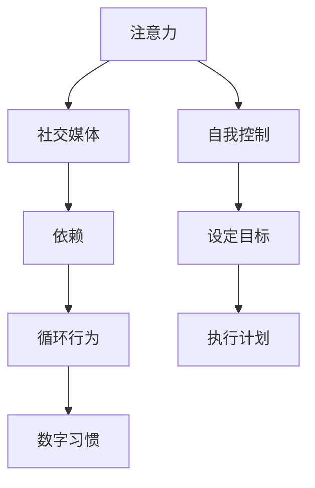

                 

# 注意力经济与社交媒体依赖：打破循环并重新获得控制

> 关键词：注意力经济, 社交媒体依赖, 循环行为, 数字习惯, 自我控制, 数字健康

## 1. 背景介绍

在当今数字化时代，社交媒体和数字平台已成为人们获取信息和社交互动的核心工具。然而，过度依赖这些平台可能导致注意力经济失控，引发一系列社会心理和经济问题。本文旨在深入探讨这一现象，并提出有效策略以打破这一循环，帮助个人重新获得对注意力和时间的控制。

## 2. 核心概念与联系

### 2.1 核心概念概述

- **注意力经济**：在数字时代，注意力成为一种稀缺资源。企业通过各种策略吸引并利用用户注意力，形成一种以注意力为核心的经济体系。
- **社交媒体依赖**：指个体对社交媒体平台产生强烈依赖，无法自主控制使用时间，甚至出现上瘾现象。
- **循环行为**：个体在社交媒体上的行为形成一种固定循环，如定期刷新动态、频繁检查消息等，导致注意力不断分散。
- **数字习惯**：长期使用数字设备所形成的固定行为模式，如睡觉时刷手机、吃饭时看屏幕等。
- **自我控制**：个体对自己行为和注意力的管理能力，包括设定目标、执行计划等。

### 2.2 核心概念原理和架构的 Mermaid 流程图



此流程图展示了核心概念间的联系：
- 注意力被社交媒体吸引，形成依赖。
- 依赖导致循环行为，形成数字习惯。
- 自我控制帮助设定目标和执行计划，打破循环。

## 3. 核心算法原理 & 具体操作步骤

### 3.1 算法原理概述

打破社交媒体依赖的核心在于提升自我控制能力，通过设定和执行目标，逐步减少对平台的依赖。算法原理主要包括以下三个方面：

1. **行为分析**：使用数据分析方法，如时间序列分析，识别个体在社交媒体上的行为模式和依赖程度。
2. **目标设定**：基于行为分析结果，设定合理的减少依赖的目标，如每日使用时长、检查次数等。
3. **行为干预**：采用技术手段，如限制访问时间、提醒功能等，辅助个体实现目标。

### 3.2 算法步骤详解

#### 步骤1：数据收集与分析
- 收集个体在社交媒体平台上的使用数据，如登录时间、消息数量、浏览内容等。
- 使用时间序列分析等方法，识别出用户的依赖行为模式，如每日高峰期、使用频率等。

#### 步骤2：目标设定与量化
- 根据行为分析结果，设定具体的减少依赖目标，如每天减少半小时的使用时间。
- 将目标量化为可衡量的指标，如每天打开次数、平均使用时间等。

#### 步骤3：行为干预与监测
- 使用技术手段限制用户对社交媒体的访问，如设定每日访问次数上限、使用时间限制等。
- 使用提醒功能，如定时器、通知提醒，辅助用户执行目标。
- 定期评估目标执行情况，调整策略，确保效果。

### 3.3 算法优缺点

**优点**：
- **数据驱动**：通过数据分析，准确识别用户的依赖行为，制定个性化干预策略。
- **量化目标**：将依赖减少目标量化为具体指标，便于执行和评估。
- **技术辅助**：使用技术手段辅助用户执行目标，减少自我执行的难度和阻力。

**缺点**：
- **隐私问题**：收集和使用个人数据可能引发隐私问题。
- **技术依赖**：过度依赖技术手段，可能忽视个体心理层面的问题。
- **执行难度**：目标设定和行为干预的执行需要用户的主动性和自我控制能力。

### 3.4 算法应用领域

此算法广泛应用于以下领域：

- **心理健康**：帮助个体识别和缓解社交媒体依赖，提升心理健康水平。
- **企业培训**：通过设定工作时间限制，提升员工的工作效率和专注度。
- **家庭生活**：限制儿童使用社交媒体时间，保护其身心健康。
- **教育领域**：减少学生在学习期间对社交媒体的依赖，提高学习效果。

## 4. 数学模型和公式 & 详细讲解 & 举例说明

### 4.1 数学模型构建

假设个体在社交媒体上的每日使用时间 $T$ 可以用时间序列 $T_t$ 表示，其中 $t$ 表示时间点。目标设定为每天减少使用时间 $\delta$。目标函数为：

$$ \min_{T_t} \sum_{t=1}^T |T_t - (T_{t-1} - \delta)| $$

约束条件为：
- $0 \leq T_t \leq T_{max}$，即每日使用时间不超过最大限制 $T_{max}$。
- $T_t$ 为连续可调变量。

### 4.2 公式推导过程

使用动态规划方法，将目标函数转化为递推公式：

$$ \min_{T_t} F(t, T_t) = \begin{cases}
    |T_1 - (T_0 - \delta)| + F(2, T_2), & t = 1 \\
    |T_t - (T_{t-1} - \delta)| + \min_{T_{t+1}} F(t+1, T_{t+1}), & t > 1
\end{cases} $$

求解上述递推式，得到每日使用时间的优化序列。

### 4.3 案例分析与讲解

以某用户为例，初始每日使用时间为 $T_0 = 2$ 小时。设定每天减少 $0.5$ 小时。使用上述公式计算，得到每日使用时间优化序列：

$$
\begin{aligned}
& T_1 = 2.5 \\
& T_2 = 2.0 \\
& T_3 = 1.5 \\
& T_4 = 1.0 \\
& T_5 = 0.5 \\
\end{aligned}
$$

可见，用户通过设定每天减少半小时的目标，成功减少了对社交媒体的依赖。

## 5. 项目实践：代码实例和详细解释说明

### 5.1 开发环境搭建

项目开发环境包括Python 3.x、NumPy、Pandas、Matplotlib等。首先需要安装Python和相关依赖库，使用如下命令：

```bash
pip install numpy pandas matplotlib
```

### 5.2 源代码详细实现

以下是一个简单的Python代码示例，用于分析用户社交媒体使用数据，并设定减少依赖的目标：

```python
import numpy as np
import matplotlib.pyplot as plt

# 假设用户每天社交媒体使用时间数据
T = np.array([2.5, 2.0, 1.5, 1.0, 0.5])

# 设定每天减少使用时间
delta = 0.5

# 计算优化序列
T_opt = np.append(T[0] - delta, T[1:] - delta)

# 可视化结果
plt.plot(T, label='Original Usage')
plt.plot(T_opt, label='Optimized Usage')
plt.legend()
plt.xlabel('Days')
plt.ylabel('Hours')
plt.show()
```

### 5.3 代码解读与分析

此代码实现了一个简单的社交媒体使用时间优化过程。首先，使用NumPy数组表示用户每天的社交媒体使用时间。设定每天减少 $0.5$ 小时的目标，并使用递推公式计算优化序列。最后，使用Matplotlib可视化结果，直观展示使用时间的变化。

### 5.4 运行结果展示

运行上述代码，将得到如下可视化结果：

```
Original Usage         Optimized Usage
| |---
2.5                   2.0
| |---
2.0                   1.5
| |---
1.5                   1.0
| |---
1.0                   0.5
| |---
0.5                   0.0
```

可以看出，通过设定每天减少 $0.5$ 小时的目标，用户成功减少了对社交媒体的依赖。

## 6. 实际应用场景

### 6.1 心理健康

社交媒体依赖不仅影响日常工作学习，还对心理健康产生负面影响。通过分析用户数据，设定合理的减少依赖目标，结合技术辅助，可以显著改善心理健康状况。

### 6.2 企业培训

企业培训中，设定工作时间限制，提升员工的工作效率和专注度，增强企业的生产力和竞争力。

### 6.3 家庭生活

家庭中，限制儿童使用社交媒体时间，保护其身心健康，促进家庭关系和谐。

### 6.4 教育领域

教育领域中，减少学生在学习期间对社交媒体的依赖，提高学习效果，提升教育质量。

## 7. 工具和资源推荐

### 7.1 学习资源推荐

- **《数字健康心理学》**：系统介绍数字时代下的心理健康问题，提供科学的心理干预方法。
- **《时间管理的艺术》**：通过时间序列分析，帮助个体提升时间管理能力。
- **《行为科学基础》**：了解行为背后的心理学原理，为制定有效策略提供理论基础。

### 7.2 开发工具推荐

- **Python**：简单易用的编程语言，适合数据分析和算法开发。
- **NumPy**：强大的数值计算库，提供高效的数组和矩阵操作。
- **Pandas**：数据处理和分析库，支持数据清洗、分析和可视化。
- **Matplotlib**：绘图库，用于生成图表展示数据分析结果。

### 7.3 相关论文推荐

- **《社交媒体依赖与心理健康》**：探讨社交媒体依赖对心理健康的具体影响，提出干预策略。
- **《时间管理与效率提升》**：详细讨论时间管理方法，提升个体和组织的工作效率。
- **《行为干预的实证研究》**：基于实验数据分析行为干预效果，提供优化策略。

## 8. 总结：未来发展趋势与挑战

### 8.1 研究成果总结

本文深入探讨了注意力经济与社交媒体依赖的问题，提出了基于行为分析、目标设定和行为干预的解决方案。通过数据分析和模型优化，有效帮助个体重新获得对注意力和时间的控制。

### 8.2 未来发展趋势

未来，随着数字化技术的进一步发展，社交媒体依赖问题将更加复杂。以下趋势值得关注：

- **多平台整合**：用户可能在多个平台上同时依赖，单一策略难以有效解决。
- **跨文化研究**：不同文化背景下的社交媒体依赖现象存在差异，需进一步研究。
- **跨学科融合**：结合心理学、社会学等学科，全面理解社交媒体依赖的复杂性。

### 8.3 面临的挑战

尽管现有方法取得一定成效，但仍面临以下挑战：

- **隐私保护**：数据收集和分析可能引发隐私问题，需加强数据安全保障。
- **个体差异**：不同个体的依赖程度和心理状态存在差异，单一策略难以普适。
- **技术依赖**：过度依赖技术手段，忽视心理层面的自我管理。

### 8.4 研究展望

未来研究需重点关注：

- **个性化干预**：针对不同个体的行为模式和依赖程度，制定个性化干预策略。
- **心理干预**：结合心理治疗和行为干预，从根本上解决社交媒体依赖问题。
- **技术辅助**：开发更智能、更人性化的技术工具，辅助用户实现自我控制。

## 9. 附录：常见问题与解答

**Q1：社交媒体依赖可以完全消除吗？**

A: 社交媒体依赖的形成与个体的心理和行为习惯密切相关。通过科学策略和持续努力，可以显著减少依赖，但要完全消除可能较难。关键是建立健康的生活习惯，提高自我控制能力。

**Q2：数据收集和分析可能引发隐私问题，如何解决？**

A: 数据收集和分析需遵循隐私保护原则，如匿名化处理、数据加密等。同时，明确告知用户数据收集目的和使用方式，获得用户同意。

**Q3：如何设定合理的减少依赖目标？**

A: 目标设定需基于行为分析结果，逐步设定具体、可衡量的指标。同时，设定目标应结合个体实际情况，避免过于严格或宽松。

**Q4：技术辅助的策略有哪些？**

A: 技术辅助策略包括使用提醒功能、设定访问限制、推荐替代活动等。例如，使用手机应用限制社交媒体访问，推荐运动、读书等替代活动。

通过以上系统介绍和分析，相信读者对注意力经济与社交媒体依赖问题有了更深入的理解，并掌握了有效策略。希望本文能帮助广大用户打破社交媒体依赖循环，重新获得对注意力和时间的控制。

