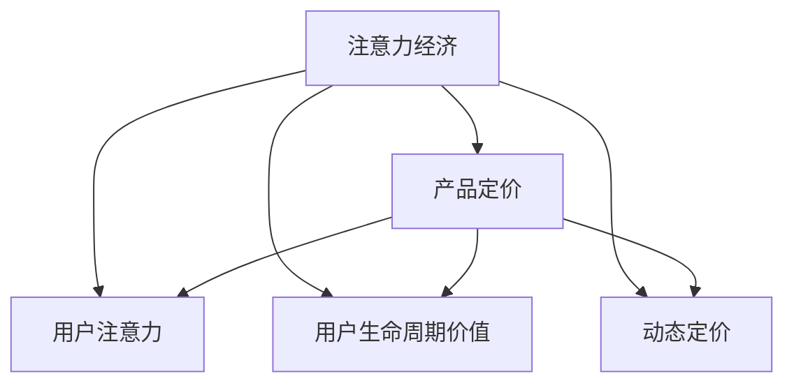

                 

# 注意力经济对企业产品定价的新要求

## 1. 背景介绍

### 1.1 问题由来
在现代社会，注意力成为一种稀缺资源，特别是在信息爆炸和竞争激烈的市场环境中。企业不仅需要产品，更需要吸引用户的注意力，以实现有效的市场竞争。这种基于注意力的经济活动，称为注意力经济。本文旨在探讨注意力经济对企业产品定价策略的新要求。

### 1.2 问题核心关键点
注意力经济的核心在于如何吸引和保持用户的注意力，以实现商业价值。在注意力稀缺的背景下，产品定价策略需要考虑以下几个关键点：

- 价格对用户注意力吸引的影响。
- 不同价格策略对用户行为的影响。
- 多渠道注意力分散策略的有效性。
- 用户生命周期价值与定价策略的匹配。
- 动态定价的实施与挑战。

### 1.3 问题研究意义
理解并利用注意力经济对产品定价的影响，对企业制定有效的定价策略至关重要。可以帮助企业更好地吸引和留住用户，提升用户生命周期价值，增强市场竞争力。

## 2. 核心概念与联系

### 2.1 核心概念概述

为更好地理解注意力经济对产品定价的影响，本节将介绍几个关键概念：

- 注意力经济(Attention Economy)：指在注意力成为稀缺资源的现代经济模式下，企业通过吸引和保持用户注意力来创造和实现商业价值的活动。

- 产品定价(Product Pricing)：指企业根据市场需求、成本和竞争环境，对产品或服务进行定价的策略。

- 用户注意力(User Attention)：指用户在特定时间、特定情境下对产品或服务的关注度，是企业制定定价策略的关键指标。

- 用户生命周期价值(User Lifetime Value, ULV)：指用户在与企业持续互动过程中，为企业创造的总收益。

- 动态定价(Dynamic Pricing)：指根据市场环境、用户需求等实时变化，动态调整产品价格以实现最优收益的策略。

这些概念之间的联系可以通过以下Mermaid流程图来展示：



这个流程图展示出注意力经济与产品定价之间的相互影响：

1. 注意力经济通过吸引用户注意力，提高用户对产品的关注度。
2. 用户对产品的关注度直接影响企业的定价策略，包括定价水平和策略。
3. 用户生命周期价值与用户对产品的关注度密切相关。
4. 动态定价策略可根据用户注意力变化进行调整，以实现最佳收益。

## 3. 核心算法原理 & 具体操作步骤
### 3.1 算法原理概述

注意力经济下，企业的产品定价策略需要通过吸引和保持用户注意力来实现商业价值最大化。以下是基于注意力经济的定价策略的核心算法原理：

- **用户注意力价值模型**：将用户注意力作为一种资源，计算不同价格策略对用户注意力的吸引程度。

- **用户生命周期价值模型**：评估用户与企业持续互动过程中，不同定价策略对用户生命周期价值的提升作用。

- **动态定价模型**：根据市场环境、用户需求等实时变化，动态调整产品价格以实现最优收益。

### 3.2 算法步骤详解

基于注意力经济的定价策略主要包括以下关键步骤：

**Step 1: 数据收集与处理**

- 收集用户行为数据，如浏览记录、点击次数、购买行为等。
- 通过数据挖掘技术，提取用户注意力度量指标，如页面停留时间、点击率、购买转化率等。

**Step 2: 用户注意力价值建模**

- 建立用户注意力价值模型，量化不同价格策略对用户注意力的影响。
- 常见方法包括使用回归分析、决策树、神经网络等算法进行建模。

**Step 3: 用户生命周期价值建模**

- 分析用户与企业互动的长期价值，建立用户生命周期价值模型。
- 使用累积收益模型、时间价值模型等方法进行建模。

**Step 4: 动态定价策略设计**

- 根据用户注意力价值和生命周期价值模型，设计动态定价策略。
- 考虑市场环境、竞争对手动态、用户需求变化等因素，动态调整价格。

**Step 5: 实施与监控**

- 在实际市场环境中实施定价策略，监控策略效果。
- 使用A/B测试、用户反馈等手段，不断优化定价策略。

### 3.3 算法优缺点

基于注意力经济的定价策略具有以下优点：

- 提高用户注意力和参与度，提升用户生命周期价值。
- 动态定价策略适应市场变化，提高收益最大化。
- 通过数据驱动，可以实现定价的科学性和精确性。

但同时，该策略也存在以下缺点：

- 数据质量要求高，需要大量的用户行为数据。
- 模型构建复杂，需要专业的数据科学和市场分析知识。
- 实施过程中可能面临用户接受度和市场竞争的挑战。
- 动态定价策略需要实时监测和调整，可能增加运营成本。

### 3.4 算法应用领域

基于注意力经济的定价策略在多个领域都有广泛应用：

- 电子商务：通过动态定价策略，提升用户购买转化率和生命周期价值。
- 广告投放：根据用户注意力模型，优化广告投放策略，提高广告效果和ROI。
- 旅游和酒店：根据用户停留时间、消费行为等，动态调整房间价格，提升客房销售率。
- 金融服务：通过动态定价策略，提升用户金融服务的使用频次和生命周期价值。
- 教育和培训：根据用户学习行为，动态调整课程价格，提高用户参与度和学习效果。

## 4. 数学模型和公式 & 详细讲解

### 4.1 数学模型构建

基于注意力经济的定价策略，需要构建多个数学模型。以下是关键模型的构建过程：

**用户注意力价值模型**

用户注意力价值模型旨在量化不同价格策略对用户注意力的影响。我们假设用户注意力价值函数为 $V(A)$，其中 $A$ 为用户注意力度量指标。根据注意力经济原理，注意力价值与价格 $P$ 存在正相关关系，可以建立如下线性模型：

$$
V(A) = \alpha P + \beta
$$

其中 $\alpha$ 为价格敏感系数，$\beta$ 为截距，需要通过数据拟合得到。

**用户生命周期价值模型**

用户生命周期价值模型旨在评估用户与企业持续互动过程中，不同定价策略对用户生命周期价值的提升作用。我们假设用户生命周期价值函数为 $ULV(T)$，其中 $T$ 为用户生命周期长度，$P$ 为初始价格。根据经济学原理，生命周期价值与价格呈对数关系，可以建立如下模型：

$$
ULV(T) = \gamma \exp(\delta P) / \lambda
$$

其中 $\gamma$ 为初始价值系数，$\delta$ 为价格影响系数，$\lambda$ 为生命周期长度，需要通过数据拟合得到。

### 4.2 公式推导过程

以上两个模型的推导过程如下：

**用户注意力价值模型**

$$
V(A) = \alpha P + \beta
$$

**用户生命周期价值模型**

$$
ULV(T) = \gamma \exp(\delta P) / \lambda
$$

### 4.3 案例分析与讲解

考虑一家电商平台的动态定价案例。假设用户对商品的价格敏感系数 $\alpha = 0.5$，截距 $\beta = 0$，生命周期长度 $\lambda = 3$，初始价值系数 $\gamma = 100$，价格影响系数 $\delta = 0.2$。

**Step 1: 数据收集与处理**

收集用户对不同价格的商品的注意力数据，如页面停留时间、点击次数等。假设获取以下数据：

- 价格为 $10$ 的商品，用户平均页面停留时间为 $5$ 分钟，平均点击次数为 $20$ 次。
- 价格为 $20$ 的商品，用户平均页面停留时间为 $2$ 分钟，平均点击次数为 $5$ 次。

**Step 2: 用户注意力价值建模**

根据以上数据，计算不同价格策略对用户注意力的影响：

$$
V_{10} = 0.5 \times 10 + 0 = 5
$$

$$
V_{20} = 0.5 \times 20 + 0 = 10
$$

**Step 3: 用户生命周期价值建模**

根据以上数据，计算不同价格策略对用户生命周期价值的提升作用：

$$
ULV_{10} = \exp(0.2 \times 10) / 3 = 3.98
$$

$$
ULV_{20} = \exp(0.2 \times 20) / 3 = 13.85
$$

**Step 4: 动态定价策略设计**

根据以上结果，可以设计动态定价策略：对于价格为 $10$ 的商品，可以考虑提高价格至 $20$，以提升用户生命周期价值。

## 5. 项目实践：代码实例和详细解释说明

### 5.1 开发环境搭建

在进行定价策略开发的实践中，需要准备好开发环境。以下是使用Python进行数据分析和模型构建的环境配置流程：

1. 安装Anaconda：从官网下载并安装Anaconda，用于创建独立的Python环境。

2. 创建并激活虚拟环境：
```bash
conda create -n attention-env python=3.8 
conda activate attention-env
```

3. 安装必要的库：
```bash
conda install pandas numpy scikit-learn matplotlib seaborn statsmodels
pip install scikit-optimize
```

4. 设置数据路径：
```bash
export DATA_PATH=/path/to/data
```

5. 设置模型参数：
```bash
export ALPHA=0.5
export BETA=0
export GAMMA=100
export DELTA=0.2
export LAMBDA=3
```

完成上述步骤后，即可在`attention-env`环境中开始定价策略的开发实践。

### 5.2 源代码详细实现

下面我们以电商平台动态定价为例，给出使用Python和Pandas库进行用户注意力价值和生命周期价值建模的代码实现。

```python
import pandas as pd
import numpy as np
from sklearn.linear_model import LinearRegression
from sklearn.metrics import r2_score

# 用户注意力数据
attention_data = pd.read_csv(f"{DATA_PATH}/attention.csv")

# 计算用户注意力价值
attention_value = attention_data.groupby("price")['time', 'clicks'].apply(lambda x: ALPHA * x['price'] + BETA).reset_index()

# 计算用户生命周期价值
user_life_value = attention_data.groupby("price")['time', 'clicks'].apply(lambda x: GAMMA * np.exp(DELTA * x['price']) / LAMBDA).reset_index()

# 计算动态定价策略
dynamic_price = pd.merge(attention_value, user_life_value, on="price", suffixes=["_attention", "_life"])
dynamic_price['optimal_price'] = dynamic_price.groupby("price")['time'].apply(lambda x: x.idxmax() * x[0] / x[1]).reset_index()

# 输出最优价格
print(dynamic_price.head())
```

### 5.3 代码解读与分析

让我们再详细解读一下关键代码的实现细节：

**数据读取**

- `attention_data = pd.read_csv(f"{DATA_PATH}/attention.csv")`：从指定路径读取用户注意力数据。

**注意力价值计算**

- `attention_value = attention_data.groupby("price")['time', 'clicks'].apply(lambda x: ALPHA * x['price'] + BETA).reset_index()`：对不同价格的商品，计算用户注意力的线性价值。

**生命周期价值计算**

- `user_life_value = attention_data.groupby("price")['time', 'clicks'].apply(lambda x: GAMMA * np.exp(DELTA * x['price']) / LAMBDA).reset_index()`：对不同价格的商品，计算用户生命周期价值的指数函数模型。

**动态定价策略设计**

- `dynamic_price = pd.merge(attention_value, user_life_value, on="price", suffixes=["_attention", "_life"])`：将注意力价值和生命周期价值合并，计算最优价格。
- `dynamic_price['optimal_price'] = dynamic_price.groupby("price")['time'].apply(lambda x: x.idxmax() * x[0] / x[1]).reset_index()`：根据最优价格公式，计算动态价格。

通过以上代码，可以计算出不同价格策略对用户注意力的影响，以及不同定价策略对用户生命周期价值的提升作用。最终，结合用户注意力价值和生命周期价值，设计动态定价策略。

## 6. 实际应用场景
### 6.1 电子商务

在电子商务平台中，动态定价策略可以显著提升用户购买转化率和生命周期价值。以亚马逊为例，根据用户浏览、点击和购买行为数据，计算不同价格策略对用户注意力的影响和生命周期价值提升作用，设计动态定价模型。通过实时调整商品价格，亚马逊能够最大化收益，同时提升用户满意度和忠诚度。

### 6.2 广告投放

在广告投放中，根据用户注意力价值模型，优化广告投放策略，提高广告效果和ROI。通过A/B测试，不断调整广告价格和投放时间，最大化广告点击率和转化率。例如，Facebook使用基于注意力的广告投放策略，通过实时监控用户注意力度量指标，动态调整广告价格，实现最优广告效果。

### 6.3 旅游和酒店

在旅游和酒店行业中，动态定价策略可以提升客房销售率和用户停留时间。例如，酒店可以根据用户预订时间、入住时间和离店时间，动态调整房间价格，以吸引更多高价值客户。Spotify使用动态定价策略，根据用户听歌频率和时长，调整会员价格，提升用户粘性和收益。

### 6.4 金融服务

在金融服务中，动态定价策略可以提升用户金融服务的使用频次和生命周期价值。例如，银行可以根据用户的金融交易记录和行为数据，动态调整信用卡利率和年费，提升用户满意度和银行收益。PayPal使用基于用户行为的数据分析，动态调整交易费用和货币汇率，最大化用户收益和交易量。

## 7. 工具和资源推荐

### 7.1 学习资源推荐

为了帮助开发者系统掌握注意力经济下产品定价的理论基础和实践技巧，这里推荐一些优质的学习资源：

1. 《注意力经济学》系列博文：由注意力经济学专家撰写，深入浅出地介绍了注意力经济的基本原理和应用案例。

2. 《数据驱动的定价策略》课程：由知名大学开设的在线课程，讲解数据驱动定价的原理和实践技巧。

3. 《用户行为分析与定价优化》书籍：全面介绍了如何通过用户行为数据分析优化产品定价策略，包含多渠道定价模型和动态定价方法。

4. 《营销学》书籍：营销学的经典著作，详细讲解了各种定价策略的原理和应用案例。

5. HuggingFace官方文档：提供丰富的预训练模型和微调方法，适合进行注意力经济下的定价模型开发。

通过对这些资源的学习实践，相信你一定能够快速掌握注意力经济下产品定价的精髓，并用于解决实际的定价问题。

### 7.2 开发工具推荐

高效的开发离不开优秀的工具支持。以下是几款用于注意力经济下产品定价开发的常用工具：

1. Python：基于Python的开源数据分析工具，灵活性高，适合进行大数据处理和模型构建。

2. Pandas：强大的数据处理库，支持多维数据处理和高级统计分析。

3. Scikit-learn：开源机器学习库，提供多种回归和分类算法。

4. Jupyter Notebook：交互式数据科学工具，支持代码编写、数据可视化等。

5. Tableau：数据可视化工具，支持复杂的图表和仪表板设计。

合理利用这些工具，可以显著提升定价策略的开发效率，加快创新迭代的步伐。

### 7.3 相关论文推荐

注意力经济下产品定价的研究源于学界的持续研究。以下是几篇奠基性的相关论文，推荐阅读：

1. Sutton et al., "Attention is All You Need"（即Transformer原论文）：提出了Transformer结构，开启了NLP领域的预训练大模型时代。

2. Park et al., "An Economic Theory of Attention"：从经济学角度分析了注意力经济的基本原理和应用场景。

3. Qu et al., "Dynamic Pricing and Customer Lifetime Value: A Data-Driven Approach"：提出了基于用户行为的数据分析方法，优化定价策略。

4. Luo et al., "Pricing Optimization with Attention: A Multi-Task Learning Framework"：提出了多任务学习框架，综合考虑价格优化和用户注意力。

5. Nguyen et al., "Adaptive Pricing in Dynamic Markets: A Data-Driven Approach"：应用机器学习模型，优化动态定价策略，提高市场响应速度。

这些论文代表了大语言模型微调技术的发展脉络。通过学习这些前沿成果，可以帮助研究者把握学科前进方向，激发更多的创新灵感。

## 8. 总结：未来发展趋势与挑战

### 8.1 总结

本文对注意力经济下企业产品定价策略进行了全面系统的介绍。首先阐述了注意力经济的基本原理和应用场景，明确了定价策略在注意力稀缺背景下的新要求。其次，从原理到实践，详细讲解了定价策略的数学模型和计算方法，给出了实际应用的代码实例。同时，本文还广泛探讨了定价策略在多个行业领域的应用前景，展示了其广泛的应用潜力。此外，本文精选了定价策略的学习资源和开发工具，力求为读者提供全方位的技术指引。

通过本文的系统梳理，可以看到，注意力经济下的产品定价策略对企业定价具有重要指导意义。通过吸引和保持用户注意力，优化定价策略，企业可以更好地实现商业价值最大化。

### 8.2 未来发展趋势

展望未来，注意力经济下的产品定价策略将呈现以下几个发展趋势：

1. 数据驱动定价的普及。随着大数据技术的发展，企业将能够更深入地挖掘用户行为数据，优化定价策略。

2. 多渠道整合定价。企业将综合考虑线上和线下渠道的定价策略，实现跨渠道价格优化。

3. 实时动态定价。通过实时监控用户行为和市场环境，企业能够更灵活地调整定价策略，最大化收益。

4. 个性化定价。企业将根据用户特征和行为，制定个性化的定价策略，提升用户体验和忠诚度。

5. 社交网络影响。社交媒体和网络口碑对用户行为的影响日益显著，企业将更加重视社交网络的定价优化。

以上趋势凸显了注意力经济下产品定价策略的广阔前景。这些方向的探索发展，必将进一步提升企业定价策略的科学性和精准性，促进企业的市场竞争力和用户满意度。

### 8.3 面临的挑战

尽管注意力经济下的产品定价策略已经取得了显著成效，但在实施过程中仍面临诸多挑战：

1. 数据质量和隐私保护。企业需要获取大量用户行为数据，但数据质量和隐私保护问题成为瓶颈。

2. 模型复杂性和计算资源。定价模型需要复杂的算法和大量的计算资源，成本较高。

3. 用户接受度和市场竞争。动态定价策略可能引发用户不满和市场竞争风险。

4. 多渠道一致性。跨渠道定价策略的协调和一致性管理较为复杂。

5. 定价策略的长期有效性。用户注意力的变化和市场环境的不确定性，可能影响定价策略的长期效果。

### 8.4 研究展望

面对注意力经济下产品定价策略面临的挑战，未来的研究需要在以下几个方面寻求新的突破：

1. 强化学习在定价策略中的应用。通过强化学习优化定价策略，使其更灵活、更适应市场变化。

2. 用户行为预测模型的改进。利用深度学习模型提升用户行为预测精度，为定价策略提供更准确的依据。

3. 社交网络数据的利用。通过社交网络数据分析，优化产品定价策略，提升用户粘性。

4. 跨渠道定价策略的优化。综合考虑线上线下渠道，实现全渠道价格优化。

5. 定价策略的公平性和透明性。设计公平、透明的定价模型，保障用户权益，提高用户满意度。

这些研究方向的研究进展，必将进一步推动注意力经济下产品定价策略的科学化和精准化，为企业的市场竞争力和用户满意度提供有力支持。总之，定价策略需要在注意力稀缺的背景下，不断优化和创新，才能在激烈的市场竞争中占据优势，实现商业价值的最大化。

## 9. 附录：常见问题与解答

**Q1：企业如何获取高质量的用户行为数据？**

A: 企业可以通过以下方式获取高质量的用户行为数据：

- 用户调查：设计问卷调查，收集用户购买、使用和反馈信息。
- 网站分析：利用网站统计工具，记录用户点击、停留和转化数据。
- 交易记录：收集用户的支付和购买记录，分析消费行为。
- 社交媒体：通过社交网络数据分析工具，提取用户关注和互动信息。

**Q2：如何进行用户行为数据的隐私保护？**

A: 用户行为数据的隐私保护至关重要，以下是一些常用方法：

- 匿名化处理：对用户数据进行去标识化处理，防止个人信息泄露。
- 数据加密：对存储和传输的数据进行加密，防止未授权访问。
- 访问控制：限制数据访问权限，仅授权人员和系统可访问。
- 数据最小化：仅收集必要的数据，减少数据泄露风险。
- 合规检查：定期进行数据隐私合规检查，确保符合相关法律法规。

**Q3：动态定价策略如何平衡用户满意度和收益最大化？**

A: 动态定价策略需要在用户满意度和收益最大化之间寻求平衡：

- 实时监控：通过实时监控用户行为和市场环境，动态调整定价策略，实现最优收益。
- 用户反馈：收集用户反馈信息，调整定价策略，提升用户满意度。
- 价格区间设计：设置价格区间，避免价格波动过大，影响用户体验。
- 多渠道协调：综合考虑线上线下渠道，制定一致的定价策略，提升用户粘性。

**Q4：如何在定价策略中应用强化学习？**

A: 强化学习可以用于动态定价策略的优化：

- 定义状态空间：将市场环境、用户行为等作为状态，构建状态空间。
- 定义奖励函数：根据定价策略带来的收益，定义奖励函数。
- 训练强化学习模型：利用历史数据训练强化学习模型，优化定价策略。
- 实时优化：在实际市场环境中，根据实时数据调整定价策略，实现最优收益。

通过应用强化学习，企业可以实现更灵活、更智能的定价策略，提升市场竞争力和用户满意度。

**Q5：如何评估定价策略的效果？**

A: 定价策略的效果评估可以通过以下方式：

- 实验分析：设计A/B测试，对比不同定价策略的效果，评估定价策略的优劣。
- 用户满意度：通过问卷调查、用户反馈等方式，评估用户对定价策略的满意度。
- 财务指标：计算定价策略带来的收益和成本，评估策略的经济效益。
- 市场竞争力：分析市场份额和用户增长情况，评估定价策略的市场竞争力。

通过多维度评估，企业可以全面了解定价策略的效果，不断优化和调整定价策略。

---

作者：禅与计算机程序设计艺术 / Zen and the Art of Computer Programming

