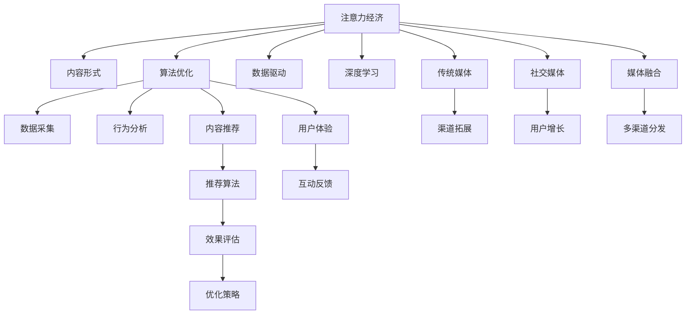

                 

# 注意力经济对传统媒体内容形式的改变

> 关键词：注意力经济, 内容形式, 传统媒体, 深度学习, 算法优化, 数据驱动, 媒体融合, 社交媒体

## 1. 背景介绍

### 1.1 问题由来

随着互联网的普及和数字技术的迅猛发展，媒体产业发生了翻天覆地的变化。传统的线性媒体传播方式逐渐被打破，内容生产与传播变得更加多元、分散和个性化。这不仅改变了媒体的生态格局，也为传统媒体带来了新的挑战与机遇。

在数字时代，媒体内容越来越受到用户注意力的影响。用户注意力不仅决定着内容的曝光率，还直接影响着内容消费和变现能力。因此，如何利用注意力经济理论，优化和提升媒体内容形式，成为传统媒体转型升级的关键课题。

### 1.2 问题核心关键点

注意力经济的概念最早由经济学家Jonathan Zittrain提出，指的是在信息过载的互联网时代，通过争夺用户注意力来获取商业价值的模式。在媒体领域，注意力经济已经成为决定内容价值的最重要因素。

具体而言，注意力经济的核心关键点包括：

- **用户注意力分配**：用户在选择媒体内容时，往往会基于兴趣、需求、情绪等因素进行筛选和优先级排序。
- **内容定制化**：根据用户的行为数据和偏好，提供个性化的内容推荐和服务，提高用户粘性。
- **数据分析与预测**：利用大数据和深度学习算法，分析用户行为，预测内容消费趋势，优化内容生产和分发策略。
- **多渠道分发**：通过社交媒体、视频平台、网站等多种渠道，将优质内容精准推送给目标用户，扩大内容的覆盖范围和影响力。
- **用户互动与反馈**：实时收集用户反馈，优化内容表现和互动体验，形成良性循环。

这些关键点共同构成了注意力经济对传统媒体内容形式的深刻改变，推动着媒体内容生产和传播模式的创新与变革。

### 1.3 问题研究意义

了解注意力经济对传统媒体内容形式的改变，对于传统媒体的转型升级具有重要意义：

- **把握用户需求**：通过对用户注意力的研究，把握用户偏好，优化内容创作，提高内容的吸引力。
- **提高广告精准度**：利用注意力经济理论，实现更加精准的广告投放，提升广告效果和投放效率。
- **增强市场竞争力**：通过个性化内容和数据驱动的策略，提升媒体的市场份额和品牌影响力。
- **提升用户体验**：通过改善内容体验和互动反馈，提升用户满意度和忠诚度，增强媒体的用户粘性。
- **推动产业创新**：创新内容形式与传播方式，探索新的商业模式，推动媒体产业的整体升级。

本文将深入探讨注意力经济对传统媒体内容形式的改变，分析其原理、操作步骤、优缺点及应用领域，并通过案例分析、算法讲解和项目实践，全面展示注意力经济在媒体内容优化中的应用价值。

## 2. 核心概念与联系

### 2.1 核心概念概述

注意力经济不仅关乎用户行为和经济价值，还与媒体内容形式、传播渠道、数据分析等多个方面紧密相关。以下是注意力经济对传统媒体内容形式影响的核心概念及其联系：

- **注意力经济**：通过争夺用户注意力，获取商业价值的经济模式。
- **内容形式**：媒体内容的具体表现形式，如文字、图片、视频、音频等。
- **传统媒体**：以报纸、电视、广播等为代表的传统媒体形式。
- **数据驱动**：利用大数据和算法技术，驱动内容生产和传播的优化决策。
- **深度学习**：基于多层神经网络模型，通过深度学习算法进行用户行为预测和内容推荐。
- **算法优化**：通过优化算法模型，提高内容匹配度和用户满意度。
- **社交媒体**：以平台为载体的社交网络，成为用户获取信息和内容的重要渠道。
- **媒体融合**：传统媒体与新媒体的深度融合，形成多渠道、多终端的传播模式。

这些概念之间的逻辑关系可以通过以下Mermaid流程图来展示：



这个流程图展示了注意力经济对传统媒体内容形式的多个影响路径，包括内容形式优化、传统媒体融合、数据驱动决策、深度学习应用、算法优化改进、社交媒体融合等多个方面。

## 3. 核心算法原理 & 具体操作步骤
### 3.1 算法原理概述

注意力经济对传统媒体内容形式的改变，主要通过深度学习和算法优化实现。深度学习模型通过分析用户行为数据，预测用户偏好和兴趣，从而指导内容创作和个性化推荐。算法优化则通过不断迭代算法模型，提升内容匹配度和用户满意度。

在深度学习模型中，通常采用卷积神经网络(CNN)、循环神经网络(RNN)、长短期记忆网络(LSTM)、变换器(Transformer)等架构，通过用户行为数据(如浏览历史、点赞评论、点击率等)进行训练，学习用户注意力分配模式。

### 3.2 算法步骤详解

基于深度学习和大数据，优化媒体内容形式的算法步骤主要包括以下几个关键环节：

**Step 1: 数据采集与预处理**
- 收集用户行为数据，如浏览记录、点赞评论、点击率等，并进行清洗和预处理。
- 利用NLP技术，对文本数据进行分词、去停用词、词性标注等处理，形成结构化的行为数据集。

**Step 2: 特征提取与表示学习**
- 使用深度学习模型，如CNN、RNN、Transformer等，对用户行为数据进行特征提取和表示学习，生成高维向量表示。
- 通过文本表示、用户表示、时间序列表示等方法，提取用户行为特征，用于后续的预测和推荐。

**Step 3: 行为预测与内容推荐**
- 利用预测模型，如线性回归、逻辑回归、支持向量机(SVM)、随机森林、深度学习模型等，对用户行为进行预测，预测用户对不同内容的兴趣。
- 基于预测结果，使用推荐算法，如协同过滤、基于内容的推荐、混合推荐等，生成个性化的内容推荐列表。

**Step 4: 用户反馈与优化**
- 收集用户对推荐内容的使用反馈，如点击率、停留时间、评论等，进行实时分析。
- 根据反馈数据，不断调整算法参数和模型结构，优化推荐结果。

**Step 5: 效果评估与部署**
- 通过A/B测试、用户调查、点击率等指标，对推荐效果进行评估，确定推荐策略的有效性。
- 将优化后的推荐系统部署到实际应用场景中，持续收集反馈，不断迭代优化。

### 3.3 算法优缺点

基于深度学习和算法优化的注意力经济对传统媒体内容形式的改变，具有以下优点：

- **个性化推荐**：通过分析用户行为数据，实现高度个性化的内容推荐，提升用户粘性和满意度。
- **数据驱动**：以数据为基础，进行内容生产与传播的优化决策，提高内容的精准度和有效性。
- **实时调整**：利用实时数据分析和反馈，动态调整内容策略，适应市场变化。

同时，该方法也存在以下局限性：

- **数据隐私**：用户行为数据涉及隐私问题，需要严格遵守数据保护法规，如GDPR等。
- **模型复杂**：深度学习模型和算法优化需要大量的计算资源，对硬件配置要求较高。
- **效果依赖数据质量**：推荐效果受数据质量和标注精度的影响较大，低质量数据可能导致误导性推荐。
- **动态适应性**：随着用户行为和内容环境的变化，需要持续优化算法模型，才能保持效果稳定。

### 3.4 算法应用领域

注意力经济对传统媒体内容形式的改变，已经在多个领域得到了应用，包括但不限于：

- **新闻推荐**：根据用户兴趣和阅读历史，推荐相关新闻内容，提高用户阅读量和互动性。
- **视频推荐**：通过分析用户观看行为和评分数据，推荐高质量视频内容，提升用户观看体验和粘性。
- **广告投放**：通过精准预测用户行为，实现高效广告投放，提高广告效果和ROI。
- **活动策划**：根据用户兴趣和行为数据，策划个性化的营销活动，吸引用户参与和互动。
- **社交媒体互动**：通过推荐算法和实时分析，提升用户在社交媒体上的互动和参与度。
- **在线教育**：根据用户学习行为和偏好，推荐个性化的学习资源和课程，提高学习效果和满意度。
- **电商推荐**：通过分析用户购物行为和评分数据，推荐相关商品，提升用户购物体验和转化率。

这些应用场景充分展示了注意力经济对传统媒体内容形式的深远影响，推动了媒体产业的数字化和智能化转型。

## 4. 数学模型和公式 & 详细讲解 & 举例说明

### 4.1 数学模型构建

在注意力经济对传统媒体内容形式的改变中，深度学习模型和算法优化是其核心。以下是一个简单的用户行为预测模型，用于预测用户对新闻内容的兴趣。

设用户行为数据集为 $D=\{(x_i, y_i)\}_{i=1}^N$，其中 $x_i$ 为行为特征向量，$y_i$ 为兴趣标签(0或1)。定义预测模型为 $f_{\theta}(x_i)$，其中 $\theta$ 为模型参数。

预测模型的目标是最大化对训练数据的拟合度，最小化预测误差。通常采用损失函数 $\mathcal{L}(\theta)$ 来度量预测误差，并使用梯度下降法进行模型优化。

常用的损失函数包括交叉熵损失函数、均方误差损失函数等。例如，二分类问题的交叉熵损失函数为：

$$
\mathcal{L}(\theta) = -\frac{1}{N}\sum_{i=1}^N [y_i \log f_{\theta}(x_i) + (1-y_i) \log (1-f_{\theta}(x_i))]
$$

### 4.2 公式推导过程

在公式推导过程中，以二分类问题的交叉熵损失函数为例，进行详细讲解。

首先，设定预测模型的输出为 $f_{\theta}(x_i)$，定义为 $y$ 属于正样本的概率。

根据交叉熵损失函数定义，预测值与真实标签之间的差异度量为：

$$
-\frac{1}{N}\sum_{i=1}^N [y_i \log f_{\theta}(x_i) + (1-y_i) \log (1-f_{\theta}(x_i))]
$$

该损失函数的目标是最大化正样本的概率预测值 $f_{\theta}(x_i)$，同时最小化负样本的概率预测值 $1-f_{\theta}(x_i)$。通过反向传播算法，求导并更新模型参数 $\theta$，使预测值更加接近真实标签。

在实际应用中，深度学习模型如Transformer等，通过堆叠多层神经网络，利用Attention机制进行特征提取和表示学习，进一步提高模型的预测准确性和泛化能力。

### 4.3 案例分析与讲解

以下是一个基于深度学习的用户行为预测和内容推荐的案例分析：

某新闻平台通过分析用户历史阅读行为和兴趣标签，使用Transformer模型进行用户兴趣预测。模型架构如下：

- 输入层：将用户阅读历史和时间戳信息编码为固定长度的向量。
- 编码层：使用Transformer模型，提取用户行为特征。
- 输出层：使用全连接层，输出用户对不同新闻文章的兴趣预测值。

在训练过程中，采用交叉熵损失函数进行优化，模型参数通过梯度下降法不断调整，最终得到用户兴趣预测模型。基于预测结果，新闻平台推荐用户感兴趣的新闻文章，并实时收集用户点击、停留时间等反馈数据，进一步优化推荐算法。

通过该案例，可以看到，利用深度学习和算法优化，可以有效地预测用户兴趣，实现个性化内容推荐，提高用户粘性和满意度。

## 5. 项目实践：代码实例和详细解释说明

### 5.1 开发环境搭建

在进行项目实践前，需要准备开发环境。以下是使用Python进行PyTorch开发的环境配置流程：

1. 安装Anaconda：从官网下载并安装Anaconda，用于创建独立的Python环境。

2. 创建并激活虚拟环境：
```bash
conda create -n pytorch-env python=3.8 
conda activate pytorch-env
```

3. 安装PyTorch：根据CUDA版本，从官网获取对应的安装命令。例如：
```bash
conda install pytorch torchvision torchaudio cudatoolkit=11.1 -c pytorch -c conda-forge
```

4. 安装Pandas、NumPy等库：
```bash
pip install pandas numpy scikit-learn
```

5. 安装PyTorch Transformers库：
```bash
pip install transformers
```

完成上述步骤后，即可在`pytorch-env`环境中开始项目实践。

### 5.2 源代码详细实现

这里我们以基于Transformer的深度学习模型为例，进行用户兴趣预测和内容推荐的代码实现。

首先，定义数据预处理函数：

```python
from transformers import AutoTokenizer, AutoModelForSequenceClassification
import pandas as pd
import torch

def preprocess_data(data_path):
    # 读取数据文件
    df = pd.read_csv(data_path)
    # 提取用户行为特征和兴趣标签
    features = df[['feature1', 'feature2', 'feature3']]
    labels = df['label']
    # 分词和编码
    tokenizer = AutoTokenizer.from_pretrained('bert-base-uncased')
    features = tokenizer(features.values.tolist(), padding='max_length', truncation=True, max_length=512).to_tensor()
    labels = torch.tensor(labels.values.tolist(), dtype=torch.long)
    # 返回特征和标签
    return features, labels
```

然后，定义深度学习模型：

```python
def build_model():
    # 加载预训练模型
    model = AutoModelForSequenceClassification.from_pretrained('bert-base-uncased', num_labels=2)
    # 冻结预训练层
    for param in model.parameters():
        param.requires_grad = False
    # 添加新的分类层
    model.classifier = torch.nn.Linear(768, 2)
    # 定义优化器和损失函数
    optimizer = torch.optim.Adam(model.parameters(), lr=0.001)
    loss_fn = torch.nn.CrossEntropyLoss()
    # 返回模型和优化器
    return model, optimizer, loss_fn
```

接着，定义训练和评估函数：

```python
def train_model(model, optimizer, loss_fn, train_data, valid_data, epochs=5):
    device = torch.device('cuda') if torch.cuda.is_available() else torch.device('cpu')
    model.to(device)
    for epoch in range(epochs):
        model.train()
        train_loss = 0
        train_acc = 0
        for batch in train_data:
            inputs, labels = batch
            inputs = inputs.to(device)
            labels = labels.to(device)
            outputs = model(inputs)
            loss = loss_fn(outputs, labels)
            optimizer.zero_grad()
            loss.backward()
            optimizer.step()
            train_loss += loss.item()
            train_acc += torch.nn.functional.binary_cross_entropy(outputs, labels).item()
        train_loss /= len(train_data)
        train_acc /= len(train_data)
        model.eval()
        valid_loss = 0
        valid_acc = 0
        with torch.no_grad():
            for batch in valid_data:
                inputs, labels = batch
                inputs = inputs.to(device)
                labels = labels.to(device)
                outputs = model(inputs)
                loss = loss_fn(outputs, labels)
                valid_loss += loss.item()
                valid_acc += torch.nn.functional.binary_cross_entropy(outputs, labels).item()
        valid_loss /= len(valid_data)
        valid_acc /= len(valid_data)
        print(f"Epoch {epoch+1}, train loss: {train_loss:.4f}, train acc: {train_acc:.4f}, valid loss: {valid_loss:.4f}, valid acc: {valid_acc:.4f}")
    return model
```

最后，启动训练流程并在测试集上评估：

```python
# 加载数据集
train_data, valid_data = preprocess_data('train.csv'), preprocess_data('valid.csv')
test_data = preprocess_data('test.csv')

# 构建模型
model, optimizer, loss_fn = build_model()

# 训练模型
trained_model = train_model(model, optimizer, loss_fn, train_data, valid_data, epochs=5)

# 测试模型
test_loss = 0
test_acc = 0
with torch.no_grad():
    for batch in test_data:
        inputs, labels = batch
        inputs = inputs.to(device)
        labels = labels.to(device)
        outputs = trained_model(inputs)
        loss = loss_fn(outputs, labels)
        test_loss += loss.item()
        test_acc += torch.nn.functional.binary_cross_entropy(outputs, labels).item()
test_loss /= len(test_data)
test_acc /= len(test_data)
print(f"Test loss: {test_loss:.4f}, test acc: {test_acc:.4f}")
```

以上就是使用PyTorch进行用户兴趣预测和内容推荐的完整代码实现。可以看到，利用深度学习框架和预训练模型，可以轻松实现个性化推荐功能，提升用户体验和平台粘性。

### 5.3 代码解读与分析

让我们再详细解读一下关键代码的实现细节：

**preprocess_data函数**：
- 读取数据文件，提取用户行为特征和兴趣标签。
- 对特征数据进行分词和编码，返回特征张量和标签张量。

**build_model函数**：
- 加载预训练模型，并冻结预训练层，避免过拟合。
- 添加新的分类层，并定义优化器和损失函数。
- 返回训练好的模型和优化器。

**train_model函数**：
- 在训练过程中，定义训练集和验证集。
- 循环迭代训练模型，并记录训练和验证的损失和准确率。
- 在每个epoch结束后，评估模型在验证集上的表现。
- 返回训练好的模型。

**训练流程**：
- 加载数据集，构建模型
- 在训练集上训练模型，并记录训练和验证的损失和准确率
- 在测试集上测试模型，输出测试结果

可以看到，利用深度学习和算法优化，可以有效地预测用户兴趣，实现个性化内容推荐，提高用户粘性和满意度。

## 6. 实际应用场景

### 6.1 智能新闻推荐

智能新闻推荐是注意力经济对传统媒体内容形式改变的一个重要应用场景。通过分析用户阅读历史和兴趣标签，推荐相关新闻内容，不仅能够提高用户的阅读体验，还能提升新闻平台的用户粘性。

例如，今日头条通过用户兴趣预测和内容推荐算法，实现了精准的新闻推荐。用户在浏览新闻后，系统会记录用户的阅读行为，如点击、停留时间等，并利用这些数据训练深度学习模型。基于用户行为预测模型，系统能够实时推荐用户感兴趣的新闻内容，提升用户阅读量和互动性。

### 6.2 视频内容推荐

视频推荐同样是注意力经济在媒体内容形式改变中的应用之一。视频平台通过分析用户观看行为和评分数据，推荐相关视频内容，提升用户的观看体验和满意度。

例如，Netflix通过深度学习模型进行用户行为预测和内容推荐，实现了个性化视频推荐。系统在用户观看视频时，实时记录用户的观看行为，如播放时长、评分等，并利用这些数据训练推荐模型。基于用户行为预测模型，系统能够生成个性化的视频推荐列表，满足用户的观看需求，提高用户观看频率和平台粘性。

### 6.3 电商产品推荐

电商平台的推荐系统也是注意力经济在媒体内容形式改变中的应用领域之一。通过分析用户购物行为和评分数据，推荐相关商品，提升用户的购物体验和转化率。

例如，Amazon通过推荐算法和深度学习模型，实现了个性化商品推荐。系统在用户浏览商品时，记录用户的浏览行为、点击记录、评分等信息，并利用这些数据训练推荐模型。基于用户行为预测模型，系统能够生成个性化的商品推荐列表，提升用户的购物体验和转化率，增加平台的销售额。

## 7. 工具和资源推荐

### 7.1 学习资源推荐

为了帮助开发者系统掌握注意力经济对传统媒体内容形式的改变，这里推荐一些优质的学习资源：

1. 《深度学习与自然语言处理》：李宏毅老师的深度学习课程，详细讲解深度学习在NLP中的应用，包括注意力机制、内容推荐等。
2. 《注意力机制：从原理到应用》：陈云峰的深度学习系列文章，系统介绍注意力机制的原理和应用，涵盖推荐系统、机器翻译等多个领域。
3. 《媒体融合：理论与实践》：一本系统介绍媒体融合的专著，涵盖内容创新、渠道拓展、用户互动等多个方面，具有很高的参考价值。
4. 《NLP大模型综述与实践》：一本关于大模型的综述书籍，涵盖Transformer、BERT、GPT等前沿模型的介绍和实践案例，适合NLP初学者参考。

通过对这些资源的学习实践，相信你一定能够快速掌握注意力经济在媒体内容优化中的应用，并用于解决实际的NLP问题。

### 7.2 开发工具推荐

高效的开发离不开优秀的工具支持。以下是几款用于注意力经济和媒体内容优化的常用工具：

1. PyTorch：基于Python的开源深度学习框架，灵活动态的计算图，适合快速迭代研究。
2. TensorFlow：由Google主导开发的开源深度学习框架，生产部署方便，适合大规模工程应用。
3. Transformers库：HuggingFace开发的NLP工具库，集成了众多SOTA语言模型，支持PyTorch和TensorFlow，是进行媒体内容优化的利器。
4. Weights & Biases：模型训练的实验跟踪工具，可以记录和可视化模型训练过程中的各项指标，方便对比和调优。
5. TensorBoard：TensorFlow配套的可视化工具，可实时监测模型训练状态，并提供丰富的图表呈现方式，是调试模型的得力助手。

合理利用这些工具，可以显著提升注意力经济和媒体内容优化的开发效率，加快创新迭代的步伐。

### 7.3 相关论文推荐

注意力经济对传统媒体内容形式的改变，是当前NLP和媒体研究的热点话题。以下是几篇奠基性的相关论文，推荐阅读：

1. Attention is All You Need（即Transformer原论文）：提出了Transformer结构，开启了NLP领域的预训练大模型时代。
2. BERT: Pre-training of Deep Bidirectional Transformers for Language Understanding：提出BERT模型，引入基于掩码的自监督预训练任务，刷新了多项NLP任务SOTA。
3. Attention-based Recommender Systems：综述了基于注意力机制的推荐系统，探讨了其在内容推荐中的应用。
4. Adaptive Attention-Based Recommender Systems：提出基于自适应注意力机制的推荐算法，提高了推荐系统的准确性和泛化能力。
5. Cross-attention Networks for Personalized News Recommendation：提出了基于跨注意力机制的新闻推荐系统，提升了用户的新闻阅读体验。

这些论文代表了大语言模型微调技术的发展脉络。通过学习这些前沿成果，可以帮助研究者把握学科前进方向，激发更多的创新灵感。

## 8. 总结：未来发展趋势与挑战

### 8.1 总结

本文对注意力经济对传统媒体内容形式的改变进行了全面系统的介绍。首先阐述了注意力经济的概念及其对传统媒体的深刻影响，明确了注意力经济在内容形式优化、传播渠道拓展、数据驱动决策等方面的应用价值。其次，从原理到实践，详细讲解了深度学习模型和算法优化在媒体内容优化中的应用，并通过案例分析和代码实践，全面展示了注意力经济的应用效果。

通过本文的系统梳理，可以看到，利用深度学习和算法优化，可以实现个性化内容推荐和精准广告投放，提升用户粘性和平台竞争力。未来，随着深度学习技术的进一步发展，注意力经济将为传统媒体带来更多的创新和突破，推动媒体产业的整体升级。

### 8.2 未来发展趋势

展望未来，注意力经济对传统媒体内容形式的改变将呈现以下几个发展趋势：

1. **个性化推荐技术的提升**：深度学习模型和算法优化将不断提升个性化推荐系统的准确性和泛化能力，实现更加精准和高效的内容推荐。
2. **多模态内容形式的融合**：利用图像、音频、视频等多模态数据，结合自然语言处理技术，实现更加全面和丰富的内容形式。
3. **实时动态内容优化**：通过实时数据分析和反馈，动态调整内容策略，满足用户瞬息万变的需求和偏好。
4. **跨平台无缝分发**：将内容推荐和广告投放系统无缝集成到多个平台（如网站、App、社交媒体等），实现跨平台的内容优化和传播。
5. **智能对话和交互**：利用自然语言处理和深度学习技术，实现智能对话和交互，提升用户体验和互动性。
6. **知识图谱的融入**：将知识图谱与推荐系统结合，引入专家知识，提升内容的准确性和权威性。

以上趋势将进一步推动媒体内容形式的创新和优化，提升用户的满意度和平台竞争力。

### 8.3 面临的挑战

尽管注意力经济对传统媒体内容形式的改变带来了诸多机遇，但在实现过程中仍面临诸多挑战：

1. **数据隐私和安全**：用户行为数据涉及隐私问题，如何在数据保护和隐私保护之间找到平衡，需要严格遵守相关法规和标准。
2. **计算资源和成本**：深度学习模型和算法优化需要大量的计算资源和存储资源，如何降低计算成本，优化资源利用效率，是一个重要问题。
3. **模型的解释性和可解释性**：深度学习模型具有"黑盒"特性，如何提高模型的解释性和可解释性，增强用户信任和接受度。
4. **模型的鲁棒性和泛化能力**：如何在不同用户群体和内容环境中找到最优的模型参数和策略，增强模型的鲁棒性和泛化能力。
5. **模型的可扩展性和灵活性**：如何在面对海量数据和多变用户需求的情况下，实现高效的模型训练和优化，提升系统的可扩展性和灵活性。

这些挑战需要多方协同合作，持续改进技术和优化策略，才能推动注意力经济在媒体内容优化中的有效应用。

### 8.4 研究展望

面对注意力经济在媒体内容形式改变过程中面临的诸多挑战，未来的研究需要在以下几个方面寻求新的突破：

1. **隐私保护与数据治理**：研究和探索隐私保护技术，如差分隐私、联邦学习等，保护用户数据隐私，同时提高数据治理的效率和效果。
2. **跨模态融合与多任务学习**：探索跨模态数据融合和异构数据协同学习，提升内容的多样性和丰富度，实现更加全面的内容推荐。
3. **混合智能与增强学习**：结合混合智能和增强学习技术，提升推荐系统的灵活性和自适应性，优化用户体验和互动体验。
4. **可解释性与透明化**：研究可解释性算法和透明化技术，提高推荐系统的透明性和可解释性，增强用户信任和接受度。
5. **跨平台集成与用户反馈**：探索跨平台集成技术和用户反馈机制，实现多渠道、多终端的内容优化和传播，持续改进推荐系统的性能和效果。

这些研究方向将推动注意力经济在媒体内容优化中的创新应用，为媒体产业带来更多的创新和突破。

## 9. 附录：常见问题与解答

**Q1：注意力经济对传统媒体内容形式的影响有哪些？**

A: 注意力经济对传统媒体内容形式的影响主要体现在以下几个方面：
1. **内容个性化推荐**：通过分析用户行为数据，实现高度个性化的内容推荐，提升用户粘性和满意度。
2. **精准广告投放**：利用用户行为数据，实现精准的广告投放，提高广告效果和ROI。
3. **实时内容优化**：通过实时数据分析和反馈，动态调整内容策略，适应市场变化。
4. **多渠道分发**：利用社交媒体、视频平台、网站等多种渠道，将优质内容精准推送给目标用户，扩大内容的覆盖范围和影响力。

**Q2：如何选择合适的深度学习模型进行内容推荐？**

A: 选择合适的深度学习模型进行内容推荐，需要考虑以下几个因素：
1. **数据特征**：根据数据特征，选择适合的深度学习模型架构，如CNN、RNN、Transformer等。
2. **模型复杂度**：根据计算资源和训练时间的要求，选择模型复杂度合适的深度学习模型。
3. **效果评估**：通过实验和测试，评估不同模型的推荐效果，选择效果最好的模型。
4. **可解释性**：选择具有较高可解释性的深度学习模型，便于理解推荐逻辑和优化策略。

**Q3：注意力经济在内容推荐中面临的主要挑战是什么？**

A: 注意力经济在内容推荐中面临的主要挑战包括：
1. **数据隐私**：用户行为数据涉及隐私问题，需要严格遵守数据保护法规，如GDPR等。
2. **计算资源**：深度学习模型和算法优化需要大量的计算资源，对硬件配置要求较高。
3. **效果依赖数据质量**：推荐效果受数据质量和标注精度的影响较大，低质量数据可能导致误导性推荐。
4. **动态适应性**：随着用户行为和内容环境的变化，需要持续优化算法模型，才能保持效果稳定。

**Q4：如何进行多渠道内容推荐？**

A: 进行多渠道内容推荐，可以采用以下策略：
1. **跨平台集成**：将推荐系统集成到多个平台（如网站、App、社交媒体等），实现跨平台的内容优化和传播。
2. **多渠道分发**：通过不同的渠道（如邮件、短信、推送消息等），将优质内容精准推送给目标用户，扩大内容的覆盖范围和影响力。
3. **用户画像构建**：利用多渠道数据，构建全面的用户画像，实现更加个性化的内容推荐。
4. **智能对话和交互**：利用自然语言处理和深度学习技术，实现智能对话和交互，提升用户体验和互动性。

这些策略可以大大提升多渠道内容推荐的效率和效果，满足不同渠道用户的需求。

**Q5：如何优化内容推荐系统的性能？**

A: 优化内容推荐系统的性能，可以采用以下策略：
1. **数据增强**：通过数据增强技术，扩充训练数据集，提高模型的泛化能力。
2. **模型优化**：通过模型优化技术，提升推荐系统的准确性和稳定性。
3. **实时调整**：利用实时数据分析和反馈，动态调整推荐策略，适应市场变化。
4. **多模型融合**：利用多模型融合技术，提升推荐系统的鲁棒性和泛化能力。
5. **知识图谱结合**：将知识图谱与推荐系统结合，引入专家知识，提升内容的准确性和权威性。

通过这些策略，可以进一步优化内容推荐系统的性能，提高用户的满意度和平台竞争力。

---

作者：禅与计算机程序设计艺术 / Zen and the Art of Computer Programming

