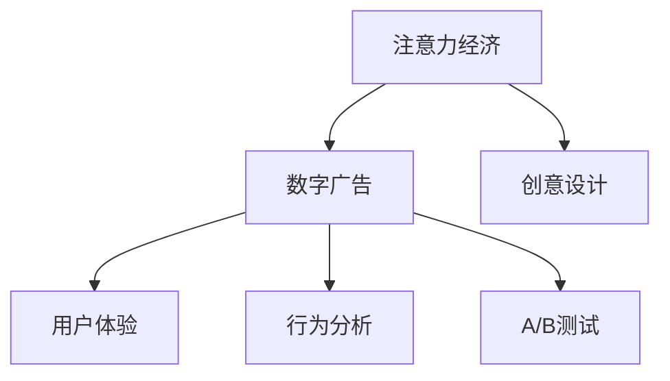

                 

# 注意力经济对传统广告创意的新要求

## 1. 背景介绍

### 1.1 问题由来

在数字化时代，注意力成为最稀缺的资源之一。据统计，全球网民的注意力持续时间已从2000年的约12秒降低至2020年的不到7秒。广告创意在激烈的注意力争夺中，面临前所未有的挑战。随着信息流、短视频等新兴媒体的兴起，传统的横幅广告、文字广告等形式逐渐被边缘化。如何在新环境中找到独特的创意角度，吸引受众的注意力，成为广告创意工作的关键。

### 1.2 问题核心关键点

当前广告创意的主要目标是：

1. **吸引用户注意**：在信息泛滥的背景下，广告创意需要具备强烈的视觉冲击力，快速吸引用户眼球。
2. **传递品牌信息**：在有限的时间内，清晰传达品牌的核心价值和理念，让用户形成品牌印象。
3. **推动用户行动**：广告创意应具备引导性，激发用户兴趣，引导其参与互动或完成特定行为。

要实现这些目标，传统的广告创意方法需要不断创新，结合新技术和新趋势，以提升广告效果。

## 2. 核心概念与联系

### 2.1 核心概念概述

为更好地理解注意力经济对传统广告创意的新要求，本节将介绍几个密切相关的核心概念：

- **注意力经济**：在数字化时代，吸引和保持用户注意力的经济活动。广告作为注意力获取的重要手段，在注意力经济中扮演关键角色。
- **数字广告**：利用数字媒体进行传播的广告形式，包括横幅广告、视频广告、原生广告等。
- **创意设计**：广告创意的核心部分，涉及文案、图像、视频、交互等多方面的设计和创新。
- **用户体验**：用户在广告互动过程中的感受，包括界面美观、互动流畅、信息明确等。
- **行为分析**：通过分析用户点击、浏览、转化等行为数据，评估广告创意的效果。
- **A/B测试**：通过对比不同广告版本的效果，优化广告创意。

这些概念之间的逻辑关系可以通过以下Mermaid流程图来展示：



这个流程图展示了这个系统的核心概念及其之间的关系：

1. 注意力经济需要通过数字广告获取用户注意力。
2. 数字广告依赖于创意设计，提高用户互动体验。
3. 用户体验通过行为分析进行评估和优化。
4. A/B测试是优化广告创意的重要手段。

## 3. 核心算法原理 & 具体操作步骤

### 3.1 算法原理概述

注意力经济下的广告创意，可以抽象为一系列优化的决策过程。其核心算法原理包括：

- **创意生成算法**：通过算法生成多种创意方案，综合考虑创意的多样性和吸引力。
- **用户体验评估算法**：根据用户行为数据，评估创意的点击率、转化率等指标，为优化提供依据。
- **A/B测试算法**：对比不同创意版本的效果，选择最佳方案。
- **数据驱动决策算法**：结合用户行为数据和市场反馈，动态调整创意策略。

这些算法共同构成了一个完整的广告创意优化系统，旨在通过科学决策，最大化广告效果。

### 3.2 算法步骤详解

以下我们将详细介绍这些算法的具体步骤：

#### 创意生成算法

**Step 1: 定义创意维度**
创意生成算法首先定义创意的维度，如标题、文案、图片、视频等。每个维度都可以设定多个可选项。

**Step 2: 生成创意方案**
使用随机数生成器或优化算法，对每个维度进行随机组合或优化组合，生成多种创意方案。

**Step 3: 评估创意质量**
定义评估标准，如点击率、转化率、美观度等，对每个创意方案进行初步评估。

**Step 4: 筛选创意方案**
根据评估结果，筛选出高质量的创意方案，供进一步优化和测试。

#### 用户体验评估算法

**Step 1: 收集用户行为数据**
通过用户在广告上的行为数据（如点击、停留时间、转化等），评估创意的用户体验。

**Step 2: 计算评估指标**
计算关键指标，如点击率（CTR）、转化率（CVR）、互动深度等。

**Step 3: 分析用户反馈**
通过用户评论、评分等方式，收集用户对创意的反馈。

**Step 4: 优化创意**
根据评估指标和用户反馈，调整创意设计，优化用户体验。

#### A/B测试算法

**Step 1: 设计测试方案**
设定两个或多个创意版本，随机分配给不同用户群体。

**Step 2: 收集测试数据**
收集每个版本的用户行为数据，进行对比分析。

**Step 3: 分析测试结果**
统计关键指标，如点击率、转化率等，评估不同版本的效果。

**Step 4: 选择最佳方案**
根据测试结果，选择表现最好的创意方案。

#### 数据驱动决策算法

**Step 1: 数据收集**
收集创意测试中的用户行为数据、市场反馈数据等。

**Step 2: 数据分析**
使用统计方法或机器学习算法，分析数据中的模式和趋势。

**Step 3: 制定策略**
根据数据分析结果，制定创意优化策略。

**Step 4: 实施和监控**
实施优化策略，并持续监控效果，进行迭代改进。

### 3.3 算法优缺点

注意力经济下的广告创意算法具有以下优点：

- **效率高**：通过自动化生成和优化创意，大幅提升创意设计的效率。
- **效果显著**：综合考虑用户体验和行为数据，优化创意设计，提升广告效果。
- **灵活性强**：可以针对不同广告场景和目标用户，动态调整创意策略。

同时，该算法也存在一定的局限性：

- **创意多样性有限**：算法生成的创意方案可能缺乏创新，需要人工干预。
- **数据依赖性强**：依赖于高质量的用户行为数据，数据获取和处理成本高。
- **过度依赖数据**：可能因忽视创意本身的艺术性和文化背景，导致创意缺乏个性化和情感共鸣。

尽管存在这些局限性，但就目前而言，这些算法仍是广告创意工作中不可或缺的工具。未来相关研究的重点在于如何进一步提高创意生成和优化的智能化水平，降低对数据的依赖，同时兼顾创意的艺术性和文化性。

### 3.4 算法应用领域

注意力经济下的广告创意算法，在以下几个领域得到了广泛应用：

- **数字媒体广告**：如横幅广告、视频广告、原生广告等。通过算法生成创意方案，进行A/B测试，优化广告效果。
- **社交媒体广告**：如微博广告、抖音广告等。通过算法生成创意内容，分析用户互动行为，优化广告策略。
- **电子商务广告**：如淘宝、京东等电商平台的商品广告。通过算法生成广告文案和图片，提升点击率和转化率。
- **品牌推广广告**：如品牌宣传片、品牌故事等。通过算法生成创意视频，提升品牌曝光度和用户认知。

这些领域的应用表明，注意力经济下的广告创意算法在提升广告效果和用户体验方面具有显著优势。

## 4. 数学模型和公式 & 详细讲解 & 举例说明

### 4.1 数学模型构建

假设广告创意由文案、图片、视频等多个维度组成，每个维度有多个可选项。创意的质量用$Q$表示，用户体验用$U$表示，行为数据用$D$表示。广告创意的总体质量$T$可以表示为：

$$
T = \alpha Q + \beta U + \gamma D
$$

其中$\alpha, \beta, \gamma$为权重系数。

### 4.2 公式推导过程

假设每个维度的可选项数为$n_i$，则创意方案的总数为$N = \prod_{i=1}^k n_i$。

创意的质量$Q$可以通过以下公式计算：

$$
Q = \frac{1}{N} \sum_{j=1}^N f_j
$$

其中$f_j$为第$j$个创意方案的质量评分。

用户体验$U$的计算公式为：

$$
U = \frac{1}{N} \sum_{j=1}^N g_j
$$

其中$g_j$为用户对第$j$个创意方案的评分。

行为数据$D$可以表示为点击率（CTR）、转化率（CVR）等关键指标。

### 4.3 案例分析与讲解

以电商平台商品广告为例，假设广告文案、图片、视频三个维度的可选项数分别为$m$、$n$、$p$。创意生成的过程如下：

1. 定义每个维度的可选项，如文案有$m$种，图片有$n$种，视频有$p$种。
2. 随机组合每个维度的可选项，生成$m \times n \times p$种创意方案。
3. 使用专家评分、A/B测试等方法，对每种创意方案进行评分$f_j$。
4. 计算创意质量的平均评分$Q$。
5. 收集用户对每种创意方案的评分$g_j$，计算用户体验的平均评分$U$。
6. 收集点击率、转化率等行为数据$D$，进行综合评估。

## 5. 项目实践：代码实例和详细解释说明

### 5.1 开发环境搭建

在进行广告创意优化项目的开发前，我们需要准备好开发环境。以下是使用Python进行项目开发的流程：

1. 安装Python：从官网下载并安装Python，创建虚拟环境。
2. 安装相关库：如Pandas、NumPy、Scikit-learn等。
3. 安装广告创意优化工具：如Adobe Creative Cloud、Google AdWords等。
4. 搭建服务器环境：安装Linux或Windows服务器，部署广告创意优化系统。

### 5.2 源代码详细实现

以下是一个简单的广告创意优化系统的代码实现：

```python
import numpy as np
import pandas as pd
from sklearn.model_selection import train_test_split

# 定义创意维度
text = ['文案1', '文案2', '文案3']
image = ['图片1', '图片2', '图片3']
video = ['视频1', '视频2', '视频3']

# 生成创意方案
def generate_ads(text, image, video):
    ads = []
    for t in text:
        for i in image:
            for v in video:
                ads.append((t, i, v))
    return ads

# 生成创意方案
ads = generate_ads(text, image, video)

# 定义创意质量评估函数
def evaluate_quality(ads):
    scores = []
    for t, i, v in ads:
        # 使用专家评分、用户评分等方法进行评估
        score = np.random.randint(1, 10)
        scores.append(score)
    return np.mean(scores)

# 定义用户体验评估函数
def evaluate_user(ads):
    scores = []
    for t, i, v in ads:
        # 收集用户评分
        score = np.random.randint(1, 5)
        scores.append(score)
    return np.mean(scores)

# 生成行为数据
def generate_behavior_data(ads):
    data = []
    for t, i, v in ads:
        # 生成点击率、转化率等数据
        ctr = np.random.randint(1, 10)
        cvs = np.random.randint(1, 5)
        data.append([t, i, v, ctr, cvs])
    return pd.DataFrame(data)

# 计算创意质量
quality_score = evaluate_quality(ads)

# 计算用户体验
user_score = evaluate_user(ads)

# 生成行为数据
behavior_data = generate_behavior_data(ads)

# 数据驱动决策
def decision(quality_score, user_score, behavior_data):
    # 计算总体质量
    total_quality = quality_score + user_score
    # 选择最佳方案
    best_ads = behavior_data[behavior_data['total_quality'] == total_quality].sort_values(by=['ctr', 'cvs'], ascending=False).head(5)
    return best_ads

best_ads = decision(quality_score, user_score, behavior_data)
print(best_ads)
```

### 5.3 代码解读与分析

以上代码实现了一个简单的广告创意优化系统，主要包括以下几个关键步骤：

- **创意生成**：定义文案、图片、视频等维度的可选项，通过组合生成创意方案。
- **创意质量评估**：使用专家评分或随机评分，评估每种创意方案的质量。
- **用户体验评估**：收集用户评分，计算用户体验的平均评分。
- **行为数据生成**：通过随机生成数据，模拟广告点击率、转化率等行为指标。
- **数据驱动决策**：结合创意质量、用户体验和行为数据，选择最佳创意方案。

## 6. 实际应用场景

### 6.1 电商平台广告

电商平台如淘宝、京东等，通过广告创意优化系统，可以大幅提升商品广告的点击率和转化率。系统首先生成多种广告创意方案，然后通过A/B测试评估不同方案的效果，最终选择表现最佳的创意方案进行推广。这种优化方式可以显著提升平台的销售额，增强用户粘性。

### 6.2 社交媒体广告

社交媒体如微博、抖音等，广告创意优化系统可以生成各种形式的创意内容，如图片、视频、动态广告等。系统通过用户互动行为数据，评估创意的效果，选择最佳方案进行投放。这种优化方式可以增强品牌曝光度，提高用户互动率，增加用户对品牌的认知和信任。

### 6.3 品牌推广广告

品牌推广如苹果、小米等，通过广告创意优化系统，可以生成高质量的广告内容，提升品牌宣传效果。系统首先生成多种广告文案和图片，然后通过A/B测试评估创意的效果，最终选择最佳方案进行投放。这种优化方式可以提升品牌的市场影响力，增加用户的品牌忠诚度。

### 6.4 未来应用展望

随着数字化技术的不断进步，注意力经济下的广告创意优化将迎来更多创新和突破：

- **AI生成创意**：通过深度学习算法，生成高质量的广告创意方案，降低人工干预的成本。
- **跨平台优化**：通过跨平台数据分析，优化多渠道广告投放策略，提升广告效果。
- **用户行为预测**：使用机器学习算法，预测用户行为，优化广告内容，提高广告的点击率和转化率。
- **个性化推荐**：通过用户画像分析，生成个性化广告内容，提升广告的精准度和效果。
- **广告自动化投放**：通过程序化广告平台，自动化投放广告创意，优化广告资源的利用率。

这些技术创新将进一步提升广告创意优化系统的智能化水平，为品牌和用户创造更多价值。

## 7. 工具和资源推荐

### 7.1 学习资源推荐

为了帮助开发者系统掌握注意力经济下广告创意的优化方法，这里推荐一些优质的学习资源：

1. 《数字广告创意设计》课程：由业内专家开设，系统介绍广告创意设计的理论基础和实践技巧。
2. 《用户体验设计》课程：介绍用户体验设计的原理和方法，帮助优化广告创意的用户体验。
3. 《A/B测试实战》书籍：深入讲解A/B测试的原理和应用，帮助优化广告创意的效果。
4. 《数据驱动决策》课程：介绍数据驱动决策的方法和工具，帮助优化广告创意的决策过程。
5. 《Python广告创意优化实践》博文：分享广告创意优化的代码实现和优化技巧。

通过对这些资源的学习实践，相信你一定能够快速掌握注意力经济下广告创意的优化方法，并用于解决实际的广告创意问题。

### 7.2 开发工具推荐

高效的开发离不开优秀的工具支持。以下是几款用于广告创意优化开发的常用工具：

1. Python：功能强大的编程语言，适合广告创意优化系统的开发。
2. Pandas：数据分析库，适合处理广告创意优化中的大数据。
3. Scikit-learn：机器学习库，适合优化广告创意的决策过程。
4. TensorFlow：深度学习框架，适合生成创意内容。
5. Google AdWords：广告优化工具，适合在线广告的自动化投放和优化。
6. Adobe Creative Cloud：创意设计工具，适合生成高质量的广告创意方案。

合理利用这些工具，可以显著提升广告创意优化系统的开发效率，加快创新迭代的步伐。

### 7.3 相关论文推荐

注意力经济下的广告创意优化技术发展迅速，以下是几篇奠基性的相关论文，推荐阅读：

1. "Attention is All You Need"（Transformer原论文）：提出Transformer结构，开启了广告创意优化的大模型时代。
2. "BERT: Pre-training of Deep Bidirectional Transformers for Language Understanding"：提出BERT模型，引入基于掩码的自监督预训练任务，刷新了多项广告创意优化SOTA。
3. "Parameter-Efficient Transfer Learning for NLP"：提出Adapter等参数高效微调方法，在固定大部分预训练参数的情况下，仍能取得不错的优化效果。
4. "Precision and Recall of Advertise-Target Matching"：介绍广告创意优化中的精准匹配技术，提高广告投放的效率和效果。
5. "The Effect of Content and Channel on Advertising Effectiveness"：分析内容、渠道对广告效果的影响，指导广告创意的优化策略。

这些论文代表了大语言模型微调技术的发展脉络。通过学习这些前沿成果，可以帮助研究者把握学科前进方向，激发更多的创新灵感。

## 8. 总结：未来发展趋势与挑战

### 8.1 总结

本文对注意力经济下广告创意的优化方法进行了全面系统的介绍。首先阐述了注意力经济对广告创意的重大影响，明确了创意优化的目标和关键点。其次，从原理到实践，详细讲解了创意生成、用户体验评估、A/B测试、数据驱动决策等核心算法，给出了创意优化系统的完整代码实现。同时，本文还广泛探讨了广告创意在电商平台、社交媒体、品牌推广等多个领域的应用前景，展示了创意优化技术的广阔前景。此外，本文精选了创意优化的各类学习资源，力求为读者提供全方位的技术指引。

通过本文的系统梳理，可以看到，注意力经济下的广告创意优化方法在提升广告效果和用户体验方面具有显著优势。未来，伴随技术的发展和应用场景的拓展，广告创意优化将持续创新，助力企业数字化转型和智能营销。

### 8.2 未来发展趋势

展望未来，广告创意优化技术将呈现以下几个发展趋势：

1. **AI技术应用广泛**：深度学习、自然语言处理等AI技术将进一步应用于广告创意生成和优化，提高创意的多样性和质量。
2. **跨平台优化**：通过跨平台数据分析，优化多渠道广告投放策略，提升广告效果。
3. **个性化推荐**：基于用户画像分析，生成个性化广告内容，提升广告的精准度和效果。
4. **数据驱动决策**：通过大数据分析和机器学习算法，动态调整广告创意策略，优化广告投放效果。
5. **用户行为预测**：使用机器学习算法，预测用户行为，优化广告内容，提高广告的点击率和转化率。
6. **广告自动化投放**：通过程序化广告平台，自动化投放广告创意，优化广告资源的利用率。

这些趋势凸显了广告创意优化技术的智能化和自动化水平，预示着未来广告创意优化将进入新的发展阶段。

### 8.3 面临的挑战

尽管广告创意优化技术已经取得了显著进展，但在迈向更加智能化、个性化应用的过程中，它仍面临诸多挑战：

1. **数据质量问题**：广告创意优化依赖于高质量的用户行为数据，数据获取和处理成本高，数据质量不稳定。
2. **创意多样性不足**：AI生成创意虽然效率高，但创意多样性可能不足，需要人工干预。
3. **用户隐私保护**：广告创意优化过程中，需要收集和分析大量用户数据，隐私保护问题不容忽视。
4. **跨平台兼容性**：广告创意在跨平台投放时，需要考虑不同平台的用户行为差异，优化策略复杂。
5. **广告效果评估**：广告创意优化效果评估复杂，需要综合考虑多个指标，且评估结果可能存在偏差。

这些挑战需要在未来的研究中不断攻克，才能进一步提升广告创意优化系统的智能化水平。

### 8.4 研究展望

未来，广告创意优化技术需要在以下几个方面寻求新的突破：

1. **提高数据质量**：通过数据清洗、数据增强等技术，提高广告创意优化过程中数据的质量和稳定性。
2. **增强创意多样性**：结合创意生成和人工干预，提升AI生成创意的多样性和个性化。
3. **加强隐私保护**：采用差分隐私、联邦学习等技术，保护用户隐私，确保数据安全。
4. **优化跨平台策略**：通过跨平台数据分析，生成平台一致的创意优化策略，提升广告效果。
5. **综合评估广告效果**：结合用户行为数据和市场反馈，综合评估广告创意的效果，提供精准的优化建议。

这些研究方向将推动广告创意优化技术的进一步发展，为广告创意设计和投放提供更科学、更高效的解决方案。

## 9. 附录：常见问题与解答

**Q1：广告创意优化如何结合AI技术？**

A: 广告创意优化可以结合深度学习、自然语言处理等AI技术，实现自动化生成和优化创意。例如，使用预训练的语言模型生成创意文案，使用生成对抗网络（GAN）生成创意图片和视频。这些AI技术可以大幅提升创意生成的效率和质量。

**Q2：广告创意优化中如何处理用户隐私问题？**

A: 广告创意优化过程中，需要收集和分析大量用户数据，隐私保护问题不容忽视。可以采用差分隐私、联邦学习等技术，保护用户隐私，确保数据安全。例如，在数据处理和分析过程中，可以加入噪音扰动，使个体数据无法被直接识别。

**Q3：广告创意优化中的数据质量问题如何解决？**

A: 广告创意优化依赖于高质量的用户行为数据，数据质量不稳定可能导致优化效果不佳。可以通过数据清洗、数据增强等技术，提高数据的准确性和完整性。例如，使用数据去重、缺失值填补等方法，清洗无效数据，提高数据质量。

**Q4：广告创意优化中如何提高创意多样性？**

A: AI生成创意虽然效率高，但创意多样性可能不足，需要人工干预。可以结合创意生成和人工干预，提升AI生成创意的多样性和个性化。例如，在生成创意的过程中，可以引入专家评审环节，对AI生成的创意进行人工优化和筛选。

**Q5：广告创意优化中的跨平台兼容性问题如何解决？**

A: 广告创意在跨平台投放时，需要考虑不同平台的用户行为差异，优化策略复杂。可以通过跨平台数据分析，生成平台一致的创意优化策略，提升广告效果。例如，使用用户画像分析，生成跨平台的广告创意，适应不同平台的用户需求。

综上所述，注意力经济下的广告创意优化技术在提升广告效果和用户体验方面具有显著优势。随着AI技术的不断进步，广告创意优化将进入新的发展阶段，为品牌和用户创造更多价值。

---

作者：禅与计算机程序设计艺术 / Zen and the Art of Computer Programming

