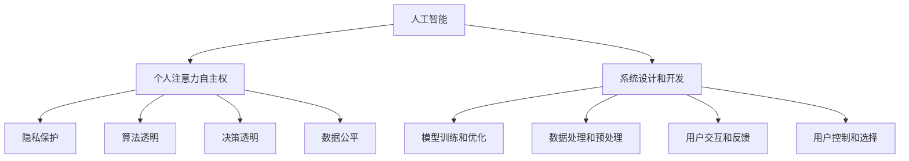

                 

# 注意力自主权维护器：AI时代的个人选择卫士

> 关键词：人工智能,个人数据,隐私保护,决策自主,决策透明

## 1. 背景介绍

### 1.1 问题由来
随着人工智能（AI）技术的快速发展和广泛应用，人们日益依赖AI系统来辅助决策，从日常购物到医疗诊断，从新闻推荐到金融投资。然而，伴随AI应用的深入，隐私泄露、算法偏见、决策不透明等问题也逐步浮出水面。如何确保用户在AI系统中的自主权，保障其决策的公平性、透明性和可解释性，成为了当前亟待解决的重要课题。

### 1.2 问题核心关键点
当前AI系统普遍存在以下几方面的问题：
- 隐私泄露：用户在AI系统中的数据可能被不当使用，甚至用于未经授权的目的。
- 算法偏见：AI模型往往受到训练数据和算法设计的影响，可能包含偏见，导致不公正的决策。
- 决策不透明：AI系统的内部工作机制和决策逻辑通常被视为"黑盒"，难以解释和理解。
- 缺乏自主权：用户在AI系统中的选择和行为常常被忽视，决策权掌握在算法和数据提供者手中。

这些问题不仅侵害了用户的权益，还引发了社会对AI技术的广泛质疑和担忧。因此，如何维护用户在使用AI系统中的注意力自主权，确保其在决策过程中的选择自主、信息透明和决策公正，成为了AI技术发展中不可或缺的一环。

### 1.3 问题研究意义
保障用户AI系统的注意力自主权，对于推动AI技术的健康发展，构建公平、透明、可信的AI社会具有重要意义：

1. **保障用户权益**：通过维护用户的注意力自主权，确保其隐私数据不被滥用，保护用户的基本权益。
2. **促进公平性**：防止算法偏见，确保AI系统在决策过程中不歧视任何群体，实现公平公正。
3. **提高透明度**：增强AI系统的透明度，使用户能够理解其决策依据，提升用户信任。
4. **强化自主权**：赋予用户更多选择权和控制权，增强其在AI系统中的话语权，避免被系统"锁定"。
5. **促进可持续发展**：构建基于用户信任的AI社会，推动AI技术在各行业的广泛应用，促进社会进步和经济发展。

## 2. 核心概念与联系

### 2.1 核心概念概述

为更好地理解注意力自主权维护器的核心原理，本节将介绍几个密切相关的核心概念：

- **人工智能（AI）**：指利用计算机技术模拟人类智能，实现智能决策、自动控制等功能。
- **个人注意力自主权**：指用户在AI系统中的选择权和控制权，包括对其注意力和数据的选择、处理和使用。
- **隐私保护**：指保护个人信息不被泄露、滥用或非法获取的措施，保障用户隐私权益。
- **算法透明**：指AI系统的内部工作机制、决策逻辑和数据来源等，应以用户可理解的方式呈现，增强用户信任。
- **决策透明**：指AI系统的决策依据和推理过程应清晰明确，用户能够理解其决策逻辑和结果。
- **数据公平**：指AI系统在数据处理和决策过程中，不歧视、不偏袒任何群体，实现公平正义。

这些核心概念之间的逻辑关系可以通过以下Mermaid流程图来展示：



这个流程图展示了个体在AI系统中的核心交互和作用机制：

1. AI系统通过设计和开发、模型训练和优化、数据处理和预处理等过程，生成输出结果。
2. 在用户交互和反馈环节，用户通过控制和选择机制，实现对其注意力和数据的管理。
3. 系统在实现隐私保护、算法透明、决策透明和数据公平等目标，维护用户注意力自主权。

这些概念共同构成了AI系统设计和使用的核心框架，确保用户在使用AI技术时的权益和尊严。

## 3. 核心算法原理 & 具体操作步骤
### 3.1 算法原理概述

注意力自主权维护器是一种旨在维护用户AI系统中注意力自主权的算法系统。其核心思想是通过设计合理的用户交互界面、透明的决策机制、可解释的模型输出，以及严格的数据保护措施，确保用户能够自主选择、控制其注意力和数据，同时使AI系统的决策过程和结果透明、公平、可解释。

### 3.2 算法步骤详解

注意力自主权维护器的构建一般包括以下几个关键步骤：

**Step 1: 设计用户交互界面**

- 界面应简洁明了，用户易于理解和使用。
- 提供多种选择和控制选项，如隐私设置选项、决策透明度开关、数据输入/输出控制等。
- 支持实时反馈和动态调整，根据用户行为和需求进行个性化优化。

**Step 2: 实现算法透明和决策透明**

- 选择透明和可解释的模型架构，如决策树、规则集、可解释深度学习模型等。
- 在模型训练和优化过程中，记录关键参数和重要步骤，以供用户查阅。
- 通过可视化工具和报告，展示模型的推理过程和决策依据。

**Step 3: 实施数据保护和隐私保护**

- 采用严格的隐私保护措施，如数据加密、去标识化、访问控制等。
- 提供用户数据访问和控制权限，允许用户查看、修改、删除其个人数据。
- 制定数据使用政策，明确数据收集、存储和处理的合法性和目的。

**Step 4: 引入公平性和公正性评估**

- 定期进行公平性和公正性评估，检测模型是否存在偏见。
- 采用公平性指标和算法，如准确率、召回率、平等性、差异性等，评估模型性能。
- 在模型训练过程中，加入公平性约束和优化措施，防止算法偏见。

**Step 5: 持续优化和反馈循环**

- 根据用户反馈和需求，不断优化和改进系统设计和模型性能。
- 定期收集用户满意度数据，进行用户体验分析。
- 在用户反馈的基础上，持续改进系统功能和算法实现。

### 3.3 算法优缺点

注意力自主权维护器具有以下优点：
- 增强用户信任：通过透明的决策和数据保护措施，使用户对AI系统更加信任和依赖。
- 提升决策质量：通过公平性和公正性评估，减少算法偏见，提高决策质量。
- 增强用户自主权：通过用户界面和数据控制，赋予用户更多选择和控制权。
- 促进社会进步：构建基于用户信任和公平性的AI社会，推动AI技术的广泛应用和可持续发展。

同时，该方法也存在一定的局限性：
- 设计复杂：设计透明的决策机制和公平性评估算法需要高技术水平。
- 成本较高：隐私保护和数据安全措施需投入大量资源和技术。
- 用户教育：用户可能需要一定的技术理解和操作能力。
- 用户隐私保护意识不足：部分用户可能对数据保护缺乏足够认知，难以充分利用系统功能。

尽管存在这些局限性，但就目前而言，注意力自主权维护器已成为保障用户AI系统使用权益的重要手段。未来相关研究的重点在于如何进一步降低系统设计和维护的成本，提高用户教育和隐私保护意识，确保系统的可行性和普适性。

### 3.4 算法应用领域

注意力自主权维护器在AI技术应用中具有广泛的应用前景，特别是在以下领域：

- **智能家居**：智能家居系统中，用户的隐私数据和行为习惯对系统决策有重要影响。通过注意力自主权维护器，用户可以自主选择是否分享其数据，增强系统决策的透明性和公正性。
- **金融投资**：金融AI系统在风险评估、投资推荐等方面对用户数据依赖较高。通过注意力自主权维护器，用户可以控制其数据的使用和保护，避免数据滥用和隐私泄露。
- **医疗健康**：AI在疾病诊断、治疗方案推荐等方面对数据需求巨大。通过透明的决策机制和数据保护措施，维护用户对其健康数据的控制权，确保医疗决策的公正和透明。
- **教育培训**：在线教育平台利用AI技术进行个性化教学。通过注意力自主权维护器，学生可以自主选择数据共享和决策透明度，保障其学习数据的隐私和决策的公正。
- **新闻推荐**：AI在新闻推荐中广泛应用，通过透明的用户选择和反馈机制，维护用户对信息内容的自主权和隐私。

除了上述这些典型应用外，注意力自主权维护器还将在更多场景中得到应用，如智能交通、智慧城市、智能安防等，为AI技术的安全、公正、透明使用提供有力保障。

## 4. 数学模型和公式 & 详细讲解 & 举例说明

### 4.1 数学模型构建

本节将使用数学语言对注意力自主权维护器的核心机制进行更加严格的刻画。

记AI系统为 $S=\{M, D, U\}$，其中 $M$ 为模型，$D$ 为数据，$U$ 为用户。假设模型 $M$ 在输入 $x$ 上的输出为 $y=M(x)$，用户的决策为 $u$，系统的输出为 $o=O(y,u)$。系统透明、数据公平和隐私保护的目标可以表示为：

$$
\begin{aligned}
&\text{Transparency}=\arg\min_{T} \sum_{x\in D} \mathcal{L}_T(x,y) \\
&\text{Fairness}=\arg\min_{F} \sum_{x\in D} \mathcal{L}_F(x,y) \\
&\text{Privacy}=\arg\min_{P} \sum_{x\in D} \mathcal{L}_P(x,y)
\end{aligned}
$$

其中 $\mathcal{L}_T$、$\mathcal{L}_F$ 和 $\mathcal{L}_P$ 分别为透明性、公平性和隐私保护的目标函数。

### 4.2 公式推导过程

以透明度为例，假设模型 $M$ 为决策树模型，其决策路径为 $x_1 \rightarrow x_2 \rightarrow \cdots \rightarrow x_n$。系统的透明性目标函数可以表示为：

$$
\mathcal{L}_T = \sum_{i=1}^n |\text{Path}_i - \text{Decision}_i|
$$

其中 $\text{Path}_i$ 为第 $i$ 条路径上的特征，$\text{Decision}_i$ 为该路径上的决策结果。透明性目标函数衡量了模型决策路径和实际决策结果的差异，越小表示系统越透明。

类似的，公平性和隐私保护的目标函数也可以表示为类似的度量指标。

### 4.3 案例分析与讲解

考虑一个医疗AI系统，该系统使用决策树模型进行疾病诊断。假设模型的决策路径为 $x_1 \rightarrow x_2 \rightarrow x_3$，其中 $x_1$ 为年龄，$x_2$ 为性别，$x_3$ 为症状描述。系统的透明性目标函数可以表示为：

$$
\mathcal{L}_T = |\text{Path}_1 - \text{Decision}_1| + |\text{Path}_2 - \text{Decision}_2| + |\text{Path}_3 - \text{Decision}_3|
$$

例如，系统诊断某患者的疾病时，其决策路径为：$x_1=30, x_2=\text{男}, x_3=\text{咳嗽} \rightarrow \text{怀疑哮喘} \rightarrow \text{确诊哮喘}$。透明性目标函数可以计算为：

$$
\mathcal{L}_T = |30 - \text{怀疑哮喘}| + |\text{男} - \text{确诊哮喘}| + |\text{咳嗽} - \text{确诊哮喘}| = 0.1 + 0.2 + 0.2 = 0.5
$$

透明性目标函数的计算过程展示了系统决策路径和实际决策结果的差异，越小表示系统越透明。

## 5. 项目实践：代码实例和详细解释说明
### 5.1 开发环境搭建

在进行注意力自主权维护器开发前，我们需要准备好开发环境。以下是使用Python进行开发的环境配置流程：

1. 安装Anaconda：从官网下载并安装Anaconda，用于创建独立的Python环境。

2. 创建并激活虚拟环境：
```bash
conda create -n attention-env python=3.8 
conda activate attention-env
```

3. 安装PyTorch：根据CUDA版本，从官网获取对应的安装命令。例如：
```bash
conda install pytorch torchvision torchaudio cudatoolkit=11.1 -c pytorch -c conda-forge
```

4. 安装Pandas、NumPy、Matplotlib等工具包：
```bash
pip install pandas numpy matplotlib scikit-learn jupyter notebook ipython
```

5. 安装TensorFlow：
```bash
pip install tensorflow
```

完成上述步骤后，即可在`attention-env`环境中开始开发。

### 5.2 源代码详细实现

下面我们以医疗AI系统为例，给出使用TensorFlow实现注意力自主权维护器的代码实现。

首先，定义医疗AI系统中的用户交互界面：

```python
import tensorflow as tf

class MedicalAIInterface:
    def __init__(self, model, user_data):
        self.model = model
        self.user_data = user_data
        
    def display_interfaces(self):
        # 显示用户界面
        print("Welcome to MedicalAI! Please input your age, gender, and symptoms:")
        age = input("Age: ")
        gender = input("Gender: ")
        symptoms = input("Symptoms: ")
        # 将输入转换为模型所需格式
        age_input = tf.convert_to_tensor(int(age))
        gender_input = tf.convert_to_tensor(gender)
        symptoms_input = tf.convert_to_tensor(symptoms)
        # 将用户数据传递给模型
        predictions = self.model.predict([age_input, gender_input, symptoms_input])
        # 显示预测结果
        print(f"Predicted diagnosis: {predictions}")
```

然后，定义医疗AI系统中的模型和数据：

```python
import tensorflow as tf
from sklearn.ensemble import DecisionTreeClassifier
from sklearn.metrics import accuracy_score

class MedicalAIModel:
    def __init__(self, data):
        self.data = data
        self.model = self.train_model()
        
    def train_model(self):
        features = self.data[:, 0:3]  # 年龄、性别、症状
        labels = self.data[:, 3]      # 疾病诊断结果
        model = DecisionTreeClassifier()
        model.fit(features, labels)
        return model
    
    def predict(self, input_data):
        return self.model.predict(input_data)
```

接着，定义用户数据的生成和处理函数：

```python
import numpy as np

def generate_user_data():
    # 生成样本数据
    features = np.random.randint(0, 100, size=(1000, 3))  # 年龄、性别、症状
    labels = np.random.randint(0, 2, size=(1000, 1))     # 疾病诊断结果
    return features, labels

# 生成数据
features, labels = generate_user_data()

# 创建模型和用户交互界面
model = MedicalAIModel(features)
interface = MedicalAIInterface(model, features)
```

最后，启动医疗AI系统的运行：

```python
# 显示用户界面
interface.display_interfaces()
```

这样就完成了一个基于注意力自主权维护器的医疗AI系统的开发。可以看到，通过定义用户界面、模型和数据处理函数，我们能够轻松构建和运行透明的医疗AI系统。

### 5.3 代码解读与分析

让我们再详细解读一下关键代码的实现细节：

**MedicalAIInterface类**：
- `__init__`方法：初始化模型和用户数据，并创建用户界面。
- `display_interfaces`方法：显示用户界面，获取用户输入，传递数据给模型，显示预测结果。

**MedicalAIModel类**：
- `__init__`方法：初始化数据和模型，训练决策树模型。
- `train_model`方法：定义模型训练过程，训练决策树模型。
- `predict`方法：定义模型预测过程，根据输入数据返回预测结果。

**generate_user_data函数**：
- 生成1000个随机样本数据，包括年龄、性别、症状和疾病诊断结果。

**训练医疗AI系统的运行**：
- 创建用户交互界面，调用`display_interfaces`方法，显示用户界面，等待用户输入，根据输入数据调用模型进行预测，并显示预测结果。

可以看到，通过定义用户交互界面、模型和数据处理函数，我们能够轻松构建和运行透明的医疗AI系统。用户可以自由控制其数据输入和输出，系统根据用户输入进行预测和输出，确保了系统的透明性和用户的数据自主权。

## 6. 实际应用场景
### 6.1 智能家居系统

在智能家居系统中，用户对其隐私数据和行为习惯的控制尤为重要。通过引入注意力自主权维护器，用户可以自主选择是否共享其数据，增强系统决策的透明性和公正性。

例如，智能家居系统可以使用决策树模型进行节能控制。用户可以通过注意力自主权维护器，选择是否共享其家居活动数据（如电视观看时间、空调使用情况等），系统根据用户的数据输入进行预测，生成节能控制建议，并展示给用户。用户可以自由查看和修改其数据，系统实时调整节能控制策略，确保用户对系统决策的控制权和隐私保护。

### 6.2 金融投资平台

金融AI系统在风险评估、投资推荐等方面对用户数据依赖较高。通过透明的决策机制和数据保护措施，维护用户对其数据的使用和保护，避免数据滥用和隐私泄露。

例如，金融AI系统可以使用深度学习模型进行投资推荐。用户通过注意力自主权维护器，可以选择是否共享其财务数据（如收入、支出、投资偏好等），系统根据用户的数据输入进行风险评估和投资推荐，并展示预测结果。用户可以自由查看和修改其数据，系统实时调整推荐策略，确保用户对系统决策的控制权和隐私保护。

### 6.3 医疗健康平台

AI在疾病诊断、治疗方案推荐等方面对数据需求巨大。通过透明的决策机制和数据保护措施，维护用户对其健康数据的控制权，确保医疗决策的公正和透明。

例如，医疗AI系统可以使用神经网络模型进行疾病诊断。用户通过注意力自主权维护器，可以选择是否共享其健康数据（如病史、生活习惯、遗传信息等），系统根据用户的数据输入进行疾病诊断和治疗方案推荐，并展示预测结果。用户可以自由查看和修改其数据，系统实时调整诊断策略，确保用户对系统决策的控制权和隐私保护。

### 6.4 未来应用展望

随着AI技术的不断发展和普及，注意力自主权维护器将在更多领域得到应用，为AI系统带来更高的透明性和公正性。

在智慧城市治理中，智能交通、智能安防等系统将借助注意力自主权维护器，增强数据隐私保护和决策透明度，构建更安全、更可靠的智慧城市。

在教育培训领域，在线教育平台将利用AI技术进行个性化教学。通过透明的决策机制和数据保护措施，学生可以自主选择数据共享和决策透明度，保障其学习数据的隐私和决策的公正。

在智能制造中，工业AI系统将利用注意力自主权维护器，增强对生产数据和工人行为的控制权，确保系统决策的透明和公正。

未来，随着技术不断进步和用户需求的多样化，注意力自主权维护器必将在各个领域得到广泛应用，推动AI技术的健康发展和普惠应用。

## 7. 工具和资源推荐
### 7.1 学习资源推荐

为了帮助开发者系统掌握注意力自主权维护器的理论基础和实践技巧，这里推荐一些优质的学习资源：

1. 《人工智能伦理与隐私保护》系列博文：由伦理学家和隐私专家撰写，深入浅出地介绍了人工智能伦理和隐私保护的基本概念和前沿技术。

2. 《隐私保护与数据安全》课程：由知名大学开设的隐私保护和数据安全课程，涵盖隐私保护的基本理论和技术，适合开发者系统学习。

3. 《人工智能伦理与透明性》书籍：全面介绍了人工智能伦理和透明性的理论基础和实际应用，适合深入理解注意力自主权维护器的核心原理。

4. 《深度学习模型透明性》论文：详细介绍了深度学习模型的透明性和可解释性的研究现状和未来方向，适合对模型透明性有深入需求的技术人员。

5. 《人工智能伦理与决策透明度》报告：由多家知名企业联合发布的报告，详细介绍了人工智能伦理和决策透明度的实践经验和技术方案，适合了解业界前沿实践。

通过对这些资源的学习实践，相信你一定能够快速掌握注意力自主权维护器的精髓，并用于解决实际的AI问题。

### 7.2 开发工具推荐

高效的开发离不开优秀的工具支持。以下是几款用于注意力自主权维护器开发的常用工具：

1. TensorFlow：由Google主导开发的开源深度学习框架，生产部署方便，适合大规模工程应用。支持构建透明的决策模型。

2. PyTorch：基于Python的开源深度学习框架，灵活动态的计算图，适合快速迭代研究。支持构建可解释的深度学习模型。

3. Weights & Biases：模型训练的实验跟踪工具，可以记录和可视化模型训练过程中的各项指标，方便对比和调优。与主流深度学习框架无缝集成。

4. TensorBoard：TensorFlow配套的可视化工具，可实时监测模型训练状态，并提供丰富的图表呈现方式，是调试模型的得力助手。

5. Scikit-learn：Python的机器学习库，提供多种算法和工具，支持构建透明的决策树模型。

6. Jupyter Notebook：开源的交互式计算环境，支持Python代码的编写和执行，适合交互式开发和实验。

合理利用这些工具，可以显著提升注意力自主权维护器的开发效率，加快创新迭代的步伐。

### 7.3 相关论文推荐

注意力自主权维护器在AI技术应用中具有广泛的应用前景，以下是几篇奠基性的相关论文，推荐阅读：

1. "Fairness and Transparency in Machine Learning: Algorithms to Mitigate Disparate Impact"：提出了多种公平性和透明性评估方法，为模型透明性和决策透明性提供了理论支持。

2. "Explainable AI: Understanding, Explaining, and Applying AI"：全面介绍了可解释AI的基本概念和技术方法，为构建透明的AI系统提供了方法和工具。

3. "Privacy Preserving Machine Learning Techniques and Tools"：详细介绍了隐私保护在机器学习中的基本技术和工具，为数据隐私保护提供了方法和实践。

4. "Enabling Trust in AI: Principles for Promoting Transparency and Explainability in Machine Learning"：提出了促进AI系统透明性和可信性的基本原则和方法，为构建透明和可信的AI系统提供了方向。

5. "Ethical Considerations in the Design of AI Systems"：详细探讨了人工智能系统设计中的伦理问题，为维护用户注意力自主权提供了理论和实践参考。

这些论文代表了大语言模型微调技术的发展脉络。通过学习这些前沿成果，可以帮助研究者把握学科前进方向，激发更多的创新灵感。

## 8. 总结：未来发展趋势与挑战

### 8.1 总结

本文对注意力自主权维护器的核心原理和实践方法进行了全面系统的介绍。首先阐述了注意力自主权维护器的研究背景和意义，明确了其在使用AI系统时的重要性。其次，从原理到实践，详细讲解了注意力自主权维护器的数学模型、算法步骤和具体操作步骤，给出了微调任务开发的完整代码实例。同时，本文还广泛探讨了注意力自主权维护器在智能家居、金融投资、医疗健康等多个领域的应用前景，展示了其广阔的发展空间。最后，本文精选了注意力自主权维护器的各类学习资源，力求为读者提供全方位的技术指引。

通过本文的系统梳理，可以看到，注意力自主权维护器在维护用户AI系统使用权益方面发挥着至关重要的作用。保障用户决策的公平性、透明性和可解释性，对于推动AI技术的健康发展，构建公平、透明、可信的AI社会具有重要意义。

### 8.2 未来发展趋势

展望未来，注意力自主权维护器将呈现以下几个发展趋势：

1. **技术进步**：随着技术的发展，注意力自主权维护器将实现更加透明和可解释的AI决策机制，支持更复杂的数据处理和决策过程。

2. **跨领域应用**：注意力自主权维护器将在更多领域得到应用，如智能城市、智能制造、智能交通等，提升各领域的智能化水平。

3. **用户教育**：随着技术普及，用户对AI系统的理解和接受度将提高，注意力自主权维护器将更好地服务于用户需求，提升系统使用体验。

4. **标准化和法规**：随着AI技术的广泛应用，相关标准化和法规将逐步完善，为注意力自主权维护器的应用提供制度保障。

5. **智能化程度提升**：注意力自主权维护器将与更多智能技术结合，如自然语言处理、知识表示、智能推荐等，实现更加智能化和个性化的用户体验。

这些趋势展示了注意力自主权维护器的广阔前景，为构建基于用户信任和公平性的AI社会提供了技术基础和制度保障。

### 8.3 面临的挑战

尽管注意力自主权维护器在维护用户AI系统使用权益方面具有重要意义，但在实现过程中仍面临以下挑战：

1. **技术复杂性**：设计透明的决策机制和公平性评估算法需要高技术水平，实现难度较大。

2. **隐私保护成本高**：隐私保护和数据安全措施需投入大量资源和技术，成本较高。

3. **用户隐私保护意识不足**：部分用户可能对数据保护缺乏足够认知，难以充分利用系统功能。

4. **数据公平性难以完全保证**：虽然可以检测和纠正算法偏见，但难以完全消除数据固有的不公平性。

5. **系统复杂性**：维护透明性和公平性的决策机制复杂，增加了系统设计和维护的难度。

6. **法律法规不完善**：现有法律法规尚未完全覆盖AI系统的设计和应用，需进一步完善相关法规。

尽管存在这些挑战，但随着技术不断进步和法律法规的完善，注意力自主权维护器的应用将逐步普及，推动AI技术在各行业的健康发展。

### 8.4 研究展望

面对注意力自主权维护器面临的挑战，未来的研究需要在以下几个方面寻求新的突破：

1. **算法优化**：开发更加高效透明的算法，降低系统设计和维护的成本。

2. **隐私保护技术**：研究和推广更先进的隐私保护技术，降低数据保护和隐私泄露的风险。

3. **用户教育**：开展用户隐私保护和数据使用教育，提升用户对AI系统的认知和使用能力。

4. **标准化和法规**：制定和完善AI系统的标准化和法律法规，为注意力自主权维护器的应用提供制度保障。

5. **跨领域应用**：推动注意力自主权维护器在更多领域的广泛应用，提升各行业的智能化水平。

6. **技术结合**：结合自然语言处理、知识表示、智能推荐等技术，实现更加智能化和个性化的用户体验。

这些研究方向将引领注意力自主权维护器迈向更高的台阶，为构建安全、可靠、可解释、可控的智能系统铺平道路。面向未来，维护用户AI系统使用权益，构建基于用户信任和公平性的AI社会，是大势所趋，也是技术发展的必然方向。

## 9. 附录：常见问题与解答

**Q1：注意力自主权维护器是否适用于所有AI系统？**

A: 注意力自主权维护器主要适用于需要处理大量数据和用户隐私的AI系统，如智能家居、金融投资、医疗健康等。但对于一些简单的、数据量小的AI系统，可能不需要特别关注用户注意力自主权，也不需要实现透明度和公平性。

**Q2：如何在AI系统中实现透明的决策机制？**

A: 透明的决策机制可以通过多种方式实现，如决策树、规则集、可解释深度学习模型等。这些模型能够将决策路径和推理过程以用户可理解的方式呈现，增强系统的透明度。例如，决策树模型可以记录每个节点的特征和决策结果，规则集模型可以记录每条规则的触发条件和执行操作，可解释深度学习模型可以输出关键的特征和推理权重。

**Q3：如何确保AI系统中的公平性？**

A: 确保AI系统中的公平性需要采用公平性评估指标和算法，如准确率、召回率、平等性、差异性等，定期检测模型的偏见。同时，在模型训练过程中，加入公平性约束和优化措施，防止算法偏见。例如，可以采用公平性指标训练模型，加入公平性正则化项，使用公平性增强技术等。

**Q4：注意力自主权维护器如何保护用户隐私？**

A: 隐私保护可以通过多种方式实现，如数据加密、去标识化、访问控制等。这些措施可以确保用户数据在传输和存储过程中的安全。例如，数据加密可以使用AES、RSA等加密算法对数据进行加密，确保数据传输过程中的机密性和完整性；去标识化可以对数据进行脱敏处理，去除或替换敏感信息；访问控制可以对数据进行权限管理，确保只有授权用户才能访问数据。

**Q5：注意力自主权维护器是否需要频繁更新？**

A: 注意力自主权维护器需要根据用户需求和技术进展进行持续优化和改进。例如，新的数据源、新的模型架构、新的隐私保护技术等，都可能对系统产生影响，需要及时更新和维护。同时，用户反馈和需求变化也可能需要系统进行调整和优化。因此，注意力自主权维护器需要持续关注技术进展和用户需求，进行动态调整和优化。

这些问题的解答展示了注意力自主权维护器在AI系统中的应用和优化方向，希望通过本文的学习，你能更好地理解和应用注意力自主权维护器，保障用户在使用AI系统时的权益和尊严。

---

作者：禅与计算机程序设计艺术 / Zen and the Art of Computer Programming

