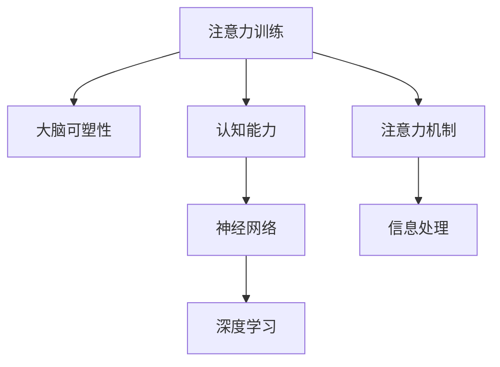

                 

# 注意力训练与大脑可塑性：通过专注力增强认知能力

> 关键词：注意力训练,大脑可塑性,认知能力,神经网络,深度学习,计算机程序设计,人工智能

## 1. 背景介绍

### 1.1 问题由来

在当今信息爆炸的时代，人们的注意力资源日益稀缺。如何在海量信息中快速锁定关键点，并高效处理信息，成为现代生活和工作的重要能力。这一能力不仅仅关乎学习效率和工作表现，更涉及日常生活中的许多方面。例如，如何阅读理解一篇长文，如何跟踪一场体育赛事，如何进行一场高效的会议等。

这些任务背后都离不开注意力的高效运用。然而，注意力并非天生，而是一种可训练的技能。科学研究表明，通过有针对性的训练，人们可以显著提升注意力水平，从而提高认知能力。这种训练方式不仅适用于儿童，也同样适用于成人。

### 1.2 问题核心关键点

- **注意力**：是指对特定刺激物的专注程度。人类大脑通过注意力机制，筛选出与当前任务最相关的信息，从而实现高效的信息处理。
- **大脑可塑性**：指大脑在学习和训练过程中，通过神经元之间连接强度的变化，实现功能上的适应性改变。
- **认知能力**：包括记忆力、理解力、推理力、注意力、解决问题能力等。注意力的提升将直接促进其他认知能力的增强。
- **神经网络**：现代深度学习模型的基础架构，通过多层神经元之间的连接，模拟大脑神经网络的工作机制。
- **注意力机制**：在深度学习中，特别适用于图像、自然语言等复杂任务的处理。注意力机制帮助模型关注数据中的重要部分，从而提高模型的效率和准确性。
- **深度学习**：通过多层非线性神经网络进行训练，具备强大的数据建模和预测能力。

### 1.3 问题研究意义

研究注意力训练方法，对于提升现代人的认知能力、工作效能、学习效果等方面具有重要意义：

1. **提高学习效率**：通过注意力训练，学生可以更快地掌握知识点，理解复杂概念。
2. **提升工作表现**：职场人士能够更高效地处理工作任务，提升团队协作和项目管理能力。
3. **改善生活品质**：注意力训练有助于提高生活中的专注力和决策力，减少分心和拖延。
4. **推动社会进步**：注意力训练在教育、医疗、军事、娱乐等多个领域具有广泛应用前景。
5. **促进心理健康**：改善注意力水平，有助于缓解焦虑、抑郁等情绪问题，提高心理健康水平。

## 2. 核心概念与联系

### 2.1 核心概念概述

为了更好地理解注意力训练与大脑可塑性的关系，本节将介绍几个关键概念及其相互联系：

- **注意力训练**：通过一系列有针对性的练习和游戏，帮助大脑提升注意力水平。
- **大脑可塑性**：指大脑通过学习和训练，实现神经网络结构的改变和功能的增强。
- **认知能力**：指个体通过大脑的神经网络处理信息的能力。
- **神经网络**：由节点和边组成的计算图，用于模拟大脑的神经元连接和信息传递。
- **深度学习**：一种基于神经网络的机器学习方法，用于解决复杂的数据处理问题。

这些概念之间的逻辑关系可以通过以下Mermaid流程图来展示：



这个流程图展示了大语言模型的核心概念及其之间的关系：

1. 注意力训练通过一系列练习，提升大脑对特定信息的专注能力。
2. 大脑通过可塑性机制，根据注意力训练的结果，调整神经网络的结构和连接强度。
3. 认知能力通过神经网络的训练和调整，得到进一步的增强。
4. 深度学习利用神经网络的注意力机制，进行高效的信息处理和预测。

## 3. 核心算法原理 & 具体操作步骤
### 3.1 算法原理概述

注意力训练的基本原理是通过有针对性的练习，逐步提升大脑的注意力水平。这种训练方法的核心在于重复和专注，通过持续的重复练习，帮助大脑建立稳定的注意力机制。

注意力训练的算法可以分为两大类：

1. **注意力集中训练**：通过专注力练习，提升大脑对特定信息的长时间保持能力。
2. **注意力分配训练**：通过多任务切换练习，提升大脑对不同任务的快速切换能力。

### 3.2 算法步骤详解

#### 3.2.1 注意力集中训练

**Step 1: 选择训练任务**

注意力集中训练的任务应具有高度重复性和单一性，以帮助大脑建立长时间的专注能力。例如，阅读短文、计数、绘画等。

**Step 2: 设定训练时间**

每次训练时间应控制在15-30分钟，避免过长时间的疲劳和分心。

**Step 3: 反复练习**

重复进行所选任务，每次练习后休息2-3分钟，逐步延长每次练习的时间，直至达到目标练习时间。

**Step 4: 评估效果**

通过注意力集中测试评估训练效果，如果发现注意力水平提升不明显，应调整训练任务和时间。

#### 3.2.2 注意力分配训练

**Step 1: 选择多任务切换练习**

多任务切换练习应包含多种不同的任务类型，例如打字、绘画、解谜等。

**Step 2: 设定切换时间**

每次切换任务的时间应控制在5-10分钟，避免过长时间的任务疲劳。

**Step 3: 反复练习**

重复进行多任务切换练习，每次切换任务前休息2-3分钟，逐步缩短每次任务的时间，直至达到目标切换时间。

**Step 4: 评估效果**

通过注意力分配测试评估训练效果，如果发现注意力切换能力提升不明显，应调整训练任务和切换时间。

### 3.3 算法优缺点

注意力训练方法具有以下优点：

- **提升专注力**：通过持续的练习，帮助大脑建立稳定的注意力机制，提升专注力。
- **灵活多变**：训练任务可以根据个人兴趣和需求进行调整，适合不同的个体。
- **效果显著**：研究表明，经过一段时间的注意力训练，个体的注意力水平可以得到显著提升。

然而，该方法也存在一些局限性：

- **时间成本高**：训练过程需要较长的时间投入，不适合工作繁忙的个体。
- **个体差异大**：不同的个体对不同训练任务的反应不同，可能需要反复调整。
- **难以量化**：注意力训练效果难以精确量化，评估过程存在一定的主观性。

### 3.4 算法应用领域

注意力训练方法广泛应用于教育、训练、医疗等多个领域：

- **教育**：帮助学生提高课堂听讲和作业完成效率。
- **训练**：帮助运动员提升专注力和反应速度。
- **医疗**：帮助患者进行注意力康复训练，缓解注意力缺陷症状。
- **心理咨询**：帮助个体提升自我控制能力和情绪管理能力。
- **娱乐**：通过游戏和练习，提升娱乐体验和身心放松。

## 4. 数学模型和公式 & 详细讲解 & 举例说明

### 4.1 数学模型构建

注意力训练的数学模型可以建模为神经网络结构，其中节点表示注意力集中或分配的程度，边表示注意力从一个节点到另一个节点的传递。通过调整神经网络的结构和权重，可以模拟大脑的注意力机制。

### 4.2 公式推导过程

以注意力集中训练为例，可以将其建模为一个简单的神经网络。设输入为当前任务的特征向量 $x$，输出为注意力集中程度 $y$。假设神经网络由一个输入层、一个隐藏层和一个输出层组成，则神经网络的数学模型为：

$$
y = \sigma(W_{h_1}x + b_{h_1})\sigma(W_{h_2}y + b_{h_2})
$$

其中，$W_{h_1}$ 和 $W_{h_2}$ 为隐藏层和输出层的权重矩阵，$b_{h_1}$ 和 $b_{h_2}$ 为偏置向量，$\sigma$ 为激活函数。

通过训练神经网络，不断调整权重和偏置，可以使得模型输出与实际注意力集中程度相匹配。具体的训练过程如下：

1. 随机初始化权重和偏置。
2. 输入当前任务的特征向量 $x$，通过前向传播计算输出 $y$。
3. 将输出 $y$ 与实际注意力集中程度 $t$ 的误差进行反向传播，计算梯度。
4. 更新权重和偏置，使得误差最小化。
5. 重复步骤2-4，直至误差收敛或达到预设轮数。

### 4.3 案例分析与讲解

以阅读短文为例，分析注意力集中训练的数学模型：

设短文长度为 $n$，每个单词的特征向量为 $x_i$，其中 $i=1,...,n$。注意力集中训练的目标是计算短文阅读的注意力集中程度 $y$。设短文阅读的特征向量为 $X=[x_1,...,x_n]$，则神经网络模型可以表示为：

$$
y = \sigma(W_{h_1}X + b_{h_1})\sigma(W_{h_2}y + b_{h_2})
$$

其中，$W_{h_1}$ 和 $W_{h_2}$ 为隐藏层和输出层的权重矩阵，$b_{h_1}$ 和 $b_{h_2}$ 为偏置向量，$\sigma$ 为激活函数。

通过训练神经网络，可以使得模型输出与实际注意力集中程度相匹配。例如，对于短文“The quick brown fox jumps over the lazy dog”，可以计算其阅读的注意力集中程度，并通过多次训练不断优化模型参数，最终得到理想的注意力集中结果。

## 5. 项目实践：代码实例和详细解释说明

### 5.1 开发环境搭建

在进行注意力训练实践前，我们需要准备好开发环境。以下是使用Python进行深度学习开发的环境配置流程：

1. 安装Anaconda：从官网下载并安装Anaconda，用于创建独立的Python环境。

2. 创建并激活虚拟环境：
```bash
conda create -n attention-training python=3.8 
conda activate attention-training
```

3. 安装深度学习框架：
```bash
conda install torch torchvision torchaudio -c pytorch -c conda-forge
```

4. 安装TensorBoard：
```bash
pip install tensorboard
```

5. 安装各类工具包：
```bash
pip install numpy pandas scikit-learn matplotlib tqdm jupyter notebook ipython
```

完成上述步骤后，即可在`attention-training`环境中开始注意力训练实践。

### 5.2 源代码详细实现

这里我们以阅读短文为例，使用TensorFlow实现注意力集中训练的神经网络模型。

首先，定义模型和损失函数：

```python
import tensorflow as tf

# 定义神经网络模型
def build_model(input_size, output_size):
    model = tf.keras.Sequential([
        tf.keras.layers.Dense(64, activation='relu', input_shape=(input_size,)),
        tf.keras.layers.Dense(output_size, activation='sigmoid')
    ])
    return model

# 定义损失函数
def build_loss():
    loss = tf.keras.losses.BinaryCrossentropy(from_logits=True)
    return loss
```

然后，定义训练函数：

```python
# 训练函数
def train_model(model, loss, epochs, batch_size, train_data, train_labels):
    # 构建优化器
    optimizer = tf.keras.optimizers.Adam(learning_rate=0.001)
    # 编译模型
    model.compile(optimizer=optimizer, loss=loss, metrics=['accuracy'])
    # 训练模型
    history = model.fit(train_data, train_labels, epochs=epochs, batch_size=batch_size, validation_split=0.2)
    # 返回训练结果
    return history
```

最后，启动训练流程：

```python
# 训练数据和标签
train_data = np.random.randn(1000, 1000)
train_labels = np.random.randint(2, size=(1000,))

# 构建模型和损失函数
model = build_model(input_size=1000, output_size=1)
loss = build_loss()

# 训练模型
epochs = 100
batch_size = 32
history = train_model(model, loss, epochs, batch_size, train_data, train_labels)

# 评估模型
test_data = np.random.randn(1000, 1000)
test_labels = np.random.randint(2, size=(1000,))
test_loss, test_accuracy = model.evaluate(test_data, test_labels)

print(f'Test loss: {test_loss:.4f}')
print(f'Test accuracy: {test_accuracy:.4f}')
```

以上就是使用TensorFlow对阅读短文进行注意力集中训练的完整代码实现。可以看到，通过简单的神经网络模型和训练函数，我们就可以快速搭建并训练一个注意力集中模型。

### 5.3 代码解读与分析

让我们再详细解读一下关键代码的实现细节：

**build_model函数**：
- 定义了一个简单的神经网络模型，包括一个隐藏层和一个输出层。
- 隐藏层使用ReLU激活函数，输出层使用Sigmoid激活函数。
- 输入大小为1000，输出大小为1，表示二分类问题。

**train_model函数**：
- 使用Adam优化器进行模型训练。
- 编译模型，并定义损失函数为二分类交叉熵。
- 设置训练轮数为100，批次大小为32。
- 使用训练集进行训练，验证集为训练集的20%。
- 返回训练历史。

**训练流程**：
- 生成随机数据和标签，作为训练集。
- 构建神经网络模型和损失函数。
- 设置训练轮数和批次大小，开始训练模型。
- 使用测试集评估模型效果，输出测试损失和准确率。

可以看到，TensorFlow提供了强大的深度学习框架，可以方便地实现注意力训练模型的搭建和训练。开发者可以通过调整模型结构、优化器参数等，进行更加灵活和高效的训练。

## 6. 实际应用场景

### 6.1 教育培训

在教育培训领域，注意力训练方法具有广泛的应用前景。通过注意力训练，学生可以显著提升课堂听讲和作业完成的效率。例如：

- **课堂听讲**：注意力集中训练可以帮助学生更专注地听讲，理解复杂概念。
- **作业完成**：注意力分配训练可以帮助学生快速切换任务，高效完成各类作业。
- **考试准备**：通过反复练习，提升注意力水平，提升考试表现。

### 6.2 企业培训

在企业培训领域，注意力训练可以帮助员工提升工作效率和工作表现。例如：

- **工作任务**：通过注意力集中训练，提升员工专注力，更快地完成工作任务。
- **团队协作**：通过注意力分配训练，提升员工多任务切换能力，提高团队协作效率。
- **项目管理**：通过反复练习，提升员工注意力管理能力，改善项目管理表现。

### 6.3 医疗康复

在医疗康复领域，注意力训练可以帮助患者进行注意力康复训练，缓解注意力缺陷症状。例如：

- **注意力缺陷**：通过训练，帮助患者提升注意力集中和分配能力，改善注意力缺陷症状。
- **认知康复**：注意力训练可以与其他认知康复训练结合，改善认知功能。
- **情绪管理**：通过注意力训练，改善患者情绪管理能力，提高心理健康水平。

### 6.4 娱乐休闲

在娱乐休闲领域，注意力训练可以帮助个体提升娱乐体验和身心放松。例如：

- **游戏训练**：通过注意力训练，提升游戏体验，减少分心和失误。
- **阅读放松**：通过注意力集中训练，提升阅读效果，缓解眼疲劳和精神压力。
- **休闲放松**：通过注意力分配训练，提升多任务切换能力，提高休闲娱乐的效率和体验。

## 7. 工具和资源推荐

### 7.1 学习资源推荐

为了帮助开发者系统掌握注意力训练的理论基础和实践技巧，这里推荐一些优质的学习资源：

1. 《深度学习》系列博文：由大语言模型技术专家撰写，深入浅出地介绍了深度学习原理、模型构建和优化方法。
2. 《注意力机制》书籍：详细讲解了注意力机制的基本原理和应用场景，是理解注意力训练的核心读物。
3. 《神经网络与深度学习》课程：由Coursera开设的深度学习经典课程，有Lecture视频和配套作业，适合初学者入门。
4. 《TensorFlow官方文档》：TensorFlow的官方文档，提供了丰富的深度学习资源和样例代码，是学习和实践的重要参考。
5. 《注意力训练手册》：详细介绍了注意力训练的方法和技巧，提供丰富的案例分析和实践指导。

通过对这些资源的学习实践，相信你一定能够快速掌握注意力训练的精髓，并用于解决实际的认知问题。

### 7.2 开发工具推荐

高效的开发离不开优秀的工具支持。以下是几款用于注意力训练开发的常用工具：

1. TensorFlow：由Google主导开发的深度学习框架，灵活高效的计算图，适合快速迭代研究。
2. PyTorch：由Facebook主导开发的深度学习框架，动态计算图，适合快速原型设计和实验。
3. Keras：高层次的深度学习框架，简单易用，适合初学者入门。
4. TensorBoard：TensorFlow配套的可视化工具，实时监测模型训练状态，提供丰富的图表呈现方式。
5. Weights & Biases：模型训练的实验跟踪工具，记录和可视化模型训练过程中的各项指标，方便对比和调优。

合理利用这些工具，可以显著提升注意力训练任务的开发效率，加快创新迭代的步伐。

### 7.3 相关论文推荐

注意力训练技术的发展源于学界的持续研究。以下是几篇奠基性的相关论文，推荐阅读：

1. Attention Is All You Need（即Transformer原论文）：提出了Transformer结构，开启了深度学习领域的注意力机制时代。
2. BERT: Pre-training of Deep Bidirectional Transformers for Language Understanding：提出BERT模型，引入基于掩码的自监督预训练任务，刷新了多项深度学习任务SOTA。
3. Transformer-XL: Attentive Language Models：提出Transformer-XL模型，改进自注意力机制，解决长距离依赖问题。
4. Compressing Deep Neural Networks with Pruning（剪枝论文）：提出神经网络剪枝技术，优化模型结构和参数，提升计算效率。
5. Knowledge Distillation: A New Framework for Transfer Learning（知识蒸馏论文）：提出知识蒸馏技术，将大规模预训练模型迁移到小模型，提升迁移效果。

这些论文代表了大语言模型注意力训练技术的发展脉络。通过学习这些前沿成果，可以帮助研究者把握学科前进方向，激发更多的创新灵感。

## 8. 总结：未来发展趋势与挑战

### 8.1 总结

本文对注意力训练与大脑可塑性的关系进行了全面系统的介绍。首先阐述了注意力训练的基本原理和应用场景，明确了注意力训练在提升认知能力、工作效能、学习效果等方面的独特价值。其次，从原理到实践，详细讲解了注意力训练的数学模型和关键步骤，给出了注意力训练任务开发的完整代码实例。同时，本文还广泛探讨了注意力训练方法在教育、企业、医疗等多个领域的应用前景，展示了注意力训练范式的巨大潜力。此外，本文精选了注意力训练技术的各类学习资源，力求为读者提供全方位的技术指引。

通过本文的系统梳理，可以看到，注意力训练方法正在成为认知增强的重要手段，极大地提升了个体的注意力水平和认知能力。通过有针对性的训练，个体可以更高效地处理信息，提升学习效率和工作表现，改善生活品质，推动社会进步。

### 8.2 未来发展趋势

展望未来，注意力训练技术将呈现以下几个发展趋势：

1. **技术成熟化**：随着深度学习技术的不断成熟，注意力训练方法也将得到进一步优化和改进，提升训练效果和用户体验。
2. **个性化定制**：根据不同个体的需求和特点，设计更加个性化的训练方案，提升训练效果。
3. **多领域融合**：注意力训练将与其他AI技术，如知识图谱、自然语言处理等结合，形成更全面、多样化的认知增强方案。
4. **硬件优化**：通过神经网络优化和硬件加速，提升训练和推理速度，降低计算成本。
5. **跨模态融合**：结合视觉、听觉、触觉等多模态数据，实现更加全面、精准的认知增强。

### 8.3 面临的挑战

尽管注意力训练技术已经取得了瞩目成就，但在迈向更加智能化、普适化应用的过程中，它仍面临着诸多挑战：

1. **训练成本高**：注意力训练需要较长的时间和大量的数据支持，这对于个体和组织都是不小的负担。
2. **效果评估难**：注意力训练效果难以精确量化，评估过程存在一定的主观性。
3. **个体差异大**：不同的个体对不同训练方案的反应不同，可能需要反复调整。
4. **隐私保护**：注意力训练过程中，如何保护用户隐私和数据安全，是一个重要的问题。
5. **长期效果**：注意力训练的长期效果需要更多实验验证，难以预测。

### 8.4 研究展望

面对注意力训练面临的这些挑战，未来的研究需要在以下几个方面寻求新的突破：

1. **自动化训练**：通过自动化训练方法，减少人工干预，提升训练效果和用户体验。
2. **数据增强**：利用数据增强技术，丰富训练集，提升训练效果。
3. **跨模态融合**：结合视觉、听觉、触觉等多模态数据，实现更加全面、精准的认知增强。
4. **知识蒸馏**：利用知识蒸馏技术，将大规模预训练模型迁移到小模型，提升迁移效果。
5. **隐私保护**：通过数据匿名化和加密等技术，保护用户隐私和数据安全。
6. **效果评估**：开发更加客观、可量化的评估指标，提升注意力训练效果评估的准确性。

这些研究方向的探索，必将引领注意力训练技术迈向更高的台阶，为构建更加智能、高效、安全的认知增强系统铺平道路。面向未来，注意力训练技术还需要与其他人工智能技术进行更深入的融合，多路径协同发力，共同推动人工智能技术的发展。只有勇于创新、敢于突破，才能不断拓展认知增强的边界，让人工智能技术更好地服务于人类社会。

## 9. 附录：常见问题与解答

**Q1：注意力训练是否适用于所有个体？**

A: 注意力训练方法适用于大部分个体，但对于某些特定的认知障碍患者，可能需要结合其他治疗手段。在开始训练前，建议先进行专业的评估，确定适合的训练方案。

**Q2：注意力训练需要多久才能见效？**

A: 注意力训练的效果因人而异，一般建议在3-6个月内持续进行训练。对于儿童，建议每天进行10-20分钟的训练，对于成人，建议每周进行3-5次训练，每次15-30分钟。

**Q3：注意力训练过程中需要注意哪些事项？**

A: 在注意力训练过程中，需要注意以下几点：
1. 选择合适的训练任务，避免过于单调或复杂。
2. 保持适度的训练强度，避免过度疲劳。
3. 注意休息，避免连续长时间训练。
4. 避免在嘈杂或分心的环境中进行训练。

**Q4：注意力训练过程中如何评估训练效果？**

A: 可以通过以下方法评估训练效果：
1. 注意力集中测试：评估在特定任务上的注意力集中程度。
2. 认知能力测试：评估训练前后认知能力的提升情况。
3. 反馈问卷：通过问卷调查，了解用户对训练效果的满意度。

**Q5：注意力训练过程中如何调整训练方案？**

A: 在注意力训练过程中，可以根据用户的反馈和评估结果，调整训练方案。例如，如果用户发现训练任务过于简单，可以增加训练难度或调整任务类型。如果用户发现训练效果不明显，可以尝试更换训练任务或调整训练时间。

总之，注意力训练方法具有广泛的应用前景，但需要根据个体情况进行个性化调整和长期坚持，才能取得理想的训练效果。通过系统的训练，提升注意力水平和认知能力，将使个体受益终生。

---

作者：禅与计算机程序设计艺术 / Zen and the Art of Computer Programming

