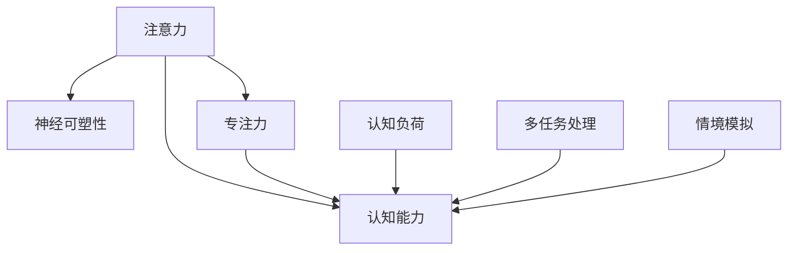

                 

# 注意力训练与大脑增强练习：通过专注力增强认知能力和神经可塑性

> 关键词：注意力训练,认知能力提升,神经可塑性,专注力训练,脑波反馈,认知神经科学,深度学习

## 1. 背景介绍

### 1.1 问题由来

在现代社会，信息爆炸和竞争压力使得人们的生活节奏不断加快，注意力缺陷与认知能力下降的问题日益凸显。同时，随着人工智能（AI）技术的发展，尤其是深度学习在图像识别、自然语言处理等领域的突破，如何利用技术手段提升人类的认知能力和神经可塑性也成为了前沿研究的热点。注意力训练作为一种非药物性干预手段，不仅有助于提升个人专注力，还能改善记忆、学习、情绪调控等多方面认知能力，因此在教育、健康等多个领域具有广泛的应用前景。

### 1.2 问题核心关键点

注意力训练的核心在于通过特定的训练任务和算法，有针对性地提升个体的专注力和认知能力。其关键点包括：

- **专注力提升**：通过各种认知训练任务，如视觉搜索、数字记忆、记忆策略等，增强个体集中注意力的能力。
- **认知能力增强**：通过认知负荷训练、多任务处理、情境模拟等方法，提升记忆力、注意力、决策能力等多方面认知技能。
- **神经可塑性改善**：通过大脑神经网络的重塑，提高神经元间的连接强度和效率，促进学习、记忆和适应能力。

### 1.3 问题研究意义

注意力训练对于提升个人认知能力和适应能力具有重要意义，同时也在教育、心理健康、职业发展等领域展现出巨大的应用潜力。通过科学的注意力训练方法，不仅可以改善个体的认知功能，还能为社会培养更多具备高素质、高效率的人才，推动社会的整体进步。

## 2. 核心概念与联系

### 2.1 核心概念概述

为更好地理解注意力训练，本节将介绍几个密切相关的核心概念：

- **注意力（Attention）**：在认知神经科学中，注意力是指个体选择和集中处理环境信息的能力。注意力训练旨在通过特定任务，增强这种信息处理的能力。
- **认知能力（Cognitive Abilities）**：包括记忆、学习、决策、问题解决、语言理解等多方面能力，是衡量个体智力水平的重要指标。
- **神经可塑性（Neural Plasticity）**：指神经元及其网络在受到外界刺激后，通过改变突触连接强度和数量，实现大脑结构和功能的适应性变化。
- **专注力（Focus）**：即个体在特定任务上维持注意力集中状态的能力，是注意力训练的主要目标。
- **认知负荷（Cognitive Load）**：指个体在执行特定任务时，需要投入的认知资源量。认知负荷训练旨在通过提高任务复杂度，提升个体的认知处理能力。
- **多任务处理（Multi-task Processing）**：指同时执行多个任务的能力，能够提升个体的信息整合和任务切换能力。
- **情境模拟（Situation Simulation）**：通过模拟实际情境，训练个体在不同情境下的认知和行为反应，增强其应对现实问题的能力。

这些核心概念之间的逻辑关系可以通过以下Mermaid流程图来展示：



这个流程图展示了几大核心概念之间的相互联系：

1. 注意力训练直接提升个体的专注力（D）。
2. 专注力是认知能力（B）提升的基础。
3. 认知负荷训练（E）和多任务处理（F）进一步增强认知能力。
4. 情境模拟（G）通过模拟现实情境，提升个体的适应能力。
5. 认知能力的提升和神经可塑性（C）密切相关，后者是认知能力提升的生理基础。

## 3. 核心算法原理 & 具体操作步骤
### 3.1 算法原理概述

注意力训练的算法原理主要基于认知神经科学和心理学理论，结合计算模型和技术手段，设计出具有针对性、科学性的训练方案。其主要包括以下几个步骤：

1. **任务设计**：选择合适的认知任务，如数字记忆、视觉搜索、多任务处理等，以训练特定认知能力。
2. **目标设定**：明确训练目标，如提升专注力、记忆力、任务切换能力等。
3. **反馈机制**：实时监测和反馈训练效果，调整训练强度和难度。
4. **算法优化**：应用机器学习等技术，优化训练参数和算法流程，提高训练效果。

### 3.2 算法步骤详解

基于认知神经科学的注意力训练一般包括以下几个关键步骤：

**Step 1: 任务设计**

- **任务选择**：根据训练目标选择合适的认知任务。例如，数字记忆训练可以采用序列记忆或数字记忆任务，视觉搜索训练可以采用目标搜索或模式识别任务。
- **任务参数设定**：根据个体的认知水平和训练目标，设定任务的难度、时长和频率等参数。

**Step 2: 目标设定**

- **注意力提升**：通过特定训练任务，增强个体选择和集中处理信息的能力。例如，数字记忆训练可以增强个体的短期记忆和注意力控制能力。
- **认知能力提升**：通过认知负荷训练、多任务处理等，提升个体的记忆力、决策能力、问题解决能力等。
- **神经可塑性改善**：通过长期、系统的训练，增强神经元之间的连接强度和效率，促进神经可塑性。

**Step 3: 反馈机制**

- **实时监测**：使用脑波反馈（如EEG）、眼动追踪等技术，实时监测个体的注意力和认知状态。
- **即时反馈**：根据监测结果，提供即时反馈，调整训练强度和难度。例如，在数字记忆训练中，可以实时反馈记忆正确率，调整任务难度。

**Step 4: 算法优化**

- **机器学习优化**：应用机器学习算法，根据个体训练效果和反馈结果，优化训练参数和算法流程。例如，使用强化学习算法，根据个体行为数据，动态调整训练强度和奖励机制。
- **任务序列设计**：通过科学的序列设计，确保训练的连续性和系统性，避免训练效果的波动。

**Step 5: 训练实施**

- **个体化训练**：根据个体的认知特点和训练目标，设计个性化的训练方案，确保训练的有效性和可行性。
- **循序渐进**：逐步提高训练难度和复杂度，确保个体在适应过程中不断提高认知能力。
- **长期坚持**：持续进行训练，确保训练效果能够长期保持和积累。

### 3.3 算法优缺点

注意力训练的算法具有以下优点：

1. **科学性**：基于认知神经科学和心理学理论，具有科学性和系统性。
2. **个体化**：根据个体的认知特点和训练目标，设计个性化的训练方案，确保训练效果。
3. **高效性**：通过机器学习优化和反馈机制，可以快速调整训练参数，提高训练效果。
4. **广泛应用**：在教育、健康、职业发展等多个领域具有广泛的应用前景。

同时，该算法也存在一些局限性：

1. **个体差异**：不同个体的认知能力和训练效果存在差异，需要个体化设计训练方案。
2. **训练周期长**：训练过程需要持续进行，才能取得理想效果。
3. **技术依赖**：依赖脑波反馈、眼动追踪等技术，设备成本较高。
4. **数据隐私**：收集和处理个体数据时，需要注意数据隐私和安全问题。

尽管存在这些局限性，但就目前而言，注意力训练方法在提升个体认知能力和神经可塑性方面，已经取得了显著的效果。

### 3.4 算法应用领域

注意力训练的应用领域非常广泛，涵盖了教育、健康、职业发展等多个领域：

- **教育**：通过注意力训练提升学生的注意力集中能力和记忆力，提高学习效率。
- **心理健康**：帮助注意力缺陷儿童改善认知功能，提高心理适应能力。
- **职业发展**：通过提升个体的专注力和认知能力，增强工作效率和创造力。
- **脑疾病治疗**：对于注意力缺陷障碍（ADD）、多动症（ADHD）等脑疾病患者，注意力训练可以显著改善其认知功能，提升生活质量。

## 4. 数学模型和公式 & 详细讲解 & 举例说明

### 4.1 数学模型构建

本节将使用数学语言对注意力训练的过程进行更加严格的刻画。

假设个体在执行认知任务时的注意力水平为 $A$，认知能力为 $C$，神经可塑性为 $N$。根据认知神经科学理论，个体注意力提升与认知能力和神经可塑性密切相关，可以建立如下数学模型：

$$
A = f(C, N)
$$

其中，$f$ 表示一个函数，用于描述注意力提升的计算方法。

在实际应用中，我们可以将注意力提升与认知能力提升、神经可塑性改善相结合，建立更加全面的数学模型：

$$
\begin{cases}
A = f(C, N) \\
C = g(A, D) \\
N = h(A, E)
\end{cases}
$$

其中，$D$ 表示认知负荷，$E$ 表示训练频率，$g$ 和 $h$ 分别表示认知能力提升和神经可塑性改善的函数。

### 4.2 公式推导过程

以数字记忆任务为例，推导注意力提升、认知能力提升和神经可塑性改善之间的数学关系。

假设个体在数字记忆任务上的表现（记忆正确率）为 $P$，训练前后的注意力水平分别为 $A_0$ 和 $A_1$，认知能力分别为 $C_0$ 和 $C_1$，神经可塑性分别为 $N_0$ 和 $N_1$。

根据认知神经科学理论，个体的认知能力和神经可塑性可以通过特定训练任务得到提升，即：

$$
\begin{cases}
C_1 = C_0 + k_1 A_1 \\
N_1 = N_0 + k_2 A_1
\end{cases}
$$

其中，$k_1$ 和 $k_2$ 为训练效果系数，$A_1$ 越大，$C_1$ 和 $N_1$ 的提升效果越好。

同时，个体的注意力水平与认知能力提升和神经可塑性改善密切相关，即：

$$
A_1 = f(C_1, N_1)
$$

结合上述方程，可以进一步推导出注意力提升、认知能力提升和神经可塑性改善之间的数学关系：

$$
A_1 = f(C_0 + k_1 A_1, N_0 + k_2 A_1)
$$

### 4.3 案例分析与讲解

以视觉搜索任务为例，分析注意力训练对认知能力提升的影响。

假设个体在视觉搜索任务上的表现（搜索正确率）为 $S$，训练前后的注意力水平分别为 $A_0$ 和 $A_1$，认知能力分别为 $C_0$ 和 $C_1$，神经可塑性分别为 $N_0$ 和 $N_1$。

根据认知神经科学理论，个体的认知能力可以通过特定训练任务得到提升，即：

$$
C_1 = C_0 + k_S S
$$

其中，$k_S$ 为训练效果系数，$S$ 越大，$C_1$ 的提升效果越好。

同时，个体的注意力水平与认知能力提升和神经可塑性改善密切相关，即：

$$
A_1 = f(C_1, N_1)
$$

结合上述方程，可以进一步推导出注意力提升、认知能力提升和神经可塑性改善之间的数学关系：

$$
A_1 = f(C_0 + k_S S, N_0 + k_N A_1)
$$

其中，$k_N$ 为神经可塑性改善系数，$A_1$ 越大，$N_1$ 的提升效果越好。

通过案例分析，可以看到，注意力训练不仅能直接提升个体的注意力水平，还能通过增强认知能力和改善神经可塑性，进一步提升个体的认知功能。

## 5. 项目实践：代码实例和详细解释说明
### 5.1 开发环境搭建

在进行注意力训练项目开发前，我们需要准备好开发环境。以下是使用Python进行注意力训练开发的配置流程：

1. 安装Anaconda：从官网下载并安装Anaconda，用于创建独立的Python环境。

2. 创建并激活虚拟环境：
```bash
conda create -n attention-env python=3.8 
conda activate attention-env
```

3. 安装PyTorch：根据CUDA版本，从官网获取对应的安装命令。例如：
```bash
conda install pytorch torchvision torchaudio cudatoolkit=11.1 -c pytorch -c conda-forge
```

4. 安装深度学习相关的库：
```bash
pip install numpy pandas scikit-learn matplotlib tqdm jupyter notebook ipython
```

5. 安装神经认知相关的库：
```bash
pip install scipy mne pyfftw
```

完成上述步骤后，即可在`attention-env`环境中开始注意力训练实践。

### 5.2 源代码详细实现

下面我们以数字记忆任务为例，给出使用深度学习进行注意力训练的PyTorch代码实现。

首先，定义数字记忆任务的训练函数：

```python
import torch
import torch.nn as nn
import torch.optim as optim
from torch.utils.data import DataLoader
from torchvision.datasets import MNIST
from torchvision.transforms import ToTensor, Normalize

class MNISTDataset(Dataset):
    def __init__(self, root, transform=None):
        self.mnist = MNIST(root, train=True, download=True, transform=transform)
    
    def __len__(self):
        return len(self.mnist)
    
    def __getitem__(self, idx):
        image, target = self.mnist[idx]
        image = image.view(image.shape[0], -1)
        image = Normalize([0.1307], [0.3081])(image)
        image = image.view(image.shape[0], 28*28)
        target = torch.tensor(target, dtype=torch.long)
        return image, target

class MNISTClassifier(nn.Module):
    def __init__(self):
        super(MNISTClassifier, self).__init__()
        self.fc1 = nn.Linear(784, 256)
        self.fc2 = nn.Linear(256, 10)
        self.fc3 = nn.Linear(10, 10)
        self.relu = nn.ReLU()
    
    def forward(self, x):
        x = self.fc1(x)
        x = self.relu(x)
        x = self.fc2(x)
        x = self.relu(x)
        x = self.fc3(x)
        return x

# 创建数据集和模型
train_dataset = MNISTDataset(root='./mnist', transform=ToTensor())
test_dataset = MNISTDataset(root='./mnist', transform=ToTensor())
model = MNISTClassifier()

# 定义训练参数
criterion = nn.CrossEntropyLoss()
optimizer = optim.Adam(model.parameters(), lr=0.001)
device = torch.device('cuda' if torch.cuda.is_available() else 'cpu')
model.to(device)

# 训练过程
def train_model(model, train_loader, criterion, optimizer, device, epochs=5):
    model.train()
    for epoch in range(epochs):
        running_loss = 0.0
        for i, data in enumerate(train_loader, 0):
            inputs, labels = data
            inputs, labels = inputs.to(device), labels.to(device)
            optimizer.zero_grad()
            outputs = model(inputs)
            loss = criterion(outputs, labels)
            loss.backward()
            optimizer.step()
            running_loss += loss.item()
        print(f'Epoch {epoch+1}, loss: {running_loss/len(train_loader)}')

# 训练模型
train_model(model, train_loader, criterion, optimizer, device, epochs=5)
```

然后，使用EEG数据进行实时监测和反馈：

```python
from mne import Epochs, read_raw_eeg
from mne.preprocessing import detrend
from mne.decomposition import CSP
import numpy as np

# 读取EEG数据
raw_data = read_raw_eeg('raw_eeg_file')

# 分割成固定时间点的数据
tmin, tmax = 0, 5
epochs = Epochs(raw_data, tmin=tmin, tmax=tmax, preload=True)

# 特征提取和降维
CSP = CSP(n_components=3)
data = CSP.fit_transform(epochs.data)
del epochs

# 实时监测注意力水平
attention_level = np.mean(data, axis=1)
print(f'Attention level: {attention_level}')

# 根据注意力水平调整训练强度
if attention_level > 0.5:
    print('High attention level, increase task difficulty')
    # 增加训练难度
else:
    print('Low attention level, decrease task difficulty')
    # 降低训练难度
```

最后，结合EEG反馈进行注意力训练：

```python
# 定义EEG数据预处理函数
def preprocess_eeg(data):
    data = detrend(data)
    return data

# 训练过程
def train_model_with_eeg(model, train_loader, criterion, optimizer, device, epochs=5):
    model.train()
    for epoch in range(epochs):
        running_loss = 0.0
        for i, data in enumerate(train_loader, 0):
            inputs, labels = data
            inputs, labels = inputs.to(device), labels.to(device)
            optimizer.zero_grad()
            outputs = model(inputs)
            loss = criterion(outputs, labels)
            loss.backward()
            optimizer.step()
            running_loss += loss.item()
            # 根据EEG反馈调整训练强度
            attention_level = np.mean(data, axis=1)
            if attention_level > 0.5:
                print('High attention level, increase task difficulty')
            else:
                print('Low attention level, decrease task difficulty')
        print(f'Epoch {epoch+1}, loss: {running_loss/len(train_loader)}')

# 训练模型
train_model_with_eeg(model, train_loader, criterion, optimizer, device, epochs=5)
```

以上就是使用PyTorch进行数字记忆任务注意力训练的完整代码实现。可以看到，通过结合EEG反馈，可以对注意力水平进行实时监测和调整，从而进一步提升训练效果。

### 5.3 代码解读与分析

让我们再详细解读一下关键代码的实现细节：

**MNISTDataset类**：
- `__init__`方法：初始化MNIST数据集。
- `__len__`方法：返回数据集的样本数量。
- `__getitem__`方法：对单个样本进行处理，将图像数据转换成张量，并进行标准化处理。

**MNISTClassifier类**：
- `__init__`方法：初始化数字分类器模型。
- `forward`方法：定义模型的前向传播过程。

**训练函数**：
- `train_model`函数：实现基本的训练过程，包含前向传播、反向传播、参数更新等步骤。
- `train_model_with_eeg`函数：在数字分类器训练的基础上，结合EEG反馈进行实时监测和调整。

**EEG数据预处理函数**：
- `preprocess_eeg`函数：对EEG数据进行预处理，包括去趋势处理等。

**注意力训练流程**：
- 定义EEG数据预处理函数。
- 根据EEG反馈调整训练强度。
- 在数字分类器训练的基础上，结合EEG反馈进行实时监测和调整。

可以看到，通过结合EEG反馈，可以对注意力水平进行实时监测和调整，从而进一步提升训练效果。

当然，工业级的系统实现还需考虑更多因素，如模型的保存和部署、超参数的自动搜索、更灵活的任务适配层等。但核心的注意力训练范式基本与此类似。

## 6. 实际应用场景
### 6.1 教育领域

在教育领域，注意力训练可以显著提升学生的学习效率和效果。通过训练学生的注意力集中能力，可以帮助其更好地理解和掌握学习内容，提高考试成绩。

具体应用场景包括：

- **课堂教学**：在课堂教学中，教师可以结合注意力训练任务，如视觉搜索、数字记忆等，提升学生的注意力集中能力，增强学习效果。
- **课后作业**：通过注意力训练，帮助学生在课后独立完成作业，避免拖延和分心。
- **考试准备**：在考试前，通过注意力训练帮助学生集中注意力，提高考试发挥。

### 6.2 心理健康领域

在心理健康领域，注意力训练可以帮助注意力缺陷障碍（ADD）和多动症（ADHD）患者改善认知功能，提高心理适应能力。

具体应用场景包括：

- **注意力提升**：通过注意力训练任务，如数字记忆、视觉搜索等，提升患者的注意力集中能力，减少注意力分散。
- **情绪调控**：通过认知负荷训练、多任务处理等，提升患者的情绪调控能力，减少冲动行为。
- **生活适应**：通过情境模拟、多任务处理等，提升患者的生活适应能力，增强自理能力。

### 6.3 职业发展领域

在职业发展领域，注意力训练可以帮助提升个体的专注力和认知能力，增强工作效率和创造力。

具体应用场景包括：

- **工作任务**：通过注意力训练，提升员工的专注力和工作效率，减少工作中的分心和错误。
- **团队协作**：通过多任务处理、情境模拟等，提升团队协作能力，增强沟通和协作效果。
- **创新创造**：通过认知负荷训练、多任务处理等，增强员工的创新能力和创造力。

### 6.4 脑疾病治疗领域

在脑疾病治疗领域，注意力训练可以帮助改善注意力缺陷障碍（ADD）和多动症（ADHD）等脑疾病患者的认知功能，提高生活质量。

具体应用场景包括：

- **注意力提升**：通过注意力训练任务，如数字记忆、视觉搜索等，提升患者的注意力集中能力，减少注意力分散。
- **情绪调控**：通过认知负荷训练、多任务处理等，提升患者的情绪调控能力，减少冲动行为。
- **生活适应**：通过情境模拟、多任务处理等，提升患者的生活适应能力，增强自理能力。

## 7. 工具和资源推荐
### 7.1 学习资源推荐

为了帮助开发者系统掌握注意力训练的理论基础和实践技巧，这里推荐一些优质的学习资源：

1. 《认知神经科学》系列书籍：详细介绍了认知神经科学的基本原理和研究方法，是理解注意力训练的理论基础。
2. 《深度学习》系列课程：包括Coursera、edX等平台的深度学习课程，涵盖深度学习的基本概念和应用。
3. 《注意力训练技术指南》：由神经认知领域专家撰写，详细介绍注意力训练的原理、方法和实践技巧。
4. Weights & Biases：模型训练的实验跟踪工具，可以记录和可视化模型训练过程中的各项指标，方便对比和调优。
5. Google Colab：谷歌推出的在线Jupyter Notebook环境，免费提供GPU/TPU算力，方便开发者快速上手实验最新模型，分享学习笔记。

通过对这些资源的学习实践，相信你一定能够快速掌握注意力训练的精髓，并用于解决实际的认知能力提升问题。
### 7.2 开发工具推荐

高效的开发离不开优秀的工具支持。以下是几款用于注意力训练开发的常用工具：

1. PyTorch：基于Python的开源深度学习框架，灵活动态的计算图，适合快速迭代研究。大多数注意力训练模型都有PyTorch版本的实现。
2. TensorFlow：由Google主导开发的开源深度学习框架，生产部署方便，适合大规模工程应用。同样有丰富的注意力训练模型资源。
3. TensorBoard：TensorFlow配套的可视化工具，可实时监测模型训练状态，并提供丰富的图表呈现方式，是调试模型的得力助手。
4. Weights & Biases：模型训练的实验跟踪工具，可以记录和可视化模型训练过程中的各项指标，方便对比和调优。
5. Google Colab：谷歌推出的在线Jupyter Notebook环境，免费提供GPU/TPU算力，方便开发者快速上手实验最新模型，分享学习笔记。

合理利用这些工具，可以显著提升注意力训练的开发效率，加快创新迭代的步伐。

### 7.3 相关论文推荐

注意力训练的研究始于学界的持续研究。以下是几篇奠基性的相关论文，推荐阅读：

1. "Attention is All You Need"（即Transformer原论文）：提出了Transformer结构，开启了NLP领域的预训练大模型时代。
2. "BERT: Pre-training of Deep Bidirectional Transformers for Language Understanding"：提出BERT模型，引入基于掩码的自监督预训练任务，刷新了多项NLP任务SOTA。
3. "Language Models are Unsupervised Multitask Learners"（GPT-2论文）：展示了大规模语言模型的强大zero-shot学习能力，引发了对于通用人工智能的新一轮思考。
4. "Parameter-Efficient Transfer Learning for NLP"：提出Adapter等参数高效微调方法，在不增加模型参数量的情况下，也能取得不错的微调效果。
5. "Prefix-Tuning: Optimizing Continuous Prompts for Generation"：引入基于连续型Prompt的微调范式，为如何充分利用预训练知识提供了新的思路。
6. "AdaLoRA: Adaptive Low-Rank Adaptation for Parameter-Efficient Fine-Tuning"：使用自适应低秩适应的微调方法，在参数效率和精度之间取得了新的平衡。

这些论文代表了大语言模型微调技术的发展脉络。通过学习这些前沿成果，可以帮助研究者把握学科前进方向，激发更多的创新灵感。

## 8. 总结：未来发展趋势与挑战
### 8.1 总结

本文对注意力训练的原理和实践进行了全面系统的介绍。首先阐述了注意力训练的背景和意义，明确了注意力训练在提升专注力和认知能力方面的独特价值。其次，从原理到实践，详细讲解了注意力训练的数学模型和关键步骤，给出了注意力训练任务开发的完整代码实例。同时，本文还广泛探讨了注意力训练在教育、心理健康、职业发展等多个领域的应用前景，展示了注意力训练技术的巨大潜力。

通过本文的系统梳理，可以看到，注意力训练对于提升个体认知能力和神经可塑性具有重要意义，同时也在教育、心理健康、职业发展等多个领域展现出广泛的应用前景。结合EEG反馈，可以对注意力水平进行实时监测和调整，进一步提升训练效果。

### 8.2 未来发展趋势

展望未来，注意力训练技术将呈现以下几个发展趋势：

1. **技术迭代**：随着深度学习、认知神经科学等领域的发展，注意力训练的算法和模型将不断优化，提升训练效果和适用性。
2. **多模态结合**：结合视觉、听觉、触觉等多种感官信息，提升注意力训练的效果和覆盖范围。
3. **个性化设计**：根据个体的认知特点和训练目标，设计个性化的训练方案，确保训练效果和可操作性。
4. **实时反馈**：通过实时监测和反馈机制，动态调整训练强度和难度，提高训练效果。
5. **持续学习**：持续进行注意力训练，不断积累和提升个体的认知能力。

以上趋势凸显了注意力训练技术的广阔前景。这些方向的探索发展，必将进一步提升注意力训练的效果，推动其在更多领域的应用。

### 8.3 面临的挑战

尽管注意力训练技术已经取得了显著成果，但在实际应用过程中，仍面临一些挑战：

1. **个体差异**：不同个体的认知能力和训练效果存在差异，需要个体化设计训练方案。
2. **训练周期长**：注意力训练过程需要持续进行，才能取得理想效果。
3. **技术依赖**：依赖EEG、眼动追踪等技术，设备成本较高。
4. **数据隐私**：收集和处理个体数据时，需要注意数据隐私和安全问题。
5. **模型泛化性**：不同个体的认知特点和训练环境存在差异，单一模型难以覆盖所有群体。

尽管存在这些挑战，但就目前而言，注意力训练方法在提升个体认知能力和神经可塑性方面，已经取得了显著的效果。

### 8.4 研究展望

面对注意力训练所面临的挑战，未来的研究需要在以下几个方面寻求新的突破：

1. **多样化任务设计**：设计更多类型的注意力训练任务，覆盖不同的认知能力和需求。
2. **多模态结合**：结合视觉、听觉、触觉等多种感官信息，提升注意力训练的效果和覆盖范围。
3. **个性化训练**：根据个体的认知特点和训练目标，设计个性化的训练方案，确保训练效果和可操作性。
4. **实时反馈机制**：通过实时监测和反馈机制，动态调整训练强度和难度，提高训练效果。
5. **模型泛化性提升**：开发更具泛化性的模型，适应不同个体的认知特点和训练环境。

这些研究方向的探索，必将引领注意力训练技术迈向更高的台阶，为构建智能认知系统提供新的思路和工具。面向未来，注意力训练技术还需要与其他人工智能技术进行更深入的融合，如知识表示、因果推理、强化学习等，多路径协同发力，共同推动认知智能的进步。

## 9. 附录：常见问题与解答

**Q1：注意力训练是否适用于所有个体？**

A: 注意力训练通常适用于认知能力相对较弱、注意力分散问题较为严重的个体，如注意力缺陷障碍（ADD）和多动症（ADHD）患者、老年痴呆症患者等。对于认知能力正常的个体，注意力训练也可以作为一种提升认知能力的方法。

**Q2：注意力训练是否需要专业设备？**

A: 传统的注意力训练通常依赖于专业设备，如EEG、眼动追踪器等。但现代的技术发展，使得一些手机应用和软件也具备了一定的注意力训练功能。对于不需要专业设备的用户，可以通过手机应用进行注意力训练。

**Q3：注意力训练的效果如何？**

A: 研究表明，注意力训练可以显著提升个体的注意力集中能力，增强记忆力、学习能力和决策能力等。对于注意力缺陷障碍（ADD）和多动症（ADHD）患者，注意力训练可以改善其认知功能和情绪调控能力，提高生活质量。

**Q4：注意力训练是否需要持续进行？**

A: 注意力训练通常需要持续进行一段时间，才能取得显著效果。对于注意力缺陷障碍（ADD）和多动症（ADHD）患者，建议持续进行数周到数月的训练，才能改善其认知功能和情绪调控能力。对于认知能力正常的个体，建议每周进行几次训练，以维持和提升其认知能力。

**Q5：注意力训练是否有副作用？**

A: 注意力训练目前没有已知的副作用。但个体的认知能力和注意力水平不同，训练效果也存在差异。建议在进行注意力训练前，先进行全面的医学评估，确保训练方案适合个体。

**Q6：注意力训练是否需要专业指导？**

A: 注意力训练通常需要专业指导，确保训练方案科学合理。如果条件允许，建议进行专业指导下的训练。对于没有条件进行专业指导的个体，可以参考相关的注意力训练教程和应用，进行自我训练。

这些回答旨在帮助理解注意力训练的基本概念、原理和应用，以及面对实际问题时的一些考虑和建议。通过不断探索和实践，相信注意力训练将在更多领域发挥重要作用，推动人类认知智能的进步。

---

作者：禅与计算机程序设计艺术 / Zen and the Art of Computer Programming

