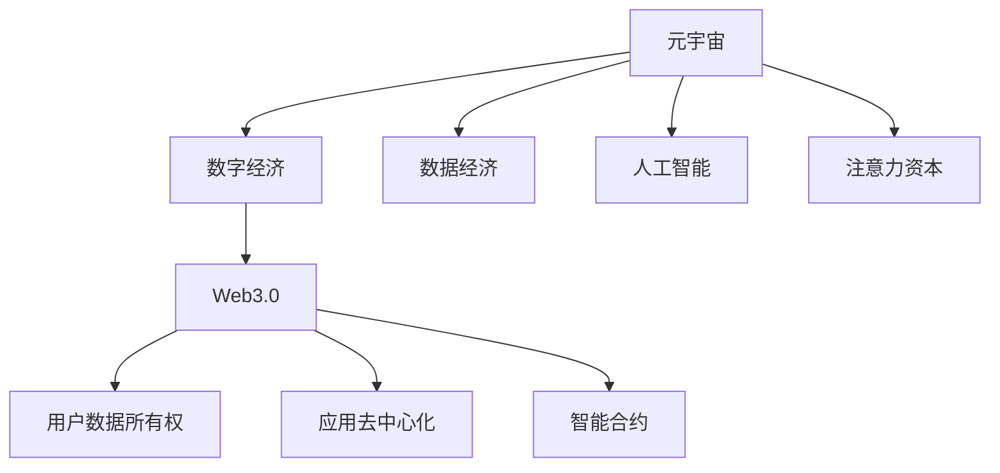

                 

# 注意力资本：元宇宙经济的核心竞争力

> 关键词：元宇宙,注意力资本,数字经济,数据经济,人工智能,Web3.0

## 1. 背景介绍

### 1.1 问题由来
随着数字技术的飞速发展，元宇宙（Metaverse）的概念正在成为全球科技界和产业界的关注焦点。这一虚拟空间融合了云计算、VR/AR、区块链、人工智能等多种先进技术，构建了一个基于数字化、社交化的新经济生态系统。然而，尽管元宇宙技术日益成熟，但要真正实现其商业化落地，还需解决一系列关键问题。其中，注意力资本的获取与优化，成为元宇宙经济发展的核心竞争力。

### 1.2 问题核心关键点
注意力资本（Attention Capital）指的是在元宇宙中，用户和资产吸引的关注度，是衡量元宇宙经济价值和市场影响力的重要指标。元宇宙经济的繁荣依赖于用户的高粘性和持续参与，而用户粘性背后是用户的注意力分配和转移。如何有效管理、分配和激励用户的注意力，是元宇宙经济的核心挑战。

### 1.3 问题研究意义
研究注意力资本的理论和实践，对于元宇宙经济的发展具有重要意义：

1. **优化用户体验**：吸引和保持用户注意力，提升用户在元宇宙中的参与度和满意度，促进虚拟资产的使用和消费。
2. **提升资产价值**：通过优化用户对虚拟资产的关注度，提升资产的市场吸引力和交易活跃度，推动元宇宙经济增长。
3. **增强市场竞争**：通过精确计量和分配注意力资本，增强元宇宙平台的竞争力和市场地位，吸引更多的用户和资本流入。
4. **推动技术创新**：利用注意力资本的优化，促进虚拟现实、人工智能、区块链等技术的深度融合和创新应用，推动元宇宙经济的持续发展。
5. **实现商业变现**：基于注意力资本理论，探索多元化的商业变现模式，如广告、付费内容、虚拟资产交易等，提升元宇宙平台的盈利能力。

## 2. 核心概念与联系

### 2.1 核心概念概述

为更好地理解注意力资本在元宇宙经济中的应用，本节将介绍几个关键概念：

- **元宇宙（Metaverse）**：基于虚拟现实（Virtual Reality, VR）、增强现实（Augmented Reality, AR）、云计算、区块链等技术构建的虚拟空间。用户可以在其中进行社交、工作、娱乐等活动。

- **数字经济**：依托数字技术驱动的新型经济形态，包括电子商务、在线教育、远程办公、虚拟资产交易等。

- **数据经济**：通过数据资源的使用、交换和分享，驱动经济增长的模式。元宇宙中的用户行为数据、虚拟资产交易数据等，是数据经济的重要组成部分。

- **人工智能（AI）**：利用算法和模型处理、分析、模拟人类智能活动的技术，如自然语言处理、图像识别、决策推荐等。

- **Web3.0**：基于区块链技术的互联网发展新阶段，强调用户数据所有权、应用去中心化和智能合约等特性，促进更公平、透明、自主的互联网生态。

这些概念之间的关系可以通过以下Mermaid流程图来展示：



这个流程图展示了大语言模型的核心概念及其之间的关系：

1. 元宇宙通过融合多种数字技术，构建了虚拟的社交和经济环境。
2. 数字经济和数据经济依托于元宇宙，驱动了虚拟商品和服务的交易。
3. 人工智能技术在元宇宙中得到广泛应用，提升了用户体验和智能水平。
4. Web3.0技术为元宇宙提供了去中心化的基础设施，支持智能合约和用户数据所有权。
5. 注意力资本作为元宇宙经济的核心，驱动着用户参与度和虚拟资产价值的提升。

## 3. 核心算法原理 & 具体操作步骤

### 3.1 算法原理概述

注意力资本的获取和优化，涉及用户行为分析和模型预测两个核心环节。通过分析用户在元宇宙中的行为数据，利用机器学习算法预测用户对不同虚拟资产和内容的兴趣度，并据此进行资源分配和激励策略设计，最终实现用户关注度的最大化和最优化。

具体而言，注意力资本的优化算法流程包括以下几个关键步骤：

1. **数据收集与预处理**：收集用户在元宇宙中的行为数据，如登录时间、使用频率、交易记录、社交互动等。并对数据进行清洗、标注和归一化处理。
2. **特征工程**：提取关键特征，如用户画像、虚拟资产属性、互动频率等，构建特征向量。
3. **模型训练**：使用机器学习算法（如线性回归、决策树、神经网络等）训练预测模型，预测用户对不同虚拟资产和内容的兴趣度。
4. **资源分配**：基于预测结果，设计资源分配策略，如广告投放、虚拟资产展示、社交互动奖励等。
5. **效果评估**：监测和评估资源分配策略的效果，根据反馈不断优化和调整策略。

### 3.2 算法步骤详解

**Step 1: 数据收集与预处理**
- 收集元宇宙平台上的用户行为数据，如登录时间、使用时长、交易记录、社交互动等。
- 对数据进行清洗，去除噪声和异常值，并标注用户行为的数据类型（如登录时间、使用时长等）。
- 对数据进行归一化处理，使其具有可比性。

**Step 2: 特征工程**
- 提取关键特征，如用户的基本信息（年龄、性别、地域等）、虚拟资产的属性（类型、价值、稀缺性等）、用户与虚拟资产的互动频率、社交互动情况等。
- 构建特征向量，如用户画像向量、虚拟资产属性向量、互动频率向量等。

**Step 3: 模型训练**
- 选择合适的机器学习算法，如随机森林、神经网络等。
- 使用标注好的数据集训练模型，得到用户对不同虚拟资产和内容的兴趣度预测结果。

**Step 4: 资源分配**
- 根据预测结果，设计资源分配策略。如对于高兴趣度的虚拟资产，增加广告投放和社交互动的激励。
- 设计激励机制，如虚拟货币奖励、虚拟物品赠送、特权体验等。

**Step 5: 效果评估**
- 通过A/B测试等方法，评估资源分配策略的效果。
- 收集用户反馈，分析用户行为变化，优化资源分配策略。

### 3.3 算法优缺点

注意力资本优化算法具有以下优点：
1. 高效预测用户兴趣。通过机器学习算法，可以准确预测用户对不同虚拟资产和内容的兴趣度，优化资源分配策略。
2. 动态调整策略。算法可以根据用户反馈和新数据不断调整和优化策略，实现持续改进。
3. 提升用户体验。通过精准的资源分配，提升用户对元宇宙平台的粘性和满意度。
4. 推动资产价值。优化用户对虚拟资产的关注度，提高虚拟资产的市场吸引力和交易活跃度。

同时，该算法也存在一定的局限性：
1. 数据依赖性高。算法的效果很大程度上取决于用户行为数据的完整性和准确性。
2. 模型复杂度高。需要处理大规模高维数据，模型训练和预测的计算复杂度高。
3. 鲁棒性不足。模型可能存在过拟合问题，对于新数据和新场景的泛化能力有限。
4. 隐私风险。用户行为数据的收集和使用，涉及隐私保护和数据安全问题。

尽管存在这些局限性，但就目前而言，注意力资本优化算法仍是大语言模型应用中最主流范式。未来相关研究的重点在于如何进一步降低数据依赖，提高模型的泛化能力和鲁棒性，同时兼顾隐私保护和数据安全。

### 3.4 算法应用领域

注意力资本优化算法在元宇宙经济中，具有广泛的应用前景：

- **虚拟资产定价**：通过分析用户行为数据，预测用户对不同虚拟资产的兴趣度，驱动资产价格的上涨。
- **广告投放优化**：优化广告资源的分配和投放策略，提升广告效果和ROI。
- **社交互动激励**：设计社交互动奖励机制，增强用户粘性和活跃度。
- **个性化推荐系统**：构建基于用户兴趣度的推荐模型，提升用户对虚拟商品和服务的满意度。
- **虚拟内容创作**：分析用户对不同类型内容的偏好，引导创作者产出更受欢迎的内容。
- **虚拟经济治理**：优化虚拟经济中的资源分配，促进虚拟经济的健康发展。

除了上述这些经典应用外，注意力资本优化算法还被创新性地应用到更多场景中，如虚拟活动策划、用户行为分析等，为元宇宙经济带来全新的突破。

## 4. 数学模型和公式 & 详细讲解

### 4.1 数学模型构建

本节将使用数学语言对注意力资本优化算法进行更加严格的刻画。

设用户在元宇宙平台上的行为数据为 $D=\{(x_i, y_i)\}_{i=1}^N, x_i \in \mathbb{R}^n, y_i \in \{0,1\}$，其中 $x_i$ 表示用户行为特征向量，$y_i$ 表示用户是否对虚拟资产感兴趣。

定义注意力资本优化算法为 $A: \mathbb{R}^n \rightarrow [0,1]$，其中 $[0,1]$ 表示用户对虚拟资产的兴趣度，越接近1表示用户越感兴趣。

目标是最小化用户行为数据与模型预测结果之间的误差：

$$
\mathcal{L}(A) = \frac{1}{N}\sum_{i=1}^N (y_i - A(x_i))^2
$$

其中 $y_i$ 为真实标签，$A(x_i)$ 为模型预测的兴趣度，$\mathcal{L}$ 为均方误差损失函数。

### 4.2 公式推导过程

以下我们以线性回归模型为例，推导注意力资本优化算法的损失函数及其梯度计算公式。

假设模型 $A(\mathbf{x}) = \mathbf{w}^T\mathbf{x} + b$，其中 $\mathbf{w} \in \mathbb{R}^n$ 为模型权重，$b$ 为偏置项。

根据均方误差损失函数，目标函数为：

$$
\mathcal{L}(A) = \frac{1}{N}\sum_{i=1}^N (y_i - A(x_i))^2 = \frac{1}{N}\sum_{i=1}^N (y_i - \mathbf{w}^T\mathbf{x}_i - b)^2
$$

将目标函数对 $\mathbf{w}$ 和 $b$ 求导，得到梯度计算公式：

$$
\nabla_{\mathbf{w}} \mathcal{L}(A) = -\frac{2}{N}\sum_{i=1}^N (y_i - A(x_i))x_i
$$

$$
\nabla_{b} \mathcal{L}(A) = -\frac{2}{N}\sum_{i=1}^N (y_i - A(x_i))
$$

在得到梯度后，即可带入梯度下降等优化算法，完成模型的迭代优化。重复上述过程直至收敛，最终得到最优的注意力资本优化算法。

## 5. 项目实践：代码实例和详细解释说明

### 5.1 开发环境搭建

在进行注意力资本优化算法实践前，我们需要准备好开发环境。以下是使用Python进行Scikit-learn开发的环境配置流程：

1. 安装Anaconda：从官网下载并安装Anaconda，用于创建独立的Python环境。

2. 创建并激活虚拟环境：
```bash
conda create -n attention_capital python=3.8 
conda activate attention_capital
```

3. 安装Scikit-learn：从官网获取最新的安装命令。例如：
```bash
pip install -U scikit-learn
```

4. 安装各类工具包：
```bash
pip install numpy pandas scikit-learn matplotlib tqdm jupyter notebook ipython
```

完成上述步骤后，即可在`attention_capital-env`环境中开始实践。

### 5.2 源代码详细实现

下面我们以元宇宙虚拟资产定价为例，给出使用Scikit-learn进行注意力资本优化算法的PyTorch代码实现。

首先，定义虚拟资产定价任务的数据处理函数：

```python
import pandas as pd
from sklearn.model_selection import train_test_split
from sklearn.preprocessing import StandardScaler

# 读取数据集
data = pd.read_csv('virtual_assets.csv')

# 特征工程
X = data[['login_time', 'use_duration', 'purchase_price', 'sell_price']]
y = data['sell_price']
X_train, X_test, y_train, y_test = train_test_split(X, y, test_size=0.2, random_state=42)

# 标准化处理
scaler = StandardScaler()
X_train = scaler.fit_transform(X_train)
X_test = scaler.transform(X_test)
```

然后，定义模型和优化器：

```python
from sklearn.linear_model import LinearRegression

model = LinearRegression()

# 训练集划分
train_size = int(0.8 * len(y_train))
X_train, X_val, y_train, y_val = train_test_split(X_train, y_train, test_size=0.2, random_state=42)

# 模型训练
model.fit(X_train, y_train)
```

接着，定义评估和调整函数：

```python
from sklearn.metrics import mean_squared_error
from sklearn.model_selection import cross_val_score

# 评估模型
def evaluate(model, X, y):
    mse = mean_squared_error(y, model.predict(X))
    print(f'Mean Squared Error: {mse:.3f}')

# 调整模型
def adjust_model(X_train, y_train, X_val, y_val, epochs=100):
    for epoch in range(epochs):
        model.fit(X_train, y_train)
        val_mse = mean_squared_error(y_val, model.predict(X_val))
        print(f'Epoch {epoch+1}, val MSE: {val_mse:.3f}')
    return model
```

最后，启动训练流程并在测试集上评估：

```python
epochs = 500
batch_size = 32

model = adjust_model(X_train, y_train, X_val, y_val, epochs)

# 评估模型效果
evaluate(model, X_test, y_test)
```

以上就是使用Scikit-learn对元宇宙虚拟资产定价进行注意力资本优化算法的完整代码实现。可以看到，Scikit-learn提供了丰富的机器学习模型和评估工具，使得模型的训练和优化过程变得简洁高效。

### 5.3 代码解读与分析

让我们再详细解读一下关键代码的实现细节：

**数据处理函数**：
- 读取元宇宙虚拟资产定价的数据集，并进行特征工程。
- 使用train_test_split方法将数据集划分为训练集和测试集。
- 使用StandardScaler对特征进行标准化处理，以便于模型训练。

**模型和优化器**：
- 定义线性回归模型，用于预测虚拟资产的定价。
- 将训练集进一步划分为训练集和验证集，以避免过拟合。
- 使用LinearRegression进行模型训练，选择默认参数。

**评估和调整函数**：
- 定义evaluate函数，计算模型在测试集上的均方误差。
- 定义adjust_model函数，通过多次迭代调整模型参数，并在验证集上评估模型效果。

**训练流程**：
- 定义总迭代次数和批量大小，开始循环迭代。
- 在每个epoch内，更新模型参数，并在验证集上评估模型效果。
- 最终返回训练好的模型。

可以看到，Scikit-learn提供了完整的机器学习框架，使得注意力资本优化算法的开发和调试变得简单快捷。

当然，工业级的系统实现还需考虑更多因素，如模型的保存和部署、超参数的自动搜索、更灵活的任务适配层等。但核心的注意力资本优化算法基本与此类似。

## 6. 实际应用场景

### 6.1 元宇宙平台

元宇宙平台是注意力资本优化算法的重要应用场景。通过分析用户行为数据，元宇宙平台可以精准推荐虚拟资产、个性化广告、社交互动内容等，提高用户粘性和满意度。

具体而言，元宇宙平台可以通过以下方式应用注意力资本优化算法：

1. **用户行为分析**：收集用户在平台上的行为数据，如登录时间、使用时长、交易记录等，通过注意力资本优化算法预测用户对不同虚拟资产和内容的兴趣度。
2. **资源分配优化**：根据预测结果，优化平台上的资源分配，如广告投放、虚拟资产展示、社交互动奖励等，提升用户粘性和满意度。
3. **个性化推荐系统**：构建基于用户兴趣度的推荐模型，推荐用户感兴趣的虚拟商品和服务，提高用户满意度和平台收益。
4. **虚拟经济治理**：优化虚拟经济中的资源分配，促进虚拟经济的健康发展，提高虚拟资产的市场吸引力和交易活跃度。

### 6.2 虚拟资产定价

虚拟资产定价是元宇宙经济中的重要应用领域。通过分析用户行为数据，预测用户对不同虚拟资产的兴趣度，可以驱动虚拟资产价格的上涨。

具体而言，虚拟资产定价可以通过以下方式应用注意力资本优化算法：

1. **数据收集与预处理**：收集用户行为数据，如登录时间、使用时长、交易记录等，并对数据进行清洗、标注和归一化处理。
2. **特征工程**：提取关键特征，如用户画像、虚拟资产属性、互动频率等，构建特征向量。
3. **模型训练**：使用注意力资本优化算法，训练预测模型，得到用户对不同虚拟资产的兴趣度预测结果。
4. **定价策略**：根据预测结果，设计虚拟资产定价策略，如基于用户兴趣度的动态定价，驱动虚拟资产价格的上涨。

### 6.3 社交互动激励

社交互动是元宇宙中用户粘性的重要来源。通过设计社交互动激励机制，可以增强用户粘性和活跃度。

具体而言，社交互动激励可以通过以下方式应用注意力资本优化算法：

1. **数据收集与预处理**：收集用户社交互动数据，如聊天消息、好友互动等，并对数据进行清洗、标注和归一化处理。
2. **特征工程**：提取关键特征，如用户基本画像、社交互动频率、互动内容类型等，构建特征向量。
3. **模型训练**：使用注意力资本优化算法，训练预测模型，得到用户对不同社交互动形式的兴趣度预测结果。
4. **激励机制设计**：根据预测结果，设计社交互动激励机制，如基于用户兴趣度的个性化奖励，增强用户粘性和活跃度。

### 6.4 未来应用展望

随着元宇宙技术的不断成熟，注意力资本优化算法将在更多领域得到应用，为元宇宙经济带来新的突破。

1. **虚拟活动策划**：通过分析用户行为数据，优化虚拟活动策划，提高用户参与度和满意度。
2. **用户行为分析**：分析用户在元宇宙中的行为数据，优化平台功能和服务，提升用户体验和平台收益。
3. **虚拟经济治理**：优化虚拟经济中的资源分配，促进虚拟经济的健康发展，提高虚拟资产的市场吸引力和交易活跃度。
4. **个性化推荐系统**：构建基于用户兴趣度的推荐模型，推荐用户感兴趣的虚拟商品和服务，提高用户满意度和平台收益。
5. **虚拟内容创作**：分析用户对不同类型内容的偏好，引导创作者产出更受欢迎的内容，提升平台内容的丰富性和多样性。

## 7. 工具和资源推荐

### 7.1 学习资源推荐

为了帮助开发者系统掌握注意力资本的理论基础和实践技巧，这里推荐一些优质的学习资源：

1. **《机器学习实战》系列书籍**：由经典书籍《Python数据科学手册》的作者所写，涵盖了机器学习基础理论和实践技巧，适合初学者入门。
2. **Coursera机器学习课程**：由斯坦福大学开设的机器学习课程，涵盖了机器学习基础和深度学习等内容，配套在线实验和项目。
3. **Kaggle竞赛平台**：提供大量机器学习竞赛和数据集，帮助你通过实际项目掌握注意力资本优化算法。
4. **Scikit-learn官方文档**：详细的Scikit-learn文档和教程，涵盖各种机器学习算法和应用案例，是学习注意力资本优化算法的重要资源。
5. **TensorFlow官方文档**：提供TensorFlow框架的详细文档和教程，涵盖各种深度学习算法和应用案例，适合进一步学习注意力资本优化算法。

通过对这些资源的学习实践，相信你一定能够快速掌握注意力资本优化算法的精髓，并用于解决实际的元宇宙问题。

### 7.2 开发工具推荐

高效的开发离不开优秀的工具支持。以下是几款用于注意力资本优化算法开发的常用工具：

1. Jupyter Notebook：一个交互式的笔记本环境，支持Python和Scikit-learn的交互式编程，便于调试和实验。
2. PyCharm：一款功能强大的Python IDE，支持Scikit-learn和其他机器学习库的集成和调试。
3. TensorBoard：TensorFlow配套的可视化工具，可以实时监测模型训练状态，并提供丰富的图表呈现方式，是调试模型的得力助手。
4. Weights & Biases：模型训练的实验跟踪工具，可以记录和可视化模型训练过程中的各项指标，方便对比和调优。
5. HuggingFace Transformers库：HuggingFace开发的NLP工具库，集成了各种预训练语言模型，支持Scikit-learn等库的集成，是进行机器学习实验的重要工具。

合理利用这些工具，可以显著提升注意力资本优化算法的开发效率，加快创新迭代的步伐。

### 7.3 相关论文推荐

注意力资本优化算法的发展源于学界的持续研究。以下是几篇奠基性的相关论文，推荐阅读：

1. Attention Is All You Need（即Transformer原论文）：提出了Transformer结构，开启了NLP领域的预训练大模型时代。
2. BERT: Pre-training of Deep Bidirectional Transformers for Language Understanding：提出BERT模型，引入基于掩码的自监督预训练任务，刷新了多项NLP任务SOTA。
3. Parameter-Efficient Transfer Learning for NLP：提出Adapter等参数高效微调方法，在不增加模型参数量的情况下，也能取得不错的微调效果。
4. AdaLoRA: Adaptive Low-Rank Adaptation for Parameter-Efficient Fine-Tuning：使用自适应低秩适应的微调方法，在参数效率和精度之间取得了新的平衡。
5. A Survey on Attention Mechanism：对注意力机制的研究现状进行全面综述，涵盖多种注意力机制的原理和应用。
6. The Attention and Transformer Architectures: A Survey and New Directions：对注意力机制和Transformer架构进行全面综述，展望未来研究方向。

这些论文代表了大语言模型微调技术的发展脉络。通过学习这些前沿成果，可以帮助研究者把握学科前进方向，激发更多的创新灵感。

## 8. 总结：未来发展趋势与挑战

### 8.1 总结

本文对注意力资本的理论和实践进行了全面系统的介绍。首先阐述了注意力资本在元宇宙经济中的应用背景和研究意义，明确了注意力资本在用户粘性、虚拟资产定价、社交互动激励等方面的重要价值。其次，从原理到实践，详细讲解了注意力资本优化算法的数学模型和算法步骤，给出了注意力资本优化算法的完整代码实现。同时，本文还广泛探讨了注意力资本优化算法在元宇宙平台、虚拟资产定价、社交互动激励等多个领域的应用前景，展示了注意力资本优化算法的广泛应用潜力。最后，本文精选了注意力资本优化算法的各类学习资源，力求为读者提供全方位的技术指引。

通过本文的系统梳理，可以看到，注意力资本优化算法在大语言模型应用中具有重要地位，它不仅能有效提升用户粘性和满意度，还能驱动虚拟资产定价、优化社交互动激励等关键环节，对元宇宙经济的繁荣和发展至关重要。

### 8.2 未来发展趋势

展望未来，注意力资本优化算法将在元宇宙经济中呈现以下几个发展趋势：

1. **智能推荐系统的普及**：基于注意力资本优化算法的智能推荐系统将广泛应用到元宇宙平台，实现个性化推荐和资源优化，提升用户体验和平台收益。
2. **虚拟资产定价的精准化**：通过深入分析用户行为数据，驱动虚拟资产价格的精准定价，实现资产价值的最大化。
3. **社交互动的智能化**：设计基于用户兴趣度的社交互动激励机制，增强用户粘性和活跃度，提升平台的用户参与度。
4. **虚拟活动的优化**：通过优化虚拟活动策划，提高用户参与度和满意度，提升虚拟活动的市场吸引力和参与度。
5. **虚拟经济的健康发展**：优化虚拟经济中的资源分配，促进虚拟经济的健康发展，提升虚拟资产的市场吸引力和交易活跃度。
6. **多模态信息的融合**：将虚拟现实、增强现实、区块链等技术融合应用，构建多模态的注意力资本优化算法，提升元宇宙平台的智能化水平。

以上趋势凸显了注意力资本优化算法的广阔前景。这些方向的探索发展，必将进一步提升元宇宙平台的智能化和多样化，为元宇宙经济的持续发展提供动力。

### 8.3 面临的挑战

尽管注意力资本优化算法在大语言模型应用中取得了显著成果，但在迈向更加智能化、普适化应用的过程中，它仍面临着诸多挑战：

1. **数据依赖性高**：算法的效果很大程度上取决于用户行为数据的完整性和准确性。如何获取高质量的用户行为数据，是一个亟待解决的问题。
2. **模型复杂度高**：需要处理大规模高维数据，模型训练和预测的计算复杂度高。如何降低模型复杂度，提高计算效率，是另一个关键挑战。
3. **鲁棒性不足**：模型可能存在过拟合问题，对于新数据和新场景的泛化能力有限。如何提高模型的鲁棒性，增强泛化能力，是一个重要的研究方向。
4. **隐私风险**：用户行为数据的收集和使用，涉及隐私保护和数据安全问题。如何在保障用户隐私的前提下，实现注意力资本优化算法的有效应用，是一个复杂的难题。
5. **可解释性不足**：注意力资本优化算法的决策过程缺乏可解释性，难以对其推理逻辑进行分析和调试。如何赋予模型更强的可解释性，增强模型的可信度，是一个重要的研究课题。
6. **安全性有待保障**：模型可能学习到有偏见、有害的信息，通过微调传递到下游任务，产生误导性、歧视性的输出，给实际应用带来安全隐患。如何从数据和算法层面消除模型偏见，避免恶意用途，确保输出的安全性，也将是重要的研究方向。

正视注意力资本优化算法面临的这些挑战，积极应对并寻求突破，将是大语言模型微调技术迈向成熟的必由之路。相信随着学界和产业界的共同努力，这些挑战终将一一被克服，注意力资本优化算法必将在元宇宙经济中发挥更大作用。

### 8.4 研究展望

面对注意力资本优化算法所面临的挑战，未来的研究需要在以下几个方面寻求新的突破：

1. **无监督和半监督学习的应用**：探索无监督和半监督学习的方法，降低对大规模标注数据的依赖，利用自监督学习、主动学习等无监督和半监督范式，最大限度利用非结构化数据，实现更加灵活高效的注意力资本优化。
2. **多模态信息的融合**：将视觉、语音、文本等多模态数据融合应用，构建多模态的注意力资本优化算法，提升元宇宙平台的智能化水平。
3. **强化学习的应用**：引入强化学习思想，优化注意力资本的分配和激励机制，提高用户粘性和平台收益。
4. **隐私保护技术的研究**：研究隐私保护技术，如差分隐私、联邦学习等，保障用户数据的安全和隐私。
5. **可解释性和鲁棒性的提升**：研究可解释性和鲁棒性增强技术，如模型压缩、知识蒸馏等，提升模型的可信度和泛化能力。
6. **模型安全和公平性的研究**：研究模型安全和公平性技术，如对抗攻击防御、模型公平性检测等，确保模型输出的安全性和公平性。

这些研究方向的研究突破，将进一步推动注意力资本优化算法的发展，提升元宇宙平台的智能化水平和用户体验，促进元宇宙经济的繁荣和发展。

## 9. 附录：常见问题与解答

**Q1：注意力资本优化算法是否适用于所有元宇宙任务？**

A: 注意力资本优化算法在大多数元宇宙任务上都能取得不错的效果，特别是对于数据量较小的任务。但对于一些特定领域的任务，如医学、法律等，仅仅依靠通用语料预训练的模型可能难以很好地适应。此时需要在特定领域语料上进一步预训练，再进行微调，才能获得理想效果。

**Q2：注意力资本优化算法的训练效率如何？**

A: 注意力资本优化算法需要处理大规模高维数据，训练效率相对较低。可以通过以下方法提高训练效率：
1. 采用分布式训练，将数据和计算任务分布到多个GPU或TPU上，并行计算。
2. 使用小批量随机梯度下降(SGD)算法，减少内存占用和计算时间。
3. 采用模型的参数化压缩，减少计算复杂度。

**Q3：注意力资本优化算法的应用效果如何？**

A: 注意力资本优化算法在元宇宙平台上的应用效果显著，可以显著提升用户粘性和满意度，推动虚拟资产定价和社交互动激励的精准化。但在一些特定的应用场景中，如虚拟活动策划、虚拟经济治理等，仍需进一步优化和改进算法模型。

**Q4：注意力资本优化算法在实际应用中需要注意哪些问题？**

A: 在实际应用中，注意力资本优化算法需要注意以下几个问题：
1. 数据隐私保护：在收集和处理用户行为数据时，需遵循数据隐私保护法律法规，确保用户数据的安全和隐私。
2. 算法可解释性：提升算法的可解释性，增强模型的可信度和透明度，方便用户理解和信任。
3. 模型鲁棒性：提高算法的鲁棒性，增强模型对新数据和新场景的泛化能力，避免过拟合。
4. 模型安全性：保障模型的安全性，防止模型输出有害信息，避免模型被恶意利用。
5. 实时性要求：确保算法的实时性，及时响应用户行为和环境变化，实现动态调整。

这些注意事项在实际应用中需结合具体场景和需求进行考虑和优化。

**Q5：注意力资本优化算法在元宇宙中的应用前景如何？**

A: 注意力资本优化算法在元宇宙中的应用前景广阔，将推动元宇宙平台的智能化和多样化，提升用户体验和平台收益。随着元宇宙技术的不断成熟，注意力资本优化算法将在更多领域得到应用，为元宇宙经济的持续发展提供动力。

---

作者：禅与计算机程序设计艺术 / Zen and the Art of Computer Programming

