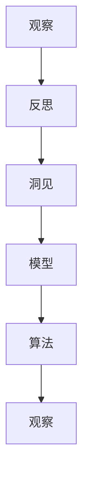

                 

# 洞见的形成：从观察到反思

## 1. 背景介绍

### 1.1 问题由来

在当今信息爆炸的时代，我们每天都在被海量的数据所包围。这些数据不仅来源于自然界，还包括了人类的各种活动。然而，这些数据并不是孤立的，它们之间存在着复杂的关系和因果联系。如何从这些数据中提取有价值的洞见，一直是人工智能领域的重要课题。

在过去的几十年里，数据科学和机器学习的发展为这一问题提供了一些解决方案。通过数据挖掘、机器学习等技术，可以从数据中提取模式、趋势和关联性，但这些方法更多地依赖于历史数据和先验知识。

在这个背景下，《洞见的形成：从观察到反思》这篇文章将探讨一种更深层、更全面的方法，即基于观察和反思的洞见形成方法，这种方法不仅依赖于数据，还强调了人类对数据进行观察和思考的能力。

### 1.2 问题核心关键点

这篇博文将围绕以下几个核心问题展开：

- **观察与反思**：如何通过观察和反思，从数据中提取出具有深刻意义的洞见。
- **模型与算法**：如何构建模型和算法，帮助人们更好地进行观察和反思。
- **实际应用**：如何将洞见应用于实际问题中，产生具体影响。
- **未来发展**：未来的技术趋势和面临的挑战。

## 2. 核心概念与联系

### 2.1 核心概念概述

为了更好地理解从观察到反思的洞见形成方法，本节将介绍几个关键概念及其相互关系：

- **观察**：通过感官或其他手段收集和分析数据，获取事实和信息。
- **反思**：对观察到的数据进行深入思考，识别出其中的模式、关系和因果联系。
- **洞见**：通过观察和反思形成的具有深刻意义和实际应用价值的见解。
- **模型**：数学或算法模型，用于对数据进行抽象和表示。
- **算法**：实现模型功能的步骤和方法。

这些概念之间通过观察-反思-洞见这一链条紧密联系在一起，形成了一个循环的过程。观察提供数据，反思提炼洞见，而模型和算法则支持这一过程的进行。

### 2.2 核心概念原理和架构的 Mermaid 流程图



这个流程图展示了观察、反思、洞见、模型和算法之间的关系。观察和反思是整个流程的起点，而模型和算法则支持这一过程的进行。洞见是观察和反思的最终成果，也是模型和算法的应用目标。

## 3. 核心算法原理 & 具体操作步骤

### 3.1 算法原理概述

从观察到反思的洞见形成方法，主要依赖于模型和算法，通过模型对数据进行抽象表示，并通过算法对数据进行分析和推理，从而形成洞见。这一过程可以分为以下几个步骤：

1. **数据收集与预处理**：从不同渠道收集数据，并对数据进行清洗、去重、归一化等预处理。
2. **模型构建**：选择合适的模型对数据进行抽象表示，如线性回归、决策树、神经网络等。
3. **数据拟合**：通过算法将模型参数拟合到数据中，形成模型预测。
4. **结果解释与反思**：对模型预测结果进行解释，识别出其中的模式和关系，进行反思。
5. **洞见提炼**：基于反思结果，提炼出具有深刻意义和实际应用价值的洞见。

### 3.2 算法步骤详解

**Step 1: 数据收集与预处理**

1. **数据来源**：数据可以来自各种渠道，如传感器、数据库、日志文件等。确保数据的多样性和代表性，避免偏差和噪声。
2. **数据清洗**：去除重复、缺失、异常值等不合法或无用的数据。
3. **数据归一化**：对数据进行标准化处理，使其在模型中具有更好的表现。

**Step 2: 模型构建**

1. **选择合适的模型**：根据问题的性质和数据的特点，选择适合的模型。
2. **模型训练**：使用训练数据对模型进行训练，优化模型参数。
3. **模型验证**：使用验证数据评估模型性能，防止过拟合。

**Step 3: 数据拟合**

1. **拟合方法**：常用的拟合方法包括梯度下降、牛顿法、正则化等。
2. **模型评估**：通过评估指标（如准确率、召回率、F1值等）评估模型效果。

**Step 4: 结果解释与反思**

1. **结果分析**：对模型预测结果进行详细分析，识别出其中的模式和关系。
2. **反思**：基于分析结果，进行深入思考，识别出可能的因果关系和深层次原因。

**Step 5: 洞见提炼**

1. **提炼方法**：将反思结果转化为具体的洞见，形成可操作性的建议或解决方案。
2. **应用实践**：将洞见应用于实际问题中，验证其效果。

### 3.3 算法优缺点

从观察到反思的洞见形成方法具有以下优点：

1. **全面性**：不仅依赖数据，还强调了观察和反思的重要性，能够更全面地理解数据背后的因果关系。
2. **深度性**：通过深度反思，能够识别出数据中的深层次模式和关系，形成具有实际应用价值的洞见。
3. **灵活性**：可以根据具体问题的特点，选择适合的模型和算法，灵活应对不同场景。

同时，该方法也存在一些缺点：

1. **复杂性**：相对于简单数据分析和机器学习，该方法需要更多的思考和分析，对用户的要求较高。
2. **时间成本**：从数据收集、模型构建到洞见提炼，整个过程可能需要较长的时间，对于时间敏感的问题，可能不够高效。
3. **主观性**：反思和洞见提炼过程中，依赖于用户的认知和经验，可能存在一定的主观性。

### 3.4 算法应用领域

从观察到反思的洞见形成方法可以应用于多个领域，如金融、医疗、教育、交通等。以下是一些具体应用案例：

- **金融风险管理**：通过分析历史交易数据，构建风险模型，识别出潜在的风险因素，优化投资策略。
- **医疗诊断**：通过对患者的病历数据进行分析和反思，提炼出病因和症状之间的关系，辅助医生进行诊断。
- **教育评价**：通过对学生成绩数据和行为数据进行分析，识别出影响学习效果的关键因素，优化教学方法。
- **智能交通**：通过对交通流量数据进行分析，构建交通预测模型，优化交通管理策略。

## 4. 数学模型和公式 & 详细讲解 & 举例说明

### 4.1 数学模型构建

假设我们有一组数据 $(x_1, y_1), (x_2, y_2), ..., (x_n, y_n)$，其中 $x_i$ 是特征向量，$y_i$ 是标签。我们希望构建一个线性回归模型，表示为 $y = \theta^T x + b$，其中 $\theta$ 是模型的权重向量，$b$ 是偏置项。

### 4.2 公式推导过程

1. **线性回归模型**：
   $$
   y = \theta^T x + b
   $$
2. **最小二乘法**：
   $$
   \min_{\theta, b} \sum_{i=1}^n (y_i - \theta^T x_i - b)^2
   $$
3. **梯度下降**：
   $$
   \theta = \theta - \alpha \frac{\partial}{\partial \theta} \sum_{i=1}^n (y_i - \theta^T x_i - b)^2
   $$
   其中 $\alpha$ 是学习率。

通过以上步骤，我们可以得到模型的最优参数 $\theta$ 和 $b$，用于对新的数据进行预测。

### 4.3 案例分析与讲解

假设我们有一组学生成绩数据，包含语文、数学、英语三门课程的分数。我们可以构建一个线性回归模型，预测学生的总成绩。具体步骤如下：

1. **数据准备**：收集学生的成绩数据，包括语文、数学、英语三门课程的分数和总成绩。
2. **特征工程**：将语文、数学、英语的分数作为特征向量 $x$，将总成绩作为标签 $y$。
3. **模型构建**：使用线性回归模型 $y = \theta^T x + b$ 来拟合数据。
4. **模型训练**：使用训练数据对模型进行训练，优化参数 $\theta$ 和 $b$。
5. **模型评估**：使用验证数据评估模型效果，调整参数。
6. **洞见提炼**：通过对模型结果的分析，识别出影响学生成绩的关键因素，如语文、数学、英语的成绩分布等。

## 5. 项目实践：代码实例和详细解释说明

### 5.1 开发环境搭建

在开始项目实践前，需要准备Python开发环境，并安装必要的库和工具。以下是一个简单的环境搭建步骤：

1. **安装Python**：确保系统中有Python 3.x版本，可以通过 `python --version` 检查。
2. **安装Anaconda**：从官网下载并安装Anaconda，用于创建和管理Python环境。
3. **创建虚拟环境**：使用 `conda create --name <env_name> python=3.8` 创建虚拟环境，激活环境后安装所需的库和工具。
4. **安装必要的库**：使用 `pip install <library>` 安装Python库，如NumPy、Pandas、Scikit-Learn等。

### 5.2 源代码详细实现

以下是一个简单的线性回归模型的实现，用于预测学生的总成绩：

```python
import numpy as np
from sklearn.linear_model import LinearRegression

# 准备数据
X = np.array([[60, 70, 80], [70, 80, 90], [80, 90, 100]])
y = np.array([280, 320, 380])

# 构建模型
model = LinearRegression()

# 训练模型
model.fit(X, y)

# 预测新数据
new_X = np.array([[65, 75, 85]])
y_pred = model.predict(new_X)

print(y_pred)
```

### 5.3 代码解读与分析

上述代码中，我们首先准备了数据集 `X` 和 `y`，然后构建了线性回归模型 `model`，并使用 `fit` 方法对模型进行训练。最后，使用 `predict` 方法对新数据 `new_X` 进行预测，得到预测结果 `y_pred`。

## 6. 实际应用场景

### 6.1 金融风险管理

在金融领域，风险管理是至关重要的一环。通过构建风险模型，可以对市场数据进行分析，识别出潜在的风险因素，优化投资策略，降低损失。

具体来说，可以通过对历史交易数据进行分析，构建风险模型，识别出市场波动、资金流动等风险因素。例如，可以使用机器学习模型预测股票价格的变化趋势，从而调整投资组合，规避风险。

### 6.2 医疗诊断

医疗诊断是一个高度依赖数据的领域，通过分析患者的病历数据，可以构建疾病诊断模型，辅助医生进行诊断。

例如，可以对患者的病历数据进行分析，识别出病因和症状之间的关系，从而辅助医生进行诊断和治疗。还可以使用深度学习模型，对医学影像进行分析，识别出病灶和病变区域，提供更为精确的诊断结果。

### 6.3 教育评价

在教育领域，对学生的学习效果进行评价是一个重要环节。通过分析学生的成绩数据和行为数据，可以构建学习效果评估模型，识别出影响学习效果的关键因素。

例如，可以对学生的成绩数据进行分析，识别出哪些因素对成绩提升有显著影响，从而优化教学方法。还可以使用机器学习模型，对学生的行为数据进行分析，识别出学生的学习习惯和行为模式，提供个性化的学习建议。

### 6.4 智能交通

智能交通是一个复杂的多目标系统，通过对交通流量数据进行分析，可以构建交通预测模型，优化交通管理策略。

例如，可以对交通流量数据进行分析，识别出交通拥堵的原因和规律，从而优化交通信号控制策略。还可以使用深度学习模型，对交通监控视频进行分析，识别出车辆行为和交通情况，提供交通管理和应急预警。

## 7. 工具和资源推荐

### 7.1 学习资源推荐

1. **《机器学习实战》**：一本介绍机器学习基本概念和实践操作的经典书籍，适合初学者入门。
2. **Coursera的机器学习课程**：由斯坦福大学的Andrew Ng教授主讲的机器学习课程，涵盖机器学习的基本概念、算法和应用。
3. **Kaggle竞赛平台**：一个数据科学竞赛平台，可以参与各种机器学习和数据挖掘竞赛，提升实践能力。

### 7.2 开发工具推荐

1. **PyTorch**：一个基于Python的深度学习框架，具有强大的张量计算能力，适合进行复杂的深度学习模型开发。
2. **TensorFlow**：一个由Google主导的深度学习框架，具有广泛的生态系统和丰富的功能，适合进行大规模工程应用。
3. **Jupyter Notebook**：一个交互式的开发环境，支持Python代码的编写、执行和展示，适合进行数据科学和机器学习项目开发。

### 7.3 相关论文推荐

1. **《机器学习》**：由Tom Mitchell著，介绍机器学习的基本概念和算法，是机器学习领域的经典教材。
2. **《深度学习》**：由Ian Goodfellow等著，介绍深度学习的理论基础和实践方法，是深度学习领域的经典教材。
3. **《大数据时代》**：一本介绍大数据技术和应用的书籍，适合了解大数据领域的最新进展和应用案例。

## 8. 总结：未来发展趋势与挑战

### 8.1 研究成果总结

从观察到反思的洞见形成方法，已经在多个领域得到了广泛应用，取得了显著的效果。通过构建模型和算法，可以对数据进行深度分析和推理，提炼出具有深刻意义和实际应用价值的洞见。

### 8.2 未来发展趋势

未来，随着技术的发展，从观察到反思的洞见形成方法将继续拓展其应用范围，提升其实用性和普适性。以下是几个可能的趋势：

1. **自动化**：随着AI技术的发展，自动化的洞见形成方法将逐步普及，减轻人工的工作负担，提高工作效率。
2. **多模态数据融合**：未来的洞见形成方法将能够处理多种模态的数据，如文本、图像、视频等，实现多模态信息的融合。
3. **交互式决策支持**：通过智能决策支持系统，用户可以实时查询和获取洞见，辅助决策过程。
4. **分布式计算**：未来的洞见形成方法将能够在分布式环境中高效运行，处理大规模数据集。

### 8.3 面临的挑战

尽管从观察到反思的洞见形成方法已经取得了一些进展，但在实际应用中，仍面临以下挑战：

1. **数据隐私**：在使用数据进行分析和建模时，需要严格保护用户的隐私，避免数据泄露。
2. **数据质量**：数据的质量直接影响洞见的准确性和可靠性，需要保证数据的完整性、准确性和一致性。
3. **算法透明性**：算法的透明性和可解释性是用户信任的基础，需要确保算法的决策过程透明和可解释。
4. **模型泛化性**：模型的泛化性能直接影响洞见的实际应用效果，需要确保模型在多种场景下都能稳定工作。
5. **计算资源**：复杂的数据分析和模型训练需要大量的计算资源，需要优化算法和硬件配置。

### 8.4 研究展望

未来的研究将围绕以下几个方向展开：

1. **自动化算法**：开发更加自动化和智能化的算法，提高算法的效率和准确性。
2. **多模态融合**：研究和开发能够处理多模态数据并融合多模态信息的算法，提升洞见的全面性和准确性。
3. **解释性模型**：研究如何构建可解释的模型，增强算法的透明性和用户信任度。
4. **分布式计算**：研究如何在分布式环境中高效运行洞见形成算法，处理大规模数据集。
5. **隐私保护**：研究如何在保护用户隐私的前提下，进行数据处理和洞见提炼。

总之，从观察到反思的洞见形成方法具有广泛的应用前景和重大的实际价值，未来的研究将进一步拓展其应用范围，提升其效率和准确性，为人类社会的数字化和智能化提供更为可靠的技术支持。

## 9. 附录：常见问题与解答

**Q1: 什么是洞见？**

A: 洞见是通过观察和反思从数据中提炼出的具有深刻意义和实际应用价值的见解。

**Q2: 如何构建洞见形成模型？**

A: 构建洞见形成模型主要依赖于模型和算法，通过模型对数据进行抽象表示，并通过算法对数据进行分析和推理，从而形成洞见。

**Q3: 洞见形成方法适用于哪些领域？**

A: 洞见形成方法可以应用于金融、医疗、教育、交通等多个领域，通过数据分析和反思，提炼出具有实际应用价值的洞见。

**Q4: 从观察到反思的洞见形成方法有哪些优点和缺点？**

A: 优点包括全面性、深度性和灵活性。缺点包括复杂性、时间成本和主观性。

**Q5: 如何提升洞见形成模型的效率？**

A: 可以通过自动化算法、多模态融合、分布式计算等方法提升模型的效率和准确性。

