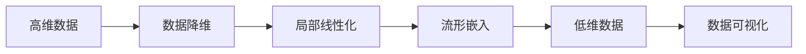

                 

# 流形学习 (Manifold Learning) 原理与代码实例讲解

> 关键词：流形学习, 降维, 非线性数据, 局部线性嵌入, 主成分分析(PCA), t-分布随机邻域嵌入(t-SNE)

## 1. 背景介绍

### 1.1 问题由来
在数据科学和机器学习领域，我们通常面临大量的高维数据。高维数据的处理和分析面临着“维数灾难”问题：随着维度的增加，数据的稀疏性、冗余性、计算复杂度等都会显著增加，导致模型性能下降，计算资源需求剧增。流形学习是一种处理高维数据的方法，通过将高维数据映射到低维流形上，使得数据在低维空间中更加紧凑、稀疏，从而降低计算复杂度，提高数据可解释性。

流形学习是降维的一种非线性方法，它假设高维数据存在于一个低维流形上。这意味着数据的局部特征可以在局部区域内线性化，整体上呈现出非线性结构。流形学习将高维数据投影到低维流形上，使得数据在低维空间中能够保持数据的局部结构和整体拓扑结构。这种方法在数据可视化、数据压缩、特征提取等领域有着广泛的应用。

### 1.2 问题核心关键点
流形学习的研究主要集中在以下几个关键点上：
1. **数据流形假设**：假设高维数据存在于一个低维流形上。
2. **局部线性化**：在局部区域内，数据可以线性化，整体上呈现非线性结构。
3. **低维投影**：通过某种方法将高维数据投影到低维空间，使得数据的局部结构和整体拓扑结构得以保留。
4. **降维算法设计**：设计降维算法，使得投影后数据能够保留尽可能多的信息，同时计算复杂度较低。

## 2. 核心概念与联系

### 2.1 核心概念概述

流形学习是一种非线性降维方法，旨在将高维数据映射到低维空间中，同时保留数据的局部和全局结构。流形学习的核心思想是通过局部线性化，将数据的局部区域映射到低维空间，整体上呈现非线性结构。

### 2.2 核心概念原理和架构的 Mermaid 流程图



### 2.3 核心概念之间的联系

1. **数据流形假设**：假设数据存在于一个低维流形上，是流形学习的理论基础。
2. **局部线性化**：在高维数据的局部区域内，数据可以近似线性化，这是流形学习能够进行降维的前提。
3. **流形嵌入**：将高维数据投影到低维流形上，同时保留数据的局部和全局结构。
4. **低维数据可视化**：将降维后的数据在低维空间中进行可视化，使得数据更加易于理解和分析。

## 3. 核心算法原理 & 具体操作步骤
### 3.1 算法原理概述

流形学习算法主要包括局部线性嵌入(LLE)、主成分分析(PCA)、t-分布随机邻域嵌入(t-SNE)等。其核心思想是在局部线性化前提下，通过最小化投影后数据的重构误差，实现数据的降维。

以局部线性嵌入(LLE)算法为例，其基本思路为：
1. 对高维数据进行局部邻域搜索，构建局部邻域图。
2. 对局部邻域图进行线性化，构建局部线性嵌入矩阵。
3. 求解局部线性嵌入矩阵的优化问题，得到投影矩阵。
4. 将高维数据投影到低维空间中，实现数据的降维。

### 3.2 算法步骤详解

**步骤1：数据预处理**

对原始数据进行预处理，包括数据归一化、标准化等。目的是使数据在同一尺度上，避免某些特征对降维结果的过度影响。

**步骤2：局部邻域搜索**

在高维空间中，对每个数据点进行局部邻域搜索，找到其最近邻数据点。这个过程可以通过欧式距离、余弦距离等度量方式进行。

**步骤3：构建局部邻域图**

根据局部邻域搜索的结果，构建局部邻域图。每个节点表示一个数据点，边表示节点之间的邻域关系。

**步骤4：局部线性化**

对局部邻域图进行线性化，构建局部线性嵌入矩阵。这个过程需要求解局部线性化的线性方程组，通常需要一些迭代算法，如SVD、QR等。

**步骤5：全局线性化**

将局部线性嵌入矩阵进行全局线性化，得到投影矩阵。这个过程通常需要通过一些全局优化算法，如PCA、t-SNE等，最小化数据的重构误差。

**步骤6：数据降维**

将高维数据投影到低维空间中，实现数据的降维。投影后的数据在低维空间中，保留数据的局部和全局结构。

### 3.3 算法优缺点

**优点：**
1. 保留数据的局部结构和整体拓扑结构。
2. 能够处理非线性数据，适用范围广泛。
3. 可以用于数据可视化，使得数据更加易于理解和分析。

**缺点：**
1. 计算复杂度高，需要构建局部邻域图和求解线性方程组。
2. 对于噪声敏感，容易产生“维数灾难”现象。
3. 对高维数据的处理效率较低，需要较长的计算时间。

### 3.4 算法应用领域

流形学习在多个领域中有着广泛的应用，包括：

1. **数据可视化**：将高维数据映射到低维空间，实现数据的可视化。
2. **数据压缩**：通过降维减少数据的存储空间，提高计算效率。
3. **特征提取**：通过降维提取数据的本质特征，提升数据的质量。
4. **模式识别**：通过降维识别数据中的模式和规律。
5. **生物信息学**：用于基因表达数据的降维，发现基因表达的模式和规律。
6. **遥感图像处理**：用于遥感图像的降维，提取遥感图像中的特征信息。

## 4. 数学模型和公式 & 详细讲解 & 举例说明

### 4.1 数学模型构建

局部线性嵌入(LLE)是一种典型的流形学习算法，其数学模型可以通过以下步骤构建：

1. 假设高维数据 $X \in \mathbb{R}^{n \times d}$，其中 $n$ 为数据点个数，$d$ 为维度。
2. 设数据点的局部邻域数为 $k$，邻域半径为 $\epsilon$。
3. 设局部邻域图为 $G=(V,E)$，其中 $V$ 表示数据点集合，$E$ 表示数据点之间的邻域关系。
4. 设局部线性嵌入矩阵为 $L \in \mathbb{R}^{k \times d}$，投影矩阵为 $A \in \mathbb{R}^{d \times d'}$。
5. 设低维数据为 $Y \in \mathbb{R}^{n \times d'}$。

### 4.2 公式推导过程

局部线性嵌入(LLE)的目标是找到投影矩阵 $A$，使得数据在高维空间中与在低维空间中的重构误差最小。具体来说，目标函数为：

$$
\min_{A} \frac{1}{2n}\sum_{i=1}^{n}||Y_i-AU_i||^2
$$

其中 $Y_i$ 为数据点 $i$ 在低维空间中的投影，$U_i$ 为数据点 $i$ 的高维邻域数据，$A$ 为投影矩阵，$U_i$ 为数据点 $i$ 的高维邻域数据。

求解上述目标函数，需要构建局部线性嵌入矩阵 $L$，满足：

$$
L=W^{1/2}D^{1/2}W^{-1/2}
$$

其中 $W$ 为邻域权重矩阵，$D$ 为度量矩阵，$D_{ij}=\sum_{m}w_{im}w_{jm}$。

求解局部线性嵌入矩阵 $L$ 的优化问题，通常需要通过迭代算法，如SVD、QR等，得到投影矩阵 $A$。

### 4.3 案例分析与讲解

以Iris数据集为例，分析局部线性嵌入(LLE)算法的应用。

**数据准备：**
```python
import numpy as np
from sklearn.datasets import load_iris
from sklearn.preprocessing import StandardScaler

# 加载Iris数据集
iris = load_iris()
X = iris.data
y = iris.target

# 数据标准化
scaler = StandardScaler()
X_scaled = scaler.fit_transform(X)

# 将数据划分为训练集和测试集
X_train, X_test, y_train, y_test = train_test_split(X_scaled, y, test_size=0.2, random_state=42)
```

**局部邻域搜索：**
```python
from sklearn.neighbors import KNeighborsGraph
from sklearn.manifold import LocallyLinearEmbedding

# 构建局部邻域图
kneighbors_graph = KNeighborsGraph(n_neighbors=5)
kneighbors_graph.fit(X_train)

# 使用局部线性嵌入算法进行降维
lle = LocallyLinearEmbedding(n_neighbors=5, n_components=2, method='modified_lle')
X_lle = lle.fit_transform(X_train)
```

**结果可视化：**
```python
import matplotlib.pyplot as plt

# 可视化降维后的数据
plt.scatter(X_lle[:, 0], X_lle[:, 1], c=y_train, cmap='viridis')
plt.xlabel('LLE component 1')
plt.ylabel('LLE component 2')
plt.title('Iris dataset with LLE')
plt.show()
```

通过上述代码，我们可以看到，Iris数据集在降维后的低维空间中，保留了数据的局部结构和整体拓扑结构，同时数据点在低维空间中更加紧凑、稀疏。

## 5. 项目实践：代码实例和详细解释说明
### 5.1 开发环境搭建

在进行流形学习实践前，我们需要准备好开发环境。以下是使用Python进行Scikit-learn开发的环境配置流程：

1. 安装Anaconda：从官网下载并安装Anaconda，用于创建独立的Python环境。

2. 创建并激活虚拟环境：
```bash
conda create -n sklear-env python=3.8 
conda activate sklear-env
```

3. 安装Scikit-learn：从官网获取对应的安装命令。例如：
```bash
conda install scikit-learn
```

4. 安装相关工具包：
```bash
pip install numpy pandas matplotlib seaborn
```

完成上述步骤后，即可在`sklear-env`环境中开始流形学习实践。

### 5.2 源代码详细实现

下面我们以局部线性嵌入(LLE)算法为例，给出使用Scikit-learn库进行流形学习的Python代码实现。

首先，定义局部线性嵌入函数：

```python
from sklearn.neighbors import KNeighborsGraph
from sklearn.manifold import LocallyLinearEmbedding

def local_linear_embedding(X, k_neighbors, n_components):
    # 构建局部邻域图
    kneighbors_graph = KNeighborsGraph(n_neighbors=n_neighbors)
    kneighbors_graph.fit(X)

    # 使用局部线性嵌入算法进行降维
    lle = LocallyLinearEmbedding(n_neighbors=n_neighbors, n_components=n_components, method='modified_lle')
    X_lle = lle.fit_transform(X)

    return X_lle
```

然后，定义数据处理函数：

```python
from sklearn.datasets import load_iris
from sklearn.preprocessing import StandardScaler
from sklearn.model_selection import train_test_split

def process_iris_data():
    # 加载Iris数据集
    iris = load_iris()
    X = iris.data
    y = iris.target

    # 数据标准化
    scaler = StandardScaler()
    X_scaled = scaler.fit_transform(X)

    # 将数据划分为训练集和测试集
    X_train, X_test, y_train, y_test = train_test_split(X_scaled, y, test_size=0.2, random_state=42)

    return X_train, X_test, y_train, y_test
```

最后，启动局部线性嵌入算法：

```python
# 数据预处理
X_train, X_test, y_train, y_test = process_iris_data()

# 局部线性嵌入
X_lle = local_linear_embedding(X_train, k_neighbors=5, n_components=2)

# 可视化降维后的数据
import matplotlib.pyplot as plt

plt.scatter(X_lle[:, 0], X_lle[:, 1], c=y_train, cmap='viridis')
plt.xlabel('LLE component 1')
plt.ylabel('LLE component 2')
plt.title('Iris dataset with LLE')
plt.show()
```

以上就是使用Scikit-learn进行局部线性嵌入(LLE)算法的完整代码实现。可以看到，Scikit-learn库提供了方便的API接口，使得流形学习的应用变得非常简单。

### 5.3 代码解读与分析

让我们再详细解读一下关键代码的实现细节：

**局部线性嵌入函数**：
- `kneighbors_graph`：构建局部邻域图。
- `lle`：使用局部线性嵌入算法进行降维。
- `X_lle`：返回降维后的数据。

**数据处理函数**：
- `iris`：加载Iris数据集。
- `scaler`：对数据进行标准化处理。
- `train_test_split`：将数据划分为训练集和测试集。

**启动局部线性嵌入算法**：
- `process_iris_data`：数据预处理。
- `local_linear_embedding`：调用局部线性嵌入函数进行降维。
- `matplotlib`：可视化降维后的数据。

可以看到，Scikit-learn库提供了方便的API接口，使得流形学习的应用变得非常简单。开发者可以将更多精力放在数据处理、模型改进等高层逻辑上，而不必过多关注底层的实现细节。

当然，工业级的系统实现还需考虑更多因素，如模型的保存和部署、超参数的自动搜索、更灵活的任务适配层等。但核心的流形学习过程基本与此类似。

## 6. 实际应用场景

### 6.1 金融风险管理

金融风险管理是流形学习的一个重要应用领域。金融机构通过收集大量的交易数据，利用流形学习算法进行降维，挖掘交易数据中的潜在风险。通过降维后的数据，金融机构能够更好地理解市场动态，发现潜在的风险点，采取相应的防范措施。

具体而言，可以构建金融市场的局部邻域图，对交易数据进行局部线性嵌入。降维后的数据可以在低维空间中更好地捕捉市场的趋势和波动，帮助机构及时预警风险。

### 6.2 图像处理

图像处理是流形学习的另一个重要应用领域。传统的图像处理方法通常基于像素级别的处理，忽略了图像中的局部结构。而流形学习算法可以提取图像的局部结构和整体拓扑结构，更好地捕捉图像中的特征信息。

例如，可以使用局部线性嵌入算法对图像进行降维，从而提取出图像的纹理、形状等特征信息。通过这些特征信息，可以实现图像分类、物体检测等任务。

### 6.3 社交网络分析

社交网络分析是流形学习的另一个重要应用领域。社交网络中的用户数据通常具有高维性，利用流形学习算法可以对其进行降维，提取出用户的局部结构和整体拓扑结构，更好地理解社交网络中的关系和行为。

具体而言，可以构建社交网络的局部邻域图，对用户数据进行局部线性嵌入。降维后的数据可以在低维空间中更好地捕捉用户之间的关系和行为模式，帮助企业分析用户行为，提升用户体验。

## 7. 工具和资源推荐

### 7.1 学习资源推荐

为了帮助开发者系统掌握流形学习的理论基础和实践技巧，这里推荐一些优质的学习资源：

1. 《机器学习实战》书籍：斯坦福大学机器学习课程的配套教材，介绍了机器学习的基本概念和常见算法。
2. 《Python机器学习》书籍：以Python为例，介绍了机器学习的实践过程和应用案例。
3. 《流形学习》书籍：详细介绍了流形学习的理论基础和算法实现，是流形学习领域的经典教材。
4. 《流形学习入门》博客：由深度学习领域专家撰写，深入浅出地介绍了流形学习的原理和应用。
5. Scikit-learn官方文档：提供了流形学习算法的API接口和详细的使用说明。

通过对这些资源的学习实践，相信你一定能够快速掌握流形学习的精髓，并用于解决实际的机器学习问题。

### 7.2 开发工具推荐

高效的开发离不开优秀的工具支持。以下是几款用于流形学习开发的常用工具：

1. Python：基于Python的机器学习语言，生态丰富，适用于快速迭代研究。
2. Scikit-learn：基于Python的机器学习库，提供了流形学习算法的API接口，使用方便。
3. Jupyter Notebook：基于Python的交互式开发环境，支持数据可视化和算法实现。
4. TensorBoard：用于可视化机器学习模型的训练过程和结果，提供丰富的图表呈现方式。
5. Matplotlib：用于绘制数据可视化的图表，支持多种数据类型和样式。

合理利用这些工具，可以显著提升流形学习的开发效率，加快创新迭代的步伐。

### 7.3 相关论文推荐

流形学习的研究源于学界的持续研究。以下是几篇奠基性的相关论文，推荐阅读：

1. Isomap: A Riemannian Metric on the Space of Density Estimated Manifolds by Jianbo Shi, Jitendra Malik。
2. Locally Linear Embedding for High-Dimensional Data by Roweis et al。
3. t-Distributed Stochastic Neighbor Embedding by Ma et al。
4. Nonlinear Dimensionality Reduction by Locally Linear Embedding by Roweis et al。
5. Graph Embedding and Ranking by Bronstein et al。

这些论文代表了大规模数据流形学习的演进历程，展示了流形学习算法的发展脉络。通过学习这些前沿成果，可以帮助研究者把握学科前进方向，激发更多的创新灵感。

## 8. 总结：未来发展趋势与挑战

### 8.1 总结

本文对流形学习算法进行了全面系统的介绍。首先阐述了流形学习的基本概念和研究背景，明确了流形学习在降维、数据可视化等领域的重要价值。其次，从原理到实践，详细讲解了流形学习的数学模型和操作步骤，给出了流形学习任务开发的完整代码实例。同时，本文还广泛探讨了流形学习算法在金融风险管理、图像处理、社交网络分析等多个行业领域的应用前景，展示了流形学习算法的强大潜力。

通过本文的系统梳理，可以看到，流形学习算法正在成为数据处理的重要手段，极大地拓展了数据的应用边界，催生了更多的落地场景。未来，伴随流形学习算法的持续演进，相信数据处理技术将进一步提升数据的质量和利用效率，为机器学习技术的产业化进程带来深远影响。

### 8.2 未来发展趋势

展望未来，流形学习算法将呈现以下几个发展趋势：

1. **算法多样性**：除了传统的局部线性嵌入(LLE)、主成分分析(PCA)、t-SNE等算法，未来将涌现更多高效的降维算法，如多视图学习、概率模型等。
2. **应用场景扩展**：流形学习算法在数据处理中的应用将进一步扩展，如生物信息学、医疗诊断、金融风险管理等领域。
3. **数据处理效率提升**：通过优化算法和硬件资源，流形学习算法的计算效率将进一步提升，能够处理更大规模的数据。
4. **模型可解释性增强**：流形学习算法将通过可解释模型、可视化技术等手段，增强模型的可解释性和可视化效果。
5. **融合多模态数据**：流形学习算法将与深度学习、图像处理、自然语言处理等技术进行深度融合，提升数据处理的综合能力。

以上趋势凸显了流形学习算法的广阔前景。这些方向的探索发展，必将进一步提升数据处理技术的应用范围和性能，为机器学习技术的产业化进程带来深远影响。

### 8.3 面临的挑战

尽管流形学习算法已经取得了瞩目成就，但在迈向更加智能化、普适化应用的过程中，它仍面临着诸多挑战：

1. **数据质量问题**：流形学习算法对数据的噪声和异常值较为敏感，需要高质量的数据进行训练。
2. **计算资源需求**：流形学习算法通常需要构建局部邻域图和求解线性方程组，计算复杂度较高。
3. **算法鲁棒性不足**：流形学习算法对数据的局部结构较为敏感，局部结构的变化可能会影响算法的性能。
4. **算法可扩展性差**：流形学习算法通常需要较高的计算资源和存储资源，难以扩展到大规模数据集上。

这些挑战限制了流形学习算法的应用范围和性能，未来需要进一步优化算法，提升计算效率和算法鲁棒性，同时寻找更好的数据处理策略。

### 8.4 研究展望

面对流形学习算法面临的挑战，未来的研究需要在以下几个方面寻求新的突破：

1. **数据预处理**：开发更高效的数据预处理算法，减少噪声和异常值的影响，提升数据质量。
2. **算法优化**：优化算法结构，减少计算复杂度，提升计算效率和算法鲁棒性。
3. **多模态数据融合**：将流形学习算法与深度学习、图像处理、自然语言处理等技术进行深度融合，提升数据处理的综合能力。
4. **分布式计算**：利用分布式计算技术，提升流形学习算法的可扩展性和计算效率。
5. **算法可解释性**：通过可解释模型、可视化技术等手段，增强流形学习算法的可解释性和可视化效果。

这些研究方向的探索，必将引领流形学习算法迈向更高的台阶，为数据处理技术带来新的突破。只有勇于创新、敢于突破，才能不断拓展流形学习算法的边界，推动数据处理技术的进步。

## 9. 附录：常见问题与解答

**Q1：流形学习算法适用于所有数据类型吗？**

A: 流形学习算法主要适用于高维数据，但也可以应用于低维数据。对于低维数据，流形学习算法可以进一步挖掘数据中的潜在结构和规律。

**Q2：局部线性嵌入(LLE)算法是否对数据量敏感？**

A: 局部线性嵌入(LLE)算法对数据量较为敏感，特别是在局部邻域搜索时，数据量过大可能会导致算法效率降低。因此，在处理大规模数据时，需要进行数据抽样或分块处理。

**Q3：流形学习算法是否适用于有噪声的数据？**

A: 流形学习算法对噪声数据较为敏感，需要数据预处理，如去噪、归一化等。在处理噪声数据时，可以采用局部线性嵌入(LLE)算法，通过局部邻域搜索减少噪声的影响。

**Q4：如何选择合适的流形学习算法？**

A: 选择合适的流形学习算法需要考虑数据的特征、计算资源和实际应用场景。对于大规模数据集，可以选择局部线性嵌入(LLE)算法或主成分分析(PCA)算法；对于低维数据集，可以选择t-SNE算法。

**Q5：流形学习算法是否可以在无监督情况下应用？**

A: 流形学习算法通常需要监督数据进行训练，但在某些特定应用场景下，可以通过自监督学习方法进行无监督学习，如自编码器、变分自编码器等。

通过对这些问题的解答，相信你能够更好地理解流形学习算法的基本概念和应用方法，并在实际项目中灵活应用。

