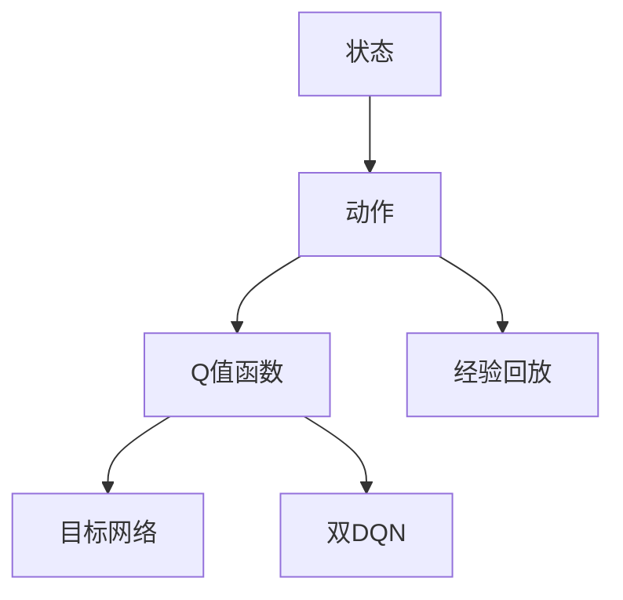

                 

## 1. 背景介绍

### 1.1 问题由来

随着人工智能技术的迅速发展，深度学习在机器人和自动化领域中得到了广泛的应用。机器人的行为通常由预先编程的规则控制，但在复杂的动态环境中，这些规则往往难以胜任。通过深度强化学习，特别是深度Q-learning（DQN）技术，机器人可以自主学习如何执行复杂的任务，并不断优化行为策略。

### 1.2 问题核心关键点

DQN通过在机器人与环境交互的过程中，使用深度神经网络逼近Q值函数，指导机器人选择最优的动作策略。该方法的核心思想是：利用Q值函数评估每个状态-动作对的价值，通过迭代更新Q值函数，使得机器人能够在未知环境中逐步学习到最优策略。

DQN的优缺点明显，其在处理复杂任务时表现出色，但在处理连续动作空间和状态空间时，需要额外的处理手段。此外，DQN对于过时的状态-动作对会有记忆，导致过拟合现象。解决这些问题的方法包括使用双DQN、经验回放、目标网络等技术。

### 1.3 问题研究意义

研究深度Q-learning技术在机器人领域的应用，对于提升机器人的智能化水平，增强机器人在复杂环境下的适应能力，具有重要意义：

1. **提升智能水平**：DQN使机器人能够从经验中学习，不断优化行为策略，增强其自主决策能力。
2. **应对动态环境**：DQN能够适应未知环境，通过试错不断优化策略，提高机器人在动态环境中的表现。
3. **简化控制算法**：相较于传统的基于规则的控制算法，DQN能够自适应地处理环境变化，减少人工干预。
4. **降低开发成本**：DQN通过自主学习，减少了机器人系统开发中的试错成本和时间。

## 2. 核心概念与联系

### 2.1 核心概念概述

为更好地理解深度Q-learning在机器人技术中的应用，本节将介绍几个关键概念及其联系：

- **深度Q-learning (DQN)**：一种基于深度神经网络逼近Q值函数，进行决策优化的强化学习算法。DQN能够处理连续动作空间和状态空间，并具有良好的泛化能力。
- **Q值函数**：用于评估状态-动作对的价值，指导机器人选择最优动作的函数。
- **状态**：机器人当前所处的环境状态，可以是位置、速度、方向等。
- **动作**：机器人可以执行的具体行为，如移动、转向、抓取等。
- **经验回放 (Experience Replay)**：记录和重放训练过程中的经验，减少过拟合，提升模型泛化能力。
- **目标网络 (Target Network)**：用于保存当前Q值函数的稳定版本，用于计算Q值的更新，增强模型的稳定性。
- **双DQN (Double DQN)**：一种改进的DQN算法，通过随机选择目标Q值函数，减少目标Q值函数的偏差，提高算法的稳定性。

这些概念之间的关系可以通过以下Mermaid流程图来展示：



## 3. 核心算法原理 & 具体操作步骤

### 3.1 算法原理概述

DQN的核心理念是使用深度神经网络逼近Q值函数 $Q(s, a)$，其中 $s$ 表示状态，$a$ 表示动作。Q值函数 $Q(s, a)$ 用于估计在状态 $s$ 下执行动作 $a$ 的预期收益，即 $Q(s, a) = r + \gamma \max_a Q(s', a')$，其中 $r$ 是即时奖励，$\gamma$ 是折扣因子，$s'$ 和 $a'$ 是下一个状态和最优动作。

DQN的训练过程分为两个部分：

1. **策略估计**：使用深度神经网络 $Q_{\theta}$ 逼近Q值函数，预测每个状态-动作对的Q值。
2. **策略优化**：通过不断的样例收集和经验回放，更新神经网络 $Q_{\theta}$ 的参数，使得Q值函数逼近最优Q值函数 $Q^*$。

### 3.2 算法步骤详解

DQN的具体实现步骤如下：

**Step 1: 准备环境与模型**

- 定义机器人与环境的交互方式，如使用PyBullet等模拟环境库。
- 创建深度神经网络作为Q值函数，选择适当的神经网络结构和参数。

**Step 2: 初始化**

- 初始化神经网络 $Q_{\theta}$ 的参数。
- 创建目标网络 $Q_{\theta^-}$ 作为 $Q_{\theta}$ 的稳定版本，用于计算Q值的更新。
- 初始化经验回放缓冲区，用于存储和重放训练经验。

**Step 3: 交互与训练**

- 在每个时间步，观察环境状态 $s_t$，随机选择动作 $a_t$。
- 执行动作 $a_t$，观察下一个状态 $s_{t+1}$ 和即时奖励 $r_t$。
- 将 $(s_t, a_t, r_t, s_{t+1})$ 存储到经验回放缓冲区。
- 从缓冲区中随机抽取一小批经验，使用蒙特卡洛方法计算Q值。
- 使用梯度下降更新 $Q_{\theta}$ 的参数，使得 $Q_{\theta}(s_t, a_t)$ 逼近 $Q^*(s_t, a_t)$。
- 使用目标网络 $Q_{\theta^-}$ 更新 $Q_{\theta}$ 的参数，以提高模型稳定性。

**Step 4: 策略评估**

- 在每个时间步，使用神经网络 $Q_{\theta}$ 预测Q值，选择最优动作 $a_t$。
- 通过不断迭代优化策略，使机器人能够在复杂环境中自主学习并优化行为策略。

### 3.3 算法优缺点

深度Q-learning技术在机器人领域的应用具有以下优点：

1. **自主学习**：DQN使机器人能够通过自主学习优化行为策略，减少人工干预。
2. **处理复杂任务**：DQN能够处理连续动作空间和状态空间，适合执行复杂的任务。
3. **泛化能力强**：DQN能够处理未知环境，通过经验学习，具有较强的泛化能力。
4. **结构简单**：相比于其他复杂的强化学习算法，DQN的实现相对简单，易于理解和实现。

同时，DQN也存在以下缺点：

1. **过拟合风险**：DQN在处理过时的状态-动作对时会有记忆，导致过拟合现象。
2. **内存占用大**：DQN需要存储大量的经验回放数据，对内存资源占用较大。
3. **计算复杂**：DQN的训练过程复杂，需要大量计算资源。

### 3.4 算法应用领域

深度Q-learning技术在机器人领域的应用非常广泛，包括但不限于以下几个领域：

- **自主导航**：DQN可用于自主导航机器人，使其在未知环境中学习最优路径。
- **机器人协作**：DQN可用于多机器人协作任务，如团队导航、共同搬运等。
- **机器人操作**：DQN可用于机器人操作任务，如抓取、放置等。
- **机器人游戏**：DQN可用于训练机器人玩电子游戏，提升其智能水平。
- **机器人维护**：DQN可用于机器人维护任务，如故障诊断、部件更换等。

这些应用领域展示了DQN在机器人技术中的巨大潜力，未来随着技术的不断进步，DQN将能够在更多复杂的场景中发挥作用。

## 4. 数学模型和公式 & 详细讲解 & 举例说明

### 4.1 数学模型构建

DQN的数学模型主要包含状态 $s$、动作 $a$、即时奖励 $r$ 和下一个状态 $s'$。

- $s_t$：当前状态。
- $a_t$：当前动作。
- $r_t$：即时奖励。
- $s_{t+1}$：下一个状态。

Q值函数的定义如下：

$$ Q_{\theta}(s, a) = r + \gamma \max_a Q_{\theta}(s', a') $$

其中，$\theta$ 是神经网络的参数，$\gamma$ 是折扣因子，$\max_a Q_{\theta}(s', a')$ 是选择下一个状态 $s'$ 和最优动作 $a'$ 的Q值。

### 4.2 公式推导过程

DQN的训练过程主要通过最小化经验Q值与真实Q值之间的误差，使用梯度下降方法更新神经网络参数。

假设经验回放缓冲区中有 $N$ 个经验 $(s_i, a_i, r_i, s_{i+1})$，其中 $i \in [0, N-1]$，则经验Q值可以表示为：

$$ Q^*_{\theta}(s_i, a_i) = r_i + \gamma \max_a Q^*_{\theta}(s_{i+1}, a') $$

其中，$Q^*_{\theta}(s_{i+1}, a')$ 是下一个状态 $s_{i+1}$ 和最优动作 $a'$ 的Q值。

定义目标网络 $Q_{\theta^-}$ 为 $Q_{\theta}$ 的稳定版本，则经验Q值的真实Q值可以表示为：

$$ Q^*_{\theta^-}(s_i, a_i) = r_i + \gamma \max_a Q^*_{\theta^-}(s_{i+1}, a') $$

因此，经验Q值与真实Q值之间的误差可以表示为：

$$ \Delta Q(s_i, a_i) = Q_{\theta}(s_i, a_i) - Q^*_{\theta^-}(s_i, a_i) $$

通过梯度下降更新神经网络参数，使得 $\Delta Q(s_i, a_i)$ 逼近0，即：

$$ \theta \leftarrow \theta - \eta \nabla_{\theta} \Delta Q(s_i, a_i) $$

其中，$\eta$ 是学习率，$\nabla_{\theta} \Delta Q(s_i, a_i)$ 是误差梯度。

### 4.3 案例分析与讲解

以下是一个简单的DQN应用案例，用于训练一个简单的机器人导航问题。

**问题描述**：在一个二维平面上，有一个机器人需要从起点 $(0, 0)$ 到达终点 $(1, 1)$。机器人可以在4个方向移动，每次移动一个单位。

**解决方案**：使用深度神经网络逼近Q值函数，训练机器人选择最优路径。

1. **环境定义**：使用PyBullet创建模拟环境，定义起点和终点。
2. **模型搭建**：搭建一个简单的神经网络，包含2个隐藏层，每个隐藏层包含10个神经元。
3. **训练过程**：在每个时间步，观察当前状态，随机选择动作，执行动作，观察下一个状态和即时奖励，将经验存储到缓冲区。
4. **经验回放**：从缓冲区中随机抽取一小批经验，计算Q值，更新神经网络参数。
5. **测试与评估**：测试机器人在不同起点到达终点的成功率。

通过这个过程，机器人在不断的交互中逐步学习到最优路径，并能够自主导航到目标位置。

## 5. 项目实践：代码实例和详细解释说明

### 5.1 开发环境搭建

在进行DQN实践前，我们需要准备好开发环境。以下是使用Python进行PyTorch开发的环境配置流程：

1. 安装Anaconda：从官网下载并安装Anaconda，用于创建独立的Python环境。

2. 创建并激活虚拟环境：
```bash
conda create -n pytorch-env python=3.8 
conda activate pytorch-env
```

3. 安装PyTorch：根据CUDA版本，从官网获取对应的安装命令。例如：
```bash
conda install pytorch torchvision torchaudio cudatoolkit=11.1 -c pytorch -c conda-forge
```

4. 安装相关工具包：
```bash
pip install numpy matplotlib tqdm gym
```

完成上述步骤后，即可在`pytorch-env`环境中开始DQN实践。

### 5.2 源代码详细实现

下面是使用PyTorch实现一个简单的DQN导航机器人的代码示例：

```python
import torch
import torch.nn as nn
import torch.optim as optim
import numpy as np
import gym
import random
import matplotlib.pyplot as plt

class DQN(nn.Module):
    def __init__(self, state_dim, action_dim):
        super(DQN, self).__init__()
        self.fc1 = nn.Linear(state_dim, 64)
        self.fc2 = nn.Linear(64, action_dim)

    def forward(self, x):
        x = F.relu(self.fc1(x))
        x = self.fc2(x)
        return x

class ReplayBuffer:
    def __init__(self, buffer_size):
        self.buffer_size = buffer_size
        self.memory = []

    def add(self, state, action, reward, next_state, done):
        if len(self.memory) < self.buffer_size:
            self.memory.append((state, action, reward, next_state, done))
        else:
            self.memory.pop(0)
            self.memory.append((state, action, reward, next_state, done))

    def sample(self, batch_size):
        return np.random.choice(self.memory, batch_size)

    def __len__(self):
        return len(self.memory)

class DQN_Agent:
    def __init__(self, state_dim, action_dim, learning_rate, discount_factor, replay_buffer_size):
        self.state_dim = state_dim
        self.action_dim = action_dim
        self.learning_rate = learning_rate
        self.discount_factor = discount_factor
        self.replay_buffer = ReplayBuffer(replay_buffer_size)
        self.model = DQN(state_dim, action_dim)
        self.target_model = DQN(state_dim, action_dim)
        self.target_model.load_state_dict(self.model.state_dict())

    def act(self, state):
        state = torch.tensor(state, dtype=torch.float).unsqueeze(0)
        with torch.no_grad():
            q_values = self.model(state).detach().cpu().numpy()
        action = np.argmax(q_values[0])
        return action

    def update(self, batch_size):
        batch = self.replay_buffer.sample(batch_size)
        states = torch.tensor([item[0] for item in batch], dtype=torch.float)
        actions = torch.tensor([item[1] for item in batch], dtype=torch.long)
        rewards = torch.tensor([item[2] for item in batch], dtype=torch.float)
        next_states = torch.tensor([item[3] for item in batch], dtype=torch.float)
        dones = torch.tensor([item[4] for item in batch], dtype=torch.float)
        q_values_next = self.target_model(next_states).detach().cpu().numpy()

        q_values = self.model(states).detach().cpu().numpy()
        target_q_values = rewards + self.discount_factor * np.max(q_values_next, axis=1)

        for target, real in zip(target_q_values, q_values[0]):
            target[actions[0]] = real

        loss = F.mse_loss(torch.tensor(target_q_values).unsqueeze(1), torch.tensor(q_values[0]).unsqueeze(1))
        self.optimizer.zero_grad()
        loss.backward()
        self.optimizer.step()

    def learn(self, batch_size, num_episodes):
        for episode in range(num_episodes):
            state = env.reset()
            state = torch.tensor(state, dtype=torch.float).unsqueeze(0)
            done = False
            total_reward = 0
            for t in range(1000):
                action = self.act(state)
                next_state, reward, done, _ = env.step(action)
                next_state = torch.tensor(next_state, dtype=torch.float).unsqueeze(0)
                self.replay_buffer.add(state, action, reward, next_state, done)
                state = next_state
                total_reward += reward

                if done:
                    break

            self.update(batch_size)

        if episode % 100 == 0:
            print(f"Episode: {episode}, Average Reward: {total_reward}")

env = gym.make('CartPole-v0')
state_dim = 4
action_dim = 2
learning_rate = 0.001
discount_factor = 0.99
replay_buffer_size = 1000
num_episodes = 1000

agent = DQN_Agent(state_dim, action_dim, learning_rate, discount_factor, replay_buffer_size)

plt.plot(range(num_episodes), [agent.episode[i] for i in range(num_episodes)])
plt.title("Episode vs Reward")
plt.xlabel("Episode")
plt.ylabel("Reward")
plt.show()
```

### 5.3 代码解读与分析

让我们再详细解读一下关键代码的实现细节：

**DQN类**：
- `__init__`方法：初始化神经网络结构和参数。
- `forward`方法：前向传播计算Q值。

**ReplayBuffer类**：
- `__init__`方法：初始化经验回放缓冲区。
- `add`方法：向缓冲区中添加经验。
- `sample`方法：从缓冲区中随机抽取一批经验。
- `__len__`方法：返回缓冲区大小。

**DQN_Agent类**：
- `__init__`方法：初始化神经网络、目标网络、优化器等。
- `act`方法：选择动作。
- `update`方法：使用经验回放更新模型参数。
- `learn`方法：在训练过程中，收集经验并更新模型。

**主程序**：
- 创建环境、定义状态和动作维度、设置超参数。
- 初始化DQN代理，开始训练过程。
- 记录每集的平均奖励，并在训练过程中打印。
- 使用matplotlib绘制奖励曲线。

这个代码示例展示了如何使用PyTorch实现一个简单的DQN导航机器人。通过不断的训练，机器人能够在不断的交互中学习到最优路径，并逐步提高其导航性能。

## 6. 实际应用场景

### 6.1 工业自动化

在工业自动化领域，DQN可以用于优化生产线的调度和管理。例如，在装配线上，机器人需要根据不同的产品和订单要求，灵活调整其位置和速度。DQN可以帮助机器人学习如何高效地完成任务，优化生产线的调度策略。

### 6.2 无人驾驶

在无人驾驶领域，DQN可以用于优化车辆的行驶路线和行为策略。通过在复杂的城市道路环境中进行训练，DQN能够学习如何安全、高效地行驶，避免交通事故和违规行为。

### 6.3 机器人医疗

在机器人医疗领域，DQN可以用于优化手术机器人的操作策略。例如，在微创手术中，DQN可以帮助手术机器人学习如何精确地操作，减少手术时间和术后恢复时间。

### 6.4 未来应用展望

随着DQN技术的不断进步，其在机器人领域的应用将更加广泛和深入。未来的研究方向包括：

1. **多任务学习**：DQN可以同时学习多个任务，提高机器人的多任务处理能力。
2. **对抗性训练**：DQN可以通过对抗性训练提高其鲁棒性和安全性。
3. **自适应学习**：DQN可以结合在线学习和自适应学习技术，进一步提高其学习效率和性能。
4. **异步训练**：DQN可以结合异步训练技术，提高训练效率和并行性。
5. **多智能体学习**：DQN可以结合多智能体学习技术，实现多机器人协作和协调。

## 7. 工具和资源推荐

### 7.1 学习资源推荐

为了帮助开发者系统掌握深度Q-learning技术，以下是几份推荐的学习资源：

1. 《Deep Reinforcement Learning with PyTorch》书籍：详细介绍了如何使用PyTorch实现深度强化学习算法，包括DQN。
2. 《Reinforcement Learning: An Introduction》书籍：深入浅出地介绍了强化学习的理论和应用，适合初学者学习。
3. 《Deep Q-Networks for Deep Reinforcement Learning》论文：介绍了DQN算法的原理和实现细节。
4. CS231n《深度学习与计算机视觉》课程：斯坦福大学开设的深度学习课程，涵盖了深度强化学习的内容。
5. PyTorch官方文档：PyTorch的官方文档提供了丰富的学习资源和样例代码。

通过学习这些资源，相信你能够快速掌握深度Q-learning技术的精髓，并用于解决实际的机器人问题。

### 7.2 开发工具推荐

DQN的开发工具主要包括：

1. PyTorch：基于Python的深度学习框架，支持动态图和静态图计算，适用于研究和原型开发。
2. TensorFlow：由Google开发的深度学习框架，支持分布式计算和异步训练，适用于大规模工程部署。
3. OpenAI Gym：Python的模拟环境库，支持各种环境，便于快速搭建和测试。
4. PyBullet：一个用于模拟机器人运动和物理环境的库，可以用于构建和测试机器人导航任务。
5. Jupyter Notebook：一个交互式的笔记本环境，支持Python编程和可视化展示。

合理利用这些工具，可以显著提升DQN的开发效率，加快技术迭代的速度。

### 7.3 相关论文推荐

深度Q-learning技术在机器人领域的研究也取得了诸多重要成果，以下是几篇代表性的论文：

1. "Human-level control through deep reinforcement learning"：DeepMind团队在《自然》杂志上发表的论文，展示了深度Q-learning在控制复杂任务中的应用。
2. "Playing Atari with deep reinforcement learning"：DeepMind团队在《自然》杂志上发表的论文，展示了深度Q-learning在游戏AI中的应用。
3. "Reinforcement learning for autonomous driving"：在《人工智能评论》杂志上发表的论文，展示了深度Q-learning在无人驾驶中的应用。
4. "Deep reinforcement learning for robotics"：在《机器学习杂志》上发表的论文，展示了深度Q-learning在机器人控制中的应用。

这些论文代表了大规模深度强化学习在机器人领域的研究方向，提供了丰富的理论基础和实践经验。

## 8. 总结：未来发展趋势与挑战

### 8.1 研究成果总结

本文对深度Q-learning在机器人技术中的应用进行了全面系统的介绍。首先，阐述了DQN的基本原理和核心概念，明确了其在机器人领域的研究背景和意义。其次，详细讲解了DQN的数学模型和算法步骤，给出了代码实现示例。同时，探讨了DQN在工业自动化、无人驾驶、机器人医疗等实际应用场景中的应用，展示了其巨大的潜力和应用前景。最后，推荐了相关的学习资源和工具，以便读者深入学习和实践。

通过本文的系统梳理，可以看到，DQN技术在机器人领域的研究已经取得了丰硕的成果，未来仍有很大的发展空间。

### 8.2 未来发展趋势

展望未来，深度Q-learning技术在机器人领域将呈现以下几个发展趋势：

1. **模型复杂度提升**：随着深度神经网络的发展，DQN的模型复杂度将不断提升，适用于更复杂的任务。
2. **多智能体学习**：DQN可以结合多智能体学习技术，实现多机器人协作和协调。
3. **异步训练**：DQN可以结合异步训练技术，提高训练效率和并行性。
4. **在线学习**：DQN可以结合在线学习技术，实时更新模型，适应动态环境。
5. **多任务学习**：DQN可以同时学习多个任务，提高机器人的多任务处理能力。
6. **自适应学习**：DQN可以结合自适应学习技术，进一步提高其学习效率和性能。

这些趋势凸显了DQN技术的广阔前景，未来随着技术的不断进步，DQN将能够在更多复杂的场景中发挥作用。

### 8.3 面临的挑战

尽管DQN技术在机器人领域的应用已经取得了重要进展，但在迈向更加智能化、普适化应用的过程中，仍面临诸多挑战：

1. **数据获取难度**：DQN需要大量的训练数据，获取高质量数据成本较高。
2. **模型复杂性**：DQN模型复杂度较高，训练和推理速度较慢。
3. **稳定性问题**：DQN在处理复杂环境时，容易发生不稳定现象，影响模型的可靠性和安全性。
4. **计算资源需求**：DQN训练过程复杂，需要大量的计算资源。
5. **可解释性**：DQN模型的决策过程缺乏可解释性，难以对其推理逻辑进行分析和调试。

### 8.4 研究展望

面对DQN面临的这些挑战，未来的研究需要在以下几个方面寻求新的突破：

1. **优化数据获取**：结合在线学习技术，实时获取高质量数据，降低数据获取成本。
2. **简化模型结构**：研究更加高效的结构设计，降低模型复杂度，提高训练和推理速度。
3. **增强模型稳定性**：研究稳定性和鲁棒性优化方法，提高模型的可靠性和安全性。
4. **结合多智能体学习**：研究多智能体学习技术，提高机器人的协作能力和协调性。
5. **提高可解释性**：研究可解释性技术，增强模型的决策过程的可解释性和透明性。

这些研究方向的探索，必将引领DQN技术迈向更高的台阶，为构建智能化机器人系统提供坚实的基础。

## 9. 附录：常见问题与解答

**Q1：DQN中的经验回放和目标网络的作用是什么？**

A: 经验回放通过记录和重放训练过程中的经验，减少过拟合，提高模型泛化能力。目标网络通过保存当前Q值函数的稳定版本，用于计算Q值的更新，增强模型的稳定性。

**Q2：DQN中的学习率应该如何设置？**

A: DQN中的学习率一般设定在 $10^{-3}$ 到 $10^{-4}$ 之间，具体值需要根据任务复杂度和训练数据量进行调试。过大的学习率容易破坏模型权重，导致过拟合。

**Q3：DQN在处理连续动作空间时如何进行优化？**

A: 在处理连续动作空间时，可以使用深度确定性策略网络（Deep Deterministic Policy Gradient, DDPG）等方法，将动作空间映射到连续向量空间中，再使用DQN进行优化。

**Q4：DQN中的折扣因子 $\gamma$ 应该如何设置？**

A: DQN中的折扣因子 $\gamma$ 一般设定在 $0.9$ 到 $0.99$ 之间，具体值需要根据任务和环境特性进行调试。$\gamma$ 的值越大，模型更加重视长远奖励，但容易出现无限循环问题。

**Q5：DQN中如何选择最优动作？**

A: DQN中的最优动作可以通过神经网络 $Q_{\theta}$ 预测Q值，选择Q值最大的动作。也可以使用$\epsilon$-贪心策略，在一定概率下随机选择动作，平衡探索和利用。

以上这些问题及其解答，帮助读者更好地理解DQN技术的实现细节和应用方法，推动DQN在机器人领域的研究和实践。

---

作者：禅与计算机程序设计艺术 / Zen and the Art of Computer Programming

